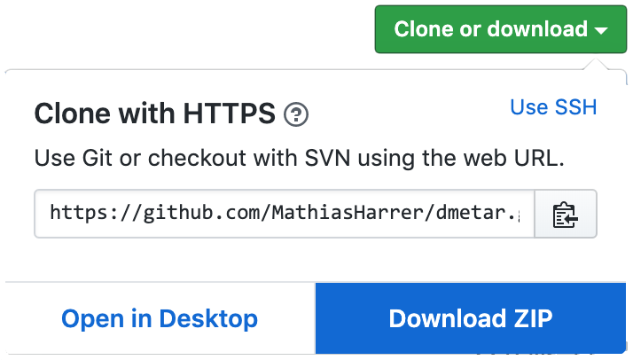

# RStudio & Basics


```{block,type='rmdinfo'}
Before we start with our meta-analysis, we have to download and prepare a **computer program** which allows us to use *R* for statistical analyses. 

Probably the best option for this at the moment is **RStudio**. This program gives us a user interface which makes it easier to handle our data, packages and output. The best part is that RStudio is **completely free** and can be downloaded anytime.

In this Chapter, we'll focus on how you can install RStudio on your computer. We'll also provide some general information on *R*, and how you can get help if you get error messages.

If you already have RStudio installed on your computer, and if you're an experienced *R* user already, all of this might be nothing new for you. You may **skip** this chapter then.

Especially if you have **never used R before, we would like to consider this Chapter essential**, as it gives you some input on how R works, and how we can use it for our data analyses.
```

<br><br>

---

## Getting RStudio to run on your computer {#RStudio}
```{r, echo=FALSE, fig.width=3,fig.height=2}
library(png)
library(grid)
img <- readPNG("_figs/rstudiologo.PNG")
grid.raster(img)
```

As a prerequisite for this guide, you need to have **RStudio** and a few essential **R packages** installed.

**You have to follow these steps to get your RStudio version set.**
   
1. Download RStudio on the **RStudio** Website ([Link](https://www.rstudio.com/products/rstudio/download/)). It's free!
2. If you do not have **R** installed yet, you will have to install the latest R Version before you can use RStudio. You can get the latest R version [here](https://cran.r-project.org/bin/windows/base/). You have to choose the right *R* version depending on the operating system you use (i.e., Windows or Mac).
3. Once RStudio is running, open the **Console** on the bottom left corner of your screen.
4. We will now install a few packages using R Code. Here's an overview of the packages, and why we need them:

```{r,echo=FALSE}
library(kableExtra)
Package<-c("tidyverse","meta","metafor")
Description<-c("This is a large bundle of packages which make it easy to manipulate and visualize data in R. Functions included in the tidyverse have become very popular in the R community in recent years, and are used by many researchers, programmers and data scientists. If you want to learn more about the tidyverse, you can click on this link: https://www.tidyverse.org/.", 
               "This package contains functions which make it easy to run different types of meta-analyses. We will primarily focus on this package in the guide, because it is easy to use, well documentated, and very versatile. More info on the meta package can be found here: http://www.imbi.uni-freiburg.de/lehre/lehrbuecher/meta-analysis-with-r.", 
               "The metafor package is also dedicted to conducting meta-analyses, and a true 'powerhouse' in terms of functionality. The package also provides more advanced tools, but may be a little involved for first time R users. However, because we will use this package at times in later chapters, and because metafor is used by the meta package for many applications, it is best to have it installed. The metafor package also has an excellent documentation for various meta-analysis-related topics, which can be found here: http://www.metafor-project.org/doku.php/metafor.")
m<-data.frame(Package,Description)
names<-c("Package", "Description")
colnames(m)<-names
kable(m)
```
  
<br><br>
5. To install these packages, we use the `install.packages()` function in R. One package after another, our code should look like this:

```{r, eval=FALSE}
install.packages("tidyverse")
install.packages("meta")
install.packages("metafor")
```

In RStudio, you simply have to type in the code displayed above into the the **Console** (usually, this is the bottom-left pane in your RStudio window) next to the little arrow (`>`) in the last line. Then hit **Enter ⏎**.

```{r, echo=FALSE, fig.width=6,fig.height=4,fig.align='center'}
library(png)
library(grid)
img <- readPNG("_figs/install_packages_tut.png")
grid.raster(img)
```

```{block, type='rmdachtung'}
Don't forget to put the packages in `""`. 

Otherwise, you will get an error message.
```

<br><br>

**You are now set and ready to proceed. Below, you can find some basic information on RStudio and troubleshooting**

### Running R Code

Order to get the most out of this guide, it's helpful (but not essential) if you have some programming experience already. If you’ve never programmed before, you might find ***Hands-On Programming with R*** [@grolemund2014hands] to be a useful primer.

There are three things you need to run the code: **R**, **RStudio**, and collection of **R packages**. Packages are the fundamental units of reproducible R code. They include reusable functions, the documentation that describes how to use them, and sample data.

Gladly, once you've reached this point successfully, these three things are set already. Nevertheless, we will have to install and load a few new packages at some place in this guide, for which you can use the `install.packages()` the same way as you did before.


### Getting Help
As you start to apply the functions described in this guide to your data you will soon find questions that the guide does not answer. This section describes a few tips on how to get help.

* If you get stuck somewhere, the best way is to start with **Google**. Google is particularly useful for error messages. If you get an error message and you have no idea what to do with it, try googling it first. The *R* community is very large, and chances are that someone else has been confused by it in the past, and there will
be help somewhere on the web. (If the error message isn’t in English,
run `Sys.setenv(LANGUAGE = "en")` and re-run the code; you’re
more likely to find help for English error messages.)
* If Google doesn’t help, try [stackoverflow](https://stackoverflow.com). Start by spending a little time searching for an existing answer; including [R] restricts your search to questions and answers that use R. 
* Lastly, if you stumble upon an error (or typos!) in this guide's text or *R* syntax, feel free to contact **Mathias Harrer** at **mathias.harrer@fau.de**.

<br><br>

---

## The *dmetar* package {#dmetar}

```{r, echo=FALSE, fig.width=4,fig.height=2}
library(png)
library(grid)
img <- readPNG("_figs/dmetar_head.png")
grid.raster(img)
```

In this guide, we want to make conducting meta-analyses as accessible and easy as possible for you as a researcher. Although there are fantastical packages like the `meta` and `metafor` package which do most of the heavy lifting, there are still some aspects of meta-analyses in the biomedical field and psychology which we consider important, but are **not easy** to do in *R* currently, particularly if you do not have a programming or statistics background.

To fill this gap, we developed the `dmetar` package, which serves as the companion *R* package for this guide. The `dmetar` package has its own documentation, which can be found [here](https://dmetar.protectlab.org). Functions of the `dmetar` package provide additional functionality for the `meta` and `metafor` packages (and a few other, more advanced packages), which we will be using frequently in this guide. Most of the functions included in the `dmetar` package and how they can improve your meta-analysis workflow will be described in detail throughout the guide.

```{block, type='rmdachtung'}
Although highly recommended, it is **not essential** to have the `dmetar` package installed to work through the guide. For each function of the package used in the guide, we will also provide the source code, which can be used to save the function locally on your computer, and the additional *R* packages those functions rely on. 

However installing the `dmetar` package beforehand is **much more convenient**, because all the functions will already be pre-installed on your computer.

```

<br></br>

### Installation of the `dmetar` package


#### Current R version

To install the `dmetar` package, the *R* version of your computer must be 3.5.2 or higher. If you have (re-)installed *R* recently, this will probably be the case. To check if your R version is new enough, you can paste this line of code into the Console, and then hit **Enter**.

```{r, eval=FALSE}
R.Version()$version.string
```

This will display the current *R* version you have. If the *R* version is below 3.5.2, you will have to update your *R* version. A tutorial on how to do this can be found [here](https://www.linkedin.com/pulse/3-methods-update-r-rstudio-windows-mac-woratana-ngarmtrakulchol/).

<br></br>

#### Devtools

If you want to install `dmetar`, one package already needs to be installed on your computer first. This package is called `devtools`. So, if `devtools` is not on your computer yet, you can install it like we did before:

```{r, eval=FALSE}
install.packages("devtools")
```

<br></br>

#### Installation process

You can then install `dmetar` using this line of code:

```{r, eval=FALSE}
devtools::install_github("MathiasHarrer/dmetar")
```

This will initiate the installation process. It is likely that the installation will take some time, because several other packages have to be installed along with the `dmetar` package for it to function properly. 

During the installation process, the installation manager may ask you if you want to update existing *R* packages on your computer. The output may look something like this:

```
These packages have more recent versions available.
Which would you like to update?

1: All                          
2: CRAN packages only            
3: None                          
4: ggpubr (0.2.2 -> 0.2.3) [CRAN]
5: zip    (2.0.3 -> 2.0.4) [CRAN]

Enter one or more numbers, or an empty line to skip updates:
```

When you get this message, it is best to first tell the installation manager that no packages should be updated. In this example, this means pasting `3` into the console and then hitting **Enter**. In the same vein, when the installation manager asks this question:

```
 There are binary versions available but the source versions are later:
 
 [...]
 
  Do you want to install from sources the package which needs compilation?
  y/n: 
```

It is best to first choose `n` (no). If the installation fails with these strategies, run the installation again, updating all packages this time.

```{block, type='rmdachtung'}
**"Failed to install 'unknown package' from GitHub"**

After having installed `devtools`, and then proceeding with the installation of the `dmetar` package, it is possible that the installation does not start and that you get the following error message:

{width=500px}

This error message can have various reasons, depending on your internet connection, location, operating system, and/or *R* version (see [thread](https://github.com/IRkernel/IRkernel/issues/493) for a similar issue). If you get this error message, you can try to download the `dmetar` package directly from [GitHub](https://github.com/MathiasHarrer/dmetar). On the GitHub site, click on the button **Clone or download**, and then on **Download ZIP**.

{width=250px}

After downloading, unzip the ZIP-folder, and drag the **dmetar-master** folder inside to a meaningful location on your computer. You can then install the `dmetar` package directly from your computer using the code shown below.

```

**For Windows:**

```{r, eval=FALSE}
devtools::install("C:\\Path\\To\\The\\Folder\\dmetar-master")
```

**For Mac:**

```{r, eval=FALSE}
devtools::install("~/Path/To/The/Folder/dmetar-master")
```

Where you have to replace the path shown in the above examples with the path to the **dmetar-master** folder on your computer.

**After the** `dmetar` **package is installed successfully, you can load it from your library:**

```{r, eval=FALSE}
library(dmetar)
```


If you are having trouble installing the package, you can copy the **entire output of the installation process**, including the **code** you entered, and the **error message** you receive, and send it to **Mathias** (mathias.harrer@fau.de).

<br></br>


