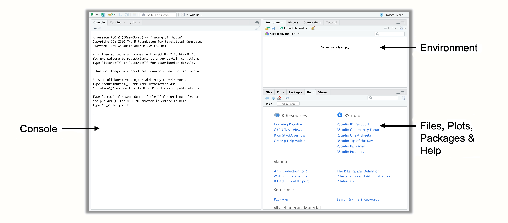
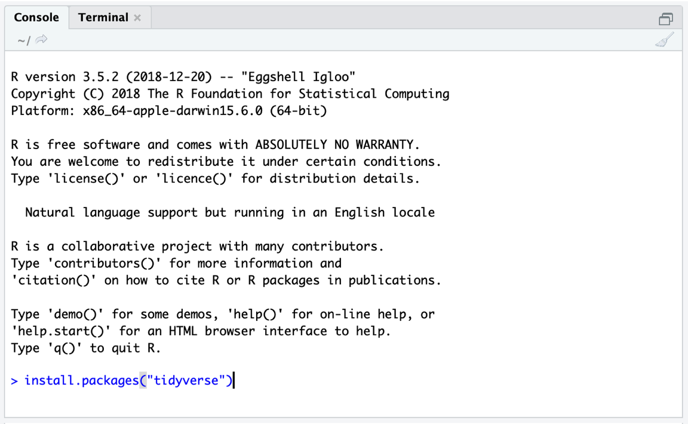
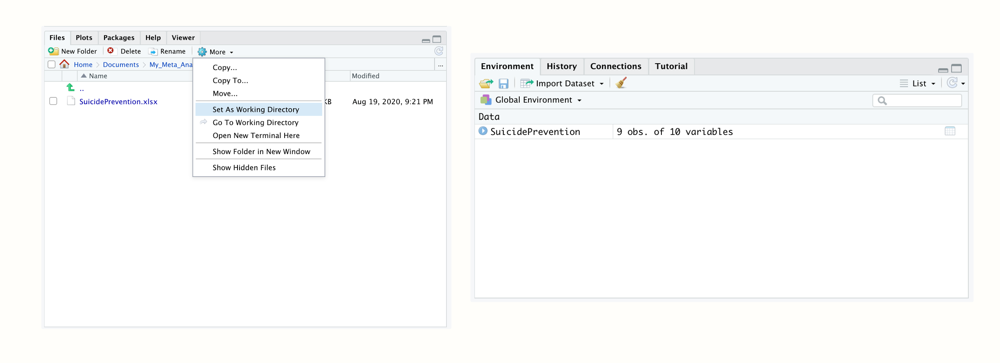

# Discovering R {#discovering-R}

---


<br></br>

<span class="firstcharacter">I</span>
n this chapter, we begin our journey into the _R_ universe. Possibly, this is your first-ever exposure to programming, and you might feel a little anxious. That is understandable, but there is no reason to worry. Over the last two decades, thousands of intelligent people all around the world have contributed ways to make working with _R_ easier and more convenient for its users. We will also get to know an extremely powerful computer program that we can use to make writing and running _R_ code much less cumbersome. 

Nevertheless, it is still harder to work with _R_ compared to other data analysis programs you may have used before. Hadley Wickham, one of the most important figures in the _R_ community, once stressed that _R_ is fundamentally different to **Graphical User Interface** (GUI) based software for statistics [@grolemund2014hands, Foreword]. GUIs allow you to perform data analyses just by clicking a few buttons, but you are ultimately limited to the functionality that the developers have deemed important. 

_R_, on the other hand, has none of these limitations but can require more background knowledge. Like any language, _R_ has to be learned, and it needs practice to become a proficient user. Frustration is an unpleasant, but natural part of this process. In the preface, you can find an entire section in which we describe a few things you can do if you get stuck.

We want to assure you that learning _R_ **is** worth it. _R_ is the most versatile, comprehensive and most frequently used statistical programming language. The _R_ community is rapidly expanding each and every year, and _R_ 's appeal is so large that even the New York Times found it newsworthy to report on it [@vance2009data]. 

Whether you are working in academia or at a company, the things you can do in _R_ will often seem like a superpower to others. But it is a superpower that everyone can learn, provided some time and effort. That being said, it is time to get started.

<br></br>

## Installing _R_ and R Studio {#install-R}

---

\index{R Studio}

Before we can begin, we have to download and prepare a computer program which allows us to use _R_ in a convenient way for our statistical analyses. Probably the best option for this at the moment is [**R Studio**](https://rstudio.com/). This program gives us a user interface which makes it easier to handle our data, packages and output. The best part is that R Studio is completely free and can be downloaded anytime on the Internet. Recently, an online version of R Studio has been [released](https://rstudio.cloud/), which provides you with largely the same interface and functionality through your web browser. In this book, however, we will focus on the R Studio version we install directly on our computer.

```{block, type='boxinfo'}
In this chapter, we will focus on how you can **install** _R_ and R Studio **on your computer**. If you have installed R Studio on your computer already, and if you are an experienced _R_ user, **none of this might be new for you**. You may skip this chapter then. If you have never used _R_ before, bear with us.
```


\index{Comprehensive _R_ Archive Network (CRAN)}

Let us go through the necessary steps to set up _R_ and R Studio for our first coding endeavors.

1. R Studio is an interface which allows us to write _R_ code and run it in an easy way. But R Studio is not identical with _R_; it requires that _R_ software is already installed on your computer. First, we therefore have to install the latest _R_ version. Like R Studio, _R_ is completely free. It can be downloaded from the **Comprehensive `R` Archive Network**, or CRAN, website. The type of _R_ you have to download depends on whether you are using a [Windows PC](https://cran.r-project.org/bin/windows/base/) or a [Mac](https://cran.r-project.org/bin/macosx/). An important detail about _R_ is its **version**. _R_ is regularly updated, meaning that new versions become available. When your _R_ version becomes too outdated, it may happen that some things will not work anymore. It is therefore helpful to update the _R_ version regularly, maybe roughly every year, by re-installing _R_. For this book, we are using _R_ version 4.0.3. By the time you install _R_, there may already be a higher version available, and it is advised to always install the latest version.

2. After you have downloaded and installed _R_, you can download "R Studio Desktop" from the [R Studio website](https://rstudio.com/products/rstudio/download/). There are also versions of R Studio for which you have to buy a license, but this is definitely not required for our purposes. Simply download and install the free version of R Studio Desktop.

3. The first time you open R Studio, it will probably look a lot like in Figure \@ref(fig:rstudio-1). There are three panes in R Studio. In the upper right corner, we have the **Environment** pane, which displays objects that we defined (i.e. saved) internally in _R_. In the bottom right corner, you can find the **Files, Plots, Packages and Help** pane. This pane serves several functions; for example, it is used to display files on your computer, show plots and installed packages, and to access the help pages. The heart of R Studio, however, is the left side, where you can find the **Console**. The console is where all the _R_ code is entered and then run.

```{r rstudio-1, fig.cap='Panes in R Studio.', out.width='100%', message = F, echo = F, fig.align='center'}
library(OpenImageR)

```

4. There is a fourth pane in R Studio that is usually not shown in the beginning, the **source** pane. You can open the source pane by clicking on **File** > **New File** > **R Script** in the menu. This will open a new pane in the upper left corner, containing an empty _R_ **script**. _R_ scripts are a great way to collect your code in one place; you can also save them as a file with the extension ".R" (e.g. **myscript.R**) on your computer. To run code in an _R_ script, select it by dragging your cursor across all relevant lines, and then click on the "Run" button to the right. This will send the code to the console, where it is evaluated. A shortcut for this is Ctrl + R (Windows) or Cmd + R (Mac).

<br></br>

## Packages {#packages}

---

\index{Package, _R_}
\index{Function, _R_}
\index{Function Argument}

We will now install a few **packages** using _R_ code. Packages are one of the main reasons why _R_ is so powerful. They allow experts all around the world to develop sets of **functions** that others can download and then use in _R_. Functions are the core elements of _R_ ; they allow us to perform a pre-defined type of operation, usually on our own data. 

There is a parallel between the mathematical formulation of a function, $f(x)$, and the way functions are defined in _R_. In _R_, a function is coded by first writing down its name, followed by brackets which contain the input and/or specifications for the function (so-called **arguments**). 

Say that we want to know what the square root of 9 is. In _R_, we can use the `sqrt` function for this. We simply have to provide `9` as the input to the function to get the result. You can try this yourself. Next to the little arrow (`>`) in your console, write down `sqrt(9)` and then hit Enter. Let us see what happens.


```{r}
sqrt(9)
```

We now received our first **output** from _R_. It tells us that the square root of 9 is 3. Although there are much more complex functions in _R_ than this one, they are all governed by the same principle: you provide information on parameters that a function requires, the function uses this information to do its calculations, and in the end, it provides you with the output.

\index{tidyverse Package}
\index{meta Package}
\index{metafor Package}

In _R_, we also use a function called `install.packages` to **install packages**. The only thing we have to tell this function is the name of the package we want to install. For now, there are three packages we should install because they will be helpful later on.

* **{tidyverse}**. The **{tidyverse}** package [@tidyverse] is not a single package, but actually a bundle of packages which make it easy to manipulate and visualize data in _R_. When we install the **{tidyverse}** package, this provides us with the **{ggplot2}**, **{dplyr}**, **{tidyr}**, **{readr}**, **{purrr}**, **{stringr}** and **{forcats}** package at the same time. Functions included in the tidyverse have become very popular in the _R_ community in recent years, and are used by many researchers, programmers and data scientists. If you want to learn more about the tidyverse, you can visit its [website](https://www.tidyverse.org/). 

* **{meta}**. This package contains functions which make it easy to run different types of meta-analyses [@meta]. We will primarily focus on this package in the guide, because it is easy to use, well documented, and very versatile. More info on the **{meta}** package can be found on its [website](http://www.imbi.uni-freiburg.de/lehre/lehrbuecher/meta-analysis-with-r).

* **{metafor}**. The **{metafor}** package [@urviecht] is also dedicated to conducting meta-analyses, and a true powerhouse in terms of functionality. Since we will use this package at times in later chapters, and because **{metafor}** is used by the **{meta}** package for many applications, it is best to have it installed. The **{metafor}** package also has an excellent [documentation](http://www.metafor-project.org/doku.php/metafor) for various meta-analysis-related topics.

The `install.packages` function only requires the name of the package we want to install as input. One package after another, our code should look like this:

```{r, eval=F}
install.packages("tidyverse")
install.packages("meta")
install.packages("metafor")
```

Simply type the code above into the console; then hit Enter to start the installation (see Figure \@ref(fig:rstudio-1)).

```{r rstudio-2, fig.cap='Installing a package.', out.width='75%', message = F, echo = F, fig.align='center'}
library(OpenImageR)

```

```{block2, type='boximportant'}
Do not forget to put the package names into **quotation marks** (`""`). Otherwise, you will get an error message.
```


After you hit Enter, _R_ will start to install the package and print some information on the progress of the installation. When the `install.packages` function is finished, the package is ready to be used. Installed packages are added to _R_ 's **system library**. This system library can be accessed in the **Packages** pane in the bottom left corner of your R Studio screen. Whenever we want to use the installed package, we can load it from our library using the `library` function. Let us try this out, and load the **{tidyverse}** package.

```{r, eval=F}
library(tidyverse)
```

<br></br>

## The **{dmetar}** Package {#dmetar}

---

\index{dmetar Package}

In this guide, we want to make conducting meta-analyses as accessible and easy as possible for you as a researcher. Although there are fantastic packages like the **{meta}** and **{metafor}** package which do most of the heavy lifting, there are still some aspects of meta-analyses which we consider important, but not easy to do in _R_ currently, particularly if you do not have a programming or statistics background.

To fill this gap, we developed the **{dmetar}** package, which serves as the companion _R_ package for this book. The **{dmetar}** package has its own documentation, which can be found [online](https://dmetar.protectlab.org/). Functions of the **{dmetar}** package provide additional functionality for the **{meta}** and **{metafor}** packages (and a few other, more advanced packages), which we will be using frequently in this guide. Most of the functions included in the **{dmetar}** package and how they can improve your meta-analysis work flow will be described in detail throughout the book. Most of the example data sets we are using in this guide are also contained in **{dmetar}**.

```{block2, type='boxinfo'}
Although highly recommended, it is **not essential** to have the **{dmetar}** package installed to work through the guide. For each function of the package, we will also provide the source code, which can be used to save the function locally on your computer, and the additional _R_ packages those functions rely on. We will also provide supplementary download links for data sets included in the package.

However, installing the **{dmetar}** package beforehand is much more convenient because this pre-installs all the functions and data sets on your computer.
```


\index{Version, _R_}

To install the **{dmetar}** package, the _R_ version on your computer must be 3.6 or higher. If you have (re-)installed _R_ recently, this will probably be the case. To check if your _R_ version is new enough, you can paste this line of code into the Console, and then hit Enter.

```{r, eval=F}
R.Version()$version.string
```

This will display the current _R_ version you have. If the _R_ version is below 3.6, you will have to update it. There are good [blog posts](https://www.linkedin.com/pulse/3-methods-update-r-rstudio-windows-mac-woratana-ngarmtrakulchol/) on the Internet providing guidance on how to do this.

If you want to install **{dmetar}**, one package already needs to be installed on your computer first. This package is called **{devtools}**. So, if **{devtools}** is not on your computer yet, you can install it like we did before.

```{r, eval=F}
install.packages("devtools")
```

You can then install **{dmetar}** using this line of code:

```{r, eval=F}
devtools::install_github("MathiasHarrer/dmetar")
```

This will initiate the installation process. It is likely that the installation will take some time because several other packages have to be installed along with the **{dmetar}** package for it to function properly. During the installation process, the installation manager may ask you if you want to update existing _R_ packages on your computer. The output may look something like this:

```
## These packages have more recent versions available.
## Which would you like to update?
## 
## 1: All                          
## 2: CRAN packages only            
## 3: None                          
## 4: ggpubr (0.2.2 -> 0.2.3) [CRAN]
## 5: zip    (2.0.3 -> 2.0.4) [CRAN]
## 
## Enter one or more numbers, or an empty line to skip updates:
```

When you get this message, it is best to tell the installation manager that no packages should be updated. In our example, this means pasting `3` into the console and then hitting Enter. In the same vein, when the installation manager asks this question:

```
## There are binary versions available but the source versions are later:
##  
##  [...]
##  
##   Do you want to install from sources the package which needs compilation?
##   y/n: 
```

It is best to choose `n` (no). If the installation fails with this strategy (meaning that you get an `Error`), run the installation again, but update all packages this time. 

When writing this book and developing the package, we made sure that everyone can install it without errors. Nevertheless, there is still a chance that installing the package does not work at the first try. If the installation problem persists, you can have a look at the "Contact Us" section in the Preface of this book.

<br></br>

## Data Preparation & Import {#data-prep-R}

---

This chapter will tell you how to import data into _R_ using R Studio. Data preparation can be tedious and exhausting at times, but it is the backbone of all later steps. Therefore, we have to pay close attention to bringing the data into the correct format before we can proceed.


Usually, data imported into _R_ is stored in **Microsoft Excel** spreadsheets first. We recommend to store your data there because this makes it very easy to do the import. There are a few "Dos and Don'ts" when preparing the data in _Excel_.

* It is very important how you name the columns of your spreadsheet. If you already named the columns of your sheet adequately in _Excel_, you can save a lot of time later because your data does not have to be transformed using _R_. “Naming” the columns of the spreadsheet simply means to write the name of the variable into the first line of the column; _R_ will automatically detect that this is the name of the column then.

* Column names should not contain any spaces. To separate two words in a column name, you can use underscores or points (e.g. "column_name").

* It does **not** matter how columns are ordered in your _Excel_ spreadsheet. They just have to be labeled correctly.

* There is also **no** need to format the columns in any way. If you type the column name in the first line of your spreadsheet, _R_ will automatically detect it as a column name.

* It is also important to know that the import may distort special characters like ä, ü, ö, á, é, ê, etc. You might want to transform them into “normal” letters before you proceed.

* Make sure that your _Excel_ file only contains one sheet.

* If you have one or several empty rows or columns which used to contain data, make sure to delete those columns/rows completely, because _R_ could think that these columns contain (missing) data and import them also.

Let us start with an example data set. Imagine that you plan to conduct a meta-analysis of suicide prevention programs. The outcome you want to focus on in your study is the severity of suicidal ideation (i.e. to what degree individuals think about, consider, or plan to end their life), assessed by questionnaires. You already completed the study search and data extraction, and now want to import your meta-analysis data in _R_. 

The next task is therefore to prepare an _Excel_ sheet containing all the relevant data. Table \@ref(tab:suicidedata) presents all the data we want to import. In the first row, this table also shows how we can name our columns in the _Excel_ file based on the rules we listed above. We can see that the spreadsheet lists each study in one row. For each study, the sample size ($n$), mean and standard deviation ($SD$) is included for both the intervention and control group. This is the outcome data needed to calculate effect sizes, which is something we will cover in detail in Chapter \@ref(effects). The following three columns contain variables we want to analyze later on as part of the meta-analysis. 

We have prepared an _Excel_ file for you called **"SuicidePrevention.xlsx"**, containing exactly this data. The file can be downloaded from the [Internet](https://protectlab.org/en/datasets/suicide-prevention/). 

```{r suicidedata, echo=F, message=F, warning=F}
library(openxlsx)
library(kableExtra)
openxlsx::read.xlsx("data/SuicidePrevention.xlsx") -> SuicidePrevention

rbind(SuicidePrevention[1:5,], rep("...", 10)) -> SuicidePrevention


colnames(SuicidePrevention) = c("Author", "N ", "Mean ", "SD", "N", "Mean", "SD ", "Year", "Age Group", "Control Group")

kableExtra::kable(SuicidePrevention, "html", booktabs = T,
                  caption = 'The suicide prevention dataset.',
                  linesep = "") %>% 
  kable_styling(bootstrap_options = c("striped", "condensed", "responsive", "hover"), font_size = 12) %>%
  add_header_above(c(" ", "Intervention Group" = 3, "Control Group" = 3, "Subgroups" = 3)) %>% 
  add_header_above(c("'author'", "'n.e'", "'mean.e'", "'sd.e'", "'n.c'", 
                     "'mean.c'", "'sd.c'", "'pubyear'", "'age_group'", "'control'"))

```


To import our _Excel_ file in R Studio, we have to set a **working directory** first. The working directory is a folder on your computer from which _R_ can use data, and in which outputs are saved. To set a working directory, you first have to create a folder on your computer in which you want all your meta-analysis data and results to be saved. You should also save the **"SuicidePrevention.xlsx"** file we want to import in this folder. 

Then start R Studio and open your newly created folder in the bottom left **Files** pane. Once you have opened your folder, the _Excel_ file you just saved there should be displayed. Then set this folder as the working directory by clicking on the little gear wheel on top of the pane, and then on **Set as working directory** in the pop-up menu. This will make the currently opened folder the working directory. 

```{r wd, fig.cap='Setting the working directory; data set loaded in the R environment.', out.width='100%', message = F, echo = F, fig.align='center'}
library(OpenImageR)

```

We can now proceed and import the data into _R_. In the **Files** pane, simply click on the **"SuicidePrevention.xlsx"** file. Then click on **Import Dataset...**. An import assistant should now pop up, which is also loading a preview of your data. This can be time-consuming sometimes, so you can skip this step if you want to, and click straight on **Import**.

\index{Data Frame}

Your data set should then be listed with the name `SuicidePrevention` in the top right **Environment** pane. This means that your data is now loaded and can be used by _R_ code. Tabular data sets like the one we imported here are called **data frames** (`data.frame`) in _R_. Data frames are data sets with columns and rows, just like the _Excel_ spreadsheet we just imported.  

\index{openxlsx Package}

```{block2, type='boxinfo'}
**{openxlsx}**

\vspace{4mm}

It is also possible to import data files directly using code. A good package we can use to do this is called **{openxslx}** [@openxlsx]. As with all _R_ packages, you have to install it first. You can then use the `read.xlsx` function to import an _Excel_ sheet. 

\vspace{2mm}

If the file is saved in your working directory, you only have to provide the function with the file's name, and assign the imported data to an object in _R_. If we want our dataset to have the name `data` in _R_, for example, we can use this code:

`library(openxlsx)` <br/>
`data <- read.xlsx("SuicidePrevention.xlsx")`
```

<br></br>

## Data Manipulation {#data-manip-R}

---

Now that we have imported our first data set using R Studio, let us do a few manipulations. **Data wrangling**, meaning the transformation of data to make it usable for further analysis, is an essential part of all data analytics. Some professions, such as data scientists, spend the majority of their time turning raw, "untidy" data into "tidy" data sets. Functions of the **{tidyverse}** provide an excellent toolbox for data wrangling. If you have not loaded the package from your library yet, you should do so now for the following examples.

```{r, eval=F}
library(tidyverse)
```


<br></br>

### Class Conversion {#class-conversion}

---

First, we should have a peek at the `SuicidePrevention` data set we imported in the last chapter. To do this, we can use the `glimpse` function provided by the **{tidyverse}**.

```{r, echo=F, message=F, warning=F}
library(tidyverse)
library(openxlsx)
SuicidePrevention = read.xlsx("data/SuicidePrevention.xlsx")
```


```{r}
glimpse(SuicidePrevention)
```


We see that this gives us details on the type of data we have stored in each column of our data set. There are different abbreviations signifying different types of data. In _R_, they are called **classes**. 

* `<num>`	stands for **numeric**. This is all data stored as numbers (e.g. 1.02).

* `<chr>`	stands for **character**. This is all data stored as words.

* `<log>`	stands for **logical**.	These are variables which are binary, meaning that they signify that a condition is either `TRUE` or `FALSE`.

* `<factor>`	stands for **factor**.	Factors are stored as numbers, with each number signifying a different level of a variable. Possible factor levels of a variable might be 1 = "low", 2 = "medium", 3 = "high".

We can also check the class of a column using the `class` function. We can access the column in a data frame directly by adding the `$` operator to its name and then the name of the column. Let us try this out. First, we let _R_ provide us with the data contained in the column `n.e`. After that, we check the class of the column.

```{r}
SuicidePrevention$n.e

class(SuicidePrevention$n.e)
```

We see that the column `n.e` containing the sample sizes in the intervention group has the class `character`. But wait, that is the wrong class! During the import, this column was wrongly classified as a `character` variable, while it should actually have the class `numeric`. This has implications on further analysis steps. For example, if we want to calculate the mean sample size, we get this warning:

```{r, results='hold'}
mean(SuicidePrevention$n.e)
```

To make our data set usable, we often have to convert our columns to the right classes first. To do this, we can use a set of functions which all begin with "`as.`": `as.numeric`, `as.character`, `as.logical` and `as.factor`. Let us go through a few examples.

In the output of the `glimpse` function from before, we see that several columns have been given the `character` class, while they should be `numeric`. This concerns columns `n.e`, `mean.e`, `sd.e`, `mean.c` and `sd.c`. We see that the publication year `pubyear` has the class `<dbl>`. This stands for **double** and means that the column is a numeric vector. It is a historical anomaly that both `double` and `numeric` are used in _R_ to refer to numeric data types. Usually, however, this has no actual practical implications. 

The fact that some numerical values are coded as **characters** in our data set, however, will lead to problems downstream, so we should change the class using the `as.numeric` function. We provide the function with the column we want to change and then save the output back to its original place using the **assignment operator** (`<-`). This leads to the following code.

```{r}
SuicidePrevention$n.e <- as.numeric(SuicidePrevention$n.e)
SuicidePrevention$mean.e <- as.numeric(SuicidePrevention$mean.e)
SuicidePrevention$sd.e <- as.numeric(SuicidePrevention$sd.e)
SuicidePrevention$n.c <- as.numeric(SuicidePrevention$n.c)
SuicidePrevention$mean.c <- as.numeric(SuicidePrevention$mean.c)
SuicidePrevention$sd.c <- as.numeric(SuicidePrevention$sd.c)
SuicidePrevention$n.c <- as.numeric(SuicidePrevention$n.c)
```

We also see in the `glimpse` output that `age_group` and `control`, the subgroups in our data, are coded as characters. In reality, however, it is more adequate to encode them as factors, with two factor levels each. We can use the `as.factor` function to change the class.

```{r}
SuicidePrevention$age_group <- as.factor(SuicidePrevention$age_group)
SuicidePrevention$control <- as.factor(SuicidePrevention$control)
```

Using the `levels` and `nlevels` function, we can also have a look at the factor labels and number of levels in a factor.

```{r}
levels(SuicidePrevention$age_group)
nlevels(SuicidePrevention$age_group)
```

We can also use the `levels` function to change the name of the factor labels. We simply have to assign new names to the original labels. To do this in _R_, we have to use the **concatenate**, or `c` function. This function can tie two or more words or numbers together and create one element. Let us try this out.

```{r}
new.factor.levels <- c("gen", "older")
new.factor.levels
```

Perfect. We can now use the newly created `new.factor.levels` object and assign it to the factor labels of our `age_group` column.

```{r}
levels(SuicidePrevention$age_group) <- new.factor.levels
```

Let us check if the renaming has worked.

```{r}
SuicidePrevention$age_group
```

It is also possible to create logicals using `as.logical`. Let us say we want to recode the column `pubyear`, so that it only displays if a study was published after 2009. To do this, we have to define a yes/no rule via code. We can do this using the "greater or equal than" operator `>=`, and then use this as the input for the `as.logical` function.

```{r}
SuicidePrevention$pubyear
as.logical(SuicidePrevention$pubyear >= 2010)
```

We can see that this encodes every element in `pubyear` as `TRUE` or `FALSE`, depending on whether the publication year was greater than or equal to 2010, or not.

<br></br>

### Data Slicing {#data-slicing}

---

In _R_, there are several ways to extract a subset of a data frame. We have already covered one way, the `$` operator, which can be used to extract columns. A more generic way to extract slices from a data set is to use square brackets. The generic form we have to follow when using square brackets is `data.frame[rows, columns]`. It is always possible to extract rows and columns by using the number in which they appear in the data set. For example, we can use the following code to extract the data in the second row of the data frame.

```{r}
SuicidePrevention[2,]
```

We can be even more specific and tell _R_  that we want only the information in the first column of the second row.

```{r}
SuicidePrevention[2, 1]
```

To select specific slices, we have to use the concatenate (`c`) function again. For example, if we want to extract rows 2 and 3 as well as columns 4 and 6, we can use this code.


```{r}
SuicidePrevention[c(2,3), c(4,6)]
```

It is usually only possible to select rows by their number. For columns, however, it is also possible to provide the column **name** instead of the number.

```{r}
SuicidePrevention[, c("author", "control")]
```

Another possibility is to **filter** a data set based on row values. We can use the `filter` function to do this. In the function, we need to specify our data set name, as well as a filtering logic. A relatively straightforward example is to filter all studies in which `n.e` is equal or smaller than 50. 

```{r}
filter(SuicidePrevention, n.e <= 50)
```

But it is also possible to filter by names. Imagine we want to extract the studies by authors **Meijer** and **Zaytsev**. To do this, we have to define our filtering logic using the `%in%` operator and the concatenate function.

```{r}
filter(SuicidePrevention, author %in% c("Meijer et al.",
                                        "Zaytsev et al."))
```

Conversely, we can also extract all studies **except** the one by **Meijer** and **Zaytsev** by putting an exclamation mark in front of the filtering logic.

```{r, eval=F}
filter(SuicidePrevention, !author %in% c("Meijer et al.", 
                                         "Zaytsev et al."))
```


<br></br>

### Data Transformation {#data-transform}

---

Of course it is also possible to change specific values in an _R_ data frame, or to expand them. To change data we saved internally in _R_, we have to use the **assignment operator**. Let us re-use what we previously learned about data slicing to change a specific value in our data set. Imagine that we made a mistake and that the publication year of the study by **DeVries et al.** is wrongly reported as 2019 when it should be 2018. We can change the value by slicing our data set accordingly, and then assigning the new value. Remember that the results of **DeVries et al.** are reported in the second row of the data set.

```{r, eval=F}
SuicidePrevention[2, "pubyear"] <- 2018
SuicidePrevention[2, "pubyear"]
```
```
## [1] 2018
```

It is also possible to change more than one value at once. For example, if we want to add 5 to every intervention group mean in our data set, we can do that using this code.

```{r}
SuicidePrevention$mean.e + 5
```

We can also use two or more columns to do calculations. A practically relevant example is that we might be interested in calculating the **mean difference** between the intervention and control group means for each study. Compared to other programming languages, this is spectacularly easy in _R_.

```{r}
SuicidePrevention$mean.e - SuicidePrevention$mean.c
```

As you can see, this takes the intervention group mean of each study, and then subtracts the control group mean, each time using the value of the same row. Imagine that we want to use this mean difference later on. Therefore, we want to save it as an extra object called `md`, and add it as a new column to our `SuicidePrevention` data frame. Both is easy using the assignment operator.

```{r}
md <- SuicidePrevention$mean.e - SuicidePrevention$mean.c

SuicidePrevention$md <- SuicidePrevention$mean.e - 
                            SuicidePrevention$mean.c
```

\index{Pipe, _R_}

The last thing we want to show you are **pipe operators**. In _R_, pipes are written as `%>%`. Pipes essentially allow us to apply a function to an object without having to specify the object name directly in the function call. We simply connect the object and the function using the pipe operator. Let us give you an easy example. If we want to calculate the mean sample size in the control group, we can use the `mean` function and the pipe operator like this:

```{r}
SuicidePrevention$n.c %>% mean()
```
Admittedly, in this example, it is hard to see the added values of such pipes. The special strength of pipes comes from the fact that they allow us to **chain** many functions together. Imagine we want to know the square root of the mean control group sample size, but only of studies published after 2009. Pipes let us do this conveniently in one step.

```{r}
SuicidePrevention %>% 
  filter(pubyear > 2009) %>% 
  pull(n.c) %>% 
  mean() %>% 
  sqrt()
```

In the pipe, we used one function we have not covered before, the `pull` function. This function can be seen as an equivalent of the `$` operator that we can use in pipes. It simply "pulls out" the variable we specify in the function, so it can be fed forward to the next part of the pipe.

```{block, type='boxinfo'}
**Accessing the _R_ Documentation**

\vspace{2mm}

Many functions in _R_ require several arguments, and it is impossible to remember how all functions are used correctly. Thankfully, it is not necessary to know how each function is used by heart. R Studio makes it easy for us to access the _R_ documentation, where every function has a detailed description page. 

There are two ways to search for a function documentation page. The first is to access the **Help** pane in the lower left corner of R Studio, and then use the search bar to find information on a specific function. A more convenient way is to simply run `?` followed by the name of the function in the console, e.g. `?mean`. This will open the documentation entry for this function automatically. 


The _R_ documentation of a function usually at least contains a **Usage**, **Arguments** and **Examples** section. The **Arguments** and **Examples** section is often particularly helpful to understand how a function is used. 
```

<br></br>

### Saving Data {#saving-data}

---

Once we have done transformations with our data and saved them internally in _R_, we have to **export** it at some point. There are two types of file formats which we advise you to  use when saving _R_ data frames: _.rda_ and _.csv_. 

The file ending _.rda_ stands for  _R_ **Data**. It is a file type specifically for _R_, with all advantages and disadvantages. An advantage of _.rda_ files is that they can easily be re-opened in _R_, and that there is no risk that your data may be distorted during the export. They are also very versatile and can save data that does not fit into a spreadsheet format. The disadvantage is that they can only be opened in _R_ ; but for some projects, this is sufficient. 

To save an object as an _.rda_ data file, you can use the `save` function. In the function, you have to provide (1) the name of the object, and (2) the **exact** name you want the file to have, including the file ending. Running the function will then save the file to your working directory.

```{r, eval=F}
save(SuicidePrevention, file = "suicideprevention.rda")
```

The file ending _.csv_ stands for **comma-separated values**. This format is one of the most commonly used ones for data in general. It can be opened by many programs, including _Excel_. You can use the `write.csv` function to save your data as a _.csv_. The code structure and behavior is nearly identical to the one of `save`, but the supplied object **needs** to be a data frame or other tabular data object. And of course, you need to specify the file type ".csv".

```{r, eval=F}
write.csv(SuicidePrevention, file = "suicideprevention.csv")
```

This has only been a quick overview of data manipulation strategies in _R_. Learning _R_ from scratch can be exhausting at times, especially when we deal with something as supposedly easy as manipulating data. However, the best way to get accustomed to the way _R_ works is to practice. After some time, common _R_ commands will become second nature to you. 

A good way to continue learning is to have a look at Hadley Wickham and Garrett Grolemund's book **R for Data Science** [-@wickham2016r]. Like this guide, the book can be completely read online for [free](https://r4ds.had.co.nz/transform.html). Additionally, we also collected a few exercises on the next page, which you can use for practicing what we learned here.

$$\tag*{$\blacksquare$}$$

<br></br>

## Questions & Answers

```{block, type='boxquestion'}
**Data Manipulation Exercises**

\vspace{2mm}


For these exercises, we will use a new data set called `data`. You can create this data set directly in _R_ using this code:


```{r}
data <- data.frame("Author" = c("Jones", "Goldman", 
                                "Townsend", "Martin", 
                                "Rose"),
                   "TE" = c(0.23, 0.56, 
                            0.78, 0.23, 
                            0.33),
                  "seTE" = c(0.324, 0.235, 
                             0.394, 0.275, 
                             0.348),
                  "subgroup" = c("one", "one", 
                                 "two", "two", 
                                 "three"))
```


```{block, type="boxempty"}

Here are the exercises for this data set.

1. Show the variable `Author`.

\vspace{-2mm}

2. Convert `subgroup` to a factor.

\vspace{-2mm}

3. Select all the data of the "Jones" and "Martin" study.

\vspace{-2mm}

4. Change the name of the study "Rose" to "Bloom".

\vspace{-2mm}

5. Create a new variable `TE_seTE_diff` by subtracting `seTE` from `TE`. Save the results in `data`.

\vspace{-2mm}

6. Use a pipe to (1) filter all studies in `subgroup` "one" or "two", (2) select the variable `TE_seTE_diff`, (3) take the mean of the variable, and then apply the `exp` function to it. Access the _R_ documentation to find out what the `exp` function does.

\vspace{4mm}

**Answers to these questions are listed in [Appendix A](#qanda2) at the end of this book.**

```


<br></br>

## Summary

* _R_ has become one of the most powerful and frequently used statistical programming languages in the world.

* _R_ is not a computer program with a graphical user interface and pre-defined functionality. It is a full programming language to which people all around the world can contribute freely available add-ons, so-called **packages**.

* R Studio is a computer program which allows us to use _R_ for statistical analyses in a convenient way.

* The fundamental building blocks of _R_ are functions. Many of these functions can be imported through packages which we can install from the internet.

* Functions can be used to import, manipulate, analyze and save data using _R_.


