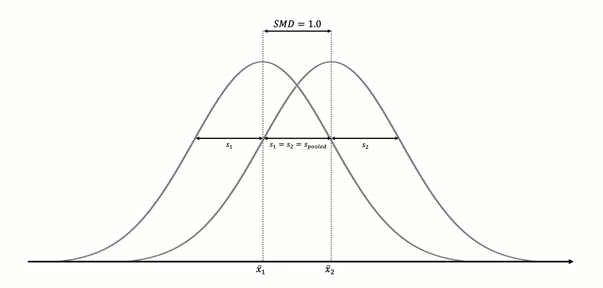

# (PART) Meta-Analysis in R {-}

# Effect Sizes {#effects}

---


<br></br>

<span class="firstcharacter">I</span>
n the last chapter, we were able to familiarize ourselves with the _R_ universe and learned a few helpful tools to import and manipulate data. In this second part of the book, we can now apply and expand our _R_ knowledge while learning about core statistical techniques that are used in meta-analyses.

\index{Mean, Arithmetic}

In Chapter \@ref(what-are-mas), we defined meta-analysis as a technique which summarizes quantitative outcomes from several studies. In meta-analyses, studies instead of individuals become the fundamental units of our analysis. 

This introduces new problems. In a primary study, it is usually quite easy to calculate **summary statistics** through which we can describe the data we collected. For example, it is conventional to calculate the **arithmetic mean** $\bar{x}$ and **standard deviation** $s$ of a continuous outcome in primary studies. 

However, this is only possible because an essential prerequisite is usually met in primary studies: we know that the outcome variable has been **measured in the same way** across all study subjects. For meta-analyses, this assumption is typically not met. Imagine that we want to conduct a meta-analysis where our outcome of interest are the math skills of grade eight students. Even if we apply strict inclusion criteria (see Chapter \@ref(research-question)), it is likely that not every study used exactly the same test to measure math skills; some may have even only reported the proportion of students who passed or failed the test. This makes it virtually impossible to quantitatively synthesize the results directly.

To perform a meta-analysis, we have to find an **effect size** which can be summarized across all studies. Sometimes, such effect sizes can be directly extracted from the publication; more often, we have to calculate them from other data reported in the studies. The selected effect size metric can have a substantial impact on the results of a meta-analysis, and their interpretability. They should therefore fulfill a few important criteria [@lipsey2001practical; @higgins2019cochrane]. In particular, the selected effect size measure for a meta-analysis should be:

* **Comparable**. It is important that the effect size measure has the same meaning across all studies. Let us take math skills as an example again. It makes no sense to pool differences between experimental and control groups in the number of points achieved on a math test when studies used different tests. Tests may, for example, vary in their level of difficulty, or in the maximum number of points that can be achieved.

* **Computable**. We can only use an effect size metric for our meta-analysis if it is possible to derive its numerical value from the primary study. It must be possible to calculate the effect size for all of the included studies based on their data. 

* **Reliable**. Even if it is possible to calculate an effect size for all included studies, we must also be able to **pool** them statistically. To use some metric in meta-analyses, it must be at least possible to calculate the **standard error** (see next chapter). It is also important that the format of the effect size is suited for the meta-analytic technique we want to apply, and does not lead to errors or biases in our estimate.

* **Interpretable**. The type of effect size we choose should be appropriate to answer our research question. For example, if we are interested in the strength of an association between two continuous variables, it is conventional to use correlations to express the size of the effect. It is relatively straightforward to interpret the magnitude of a correlation, and many researchers can understand them. In the following chapters, we will learn that it is sometimes not possible to use outcome measures which are both easy to interpret **and** ideal for our statistical computations. In such cases, it is necessary to transform effect sizes to a format with better mathematical properties before we pool them.

It is very likely that you have already stumbled upon the term "effect size" before. We also used the word here, without paying too much attention to what it precisely stands for. In the next section, we should therefore explore what we actually mean when we talk about an "effect size". 

<br></br>

## What Is an Effect Size? {#what-is-es}

---

In the terminology we use in this book, an effect size is defined as a metric quantifying the relationship between two entities. It captures the **direction** and **magnitude** of this relationship. If relationships are expressed as the same effect size, it is possible to compare them. 

\index{Correlation}
\index{Standardized Mean Difference}

We want to stress here that this is just **one** way to define what an effect size means. Definitions of an effect size can be wider and narrower, and the term is used differently by different people [@borenstein2011introduction, chapter 3]. Some researchers only talk of effect sizes when referring to the results of intervention studies, which are usually expressed as differences between the treatment and control group (see Chapter \@ref(s-md)). Using this conceptualization, "effect size" refers to the effect of a treatment, and how large this effect is. 

In our opinion, this is quite a narrow definition. Not only treatments can have an effect on some variable; effects can also appear **naturally** without any direct human intervention. For example, it is possible that socio-demographic variables, such as the income and education of parents, may have an effect on the educational attainment of their children. Correlations describe how well we can predict the values of a variable through the values of another, and can also be seen as a form of effect size. 

On the other hand, it might go too far to say that everything we can pool as part of a meta-analysis is automatically an effect size. As we will learn, there are measures of the **central tendency**, such as the sample mean, which can also be used in meta-analyses. But a sample mean alone does not quantify a relationship between two phenomena, and there is no "effect". Nevertheless, in this book, we will often use the word "effect size" as a **pars pro toto**, representing both estimates of an actual effect, as well as "one-variable" and central tendency measures. We do not do this because this is accurate, but because it is more convenient. 

Others disapprove of the term "effect size" altogether. They stress that the word "effect" in "effect size" suggests that there is a **causal** relationship. However, we all know that **correlation is not causation**, and a difference between an intervention and control group must not automatically be caused by the treatment itself. In the end, it is up to you to decide which definition you prefer, but be aware that people may have different conceptualizations in mind when they talk about effect sizes.

\index{Sampling Error}

In mathematical notation, it is common to use the greek letter **theta** ($\theta$) as the symbol for a **true** effect size^[In this book, we will largely follow the notation used by Schwarzer et al. [-@schwarzer2015meta] when discussing effect sizes.]. More precisely, $\theta_k$ represents the true effect size of a study $k$. Importantly, the true effect size is **not** identical with the **observed effect size** that we find in the published results of the study. The observed effect size is only an **estimate** of the true effect size. It is common to use a **hat** (^) symbol to clarify that the entity we refer to is only an estimate. The observed effect size in study $k$, our estimate of the true effect size, can therefore be written as $\hat\theta_k$. 

But why does $\hat\theta_k$ differ from $\theta_k$? It differs because of the **sampling error**, which can be symbolized as $\epsilon_k$. In every primary study, researchers can only draw a small sample from the whole population. For example, when we want to examine the benefits of regular exercise on the cardiovascular health of primary care patients, we will only be able to include a small selection of patients, not **all** primary care patients in the world. The fact that a study can only take small samples from an infinitely large population means that the observed effect will differ from the true population effect. 

Put simply, $\hat\theta_k$ is, therefore, the same as $\theta_k$ plus some sampling error $\epsilon_k$^[It should be noted that there are often more reasons for our observed effect sizes to differ from the true effect size than sampling error alone; for example biases in a study's research methodology, or measurement error. In Chapter \@ref(es-correction), we will discuss this in greater detail.].

\begin{align}
\hat\theta_k = \theta_k + \epsilon_k
(\#eq:es1)
\end{align}

It is obviously desirable that the effect size estimate $\hat\theta_k$ of study $k$ is as close as possible to the true effect size, and that $\epsilon_k$ is minimal. All things being equal, we can assume that studies with smaller $\epsilon$ will deliver a more **precise** estimate of the true effect size. Meta-analysis methods take into account how precise an effect size estimate is (see Chapter \@ref(pooling-es)). When pooling the results of different studies, they give effects with a greater precision (i.e., less sampling error) a higher weight, because they are better estimators of the true effect [@hedges2014statistical]. 

But how can we know how big the sampling error is? Unsurprisingly, the true effect of a study $\theta_k$ is unknown, and so $\epsilon_k$ is also unknown. Often, however, we can use statistical theory to approximate the sampling error. A common way to quantify $\epsilon$ is through the **standard error** ($SE$). The standard error is defined as the standard deviation of the **sampling distribution**. A sampling distribution is the distribution of a metric we get when we draw random samples with the same sample size $n$ from our population **many, many times**. 

We can make this more concrete by simulating data in _R_. We can pretend that we are drawing random samples from a larger population using the `rnorm` function. This function allows us to draw **r**andom samples from a **norm**al distribution, therefore the name. The `rnorm` function simulates a "perfect world" in which we **know** how values are distributed in the true population and lets us take samples. 

The function takes three arguments: `n`, the number of observations we want to have in our sample; `mean`, the **true** mean of the population; and `sd`, the **true** standard deviation. The `rnorm` function has a random component, so to make results reproducible, we have to set a **seed** first. This can be done using the `set.seed` function, which we have to supply with a number. For our example, we chose to set a seed of `123`. Furthermore, we want to simulate that the true mean of our population is $\mu =$ 10, that the true standard deviation is $\sigma =$ 2, and that our sample consists of $n=$ 50 randomly selected observations, which we save under the name `sample`. 

This is what our code looks like:

```{r}
set.seed(123)
sample <- rnorm(n = 50, mean = 10, sd = 2)
```

Now, we can calculate the mean of our sample.

```{r}
mean(sample)
```


\index{Central Limit Theorem}

We see that the mean is $\bar{x} =$ 10.07, which is already very close to the true value in our population. The sampling distribution can now be created by repeating what we did here--taking a random sample and calculating its mean--**countless times**. To simulate this process for you, we conducted the steps from before 1000 times. 

The histogram in Figure \@ref(fig:samplingdist) displays the results. We can see that the means of the samples closely resemble a normal distribution with a mean of 10. If we were to draw even more samples, the distribution of the means would get even closer to a normal distribution. This idea is expressed in one of the most fundamental tenets of statistics, the **central limit theorem** [@aronow2019foundations, chapter 3.2.4].

```{r samplingdist, fig.cap='"Sampling distribution" of means (1000 samples).', warning=F, message=F, echo=F, out.width='70%', fig.align='center'}

library(magrittr)
set.seed(123)
res = list()
for (i in 1:1000){
  x = rnorm(50, 10, 2)
  c(mean(x), sd(x)) -> res[[i]]
}

do.call(rbind, res) %>% as.data.frame() %>% 
  set_colnames(c("mu", "sigma")) -> res_1000

par(bg="#FFFEFA")
hist(res_1000$mu, breaks = 25,
     main = "",
     xlab = "Calculated Mean")

```

The standard error is defined as the standard deviation of this sampling distribution. Therefore, we calculated the standard deviation of the 1000 simulated means to get an approximation of the standard error. The result is $SE =$ 0.267. 

As we mentioned before, we cannot simply calculate the standard error in real life by simulating the true sampling distribution. However, there are formulas based on statistical theory which allow us to calculate an estimate of the standard error, even when we are limited to only one observed sample--which we usually are. The formula to calculate the standard error of the **mean** is defined like this:


\begin{align}
SE = \frac{s}{\sqrt{n}}
(\#eq:es2)
\end{align}

It defines the standard error as the standard deviation of our sample $s$, divided by the square root of the sample size $n$. Using this formula, we can easily calculate the standard error of our `sample` object from before using _R_. Remember that the size of our random sample was $n =$ 50.

```{r}
sd(sample)/sqrt(50)
```
If we compare this value to the one we found in our simulation of the sampling distribution, we see that they are nearly identical. Using the formula, we could quite accurately estimate the standard error using only the sample we have at hand. 

In formula 3.2, we can see that the standard error of the mean depends on the sample size of a study. When $n$ becomes larger, the standard error becomes smaller, meaning that a study's estimate of the true population mean becomes more precise. 

To exemplify this relationship, we conducted another simulation. Again, we used the `rnorm` function, and assumed a true population mean of $\mu =$ 10 and that $\sigma =$ 2. But this time, we varied the sample size, from $n =$ 2 to $n =$ 500. For each simulation, we calculated both the mean, and the standard error using formula 3.2. 

```{r simulse, fig.cap = 'Sample mean and standard error as a function of sample size.', message=F, echo=F, fig.height=2.5}
library(ggplot2)
library(gridExtra)

load("data/simul_SE.rda")

plotdat_mean = data.frame(x = 2:500,
                          y = resul$mean)

plotdat_se = data.frame(x = 2:500,
                          y = resul$se)


ggplot(data = plotdat_mean, aes(x = x, y = y)) +
  geom_smooth(method = "gam", se = F, color = "black", 
              linetype = "dotted", size = 0.5) +
  geom_line(color = "gray39") +
  scale_color_grey() +
  theme_minimal() +
  theme(panel.background = element_rect(fill = "#FFFEFA",
                                        size = 0),
        plot.background = element_rect(fill = "#FFFEFA",
                                       size = 0)) +
  ylab("Mean") +
  xlab("Sample Size") -> p1

ggplot(data = plotdat_se[2:499,], aes(x = x, y = y)) +
  geom_smooth(method = "gam", se = F, color = "black", 
              linetype = "dotted", size = 0.5) +
  geom_line(color = "gray39") +
  scale_color_grey() +
  theme_minimal() +
  theme(panel.background = element_rect(fill = "#FFFEFA",
                                        size = 0),
        plot.background = element_rect(fill = "#FFFEFA",
                                       size = 0)) +
  ylab("Standard Error") +
  xlab("Sample Size") -> p2

grid.arrange(p1, p2, nrow=1)


```

Figure \@ref(fig:simulse) shows the results. We can see that the means look like a **funnel**: as the sample size increases, the mean estimates become more and more precise, and converge towards 10. This increase in precision is represented by the standard error: with increasing sample size, the standard error becomes smaller and smaller.

We have now explored the quintessential elements we need to conduct a meta-analysis: an (1) observed effect size or outcome measure, and (2) its precision, expressed as the standard error. If these two types of information can be calculated from a published study, it is usually also possible to perform a meta-analytic synthesis (see Chapter \@ref(pooling-es)).

In our simulations, we used the mean of a variable as an example. It is important to understand that the properties we saw above can also be found in other outcome measures, including commonly used effect sizes. If we would have calculated a mean **difference** in our sample instead of a mean, this mean difference would have exhibited a similarly shaped sampling distribution, and the standard error of the mean difference would have also decreased as the sample sizes increases (provided the standard deviation remains the same). The same is also true, for example, for (Fisher's $z$ transformed) correlations. 

In the following sections, we will go through the most commonly used effect sizes and outcome measures in meta-analyses. One reason why these effect size metrics are used so often is because they fulfill two of the criteria we defined at the beginning of this chapter: they are **reliable** and **computable**. 

In formula 3.2, we described how the standard error of a mean can be calculated, but this formula can **only** be readily applied to **means**. Different formulas to calculate the standard error are needed for other effect sizes and outcome measures. For the effect size metrics we cover here, these formulas luckily exist, and we will show you all of them. A collection of the formulas can be also found in the [Appendix](#formula). Some of these formulas are somewhat complicated, but the good news is that we hardly ever have to calculate the standard error manually. There are various functions in _R_ which do the heavy lifting for us.

In the following section, we not only want to provide a theoretical discussion of different effect size metrics. We also show you which kind of information you have to prepare in your data set so that the _R_ meta-analysis functions we are using later can easily calculate the effect sizes for us. 

We grouped effect sizes based on the type of research design in which they usually appear: **single group designs** (e.g. naturalistic studies, surveys, or uncontrolled trials), and **control group designs** (e.g. experimental studies or controlled clinical trials). Please note that this is just a rough classification, not a strict rule. Many of the effect sizes we present are technically applicable to any type of research design, as long as the type of outcome data is suited. 

<br></br>

## Measures & Effect Sizes in Single Group Designs {#single-group-es}

---

### Means {#means}

---


\index{Mean, Arithmetic}

The **arithmetic mean** is probably the most commonly used central tendency measure. Although means are rather infrequently used as outcome measures, they can easily be pooled in a meta-analysis. For example, one could investigate the mean height of males, expressed as centimeters or inches, by pooling several representative studies. 

The arithmetic mean $\bar{x}$ is calculated by summing all individual values $x_i$ in a sample and then dividing the sum by the sample size.


\begin{equation}
\bar{x} = \frac{\sum^{n}_{i=1}x_i}{n}
(\#eq:es3)
\end{equation}

We already covered how the standard error of the mean is calculated (see Chapter \@ref(what-is-es)). We simply have to divide the sample standard deviation $s$ through the square root of the sample size.


\begin{equation}
SE_{\bar{x}} = \frac{s}{\sqrt{n}}
(\#eq:es4)
\end{equation}

As we have seen before, the mean and its standard error are easy to calculate in _R_.

```{r}
# Set seed of 123 for reproducibility 
# and take a random sample (n=50).
set.seed(123)
sample <- rnorm(n = 50, mean = 20, sd = 5)

# Calculate the mean
mean(sample)

# Calculate the standard error
sd(sample)/sqrt(50)

```

To conduct a meta-analysis of means, our data set should at least contain the following columns:

* **`n`**. The number of observations (sample size) in a study.
* **`mean`**. The mean reported in the study.
* **`sd`**. The standard deviation of the variable reported in the study.


<br></br>

### Proportions {#props}

---

\index{Proportion}

A **proportion** is another type of central tendency measure. It specifies how many units of a sample fall into a certain subgroup. Proportions can take values between zero and one, which can be transformed into **percentages** by multiplying with 100. Proportions may, for example, be used as an outcome measure when we want to examine the prevalence of a disease at a given point in time. To calculate a proportion $p$, we have to divide the number of individuals $k$ falling into a specific subgroup by the total sample size $n$.


\begin{equation}
p = \frac{k}{n}
(\#eq:es5)
\end{equation}

The standard error of a proportion can be calculated this way:

\begin{equation}
SE_{p} = \sqrt{\frac{p(1-p)}{n}}
(\#eq:es6)
\end{equation}

We can calculate the proportion and its standard error in _R_ using this code:

```{r}
# We define the following values for k and n:
k <- 25
n <- 125

# Calculate the proportion
p <- k/n
p

# Calculate the standard error
sqrt((p*(1-p))/n)

```

\index{Odds}
\index{Logit-Transformation}
\index{Logarithm, Natural}

The fact that the range of proportions is restricted between 0 and 1 can be problematic [@lipsey2001practical, chapter 3]. When $p$ is close to 0 or close to 1, the standard error is artificially compressed, which leads us to overestimate the precision of the proportion estimate. 

This has something to do with the sampling distribution. When values of $p$ are very low or very high, the sampling distribution will not be approximately normal like in Figure \@ref(fig:samplingdist). The distribution will be **right-skewed** or **left-skewed** because it is impossible for a random sample to have a calculated proportion outside the 0-1 range. 

To avoid this, proportions are commonly **logit**-transformed before they are pooled. A logit-transformation first involves calculating the **odds** (see Chapter \@ref(or)). Odds are defined as the proportion of participants which fall into a specific category, divided by the proportion of units which do not fall into that category. 

The natural logarithm function $\log_e$ is then used to transform the odds into a format where $p=$ 0.5 equals a value of 0, and where there is no range restriction. This ensures that the sampling distribution is approximately normal and that standard errors are not biased. 

The calculation of logit-transformed proportions and their standard errors can be done using these formulas [@lipsey2001practical, chapter 3]^[To transform a logit-proportion back to the original scale, we can use the following formula: $p=\frac{\exp(p_{\text{logit}})}{1+\exp(p_{\text{logit}})}$, where $\exp$ is the **exponential function**, implemented via `exp` in _R_ (see Chapter \@ref(ppoolbin)).]:


\begin{equation}
p_{\text{logit}} = \log_{e} \left(\frac{p}{1-p}\right)
(\#eq:es7)
\end{equation}


\begin{equation}
SE_{p_{\text{logit}}} = \sqrt{\frac{1}{np}+\frac{1}{n(1-p)}}
(\#eq:es8)
\end{equation}

Luckily, the meta-analysis function we can use in _R_ performs this logit-transformation automatically for us. We therefore only have to prepare the following columns in our data set:

* **`event`**. The number of observations which are part of a specific subgroup ($k$).
* **`n`**. The total sample size $n$.

<br></br>

### Correlations {#cors}

---

#### Pearson Product-Moment Correlation {#pearson-cors}

---

\index{Correlation}
\index{History of Meta-Analysis}

A correlation is an effect size which expresses the amount of **co-variation** between two variables. The most common form is the **Pearson product-moment correlation**^[This type of correlation was named after Karl Pearson, the famous statistician who also played a part in the history of meta-analysis (see Chapter \@ref(history)).], which can be calculated for two continuous variables. Product-moment correlations can be used as the effect size, for example, when a meta-analyst wants to examine the relationship between relationship quality and well-being. 

A correlation $r_{xy}$ between a variable $x$ and a variable $y$ is defined as the **co-variance** $\text{Cov}(x,y)=\sigma^{2}_{xy}$ of $x$ and $y$, divided by the **product** of their standard deviations, $\sigma_x$ and $\sigma_y$.


\begin{equation}
r_{xy} = \frac{\sigma^{2}_{xy}}{\sigma_x \sigma_y}
(\#eq:es9)
\end{equation}

Using the sample size $n$, the standard error of $r_{xy}$ can be calculated like this:


\begin{equation}
SE_{r_{xy}} = \frac{1-r_{xy}^2}{\sqrt{n-2}}
(\#eq:es10)
\end{equation}

When calculating the product-moment correlation, we standardize the co-variation between two variables by their standard deviations. This means that it becomes less relevant if two or more studies measured a construct on the same scale; once we calculate a correlation, it is automatically possible to compare the effects. 

Correlations can take values between -1 and 1. The magnitude of a correlation is often interpreted using Cohen's [-@cohen1988statistical] conventions:

* $r \approx$ 0.10: small effect.
* $r \approx$ 0.30: moderate effect.
* $r \approx$ 0.50: large effect.

It should be noted, however, that these conventions may be at best seen as rules of thumb. It is often much better to quantify a correlation as small or large depending on the subject and previous research. 

\index{Fisher's \textit{z}}
\index{History of Meta-Analysis}

Unfortunately, like proportions (Chapter \@ref(props)), correlations are restricted in their range, and it can introduce bias when we estimate the standard error for studies with a small sample size [@alexander1989statistical]. 

In meta-analyses, correlations are therefore usually transformed into **Fisher's** $z$^[Fisher's $z$ was named after yet another famous statistician we mentioned in Chapter \@ref(history), Ronald A. Fisher.]. Like the logit-transformation, this also entails the use of the natural logarithm function to make sure that the sampling distribution is approximately normal (see Chapter \@ref(ratios) for a more detailed explanation). The formula looks like this:


\begin{equation}
z = 0.5\log_{e}\left(\frac{1+r}{1-r}\right)
(\#eq:es11)
\end{equation}

If we know the sample size $n$, the approximate standard error of Fisher's $z$ can be obtained through this formula [@olkin1995correlations]:


\begin{equation}
SE_{z} = \frac{1}{\sqrt{n-3}}
(\#eq:es12)
\end{equation}

We can also calculate $r_{xy}$ and $z$ directly in _R_, using the `cor` and `log` function. 

```{r}
# Simulate two continuous variables x and y
set.seed(12345)
x <- rnorm(20, 50, 10)
y <- rnorm(20, 10, 3)

# Calculate the correlation between x and y
r <- cor(x,y)
r

# Calculate Fisher's z
z <- 0.5*log((1+r)/(1-r))
z

```

Thankfully, we do not have to perform Fisher's $z$ transformation manually when conducting a meta-analysis of correlations in _R_. The only columns we need in our data set are:

* **`cor`**. The (non-transformed) correlation coefficient of a study.
* **`n`**. The sample size of the study.


<br></br>

#### Point-Biserial Correlation {#pb-cors}

---

\index{Correlation}
\index{Correlation, Point-Biserial}

The Pearson product-moment correlation describes the relationship between two continuous variables. In cases where only one variable $y$ is continuous, while the other variable $x$ is dichotomous (i.e. only takes two values), a **point-biserial correlation** can be calculated, which expresses how well $y$ can be predicted from the group membership in $x$. 

Point-biserial correlations can be calculated using this formula:


\begin{equation}
{r_{pb}}= \frac{(\bar{y_1}-\bar{y_2})\sqrt{p_1(1-p_1)}}{s_y}
(\#eq:es13)
\end{equation}

In this formula, $\bar{y_1}$ is the mean of the continuous variable when only the first group of the dichotomous variable $x$ is considered, and $\bar{y_2}$ is the mean when only the second group of $x$ is considered; $p_1$ is the proportion of cases that fall into group 1 in $x$, and $s_y$ is the standard deviation of $y$. 

The point-biserial correlation can be calculated in _R_ using the `cor` function (see previous section). If one of the supplied variables only assumes two values while the other is continuous, the (approximate) point-biserial correlation is automatically calculated.

\index{Standardized Mean Difference}

The point-biserial correlation bears a close resemblance to the **standardized mean difference**, which we will cover later (Chapter \@ref(b-group-smd)). Both effect size metrics quantify how much values of a continuous variable differ between two groups. However, it is less common that point-biserial correlations are pooled in meta-analyses. Like the product-moment correlation, the point-biserial correlation has undesirable statistical properties for meta-analyses, such as range restriction when the group proportions are unequal [@bonett2019point]. 

When we are interested in group differences on a continuous outcome variable, it is therefore advised to convert point-biserial correlations to standardized mean differences for meta-analyses [@lipsey2001practical, chapter 3]. A formula to convert a point-biserial correlation to a standardized mean difference can be found in Chapter \@ref(convert-corr) in the "Helpful Tools" section of this book. 

<br></br>

## Effect Sizes in Control Group Designs

---

### (Standardized) Mean Differences {#s-md}

---

#### Between-Group Mean Difference {#b-group-md}

---

The **between-group mean difference** $\text{MD}_{\text{between}}$ is defined as the raw, un-standardized difference in means between two **independent** groups. Between-group mean differences can be calculated when a study contained at least two groups, as is usually the case in controlled trials or other types of experimental studies. In meta-analyses, mean differences can only be used when **all** the studies measured the outcome of interest on **exactly** the same scale. Weight, for example, is nearly always measured in kilograms in scientific research; and in diabetology, the HbA$_{\text{1c}}$ value is commonly used to measure the blood sugar. 

The mean difference is defined as the mean of group 1, $\bar{x}_1$, minus the mean of group 2, $\bar{x}_2$:


\begin{equation}
\text{MD}_{\text{between}} = \bar{x}_1 - \bar{x}_2
(\#eq:es14)
\end{equation}

The standard error can be obtained using this formula:


\begin{equation}
SE_{\text{MD}_{\text{between}}} = s_{\text{pooled}}\sqrt{\frac{1}{n_1}+\frac{1}{n_2}}
(\#eq:es15)
\end{equation}

\index{Pooled Standard Deviation}

In the formula, $n_1$ represents the sample size in group 1, $n_2$ the sample size in group 2, and $s_{\text{pooled}}$ the **pooled standard deviation** of both groups. Using the standard deviation of group 1 ($s_1$) and group 2 ($s_2$), the value of $s_{\text{pooled}}$ can be calculated this way:


\begin{align}
s_{\text{pooled}} = \sqrt{\frac{(n_1-1)s^2_1+(n_2-1)s^2_2}{(n_1-1)+(n_2-1)}}
(\#eq:es16)
\end{align}

Here is an example how we can calculate a mean difference and its standard error in _R_.

```{r}
# Generate two random variables with different population means
set.seed(123)
x1 <- rnorm(n = 20, mean = 10, sd = 3)
x2 <- rnorm(n = 20, mean = 15, sd = 3)

# Calculate values we need for the formulas
s1 <- sd(x1)
s2 <- sd(x2)
n1 <- 20
n2 <- 20

# Calculate the mean difference
MD <- mean(x1) - mean(x2)
MD

# Calculate s_pooled
s_pooled <- sqrt(
  (((n1-1)*s1^2) + ((n2-1)*s2^2))/
    ((n1-1)+(n2-1))
)

# Calculate the standard error
se <- s_pooled*sqrt((1/n1)+(1/n2))
se

```

It is usually not necessary to do these calculations manually. For a meta-analysis of mean differences, we only have to prepare the following columns in our data set:

* **`n.e`**. The number of observations in the intervention/experimental group.
* **`mean.e`**. The mean of the intervention/experimental group.
* **`sd.e`**. The standard deviation in the intervention/experimental group.
* **`n.c`**. The number of observations in the control group.
* **`mean.c`**. The mean of the control group.
* **`sd.c`**. The standard deviation in the control group.

<br></br>

#### Between-Group Standardized Mean Difference {#b-group-smd}

---

\index{Standardized Mean Difference}
\index{Cohen's \textit{d}}

The standardized between-group mean difference $\text{SMD}_{\text{between}}$ is defined as the difference in means between two independent groups, standardized by the pooled standard deviation $s_{\text{pooled}}$. In the literature, the standardized mean difference is also often called **Cohen's** $d$, named after the psychologist and statistician Jacob Cohen. 

In contrast to unstandardized mean differences, $\text{SMD}_{\text{between}}$ expresses the difference between two groups in **units of standard deviations**. This can be achieved by dividing the raw mean difference of two groups, $\bar{x_1}$ and $\bar{x_2}$, through the pooled standard deviation $s_{\text{pooled}}$ of both groups:


\begin{equation}
\text{SMD}_{\text{between}} = \frac{\bar{x}_1 - \bar{x}_2}{s_{\text{pooled}}}
(\#eq:es17)
\end{equation}

Where $s_{\text{pooled}}$ is calculated using the same formula (3.16) we already covered in Chapter \@ref(b-group-md). Standardized mean differences are much more often used in meta-analyses than unstandardized mean differences. This is because $\text{SMD}_{\text{between}}$ can be compared between studies, even if those studies did not measure the outcome of interest using the same instruments. 

The standardization has the effect that $\text{SMD}_{\text{between}}=$ 1 always means that the two groups means are one sample standard deviation away from each other (see Figure \@ref(fig:smd)); $\text{SMD}_{\text{between}}=$ 2 then represents a difference of 2 standard deviations, and so forth^[Kristoffer Magnusson developed a great interactive tool visualizing the distribution of two groups for varying values of the standardized mean difference. The tool can be found online: https://www.rpsychologist.com/d3/cohend/]. 

```{r smd, fig.cap='Standardized mean difference of 1 (assuming normality, equal standard deviations and equal sample size in both groups).', out.width='85%', message = F, echo = F, fig.align='center'}
library(OpenImageR)

```

The standardization makes it much easier to evaluate the magnitude of the mean difference. Standardized mean differences are often interpreted using the conventions by Cohen [-@cohen1988statistical]:

* SMD $\approx$ 0.20: small effect.
* SMD $\approx$ 0.50: moderate effect.
* SMD $\approx$ 0.80: large effect.

Like the convention for Pearson product-moment correlations (Chapter \@ref(pearson-cors)), these are rules of thumb at best. 

It is usually much better to interpret standardized mean differences based on their "real-life" implications. An effect size may be small according to the criteria by Cohen, but it can still be extremely important. For many serious diseases, for example, even a very small statistical effect can still have a huge impact on the population level, and potentially save millions of lives. One study showed that, for depression treatment, even effects as small as $\text{SMD}_{\text{between}}=$ 0.24 can have a clinically important impact on the lives of patients [@cuijpers2014threshold].

The standard error of $\text{SMD}_{\text{between}}$ can be calculated using this formula [@borenstein2011introduction]:

\begin{equation}
SE_{\text{SMD}_{\text{between}}} = \sqrt{\frac{n_1+n_2}{n_1n_2} + \frac{\text{SMD}^2_{\text{between}}}{2(n_1+n_2)}}
(\#eq:es18)
\end{equation}

Where $n_1$ and $n_2$ are the sample sizes of group 1 and group 2, and with $\text{SMD}_{\text{between}}$ being the calculated between-group standardized mean difference.

\index{esc Package}

There are several functions in _R_ which allow us to calculate $\text{SMD}_{\text{between}}$/Cohen's $d$ in one step. Here, we use the `esc_mean_sd` function, which is part of the **{esc}** package [@esc]. We have not used this package before, so it is necessary to install it first (see Chapter \@ref(packages)).

```{r, message=F, eval=F}
# Load esc package
library(esc)

# Define the data we need to calculate SMD/d
grp1m <- 50   # mean of group 1
grp2m <- 60   # mean of group 2
grp1sd <- 10  # sd of group 1
grp2sd <- 10  # sd of group 2
grp1n <- 100  # n of group1
grp2n <- 100  # n of group2

# Calculate effect size
esc_mean_sd(grp1m = grp1m, grp2m = grp2m, 
            grp1sd = grp1sd, grp2sd = grp2sd, 
            grp1n = grp1n, grp2n = grp2n)

```

```
## Effect Size Calculation for Meta Analysis
## 
##      Conversion: mean and sd to effect size d
##     Effect Size:  -1.0000
##  Standard Error:   0.1500
##            [...]
```

In the output, there are two things to mention. First, we see that the calculated standardized mean difference is exactly 1. This makes sense because the difference between the two means we defined is equal to the (pooled) standard deviation. 

Secondly, we see that the effect size is **negative**. This is because the mean of group 2 is larger than the mean of group 1. While this is mathematically correct, we sometimes have to change the sign of calculated effect sizes so that others can interpret them more easily. 

Imagine that the data in this example came from a study measuring the mean number of cigarettes people were smoking per week after receiving an intervention (group 1) or no intervention (group 2). In this context, the results of the study were **positive** because the mean number of smoked cigarettes was lower in the intervention group. Therefore, it makes sense to report the effect size as 1.0 instead of -1.0, so that other people can intuitively understand that the intervention had a positive effect. 

The sign of effect sizes becomes particularly important when some studies used measures for which **higher** values mean better outcomes, while others used a measure for which **lower** values indicate better outcomes. In this case, it is essential that all effect sizes are consistently coded in the same direction (we have to ensure that, for example, higher effect sizes mean better outcomes in the intervention group in all studies in our meta-analysis).

\index{Hedges' \textit{g}}

Often, a small-sample correction is applied to standardized mean differences, which leads to an effect size called **Hedges'** $g$. We will cover this correction in Chapter \@ref(hedges-g).

To conduct a meta-analysis of standardized mean differences, our data set should at least contain the following columns:

* **`n.e`**. The number of observations in the intervention/experimental group.
* **`mean.e`**. The mean of the intervention/experimental group.
* **`sd.e`**. The standard deviation in the intervention/experimental group.
* **`n.c`**. The number of observations in the control group.
* **`mean.c`**. The mean of the control group.
* **`sd.c`**. The standard deviation in the control group.

<br></br>

```{block2, type='boxinfo'}
**Standardizing by External Estimates of the Standard Deviation**

\vspace{2mm}

When calculating SMDs, we use $s_{\text{pooled}}$ because it serves as a proxy of the true standard deviation in our population. Especially when a study is small, however, the standard deviation calculated based its sample may be a bad estimator of the population standard deviation. 

In this case, a possible solution is to use **external** estimates of $s_{\text{pooled}}$ to standardize the mean difference [@higgins2019cochrane]. Such external estimates may be extracted from larger cross-sectional studies which used the same instrument as the study in a similar population.

```


<br></br>

#### Within-Group (Standardized) Mean Difference {#w-group-smd}

---

\index{Standardized Mean Difference}

**Within-group** unstandardized or standardized mean differences can be calculated when a difference **within** one group is examined. This is usually the case when the same group of people is measured at two different time points (e.g. before an intervention and after an intervention). 

In contrast to between-group mean differences, $\text{(S)MD}_{\text{within}}$ is calculated using data that is **not independent**. For example, it is likely that the value of person $i$ at measurement point $t_1$ has influenced the value of the same person at measurement point $t_2$. Due to the fact that within-group mean differences are usually based on data measured at different time points, they are also known as the **(standardized) mean gain**. 

The within-group mean difference $\text{MD}_{\text{within}}$ is calculated the same way as $\text{MD}_{\text{between}}$ (see Chapter \@ref(b-group-md)), except that we now compare the values of the same group at two different time points, $t_1$ and $t_2$.

\begin{equation}
\text{MD}_{\text{within}} = \bar{x}_{\text{t}_2} - \bar{x}_{\text{t}_1}
(\#eq:es19)
\end{equation}

Things become more complicated when we want to calculate a standardized version of the within-group mean difference. There is no full consensus on how $\text{SMD}_{\text{within}}$ should be computed. In a [blog post](http://jakewestfall.org/blog/index.php/2016/03/25/five-different-cohens-d-statistics-for-within-subject-designs/), Jake Westfall points out that there are at least five distinct ways to calculate it. 

An intuitive option is to standardize the mean difference $\text{MD}_{\text{within}}$ using the pooled standard deviation of both assessment points, $s_{\text{t}_1}$ and $s_{\text{t}_2}$. Since in the number of observations is typically identical in within-group designs, this means that the sum of the two squared standard deviations simply has to be divided by 2 to obtain $s^2_{\text{pooled}}$. Otherwise, formula (3.16) in Chapter \@ref(b-group-md) can be used to calculate $s_{\text{pooled}}$. This leads to the following formula:

\begin{equation}
\text{SMD}_{\text{within}} = \frac{\bar{x}_{\text{t}_2} - \bar{x}_{\text{t}_1}}{s_{\text{pooled}}}
(\#eq:es20)
\end{equation}

An even better solution, proposed (among others) by Becker [-@becker1988synthesizing], is to divide $\text{MD}_{\text{within}}$ by the standard deviation of the pre-test scores ($s_{\text{t}_1}$). The reason for this is that $s_{\text{t}_1}$ is less likely to be influenced by intervention effects^[There is also another, "statistical" reasoning behind using $s_{\text{t}_1}$ instead of $\sqrt{(s_{\text{t}_1}^2 + s_{\text{t}_2}^2/2)}$ in the denominator. In within-group designs, $s_{\text{t}_1}$ and $s_{\text{t}_2}$ are not independent. This means that $s_{\text{t}_1}^2 + s_{\text{t}_2}^2$ does not follow a $\chi^2$ distribution, which is required for formula (3.23) below to be applicable when calculating the standard error of $\text{SMD}_{\text{within}}$. A "correct" formula of the approximate sampling distribution of $\text{SMD}_{\text{within}}$ when using $\sqrt{(s_{\text{t}_1}^2 + s_{\text{t}_2}^2/2)}$ in the denominator has recently been described [@cousineau2020approximating]; it also assumes that $r_{\text{t}_1\text{t}_2}$ is known. @cousineau2021ci discuss ways to calculate confidence intervals based on this newly "discovered" distribution. Here, however, we restrict ourselves to the formulas for $\text{SMD}_{\text{within}}$ and its standard error when using only $s_{\text{t}_1}$ in the denominator. We do this because these formulas are relatively easy to apply in practice, commonly found in the literature, and because standardizing by the pre-test standard deviation $s_{\text{t}_1}$ is typically a reasonable approach.]:

\begin{equation}
\text{SMD}_{\text{within}} = \frac{\bar{x}_{\text{t}_2} - \bar{x}_{\text{t}_1}}{s_{\text{t}_1}}
(\#eq:es201)
\end{equation}

The standard errors of $\text{MD}_{\text{within}}$ and $\text{SMD}_{\text{within}}$ can be calculated using these formulas [@borenstein2011introduction, chapter 4; @becker1988synthesizing]:

\begin{equation}
SE_{\text{MD}_{\text{within}}}=\sqrt{\dfrac{s^2_{\text{t}_1}+s^2_{\text{t}_2}-(2r_{\text{t}_1\text{t}_2}s_{\text{t}_1}s_{\text{t}_2})}{n}}
(\#eq:es21)
\end{equation}

\begin{equation}
SE_{\text{SMD}_{\text{within}}} = \sqrt{\frac{2(1-r_{\text{t}_1\text{t}_2})}{n}+\frac{\text{SMD}^2_{\text{within}}}{2n}}
(\#eq:es22)
\end{equation}

The fact that we need two know the correlation $r_{\text{t}_1\text{t}_2}$ between the assessment points to calculate the standard error of within-group (standardized) mean differences is often problematic in practice. The pre-post correlation of a variable is hardly ever reported in published research, which forces us to assume a value of $r_{\text{t}_1\text{t}_2}$ based on previous research. 

However, if we do not get the correlation exactly right, this can lead to errors in our results. It general, it should best be avoided to calculate within-group effect sizes for a meta-analysis [@cuijpers2017pre]. Especially when we have data from both an experimental **and** control group, it is much better to calculate the **between-group** (standardized) mean differences at $t_2$ to measure the effect of a treatment, instead of pre-post comparisons. Within-group mean difference may be calculated, however, when our meta-analysis focuses solely on studies which did not include a control group.

The within-group standardized mean difference (also known as the within-group Cohen's $d$) can be calculated like this in _R_:

```{r, message=F}
# Define data needed for effect size calculation
x1 <- 20    # mean at t1
x2 <- 30    # mean at t2
sd1 <- 13   # sd at t1
n <- 80     # sample size
r <- 0.5    # correlation between t1 and t2

# Caclulate the raw mean difference
md_within <- x2 - x1

# Calculate the smd:
# Here, we use the standard deviation at t1
# to standardize the mean difference
smd_within <- md_within/sd1
smd_within

# Calculate standard error
se_within <- sqrt(((2*(1-r))/n) + 
              (smd_within^2/(2*n)))
se_within

```

Meta-analyses of within-group (standardized) mean differences can only be performed in _R_ using **pre-calculated effect sizes** (see Chapter \@ref(es-formats-different)). The following columns are required in our data set:

* **`TE`**: The calculated within-group effect size.
* **`seTE`**: The standard error of the within-group effect size.

<br></br>

```{block2, type='boximportant'}
**The Limits of Standardization**

\vspace{2mm}

Standardized mean differences are, without a doubt, one of the **most frequently used** effect sizes metrics in meta-analyses. As we mentioned in Chapter \@ref(b-group-smd), standardization allows us, at least in theory, to compare the strength of an effect observed in different studies; even if these studies did not use the same instruments to measure it.

Standardization, however, is not a **"Get Out of Jail Free card"**. The size of a particular study's $\text{SMD}$ depends heavily on the **variability** of its sample [see also @viechtbauer2007approximate]. Imagine that we conduct two identical studies, use the same instrument to measure our outcome of interest, but that the two studies are conducted in two populations with drastically different variances. In this case, the $\text{SMD}$ value of both studies would **differ greatly**, even if the "raw" mean difference in both studies was **identical**. 

In this case, it is somewhat difficult to argue that the "causal" strength of the effect in one study was much larger or smaller than in the other. As Jacob Cohen [-@cohen1994earth] put it in a famous paper: "[t]he effect of A on B for me can hardly depend on whether I'm in a group that varies greatly [...] or another that does not vary at all" (p. 1001). This problem, by the way, applies to all commonly used 
"standardized" effect size metrics in meta-analysis, for example correlations. 

In addition, we have also seen that the **unit** by which to standardize is often **less clearly defined** than one may think. Various options exist both for between- and within-group $\text{SMD}$s, and it is often hard to disentangle which approach was chosen in a particular study. It is necessary to always be **as consistent as possible** across studies in terms of how we calculate standardized effect sizes for our meta-analysis. Even so, one should keep in mind that the **commensurability of effect sizes** can be limited, even if standardization was applied. 

Of course, the best solutation would be if outcomes were **measured on the same scale in all studies**, so that **raw mean differences** could be used. In many research fields, however, we are living far away from such a level of methodological harmony. Thus, unfortunately, standardized effect sizes are often our **second best option**.


```


<br></br>

### Risk & Odds Ratios {#ratios}

---

#### Risk Ratio {#rr}

---

\index{Risk Ratio}

As it says in the name, a **risk ratio** (also known as the **relative risk**) is a ratio of two **risks**. Risks are essentially **proportions** (see Chapter \@ref(props)). They can be calculated when we are dealing with binary, or **dichotomous**, outcome data. 

We use the term "risk" instead of "proportion" because this type of outcome data is frequently found in medical research, where one examines the **risk** of developing a disease or dying. Such occurrences are known as **events**. Imagine we are conducting a controlled clinical trial comprising a treatment group and a control group. We are interested in how many patients experienced some event $E$ during the study period. 

The results we get from such a study can be categorized in a $2 \times 2$ table [@schwarzer2015meta, chapter 3.1]:

```{r twobytwo, echo=F, message = F}
library(kableExtra)

df = data.frame(
  `x` = c("Treatment", "Control", " "),
  event = c("$a$", "$c$", "$n_E$"),
  `no event` = c("$b$", "$d$", "$n_{\\neg E}$"),
  `sample size` = c("$n_{\\text{treat}}$", "$n_{\\text{control}}$", " "))

colnames(df) = c(" ", "Event", "No Event", " ")

kable(df, "html", booktabs = TRUE, escape = FALSE, align="lccl",
      cap = "Results of controlled studies using binary outcome data.",
      full_width = F) %>% 
  kable_styling(latex_options = c("hold_position", "condensed"),
                bootstrap_options = c("condensed"),
                full_width = F) %>% 
  column_spec(1, border_right = TRUE) %>% 
  column_spec(4, border_left = TRUE) %>% 
  row_spec(2, hline_after = TRUE)

```

Based on this data, we can calculate the risk of experiencing event $E$ during the study period for both the treatment group and control group. We simply divide the number of people experiencing $E$ in one group by the total sample size of that group. 

The risk in the treatment group, ${p_{E}}_{\text{treat}}$, is therefore calculated like this:

\begin{equation}
{p_{E}}_{\text{treat}} = \frac{a}{a+b} = \frac{a}{n_{\text{treat}}}
(\#eq:es23)
\end{equation}

And the risk in the control group, ${p_{E}}_{\text{control}}$, like this:

\begin{equation}
{p_{E}}_{\text{control}} = \frac{c}{c+d} = \frac{c}{n_{\text{control}}}
(\#eq:es24)
\end{equation}


The risk ratio is then defined as the risk in the treatment/intervention group divided by the risk in the control group:

\begin{equation}
\text{RR} = \frac{{p_{E}}_{\text{treat}}}{{p_{E}}_{\text{control}}}
(\#eq:es25)
\end{equation}

\index{Log-Risk Ratio}

Because both ${p_{E}}_{\text{treat}}$ and ${p_{E}}_{\text{control}}$ can only have values between 0 and 1, the RR has a few interesting properties. First of all, a risk ratio can never be negative. Secondly, if there is no difference between the treatment group and the control group, RR has a value of 1 (instead of 0, like SMDs). If an RR is larger than 1, this means that the treatment group increases the risk of event $E$; if RR is smaller than 1, the intervention reduces the risk. 

A peculiarity of the RR is that same-sized effects are not **equidistant**. For example, RR $=$ 0.5 means that the risks are halved in the intervention group. However, the direct opposite of this effect, the risk being doubled due to the intervention, is not expressed by RR $=$ 1.5, but by RR $=$ 2. This means that risk ratios do not follow a normal distribution, which can be problematic in meta-analyses. 

To avoid this issue, risk ratios are often transformed into the **log-risk ratio** before pooling. This ensures asymptomatic normality, that effect sizes can assume any value, and that values are centered around 0 (meaning no effect). The transformation is performed by taking the natural logarithm of RR:

\begin{equation}
\log \text{RR}  = \log_{e}(\text{RR})
(\#eq:es26)
\end{equation}

The standard error of the log-risk ratio can then be calculated using this formula:

\begin{equation}
SE_{\log \text{RR}} = \sqrt{\frac{1}{a}+\frac{1}{c} - \frac{1}{a+b} - \frac{1}{c+d}}
(\#eq:es27)
\end{equation}


We can calculate the (log-)risk ratio in _R_ like this:

```{r}
# Define data
a <- 46         # events in the treatment group
c <- 77         # events in the control group
n_treat <- 248  # sample size treatment group
n_contr <- 251  # sample size control group

# Calculate the risks
p_treat <- a/n_treat
p_contr <- c/n_contr

# Calculate the risk ratio
rr <- p_treat/p_contr
rr

# Calculate the log-risk ratio and its standard error
log_rr <- log(rr)
log_rr

se_log_rr <- sqrt((1/a) + (1/c) - (1/n_treat) - (1/n_contr))
se_log_rr

```

\index{Zero Cell Problem}
\index{Continuity Correction}
\index{Mantel-Haenszel Method}

The calculation of risk ratios becomes difficult when there are **zero cells**. It is possible in practice that $a$ or $c$ (or both) are zero, meaning that no event was recorded in the treatment or control group. If you have a look at the formula used to calculate RRs, it is easy to see why this is problematic. If $a$ (events in the treatment group) is zero, ${p_{E}}_{\text{treat}}$ is also zero, and the RR will be zero. The case of $c$ being zero is even more problematic: it means that ${p_{E}}_{\text{control}}$ is zero, and we all know that we **cannot divide by zero**. 

This issue is often dealt with using a **continuity correction**. The most common continuity correction method is to add an increment of 0.5 in all cells that are zero [@gart1967bias]. When the sample sizes of the control group and treatment group are very uneven, we can also use the **treatment arm continuity correction** [@j2004add]. 

However, there is evidence that such corrections can lead to biased results [@efthimiou2018practical]. The (fixed-effect) **Mantel-Haenszel** method, a meta-analytic pooling technique we will discover in Chapter \@ref(mantel-haenszel), can handle zero cells **without** correction, unless they exist in **every study** in our meta-analysis. It may therefore be advisable to avoid continuity corrections unless the latter scenario applies. 

A special form of the **zero cell** problem are **double-zero studies**. These are studies in which both $a$ and $c$ are zero. Intuitively, one might think that the results of such studies simply mean that the risk in the intervention and control group are similar, and that RR = 1. 

Unfortunately, it is not that easy. It is very much possible that there is a true effect between the two groups, but that the sample size was too small to detect this difference. This is particularly likely when the probability that $E$ occurs is very low. 

Imagine that a crazy scientist conducts a randomized controlled trial in which he assesses the effect of **Fulguridone**, a medication that allegedly reduces the risk of getting struck by lightning. He allocates 100 people evenly to either a medication group or a control group, and observes them for three years. The results of the trial are disappointing, because no one was struck by lightning, neither in the treatment group, nor in the control group. However, we know how unlikely it is, **in general**, to get struck by lightning. Observing only 100 people is simply not enough to detect differences in such a rare event, even if we accept the somewhat bizarre idea that the treatment works. For this reason, double-zero studies are often discarded completely when pooling the effects. 

This leads us to one last caveat pertaining to risk ratios: they give us no information on how common an event is **in general**. If a meta-analysis reports a risk ratio of 0.5, for example, we know that an intervention reduced the risk by half. But we do not know if it reduced the risk from 40% to 20%, or from 0.004% to 0.002%. Whether a risk ratio is practically relevant depends on the context. If a risk ratio of 0.5 represents a risk reduction of 0.002%, this may not have a large impact on a population level, but it may still be important if the event of interest is, for example, a severe and debilitating disease. 

When we conduct a meta-analysis in _R_, it is usually not necessary to calculate the log-risk ratio of a study by hand. We also do not have to worry about zero cells when importing the data. The following columns should be included in our data set:

* **`event.e`**. The number of events in the treatment or experimental group.
* **`n.e`**. The sample size of the treatment or experimental group.
* **`event.c`**. The number of events in the control group.
* **`n.c`**. The sample size of the control group.


<br></br>

#### Odds Ratio {#or}

---

\index{Odds Ratio}
\index{Odds}

Like the risk ratio (Chapter \@ref(rr)), **odds ratios** can also be calculated when we have binary outcome data of two groups. In the previous chapter on proportions (Chapter \@ref(props)), we already defined the odds as the number of cases which fall into a specific category, divided by the number of units which do not fall into that category. 

Using the notation in Table \@ref(tab:twobytwo), the formula for the odds in the treatment and control group looks like this:

\begin{equation}
\text{Odds}_{\text{treat}} = \frac{a}{b}
(\#eq:es28)
\end{equation}

\begin{equation}
\text{Odds}_{\text{control}} = \frac{c}{d}
(\#eq:es29)
\end{equation}


It can be difficult to correctly interpret what odds actually mean. They describe the ratio of events to non-events, not the **probability** of the event. Imagine that we studied three individuals. Two experienced the event of interest, while one person did not. Based on this data, the probability (or risk) of the event would be $p = 2/3 \approx 66\%$. However, the odds of the event would be Odds = $\frac{2}{1}$ = 2, meaning that there are two events for one non-event. 

The odds ratio (OR) is then defined as the odds in the treatment group, divided by the odds in the control group:

\begin{equation}
\text{OR} = \frac{a/b}{c/d}
(\#eq:es30)
\end{equation}

\index{Log-Odds Ratio}

Like the risk ratio (see Chapter \@ref(rr)), the odds ratio as such has undesirable statistical properties for meta-analyses. It is therefore also common to transform the odds ratio to the **log-odds ratio** using the natural logarithm:

\begin{equation}
\log \text{OR}  = \log_{e}(\text{OR})
(\#eq:es31)
\end{equation}

The standard error of the log-odds ratio can be calculated using this formula (we use the notation in Table \@ref(tab:twobytwo)):

\begin{equation}
SE_{\log \text{OR}}  = \sqrt{\frac{1}{a}+\frac{1}{b}+\frac{1}{c}+\frac{1}{d}}
(\#eq:es32)
\end{equation}


The `esc_2x2` function in the **{esc}** package provides an easy way to calculate the (log) odds ratio in _R_.

```{r, message=F, warning=F}
library(esc)

# Define data
grp1yes <- 45  # events in the treatment group
grp1no <- 98   # non-events in the treatment group
grp2yes <- 67  # events in the control group
grp2no <- 76   # non-events in the control group

# Calculate OR by setting es.type to "or"
esc_2x2(grp1yes = grp1yes, grp1no = grp1no,
        grp2yes = grp2yes, grp2no = grp2no,
        es.type = "or")

# Calculate logOR by setting es.type to "logit"
esc_2x2(grp1yes = grp1yes, grp1no = grp1no,
              grp2yes = grp2yes, grp2no = grp2no,
              es.type = "logit")

```

\index{Zero Cell Problem}
\index{Risk Ratio}

The same problems pertaining to risk ratios, **zero cells** and **double-zero studies** (see Chapter \@ref(rr)), are also relevant when calculating odds ratios. However, the odds ratio has one additional disadvantage compared to RRs: many people find it harder to understand, and ORs are often erroneously interpreted as RRs. 

It is, therefore, often preferable to either only use risk ratios in a meta-analysis, or to convert odds ratios to risk ratios when reporting the results [@higgins2019cochrane, chapter 6.4.1.2]. The conversion can be performed using this formula [@zhang1998whats]:

\begin{equation}
\text{RR} = \frac{\text{OR}}{\left(1-\dfrac{c}{n_{\text{control}}}\right)+ \left(\dfrac{c}{n_{\text{control}}}\times \text{OR} \right)}
(\#eq:es33)
\end{equation}


To conduct a meta-analysis of odds ratios in _R_, the following columns should be included in our data set:

* **`event.e`**. The number of events in the treatment or experimental group.
* **`n.e`**. The sample size of the treatment or experimental group.
* **`event.c`**. The number of events in the control group.
* **`n.c`**. The sample size of the control group.


<br></br>

### Incidence Rate Ratios {#irr}

---

The effect sizes for binary outcome data we examined previously, risk ratios and odds ratios, are ways to compare the number of events in two groups. However, they do not directly encode the **time** during which these events occurred. When calculating a risk or odds ratio, we tacitly assume that the observation periods in both groups are comparable. Furthermore, risk and odds ratios do not provide us with any information on **how long** it took until the events occurred. 

In some cases, this is just fine, because the time frame is not overly relevant for our research question. It is also possible that our binary data is cross-sectional and has no time dimension at all^[For example, we can also use risk or odds ratios to express differences in the proportion of smokers between females and males, based on cross-sectional survey data. In this context, RRs and ORs are often referred to as the **prevalence ratio** (PR) and **prevalence odds ratio** (POR), respectively [@tamhane2016prevalence].]. In these cases, the risk or odds ratio is usually an appropriate effect size metric. 

But now, imagine a study in which we examine the mortality of individuals in two groups over 10 years. It might be possible that the number of events over these 10 years (e.g. death) is roughly similar in both groups. However, once we have a closer look at **when** the deaths occurred, we see that more events in one group occurred in the first years, while in the other group, somewhat more events occurred to the end of our 10-year observation period. The calculated odds or risk ratio for our data would be approximately 1, indicating no group difference. But this misses something important: that participants in one group survived **somewhat longer**, even if they died eventually. 


\index{Incidence Rate Ratio}
\index{Person-Time}

To incorporate time into our effect size estimate, we can calculate **incidence rate ratios**, which are sometimes simply called **rate ratios**. Incidence rate ratios consist of two **incidence rates**. To calculate these incidence rates, we have to first understand the concept of **person-time**.

The person-time expresses the total time in which participants in a study were at risk of having an event. To calculate the person-time, we sum up the time at risk (expressed as days, weeks, or years) of all study subjects. However, the time at risk differs from person to person. 

To exemplify this, imagine we are conducting a study with 6 participants. The study lasts for exactly 10 years. After each year, we interview the participants to examine if they experienced the event of interest. Whenever we observe that the event has occurred, the study ends for the affected participant, and we do not examine her or him until the study ends. The results of our study are visualized in Figure \@ref(fig:incidence).


```{r incidence, fig.cap = 'Example of time-to-event data.', message=F, echo=F, fig.height=2.5}
library(ggplot2)

df = data.frame(name = c("Rebecca", "Marvin", "Nicole", "Victoria", "Marie", "Lea"),
                value = c(2, 5, 6, 10, 9, 10))

ggplot(data = df, aes(x = name, y = value)) +
  geom_bar(stat = "identity", width = 0.4) +
  geom_hline(yintercept = 1:9, color = "white") +
  geom_hline(yintercept = 10, color = "black") +
  coord_flip() +
  theme_void() +
  theme(axis.text.x = element_text(),
        axis.title.x = element_text(),
        axis.text.y = element_text()) +
  scale_y_continuous(breaks = 0:10) +
  ylab("Year") +
  theme(panel.background = element_rect(fill = "#FFFEFA",
                                        size = 0),
        plot.background = element_rect(fill = "#FFFEFA",
                                       size = 0))

```

\index{Survival Analysis}
\index{Odds Ratio}
\index{Censoring}
\index{Person-Time}

We see that only two of our participants, Victoria and Lea, remained in the study until the end. This is because they did not experience the event during the entire 10-year observation period. Therefore, both were **at risk** for 10 years. 

All other participants experienced the event during the study period. When Rebecca was examined at year 2, for example, we found out that she experienced the event during the last year. However, we only know **that** the event occurred during year 2, not when exactly. 

Research data like this is called **interval censored** data, and very frequently found in clinical trials which conduct a so-called **survival analysis**. Data being censored means that we only partially know how long Rebecca was at risk before she finally experienced the event. We know that she had the event after year 1 and before the end of year 2, but not more. Lacking other information, we may therefore assume that the event occurred somewhere in the middle, and settle with a time at risk of 1.5 years. 

If we apply the same scheme for all our censored data, we can calculate the **person-years** at risk in our study:

$$10 + 1.5+5.5+4.5+8.5+10 = 40$$
So the estimated total person-years at risk in our study is 40. Knowing that a year has 52 weeks, we can also calculate the **person-weeks** of our study: $40 \times 52 = 2080$. 

Now that we know the person-years in our experiment, which we will denote as $T$, we can also calculate the incidence rate within one year. We know that four participants experienced the event during the study period, so the number of events is $E=4$. We can then calculate the incidence rate IR using this formula:

\begin{equation}
\text{IR} = \frac{E}{T}
(\#eq:es33)
\end{equation}

In our example, this gives an incidence rate of $3/40 = 0.075$. This incidence rate means that, if we would follow 1000 people for one year, 75 would experience the event during that time. 

To calculate the incidence rate ratio IRR, we have to divide the incidence rate of one group by the incidence rate of another group:


\begin{equation}
\text{IRR} = \frac{ E_{\text{treat}}/T_{\text{treat}} }{E_{\text{control}}/T_{\text{control}}}
(\#eq:es34)
\end{equation}


In this formula, $E_{\text{treat}}$ and $T_{\text{treat}}$ are the number of events and person-time in the treatment group, and $E_{\text{control}}$ and $T_{\text{control}}$ the number of events and person-time in the control group. Of course, the two groups may also represent other dichotomous variables of interest, for example women and men, or smokers and non-smokers, and so forth. 

The IRR shares many properties with the risk and odds ratio, such as being centered at 1 and always being non-negative. Like ORs and RRs, incidence rate ratios are also often log-transformed for meta-analyses, creating the log-incidence rate ratio:

\index{Log-Incidence Rate Ratio}

\begin{equation}
\log \text{IRR} = \log_{e}(\text{IRR})
(\#eq:es35)
\end{equation}

For which we can calculate the standard error like this [@rothman2008modern, chapter 14]:


\begin{equation}
SE_{\log \text{IRR}} = \sqrt{\frac{1}{E_{\text{treat}}}+\frac{1}{E_{\text{control}}}}
(\#eq:es36)
\end{equation}

We can calculate the (log-)incidence ratio and the standard error in _R_ like this:

```{r}
# Define Data
e_treat <- 28    # Number of events in the treatment group
e_contr <- 28    # Number of events in the control group
t_treat <- 3025  # Person-time in the treatment group
t_contr <- 2380  # Person-time in the control group

# Calculate IRR
irr <- (e_treat/t_treat)/(e_contr/t_contr)
irr

# Calculate log-IRR
log_irr <- log(irr)

# Calculate standard error
se_log_irr <- sqrt((1/e_treat)+(1/e_contr))

```

In this example, we simulated a case in which the number of events $E_{\text{treat}}$ and $E_{\text{control}}$ is exactly equal, but where the treatment group has a longer person-time at risk. This time difference is accounted for when we calculate IRRs. Therefore, the result we get is not 1, but IRR $\approx$ 0.79, indicating that the incidence rate is smaller in the treatment group. 

Incidence rate ratios are commonly used in epidemiology and prevention research. They can be used when participants are followed for a longer period of time, and when there are regular assessments in between. In practice, however, there is one caveat we should consider when calculating IRRs as part of a meta-analysis: it is important that the incidence data reported in the included articles is fine-grained enough. Sometimes, papers only report the total number of events during the entire study period and not the number of events recorded at each assessment point in between. It is also possible that no interim assessments were made to begin with. 

In our example above (see Figure \@ref(fig:incidence)), we simply took the **midpoint** between the last "event-free" assessment point and the assessment point in which the event was recorded to estimate the time at risk of a participant. It is important to keep in mind that this is only a **best guess** of when the event happened exactly. Even when taking the midpoint, our estimates can still be off by about half a year in our example. 

Our estimate of the person-time will be best if the time between assessment points is as small as possible. If assessment intervals in a study are too coarse depends on the context of the meta-analysis, but it is always advisable to conduct sensitivity analyses [@panageas2007you]. 

This means to recalculate the IRR of studies based on different estimates of the person-time: 

* using the **midpoint** of the interval, 

* using the **last "event-free" assessment point**, and 

* using the assessment point in which the event was **detected**. 

If the results of all three of these meta-analyses point in the same direction, we can be more confident in our findings. We should also make sure that the assessment periods do not differ too much between studies (e.g. one study examining events daily, and the other only each year). When there are doubts about the applicability of IRRs for a meta-analysis, there is always the possibility to calculate risk or odds ratios instead (or in addition). However, when we do this, we should make sure that the assessment point was similar in each study (e.g. after one year).

To calculate a meta-analysis based on incidence rate ratios in _R_, the following columns need to be prepared in our data set:

* **`event.e`**: The total number of events in the treatment or experimental group.
* **`time.e`**: The person-time in the treatment or experimental group. The person-time has to be expressed in the same units (person-days, person-weeks, or person-years) in all studies.
* **`event.c`**: The total number of events in the control group.
* **`time.c`**: The person-time in the control group. The person-time has to be expressed in the same units (person-days, person-weeks, or person-years) in all studies.

<br></br>


```{block2, type='boximportant'}
**Hazard Ratios & Limitations of Incidence Rate Ratios**

\vspace{2mm}

Incidence rates and IRRs are an intuitive way to summarize event data, and the time frame during which these events occur. However, they are not without flaws. To calculate an incidence rate, we assume that the **underlying risk** in a population is **constant** over time (e.g. between year 1 and year 2 of a study). For IRRs it is assumed that, while the underlying risk may differ between the treatment and control group (e.g. because the treatment reduces the risk of experiencing an event), the risk **within** each group is constant.

It is not hard to see that this assumption is quite simplistic. There are many scenarios in which it is very **unrealistic** to presuppose that the event risk does not change over time [@kraemer2009events, e.g. death in metastatic cancer patients]. Based on a simulation study, Bender and Beckmann [-@bender2019limitations] concluded that using IRRs is only adequate when the average **observation periods** of both groups do **not differ** substantially, and when the **baseline risk** of the studied event is rather **low** (<25%). 

An alternative, and often preferable measure to express group differences based on time-to-event data are **hazard ratios** (HR). A hazard ratio is a ratio of two (proportional) **hazard functions**. Such hazard functions describe the (varying) instantaneous risk (i.e., the "hazard") of experiencing an event at some timepoint $t$, provided that a person has not yet experienced this event until $t$. 

Hazard ratios are typically estimated based on individual participant data using **Cox regression** models. If we can extract the log-hazard ratio $\log_{\text{e}}(\text{HR})$ and its corresponding standard error from all studies, it is possible to perform a meta-analysis using **inverse-variance pooling** (see Chapter \@ref(fem)). This works in the same way as one would pool, say, log-risk or odds ratios. In _R_, log-hazard ratios can be pooled using the `metagen` function, with the `sm` argument set to `"HR"` (see Chapter \@ref(pre-calculated-es)). 

Pooling HRs can be cumbersome in practice because not all studies **report** the (log-)hazard ratio and its standard error. @parmar1998extracting describe various methods to derive the log-hazard ratio and its variance from **log-rank test** results and **survival curves**, among other things. Some of these methods are somewhat laborious, but the same arguably also applies to the way IRRs are derived from reported data. 

```


<br></br>

## Effect Size Correction {#es-correction}

---

In Chapter \@ref(what-is-es), we covered that the effect size $\hat\theta_k$ we calculate for a study $k$ is an estimate of the study's true effect size $\theta_k$, and that $\hat\theta_k$ deviates from $\theta_k$ due to the sampling error $\epsilon_k$. Unfortunately, in many cases, this is an oversimplification. In the equation we discussed before, the only thing that separates the estimated effect size from the true effect is the sampling error. Following the formula, as the sampling error decreases, the effect size estimate "naturally" converges with the true effect size in the population. 

This is not the case, however, when our effect size estimate is additionally burdened by systematic error, or **bias**. Such biases can have different reasons. Some are caused by the mathematical properties of an effect size metric itself, while other biases are created by the way a study was conducted.  

We can deal with biases arising from the way a study was conducted by evaluating its risk of bias (see Chapter \@ref(data-extraction) for an introduction to risk of bias assessment tools and Chapter \@ref(risk-of-bias-plots) for ways to visualize the risk of bias). This judgment can then also be used to determine if the risk of bias is associated with differences in the pooled effects, for example in subgroup analyses (Chapter \@ref(subgroup)). 

To deal with biases arising from the statistical properties of an effect size metric, we can use specific **effect size correction** methods to adjust our data before we begin with the meta-analysis.

In this chapter, we will cover three commonly used effect size correction procedures, and how we can implement them in _R_.


<br></br>

### Small Sample Bias {#hedges-g}

---

\index{Hedges' \textit{g}}
\index{Standardized Mean Difference}

In Chapter \@ref(s-md), we covered standardized mean differences (SMDs), an effect size we can calculate when we have continuous outcome data of two groups. The standardized mean difference, however, has been found to have an **upward bias** when the sample size of a study is small, especially when $n \leq$ 20 [@hedges1981distribution]. This small sample bias means that SMDs systematically overestimate the true effect size when the total sample size of a study is small--which is unfortunately often the case in practice. 

It is therefore sensible to correct the standardized mean differences of all included studies for small-sample bias, which produces an effect size called Hedges' $g$. Hedges' $g$ was named after Larry Hedges, the inventor of this correction. The formula to convert uncorrected SMDs/Cohen's $d$ to Hedges' $g$ looks like this:


\begin{equation}
g = \text{SMD} \times (1-\frac{3}{4n-9})
(\#eq:es37)
\end{equation}

\index{esc Package}

In this formula, $n$ represents the total sample size of the study. We can easily convert unstandardized SMDs/Cohen's $d$ to Hedges' $g$ using the `hedges_g` function in the **{esc}** package.

```{r}
# Load esc package
library(esc)

# Define uncorrected SMD and sample size n
SMD <- 0.5
n <- 30

# Convert to Hedges g
g <- hedges_g(SMD, n)
g
```


As we can see in the output, Hedges' $g$ is smaller than the uncorrected SMD. Hedges' $g$ can never be larger than the uncorrected SMD, and the difference between the two metrics is larger when the sample size is smaller (see Figure \@ref(fig:dtog)).


```{r dtog, fig.height=2, fig.width=4, fig.cap='Corrected and uncorrected SMD of 0.2 for varying sample sizes.', echo=F, fig.align='center'}
library(esc)
library(ggplot2)

data = data.frame(es = c(rep(0.2, 97), hedges_g(0.2, 4:100)),
                  val = rep(4:100, 2),
                  esm = rep(c("d", "g"), each = 97))

cols = c("")

ggplot(data, aes(x = val, y = es, group = esm, color=esm, linetype = esm)) +
  geom_line(size = 1) +
  scale_linetype_manual(values=c(3,1),
                        name = " ", labels = c(bquote("Uncorrected"~italic(SMD)), 
                                                        bquote("Hedges'"~italic(g)))) +
  theme_classic() +
  scale_color_manual(values = c("black", "gray40"),
                     name = " ", labels = c(bquote("Uncorrected"~italic(SMD)), 
                                                        bquote("Hedges'"~italic(g)))) +
  ylab(" ") +
  xlab("Sample Size") +
  theme(panel.background = element_rect(fill = "#FFFEFA",
                                        size = 0),
        plot.background = element_rect(fill = "#FFFEFA",
                                       size = 0),
        legend.background = element_rect(fill = "#FFFEFA",
                                       size = 0))

```

It is important to note that the terms SMD and Hedges' $g$ are sometimes used interchangeably in research reports. When a study reports results as the SMD, it is, therefore, relevant to check if the authors indeed refer to the uncorrected standardized mean difference, or if the small-sample bias correction has been applied (meaning that Hedges' $g$ was used). 


<br></br>

### Unreliability {#unrealiable}

---

\index{Unrealiability Correction}

It is also possible that effect size estimates are biased due to **measurement error**. Most questionnaires or tests do not measure an outcome of interest perfectly. The less prone an instrument is to produce measurement errors, the more **reliable** it is. The reliability of an instrument measuring some variable $x$ can be expressed through a reliability coefficient $r_{xx}$, which can take values between 0 and 1. Reliability is often defined as the **test-retest-reliability**, and can be calculated by taking two or more measurements of the same person under similar circumstances within a short period of time, and then calculating the correlation between the values^[An accessible and more detailed discussion of various methods to estimate the reliability of an instrument can be found in Hunter and Schmidt [-@hunter2004methods], chapter 3.]. 

\index{Attenuation}

When we examine the relationship of two continuous variables, a lack of reliability in one or both of the instruments used to assess these variables can lead to a phenomenon called **attenuation**. This problem has been described as early as 1904 by the famous psychologist Charles Spearman [-@spearman1904reprinted]. When we calculate a correlation, for example, and one or both variables are measured with error, this causes us to **underestimate** the true correlation. The correlation is **diluted**. But there are good news. If we have an estimate of the (un)reliability of a measurement, it is possible to correct for this attenuation in order to get a better estimate of the true effect size.

John Hunter and Frank Schmidt, two important contributors to the field of meta-analysis, have developed and promoted a method through which a correction for attenuation can be conducted as part of meta-analyses [@hunter2004methods, chapters 3 and 7]. This correction is one of several other procedures, which together are sometimes called "Hunter and Schmidt techniques" or the "Hunter and Schmidt method" [@hough1994comparison]. 

Hunter and Schmidt's correction for attenuation can be applied to (product-moment) correlations and standardized mean differences. First, let us assume that we want to correct for the unreliability in the measurement of variable $x$ when we calculate the product-moment correlations $r_{xy}$ of studies as part of our meta-analysis. If we know the reliability in the measurement of $x$, denoted by $r_{xx}$, we can calculate a **corrected version** of the correlation, ${r_{xy}}_{c}$:

\begin{equation}
{r_{xy}}_{c} = \frac{r_{xy}}{\sqrt{r_{xx}}}
(\#eq:es38)
\end{equation}

When outcome $x$ was observed in two groups, and our goal is to calculate the standardized mean difference between those groups, the correction can be conducted in a similar way to obtain $\text{SMD}_c$:

\begin{equation}
\text{SMD}_c = \frac{\text{SMD}}{\sqrt{r_{xx}}}
(\#eq:es39)
\end{equation}

When we calculate a product-moment correlation using two continuous variables $x$ and $y$, it is also possible to correct for the unreliability of both $x$ and $y$, provided we also know $y$'s reliability coefficient $r_{yy}$:


\begin{equation}
{r_{xy}}_{c} = \frac{r_{xy}}{\sqrt{r_{xx}}\sqrt{r_{yy}}}
(\#eq:es40)
\end{equation}

Lastly, we also have to correct the standard error. The standard error is corrected in the same way as the effect size itself. If we want to correct one variable $x$, we can use this formula:


\begin{equation}
SE_c = \frac{SE}{\sqrt{r_{xx}}}
(\#eq:es41)
\end{equation}

If we want to correct (a product-moment correlation) for both $x$ and $y$, we can use this formula.


\begin{equation}
SE_c = \frac{SE}{\sqrt{r_{xx}}\sqrt{r_{yy}}}
(\#eq:es42)
\end{equation}

\index{Hedges' \textit{g}}
\index{Fisher's \textit{z}}

After the correlation or SMD has been corrected, it is possible to apply other common transformations, such as converting ${r_{xy}}_c$ to Fisher's $z$ (Chapter \@ref(cors)) or $\text{SMD}_c$ to Hedges' $g$ (Chapter \@ref(hedges-g)).

Let us try out the correction procedure in an example using _R_.

```{r}
# Define uncorrected correlation and SMD with their standard error
r_xy <- 0.34
se_r_xy <- 0.09
smd <- 0.65
se_smd <- 0.18

# Define reliabilities of x and y
r_xx <- 0.8
r_yy <- 0.7

# Correct SMD for unreliability in x
smd_c <- smd/sqrt(r_xx)
smd_c

se_c <- se_smd/sqrt(r_xx)
se_c

# Correct correlation for unreliability in x and y
r_xy_c <- r_xy/(sqrt(r_xx)*sqrt(r_yy))
r_xy_c

se_c <- se_r_xy/(sqrt(r_xx)*sqrt(r_yy))
se_c
```

Take a close look at the results in this example. We see that due to the correction, the correlation and SMD are larger than the initial uncorrected value. However, we also see that the standard errors increase. This result is intended; we correct the standard error so that it also incorporates the measurement error we assume for our data.

It is common in some fields, for example in organizational psychology, to apply attenuation corrections. However, in other disciplines, including the biomedical field, this procedure is rarely used. In meta-analyses, we can only perform a correction for unreliability if the reliability coefficient $r_{xx}$ (and $r_{yy}$) is reported in each study. 

Very often, this is not the case. In this scenario, we may assume a value for the reliability of the instrument based on previous research. However, given that the correction has a large impact on the value of the effect size, taking an inappropriate estimate of $r_{xx}$ can distort the results considerably. Also, it is not possible to only correct **some** effect sizes in our meta-analysis, while leaving others uncorrected. Due to these reasons, the applicability of the reliability correction is unfortunately often limited in practice.

<br></br>


### Range Restriction {#range}

---

\index{Range Restriction Correction}

Another effect size adjustment proposed by Hunter and Schmidt [-@hunter2004methods, chapters 3 and 7] deals with the problem of range restriction. Range restriction is a phenomenon which occurs when the variation in some variable $x$ is smaller in a study than in the actual population of interest. This often happens when a study recruited a very selective sample of individuals which may not represent the population as a whole. 

For example, consider the case where a study reports the correlation between the age of a participant and her or his cognitive functioning. Intuitively, one may assume that there is indeed an association between these variables. However, if the study only included participants which were 65 to 69 years old, it is very unlikely that a (high) correlation will be found between the two variables. This is because age in the study sample is highly range restricted. There is no real variation in age, which means that this variable can not be a good predictor of cognitive abilities. 

Like unreliability of our measurement instruments (see previous chapter), this leads to an artificial attenuation in the effects we calculate for a study: even when there is in fact an important association, we are not able to detect it.

It is possible to correct for range restriction in SMDs or correlations $r_{xy}$. However, this requires that we know (or estimate) the unrestricted standard deviation $s_{\text{unrestricted}}$ of our population of interest. The population of interest is determined by the research question of our meta-analysis. 

For example, if we want to examine the relationship between age and cognitive functioning in **older age**, we might want to search for an estimate of the standard deviation in large representative samples of individuals who are older than 65 (this is commonly how "older person" is defined in research). Of course, this is still a range restriction, but it restricts age to a range that **matters**, because it reflects the study population we are dealing with in our meta-analysis. 

To correct for range restriction, we have to calculate $U$, the ratio between the unrestricted population standard deviation $s_{\text{unrestricted}}$, and the standard deviation of the restricted variable in our study, $s_{\text{restricted}}$.


\begin{equation}
U =  \frac{s_{\text{unrestricted}}}{s_{\text{restricted}}}
(\#eq:es43)
\end{equation}

The value of $s_{\text{unrestricted}}$ can be obtained, for example, from previous representative studies which assessed the variable of interest. We can then use $U$ to correct the value of a correlation $r_{xy}$ using this formula:


\begin{equation}
{r_{xy}}_c = \frac{U\times r_{xy}}{\sqrt{(U^2-1)r_{xy}^2+1}} 
(\#eq:es44)
\end{equation}


This lets us obtain the corrected correlation ${r_{xy}}_c$. The same formula can also be used to calculate a corrected version of the SMD:


\begin{equation}
\text{SMD}_c = \frac{U\times \text{SMD}}{\sqrt{(U^2-1)\text{SMD}^2+1}}
(\#eq:es45)
\end{equation}

The standard errors of $r_{xy}$ and SMD, respectively, must also be corrected using these formulas:


\begin{equation}
SE_{{r_{xy}}_c} = \frac{{r_{xy}}_c}{r_{xy}}SE_{r_{xy}}
(\#eq:es46)
\end{equation}


\begin{equation}
SE_{{\text{SMD}}_c} = \frac{{\text{SMD}}_c}{\text{SMD}}SE_{\text{SMD}}
(\#eq:es47)
\end{equation}

\index{Hedges' \textit{g}}
\index{Fisher's \textit{z}}

After the correlation or SMD has been corrected, it is possible to apply other common transformations, such as converting ${r_{xy}}_c$ to Fisher's $z$ (Chapter \@ref(pearson-cors)) or $\text{SMD}_c$ to Hedges' $g$ (see Chapter \@ref(hedges-g)). Let us now try out the correction using _R_.

```{r}
# Define correlation to correct
r_xy <- 0.34
se_r_xy <- 0.09

# Define restricted and unrestricted SD
sd_restricted <- 11
sd_unrestricted <- 18

# Calculate U
U <- sd_unrestricted/sd_restricted

# Correct the correlation
r_xy_c <- (U*r_xy)/sqrt((U^2-1)*r_xy^2+1)
r_xy_c

# Correct the standard error
se_r_xy_c <- (r_xy_c/r_xy)*se_r_xy
se_r_xy_c

```


Like other Hunter and Schmidt adjustments, corrections of range restriction are more commonly found in some research areas than in others. When we decide to apply a correction for range restriction, it is important that the correction is performed for **all** effect sizes in our meta-analysis. It is technically possible to correct for range restriction in every meta-analysis, but often, this is not necessary. 

In practice, it is hardly ever the case that each study perfectly represents the scope of our meta-analysis. In fact, the purpose of meta-analysis is to go **beyond** the results of individual studies. A correction of range restriction may therefore only be necessary when the range of several studies is heavily restricted. 

\index{Psychometric Meta-Analysis}

```{block, type='boxinfo'}
**Further Reading**

\vspace{2mm}

In this guide, we only cover corrections for unreliability and range restriction, because these problems are most commonly found in practice. However, Hunter and Schmidt have proposed various other kinds of artifact corrections. Along with a few additional methods, these techniques are sometimes called **psychometric meta-analysis**. 

If you want to learn more about the Hunter and Schmidt methods, you can have a look at their book **Methods of Meta-Analysis** [@hunter2004methods], which provides an accessible and comprehensive overview. A shorter introduction can also be found in Borenstein et al. [-@borenstein2011introduction], chapter 38. 

Many of the techniques of Hunter and Schmidt are also implemented in an _R_ package called [**{psychmeta}**](https://psychmeta.com/) [@psychmeta]. 

```

<br></br>

## Common Problems

---

In this chapter, we want to devote a little more time to problems that we are often faced with in practice when calculating effect sizes. First, we will discuss what we can do when effect size data is reported in different formats. After that, we examine the unit-of-analysis problem, which has implications on the meta-analytic pooling in later steps.

<br></br>

### Different Effect Size Data Formats {#es-formats-different}

---

\index{Analysis of Variance}

When we described effect size metrics in the last chapters, we also mentioned the type of variables we need as columns in our data set. These variables are needed so that _R_ functions can calculate the effect sizes, and perform a meta-analysis for us. To calculate a meta-analysis of between-group standardized mean differences, for example, we have to prepare the mean, standard deviation, and sample size of both groups. 

If we can extract this information from all studies, everything is fine. In practice, however, one may soon find that not all studies report their results in a suitable format. Some studies, for example, may not report the raw data of two groups, but only a calculated standardized mean difference, and its confidence interval. Others may only report the results of a $t$-test or **analysis of variance** (ANOVA) examining the difference between two groups. 

If this is the case, it often becomes impossible to use raw effect size data for our meta-analysis. Instead, we have to **pre-calculate** the effect size of each study before we can pool them. In chapter \@ref(what-is-es), we already found out that the minimum information we need to do a meta-analysis is the effect size and standard error of a study. Therefore, as long as we can transform the results into an estimate of the effect size and its standard error, a study can be included. In Chapter \@ref(es-calc) in the "Helpful Tools" section, we present several effect size converters which can help you to derive an effect size from other types of reported data. 

However, it is still possible that there are studies for which effect sizes cannot be calculated, even with these tools. As mentioned in Chapter \@ref(study-selection), one remaining possibility under such circumstances is to contact the authors of the respective publication several times, and ask them if they can provide the data you need to calculate the effect size. If this also fails, the study has to be excluded.

In Chapter \@ref(pre-calculated-es), we will learn about a special function in _R_ called `metagen`. This function allows us to perform a meta-analysis of effect size data that had to be pre-calculated. To use the function, we have to prepare the following columns in our data set:

* **`TE`**. The calculated effect size of each study.
* **`seTE`**. The standard error of each effect size.

<br></br>


### The Unit-of-Analysis Problem {#unit-of-analysis}

---

\index{Unit-of-Analysis Problem}

It is not uncommon that a study contributes more than one effect size to our meta-analysis. In particular, it may be that (1) a study included more than two groups, or that (2) a study measured an outcome using two or more instruments. Both cases cause problems. If studies contribute more than one effect size in a meta-analysis, we violate one of its core assumptions: that each effect size in a meta-analysis is **independent** [@higgins2019cochrane, chapters 6.2 and 23; @borenstein2011introduction, chapter 25]. If this assumption is not met, we are dealing with a **unit-of-analysis** problem.

\index{Double-Counting}

Let us begin with the first case, where a study has more than two groups; for example one group examining treatment A, another one in which treatment B is administered, and a control group C. We can calculate **two** effect sizes for this study. Depending on the outcome data, these can be risk, odds or incidence rate ratios, or standardized mean differences. We have one effect size $\hat\theta_{\text{A-C}}$ comparing treatment A to control, and another effect size $\hat\theta_{\text{B-C}}$, which expresses the effect of treatment B compared to control. When both $\hat\theta_{\text{A-C}}$ and $\hat\theta_{\text{B-C}}$ are included in the same meta-analysis, these effect sizes are not independent, because the information in C is included twice. This issue is also known as **double-counting**. 

Due to the double-counting of C, the two effect sizes are **correlated**. If the sample size is equal in all groups, we know that this correlation is $r =$ 0.5 [@borenstein2011introduction, chapter 25]. This is because A and B are independent groups, and therefore uncorrelated. However, the control group in both effect sizes is identical, which leads to a perfect correlation of 1; the midpoint is 0.5. Double-counting of a group leads us to overestimate the precision (i.e. the standard error) of the affected effect sizes. This inflates the weight we give these effects in our meta-analysis, and ultimately distorts our results. There are three ways to deal with this issue:

1. **Split the sample size of the shared group**. This would mean to split the sample size of group C (e.g. $n =$ 200) evenly between the comparison with A, and the comparison with C, when we calculate the effect size. If we are dealing with binary outcome data, the number of events is also split evenly. In our example, we would calculate the two effect sizes like we have before, but now we pretend that C only consisted of 100 individuals in both calculations. This approach solves the problem that the precision of the effect sizes is artificially inflated due to double-counting. However, it is still sub-optimal, because the effect sizes will remain correlated [@higgins2019cochrane, 23.3.4]. 

2. **Remove groups**. A brute force approach is to simply remove one comparison, e.g. $\hat\theta_{\text{B-C}}$, entirely from the meta-analysis. This solves the unit-of-analysis problem, but causes new issues. If we simply discard one effect size, we lose potentially relevant information.

3. **Combine groups**. This approach involves combining the results of two groups so that only one comparison remains. In our example, this would mean to combine the data of A and B and then compare the pooled results with C. This is relatively easy for binary outcome data, where we only have to sum up the number of participants and the number of events in both groups. If we have continuous outcome data, i.e. means and standard deviations, things are a little more complicated. In Chapter \@ref(pool-groups) in the "Helpful Tools" section, you can find an _R_ function which allows us to combine such data. By combining groups, we avoid both double-counting and correlated effect sizes. This is why this approach is also recommended by Cochrane [@higgins2019cochrane, chapter 23.3.4]. Nevertheless, the method also has its drawbacks. It is possible that two groups are so different that we lump something together which can not actually be compared. Imagine that the treatments in group A and B were completely different, with A being a state-of-the-art intervention, and B being an outdated approach with a limited evidence base. If we combine these two treatments and find no effect, it is nearly impossible to disentangle if this is true for both types of interventions, or if the ineffectiveness of B simply diluted the effects of A. Approaches (1) and (2) may therefore be used when two groups are too dissimilar.

\index{Multilevel Meta-Analysis}

The unit-of-analysis problem also arises when a study measured an outcome using multiple instruments. This is commonly the case when there is no clear "gold standard" determining how a variable of interest should be measured. If we calculate an effect size for each of these measurements and include them into our meta-analysis, this also results in double-counting. Furthermore, the effect sizes will be correlated, because the same sample was used to measure the effects. There are three approaches to deal with this situation:

- First, we can simply select one instrument per study. It is important that this selection is done in a systematic and reproducible way. At best, our analysis plan (Chapter \@ref(analysis-plan)) should already define a hierarchy of instruments for our meta-analysis. This hierarchy can be based on previous evidence on the reliability of certain instruments, or based on which type of measurement reflects the content of our research question best. The hierarchy then clearly determines which instrument we select when more than one is available. 

- Alternatively, we can also use the calculated effect sizes and aggregate them, so that each study only provides one (aggregated) effect size. This is somewhat of a "brute force" approach. It requires us to specify how strongly effect sizes are correlated within studies, but this value is typically not known. In Chapter \@ref(aggregate-es), we present a function which allows to aggregate pre-calculated effect sizes into one combined estimate for each study.

- The third approach is to include data from all available instruments, and use meta-analytic models which can account for the fact that studies in our meta-analysis contribute more than one effect size. This can be achieved by "three-level" meta-analysis models, which we will examine in Chapter \@ref(multilevel-ma). 

$$\tag*{$\blacksquare$}$$

<br></br>

## Questions & Answers

```{block, type='boxquestion'}
**Test your knowledge!**

\vspace{4mm}

1. Is there a clear definition of the term "effect size"? What do people refer to when they speak of effect sizes?

\vspace{-2mm}

2. Name a primary reason why observed effect sizes deviate from the true effect size of the population. How can it be quantified?

\vspace{-2mm}

3. Why are large studies better estimators of the true effect than small ones?

\vspace{-2mm}

4. What criteria does an effect size metric have to fulfill to be usable for meta-analyses?

\vspace{-2mm}

5. What does a standardized mean difference of 1 represent?

\vspace{-2mm}

6. What kind of transformation is necessary to pool effect sizes based on ratios (e.g. an odds ratio) using the inverse-variance method?

\vspace{-2mm}

7. Name three types of effect size corrections.

\vspace{-2mm}

8. When does the unit-of-analysis problem occur? How can it be avoided?


\vspace{4mm}


**Answers to these questions are listed in [Appendix A](#qanda3) at the end of this book.**

```

<br></br>

## Summary

* Effect sizes are the building blocks of meta-analyses. To perform a meta-analysis, we need at least an estimate of the effect size and its standard error.

* The standard error of an effect size represents how **precise** the study's estimate of the effect is. Meta-analysis gives effect sizes with a greater precision a higher weight because they are better estimators of the true effect.

* There are various effect sizes we can use in meta-analyses. Common ones are "one-variable" relationship measures (such as means and proportions), correlations, (standardized) mean differences, as well as risk, odds, and incidence rate ratios.

* Effect sizes can also be biased, for example by measurement error and range restriction. There are formulas to correct for some biases, including the small sample bias of standardized mean differences, attenuation due to unreliability, as well as range restriction problems.

* Other common problems are that studies report the data needed to calculate effect sizes in different formats, as well as the unit-of-analysis problem, which arises when studies contribute more than one effect size.
