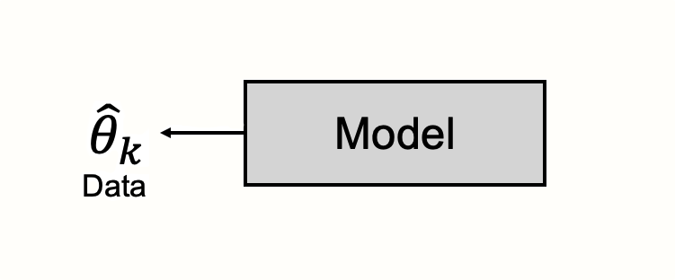
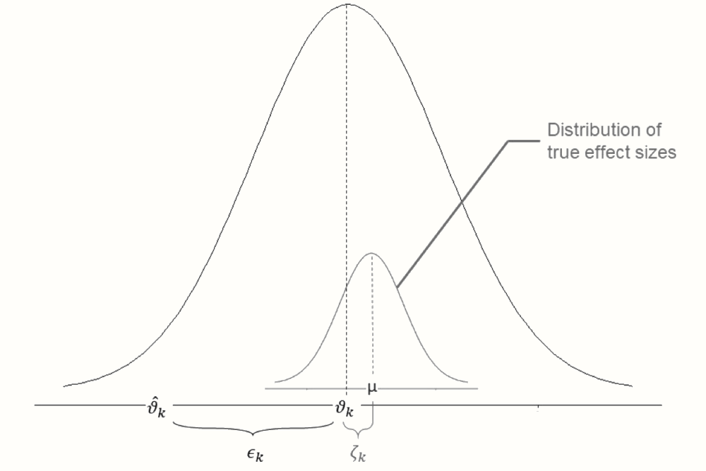
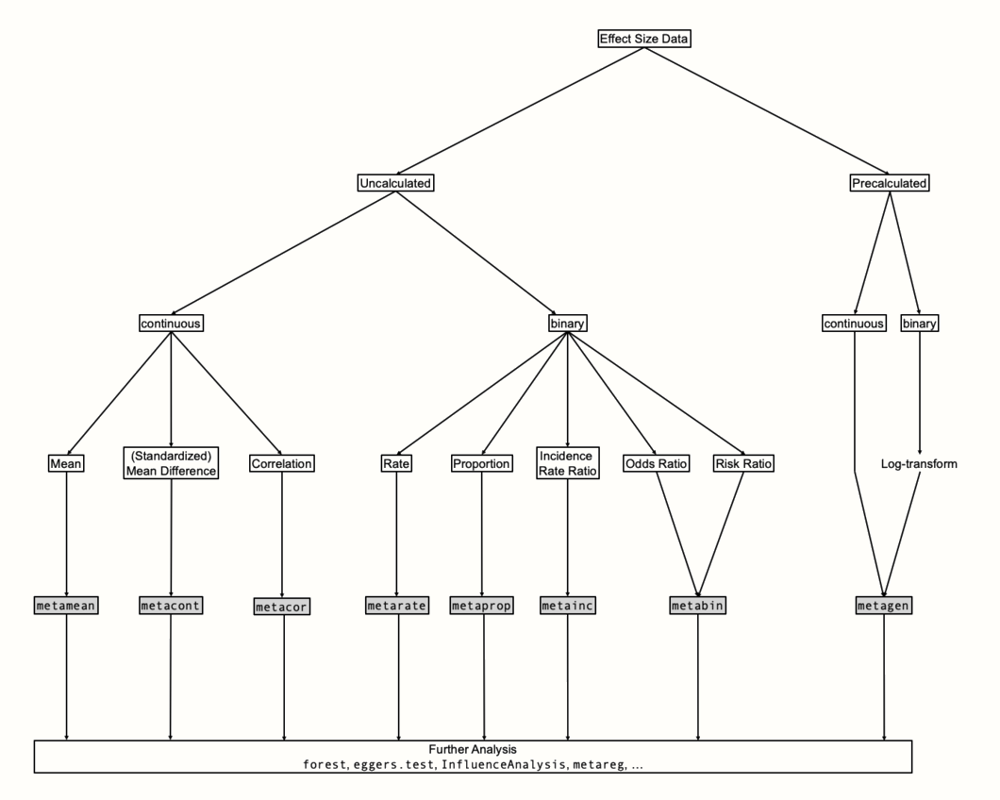

# Pooling Effect Sizes {#pooling-es}

---


<br></br>

<span class="firstcharacter">A</span> long and winding road already lies behind us. Fortunately, we have now reached the core part of every meta-analysis: the pooling of effect sizes. We hope that you were able to resist the temptation of starting directly with this chapter. We have already discussed various topics in this book, including the definition of research questions, guidelines for searching, selecting, and extracting study data, as well as how to prepare our effect sizes. 

Thorough preparation is a key ingredient of a good meta-analysis, and will be immensely helpful in the steps that are about to follow. We can assure you that the time you spent working through the previous chapters was well invested.

\index{meta Package}

There are many packages which allow us to pool effect sizes in _R_. Here, we will focus on functions of the **{meta}** package, which we already installed in Chapter \@ref(packages). This package is very user-friendly and provides us with nearly all important meta-analysis results using just a few lines of code. In the previous chapter, we covered that effect sizes come in different "flavors", depending on the outcome of interest. The **{meta}** package contains specialized meta-analysis functions for each of these effect size metrics. All of the functions also follow nearly the same structure. 

Thus, once we have a basic understanding of how **{meta}** works, coding meta-analyses becomes straightforward, no matter which effect size we are focusing on. In this chapter, we will cover the general structure of the **{meta}** package. And of course, we will also explore the meta-analysis functions of the package in greater detail using hands-on examples.

The **{meta}** package allows us to tweak many details about the way effect sizes are pooled. As we previously mentioned, meta-analysis comes with many "researcher degrees of freedom". There are a myriad of choices concerning the statistical techniques and approaches we can apply, and if one method is better than the other often depends on the context. 

\index{Fixed-Effect Model}
\index{Random-Effects Model}

Before we begin with our analyses in _R_, we therefore have to get a basic understanding of the statistical assumptions of meta-analyses, and the maths behind it. Importantly, we will also discuss the "idea" behind meta-analyses. In statistics, this "idea" translates to a **model**, and we will have a look at what the meta-analytic model looks like. 

As we will see, the nature of the meta-analysis requires us to make a fundamental decision right away: we have to assume either a **fixed-effect model** or a **random-effects model**. Knowledge of the concept behind meta-analytic pooling is needed to make an informed decision which of these two models, along with other analytic specifications, is more appropriate in which context.

<br></br>

## The Fixed-Effect and Random-Effects Model {#fem-rem}

---

Before we specify the meta-analytic model, we should first clarify what a statistical model actually is. Statistics is full of "models", and it is likely that you have heard the term in this context before. There are "linear models", "generalized linear models", "mixture models", "gaussian additive models", "structural equation models", and so on. 

The ubiquity of models in statistics indicates how important this concept is. In one way or the other, models build the basis of virtually all parts of our statistical toolbox. There is a model behind $t$-tests, ANOVAs, and regression. Every hypothesis test has its corresponding statistical model. 

When defining a statistical model, we start with the information that is already given to us. This is, quite literally, our **data**^["Data" is derived from the Latin word **datum**, meaning "a thing that is given".]. In meta-analyses, the data are effect sizes that were observed in the included studies. Our model is used to describe the process through which these observed data were generated. 

The data are seen as the product of a **black box**, and our model aims to illuminate what is going on inside that black box. 


```{r model, out.width='50%', message = F, echo = F, fig.align='center'}
library(OpenImageR)

```

Typically, a statistical model is like a special type of **theory**. Models try to explain the mechanisms that generated our observed data, especially when those mechanisms themselves cannot be directly observed. They are an **imitation of life**, using a mathematical formula to describe processes in the world around us in an idealized way. 

This explanatory character of models is deeply ingrained in modern statistics, and meta-analysis is no exception. The conceptualization of models as a vehicle for explanation is the hallmark of a statistical "culture" to which, as Breiman [-@breiman2001statistical] famously estimated, 98% of all statisticians adhere. 

By specifying a statistical model, we try to find an approximate representation of the "reality" behind our data. We want a mathematical formula that explains how we can find the **true** effect size underlying all of our studies, based on their observed results. As we learned in Chapter \@ref(what-are-mas), one of the ultimate goals of meta-analysis is to find one numerical value that characterizes our studies **as a whole**, even though the observed effect sizes vary from study to study. A meta-analysis model must therefore explain the reasons why and how much observed study results differ, even though there is only one overall effect. 

There are two models which try to answer exactly this question, the **fixed-effect model** and the **random-effects model**. Although both are based on different assumptions, there is still a strong link between them, as we will soon see.

<br></br>

### The Fixed-Effect Model {#fem}

---

\index{Fixed-Effect Model}
\index{Sampling Error}

The fixed-effect model assumes that all effect sizes stem from a single, homogeneous population. It states that all studies share the **same** true effect size. This true effect is the overall effect size we want to calculate in our meta-analysis, denoted with $\theta$.

According to the fixed-effect model, the only reason why a study $k$'s observed effect size $\hat\theta_k$ deviates from $\theta$ is because of its sampling error $\epsilon_k$. The fixed-effect model tells us that the process generating studies' different effect sizes, the content of the "black box", is simple: all studies are estimators of the same true effect size. Yet, because every study can only draw somewhat bigger or smaller samples of the infinitely large study population, results are burdened by sampling error. This sampling error causes the observed effect to deviate from the overall, true effect. 

We can describe the relationship like this [@borenstein2011introduction, chapter 11]:

\begin{equation}
\hat\theta_k = \theta + \epsilon_k 
(\#eq:pes1)
\end{equation}

To the alert reader, this formula may seem oddly similar to the one in Chapter \@ref(what-is-es). You are not mistaken. In the previous formula, we defined that an observed effect size $\hat\theta_k$ of some study $k$ is an estimator of that study's true effect size $\theta_k$, burdened by the study's sampling error $\epsilon_k$. 

There is only a tiny, but insightful difference between the previous formula, and the one of the fixed-effect model. In the formula of the fixed-effect model, the true effect size is not symbolized by $\theta_k$, but by $\theta$; the subscript $k$ is dropped. 

Previously, we only made statements about the true effect size of **one** individual study $k$. The fixed-effect model goes one step further. It tells us that if we find the true effect size of study $k$, this effect size is not only true for $k$ specifically, but for **all** studies in our meta-analysis. A **study's** true effect size $\theta_k$, and the **overall**, pooled effect size $\theta$, are **identical**.


```{block2, type='boxinfo'}
The **idea behind the fixed-effect model** is that observed effect sizes may vary from study to study, but this is only because of the sampling error. In reality, their true effect sizes are **all the same**: they are **fixed**.
```


The formula of the fixed-effect models tells us that there is only one reason why observed effect sizes $\theta_k$ deviate from the true overall effect: because of the sampling error $\epsilon_k$. In Chapter \@ref(what-is-es), we already discussed that there is a link between the sampling error and the sample size of a study. All things being equal, as the sample size becomes larger, the sampling error becomes smaller. We also learned that the sampling error can be represented numerically by the **standard error**, which also grows smaller when the sample size increases. 

Although we do not know the true overall effect size of our studies, we can exploit this relationship to arrive at the best possible estimate of the true overall effect, $\hat\theta$. We know that a smaller standard error corresponds with a smaller sampling error; therefore, studies with a small standard error should be better estimators of the true overall effect than studies with a large standard error.

We can illustrate this with a simulation. Using the `rnorm` function we already used before, we simulated a selection of studies in which the true overall effect is $\theta = 0$. We took several samples but varied the sample size so that the standard error differs between the "observed" effects. The results of the simulation can be found in Figure \@ref(fig:funnel1). 


```{r funnel1, fig.height=5, fig.width=5, fig.cap='Relationship between effect size and standard error.', echo=F, fig.align='center', message=FALSE, out.width="50%"}
library(plotrix)
library(data.table)
library(ggplot2)

set.seed(1234)
res = list()
for (i in 5:54){
  vec = list()
  for (x in 1:50){
    dat = rnorm(i, 0, sd = 10)
    vec[[x]] = data.frame(value = mean(dat),
                          SE = std.error(dat))
  }
  vec = do.call(rbind, vec)
  res[[i-4]] = vec
}

res = rbindlist(res)

ggplot(data = res, aes(x = value, y = log(SE))) +
  geom_point(alpha = 0.5, size = 0.8) +
  scale_y_reverse() +
  geom_vline(xintercept = 0, color = "gray", size = 2, alpha = 0.5) +
  theme_classic() +
  xlab("Effect Size") +
  ylab("log-Standard Error") +
  theme(panel.background = element_rect(fill = "#FFFEFA",
                                        size = 0),
        plot.background = element_rect(fill = "#FFFEFA",
                                       size = 0))


```

The results of the simulation show an interesting pattern. We see that effect sizes with a small sampling error are tightly packed around the true effect size $\theta = 0$. As the standard error on the y-axis^[We log-transformed the standard error before plotting so that the pattern can be more easily seen.] increases, the **dispersion** of effect sizes becomes larger and larger, and the observed effects deviate more and more from the true effect. 

This behavior can be predicted by the formula of the fixed-effect model. We know that studies with a smaller standard error have a smaller sampling error, and their estimate of the overall effect size is therefore more likely to be closer to the truth.

\index{Weight}

We have seen that, while all observed effect sizes are estimators of the true effect, some are better than others. When we pool the effects in our meta-analysis, we should therefore give effect sizes with a higher **precision** (i.e. a smaller standard error) a greater **weight**. If we want to calculate the pooled effect size under the fixed-effect model, we therefore simply use a **weighted average** of all studies. 

To calculate the weight $w_k$ for each study $k$, we can use the standard error, which we square to obtain the **variance** $s^2_k$ of each effect size. Since a **lower** variance indicates higher precision, the **inverse** of the variance is used to determine the weight of each study. 

\begin{equation}
w_k = \frac{1}{s^2_k}
(\#eq:pes2)
\end{equation}

Once we know the weights, we can calculate the weighted average, our estimate of the true pooled effect $\hat\theta$. We only have to multiply each study's effect size $\hat\theta_k$ with its corresponding weight $w_k$, sum the results across all studies $K$ in our meta-analysis, and then divide by the sum of all the individual weights.

\begin{equation}
\hat\theta = \frac{\sum^{K}_{k=1} \hat\theta_kw_k}{\sum^{K}_{k=1} w_k}
(\#eq:pes3)
\end{equation}

\index{Inverse-Variance Weighting}
\index{Mantel-Haenszel Method}
\index{Peto Method}

This method is the most common approach to calculate average effects in meta-analyses. Because we use the inverse of the variance, it is often called **inverse-variance weighting** or simply **inverse-variance meta-analysis**. 

For binary effect size data, there are alternative methods to calculate the weighted average, including the **Mantel-Haenszel**, **Peto**, or the sample size weighting method by Bakbergenuly [-@bakbergenuly2020methods]. We will discuss these methods in Chapter \@ref(pooling-or-rr). 

The **{meta}** package makes it very easy to perform a fixed-effect meta-analysis. Before, however, let us try out the inverse-variance pooling "manually" in _R_. In our example, we will use the `SuicidePrevention` data set, which we already imported in Chapter \@ref(data-prep-R). 

\index{dmetar Package}

```{block2, type='boxdmetar'}
**The "SuicidePrevention" Data Set**

The `SuicidePrevention` data set is also included directly in the **{dmetar}** package. If you have installed **{dmetar}**, and loaded it from your library, running `data(SuicidePrevention)` automatically saves the data set in your _R_ environment. The data set is then ready to be used. If you do not have **{dmetar}** installed, you can download the data set as an _.rda_ file from the [Internet](https://www.protectlab.org/meta-analysis-in-r/data/suicideprevention.rda), save it in your working directory, and then click on it in your R Studio window to import it. 
```


\index{esc Package}
\index{Standardized Mean Difference}
\index{Hedges' \textit{g}}

The `SuicidePrevention` data set contains raw effect size data, meaning that we have to calculate the effect sizes first. In this example, we calculate the small-sample adjusted standardized mean difference (Hedges' $g$). To do this, we use the `esc_mean_sd` function in the **{esc}** package (Chapter \@ref(b-group-smd)). 

The function has an additional argument, `es.type`, through which we can specify that the small-sample correction should be performed (by setting `es.type = "g"`; Chapter \@ref(hedges-g)). 

```{r, message=F, eval=F}
# Load dmetar, esc and tidyverse (for pipe)
library(dmetar)
library(esc)
library(tidyverse)

# Load data set from dmetar
data(SuicidePrevention)

# Calculate Hedges' g and the Standard Error
# - We save the study names in "study".
# - After that, we use the pipe operator to directly transform
#   the results to a data frame.
SP_calc <- esc_mean_sd(grp1m = SuicidePrevention$mean.e,
                       grp1sd = SuicidePrevention$sd.e,
                       grp1n = SuicidePrevention$n.e,
                       grp2m = SuicidePrevention$mean.c,
                       grp2sd = SuicidePrevention$sd.c,
                       grp2n = SuicidePrevention$n.c,
                       study = SuicidePrevention$author,
                       es.type = "g") %>% 
                     as.data.frame()

# Let us catch a glimpse of the data
# The data set contains Hedges' g ("es") and standard error ("se")
glimpse(SP_calc)

```

```
## Rows: 9
## Columns: 9
## $ study       <chr> "Berry et al.", "DeVries et al.", "Fleming et al." …
## $ es          <dbl> -0.14279447, -0.60770928, -0.11117965, -0.12698011 …
## $ weight      <dbl> 46.09784, 34.77314, 14.97625, 32.18243, 24.52054 …
## $ sample.size <dbl> 185, 146, 60, 129, 100, 220, 120, 80, 107data
## $ se          <dbl> 0.1472854, 0.1695813, 0.2584036, 0.1762749 …
## $ var         <dbl> 0.02169299, 0.02875783, 0.06677240, 0.03107286 …
## $ ci.lo       <dbl> -0.4314686, -0.9400826, -0.6176413, -0.4724727 …
## $ ci.hi       <dbl> 0.145879624, -0.275335960, 0.395282029 …
## $ measure     <chr> "g", "g", "g", "g", "g", "g", "g", "g", "g"

```

```{r, message=F, eval=F}
# We now calculate the inverse variance-weights for each study
SP_calc$w <- 1/SP_calc$se^2

# Then, we use the weights to calculate the pooled effect
pooled_effect <- sum(SP_calc$w*SP_calc$es)/sum(SP_calc$w)
pooled_effect

```

```
## [1] -0.2311121
```

The results of our calculations reveal that the pooled effect size, assuming a fixed-effect model, is $g \approx$ -0.23.


<br></br>

### The Random-Effects Model {#rem}

---

\index{Random-Effects Model}

As we have seen, the fixed-effect model is one way to conceptualize the genesis of our meta-analysis data, and how effects can be pooled. However, the important question is: does this approach adequately reflect reality? 

The fixed-effect model assumes that all our studies are part of a homogeneous population and that the only cause for differences in observed effects is the sampling error of studies. If we were to calculate the effect size of each study without sampling error, all true effect sizes would be absolutely the same. 

\index{Heterogeneity}

Subjecting this notion to a quick reality check, we see that the assumptions of the fixed-effect model might be too simplistic in many real-world applications. It is simply unrealistic that studies in a meta-analysis are always completely homogeneous. Studies will very often differ, even if only in subtle ways. The outcome of interest may have been measured in different ways. Maybe the type of treatment was not exactly the same or the intensity and length of the treatment. The target population of the studies may not have been exactly identical, or maybe there were differences in the control groups that were used. 

It is likely that the studies in your meta-analysis will not only vary on one of these aspects but several ones at the same time. If this is true, we can anticipate considerable between-study **heterogeneity** in the true effects. 

All of this casts the validity of the fixed-effect model into doubt. If some studies used different types of a treatment, for example, it seems perfectly normal that one format is more effective than the other. It would be far-fetched to assume that these differences are only noise, produced by the studies' sampling error. 

Quite the opposite, there may be countless reasons why **real** differences exist in the **true** effect sizes of studies. The random-effects model addresses this concern. It provides us with a model that often reflects the reality behind our data much better.

\index{Sampling Error}

In the random-effects model, we want to account for the fact that effect sizes show more variance than when drawn from a single homogeneous population [@hedges1998fixed]. Therefore, we assume that effects of individual studies do not only deviate due to sampling error alone but that there is **another** source of variance. 

This additional variance component is introduced by the fact that studies do not stem from one single population. Instead, each study is seen as an independent draw from a “universe” of populations. 

```{block2, type='boxinfo'}
The random-effects model assumes that there is not only one true effect size but a **distribution** of true effect sizes. The goal of the random-effects model is therefore not to estimate the one true effect size of all studies, but the **mean** of the **distribution** of true effects.
```


Let us see how the random-effects model can be expressed in a formula. Similar to the fixed-effect model, the random-effects model starts by assuming that an observed effect size $\hat\theta_k$ is an estimator of the study's true effect size $\theta_k$, burdened by sampling error $\epsilon_k$:

\begin{equation}
\hat\theta_k = \theta_k + \epsilon_k 
(\#eq:pes4)
\end{equation}

The fact that we use $\theta_k$ instead of $\theta$ already points to an important difference. The random-effects model only assumes that $\theta_k$ is the true effect size of **one** single study $k$. It stipulates that there is a second source of error, denoted by $\zeta_k$. This second source of error is introduced by the fact that even the true effect size $\theta_k$ of study $k$ is only part of an over-arching distribution of true effect sizes with mean $\mu$.

\begin{equation}
\theta_k  = \mu + \zeta_k
(\#eq:pes5)
\end{equation}

The random-effects model tells us that there is a hierarchy of two processes happening inside our black box [@thompson2001multilevel]: the observed effect sizes of a study deviate from their true value because of the sampling error. But even the true effect sizes are only a draw from a universe of true effects, whose mean $\mu$ we want to estimate as the pooled effect of our meta-analysis. 

By plugging the second formula into the first one (i.e. replacing $\theta_k$ with its definition in the second formula), we can express the random-effects model in one line [@borenstein2011introduction, chapter 12]:

\begin{equation}
\hat\theta_k = \mu + \zeta_k + \epsilon_k
(\#eq:pes6)
\end{equation}
 
This formula makes it clear that our observed effect size deviates from the pooled effect $\mu$ because of two error terms, $\zeta_k$ and $\epsilon_k$. This relationship is visualized in Figure \@ref(fig:random). 

\index{Exchangeability Assumption}

A crucial assumption of the random-effects model is that the size of $\zeta_k$ is **independent** of $k$. Put differently, we assume that there is nothing which indicates **a priori** that $\zeta_k$ in one study is higher than in another. We presuppose that the size of $\zeta_k$ is a product of chance, and chance alone. 

This is known as the **exchangeability** assumption of the random-effects model [@higgins2009re; @lunn2012bugs, chapter 10.1]. All true effect sizes are assumed to be exchangeable in so far as we have nothing that could tell us how big $\zeta_k$ will be in some study $k$ before seeing the data.  


\index{Heterogeneity}

```{block2, type='boxinfo'}
**Which Model Should I Use?**

\vspace{2mm}

In practice, is it very uncommon to find a selection of studies that is perfectly homogeneous. This is true even when we follow best practices, and try to make the scope of our analysis as precise as possible through our PICO (Chapter \@ref(research-question)). 

\vspace{4mm}

In many fields, including medicine and the social sciences, it is therefore conventional to **always** use a random-effects model, since some degree of between-study heterogeneity can virtually always be anticipated. A fixed-effect model may only be used when we could not detect any between-study heterogeneity (we will discuss how this is done in Chapter \@ref(heterogeneity)) **and** when we have very good reasons to assume that the true effect is fixed. This may be the case when, for example, only exact replications of a study are considered, or when we meta-analyze subsets of one big study. Needless to say, this is seldom the case, and applications of the fixed-effect model "in the wild" are rather rare.

\vspace{4mm}

Even though it is conventional to use the random-effects model a priori, this approach is not undisputed. The random-effects model pays more attention to small studies when calculating the overall effect of a meta-analysis [@schwarzer2015meta, chapter 2.3]. Yet, small studies in particular are often fraught with biases (see Chapter \@ref(small-study-effects)). This is why some have argued that the fixed-effect model is (sometimes) preferable [@poole1999random; @furukawa2003low].


```


```{r random, fig.cap='Illustration of parameters of the random-effects model.', out.width='60%', message = F, echo = F, fig.align='center'}
library(OpenImageR)

```


<br></br>

#### Estimators of the Between-Study Heterogeneity {#tau-estimators}

---

\index{Weight}

The challenge associated with the random-effects model is that we have to take the error $\zeta_k$ into account. To do this, we have to estimate the **variance** of the distribution of true effect sizes. This variance is known as $\tau^2$, or **tau-squared**. Once we know the value of $\tau^2$, we can include the between-study heterogeneity when determining the inverse-variance weight of each effect size. 

In the random-effects model, we therefore calculate an adjusted **random-effects weight** $w^*_k$ for each observation. The formula looks like this:

\begin{equation}
w^*_k = \frac{1}{s^2_k+\tau^2} 
(\#eq:pes7)
\end{equation}

\index{Inverse-Variance Weighting}

Using the adjusted random-effects weights, we then calculate the pooled effect size using the inverse variance method, just like we did using the fixed-effect model:

\begin{equation}
\hat\theta = \frac{\sum^{K}_{k=1} \hat\theta_kw^*_k}{\sum^{K}_{k=1} w^*_k}
(\#eq:pes8)
\end{equation}

There are several  methods to estimate $\tau^2$, most of which are too complicated to do by hand. Luckily, however, these estimators are implemented in the functions of the **{meta}** package, which does the calculations automatically for us. Here is a list of the most common estimators, and the code by which they are referenced in **{meta}**:

\index{DerSimonian-Laird Estimator}
\index{Restricted Maximum Likelihood Estimator}
\index{Maximum Likelihood}
\index{Sidik-Jonkman Estimator}

* The **DerSimonian-Laird** (`"DL"`) estimator [@dersimonian1986meta].
* The **Restricted Maximum Likelihood** (`"REML"`) or **Maximum Likelihood** (`"ML"`) procedures [@viechtbauer2005bias].
* The **Paule-Mandel** (`"PM"`) procedure [@paule1982consensus].
* The **Empirical Bayes** (`"EB"`) procedure [@sidik2019note], which is practically identical to the Paule-Mandel method.
* The **Sidik-Jonkman** (`"SJ"`) estimator [@sidik2005simple].

It is an ongoing research question which of these estimators performs best for different kinds of data. If one of the approaches is better than the other often depends on parameters such as the number of studies $k$, the number of participants $n$ in each study, how much $n$ varies from study to study, and how big $\tau^2$ is. Several studies have analyzed the bias of $\tau^2$ estimators under these varying scenarios [@veroniki2016methods; @viechtbauer2005bias; @sidik2007comparison; @langan2019comparison]. 

\index{Review Manager (RevMan)}
\index{Comprehensive Meta-Analysis (CMA)}

Arguably, the most frequently used estimator is the one by DerSimonian and Laird. The estimator is implemented in software that has commonly been used by meta-analysts in the past, such as **RevMan** (a program developed by Cochrane) or **Comprehensive Meta-Analysis**. It is also the default estimator used in **{meta}**. Due to this historic legacy, one often finds research papers in which "using a random-effects model" is used synonymously with employing the DerSimonian-Laird estimator. 

However, it has been found that this estimator can be biased, particularly when the number of studies is small and heterogeneity is high [@hartung1999alternative; @hartung2001refined; @hartung2001tests; @follmann1999valid; @makambi2004effect]. This is quite problematic because it is very common to find meta-analyses with few studies and high heterogeneity.

\index{Paule-Mandel Estimator}
\index{metafor Package}
\index{Sidik-Jonkman Estimator}
\index{Restricted Maximum Likelihood Estimator}

In an overview paper, Veroniki and colleagues [-@veroniki2016methods] reviewed evidence on the robustness of various $\tau^2$ estimators. They recommended the Paule-Mandel method for both binary and continuous effect size data, and the restricted maximum likelihood estimator for continuous outcomes. The restricted maximum-likelihood estimator is also the default method used by the **{metafor}** package. 

A more recent simulation study by Langan and colleagues [-@langan2019comparison] came to a similar result but found that the Paule-Mandel estimator may be suboptimal when the sample size of studies varies drastically. Another study by Bakbergenuly and colleagues [-@bakbergenuly2020methods] found that the Paule-Mandel estimator is well suited especially when the number of studies is small. The Sidik-Jonkman estimator, also known as the **model error variance method**, is only well suited when $\tau^2$ is very large [@sidik2007comparison]. 

```{block2, type='boxinfo'}
**Which Estimator Should I Use?**

\vspace{2mm}

There are no iron-clad rules when exactly which estimator should be used. In many cases, there will only be minor differences in the results produced by various estimators, meaning that you should not worry about this issue **too** much. 

\vspace{4mm}

When in doubt, you can always rerun your analyses using different $\tau^2$ estimators, and see if this changes the interpretation of your results. Here are a few tentative guidelines that you may follow in your own meta-analysis:

1. For effect sizes based on continuous outcome data, the restricted maximum likelihood estimator may be used as a first start.

2. For binary effect size data, the Paule-Mandel estimator is a good first choice, provided there is no extreme variation in the sample sizes.

3. When you have very good reason to believe that the heterogeneity of effects in your sample is very large, and if avoiding false positives has a very high priority, you may use the Sidik-Jonkman estimator.

4. If you want that others can replicate your results as precisely as possible outside _R_, the DerSimonian-Laird estimator is the method of choice.

\vspace{2mm}

```


Overall, estimators of $\tau^2$ fall into two categories. Some, like the DerSimonian-Laird and Sidik-Jonkman estimator, are based on **closed-form expressions**, meaning that they can be directly calculated using a formula. 

The (restricted) maximum likelihood, Paule-Mandel and empirical Bayes estimator find the optimal value of $\tau^2$ through an **iterative algorithm**. Latter estimators may therefore sometimes take a little longer to calculate the results. In most real-world cases, however, these time differences are minuscule at best.

<br></br>

#### Knapp-Hartung Adjustments {#knapp-hartung}

---

\index{Knapp-Hartung Adjustment}
\index{Wald-Type Test}
\index{t-Distribution}

In addition to our selection of the $\tau^2$ estimator, we also have to decide if we want to apply so-called Knapp-Hartung adjustments^[This approach is also known as "Hartung-Knapp adjustments" or the "Hartung-Knapp-Sidik-Jonkman" (HKSJ) method.] [@knapp2003improved; @sidik2002simple]. These adjustments affect the way the standard error (and thus the confidence intervals) of our pooled effect size $\hat\theta$ is calculated. 

The Knapp-Hartung adjustment tries to control for the uncertainty in our estimate of the between-study heterogeneity. While significance tests of the pooled effect usually assume a normal distribution (so-called **Wald-type** tests), the Knapp-Hartung method is based on a $t$-distribution. Knapp-Hartung adjustments can only be used in random-effects models, and usually cause the confidence intervals of the pooled effect to become slightly larger. 

\index{Heterogeneity}

```{block, type='boxreport'}
**Reporting the Type of Model Used In Your Meta-Analysis**

\vspace{2mm}

It is highly advised to specify the type of model you used in the methods section of your meta-analysis report. Here is an example:

> _"As we anticipated considerable between-study heterogeneity, a random-effects model was used to pool effect sizes. The restricted maximum likelihood estimator (Viechtbauer, 2005) was used to calculate the heterogeneity variance $\tau^2$. We used Knapp-Hartung adjustments (Knapp & Hartung, 2003) to calculate the confidence interval around the pooled effect."_

```


Applying a Knapp-Hartung adjustment is usually sensible. Several studies [@inthout2014hartung; @langan2019comparison] showed that these adjustments can reduce the chance of false positives, especially when the number of studies is small. 

The use of the Knapp-Hartung adjustment, however, is not uncontroversial. Wiksten and colleagues [-@wiksten2016hartung], for example, argued that the method can cause anti-conservative results in (seldom) cases when the effects are very homogeneous.

<br></br>

## Effect Size Pooling in _R_ {#pooling-es-r}

---

\index{meta Package}

Time to put what we learned into practice. In the rest of this chapter, we will explore how we can run meta-analyses of different effect sizes directly in _R_. The **{meta}** package we will use to do this has a special structure. It contains several meta-analysis functions which are each focused on one type of effect size data. There is a set of parameters which can be specified in the same way across all of these functions; for example if we want to apply a fixed- or random-effects model, or which $\tau^2$ estimator should be used. Apart from that, there are **function-specific** arguments which allow us to tweak details of our meta-analysis that are only relevant for a specific type of data. 

Figure \@ref(fig:metaflow) provides an overview of **{meta}**'s structure. To determine which function to use, we first have to clarify what kind of effect size data we want to synthesize. The most fundamental distinction is the one between **raw** and **pre-calculated** effect size data. We speak of "raw" data when we have all the necessary information needed to calculate the desired effect size stored in our data frame but have not yet calculated the actual effect size. The `SuicidePrevention` data set we used earlier contains raw data: the mean, standard deviation and sample size of two groups, which is needed to calculate the standardized mean difference. 

We call effect size data "pre-calculated", on the other hand, when they already contain the final effect size of each study, as well as the standard error. If we want to use a corrected version of an effect metric (such as Hedges' $g$, Chapter \@ref(hedges-g)), it is necessary that this correction has already been applied to pre-calculated effect size data before we start the pooling. 


```{r metaflow, out.width='100%', fig.cap='Conceptual overview of meta-analysis functions.', message = F, echo = F, fig.align='center'}
library(OpenImageR)

```


If possible, it is preferable to use raw data in our meta-analysis. This makes it easier for others to understand how we calculated the effect sizes, and replicate the results. Yet, using raw data is often not possible in practice, because studies often report their results in a different way (Chapter \@ref(es-formats-different)). 

This leaves us no other choice than to pre-calculate the desired effect size for each study right away so that all have the same format. Chapter \@ref(es-calc) in the “Helpful Tools” part of this book presents a few formulas which can help you to convert a reported effect size into the desired metric.

The function of choice for pre-calculated effect sizes is `metagen`. Its name stands for **gen**eric inverse variance meta-analysis. If we use `metagen` with binary data (e.g. proportions, risk ratios, odds ratios), it is important, as we covered in Chapter \@ref(ratios), that the effect sizes are log-transformed before the function is used. 

When we can resort to raw effect size data, **{meta}** provides us with a specialized function for each effect size type. We can use the `metamean`, `metacont` and `metacor` function for means, (standardized) mean differences and correlations, respectively. We can pool (incidence) rates, proportions and incidence rate ratios using the `metarate`, `metaprop` and `metainc` functions. The `metabin` function can be employed when we are dealing with risk or odds ratios.

All meta-analysis functions in **{meta}** follow the same structure. We have to provide the functions with the (raw or pre-calculated) effect size data, as well as further arguments, which control the specifics of the analysis. There are six core arguments which can be specified in each function:

* **`studlab`**. This argument associates each effect size with a **study label**. If we have the name or authors of our studies stored in our data set, we simply have to specify the name of the respective column (e.g. `studlab = author`). 
* **`sm`**. This argument controls the **summary measure**, the effect size metric we want to use in our meta-analysis. This option is particularly important for functions using raw effect size data. The **{meta}** package uses codes for different effect size formats, for example `"SMD"` or `"OR"`. The available summary measures are not the same in each function, and we will discuss the most common options in each case in the following sections.
* **`fixed`**. We need to provide this argument with a logical (`TRUE` or `FALSE`), indicating if a fixed-effect model meta-analysis should be calculated^[In older versions of **{meta}** (before version 5.0-0), this argument is called `comb.fixed`.].
* **`random`**. In a similar fashion, this argument controls if a random-effects model should be used. If both `comb.fixed` and `comb.random` are set to `TRUE`, both models are calculated and displayed^[In older versions of **{meta}** (before version 5.0-0), this argument is called `comb.random`.].
* **`method.tau`**. This argument defines the $\tau^2$ estimator. All functions use the codes for different estimators that we already presented in the previous chapter (e.g. for the DerSimonian-Laird method: `method.tau = "DL"`).
* **`hakn`**. This is yet another logical argument, and controls if the Knapp-Hartung adjustments should be applied when using the random-effects model.
* **`data`**. In this argument, we provide **{meta}** with the name of our meta-analysis data set.
* **`title`** (**not mandatory**). This argument takes a character string with the name of the analysis. While it is not essential to provide input for this argument, it can help us to identify the analysis later on.

There are also a few additional arguments which we will get to know in later chapters. In this guide, we will not be able to discuss **all** arguments of the **{meta}** functions: there are more than 100. 

Thankfully, most of these arguments are rarely needed or have sensible defaults. When in doubt, you can always run the name of the function, preceded by a question mark (e.g. `?metagen`) in the _R_ console; this will open the function documentation. 


\index{Function Argument}
\index{Position Matching}
\index{Documentation, _R_}

```{block, type='boxinfo'}
**Default Arguments & Position Matching**

\vspace{2mm}

For _R_ beginners, it is often helpful to learn about **default arguments** and **position-based matching** in functions. 

\vspace{2mm}

Default arguments are specified by the person who wrote the function. They set a function argument to a predefined value, which is automatically used unless we explicitly provide a different value. In **{meta}** many, but not all arguments have default values. 

\vspace{2mm}

Default values are displayed in the "usage" section of the function documentation. If a function has defined a default value for an argument, it is not necessary to include it in our function call, unless we are not satisfied with the default behavior.

\vspace{2mm}

Arguments **without** default values always need to be specified in our function call. The **{meta}** package has a convenience function called `gs` which we can use to check the default value used for a specific argument. For example, try running `gs("method.tau")`. If there is no default value, `gs` will return `NULL`.

\vspace{2mm}

Another interesting detail about _R_ functions is position matching. Usually, we have to write down the name of an argument and its value in a function call. Through position matching, however, we can leave out the name of the argument, and only have to type in the argument value. We can do this if we specify the argument in the same **position** in which it appears in the documentation. 

Take the `sqrt` function. A written out call of this function would be `sqrt(x = 4)`. However, because we know that `x`, the number, is the first argument, we can simply type in `sqrt(4)` with the same result.

```


<br></br>

### Pre-Calculated Effect Size Data {#pre-calculated-es}

---

Let us begin our tour of meta-analysis functions with `metagen`. As we learned, this function can be used for pre-calculated effect size data. In our first example, we will use the function to perform a meta-analysis of the `ThirdWave` data set.

\index{Hedges' \textit{g}}
\index{Standardized Mean Difference}

This data set contains studies examining the effect of so-called "third wave" psychotherapies on perceived stress in college students. For each study, the standardized mean difference between a treatment and control group at post-test was calculated, and a small sample correction was applied. The effect size measure used in this meta-analysis, therefore, is Hedges' $g$. Let us have a look at the data.

\index{dmetar Package}

```{block, type='boxdmetar'}
**The "ThirdWave" Data Set**

\vspace{2mm}

The `ThirdWave` data set is included directly in the **{dmetar}** package. If you have installed **{dmetar}**, and loaded it from your library, running `data(ThirdWave)` automatically saves the data set in your _R_ environment. The data set is then ready to be used. If you do not have **{dmetar}** installed, you can download the data set as an _.rda_ file from the [Internet](https://www.protectlab.org/meta-analysis-in-r/data/thirdwave.rda), save it in your working directory, and then click on it in your R Studio window to import it.

```


```{r, message=F}
library(tidyverse) # needed for 'glimpse'
library(dmetar)
library(meta)

data(ThirdWave)
glimpse(ThirdWave)

```

We see that the data set has eight columns, the most important of which are `Author`, `TE` and `seTE`. The `TE` column contains the $g$ value of each study, and `seTE` is the standard error of $g$. The other columns represent variables describing the subgroup categories that each study falls into. These variables are not relevant for now.

We can now start to think about the type of meta-analysis we want to perform. Looking at the subgroup columns, we see that studies vary at least with respect to their risk of bias, control group, intervention duration, intervention type, and mode of delivery. 

This makes it quite clear that some between-study heterogeneity can be expected, and that it makes no sense to assume that all studies have a fixed true effect. We may therefore use the random-effects model for pooling. Given its robust performance in continuous outcome data, we choose the restricted maximum likelihood (`"REML"`) estimator in this example. We will also use the Knapp-Hartung adjustments to reduce the risk of a false positive result. 

Now that we have these fundamental questions settled, the specification of our call to `metagen` becomes fairly straightforward. There are two function-specific arguments which we always have to specify when using the function:

* **`TE`**. The name of the column in our data set which contains the calculated effect sizes.

* **`seTE`**. The name of the column in which the standard error of the effect size is stored.

The rest are generic **{meta}** arguments that we already covered in the last chapter. Since the analysis deals with standardized mean differences, we also specify `sm = "SMD"`. However, in this example, this has no actual effect on the results, since effect sizes are already calculated for each study. It will only tell the function to label effect sizes as SMDs in the output. 

This gives us all the information we need to set up our first call to `metagen`. We will store the results of the function in an object called `m.gen`.

```{r}
m.gen <- metagen(TE = TE,
                 seTE = seTE,
                 studlab = Author,
                 data = ThirdWave,
                 sm = "SMD",
                 fixed = FALSE,
                 random = TRUE,
                 method.tau = "REML",
                 hakn = TRUE,
                 title = "Third Wave Psychotherapies")
```

Our `m.gen` object now contains all the meta-analysis results. An easy way to get an overview is to use the `summary` function^[In older versions of **{meta}** (before version 5.0-0), this overview can be printed without using `summary`. Simply call your newly created meta-analysis object directly in the _R_ console.].

```{r, eval=F}
summary(m.gen)
```

```
## Review:     Third Wave Psychotherapies
##                       SMD            95%-CI %W(random)
## Call et al.        0.7091 [ 0.1979; 1.2203]        5.0
## Cavanagh et al.    0.3549 [-0.0300; 0.7397]        6.3
## DanitzOrsillo      1.7912 [ 1.1139; 2.4685]        3.8
## de Vibe et al.     0.1825 [-0.0484; 0.4133]        7.9
## Frazier et al.     0.4219 [ 0.1380; 0.7057]        7.3
## Frogeli et al.     0.6300 [ 0.2458; 1.0142]        6.3
## Gallego et al.     0.7249 [ 0.2846; 1.1652]        5.7
## Hazlett-Steve…     0.5287 [ 0.1162; 0.9412]        6.0
## Hintz et al.       0.2840 [-0.0453; 0.6133]        6.9
## Kang et al.        1.2751 [ 0.6142; 1.9360]        3.9
## Kuhlmann et al.    0.1036 [-0.2781; 0.4853]        6.3
## Lever Taylor…      0.3884 [-0.0639; 0.8407]        5.6
## Phang et al.       0.5407 [ 0.0619; 1.0196]        5.3
## Rasanen et al.     0.4262 [-0.0794; 0.9317]        5.1
## Ratanasiripong     0.5154 [-0.1731; 1.2039]        3.7
## Shapiro et al.     1.4797 [ 0.8618; 2.0977]        4.2
## Song & Lindquist   0.6126 [ 0.1683; 1.0569]        5.7
## Warnecke et al.    0.6000 [ 0.1120; 1.0880]        5.2
## 
## Number of studies combined: k = 18
## 
##                         SMD           95%-CI    t  p-value
## Random effects model 0.5771 [0.3782; 0.7760] 6.12 < 0.0001
## 
## Quantifying heterogeneity:
##  tau^2 = 0.0820 [0.0295; 0.3533]; tau = 0.2863 [0.1717; 0.5944];
##  I^2 = 62.6% [37.9%; 77.5%]; H = 1.64 [1.27; 2.11]
## 
## Test of heterogeneity:
##      Q d.f. p-value
##  45.50   17  0.0002
## 
## Details on meta-analytical method:
## - Inverse variance method
## - Restricted maximum-likelihood estimator for tau^2
## - Q-profile method for confidence interval of tau^2 and tau
## - Hartung-Knapp adjustment for random effects model

```


Here we go, the results of our first meta-analysis using _R_. There is a lot to unpack, so let us go through the output step by step.

\index{Weight}

* The first part of the output contains the individual studies, along with their effect sizes and confidence intervals. Since the effects were pre-calculated, there is not much new to be seen here. The `%W(random)` column contains the weight (in percent) that the random-effects model attributed to each study. We can see that, with 7.3%, the greatest weight in our meta-analysis has been given to the study by de Vibe. The smallest weight has been given to the study by Ratanasiripong. Looking at the confidence interval of this study, we can see why this is the case. The CIs around the pooled effect are extremely wide, meaning that the standard error is very high, and that the study's effect size estimate is therefore not very precise.


* Furthermore, the output tells us the total number of studies in our meta-analysis. We see that $K=$ 18 studies were combined.


* The next section provides us with the core result: the pooled effect size. We see that the estimate is $g \approx$ 0.58 and that the 95% confidence interval ranges from $g \approx$ 0.38 to 0.78. We are also presented with the results of a test determining if the effect size is significant. This is the case ($p<$ 0.001). Importantly, we also see the associated test statistic, which is denoted with `t`. This is because we applied the Knapp-Hartung adjustment, which is based on a $t$-distribution.


* Underneath, we see results concerning the between-study heterogeneity. We will learn more about some of the results displayed here in later chapters, so let us only focus on $\tau^2$. Next to `tau^2`, we see an estimate of the variance in true effects: $\tau^2$ = 0.08. We see that the confidence interval of `tau^2` does not include zero (0.03--0.35), meaning that $\tau^2$ is significantly greater than zero. All of this indicates that between-study heterogeneity exists in our data and that the random-effects model was a good choice.


* The last section provides us with details about the meta-analysis. We see that effects were pooled using the inverse variance method, that the restricted maximum-likelihood estimator was used, and that the Knapp-Hartung adjustment was applied.


We can also access information stored in `m.gen` directly. Plenty of objects are stored by default in the meta-analysis results produced by **{meta}**, and a look into the "value" section of the documentation reveals what they mean. We can use the `$` operator to print specific results of our analyses. The pooled effect, for example, is stored as `TE.random`.

```{r}
m.gen$TE.random
```

\index{Fixed-Effect Model}

Even when we specify `fixed = FALSE`, **{meta}**'s functions always also calculate results for the fixed-effect model internally. Thus, we can also access the pooled effect assuming a fixed-effect model.

```{r}
m.gen$TE.fixed
```

We see that this estimate deviates considerably from the random-effects model result.

When we want to adapt some details of our analyses, the `update.meta` function can be helpful. This function needs the **{meta}** object as input, and the argument we want to change. Let us say that we want to check if results differ substantially if we use the Paule-Mandel instead of the restricted maximum likelihood estimator. We can do that using this code:

```{r}
m.gen_update <- update.meta(m.gen, 
                            method.tau = "PM")

# Get pooled effect
m.gen_update$TE.random

# Get tau^2 estimate
m.gen_update$tau2
```

We see that while the pooled effect does not differ much, the Paule-Mandel estimator gives us a somewhat larger approximation of $\tau^2$.

Lastly, it is always helpful to save the results for later. Objects generated by **{meta}** can easily be saved as _.rda_ (_R_ data) files, using the `save` function.

```{r, eval=F}
save(m.gen, file = "path/to/my/meta-analysis.rda") # example path
```


<br></br>

### (Standardized) Mean Differences {#pooling-smd}

---

\index{Standardized Mean Difference}
\index{Glass' Delta}

Raw effect size data in the form of means and standard deviations of two groups can be pooled using `metacont`. This function can be used for both standardized and unstandardized between-group mean differences. These can be obtained by either specifying `sm = "SMD"` or `sm = "MD"`. Otherwise, there are seven function-specific arguments we have to provide:

* **`n.e`**. The number of observations in the treatment/experimental group.

* **`mean.e`**. The mean in the treatment/experimental group.

* **`sd.e`**. The standard deviation in the treatment/experimental group.

* **`n.c`**. The number of observations in the control group.

* **`mean.c`**. The mean in the control group.

* **`sd.c`**. The standard deviation in the control group.

* **`method.smd`**. This is only relevant when `sm = "SMD"`. The `metacont` function allows us to calculate three different types of standardized mean differences. When we set `method.smd = "Cohen"`, the uncorrected standardized mean difference (Cohen's $d$) is used as the effect size metric. The two other options are `"Hedges"` (default and recommended), which calculates Hedges' $g$, and `"Glass"`, which will calculate Glass' $\Delta$ (_delta_). Glass' $\Delta$ uses the control group standard deviation instead of the pooled standard deviation to standardize the mean difference. This effect size is sometimes used in primary studies when there is more than one treatment group, but usually not the preferred metric for meta-analyses.

\index{Knapp-Hartung Adjustment}

For our example analysis, we will recycle the `SuicidePrevention` data set we already worked with in Chapters \@ref(data-prep-R) and \@ref(fem). Not all studies in our sample are absolutely identical, so using a random-effects model is warranted. We will also use Knapp-Hartung adjustments again, as well as the restricted maximum likelihood estimator for $\tau^2$. We tell `metacont` to correct for small-sample bias, producing Hedges' $g$ as the effect size metric. Results are saved in an object that we name `m.cont`. 

Overall, our code looks like this:

```{r}
# Make sure meta and dmetar are already loaded
library(meta)
library(dmetar)
library(meta)

# Load dataset from dmetar (or download and open manually)
data(SuicidePrevention)

# Use metcont to pool results.
m.cont <- metacont(n.e = n.e,
                   mean.e = mean.e,
                   sd.e = sd.e,
                   n.c = n.c,
                   mean.c = mean.c,
                   sd.c = sd.c,
                   studlab = author,
                   data = SuicidePrevention,
                   sm = "SMD",
                   method.smd = "Hedges",
                   fixed = FALSE,
                   random = TRUE,
                   method.tau = "REML",
                   hakn = TRUE,
                   title = "Suicide Prevention")


```

Let us see what the results are:

```{r}
summary(m.cont)
```

Looking at the output and comparing it to the one we received in Chapter \@ref(pre-calculated-es), we already see one of **{meta}**'s greatest assets. Although `metagen` and `metacont` are different functions requiring different data types, the structure of the output looks nearly identical. This makes interpreting the results quite easy. We see that the pooled effect according to the random-effects model is $g=$ -0.23, with the 95% confidence interval ranging from -0.09 to -0.37. The effect is significant ($p=$ 0.006). 

We see that the effect sizes have a negative sign. In the context of our meta-analysis, this represents a favorable outcome, because it means that suicidal ideation was lower in the treatment groups compared to the control groups. To make this clearer to others, we may also consistently reverse the sign of the effect sizes (e.g. write $g=$ 0.23 instead), so that positive effect sizes always represent "positive" results.

The restricted maximum likelihood method estimated a between-study heterogeneity variance of $\tau^2$ = 0.004. Looking at `tau^2`, we see that the confidence interval includes zero, meaning that the variance of true effect sizes is not significantly greater than zero.

In the details section, we are informed that Hedges' $g$ was used as the effect size metric--just as we requested.


<br></br>

### Binary Outcomes 

---


#### Risk & Odds Ratios {#pooling-or-rr}

---

\index{Risk Ratio}
\index{Odds Ratio}
\index{Inverse-Variance Weighting}
\index{Sparse Data}

The `metabin` function can be used to pool effect sizes based on binary data, particularly risk and odds ratios. Before we start using the function, we first have to discuss a few particularities of meta-analyses based on these effect sizes.

It is possible to pool binary effect sizes using the generic inverse variance method we covered in Chapter \@ref(fem) and \@ref(tau-estimators). We need to calculate the log-odds or risk ratio, as well as the standard error of each effect, and can then use the inverse of the effect size variance to determine the pooling weights. 

However, this approach is suboptimal for binary outcome data [@higgins2019cochrane, chapter 10.4.1]. When we are dealing with **sparse** data, meaning that the number of events or the total sample size of a study is small, the calculated standard error may not be a good estimator of the precision of the binary effect size.

<br></br>

##### The Mantel-Haenszel Method {#mantel-haenszel}

---

\index{Mantel-Haenszel Method}

The **Mantel-Haenszel** method [@mantel1959statistical; @robins1986general] is therefore commonly used as an alternative to calculate the weights of studies with binary outcome data. It is also the default approach used in `metabin`. This method uses the number of events and non-events in the treatment and control group to determine a study's weight. There are different formulas depending on if we want to calculate the risk or odds ratio.

\vspace{8mm}

**Risk Ratio:**

\begin{equation}
w_k = \frac{(a_k+b_k) c_k}{n_k}
(\#eq:pes9)
\end{equation}

**Odds Ratio:**

\begin{equation}
w_k = \frac{b_kc_k}{n_k}
(\#eq:pes10)
\end{equation}

In the formulas, we use the same notation as in Chapter \@ref(rr), with $a_k$ being the number of events in the treatment group, $c_k$ the number of event in the control group, $b_k$ the number of non-events in the treatment group, $d_k$ the number of non-events in the control group, and $n_k$ being the total sample size.


\index{Peto Method}
\index{Peto Odds Ratio}

<br></br>

##### The Peto Method

---

A second approach is the **Peto** method [@yusuf1985beta]. In its essence, this approach is based on the inverse variance principle we already know. However, it uses a special kind of effect size, the **Peto odds ratio**, which we will denote with $\hat\psi_k$. 

To calculate $\hat\psi_k$, we need to know $O_k$, the observed events in the treatment group, and calculate $E_k$, the **expected** number of cases in the treatment group. The difference $O_k-E_k$ is then divided by the variance $V_k$ of the difference between $O_k$ and $E_k$, resulting in a log-transformed version of $\hat\psi_k$. Using the same cell notation as before, the formulas to calculate $E_k$, $O_k$ and $V_k$ are the following:

\begin{equation}
O_k = a_k
(\#eq:pes11)
\end{equation}

\begin{equation}
E_k = \frac{(a_k+b_k)(a_k+c_k)}{a_k+b_k+c_k+d_k}
(\#eq:pes12)
\end{equation}

\vspace{4mm}

\begin{equation}
V_k = \frac{(a_k+b_k)(c_k+d_k)(a_k+c_k)(b_k+d_k)}{{(a_k+b_k+c_k+d_k)}^2(a_k+b_k+c_k+d_k-1)}
(\#eq:pes13)
\end{equation}

\vspace{4mm}

\begin{equation}
\log\hat\psi_k = \frac{O_k-E_k}{V_k}
(\#eq:pes14)
\end{equation}

The inverse of the variance of $\log\hat\psi_k$ is then used as the weight when pooling the effect sizes^[The variance of the log Peto odds ratio $\log\hat\psi_k$ is defined as $\text{SE}_{\log\hat\psi_k}^2 = \widehat{\text{Var}}(\log\hat\psi_k)=V_k^{-1}$, so that the pooling weight using the Peto method is defined as $w^{\text{(Peto)}}_k=\widehat{\text{Var}}(\log\hat\psi_k)^{-1}$.].

<br></br>

##### The Bakbergenuly-Sample Size Method

---

Recently, Bakbergenuly and colleagues [-@bakbergenuly2020methods] proposed another method in which the weight of effects is only determined by a study's sample size, and showed that this approach may be preferable to the one by Mantel and Haenszel. We will call this the **sample size method**. The formula for this approach is fairly easy. We only need to know the sample size $n_{\text{treat}_k}$ and $n_{\text{control}_k}$ in the treatment and control group, respectively.

\begin{equation}
w_k = \frac{n_{\text{treat}_k}n_{\text{control}_k}}{n_{\text{treat}_k} + n_{\text{control}_k} }
(\#eq:pes15)
\end{equation}

When we implement this pooling method in `metabin`, the weights and overall effect using the fixed- and random-effects model will be identical. Only the $p$-value and confidence interval of the pooled effect will differ.


\index{Continuity Correction}
\index{Zero Cell Problem}

```{block2, type='boxinfo'}
**Which Pooling Method Should I Use?**

\vspace{4mm}

In Chapter \@ref(rr), we already talked extensively about the problem of **zero-cells** and **continuity correction**. While both the Peto and sample size method can be used without modification when there are zero cells, it is common to add 0.5 to zero cells when using the Mantel-Haenszel method. This is also the default behavior in `metabin`. 

Using continuity corrections, however, has been discouraged [@efthimiou2018practical], as they can lead to biased results. The Mantel-Haenszel method only **really** requires a continuity correction when one specific cell is zero in **all** included studies, which is rarely the case. Usually, it is therefore advisable to use the **exact** Mantel-Haenszel method without continuity corrections by setting `MH.exact = TRUE` in `metabin`.

\vspace{4mm}

The Peto method also has its limitations. First of all, it can only be used for odds ratios. Simulation studies also showed that the approach only works well when (1) the number of observations in the treatment and control group is similar, (2) when the observed event is rare (<1%), and (3) when the treatment effect is not overly large [@bradburn2007much; @j2004add].

The Bakbergenuly-sample size method, lastly, is a fairly new approach, meaning that it is not as well studied as the other two methods. 

\vspace{2mm}

All in all, it may be advisable in most cases to follow Cochrane's general assessment [@higgins2019cochrane, chapter 10.4], and use the Mantel-Haenszel method (without continuity correction). The Peto method may be used when the odds ratio is the desired effect size metric, and when the event of interest is expected to be rare.

```


<br></br>

##### Pooling Binary Effect Sizes in _R_ {#ppoolbin}

---

There are eight important function-specific arguments in `metabin`:

* **`event.e`**. The number of events in the treatment/experimental group.

* **`n.e`**. The number of observations in the treatment/experimental group.

* **`event.c`**. The number of events in the control group.

* **`n.c`**. The number of observations in the control group.

* **`method`**. The pooling method to be used. This can either be `"Inverse"` (generic inverse-variance pooling), `"MH"` (Mantel-Haenszel; default and recommended), `"Peto"` (Peto method), or `"SSW"` (Bakbergenuly-sample size method; only when `sm = "OR"`).

* **`sm`**. The summary measure (i.e. effect size metric) to be calculated. We can use `"RR"` for the risk ratio and `"OR"` for the odds ratio.

* **`incr`**. The increment to be added for continuity correction of zero cells. If we specify `incr = 0.5`, an increment of 0.5 is added. If we set `incr = "TACC"`, the treatment arm continuity correction method is used (see Chapter \@ref(rr)). As mentioned before, it is usually recommended to leave out this argument and not apply continuity corrections.

* **`MH.exact`**. If `method = "MH"`, we can set this argument to `TRUE`, indicating that we do not want that a continuity correction is used for the Mantel-Haenszel method.

For our hands-on example, we will use the `DepressionMortality` data set. This data set is based on a meta-analysis by Cuijpers and Smit [-@cuijpers2002excess], which examined the effect of suffering from depression on all-cause mortality. The data set contains the number of individuals with and without depression, and how many individuals in both groups had died after several years. 

\index{dmetar Package}

```{block, type='boxdmetar'}
**The "DepressionMortality" Data Set**

\vspace{2mm}

The `DepressionMortality` data set is included directly in the **{dmetar}** package. If you have installed **{dmetar}**, and loaded it from your library, running `data(DepressionMortality)` automatically saves the data set in your _R_ environment. The data set is then ready to be used. If you do not have **{dmetar}** installed, you can download the data set as an _.rda_ file from the [Internet](https://www.protectlab.org/meta-analysis-in-r/data/depressionmortality.rda), save it in your working directory, and then click on it in your R Studio window to import it. 

```


Let us have a look at the data set first:

```{r, message = F}
library(dmetar)
library(tidyverse)
library(meta)

data(DepressionMortality)
glimpse(DepressionMortality)
```

\index{Paule-Mandel Estimator}
\index{Mantel-Haenszel Method}

In this example, we will calculate the risk ratio as the effect size metric, as was done by Cuijpers and Smit. We will use a random-effects pooling model, and, since we are dealing with binary outcome data, we will use the Paule-Mandel estimator for $\tau^2$. 

Looking at the data, we see that the sample sizes vary considerably from study to study, a scenario in which the Paule-Mandel method may be slightly biased (see Chapter \@ref(tau-estimators)). Keeping this in mind, we can also try out another $\tau^2$ estimator as a sensitivity analysis to check if the results vary by a lot.

The data set contains no zero cells, so we do not have to worry about continuity correction, and can use the exact Mantel-Haenszel method right away. We save the meta-analysis results in an object called `m.bin`.

```{r, eval=F}
m.bin <- metabin(event.e = event.e, 
                 n.e = n.e,
                 event.c = event.c,
                 n.c = n.c,
                 studlab = author,
                 data = DepressionMortality,
                 sm = "RR",
                 method = "MH",
                 MH.exact = TRUE,
                 fixed = FALSE,
                 random = TRUE,
                 method.tau = "PM",
                 hakn = TRUE,
                 title = "Depression and Mortality")
summary(m.bin)
```

```{r, echo=F, message=F, warning=F}
m.bin <- metabin(event.e = event.e, 
                 n.e = n.e,
                 event.c = event.c,
                 n.c = n.c,
                 studlab = author,
                 data = DepressionMortality,
                 sm = "RR",
                 method = "MH",
                 MH.exact = TRUE,
                 fixed = FALSE,
                 random = TRUE,
                 method.tau = "PM",
                 hakn = TRUE,
                 title = "Depression and Mortality")


```

```

## Review:     Depression and Mortality
##                           RR        95%-CI %W(random)
## Aaroma et al., 1994     2.09 [1.41;  3.12]        6.0
## Black et al., 1998      1.75 [1.31;  2.33]        6.6
## Bruce et al., 1989      2.51 [1.07;  5.88]        3.7
## Bruce et al., 1994      1.16 [0.85;  1.57]        6.5
## Enzell et al., 1984     1.82 [1.28;  2.60]        6.3
## Fredman et al., 1989    0.39 [0.05;  2.78]        1.2
## Murphy et al., 1987     1.76 [1.26;  2.46]        6.4
## Penninx et al., 1999    1.46 [0.93;  2.29]        5.8
## Pulska et al., 1998     1.94 [1.34;  2.81]        6.2
## Roberts et al., 1990    2.30 [1.92;  2.75]        7.0
## Saz et al., 1999        2.18 [1.55;  3.07]        6.3
## Sharma et al., 1998     2.05 [1.07;  3.91]        4.7
## Takeida et al., 1997    6.97 [4.13; 11.79]        5.3
## Takeida et al., 1999    5.81 [3.88;  8.70]        6.0
## Thomas et al., 1992     1.33 [0.77;  2.27]        5.3
## Thomas et al., 1992     1.77 [1.10;  2.83]        5.6
## Weissman et al., 1986   1.25 [0.66;  2.33]        4.8
## Zheng et al., 1997      1.98 [1.40;  2.80]        6.3
## 
## Number of studies combined: k = 18
## 
##                          RR           95%-CI    t  p-value
## Random effects model 2.0217 [1.5786; 2.5892] 6.00 < 0.0001
## 
## Quantifying heterogeneity:
##  tau^2 = 0.1865 [0.0739; 0.5568]; tau = 0.4319 [0.2718; 0.7462];
##  I^2 = 77.2% [64.3%; 85.4%]; H = 2.09 [1.67; 2.62]
## 
## Test of heterogeneity:
##      Q d.f.  p-value
##  74.49   17 < 0.0001
## 
## Details on meta-analytical method:
## - Mantel-Haenszel method
## - Paule-Mandel estimator for tau^2
## - Q-profile method for confidence interval of tau^2 and tau
## - Hartung-Knapp adjustment for random effects model
```

We see that the pooled effect size is RR $=$ 2.02. The pooled effect is significant ($p<$ 0.001), and indicates that suffering from depression doubles the mortality risk. We see that our estimate of the between-study heterogeneity variance is $\tau^2 \approx$ 0.19. 

The confidence interval of $\tau^2$ does not include zero, indicating substantial heterogeneity between studies. Lastly, a look into the details section of the output reveals that the `metabin` function used the Mantel-Haenszel method for pooling, as intended.

As announced above, let us have a look if the method used to estimate $\tau^2$ has an impact on the results. Using the `update.meta` function, we re-run the analysis, but use the restricted maximum likelihood estimator this time.

```{r}
m.bin_update <- update.meta(m.bin, 
                            method.tau = "REML")

```

\index{Exponentiation}

Now, let us have a look at the pooled effect again by inspecting `TE.random`. We have to remember here that meta-analyses of binary outcomes are actually performed by using a log-transformed version of the effect size. When presenting the results, `metabin` just reconverts the effect size metrics to their original form for our convenience. This step is not performed if we inspect elements in our meta-analysis object. 

To retransform log-transformed effect sizes, we have to **exponentiate** the value. Exponentiation can be seen as the "antagonist" of log-transforming data, and can be performed in _R_ using the `exp` function^[Generally speaking, exponentiation is an operation including two variables $b$ and $x$. When $x$ is exponentiated, we raise $b$ (the base) to the power of $x$ (the exponent): $b^x$. Most commonly, $b$ is defined as Euler's number $e \approx$ 2.718). Using $e^x$ creates an **exponential function** $\exp(x)$, which can be used to reconvert some log-transformed value $x$ back to its original scale.]. Let us put this into practice.

```{r}
exp(m.bin_update$TE.random)
```

We see that the pooled effect using the restricted maximum likelihood estimator is virtually identical. Now, let us see the estimate of $\tau^2$:

```{r}
m.bin_update$tau2
```
This value deviates somewhat, but not to a degree that should make us worry about the validity of our initial results.

Our call to `metabin` would have looked exactly the same if we had decided to pool odds ratios. The only thing we need to change is the `sm` argument, which has to be set to `"OR"`. Instead of writing down the entire function call one more time, we can use the `update.meta` function again to calculate the pooled OR.


```{r, eval=F}
m.bin_or <- update.meta(m.bin, sm = "OR")
m.bin_or
```

```
## Review:     Depression and Mortality
##
## [...]
## 
## Number of studies combined: k = 18
## 
##                          OR           95%-CI    t  p-value
## Random effects model 2.2901 [1.7512; 2.9949] 6.52 < 0.0001
## 
## Quantifying heterogeneity:
##  tau^2 = 0.2032 [0.0744; 0.6314]; tau = 0.4508 [0.2728; 0.7946];
##  I^2 = 72.9% [56.7%; 83.0%]; H = 1.92 [1.52; 2.43]
## 
## Test of heterogeneity:
##      Q d.f.  p-value
##  62.73   17 < 0.0001
## 
## Details on meta-analytical method:
## - Mantel-Haenszel method
## - Paule-Mandel estimator for tau^2
## - Q-profile method for confidence interval of tau^2 and tau
## - Hartung-Knapp adjustment for random effects model
```

In the output, we see that the pooled effect using odds ratios is OR = 2.29. 

<br></br>

##### Pooling Pre-Calculated Binary Effect Sizes {#m-gen-bin}

---

It is sometimes not possible to extract the raw effect size data needed to calculate risk or odds ratios in each study. For example, a primary study may report an odds ratio, but not the data on which this effect size is based on. If the authors do not provide us with the original data, this may require us to perform a meta-analysis based on pre-calculated effect size data. As we learned, the function we can use to do this is `metagen`. 

When dealing with binary outcome data, we should be really careful if there is no other option than using pre-calculated effect size data. The `metagen` function uses the inverse-variance method to pool effect sizes, and better options such as the Mantel-Haenszel approach can not be used. However, it is still a viable alternative if everything else fails. 

Using the `DepressionMortality` data set, let us simulate that we are dealing with a pre-calculated effect size meta-analysis. We can extract the `TE` and `seTE` object in `m.bin` to get the effect size and standard error of each study. We save this information in our `DepressionMortality` data set.

```{r}
DepressionMortality$TE <- m.bin$TE
DepressionMortality$seTE <- m.bin$seTE
```

\index{Logarithm, Natural}

Now, imagine that there is one effect for which we know the lower and upper bound of the confidence interval, but not the standard error. To simulate such a scenario, we will (1) define the standard error of study 7 (Murphy et al., 1987) as missing (i.e. set its value to `NA`), (2) define two new empty columns, `lower` and `upper`, in our data set, and (3) fill `lower` and `upper` with the log-transformed "reported" confidence interval in study 7.

```{r}
# Set seTE of study 7 to NA
DepressionMortality$seTE[7] <- NA

# Create empty columns 'lower' and 'upper'
DepressionMortality[,"lower"] <- NA
DepressionMortality[,"upper"] <- NA

# Fill in values for 'lower' and 'upper' in study 7
# As always, binary effect sizes need to be log-transformed
DepressionMortality$lower[7] <- log(1.26)
DepressionMortality$upper[7] <- log(2.46)

```

Now let us have a look at the data we just created.

```{r, eval=F}
DepressionMortality[,c("author", "TE", "seTE", "lower", "upper")]
```

```
##                   author      TE    seTE  lower  upper
## 1    Aaroma et al., 1994  0.7418 0.20217     NA     NA
## 2     Black et al., 1998  0.5603 0.14659     NA     NA
## 3     Bruce et al., 1989  0.9235 0.43266     NA     NA
## 4     Bruce et al., 1994  0.1488 0.15526     NA     NA
## 5    Enzell et al., 1984  0.6035 0.17986     NA     NA
## 6   Fredman et al., 1989 -0.9236 0.99403     NA     NA
## 7    Murphy et al., 1987  0.5675      NA 0.2311 0.9001
## 8   Penninx et al., 1999  0.3816 0.22842     NA     NA
## [...]
```

It is not uncommon to find data sets like this one in practice. It may be possible to calculate the log-risk ratio for most studies, but for a few other ones, the only information we often have is the (log-transformed) risk ratio and its confidence interval.

Fortunately, `metagen` allows us to pool even such data. We only have to provide the name of the columns containing the lower and upper bound of the confidence interval to the `lower` and `upper` argument. The `metagen` function will then use this information to weight the effects when the standard error is not available. Our function call looks like this:

```{r, eval=F}
m.gen_bin <- metagen(TE = TE,
                     seTE = seTE,
                     lower = lower,
                     upper = upper,
                     studlab = author,
                     data = DepressionMortality,
                     sm = "RR",
                     method.tau = "PM",
                     fixed = FALSE,
                     random = TRUE,
                     title = "Depression Mortality (Pre-calculated)")

summary(m.gen_bin)
```

```
## Review:     Depression Mortality (Pre-calculated)
##
## [...]
## 
## Number of studies combined: k = 18
## 
##                          RR           95%-CI    z  p-value
## Random effects model 2.0218 [1.6066; 2.5442] 6.00 < 0.0001
## 
## Quantifying heterogeneity:
##  tau^2 = 0.1865 [0.0739; 0.5568]; tau = 0.4319 [0.2718; 0.7462];
##  I^2 = 77.2% [64.3%; 85.4%]; H = 2.09 [1.67; 2.62]
## 
## [...]
```

In the output, we see that all $K=$ 18 studies could be combined in the meta-analysis, meaning that `metagen` used the information in `lower` and `upper` provided for study 7. The output also shows that the results using the inverse variance method are nearly identical to the ones of the Mantel-Haenszel method from before.

<br></br>

#### Incidence Rate Ratios {#pooling-irr}

---

\index{Incidence Rate Ratio}
\index{Person-Time}

Effect sizes based on incidence rates (i.e. incidence rate ratios, Chapter \@ref(irr)) can be pooled using the `metainc` function. The arguments of this function are very similar to `metabin`:

* **`event.e`**: The number of events in the treatment/experimental group.

* **`time.e`**: The person-time at risk in the treatment/experimental group.

* **`event.c`**: The number of events in the control group.

* **`time.c`**: The person-time at risk in the control group.

* **`method`**: Like `metabin`, the default pooling method is the one by Mantel and Haenszel (`"MH"`). Alternatively, we can also use generic inverse variance pooling (`"Inverse"`). 

* **`sm`**: The summary measure. We can choose between the incidence rate ratio (`"IRR"`) and the incidence rate difference (`"IRD"`).

* **`incr`**: The increment we want to add for the continuity correction of zero cells.

\index{Inverse-Variance Weighting}

In contrast to `metabin`, `metainc` does not use a continuity correction by default. Specifying `MH.exact` as `TRUE` is therefore not required. A continuity correction is only performed when we choose the generic inverse variance pooling method (`method = "Inverse"`).

In our hands-on example, we will use the `EatingDisorderPrevention` data set. This data is based on a meta-analysis which examined the effects of college-based preventive interventions on the incidence of eating disorders [@harrer2020prevention]. The person-time at risk is expressed as person-years in this data set.

```{block, type='boxdmetar'}
**The "EatingDisorderPrevention" Data Set**

\vspace{2mm}

The `EatingDisorderPrevention` data set is included in the **{dmetar}** package. If you have installed **{dmetar}**, and loaded it from your library, running `data(EatingDisorderPrevention)` automatically saves the data set in your _R_ environment. The data set is then ready to be used. If you do not have **{dmetar}** installed, you can download the data set as an _.rda_ file from the [Internet](https://www.protectlab.org/meta-analysis-in-r/data/eatingdisorderprevention.rda), save it in your working directory, and then click on it in your R Studio window to import it. 

```


As always, let us first have a glimpse at the data:

```{r, message=F}
library(dmetar)
library(tidyverse)
library(meta)

data(EatingDisorderPrevention)

glimpse(EatingDisorderPrevention)
```

\index{Mantel-Haenszel Method}
\index{Paule-Mandel Estimator}

We use `metainc` to pool the effect size data, with the incidence rate ratio as the effect size metric. The Mantel-Haenszel method is used for pooling, and the Paule-Mandel estimator to calculate the between-study heterogeneity variance.

```{r}
m.inc <- metainc(event.e = event.e, 
                 time.e = time.e,
                 event.c = event.c,
                 time.c = time.c,
                 studlab = Author,
                 data = EatingDisorderPrevention,
                 sm = "IRR",
                 method = "MH",
                 fixed = FALSE,
                 random = TRUE,
                 method.tau = "PM",
                 hakn = TRUE,
                 title = "Eating Disorder Prevention")

summary(m.inc)
```

We see that the pooled effect is IRR = 0.62. This effect is significant ($p=$ 0.04), albeit being somewhat closer to the conventional significance threshold than in the previous examples. Based on the pooled effect, we can say that the preventive interventions reduced the incidence of eating disorders within one year by 38%. Lastly, we see that the estimate of the heterogeneity variance $\tau^2$ is zero.

<br></br>

### Correlations {#pooling-cor}

---

\index{Correlation}
\index{Fisher's \textit{z}}

Correlations can be pooled using the `metacor` function, which uses the generic inverse variance pooling method. In Chapter \@ref(pearson-cors), we covered that correlations should be Fisher's $z$-transformed before pooling. By default, `metacor` does this transformation automatically for us. It is therefore sufficient to provide the function with the original, untransformed correlations reported in the studies. The `metacor` function has only two relevant function-specific arguments:

* **`cor`**. The (untransformed) correlation coefficient.
* **`n`**. The number of observations in the study.

To illustrate `metacor`'s functionality, we will use the `HealthWellbeing` data set. This data set is based on a large meta-analysis examining the association between health and well-being [@ngamaba2017strongly]. 

\index{dmetar Package}

```{block, type='boxdmetar'}
**The "HealthWellbeing" Data Set**

\vspace{2mm}

The `HealthWellbeing` data set is included in the **{dmetar}** package. If you have installed **{dmetar}**, and loaded it from your library, running `data(HealthWellbeing)` automatically saves the data set in your _R_ environment. The data set is then ready to be used. 

\vspace{2mm}

If you do not have **{dmetar}** installed, you can download the data set as an _.rda_ file from the [Internet](https://www.protectlab.org/meta-analysis-in-r/data/healthwellbeing.rda), save it in your working directory, and then click on it in your R Studio window to import it. 

```


Let us have a look at the data:

```{r, message=F}
library(dmetar)
library(tidyverse)
library(meta)

data(HealthWellbeing)
glimpse(HealthWellbeing)
```

\index{Restricted Maximum Likelihood Estimator}

We expect considerable between-study heterogeneity in this meta-analysis, so a random-effects model is employed. The restricted maximum likelihood estimator is used for $\tau^2$. 

```{r, eval=F}
m.cor <- metacor(cor = cor, 
                 n = n,
                 studlab = author,
                 data = HealthWellbeing,
                 fixed = FALSE,
                 random = TRUE,
                 method.tau = "REML",
                 hakn = TRUE,
                 title = "Health and Wellbeing")
summary(m.cor)
```

```
## Review:     Health and Wellbeing
##                        COR           95%-CI %W(random)
## An, 2008            0.6200 [0.4964; 0.7189]        2.8
## Angner, 2013        0.3720 [0.2823; 0.4552]        3.4
## Barger, 2009        0.2900 [0.2870; 0.2930]        3.8
## Doherty, 2013       0.3330 [0.2908; 0.3739]        3.7
## Dubrovina, 2012     0.7300 [0.7255; 0.7344]        3.8
## Fisher, 2010        0.4050 [0.2373; 0.5493]        2.8
## [...]
## 
## Number of studies combined: k = 29
## 
##                         COR           95%-CI     t  p-value
## Random effects model 0.3632 [0.3092; 0.4148] 12.81 < 0.0001
## 
## Quantifying heterogeneity:
##  tau^2 = 0.0241 [0.0141; 0.0436]; tau = 0.1554 [0.1186; 0.2088];
##  I^2 = 99.8% [99.8%; 99.8%]; H = 24.14 [23.29; 25.03]
## 
## Test of heterogeneity:
##         Q d.f. p-value
##  16320.87   28       0
## 
## Details on meta-analytical method:
## - Inverse variance method
## - Restricted maximum-likelihood estimator for tau^2
## - Q-profile method for confidence interval of tau^2 and tau
## - Hartung-Knapp adjustment for random effects model
## - Fisher's z transformation of correlations
```

We see that the pooled association between health and well-being is $r=$ 0.36, and that this effect is significant ($p<$ 0.001). Using Cohen's convention, this can be considered a moderate-sized correlation. 

In the output, `metacor` already reconverted the Fisher's $z$-transformed correlations to the original form. A look at the last line of the details section, however, tells us that $z$-values have indeed been used to pool the effects. Lastly, we see that the heterogeneity variance estimated for this meta-analysis is significantly larger than zero.

<br></br>

### Means {#pooling-mean}

---

\index{Mean, Arithmetic}

A meta-analysis of means can be conducted using the `metamean` function. This function uses the generic inverse variance method to pool the data. When using `metamean`, we have to determine first if we want to perform a meta-analysis of raw or log-transformed means. 

In contrast to odds and risk ratios, a log-transformation of means is usually not necessary. However, it is advisable to use the transformation when dealing with means of a non-negative quantity (e.g. height), and when some means are close to zero. This is controlled via the `sm` argument. If we set `sm = "MRAW`, the raw means are pooled. The log-transformation is performed when `sm = "MLN"`. The function-specific arguments are:

* **`n`**: The number of observations.
* **`mean`**: The mean.
* **`sd`**: The standard deviation of the mean.
* **`sm`**: The type of summary measure to be used for pooling (see above).

For our hands-on example, we will use the `BdiScores` data set. This data set contains the mean score of the Beck Depression Inventory II [@beck1996beck], measured in samples of depression patients participating in psychotherapy and antidepressant trials [@furukawa2020translating]. 

\index{dmetar Package}

```{block, type='boxinfo'}
**The "BdiScores" Data Set**

\vspace{2mm}

The `BdiScores` data set is included directly in the **{dmetar}** package. If you have installed **{dmetar}**, and loaded it from your library, running `data(BdiScores)` automatically saves the data set in your _R_ environment. The data set is then ready to be used. If you do not have **{dmetar}** installed, you can download the data set as an _.rda_ file from the [Internet](https://www.protectlab.org/meta-analysis-in-r/data/bdiscores.rda), save it in your working directory, and then click on it in your R Studio window to import it.

```


```{r, message=F}
library(dmetar)
library(tidyverse)
library(meta)
data(BdiScores)

# We only need the first four columns
glimpse(BdiScores[,1:4])
```

Our goal is to calculate the overall mean depression score based on this collection of studies. We will use a random-effects model and the restricted maximum-likelihood estimator to pool the raw means in our data set. We save the results in an object called `m.mean`. 

```{r}
m.mean <- metamean(n = n,
                   mean = mean,
                   sd = sd,
                   studlab = author,
                   data = BdiScores,
                   sm = "MRAW",
                   fixed = FALSE,
                   random = TRUE,
                   method.tau = "REML",
                   hakn = TRUE,
                   title = "BDI-II Scores")
summary(m.mean)
```

The pooled mean assuming a random-effects model is $m$ = 31.12. We also see that the between-study heterogeneity variance $\tau^2$ in this meta-analysis is significantly greater than zero.


<br></br>

### Proportions {#pooling-props}

---

\index{Proportion}
\index{Logit-Transformation}

The `metaprop` function can be used to pool proportions. In Chapter \@ref(props), we already discussed that it is best to logit-transform proportions before the meta-analysis is performed. The `metaprop` function does this automatically for us if we specify `sm = "PLOGIT"`. If the raw proportions should be pooled, we can use `sm = "PRAW"`, but remember that this is discouraged. 

\index{Mixed-Effects Model}

The default method through which `metaprop` pools proportions is somewhat special. If we use logit-transformed values, the function does not use the inverse-variance method for pooling, but builds a **generalized linear mixed-effects model** (GLMM). Essentially, the function fits a logistic regression model to our data, which includes random-effects to account for the fact that true effect sizes vary between studies.

You may have heard of the term "mixed-effects model" before. Such models are commonly used in primary studies across many research fields. In Chapters \@ref(subgroup) and \@ref(metareg), we will delve into this topic a little deeper by discussing subgroup analysis and meta-regression, which are special applications of mixed-effects models. For now, however, it is sufficient to understand the general idea of what a mixed-effects model is. 

Mixed-effects models are regression models which contain both "fixed" and "random" components. The fixed elements are the $\beta$ weights. A very simple regression model contains two $\beta$ terms; the intercept ${\beta_0}$, as well as a regression term ${\beta_1}x$. These are used in combination to predict observed data $y$ through some other quantity $x$. This prediction will hardly ever be perfect, leaving some random error $\epsilon_i$. Together, this gives the following formula:

\begin{equation}
{y}_i = {\beta_0} + {\beta_1}x_i +  \epsilon_i
(\#eq:pes16)
\end{equation}

The crucial point is that the value of the $\beta$ weights in this equation remains the same for each observation $i$. The value of $x$ may vary from observation to observation, but $\beta_0$ and $\beta_1$ never do, since they are fixed. 

This regression equation can be turned into a **mixed**-effects model when random effects are added. We denote this random-effect term with $u_i$. As indicated by the subscript $i$, the random effect term can have different values for each observation. The $u_i$ term is centered around zero and can increase or decrease the estimate produced by the fixed effects:

\begin{equation}
{y}_i = {\beta_0} + {\beta_1}x_i + u_i + \epsilon_i
(\#eq:pes17)
\end{equation}

Meta-analysis can be seen as a special type of this model in which there is no $\beta_1x_i$ term. The model only contains an intercept $\beta_0$, which corresponds with the overall effect size $\mu$ in the random-effects model. The $u_i$ and $\epsilon_i$ parts correspond with the $\zeta_k$ and $\epsilon_k$ error terms in meta-analyses. This makes it clear that meta-analysis is equivalent to a mixed-effects regression model. This mixed-effects model, however, only contains an intercept, as well as a random effect connected to that intercept. Using a binomial logit-link^[For study $k$, the logit transformation is defined as $\theta_k^{\text{LO}}=\log_e\left(\frac{p_k}{1-p_k}\right)$, leading to $\theta_k^{\text{LO}} \sim \theta+u_k$, with $u_k \sim \mathcal{N}(0, \tau^2)$. In meta-analytic GLMMs for proportions, the number of events in a study ($a_k$) is assumed to follow a binomial distribution: $a_k \sim \text{B}\left(n_k, \frac{\exp(\theta_k^{\text{LO}})}{1+ \exp(\theta_k^{\text{LO}})}\right)$. For a more detailed description, see @schwarzer2019seriously, A.2.2.], we can therefore apply a (generalized) logistic mixed-effect model to estimate the pooled effect.

GLMMs can be applied not only to proportions but also to other outcome measures based on binary and count data, such as odds ratios or incidence rate ratios [@stijnen2010random]. While GLMMs are not universally recommended for meta-analyses of binary outcome data [@bakbergenuly2018meta], their use has been advocated for proportions [@schwarzer2019seriously].

\index{Maximum Likelihood}

Using GLMMs as part of `metaprop` has three implications: (1) the output will display no meta-analytic weights for each effect, (2) the $\tau^2$ estimator can only be set to `"ML"` (since maximum-likelihood is used to estimate the GLMM), and (3) there will be no confidence intervals for our estimate of $\tau^2$. If this information is required, you may switch to performing an inverse-variance meta-analysis. There are five function-specific arguments for `metaprop`:

* **`event`**. The number of events.

* **`n`**. The number of observations.

* **`method`**. The pooling method. Can be either a GLMM (`method = "GLMM"`), or inverse-variance pooling (`method = "Inverse"`).

* **`incr`**. The increment to be added for continuity correction in zero cells. This is only relevant when inverse-variance pooling is used.

* **`sm`**. The summary measure to be used. It is advised to use logit-transformed proportions by setting `sm = "PLOGIT"` (default).

For our illustration of the `metaprop` function, we will use the `OpioidMisuse` data set. This data is derived from a meta-analysis which examined the 12-month prevalence of prescription opioid misuse among adolescents and young adults in the United States [@jordan2017past]. 


\index{dmetar Package}

```{block, type='boxdmetar'}
**The "OpioidMisuse" Data Set**

\vspace{2mm}

The `OpioidMisuse` data set is included directly in the **{dmetar}** package. If you have installed **{dmetar}**, and loaded it from your library, running `data(OpioidMisuse)` automatically saves the data set in your _R_ environment. The data set is then ready to be used. If you do not have **{dmetar}** installed, you can download the data set as an _.rda_ file from the [Internet](https://www.protectlab.org/meta-analysis-in-r/data/opioidmisuse.rda), save it in your working directory, and then click on it in your R Studio window to import it. 

```


Let us load the data set and have a look at it:

```{r, message=F}
library(dmetar)
library(meta)
library(tidyverse)

data(OpioidMisuse)
glimpse(OpioidMisuse)
```

We pool the prevalence data using a GLMM and logit-transformed proportions.


```{r, eval=F}
m.prop <- metaprop(event = event,
                   n = n,
                   studlab = author,
                   data = OpioidMisuse,
                   method = "GLMM",
                   sm = "PLOGIT",
                   fixed = FALSE,
                   random = TRUE,
                   hakn = TRUE,
                   title = "Opioid Misuse")
summary(m.prop)

```

```
## Review:     Opioid Misuse
##                proportion           95%-CI
## Becker, 2008       0.1002 [0.0962; 0.1042]
## Boyd, 2009         0.0998 [0.0811; 0.1211]
## Boyd, 2007         0.1162 [0.0978; 0.1368]
## Cerda, 2014        0.0710 [0.0654; 0.0770]
## Fiellin, 2013      0.1176 [0.1150; 0.1204]
## [...]
## 
## 
## Number of studies combined: k = 15
## Number of observations: o = 434385
## Number of events: e = 41364
## 
##                      proportion           95%-CI
## Random effects model     0.0944 [0.0836; 0.1066]
## 
## Quantifying heterogeneity:
##  tau^2 = 0.0558; tau = 0.2362; I^2 = 98.3% [97.9%; 98.7%]; H = 7.74 [6.92; 8.66]
## 
## Test of heterogeneity:
##       Q d.f.  p-value             Test
##  838.21   14 < 0.0001        Wald-type
##  826.87   14 < 0.0001 Likelihood-Ratio
## 
## Details on meta-analytical method:
## - Random intercept logistic regression model
## - Maximum-likelihood estimator for tau^2
## - Hartung-Knapp adjustment for random effects model
## - Logit transformation
## - Clopper-Pearson confidence interval for individual studies
```

In the output, we see that the pooled 12-month prevalence of prescription opioid misuse in the selected studies is 9.4%, with the confidence interval ranging from 8.36 to 10.66%. 

As described before, the output does not display the individual weight of each effect. In the same vein, we get an estimate of the between-study heterogeneity ($\tau^2 =$ 0.056), but no confidence interval around it. 

$$\tag*{$\blacksquare$}$$

<br></br>

## Questions & Answers

```{block, type='boxquestion'}
**Test your knowledge!**

\vspace{4mm}

1. What is the difference between a fixed-effect model and a random-effects model?

\vspace{-2mm}

2. Can you think of a case in which the results of the fixed- and random-effects model are identical?

\vspace{-2mm}

3. What is $\tau^2$? How can it be estimated?

\vspace{-2mm}

4. On which distribution is the Knapp-Hartung adjustment based? What effect does it have?

\vspace{-2mm}

5. What does "inverse-variance" pooling mean? When is this method **not** the best solution?

\vspace{-2mm}

6. You want to meta-analyze binary outcome data. The number of observations in the study arms is roughly similar, the observed event is very rare, and you do no expect the treatment effect to be large. Which pooling method would you use?

\vspace{-2mm}

7. For which outcome measures can GLMMs be used? 


\vspace{4mm}


**Answers to these questions are listed in [Appendix A](#qanda4) at the end of this book.**

```

<br></br>

## Summary

* In statistics, a model can be seen as a simplified "theory", describing the process through which observed data were generated. There are two alternative models in meta-analysis: the fixed-effect model, and the random-effects model.

* While the fixed-effect model assumes that there is one true effect size, the random-effects model states that the true effect sizes also vary within meta-analyses. The goal of the random-effects model is therefore to find the mean of the true effect size distribution underlying our data.

* The variance of true effect sizes $\tau^2$, also known as between-study heterogeneity variance, has to be estimated in random-effects meta-analyses. There are several methods for this, and which one works best depends on the context.

* The most common way to calculate a pooled effect size is through the inverse-variance method. However, for binary outcome data, other approaches such as the Mantel-Haenszel method may be preferable.

* In the **{meta}** package, there is a function to perform meta-analyses of pre-calculated effect size data, as well as a suite of functions that can be used for different types of "raw" outcome data.

