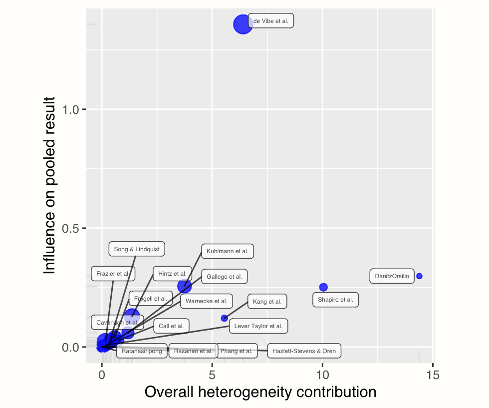
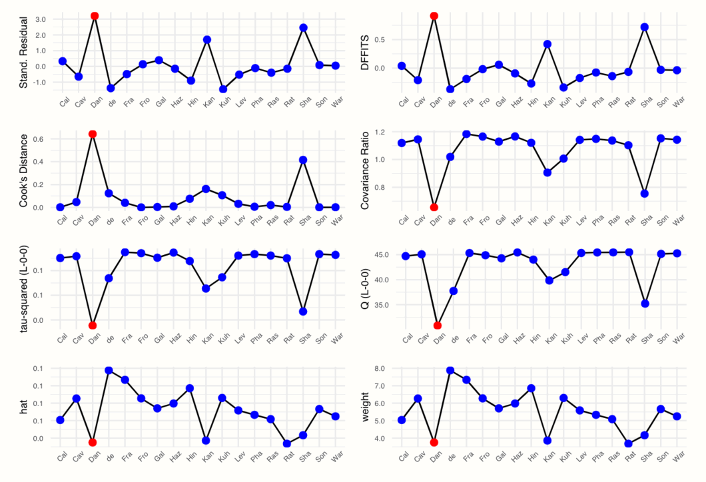
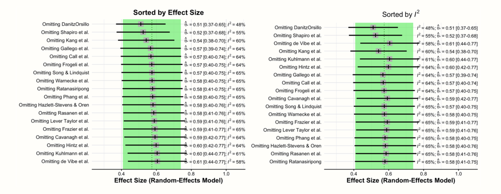
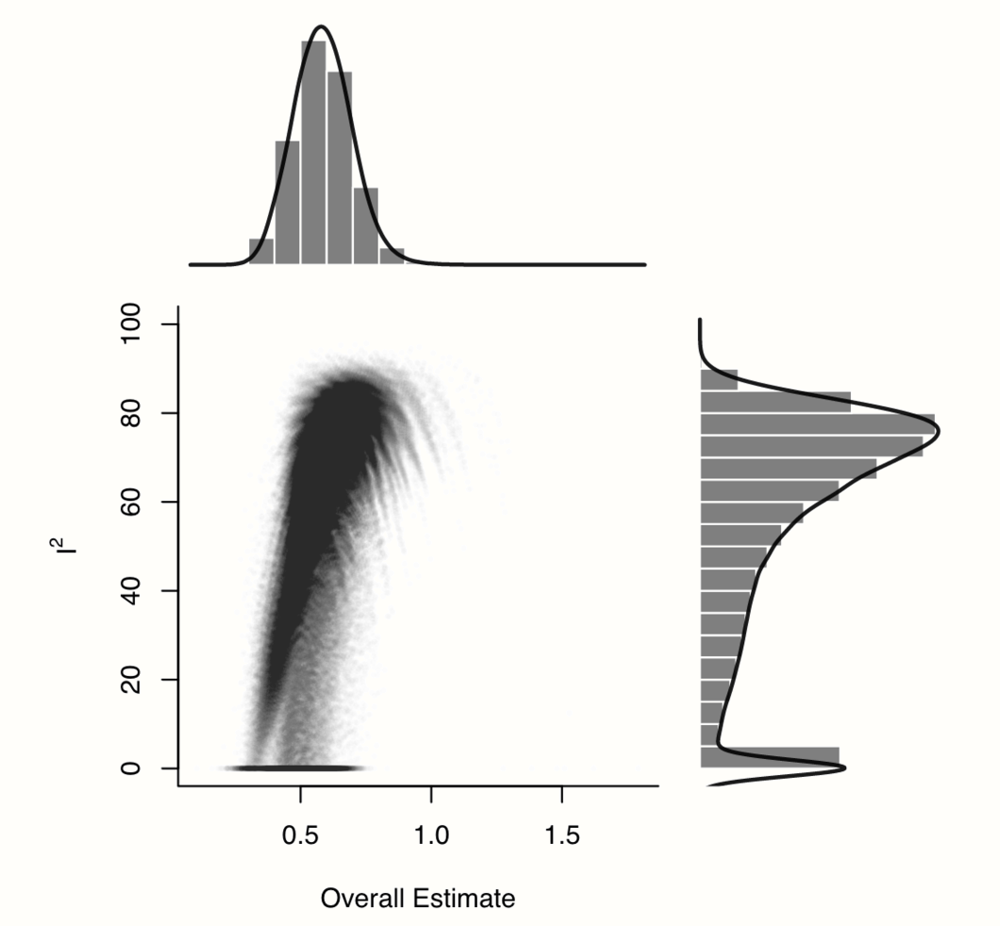
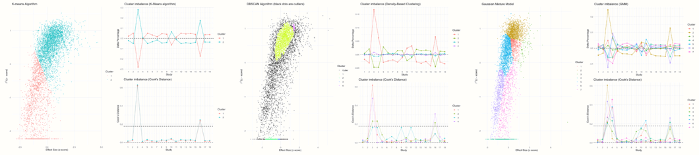
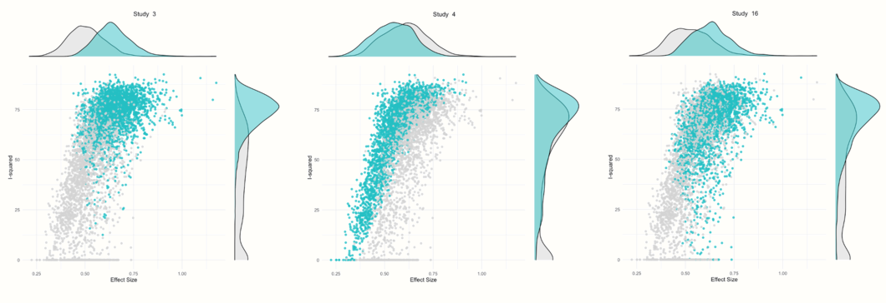

# Between-Study Heterogeneity {#heterogeneity}

---


<br></br>

<span class="firstcharacter">B</span>
y now, we have already learned how to pool effect sizes in a meta-analysis. As we have seen, the aim of both the fixed- and random-effects model is to synthesize the effects of many different studies into one single number. This, however, only makes sense if we are not comparing apples and oranges. For example, it could be that while the overall effect we calculate in the meta-analysis is small, there are still a few outliers with very high effect sizes. Such information is lost in the aggregate effect, and we do not know if all studies yielded small effect sizes, or if there were exceptions. 

\index{Heterogeneity}
\index{Random-Effects Model}

The extent to which true effect sizes vary within a meta-analysis is called **between-study heterogeneity**. We already mentioned this concept briefly in the last chapter in connection with the random-effects model. The random-effects model assumes that between-study heterogeneity causes the true effect sizes of studies to differ. It therefore includes an estimate of $\tau^2$, which quantifies this variance in true effects. This allows to calculate the pooled effect, defined as the mean of the true effect size distribution.

The random-effects model always allows us to calculate a pooled effect size, even if the studies are very heterogeneous. Yet, it does not tell us if this pooled effect can be **interpreted** in a meaningful way. There are many scenarios in which the pooled effect alone is not a good representation of the data in our meta-analysis.

Imagine a case where the heterogeneity is very high, meaning that the true effect sizes (e.g. of some treatment) range from highly positive to negative. If the pooled effect of such a meta-analysis is positive, this does not tell us that there were some studies with a true **negative** effect. The fact that the treatment had an adverse effect in some studies is lost. 

High heterogeneity can also be caused by the fact that there are two or more **subgroups** of studies in our data that have a different true effect. Such information can be very valuable for researchers, because it might allow us to find certain contexts in which effects are lower or higher. Yet, if we look at the pooled effect in isolation, this detail will likely be missed. In extreme cases, very high heterogeneity can mean that the studies have **nothing in common**, and that it makes no sense to interpret the pooled effect at all.

Therefore, meta-analysts must always take into account the variation in the analyzed studies. Every good meta-analysis should not only report an overall effect but also state how trustworthy this estimate is. An essential part of this is to quantify and analyze the between-study heterogeneity. 

In this chapter, we will have a closer look at different ways to measure heterogeneity, and how they can be interpreted. We will also cover a few tools which allow us to detect studies that contribute to the heterogeneity in our data. Lastly, we discuss ways to address large amounts of heterogeneity in "real-world" meta-analyses. 

<br></br>

## Measures of Heterogeneity {#het-measures}

---

Before we start discussing heterogeneity measures, we should first clarify that heterogeneity can mean different things. Rücker and colleagues [-@rucker2008undue], for example, differentiate between **baseline** or **design-related** heterogeneity, and **statistical** heterogeneity.

* **Baseline** or **design-related** heterogeneity arises when the population or research design of studies differs across studies. We have discussed this type of heterogeneity when we talked about the "Apples and Oranges" problem (Chapter \@ref(pitfalls)), and ways to define the research questions (Chapter \@ref(research-question)). Design-related heterogeneity can be reduced **a priori** by setting up a suitable PICO that determines which types of populations and designs are eligible for the meta-analysis.

* **Statistical** heterogeneity, on the other hand, is a quantifiable property, influenced by the spread and precision of the effect size estimates included in a meta-analysis. Baseline heterogeneity **can** lead to statistical heterogeneity (for example if effects differ between included populations) but does not have to. It is also possible for a meta-analysis to display high statistical heterogeneity, even if the included studies themselves are virtually identical. In this guide (and most other meta-analysis texts) the term "between-study heterogeneity" only refers to **statistical** heterogeneity. 

\index{Cochran's \textit{Q}}

<br></br>

### Cochran's $Q$ {#cochran-q}

---

Based on the random-effects model, we know that there are two sources of variation causing observed effects to differ from study to study. There is the sampling error $\epsilon_k$, and the error caused by between-study heterogeneity, $\zeta_k$ (Chapter \@ref(rem)). When we want to quantify between-study heterogeneity, the difficulty is to identify how much of the variation can be attributed to the sampling error, and how much to true effect size differences.

Traditionally, meta-analysts have used **Cochran's** $Q$ [@cochran1954some] to distinguish studies' sampling error from actual between-study heterogeneity. Cochran's $Q$ is defined as a **weighted sum of squares** (_WSS_). It uses the deviation of each study's observed effect $\hat\theta_k$ from the summary effect $\hat\theta$, weighted by the inverse of the study's variance, $w_k$:

\begin{equation}
Q = \sum^K_{k=1}w_k(\hat\theta_k-\hat\theta)^2
(\#eq:het1)
\end{equation}

\index{Inverse-Variance Weighting}

Let us take a closer look at the formula. First of all, we see that it uses the same type of inverse-variance weighting that is also applied to pool effect sizes. The mean $\hat\theta$ in the formula is the pooled effect according to the fixed-effect model. The amount to which individual effects deviate from the summary effect, the **residuals**, is squared (so that the value is always positive), weighted and then summed. The resulting value is Cochran's $Q$.

Because of the weighting by $w_k$, the value of $Q$ does not only depend on how much $\hat\theta_k$'s deviate from $\hat\theta$, but also on the precision of studies. If the standard error of an effect size is very low (and thus the precision very high), even small deviations from the summary effect will be given a higher weight, leading to higher values of $Q$.

The value of $Q$ can be used to check if there is **excess variation** in our data, meaning more variation than can be expected from sampling error alone. If this is the case, we can assume that the rest of the variation is due to between-study heterogeneity. We will illustrate this with a little simulation.

\index{Sampling Error}

In our simulation, we want to inspect how $Q$ behaves under two different scenarios: when there is no between-study heterogeneity, and when heterogeneity exists. Let us begin with the no-heterogeneity case. This implies that $\zeta_k=0$, and that the residuals $\hat\theta_k-\hat\theta$ are only product of the sampling error $\epsilon_k$. We can use the `rnorm` function to simulate deviates from some mean effect size $\hat\theta$ (assuming that they follow a normal distribution). Because they are centered around $\hat\theta$, we can expect the mean of these "residuals" to be zero ($\mu$ = 0). For this example, let us assume that the population standard deviation is $\sigma=$ 1, which leads to a **standard** normal distribution. 

Normal distributions are usually denoted with $\mathcal{N}$, and we can symbolize that the residuals are draws from a normal distribution with $\mu=$ 0 and $\sigma=$ 1 like this:

\begin{equation}
\hat\theta_k-\hat\theta \sim \mathcal{N}(0,1)
(\#eq:het2)
\end{equation}

Let us try this out in _R_, and draw $K$=40 effect size residuals $\hat\theta_k-\hat\theta$ using `rnorm`.

```{r, eval=F}
set.seed(123) # needed to reproduce results
rnorm(n = 40, mean = 0, sd = 1)
```
```
##  [1] -0.56048 -0.23018  1.55871  0.07051  0.12929
##  [6]  1.71506  0.46092 -1.26506 -0.68685 -0.44566
##  [...]

```

Because the standard normal distribution is the default for `rnorm`, we could have also used the simpler code `rnorm(40)`. 

Now, let us simulate that we repeat this process of drawing $n=$ 40 samples many, many times. We can achieve this using the `replicate` function, which we tell to repeat the `rnorm` call ten thousand times. We save the resulting values in an object called `error_fixed`.

```{r}
set.seed(123)
error_fixed <- replicate(n = 10000, rnorm(40))
```

We continue with a second scenario, in which we assume that **between-study heterogeneity** ($\zeta_k$ errors) exists in addition to the sampling error $\epsilon_k$. We can simulate this by adding a second call to `rnorm`, representing the variance in true effect sizes. In this example, we also assume that the true effect sizes follow a standard normal distribution. 

We can simulate the residuals of ten thousand meta-analyses with $K$=40 studies and substantial between-study heterogeneity using this code:

```{r}
set.seed(123)
error_random <- replicate(n = 10000, rnorm(40) + rnorm(40))
```

Now that we simulated $\hat\theta_k-\hat\theta$ residuals for meta-analyses **with** and **without** heterogeneity, let us do the same for values of $Q$. For this simulation, we can simplify the formula of $Q$ a little by assuming that the variance, and thus the weight $w_k$ of every study, is **one**, resulting in $w_k$ to drop out of the equation. This means that we only have to use our calls to `rnorm` from before, square and sum the result, and replicate this process ten thousand times. 

Here is the code for that:

```{r}
set.seed(123)
Q_fixed <- replicate(10000, sum(rnorm(40)^2))
Q_random <- replicate(10000, sum((rnorm(40) + rnorm(40))^2))
```

An important property of $Q$ is that it is assumed to (approximately) follow a $\chi^2$ distribution. A $\chi^2$ distribution, like the weighted squared sum, can only take positive values. It is defined by its **degrees of freedom**, or d.f.; $\chi^2$ distributions are right-skewed for small d.f., but get closer and closer to a normal distribution when the degrees of freedom become larger. At the same time, the degrees of freedom are also the **expected value**, or mean of the respective $\chi^2$ distribution. 

It is assumed that $Q$ will approximately follow a $\chi^2$ distribution with $K-1$ degrees of freedom (with $K$ being the number of studies in our meta-analysis)--**if** effect size differences are **only** caused by sampling error. This means that the mean of a $\chi^2$ distribution with $K-1$ degrees of freedom tells us the value of $Q$ we can expect through sampling error alone.

This explanation was very abstract, so let us have a look at the distribution of our simulated values to make this more concrete. In the following code, we use the `hist` function to plot a histogram of the effect size "residuals" and $Q$ values. We also add a line to each plot, showing the idealized distribution. 

Such distributions can be generated by the `dnorm` function for normal distributions, and using `dchisq` for $\chi^2$ distributions, with `df` specifying the degrees of freedom.

```{r, eval=F}
# Histogram of the residuals (theta_k - theta)
# - We produce a histogram for both the simulated values in
#   error_fixed and error_random
# - `lines` is used to add a normal distribution in blue.

hist(error_fixed, 
     xlab = expression(hat(theta[k])~-~hat(theta)), prob = TRUE, 
     breaks = 100, ylim = c(0, .45), xlim = c(-4,4),
     main = "No Heterogeneity")
lines(seq(-4, 4, 0.01), dnorm(seq(-4, 4, 0.01)), 
      col = "blue", lwd = 2)

hist(error_random, 
     xlab = expression(hat(theta[k])~-~hat(theta)), prob = TRUE, 
     breaks = 100,ylim = c(0, .45), xlim = c(-4,4),
     main = "Heterogeneity")
lines(seq(-4, 4, 0.01), dnorm(seq(-4, 4, 0.01)), 
      col = "blue", lwd = 2)


# Histogram of simulated Q-values
# - We produce a histogram for both the simulated values in
#   Q_fixed and Q_random
# - `lines` is used to add a chi-squared distribution in blue.

# First, we calculate the degrees of freedom (k-1)
# remember: k=40 studies were used for each simulation
df <- 40-1

hist(Q_fixed, xlab = expression(italic("Q")), prob = TRUE, 
     breaks = 100, ylim = c(0, .06),xlim = c(0,160),
     main = "No Heterogeneity")
lines(seq(0, 100, 0.01), dchisq(seq(0, 100, 0.01), df = df), 
      col = "blue", lwd = 2)

hist(Q_random,  xlab = expression(italic("Q")), prob = TRUE, 
     breaks = 100, ylim = c(0, .06), xlim = c(0,160),
     main = "Heterogeneity")
lines(seq(0, 100, 0.01), dchisq(seq(0, 100, 0.01), df = df), 
      col = "blue", lwd = 2)

```


These are the plots that _R_ draws for us:


```{r, out.width="50%", echo=FALSE, collapse=TRUE, message=F, warning=F}

par(bg="#FFFEFA")

hist(error_fixed, 
     xlab = expression(hat(theta[k])~-~hat(theta)), prob = TRUE, 
     breaks = 100, ylim = c(0, .45), xlim = c(-4,4),
     main = "No Heterogeneity")
lines(seq(-4, 4, 0.01), dnorm(seq(-4, 4, 0.01)), col = "#014d64", lwd = 2)

hist(error_random, 
     xlab = expression(hat(theta[k])~-~hat(theta)), prob = TRUE, 
     breaks = 100,ylim = c(0, .45), xlim = c(-4,4),
     main = "Heterogeneity")
lines(seq(-4, 4, 0.01), dnorm(seq(-4, 4, 0.01)), col = "#014d64", lwd = 2)

df = 40-1

hist(Q_fixed, xlab = expression(italic("Q")), prob = TRUE, 
     breaks = 100, ylim = c(0, .06),xlim = c(0,160),
     main = "No Heterogeneity")
lines(seq(0, 100, 0.01), dchisq(seq(0, 100, 0.01), df = df), 
      col = "#014d64", lwd = 2)

hist(Q_random,  xlab = expression(italic("Q")), prob = TRUE, 
     breaks = 100, ylim = c(0, .06), xlim = c(0,160),
     main = "Heterogeneity")
lines(seq(0, 100, 0.01), dchisq(seq(0, 100, 0.01), df = df), 
      col = "#014d64", lwd = 2)


```


If you find the code we used to generate the plots difficult to understand, do not worry. We only used it for this simulation, and these are not plots one would produce as part of an actual meta-analysis.

Let us go through what we see in the four histograms. In the first row, we see the distribution of effect size "residuals", with and without heterogeneity. The no-heterogeneity data, as we can see, closely follows the line of the standard normal distribution we included in the plot. This is quite logical since the data was generated by `rnorm` assuming this exact distribution. The data in which we added extra heterogeneity does not follow the standard normal distribution. The dispersion of data is larger, resulting in a distribution with heavier tails.

\index{Cochran's \textit{Q}}

Now, let us explore how this relates to the distribution of $Q$ values in the second row. When there is no heterogeneity, the values of $Q$ follow a characteristic, right-skewed $\chi^2$ distribution. In the plot, the solid line shows the shape of a $\chi^2$ distribution with 39 degrees of freedom (since d.f. = $K-1$, and $K$ = 40 was used in each simulation). We see that the simulated data follows this curve pretty well. This is no great surprise. We have learned that $Q$ follows a $\chi^2$ distribution with $K-1$ degrees of freedom when there is no heterogeneity. Exactly this is the case in our simulated data: variation exists only due to the sampling error. 

The distribution looks entirely different for our example **with** heterogeneity. The simulated data do not seem to follow the expected distribution at all. Values are shifted visibly to the right; the mean of the distribution is approximately twice as high. We can conclude that, when there is substantial between-study heterogeneity, the values of $Q$ are considerably higher than the value of $K-1$ we expect under the assumption of no heterogeneity. This comes as no surprise, since we added extra variation to our data to simulate the presence of between-study heterogeneity.

\index{meta Package}

This was a somewhat lengthy explanation, yet it may have helped us to better understand how we can exploit the statistical properties of $Q$. Cochran's $Q$ can be used to **test** if the variation in a meta-analysis significantly exceeds the amount we would expect under the null hypothesis of no heterogeneity. 

This **test of heterogeneity** is commonly used in meta-analyses, and if you go back to Chapter \@ref(pooling-es), you will see that **{meta}** also provides us with it by default. It is often referred to as **Cochran's** $Q$ **test**, but this is actually a misnomer. Cochran himself never intended $Q$ to be used in this way [@hoaglin2016misunderstandings].

\index{DerSimonian-Laird Estimator}
\index{I$^2$, Higgins \& Thompson's}

Cochran's $Q$ is a very important statistic, mostly because other common ways to quantify heterogeneity, such as Higgins and Thompson's $I^2$ statistic and $H^2$, are based on it. We will get to these measures in the next sections. Cochran's $Q$ is also used by some heterogeneity variance estimators to calculate $\tau^2$, most famously by the DerSimonian-Laird estimator^[The DerSimonian-Laird method estimates the heterogeneity variance using $\hat\tau^2 = \dfrac{Q-(K-1)}{\sum_{k=1}^{K}w_k-\frac{\sum_{k=1}^Kw^2_k}{\sum_{k=1}^Kw_k}}$, with $\hat\tau^2 := 0$ when $Q<(K-1)$; see also Chapters \@ref(rem) and \@ref(tau-estimators).]. 

```{block, type='boximportant'}
**Problems With $Q$ & the $Q$-Test**

\vspace{2mm}

Although $Q$ is commonly used and reported in meta-analyses, it has several flaws. Hoaglin [-@hoaglin2016misunderstandings], for example, argues that the assumption of $Q$ following a $\chi^2$ distribution with $K-1$ degrees of freedom does not reflect $Q$'s actual behavior in meta-analysis, and that related procedures such as the DerSimonian-Laird method may therefore be biased.

\vspace{2mm}

A more practical concern is that $Q$ increases both when the number of studies $K$, and when the precision (i.e. the sample size of a study) increases. Therefore, $Q$ and whether it is significant highly depends on the size of your meta-analysis, and thus its statistical power. 

From this follows that we should not only rely on the significance of a $Q$-test when assessing heterogeneity. Sometimes, meta-analysts decide whether to apply a fixed-effect or random-effects model based on the significance of the $Q$-test. For the reasons we stated here, this approach is highly discouraged. 

```

<br></br>

### Higgins & Thompson's $I^2$ Statistic {#i-squared}

---

\index{I$^2$, Higgins \& Thompson's}

The $I^2$ statistic [@higgins2002quantifying] is another way to quantify between-study heterogeneity, and directly based on Cochran's $Q$. It is defined as the percentage of variability in the effect sizes that is not caused by sampling error. $I^2$ draws on the assumption that $Q$ follows a $\chi^2$ distribution with $K-1$ degrees of freedom under the null hypothesis of no heterogeneity. It quantifies, in percent, how much the **observed** value of $Q$ **exceeds** the **expected** $Q$ value when there is no heterogeneity (i.e. $K-1$). 

The formula of $I^2$ looks like this:

\begin{equation}
I^2 = \frac{Q-(K-1)}{Q}
(\#eq:het3)
\end{equation}

Where $K$ is the total number of studies. The value of $I^2$ can not be lower than 0%, so if $Q$ happens to be smaller than $K-1$, we simply use $0$ instead of a negative value. 

We can use our simulated values of $Q$ from before to illustrate how $I^2$ is calculated. First, let us randomly pick the tenth simulated value in `Q_fixed`, where we assumed no heterogeneity. Then, we use the formula above to calculate $I^2$.

```{r}
# Display the value of the 10th simulation of Q
Q_fixed[10]

# Define k
k <- 40

# Calculate I^2
(Q_fixed[10] - (k-1))/Q_fixed[10]
```

Since the result is negative, we round up to zero, resulting in $I^2$ = 0%. This value tells us that zero percent of the variation in effect sizes is due to between-study heterogeneity. This is in line with the settings used for our simulation.

Now, we do the same with the tenth simulated value in `Q_random`.

```{r}
(Q_random[10] - (k-1))/Q_random[10]
```

We see that the $I^2$ value of this simulation is approximately 50%, meaning that about half of the variation is due to between-study heterogeneity. This is also in line with our expectations since the variation in this example is based, in equal parts, on the simulated sampling error and between-study heterogeneity.

It is common to use the $I^2$ statistic to report the between-study heterogeneity in meta-analyses, and $I^2$ is included by default in the output we get from **{meta}**. The popularity of this statistic may be associated with the fact that there is a "rule of thumb" on how we can interpret it [@higgins2002quantifying]:

* $I^2$ = 25%: low heterogeneity

* $I^2$ = 50%: moderate heterogeneity

* $I^2$ = 75%: substantial heterogeneity.

<br></br>

### The $H^2$ Statistic

---

The $H^2$ statistic [@higgins2002quantifying] is also derived from Cochran's $Q$, and similar to $I^2$. It describes the ratio of the observed variation, measured by $Q$, and the expected variance due to sampling error:

\begin{equation}
H^2 = \frac{Q}{K-1}
(\#eq:het4)
\end{equation}

The computation of $H^2$ is a little more elegant than the one of $I^2$ because we do not have to artificially correct its value when $Q$ is smaller than $K-1$. When there is no between-study heterogeneity, $H^2$ equals one (or smaller). Values greater than one indicate the presence of between-study heterogeneity.

Compared to $I^2$, it is far less common to find this statistic reported in published meta-analyses. However, $H^2$ is also included by default in the output of **{meta}**'s meta-analysis functions.

<br></br>

### Heterogeneity Variance $\tau^2$ & Standard Deviation $\tau$ {#tau}

---

We already discussed the heterogeneity variance $\tau^2$ in detail in Chapter \@ref(rem). As we mentioned there, $\tau^2$ quantifies the **variance** of the true effect sizes underlying our data. When we take the square root of $\tau^2$, we obtain $\tau$, which is the **standard deviation** of the true effect sizes. 

A great asset of $\tau$ is that it is expressed on the same scale as the effect size metric. This means that we can interpret it in the same as one would interpret, for example, the mean and standard deviation of the sample's age in a primary study. The value of $\tau$ tells us something about the **range** of the true effect sizes. 

We can, for example, calculate the 95% confidence interval of the true effect sizes by multiplying $\tau$ with 1.96, and then adding and subtracting this value from the pooled effect size. We can try this out using the `m.gen` meta-analysis we calculated in Chapter \@ref(pre-calculated-es). 

Let us have a look again what the pooled effect and $\tau$ estimate in this meta-analysis were:

```{r, echo=F, message=F, warning=F}
library(meta)
library(dmetar)
data(ThirdWave)
m.gen <- metagen(TE = TE,
                 seTE = seTE,
                 studlab = Author,
                 data = ThirdWave,
                 sm = "SMD",
                 comb.fixed = FALSE,
                 comb.random = TRUE,
                 method.tau = "REML",
                 hakn = TRUE,
                 title = "Third Wave Psychotherapies")

```


```{r}
# Pooled effect
m.gen$TE.random

# Estimate of tau
m.gen$tau
```

We see that $g=$ 0.58 and $\tau=$ 0.29. Based on this data, we can calculate the lower and upper bound of the 95% true effect size confidence interval: 0.58 $-$ 1.96 $\times$ 0.29 = 0.01 and 0.58 $+$ 1.96 $\times$ 0.29 = 1.15.

```{block2, type='boxinfo'}
**"What's the Uncertainty of Our Uncertainty?": Calculation of Confidence Intervals Around $\tau^2$**

\vspace{2mm}

Methods to quantify the uncertainty of our between-study heterogeneity variance estimate (i.e. the confidence intervals around $\tau^2$) remain a field of ongoing investigation. Several approaches are possible, and their adequateness depends on the type of $\tau^2$ estimator (Chapter \@ref(tau-estimators)). 

\vspace{4mm}

The **{meta}** package follows the recommendations of Veronikki [-@veroniki2016methods] and uses the $Q$**-Profile** method [@viechtbauer2007confidence] for most estimators.

\vspace{4mm}

The $Q$-Profile method is based on an altered $Q$ version , the **generalized** $Q$**-statistic** $Q_{\text{gen}}$. While the standard version of $Q$ uses the pooled effect based on the fixed-effect model, $Q_{\text{gen}}$ is based on the random-effects model. It uses the overall effect according to the random-effects model, $\hat\mu$, to calculate the deviates, as well as weights based on the random-effects model:

\begin{equation}
Q_{\text{gen}} = \sum_{k=1}^{K} w^*_k (\hat\theta_k-\hat\mu)^2
(\#eq:het5)
\end{equation}

Where $w^*_k$ is the random-effects weight (see Chapter \@ref(tau-estimators)):

\begin{equation}
w^*_k = \frac{1}{s^2_k+\tau^2} 
(\#eq:het6)
\end{equation}

$Q_{\text{gen}}$ has also been shown to follow a $\chi^2$ distribution with $K-1$ degrees of freedom. We can think of the generalized $Q$ statistic as a function $Q_{\text{gen}}(\tau^2)$ which returns different values of $Q_{\text{gen}}$ for higher or lower values of $\tau^2$. The results of this function have a $\chi^2$ distribution. 

\vspace{4mm}

Since the $\chi^2$ distribution follows a clearly predictable pattern, it is easy to determine confidence intervals with, for example, 95% coverage. We only have to get the value of $\chi^2$ for the 2.5\textsuperscript{th} and 97.5\textsuperscript{th} percentile, based on its $K-1$ degrees of freedom. In _R_, this can be easily done using the **quantile function** `qchisq`, for example: `qchisq(0.975, df=5)`.

\vspace{4mm}

The $Q$-Profile method exploits this relationship to calculate confidence intervals around $\tau^2$ using an iterative process (so-called "profiling"). In this approach, $Q_{\text{gen}}(\widetilde{\tau}^2)$ is calculated repeatedly while increasing the value of $\tau^2$, until the expected value of the lower and upper bound of the confidence interval based on the $\chi^2$ distribution is reached. 

\vspace{4mm}

The $Q$-Profile method can be specified in **{meta}** functions through the argument `method.tau.ci = "QP"`. This is the default setting, meaning that we do not have to add this argument manually. The only exception is when we use the DerSimonian-Laird estimator (`method.tau = "DL"`). In this case, a different method, the one by Jackson [-@jackson2013confidence], is used automatically (we can do this manually by specifying `method.tau.ci = "J"`). 

Usually, there is no necessity to deviate from **{meta}**'s default behavior, but it may be helpful for others to report which method has been used to calculate the confidence intervals around $\tau^2$ in your meta-analysis.

```

<br></br>

## Which Measure Should I Use? {#het-measure-which}

---

When we assess and report heterogeneity in a meta-analysis, we need a measure which is robust, and not too heavily influenced by statistical power. Cochran's $Q$ increases both when the number of studies increases, and when the precision (i.e. the sample size of a study) increases. 

Therefore, $Q$ and whether it is significant highly depends on the size of your meta-analysis, and thus its statistical power. We should therefore not only rely on $Q$, and particularly the $Q$-test, when assessing between-study heterogeneity.

$I^2$, on the other hand, is not sensitive to changes in the number of studies in the analysis. It is relatively easy to interpret, and many researchers understand what it means. Generally, it is not a bad idea to include $I^2$ as a heterogeneity measure in our meta-analysis report, especially if we also provide a confidence interval for this statistic so that others can assess how precise the estimate is.

\index{Sampling Error}
\index{I$^2$, Higgins \& Thompson's}
\index{Heterogeneity}

However, despite its common use in the literature, $I^2$ is not a perfect measure for heterogeneity either. It is not an absolute measure of heterogeneity, and its value still heavily depends on the precision of the included studies [@borenstein2017basics; @rucker2008undue]. As said before, $I^2$ is simply the percentage of variability not caused by sampling error $\epsilon$. If our studies become increasingly large, the sampling error tends to zero, while at the same time, $I^2$ tends to 100%--simply because the studies have a greater sample size. 

**Only** relying on $I^2$ is therefore not a good option either. Since $H^2$ behaves similarly to $I^2$, the same caveats also apply to this statistic.

The value of $\tau^2$ and $\tau$, on the other hand, is insensitive to the number of studies, **and** their precision. It does not systematically increase as the number of studies and their size increases. Yet, it is often hard to interpret how relevant $\tau^2$ is from a practical standpoint. Imagine, for example, that we found that the variance of true effect sizes in our study was $\tau^2=$ 0.08. It is often difficult for ourselves, and others, to determine if this amount of variance is meaningful or not.

\index{Prediction Interval}

**Prediction intervals** (PIs) are a good way to overcome this limitation [@inthout2016plea]. Prediction intervals give us a range into which we can expect the effects of future studies to fall based on present evidence. 

Say that our prediction interval lies completely on the "positive" side favoring the intervention. This means that, despite varying effects, the intervention is expected to be beneficial in the future across the contexts we studied. If the prediction interval includes zero, we can be less sure about this, although it should be noted that broad prediction intervals are quite common.

To calculate prediction intervals around the overall effect $\hat\mu$, we use both the estimated between-study heterogeneity variance $\hat\tau^2$, as well as the standard error of the pooled effect, $SE_{\hat\mu}$. We sum the squared standard error and $\hat\tau^2$ value, and then take the square root of the result. This leaves us with the standard deviation of the prediction interval, $SD_{\text{PI}}$. A $t$ distribution with $K-1$ degrees of freedom is assumed for the prediction range, which is why we multiply $SD_{\text{PI}}$ with the 97.5\textsuperscript{th} percentile value of $t_{K-1}$, and then add and subtract the result from $\hat\mu$. This gives us the 95% prediction interval of our pooled effect. 

The formula for 95% prediction intervals looks like this:


\begin{align}
\hat\mu &\pm t_{K-1, 0.975}\sqrt{SE_{\hat\mu}^2+\hat\tau^2} \notag \\
\hat\mu &\pm t_{K-1, 0.975}SD_{\text{PI}} (\#eq:het7)
\end{align}

All of **{meta}**'s functions can provide us with a prediction interval around the pooled effect, but they do not do so by default. When running a meta-analysis, we have to add the argument `prediction = TRUE` so that prediction intervals appear in the output.

In sum, it is advisable to not resort to one measure only when characterizing the heterogeneity of a meta-analysis. It is recommended to at least always report $I^2$ (with confidence intervals), as well as prediction intervals, and interpret the results accordingly.

<br></br>

## Assessing Heterogeneity in _R_ {#het-R}

---

Let us see how we can use the things we learned about heterogeneity measures in practice. As an illustration, let us examine the heterogeneity of our `m.gen` meta-analysis object a little closer (we generated this object in Chapter \@ref(pre-calculated-es)). 

Because the default output of `metagen` objects does not include prediction intervals, we have to update it first. We simply use the `update.meta` function, and tell it that we want `prediction` intervals to be printed out additionally.

```{r}
m.gen <- update.meta(m.gen, prediction = TRUE)
```

Now we can reinspect the results:

```{r, eval=F}
summary(m.gen)
```

```
## Review:     Third Wave Psychotherapies
## 
## [...]
## 
## Number of studies combined: k = 18
## 
##                         SMD            95%-CI    t  p-value
## Random effects model 0.5771 [ 0.3782; 0.7760] 6.12 < 0.0001
## Prediction interval         [-0.0619; 1.2162]              
## 
## Quantifying heterogeneity:
##  tau^2 = 0.0820 [0.0295; 0.3533]; tau = 0.2863 [0.1717; 0.5944];
##  I^2 = 62.6% [37.9%; 77.5%]; H = 1.64 [1.27; 2.11]
## 
## Test of heterogeneity:
##      Q d.f. p-value
##  45.50   17  0.0002
## 
## Details on meta-analytical method:
## - Inverse variance method
## - Restricted maximum-likelihood estimator for tau^2
## - Q-profile method for confidence interval of tau^2 and tau
## - Hartung-Knapp adjustment for random effects model
```

In the output, we see results for all heterogeneity measures we defined before. Let us begin with the `Quantifying heterogeneity` section. Here, we see that $\tau^2=$ 0.08. The confidence interval around $\tau^2$ (0.03 - 0.35) does not contain zero, indicating that some between-study heterogeneity exists in our data. The value of $\tau$ is 0.29, meaning that the true effect sizes have an estimated standard deviation of $SD=$ 0.29, expressed on the scale of the effect size metric (here, Hedges' $g$).

A look at the second line reveals that $I^2=$ 63% and that $H$ (the square root of $H^2$) is 1.64. This means that more than half of the variation in our data is estimated to stem from true effect size differences. Using Higgins and Thompson's "rule of thumb", we can characterize this amount of heterogeneity as moderate to large. 

Directly under the pooled effect, we see the prediction interval. It ranges from $g=$ -0.06 to 1.21. This means that it is possible that some future studies will find a negative treatment effect based on present evidence. However, the interval is quite broad, meaning that very high effects are possible as well.

\index{Cochran's \textit{Q}}

Lastly, we are also presented with $Q$ and the `Test of heterogeneity`. We see that $Q$=45.5. This is a lot more than what we would expect based on the $K-1=$ 17 degrees of freedom in this analysis. Consequentially, the heterogeneity test is significant ($p<$ 0.001). However, as we mentioned before, we should not base our assessment on the $Q$ test alone, given its known deficiencies.

```{block, type='boxreport'}
**Reporting the Amount of Heterogeneity In Your Meta-Analysis**

\vspace{4mm}

Here is how we could report the amount of heterogeneity we found in our example:

> _"The between-study heterogeneity variance was estimated at $\hat\tau^2$ = 0.08 (95%CI: 0.03-0.35), with an $I^2$ value of 63% (95%CI: 38-78%). The prediction interval ranged from $g$ = -0.06 to 1.21, indicating that negative intervention effects cannot be ruled out for future studies."_

```


So, what do we make out of these results? Overall, our indicators tell us that moderate to substantial heterogeneity is present in our data. The effects in our meta-analysis are not completely heterogeneous, but there are clearly some differences in the true effect sizes between studies. 

It may therefore be a good idea to explore what causes this heterogeneity. It is possible that there are one or two studies that do not really "fit in", because they have a much higher effect size. This could have inflated the heterogeneity in our analysis, and even worse: it may have led to an **overestimation** of the true effect. 

On the other hand, it is also possible that our pooled effect is influenced heavily by one study with a very large sample size reporting an unexpectedly small effect size. This could mean that the pooled effect **underestimates** the true benefits of the treatment. 

To address these concerns, we will now turn to procedures which allow us to assess the robustness of our pooled results: **outlier** and **influence analyses**.

\index{I$^2$, Higgins \& Thompson's}

```{block2, type='boxinfo'}
**The $I^2$ > 50% "Guideline"**

\vspace{4mm}

There are no iron-clad rules determining when exactly further analyses of the between-study heterogeneity are warranted. An approach that is sometimes used in practice is to check for outliers and influential cases when $I^2$ is greater than 50%. When this threshold is reached, we can assume at least moderate heterogeneity, and that (more than) half of the variation is due to true effect size differences. 

\vspace{4mm}

This "rule of thumb" is somewhat arbitrary, and, knowing the problems of $I^2$ we discussed, in no way perfect. However, it can still be helpful from a practical perspective, because we can specify **a priori**, and in a consistent way, when we will try to get a more robust version of the pooled effect in our meta-analysis. 

\vspace{4mm}

What should be avoided at any cost is to remove outlying and/or influential cases without any stringent rationale, just because we like the results. Such outcomes will be heavily biased by our "researcher agenda" (see Chapter \@ref(pitfalls)), even if we did not consciously try to bend the results into a "favorable" direction. 
```

<br></br>

## Outliers & Influential Cases {#outliers}

---

\index{Outlier}
\index{Influential Case}

As mentioned before, between-study heterogeneity can be caused by one or more studies with extreme effect sizes that do not quite "fit in". This may distort our pooled effect estimate, and it is a good idea to reinspect the pooled effect after such **outliers** have been removed from the analysis.

On the other hand, we also want to know if the pooled effect estimate we found is robust, meaning that it does not depend heavily on one single study. Therefore, we also want to know whether there are studies which heavily push the effect of our analysis into one direction. Such studies are called **influential cases**, and we will devote some time to this topic later in this chapter.

<br></br>

### Basic Outlier Removal {#basic-outlier}

---

There are several ways to define the effect of a study as "outlying" [@viechtbauer2010outlier]. An easy, and somewhat "brute force" approach, is to view a study as an outlier if its confidence interval does not overlap with the confidence interval of the pooled effect. The effect size of an outlier is so **extreme** that it differs significantly from the overall effect. To detect such outliers, we can search for all studies:

* for which the **upper bound** of the 95% confidence interval is **lower** than the **lower bound** of the pooled effect confidence interval (i.e. extremely  **small** effects)

* for which the **lower bound** of the 95% confidence interval is **higher** than the **upper bound** of the pooled effect confidence interval (i.e. extremely **large** effects).

The idea behind this method is quite straightforward. Studies with a high sampling error are expected to deviate substantially from the pooled effect. However, because the confidence interval of such studies will also be large, this increases the likelihood that the confidence intervals will overlap with the one of the pooled effect. 

Yet, if a study has a **low** standard error and **still** (unexpectedly) deviates substantially from the pooled effect, there is a good chance that the confidence intervals will not overlap, and that the study is classified as an outlier.

\index{dmetar Package}

The **{dmetar}** package contains a function called `find.outliers`, which implements this simple outlier removal algorithm. It searches for outlying studies in a **{meta}** object, removes them, and then recalculates the results.

```{block, type='boxdmetar'}
**The "find.outliers" Function**

\vspace{4mm}

The `find.outliers` function is included in the **{dmetar}**  package. Once **{dmetar}** is installed and loaded on your computer, the function is ready to be used. If you did **not** install **{dmetar}**, follow these instructions:

\vspace{2mm}

1. Access the source code of the function [online](https://raw.githubusercontent.com/MathiasHarrer/dmetar/master/R/find.outliers.R). 
2. Let _R_ "learn" the function by copying and pasting the source code in its entirety into the console (bottom left pane of R Studio), and then hit "Enter".
3. Make sure that the **{meta}** and **{metafor}** package is installed and loaded.

```


The `find.outliers` function only needs an object created by a **{meta}** meta-analysis function as input. Let us see the what results we get for our `m.gen` object.

```{r, eval=F}
find.outliers(m.gen)
```

```
## Identified outliers (random-effects model) 
## ------------------------------------------ 
## "DanitzOrsillo", "Shapiro et al." 
##  
## Results with outliers removed 
## ----------------------------- 
## Number of studies combined: k = 16
## 
##                         SMD           95%-CI    t  p-value
## Random effects model 0.4528 [0.3257; 0.5800] 7.59 < 0.0001
## Prediction interval         [0.1693; 0.7363]              
## 
## Quantifying heterogeneity:
##  tau^2 = 0.0139 [0.0000; 0.1032]; tau = 0.1180 [0.0000; 0.3213];
##  I^2 = 24.8% [0.0%; 58.7%]; H = 1.15 [1.00; 1.56]
## 
## Test of heterogeneity:
##      Q d.f. p-value
##  19.95   15  0.1739
## 
## [...]
```

\index{Weight}

We see that the `find.outliers` function has detected two outliers, “DanitzOrsillo” and “Shapiro et al.”. The function has also automatically rerun our analysis while excluding the identified studies. In the column displaying the random-effects weight of each study, `%W(random)`, we see that the weight of the outlying studies has been set to zero, thus removing them from the analysis.

\index{I$^2$, Higgins \& Thompson's}

Based on the output, we see that the $I^2$ heterogeneity shrinks considerably when the two studies are excluded, from $I^2=$ 63% to 25%. The confidence interval around $\tau^2$ now also includes zero, and the $Q$-test of heterogeneity is not significant anymore. Consequentially, the prediction interval of our estimate has also narrowed. Now, it only contains positive values, providing much more certainty of the robustness of the pooled effect across future studies.

<br></br>

### Influence Analysis {#influence-analysis}

---

\index{Influential Case}

We have now learned a basic way to detect and remove outliers in meta-analyses. However, it is not only extreme effect sizes which can cause concerns regarding the robustness of the pooled effect. Some studies, even if their effect size is not particularly high or low, can still exert a very high **influence** on our overall results. 

For example, it could be that we find an overall effect in our meta-analysis, but that its significance depends on a single large study. This would mean that the pooled effect is not statistically significant anymore once the influential study is removed. Such information is very important if we want to communicate to the public how robust our results are.

Outlying and influential studies have an overlapping but slightly different meaning. Outliers are defined through the magnitude of their effect but do not necessarily need to have a substantial impact on the results of our meta-analysis. It is perfectly possible that removal of an outlier as defined before neither changes the average effect size, nor the heterogeneity in our data substantially. 

Influential cases, on the other hand, are those studies which--by definition--have a large impact on the pooled effect or heterogeneity, regardless of how high or low the effect is. This does not mean, of course, that a study with an extreme effect size cannot be an influential case. In fact, outliers are often also influential, as our example in the last chapter illustrated. But they do not **have** to be.

\index{Leave-One-Out Method}

There are several techniques to identify influential studies, and they are a little more sophisticated than the basic outlier removal we discussed previously. They are based on the **leave-one-out** method. In this approach, we recalculate the results of our meta-analysis $K$ times, each time **leaving out** one study. 

Based on this data, we can calculate different **influence diagnostics**. Influence diagnostics allow us to detect the studies which influence the overall estimate of our meta-analysis the most, and let us assess if this large influence distorts our pooled effect [@viechtbauer2010outlier].


\index{dmetar Package}

The **{dmetar}** package contains a function called `InfluenceAnalysis`, which allows us to calculate these various influence diagnostics using one function. The function can be used for any type of meta-analysis object created by **{meta}** functions.

```{block, type='boxdmetar'}
**The "InfluenceAnalysis" function**

\vspace{4mm}

The `InfluenceAnalysis` function is included in the **{dmetar}**  package. Once **{dmetar}** is installed and loaded on your computer, the function is ready to be used. If you did **not** install **{dmetar}**, follow these instructions:

\vspace{2mm}

1. Access the source code of the function [online](https://raw.githubusercontent.com/MathiasHarrer/dmetar/master/R/influence.analysis.R). 
2. Let _R_ "learn" the function by copying and pasting the source code in its entirety into the console (bottom left pane of R Studio), and then hit "Enter".
3. Make sure that the **{meta}**, **{metafor}**, **{ggplot2}** and **{gridExtra}** package is installed and loaded.

```

Using the `InfluenceAnalysis` function is relatively straightforward. We only have to specify the name of the meta-analysis object for which we want to conduct the influence analysis. Here, we again use the `m.gen` object. 

Because `InfluenceAnalysis` uses the fixed-effect model by default, we also have to set `random = TRUE`, so that the random-effects model will be used. The function can also take other arguments, which primarily control the type of plots generated by the function. Those arguments are detailed in the function documentation.

We save the results of the function in an object called `m.gen.inf`.


```{r, eval=F}
m.gen.inf <- InfluenceAnalysis(m.gen, random = TRUE)

```

```{r, echo=F}
load("data/m_gen_inf.rda")
```

The `InfluenceAnalysis` function creates four influence diagnostic plots: a **Baujat** plot, **influence diagnostics** according to Viechtbauer and Cheung [-@viechtbauer2010outlier], and the leave-one-out meta-analysis results, sorted by effect size and $I^2$ value. We can open each of these plots individually using the `plot` function. Let us go through them one after another.

<br></br>

#### Baujat Plot {#baujat}

---

A Baujat plot can be printed using the `plot` function and by specifying `"baujat"` in the second argument:

```{r, eval=F}
plot(m.gen.inf, "baujat")
```

```{r, out.width='70%', message = F, echo = F, fig.align='center'}
library(OpenImageR)

```

Baujat plots [@baujat2002graphical] are diagnostic plots to detect studies which overly contribute to the heterogeneity in a meta-analysis. The plot shows the contribution of each study to the overall **heterogeneity** (as measured by Cochran's $Q$) on the **horizontal** axis, and its **influence** on the **pooled effect size** on the **vertical** axis. 

This "influence" value is determined through the leave-one-out method, and expresses the standardized difference of the overall effect when the study is included in the meta-analysis, versus when it is not included. 

Studies on the right side of the plot can be regarded as potentially relevant cases since they contribute heavily to the overall heterogeneity in our meta-analysis. Studies in the upper right corner of the plot may be particularly influential since they have a large impact on both the estimated heterogeneity, and the pooled effect.

As you may have recognized, the two studies we find on the right side of the plot are the ones we already detected before ("DanitzOrsillo" and "Shapiro et al."). These studies do not have a large impact on the overall results (presumably because they have a small sample size), but they do add substantially to the heterogeneity we find in the meta-analysis.

<br></br>

#### Influence Diagnostics {#inf-diags}

---

The next plot contains several influence diagnostics for each of our studies. These can be plotted using this code:

```{r, eval=F}
plot(m.gen.inf, "influence")
```

```{r, out.width='70%', message = F, echo = F, fig.align='center'}
library(OpenImageR)

```

We see that the plot displays, for each study, the value of different influence measures. These measures are used to characterize which studies fit well into our meta-analysis model, and which do not. To understand what the diagnostics mean, let us briefly go through them from left to right, top to bottom.


<br></br>

##### Externally Standardized Residuals

---

\index{Leave-One-Out Method}

The first plot displays the externally standardized residual of each study. As is says in the name, these residuals are the deviation of each observed effect size $\hat\theta_k$ from the pooled effect size. The residuals are standardized, and we use an "external" estimate of the pooled effect without the study to calculate the deviations. 

The "external" pooled effect $\hat\mu_{\setminus k}$ is obtained by calculating the overall effect without study $k$, along with the principles of the leave-one-out method. The resulting residual is then standardized by (1) the **variance** of the external effect (i.e. the squared standard error of $\hat\mu_{\setminus k}$), (2) the $\tau^2$ estimate of the external pooled effect, and (3) the variance of $k$.

\begin{equation}
t_{k} = \frac{\hat\theta_{k}-\hat\mu_{\setminus k}}{\sqrt{\mathrm{Var}(\hat\mu_{\setminus k})+\hat\tau^2_{\setminus k}+s^2_k}} 
(\#eq:het8)
\end{equation}

\index{Sampling Error}

Assuming that a study $k$ fits well into the meta-analysis, the three terms in the denominator capture the sources of variability which determine how much an effect size differs from the average effect. These sources of variability are the sampling error of $k$, the variance of true effect sizes, and the imprecision in our pooled effect size estimate. 

If a study does **not** fit into the overall population, we can assume that the residual will be **larger** than expected from the three variance terms alone. This leads to higher values of $t_k$, which indicate that the study is an influential case that does not "fit in". 

<br></br>

##### $\mathrm{DFFITS}$ Value

---

The computation of the $\mathrm{DFFITS}$ metric is similar to the one of the externally standardized residuals. The pattern of DFFITS and $t_k$ values is therefore often comparable across studies. This is the formula:

\begin{equation}
\mathrm{DFFITS}_k =  \dfrac{\hat\mu-\hat\mu_{\setminus k}}{\sqrt{\dfrac{w_k^{(*)}}{\sum^{K}_{k=1}w_k^{(*)}}(s^2_k+\hat\tau^2_{\setminus k})}}
\end{equation}

For the computation, we also need $w_k^{(*)}$, the (random-effects) weight of study $k$ (Chapter \@ref(fem)), which is divided by the sum of weights to express the study weight in percent. 

In general, the $\mathrm{DFFITS}$ value indicates how much the pooled effect changes when a study $k$ is removed, expressed in standard deviations. Again, higher values indicate that a study may be an influential case because its impact on the average effect is larger.

<br></br>

##### Cook's Distance

---

\index{Cook's Distance}

The Cook's distance value $D_k$ of a study can be calculated by a formula very similar to the one of the $\mathrm{DFFITS}$ value, with the largest difference being that for $D_k$, the difference of the pooled effect with and without $k$ is **squared**. 

This results in $D_k$ only taking positive values. The pattern across studies, however, is often similar to the $\mathrm{DFFITS}$ value. Here is the formula:

\begin{equation}
D_k =  \frac{(\hat\mu-\hat\mu_{\setminus k})^2}{\sqrt{s^2_k+\hat\tau^2}}.
(\#eq:het9)
\end{equation}

\vspace{1mm}

<br></br>

##### Covariance Ratio

---

The covariance ratio of a study $k$ can be calculated by dividing the variance of the pooled effect (i.e. its squared standard error) without $k$ by the variance of the initial average effect.

\begin{equation}
\mathrm{CovRatio}_k = \frac{\mathrm{Var}(\hat\mu_{\setminus k})}{\mathrm{Var}(\hat\mu)}
(\#eq:het10)
\end{equation}

A $\mathrm{CovRatio}_k$ value below 1 indicates that removing study $k$ results in a more precise estimate of the pooled effect size $\hat\mu$.

<br></br>

##### Leave-One-Out $\tau^2$ and $Q$ Values

---

\index{Cochran's \textit{Q}}

The values in this row are quite easy to interpret: they simply display the estimated heterogeneity as measured by $\tau^2$ and Cochran's $Q$, if study $k$ is removed. Lower values of $Q$, but particularly of $\tau^2$ are desirable, since this indicates lower heterogeneity.


<br></br>

##### Hat Value and Study Weight

---

In the last row, we see the study weight and hat value of each study. We already covered the calculation and meaning of study weights extensively in Chapter \@ref(fem), so this measure does not need much more explanation. The hat value, on the other hand, is simply another metric that is equivalent to the study weight. The pattern of the hat values and weights will therefore be identical in our influence analyses. 

All of these metrics provide us with a value which, if extreme, indicates that the study is an influential case, and may negatively affect the robustness of our pooled result. However, it is less clear when this point is reached. There is no strict rule which $\mathrm{DFFITS}$, Cook's distance or standardized residual value is **too** high. It is always necessary to evaluate the results of the influence analysis in the context of the research question to determine if it is indicated to remove a study.

Yet, there are a few helpful "rules of thumb" which can guide our decision. The `InfluenceAnalysis` function regards a study as an influential case if one of these conditions is fulfilled^[These conditions are derived from the "rules of thumb" used by the [`influence.rma.uni`](https://www.rdocumentation.org/packages/metafor/versions/2.4-0/topics/influence.rma.uni) function in **{metafor}**. `InfluenceAnalysis` applies this function "under the hood".]:

\begin{equation}
\mathrm{DFFITS}_k > 3\sqrt{\frac{1}{k-1}}
(\#eq:het11)
\end{equation}

\vspace{1mm}

\begin{equation}
D_k > 0.45
(\#eq:het12)
\end{equation}

\vspace{1mm}

\begin{equation}
\mathrm{hat_k} > 3\frac{1}{k}.
(\#eq:het13)
\end{equation}

Studies determined to be influential are displayed in red in the plot generated by the `InfluenceAnalysis` function. 

In our example, this is only the case for "Dan", the "DanitzOrsillo" study. Yet, while only this study was defined as influential, there are actually **two** spikes in most plots. We could also decide to define “Sha” (Shapiro et al.) as an influential case because the values of this study are very extreme too.

So, we found that the studies “DanitzOrsillo” and “Shapiro et al.” might be influential. This is an interesting finding, as we selected the same studies based on the Baujat plot, and when only looking at statistical outliers. 

This further corroborates that the two studies could have distorted our pooled effect estimate, and cause parts of the between-study heterogeneity we found in our initial meta-analysis.

<br></br>

#### Leave-One-Out Meta-Analysis Results {#loo-ma}

---

\index{Leave-One-Out Method}
\index{Forest Plot}

Lastly, we can also plot the overall effect and $I^2$ heterogeneity of all meta-analyses that were conducted using the leave-one-out method. We can print two **forest plots** (a type of plot we will get to know better in Chapter \@ref(forest-R)), one sorted by the pooled effect size, and the other by the $I^2$ value of the leave-one-out meta-analyses. The code to produce the plots looks like this:

```{r, eval=F}
plot(m.gen.inf, "es")
plot(m.gen.inf, "i2")
```

```{r, out.width='100%', message = F, echo = F, fig.align='center'}
library(OpenImageR)

```

In these two forest plots, we see the recalculated pooled effects, with one study omitted each time. In both plots, there is a shaded area with a dashed line in its center. This represents the 95% confidence interval of the original pooled effect size, and the estimated pooled effect itself.

The first plot is ordered by effect size (low to high). Here, we see how the overall effect estimate changes when different studies are removed. Since the two outlying and influential studies "DanitzOrsillo" and "Shapiro et al." have very high effect sizes, we find that the overall effect is smallest when they are removed.

The second plot is ordered by heterogeneity (low to high), as measured by $I^2$. This plot illustrates that the lowest $I^2$ heterogeneity is reached by omitting the studies "DanitzOrsillo" and "Shapiro et al.". This corroborates our finding that these two studies were the main "culprits" for the between-study heterogeneity we found in the meta-analysis.

All in all, the results of our outlier and influence analysis in this example point into the same direction. There are two studies which are likely influential outliers. These two studies may distort the effect size estimate, as well as its precision. We should therefore also conduct and report the results of a sensitivity analysis in which both studies are excluded.


<br></br>

### GOSH Plot Analysis {#gosh}

---

In the previous chapter, we explored the robustness of our meta-analysis using influence analyses based on the leave-one-out method. Another way to explore patterns of heterogeneity in our data are so-called **Graphic Display of Heterogeneity** (GOSH) plots [@olkin2012gosh]. For those plots, we fit the same meta-analysis model to **all possible subsets** of our included studies. In contrast to the leave-one-out method, we therefore not only fit $K$ models, but a model for all $2^{k-1}$ possible study combinations. 

This means that creating GOSH plots can become quite computationally expensive when the total number of studies is large. The _R_ implementation we cover here therefore only fits a maximum of 1 million randomly selected models.

Once the models are calculated, we can plot them, displaying the pooled effect size on the x-axis and the between-study heterogeneity on the y-axis. This allows us to look for specific patterns, for example clusters with different effect sizes and amounts of heterogeneity. 

A GOSH plot with several distinct clusters indicates that there might be more than one effect size "population" in our data, warranting a subgroup analysis. If the effect sizes in our sample are homogeneous, on the other hand, the GOSH plot displays a roughly symmetric, homogeneous distribution. 

\index{metafor Package}

To generate GOSH plots, we can use the `gosh` function in the **{metafor}** package. If you have not installed the package yet, do so now and then load it from the library.

```{r, message=F}
library(metafor)
```

Let us generate a GOSH plot for our `m.gen` meta-analysis object. To do that, we have to "transform" this object created by the **{meta}** package into a **{metafor}** meta-analysis object first, because only those can be used by the `gosh` function. 

The function used to perform a meta-analysis in **{metafor}** is called `rma`. It is not very complicated to translate a **{meta}** object to a `rma` meta-analysis. We only have to provide the function with the effect size (`TE`), Standard Error (`seTE`), and between-study heterogeneity estimator (`method.tau`) stored in `m.gen`. We can specify that the Knapp-Hartung adjustment should be used by specifying the argument `test = "knha"`. 

We save the newly generated **{metafor}**-based meta-analysis under the name `m.rma`.

```{r, eval=F}
m.rma <- rma(yi = m.gen$TE,
             sei = m.gen$seTE,
             method = m.gen$method.tau,
             test = "knha")
```

Please note that if you used the fixed-effect model in **{meta}**, it is not possible to simply copy `method.tau` to your `rma` call. Instead, this requires one to set the `method` argument to `"FE"` in `rma`. 

We can then use the `m.rma` object to generate the GOSH plot. Depending on the number of studies in your analysis, this can take some time, even up to a few hours. We save the results as `res.gosh`.

```{r, eval=F}
res.gosh <- gosh(m.rma)
```

```{r, echo=F, message=F}
load("data/res_gosh.rda")
```


We can then display the plot by plugging the `res.gosh` object into the `plot` function. The additional `alpha` argument controls how transparent the dots in the plot are, with 1 indicating that they are completely opaque. Because there are many, many data points in the graph, it makes sense to use a small alpha value to make it clearer where the values "pile up".

```{r, fig.align="center", fig.width = 3, fig.height=3, eval=F}
plot(res.gosh, alpha = 0.01)
```

```{r, out.width='50%', message = F, echo = F, fig.align='center'}
library(OpenImageR)

```

We see an interesting pattern in our data: while most values are concentrated in a cluster with relatively high effects and high heterogeneity, the distribution of $I^2$ values is heavily right-skewed and bi-modal. There seem to be some study combinations for which the estimated heterogeneity is much lower, but where the pooled effect size is also smaller, resulting in a shape with a "comet-like" tail.

\index{Machine Learning}
\index{dmetar Package}

Having seen the effect size$-$heterogeneity pattern in our data, the really important question is: which studies cause this shape? To answer this question, we can use the `gosh.diagnostics` function. 

This function uses three clustering or **unsupervised machine learning** algorithms to detect clusters in the GOSH plot data. Based on the identified clusters, the function automatically determines which studies contribute most to each cluster. If we find, for example, that one or several studies are over-represented in a cluster with high heterogeneity, this indicates that these studies, alone or in combination, may **cause** the high heterogeneity. 

```{block, type='boxdmetar'}
**The "gosh.diagnostics" function**

\vspace{4mm}

The `gosh.diagnostics` function is included in the **{dmetar}**  package. Once **{dmetar}** is installed and loaded on your computer, the function is ready to be used. If you did **not** install **{dmetar}**, follow these instructions:

\vspace{2mm}

1. Access the source code of the function [online](https://raw.githubusercontent.com/MathiasHarrer/dmetar/master/R/gosh.diagnostics.R). 
2. Let _R_ "learn" the function by copying and pasting the source code in its entirety into the console (bottom left pane of R Studio), and then hit "Enter".
3. Make sure that the **{gridExtra}**, **{ggplot2}**, **{fpc}** and **{mclust}** package are installed and loaded.

```


\index{Gaussian Mixture Model}
\index{DBSCAN}
\index{K-Means}

The `gosh.diagnostics` function uses three cluster algorithms to detect patterns in our data: the $k$-means algorithm [@hartigan1979algorithm], **density reachability and connectivity clustering**, or DBSCAN [@schubert2017dbscan] and **gaussian mixture models** [@fraley2002model]. 

It is possible to tune some of the parameters of these algorithms. In the arguments `km.params`, `db.params` and `gmm.params`, we can add a list element which contains specifications controlling the behavior of each algorithm. In our example, we will tweak a few details of the $k$-means and DBSCAN algorithm. We specify that the $k$-means algorithm should search for two clusters ("centers") in our data. In `db.params`, we change the `eps`, or $\epsilon$ value used by DBSCAN. We also specify the `MinPts` value, which determines the minimum number of points needed for each cluster. 

You can learn more about the parameters of the algorithms in the `gosh.diagnostics` documentation. There is no clear rule when which parameter specification works best, so it can be helpful to tweak details about each algorithm several times and see how this affects the results.

The code for our `gosh.diagnostics` call looks like this:

```{r, eval=F}
res.gosh.diag <- gosh.diagnostics(res.gosh, 
                                  km.params = list(centers = 2),
                                  db.params = list(eps = 0.08, 
                                                   MinPts = 50))
res.gosh.diag
```

```{r, echo=F}
load("data/res_gosh_diag.rda")
res.gosh.diag
```

In the output, we see the number of clusters that each algorithm has detected. Because each approach uses a different mathematical strategy to segment the data, it is normal that the number of clusters is not identical. 

In the `Identification of potential outliers` section, we see that the procedure was able to identify three studies with a large impact on the cluster make-up: study 3, study 4 and study 16.

We can also plot the `gosh.diagnostics` object to inspect the results a little closer.

```{r, eval=F}
plot(res.gosh.diag)
```

```{r, out.width='100%', message = F, echo = F, fig.align='center'}
library(OpenImageR)

```

```{r, out.width='80%', message = F, echo = F, fig.align='center'}
library(OpenImageR)

```

\index{Cook's Distance}

This produces several plots. The first three plots display the clustering solution found by each algorithm and the amount of cluster imbalance pertaining to each study in each cluster. Based on this information, a Cook's distance value is calculated for each study, which is used to determine if a study might have a large impact on the detected cluster (and may therefore be an influential case).

The other plots show a GOSH plot again, but there are now shaded points which represent the analyses in which a selected study was included. For example, we see that nearly all results in which study 3 was included are part of a cluster with high heterogeneity values and higher effect sizes. Results in which study 4 was included vary in their heterogeneity, but generally show a somewhat **smaller** average effect. Results in which study 16 was included are similar to the ones found for study 3, but a little more dispersed.

Let us see what happens if we rerun the meta-analysis while removing the three studies that the `gosh.diagnostics` function has identified.

```{r, eval=F}
update.meta(m.gen, exclude = c(3, 4, 16)) %>% 
  summary()
```

```
## Review:     Third Wave Psychotherapies
##                           SMD            95%-CI %W(random) exclude
## Call et al.            0.7091 [ 0.1979; 1.2203]        4.6        
## Cavanagh et al.        0.3549 [-0.0300; 0.7397]        8.1        
## DanitzOrsillo          1.7912 [ 1.1139; 2.4685]        0.0       *
## de Vibe et al.         0.1825 [-0.0484; 0.4133]        0.0       *
## Frazier et al.         0.4219 [ 0.1380; 0.7057]       14.8        
## Frogeli et al.         0.6300 [ 0.2458; 1.0142]        8.1        
## Gallego et al.         0.7249 [ 0.2846; 1.1652]        6.2        
## Hazlett-Stevens & Oren 0.5287 [ 0.1162; 0.9412]        7.0        
## Hintz et al.           0.2840 [-0.0453; 0.6133]       11.0        
## Kang et al.            1.2751 [ 0.6142; 1.9360]        2.7        
## Kuhlmann et al.        0.1036 [-0.2781; 0.4853]        8.2        
## Lever Taylor et al.    0.3884 [-0.0639; 0.8407]        5.8        
## Phang et al.           0.5407 [ 0.0619; 1.0196]        5.2        
## Rasanen et al.         0.4262 [-0.0794; 0.9317]        4.7        
## Ratanasiripong         0.5154 [-0.1731; 1.2039]        2.5        
## Shapiro et al.         1.4797 [ 0.8618; 2.0977]        0.0       *
## Song & Lindquist       0.6126 [ 0.1683; 1.0569]        6.1        
## Warnecke et al.        0.6000 [ 0.1120; 1.0880]        5.0        
## 
## Number of studies combined: k = 15
## 
##                         SMD           95%-CI    t  p-value
## Random effects model 0.4819 [0.3595; 0.6043] 8.44 < 0.0001
## Prediction interval         [0.3586; 0.6053]              
## 
## Quantifying heterogeneity:
##  tau^2 < 0.0001 [0.0000; 0.0955]; tau = 0.0012 [0.0000; 0.3091];
##  I^2 = 4.6% [0.0%; 55.7%]; H = 1.02 [1.00; 1.50]
## 
## Test of heterogeneity:
##      Q d.f. p-value
##  14.67   14  0.4011
## [...]
```

\index{Weight}

We see that studies number 3 and 16 are "DanitzOrsillo" and "Shapiro et al.". These two studies were also found to be influential in previous analyses. Study 4 is the one by "de Vibe". This study does not have a particularly extreme effect size, but the narrow confidence intervals indicate that it has a **high weight**, despite its observed effect size being smaller than the average. This could explain why this study is also influential.

We see that removing the three studies has a large impact on the estimated heterogeneity. The value of $\tau^2$ nearly drops to zero, and the $I^2$ value is also very low, indicating that only 4.6% of the variability in effect sizes is due to true effect size differences. The pooled effect of $g$ = 0.48 is somewhat smaller than our initial estimate $g=$ 0.58, but still within the same orders of magnitude. 

Overall, this indicates that the average effect we initially calculated is not **too** heavily biased by outliers and influential studies.

```{block2, type='boxreport'}
**Reporting the Results of Influence Analyses**

\vspace{2mm}


Let us assume we determined that "DanitzOrsillo", "de Vibe et al." and "Shapiro et al." are influential studies in our meta-analysis. In this case, it makes sense to also report the results of a sensitivity analysis in which these studies are excluded.

\vspace{2mm}

To make it easy for readers to see the changes associated with removing the influential studies, we can create a table in which both the original results, as well as the results of the sensitivity analysis are displayed. This table should at least include the pooled effect, its confidence interval and $p$-value, as well as a few measures of heterogeneity, such as prediction intervals and the $I^2$ statistic (as well as the confidence interval thereof).

\vspace{2mm}

It is also important to specify which studies were removed as influential cases, so that others understand on which data the new results are based. Below is an example of how such a table looks like for our `m.gen` meta-analysis from before:

<font size="2">
  
Analysis                               | $g$    | 95%CI      | $p$     | 95%PI       | $I^2$  | 95%CI  |
-------------------------------------- | ------ | ---------- | ------- | ----------- | ------ | ------ |
Main Analysis                          | 0.58   | 0.38-0.78  | <0.001  | -0.06-1.22  | 63%    | 39-78  |       
Infl. Cases Removed<sup>1</sup> | 0.48   | 0.36-0.60  | <0.001  | 0.36-0.61   | 5%     | 0-56   |

<sup>1</sup>Removed as outliers: DanitzOrsillo, de Vibe, Shapiro.

</font>
  
This type of table is very convenient because we can also add further rows with results of other sensitivity analyses. For example, if we conduct an analysis in which only studies with a low risk of bias (Chapter \@ref(data-extraction)) were considered, we could report the results in a third row.

```

$$\tag*{$\blacksquare$}$$

<br></br>

## Questions & Answers

```{block, type='boxquestion'}
**Test your knowledge!**

\vspace{4mm}

1. Why is it important to examine the between-study heterogeneity of a meta-analysis?

\vspace{-2mm}

2. Can you name the two types of heterogeneity? Which one is relevant in the context of calculating a meta-analysis?

\vspace{-2mm}

3. Why is the **significance** of Cochran's $Q$ test not a sufficient measure of between-study heterogeneity?

\vspace{-2mm}

4. What are the advantages of using prediction intervals to express the amount of heterogeneity in a meta-analysis?

\vspace{-2mm}

5. What is the difference between statistical outliers and influential studies?

\vspace{-2mm}

6. For what can GOSH plots be used?


\vspace{4mm}


**Answers to these questions are listed in [Appendix A](#qanda5) at the end of this book.**

```

<br></br>

## Summary

* In meta-analyses, we do not only have to pay attention to the pooled effect size, but also to the **heterogeneity** of the data on which this average effect is based. The overall effect does not capture that the true effects in some studies may differ substantially from our point estimate.

* Cochran's $Q$ is commonly used to quantify the variability in our data. Because we know that $Q$ follows a $\chi^2$ distribution, this measure allows us to detect if more variation is present than what can be expected based on sampling error alone. This **excess variability** represents true differences in the effect sizes of studies.

* A statistical test of $Q$, however, heavily depends on the type of data at hand. We should not only rely on $Q$ to assess the amount of heterogeneity. There are other measures, such as $I^2$, $\tau$ or prediction intervals, which may be used additionally.

* The average effect in a meta-analysis can be biased when there are **outliers** in our data. Outliers do not always have a large impact on the results of a meta-analysis. But when they do, we speak of **influential cases**.

* There are various methods to identify outlying and influential cases. If such studies are detected, it is advisable to recalculate our meta-analysis without them to see if this changes the interpretation of our results.


