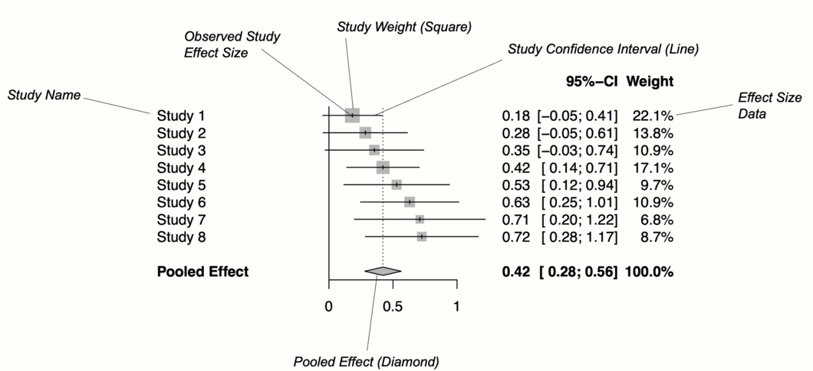

# Forest Plots {#forest}

---


<br></br>

\index{Forest Plot}

<span class="firstcharacter">I</span>
n the last chapters, we learned how we can pool effect sizes in _R_, and how to assess the heterogeneity in a meta-analysis. We now come to a somewhat more pleasant part of meta-analyses, in which we visualize the results we obtained in previous steps.

The most common way to visualize meta-analyses is through **forest plots**. Such plots provide a graphical display of the observed effect, confidence interval, and usually also the weight of each study. They also display the pooled effect we have calculated in a meta-analysis. Overall, this allows others to quickly examine the precision and spread of the included studies, and how the pooled effect relates to the observed effect sizes.

\index{meta Package}

The **{meta}** package has an in-built function which makes it very easy to produce beautiful forest plots directly in _R_. The function has a broad functionality and allows one to change the appearance of the plot as desired. This forest plot function, and how we can use it in practice, will be the main focus of this chapter. Furthermore, we will also briefly discuss an alternative approach to visualize the results of a meta-analysis.

<br></br>

## What Is a Forest Plot?

---

Figure \@ref(fig:forest) shows the main components of a forest plot. On the left side, forest plots display the name of each study included in the meta-analysis. For each study, a graphical representation of the effect size is provided, usually in the center of the plot. This visualization shows the point estimate of a study on the x-axis. This point estimate is supplemented by a line, which represents the range of the confidence interval calculated for the observed effect size. Usually, the point estimate is surrounded by a square. The size of this square is determined by the weight (Chapter \@ref(fem)) of the effect size: studies with a larger weight are given a larger square, while studies with a lower weight have a smaller square. 

Conventionally, a forest plot should also contain the effect size data that was used to perform the meta-analysis. This provides others with the data needed to replicate our results.

```{r forest, out.width='100%', message = F, echo = F, fig.align='center', fig.cap = "Key elements of a forest plot."}
library(OpenImageR)

```

At the bottom of the plot, a diamond shape represents the average effect. The length of the diamond symbolizes the confidence interval of the pooled result on the x-axis. Typically, forest plots also include a vertical **reference line**, which indicates the point on the x-axis equal to no effect. As we will see in the coming examples, forest plots can be enhanced by also displaying, for example, a heterogeneity measure such as $I^2$ or $\tau^2$.

\index{Logarithm, Natural}

Effect size and confidence intervals in forest plots are usually displayed on a linear scale. Yet, when the summary measure is a **ratio** (such as odds ratios or risk ratios), it is common to use a **logarithmic** scale on the x-axis instead. This means that values around 1 are more closely together than values which are much lower or higher than 1. 

This makes sense for ratios since these effect size metrics cannot be interpreted in a "linear" fashion (i.e. the "opposite" of RR = 0.50 is 2, not 1.5; see Chapter \@ref(ratios)). The reference line for such effect sizes is usually 1, which indicates no effect.

<br></br>

## Forest Plots in _R_ {#forest-R}

---

We can produce a forest plot for any type of **{meta}** meta-analysis object (e.g. results of `metagen`, `metacont`, or `metabin`) using the `forest.meta` function. We simply have to provide `forest.meta` with our **{meta}** object, and a plot will be created. Usually, these forest plots already look very good by default, but the function also has countless additional arguments to further adapt the appearance. All of these arguments are described in the function documentation (which can be accessed by running `?forest.meta`). Here is a list of the more important ones:

* **`sortvar`**. The variable in the meta-analysis data set by which studies are sorted in the forest plot. If we want to order the results by effect size, for example, we can use the code `sortvar = TE`. 

* **`comb.fixed`**. Logical, indicating if the fixed-effect model estimate should be included in the plot.

* **`comb.random`**. Logical, indicating if the random-effects model estimate should be included in the plot.

* **`text.fixed`**. The **label** for the pooled effect according to the fixed-effect model. By default, `"Fixed effect model"` is printed.

* **`text.random`**. The label for the pooled effect according to the random-effects model. By default, `"Random effects model"` is printed.

* **`prediction`**. Logical, indicating if the prediction interval should be added to the plot.

* **`label.left`** and **`label.right`**. Label added to the left and right side of the forest plot. This can be used to specify that, for example, effects on this side favor the treatment (e.g. `label.left = "Favors treatment"`).

* **`smlab`**. A label displayed on top of the plot. This can be used to show which effect size metric was used.

* **`xlim`**. The limits of the x-axis, or the character `“s”` to produce symmetric forest plots. This is argument particularly relevant when your results deviate substantially from zero, or if you also want to have outliers depicted. If we want that the x-axis ranges from 0 to 2, for example, the code is `xlim = c(0,2)`.

* **`ref`**. The reference line in the plot. Depending on the summary measure we used, this is either 0 or 1 by default. 

* **`leftcols`** and **`rightcols`**. Here, you can specify which variables should be displayed on the left and right side of the forest plot. There are a few in-built elements that the function uses by default. For example, `"studlab"` stands for the study label, `"effect"` for the observed effect size, and **`effect.ci`** for both the effect size and its confidence interval. It is also possible to add user-defined columns, as long as these were included in the `data.frame` we initially provided to the **{meta}** function. In this case, we only have to add the name of the column as a character string.

* **`leftlabs`** and **`rightlabs`**. The labels that should be used for the columns displayed to the left and right of the forest plot.

* **`print.I2`** and `print.I2.ci`. Logical, indicating if the $I^2$ value and its confidence interval should be printed. This is `TRUE` by default.

* **`print.tau2`** and **`print.tau`**. Logical, indicating if the $\tau^2$ and $\tau$ value should be printed. The value of $\tau^2$ is printed by default.

* **`col.square`**, **`col.diamond`** and **`col.predict`**. The color (e.g. `"blue"`) of the square, diamond and prediction interval, respectively.


Time to generate our first forest plot. In this example, we plot the `m.gen` object that we also used in the previous examples. We sort the studies in the forest plot by effect size, add a prediction interval, and user-defined labels to the left. The `forest.meta` function prints the $\tau^2$ value by default, which we do not want here, so we set `print.tau2` to `FALSE`. 

This is how our code looks in the end:


```{r, fig.height=6, fig.width=8, eval=F}
forest.meta(m.gen, 
            sortvar = TE,
            predict = TRUE, 
            print.tau2 = FALSE,
            leftlabs = c("Author", "g", "SE"))
```

```{r, fig.height=6, fig.width=8, echo=F}
par(bg="#FFFEFA")
forest(m.gen, 
       sortvar = TE,
       predict = TRUE, 
       print.tau2 = FALSE,
       leftlabs = c("Author", "g", "SE"))
```


The plot that `forest.meta` provides us with already looks quite decent. We also see that a think black line has been added to the plot, representing the prediction interval around our pooled effect.

\index{Risk of Bias}

We could enhance the plot by adding a column displaying the risk of bias of each study. The `ThirdWave` data set, which we used to generate `m.gen`, contains a column called `RiskOfBias`, in which the risk of bias assessment of each study is stored. 

When we used `metagen` to calculate the meta-analysis (Chapter \@ref(pre-calculated-es)), the function automatically saved this data within `m.gen`. Therefore, we can use the `leftcols` argument to add the column to the plot. This results in the following code:

```{r, fig.height=6, fig.width=9, eval=F}
forest.meta(m.gen, 
            sortvar = TE,
            predict = TRUE, 
            print.tau2 = FALSE,
            leftcols = c("studlab", "TE", "seTE", "RiskOfBias"),
            leftlabs = c("Author", "g", "SE", "Risk of Bias"))
```

```{r, fig.height=6, fig.width=9, echo=F}
par(bg="#FFFEFA")
forest(m.gen, 
       sortvar = TE,
       predict = TRUE, 
       print.tau2 = FALSE,
       leftcols = c("studlab", "TE", "seTE", "RiskOfBias"),
       leftlabs = c("Author", "g", "SE", "Risk of Bias"))
```

We see that now, the risk of bias information of each study has been added to the forest plot.

\vspace{4mm}

<br></br>

### Layout Types

---

The `forest.meta` function has two "pre-packaged" layouts, which we can use to bring our forest plot into a specific format without having to specify numerous arguments. One of them is the `"JAMA"` layout, which gives us a forest plot according to the guidelines of the **Journal of the American Medical Association**. This layout may be used if you want to publish your meta-analysis in a medical journal.

\vspace{2mm}

```{r, eval=F}
forest.meta(m.gen, layout = "JAMA")
```

```{r, echo=F, fig.height=6, fig.width=8, out.width="75%", fig.align='center'}
par(bg="#FFFEFA")
forest.meta(m.gen, layout = "JAMA")
```

\index{Review Manager (RevMan)}

The other layout is `"RevMan5"`, which produces a forest plot similar to the ones generated by Cochrane's **Review Manager 5**.

```{r, eval=F}
forest.meta(m.gen, layout = "RevMan5")
```

```{r, echo=F, fig.height=6, fig.width=9, out.width="75%", fig.align='center'}
par(bg="#FFFEFA")
forest.meta(m.gen, layout = "RevMan5")
```

<br></br>

### Saving the Forest Plots

---

Forest plots generated by `forest.meta` can be saved as a PDF, PNG, or **scalable vector graphic** (SVG) file. In contrast to other plots generated through base _R_ or the **{ggplot2}** package, the output of `forest.meta` is not automatically re-scaled when we save it as a file. This means that forest plots are sometimes cut off on two or four sides, and we have to adjust the width and height manually so that everything is visible.

The `pdf`, `png` and `svg` function can be used to save plots via _R_ code. We have to start with a call to one of these functions, which tells _R_ that the output of the following code should be saved in the document. Then, we add our call to the  `forest.meta` function. In the last line, we have to include `dev.off()`, which will save the generated output to the file we specified above. 

All three functions require us to specify the `file` argument, which should contain the name of the file. The file is then automatically saved in the working directory under that name. Additionally, we can use the `width` and `height` argument to control the size of the plot, which can be helpful when the output is cut off.

Assuming we want to save our initial forest plot under the name "forestplot", we can use the following code to generate a PDF, PNG and SVG file.

\vspace{2mm}

**PDF**

```{r, eval=F}
pdf(file = "forestplot.pdf", width = 8, height = 7)

forest.meta(m.gen, 
            sortvar = TE,
            predict = TRUE, 
            print.tau2 = FALSE,
            leftlabs = c("Author", "g", "SE"))

dev.off()
```

\vspace{2mm}

**PNG**

```{r, eval=F}
png(file = "forestplot.png", width = 2800, height = 2400, res = 300)

forest.meta(m.gen, 
            sortvar = TE,
            predict = TRUE, 
            print.tau2 = FALSE,
            leftlabs = c("Author", "g", "SE"))

dev.off()
```

\vspace{2mm}

**SVG**

```{r, eval=F}
svg(file = "forestplot.svg", width = 8, height = 7)

forest.meta(m.gen, 
            sortvar = TE,
            predict = TRUE, 
            print.tau2 = FALSE,
            leftlabs = c("Author", "g", "SE"))

dev.off()
```

<br></br>

## Drapery Plots {#drapery}

---

\index{Drapery Plot}

\index{P-Value}

Forest plots are, by far, the most common way to visualize meta-analyses. Most published meta-analyses contain a forest plot, and many researchers understand how they are interpreted. It is advisable that you also include one in your meta-analysis report since forest plots provide a comprehensive and easily understandable summary of your findings.

However, forest plots are not the only way to illustrate our results. Meta-analyses can also be visualized, for example, through **drapery plots** [@rucker2020beyond]. A drawback of forest plots is that they can only display confidence intervals assuming a fixed significance threshold, conventionally $p<$ 0.05. It is based on these confidence intervals that researchers decide if an effect is significant or not. 

There has been a controversy around the use of $p$-values in recent years [@wellek2017critical], and some have argued that hypothesis testing based on $p$-values has contributed to the "replication crisis" in many research areas [@nuzzo2014statistical].

Drapery plots are based on $p$-**value functions**. Such $p$-value functions have been proposed to prevent us from solely relying on the $p$<0.05 significance threshold when interpreting the results of an analysis [@infanger2019p]. 

Therefore, instead of only calculating the 95% confidence interval, $p$-value functions provide a continuous curve which shows the confidence interval for varying values of $p$. In a drapery plot, a confidence curve is plotted for each study, as well as for the average effect. The x-axis shows the effect size metric, and the y-axis the assumed $p$-value. 

Drapery plots can be generated through the `drapery` function in **{meta}**. Like `forest.meta`, this function automatically generates the plot once we provide it with a **{meta}** meta-analysis object. There are a few additional arguments, with the most important ones being:

* **`type`**: Defines the type of value to be plotted on the y-axis. This can be `"zvalue"` (default) for the test statistic, or the $p$-value (`"pvalue"`). 

* **`study.results`**: Logical, indicating if the results of each study should be included in the plot. If `FALSE`, only the summary effect is printed.

* **`labels`**: When we set this argument to `"studlab"`, the study labels will be included in the plot.

* **`legend`**: Logical, indicating if a legend should be printed.

* **`pos.legend`**. The position of the legend. Either `"bottomright"`, `"bottom"`, `"bottomleft"`, `"left"`, `"topleft"`, `"top"`, `"topright"`, `"right"`, or `"center"`. 

Let us try out the `drapery` function in an example using our `m.gen` meta-analysis object. 


```{r, fig.align='center', eval=F}
drapery(m.gen, 
        labels = "studlab",
        type = "pval", 
        legend = FALSE)
```


```{r, fig.align='center', echo=F, fig.width=12, fig.height=8}
par(bg="#FFFEFA")
drapery(m.gen, 
        labels = "studlab",
        type = "pval", 
        legend = FALSE,
        bg = "#FFFEFA")
```

The resulting plot contains a $p$-value curve for each effect size, all in the shape of an upside down V. The thick line represents the average effect according to the random-effects model. The shaded area we see in the plot represents the prediction interval, which is considerably wider than the confidence interval of the pooled effect.

The "peak" of the $p$-value functions represents the exact value of the effect size in our meta-analysis. As we go down the y-axis, the $p$-value becomes smaller, and the confidence intervals wider and wider, until we reach conventional significance thresholds, indicated by the dashed horizontal lines. 

Based on the plot, we see that we can be quite confident in the pooled effect size being greater than zero, given that the thick line reaches zero on the x-axis when $p$ is already very, very small (<0.01).

Rücker et al. [-@rucker2020beyond] recommend that drapery plots should mainly be used **in addition** to forest plots. Simply replacing the forest with a drapery plot may be not a good idea, because the latter does not contain much of the effect size information that might be needed by others to reproduce our results. 

$$\tag*{$\blacksquare$}$$

<br></br>

## Questions & Answers

```{block, type='boxquestion'}
**Test your knowledge!**

\vspace{4mm}

1. What are the key components of a forest plot?

\vspace{-2mm}

2. What are the advantages of presenting a forest plot of our meta-analysis?

\vspace{-2mm}

3. What are the limitations of forest plots, and how do drapery plots overcome this limitation?

\vspace{4mm}


**Answers to these questions are listed in [Appendix A](#qanda6) at the end of this book.**

```


<br></br>

## Summary

* It is conventional to visualize the results of meta-analyses through forest plots. 

* Forest plots contain a graphical representation of each study's effect size and confidence interval, and also show the calculated overall effect. Furthermore, they contain the effect size data that was used for pooling.

* It is also possible to add other kinds of information to a forest plot, for example the quality rating that each study received.

* Forest plots can only display results assuming a fixed significance threshold, usually $p<$ 0.05. To visualize how results change for varying significance thresholds, drapery plots can be generated in addition.
