# Risk of Bias Plots

*by Luke A. McGuinness*

``` {r, echo=FALSE}
ggplot2::ggsave(
          filename = "_figs/robplot2.png",
          plot = robvis::rob_summary(robvis::data_rob2,"ROB2", overall = TRUE),
          width = 8,
          height = 2.41,
          dpi = 1000
          )

```

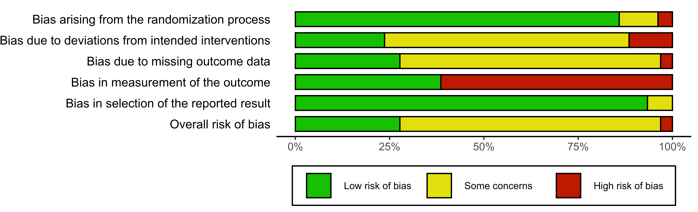

In this Chapter, we will describe how to create risk of bias plots in *R*, using the `robvis` package.

<br></br>

## Introduction {#rob-intro}

As part of a systematic review and meta-analysis, you may also want to examine the internal validity (risk of bias) of included studies using the relevant [**domain-based risk of bias assessment tool**](https://handbook-5-1.cochrane.org/chapter_8/8_3_1_types_of_tools.htm), and present the results of this assessment in a graphical format. The Cochrane Handbook recommends two types of figure: a summary barplot figure showing the proportion of studies with a given risk of bias judgement within each domain, and a traffic light plot which presents the domain level judgments for each study.

However, the options available to researchers when creating these figures are limited. While RevMan has the functionality to create the plots, many researchers do not use it to conduct thei systematic review and so copying the relevant data into the system is an inefficient solution. Similarly, producing the graphs by hand, using software such as MS PowerPoint, is time consuming and means the figures have to manually updated if changes are needed. Additionally, journals usually require figures to be of publication quality (above ~300-400dpi), which can be hard to achieve when exporting the risk of bias figures from RevMan or creating them by hand. 

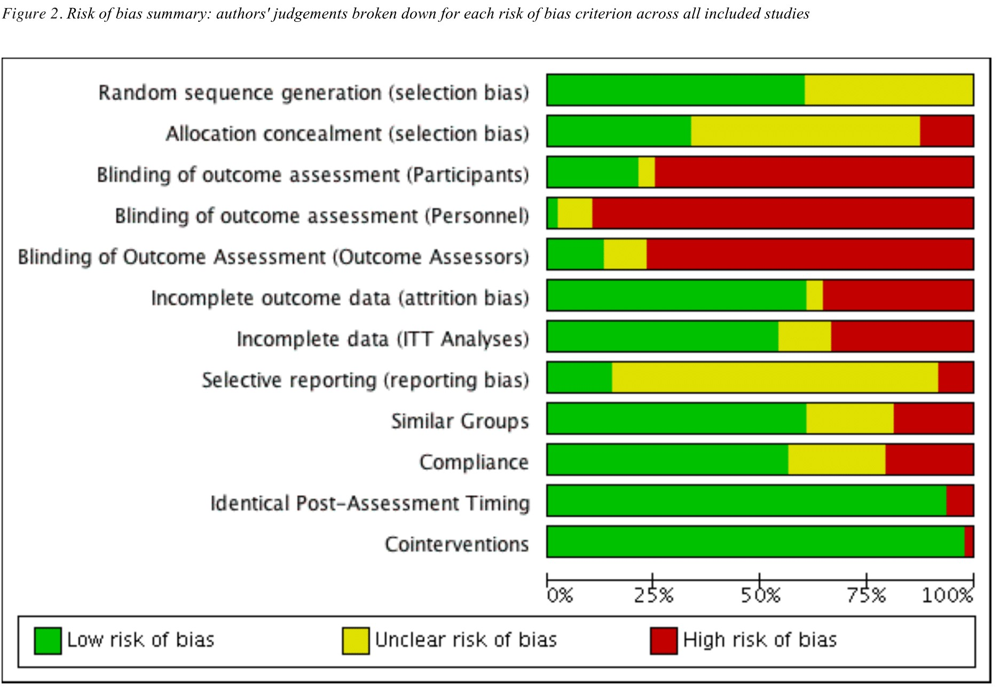

To avoid all of this, you can now easily plot the risk of bias figures yourself within RStudio, using the `robvis` package which provides functions to convert a risk of bias assessment summary table into a summary plot or a traffic-light plot.

### Load `robvis` {#loading-robvis}

Assuming that you have already installed the `dmetar` package (see Section \@ref(install-dmetar)), load the `robvis` package using:

```{r, eval=FALSE}
library(robvis)
```

### Importing your risk of bias summary table data

To produce our plots, we first have to import the results of our risk of bias assessment from Excel into R. Please note that `robvis` expects certain facts about the data you provide it, so be sure to follow the guidance below when setting up your table in Excel:

1. The first column is labelled "Study" and contains the study identifier (e.g. **Anthony et al, 2019**)
1. The second-to-last column is labelled "Overall" and contains the overall risk-of-bias judgments
1. The last column is labelled "Weight" and contains some measure of study porecision e.g. the weight assigned to each study in the meta-analysis, or if no meta-analysis was performed, the sample size of each study). See Section \@ref(rob-summary-weighted) for more details.
1. All other columns contain the results of the risk-of bias assessment for a specific domain. 

To elaborate on the above guidance, consider as an example the ROB2 tool which has 5 domains. The resulting dataset that `robvis` would expect for this tool would have 8 columns:

  * Column 1: Study identifier
  * Column 2-6: One RoB2 domain per column
  * Column 7: Overall risk-of-bias judgments
  * Column 8: Weight

In Excel, this risk of bias summary table would look like this:


**Note**: for three of the four tool templates (ROB2, ROBINS-I, QUADAS-2), what you name the columns containing the domain-level judgments is not important, as the templates within `robvis` will relabel each domain with the correct tool-specific heading.

Once you have saved the table you created in Excel to the working directory as a comma-separated-file (e.g. "robdata.csv"; see Section \@ref(import-excel)), you can either read the file into R programatically using the command below or via the "import assistant" method as described in Section \@ref(load-the-data).

``` {r, eval =FALSE}
my_rob_data <- read.csv("robdata.csv", header = TRUE)
```

### Templates

`robvis` produces the risk of bias figures by using the data you provide to populate a template figure specific to the risk of bias assessment tool you used. At present, `robvis` contains templates for the following three tools:

* ROB2, the new Cochrane risk of bias tool for randomized controlled trials;
* ROBINS-I, the Risk of Bias In Non-randomized Studies - of Interventions tool;
* QUADAS-2, the Quality and Applicability of Diagnostic Accuracy Studies, Version 2;

`robvis` also contains a special generic template, labelled as ROB1. Designed for use with the original Cochrane risk of bias tool for randomized controlled trials, it can also be used to visualize the results of assessments performed with other domain-based tools not included in the list above. See Section \@ref(rob1-template) for more information on the additional steps required when using this template.

### Example datasets
The `robvis` package contains an example dataset for each template outlined above. These are stored in the following objects:

* *data_rob2*    : Example data for the ROB2 tool
* *data_robins*  : Example data for the ROBINS-I tool
* *data_quadas*  : Example data for the QUADAS-2 tool
* *data_rob1*    : Example data for the RoB-1 tool

You can explore these datasets using the `head()` function. For example, once you have loaded the package using `library(robvis)`, viewing the ROBINS-I example dataset can be achieved by running the following command:

```{r, eval = FALSE}
head(data_robins)
```


``` {r, echo = FALSE, results = 'asis'}
head(robvis::data_robins)
```


These example datasets are used to create the plots presented through the remainder of this guide.

<br></br>

## Summary plots 

### Basics

Once we have successfully imported the risk of bias summary table into R, creating the risk of bias figures is quite straightforward. 

To get started, a simple weighted summary barplot using the ROB2 example dataset (`data_rob2`) is created by running the following code: 

```{r, eval = FALSE}

rob_summary(data = data_rob2, tool = "ROB2")

```

``` {r, echo=FALSE}
ggplot2::ggsave(
          filename = "_figs/robsummaryplot2.png",
          plot = robvis::rob_summary(data = robvis::data_rob2, tool = "ROB2"),
          width = 8,
          height = 2.41,
          dpi = 1000
          )
```

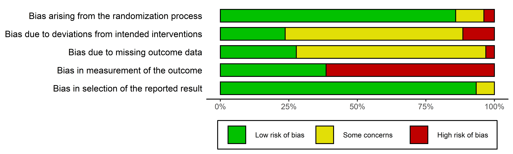

### Modifying your summary barplot

**The `rob_summary()` function has the following parameters:**

```{r,echo=FALSE}
i<- c("data", "tool", "overall", "weighted", "colour", "quiet")

ii<-c("A dataframe containing summary (domain) level risk-of-bias assessments, with the first column containing the study details, the second column containing the first domain of your assessments, and the final column containing a weight to assign to each study. The function assumes that the data includes a column for overall risk-of-bias. For example, a ROB2.0 dataset would have 8 columns (1 for study details, 5 for domain level judgments, 1 for overall judgments, and 1 for weights, in that order).", "The risk of bias assessment tool used. RoB2.0 (tool='ROB2'), ROBINS-I (tool='ROBINS-I'), and QUADAS-2 (tool='QUADAS-2') are currently supported.", "An option to include an additional bar for overall risk-of-bias in the figure. Default is FALSE.", "An option to specify whether weights should be used in the barplot. Default is TRUE, in line with current Cochrane Collaboration guidance.", "An argument to specify the colour scheme for the plot. Default is 'cochrane' which used the ubiquitous Cochrane colours, while a preset option for a colour-blind friendly palette is also available (colour = 'colourblind').", "A logical option to quietly produce the plot without displaying it. Default is FALSE.")
ms<-data.frame(i,ii)
names<-c("Argument", "Description")
colnames(ms)<-names
knitr::kable(ms) 


```

Examples of the functionality of each argument are described below.

#### Tool {#rob-summary-tool}

An argument to define the tool template you wish to use. In the example above, the ROB2 template is used. The two other primary templates - the ROBINS-I and QUADAS-2 templates - are demonstrated below:

```{r, eval = FALSE}
rob_summary(data = data_robins, tool = "ROBINS-I")
```

``` {r, echo=FALSE}
ggplot2::ggsave(
          filename = "_figs/robsummaryplot2-robinsi.png",
          plot = robvis::rob_summary(data = robvis::data_robins, tool = "ROBINS-I"),
          width = 8,
          height = 2.41,
          dpi = 1000
          )
```

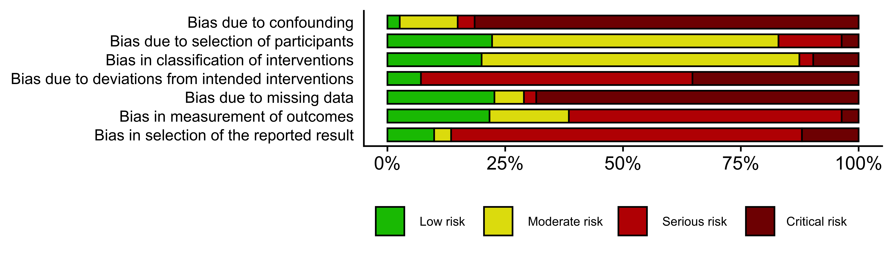

```{r, eval = FALSE}
rob_summary(data = data_quadas, tool = "QUADAS-2")
```

``` {r, echo=FALSE}
ggplot2::ggsave(
          filename = "_figs/robsummaryplot2-quadas.png",
          plot = robvis::rob_summary(data = robvis::data_quadas, tool = "QUADAS-2"),
          width = 8,
          height = 2.41,
          dpi = 1000
          )
```

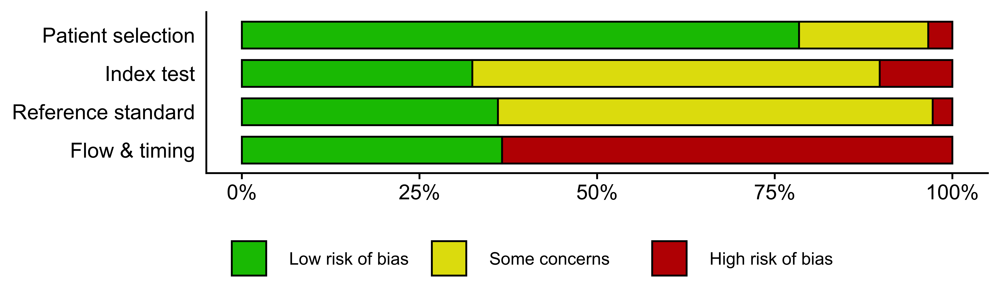

#### Overall
By default, an additional bar representing the overall risk of bias judgments is not included in the plot. If you would like to include this, set `overall = TRUE`. For example:

```{r, eval = FALSE}
rob_summary(data = data_rob2, tool = "ROB2", overall = TRUE)
```

``` {r, echo=FALSE}
ggplot2::ggsave(
          filename = "_figs/robsummaryplot2-overall.png",
          plot = robvis::rob_summary(data = robvis::data_rob2, tool = "ROB2", overall = TRUE),
          width = 8,
          height = 2.41,
          dpi = 1000
          )
```

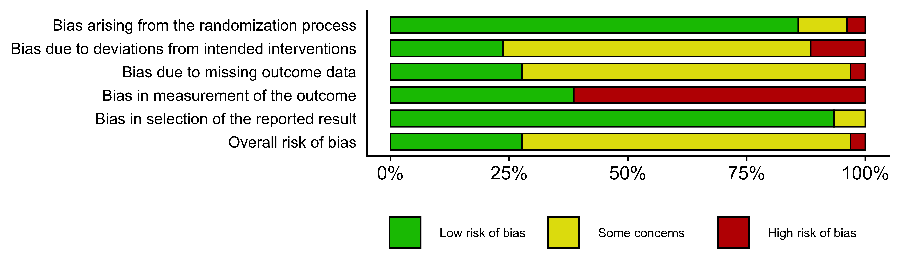


#### Weighted or un-weighted bar plots (`weighted`) {#rob-summary-weighted}

By default, the barplot is weighted by some measure of study precision, so that the barplot shows the _proportion of information_ rather than the _proportion of studies_ that is at a particular risk of bias. This approach is in line with the [Cochrane Handbook](https://training.cochrane.org/handbook/current/chapter-07#section-7-4).

You can turn off this option by setting `weighted = FALSE` to create an un-weighted barplot. For example, compare the following two plots: 

```{r, eval = FALSE}

rob_summary(data = data_rob2, tool = "ROB2")

```


```{r,eval=FALSE}
rob_summary(data = data_rob2, tool = "ROB2", weighted = FALSE)
```


``` {r, echo=FALSE}
ggplot2::ggsave(
          filename = "_figs/robsummaryplot2-unweighted.png",
          plot = robvis::rob_summary(data = robvis::data_rob2, tool = "ROB2", weighted = FALSE),
          width = 8,
          height = 2.41,
          dpi = 1000
          )
```

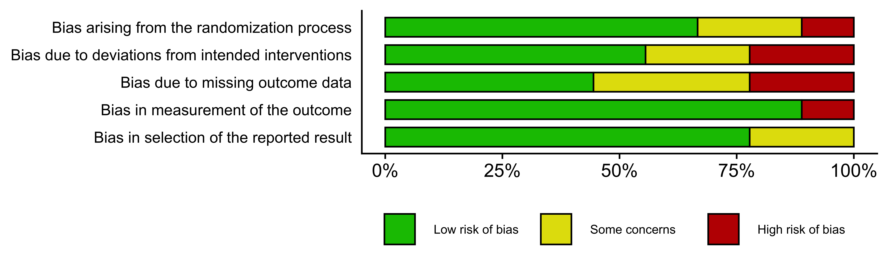

#### Colour scheme (`colour`) {#rob-summary-colour}

__NB: Please note the non-US English spelling of colour__

The `colour` argument of both plotting functions allows users to select from two predefined colour schemes, "cochrane" (default) or "colourblind", or to define their own palette by providing a vector of hex codes.

For example, to use the predefined "colourblind" palette:

```{r, eval = FALSE}
rob_summary(data = data_rob2, tool = "ROB2", colour = "colourblind")
```

``` {r, echo = FALSE}
ggplot2::ggsave(
          filename = "_figs/robsummaryplot2-colourblind.png",
          plot = robvis::rob_summary(data = robvis::data_rob2,"ROB2", colour = "colourblind"),
          width = 8,
          height = 2.41,
          dpi = 1000
          )
```

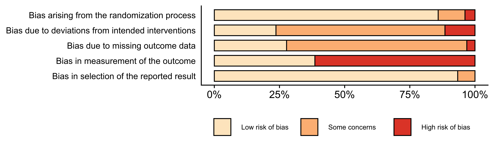


And to define your own colour scheme:
```{r, eval = FALSE}
rob_summary(data = data_rob2, tool = "ROB2", colour = c("#f442c8","#bef441","#000000"))
```

``` {r, echo=FALSE}
ggplot2::ggsave(
          filename = "_figs/robsummaryplot2-customcolour.png",
          plot = robvis::rob_summary(data = robvis::data_rob2,"ROB2", colour = c("#f442c8","#bef441","#000000")),
          width = 8,
          height = 2.41,
          dpi = 1000
          )
```


When defining your own colour scheme, you must ensure that the number of discrete judgments (e.g. "Low"/"Moderate"/"High"/"Critical") and the number of colours specified are the same. Additionally, colours must be specified in order of ascending risk-of-bias (e.g. "Low" -> "Critical"), with the first hex corresponding to "Low" risk of bias.


### Saving your plot
See Section \@ref(save-rob-plots) for detailed instructions on how to save your plot.

<br></br>


## Traffic light plots

Frequently, researchers will want to present the risk of bias in each domain for each study assessed. The resulting plots are commonly called traffic light plots, and can be produced with `robvis` via the `rob_traffic_light()` function.

### Basics

```{r, eval = FALSE}

rob_traffic_light(data = data_rob2, tool = "ROB2")

```

``` {r, echo = FALSE}
ggplot2::ggsave(
          filename = "_figs/robtfplot2.png",
          plot = robvis::rob_traffic_light(data = robvis::data_rob2, "ROB2", psize = 15),
          width = 7,
          height = 8,
          dpi = 1000
          )
```

To get started, a traffic light plot using the ROB2 example dataset (`data_rob2`) is created by running the following code:


### Modifying the traffic light plot

**The `rob_summary()` function has the following parameters:**

```{r,echo=FALSE}
j<- c("data", "tool", "colour", "psize", "quiet")

jj<-c("A dataframe containing summary (domain) level risk-of-bias assessments, with the first column containing the study details, the second column containing the first domain of your assessments, and the final column containing a weight to assign to each study. The function assumes that the data includes a column for overall risk-of-bias. For example, a ROB2.0 dataset would have 8 columns (1 for study details, 5 for domain level judgments, 1 for overall judgments, and 1 for weights, in that order).", "The risk of bias assessment tool used. RoB2.0 (tool='ROB2'), ROBINS-I (tool='ROBINS-I'), and QUADAS-2 (tool='QUADAS-2') are currently supported.", "An argument to specify the colour scheme for the plot. Default is 'cochrane' which used the ubiquitous Cochrane colours, while a preset option for a colour-blind friendly palette is also available (colour = 'colourblind').", "An option to change the size of the \"traffic light\" points. Default is 20.", "A logical option to quietly produce the plot without displaying it. Default is FALSE.")
ms2<-data.frame(j,jj)
names<-c("Argument", "Description")
colnames(ms2)<-names
knitr::kable(ms2) 
```

#### Tool (`tool`)

An argument to define the tool template you wish to use. The ROB2 template is demonstrated and the two other primary templates - the ROBINS-I and QUADAS-2 templates - are displayed below:

```{r, eval = FALSE}

rob_traffic_light(data = data_robins, tool = "ROBINS-I")

```

``` {r, echo = FALSE}
ggplot2::ggsave(
          filename = "_figs/robinstfplot2.png",
          plot = robvis::rob_traffic_light(data = robvis::data_robins, tool = "ROBINS-I", psize = 10),
          width = 7,
          height = 8,
          dpi = 1000
          )
```


```{r, eval = FALSE}

rob_traffic_light(data = data_quadas, tool = "QUADAS-2")

```

``` {r, echo = FALSE}
ggplot2::ggsave(
          filename = "_figs/quadastfplot2.png",
          plot = robvis::rob_traffic_light(data = robvis::data_quadas, tool = "QUADAS-2", psize = 13),
          width = 7,
          height = 8,
          dpi = 1000
          )
```


#### Colour scheme (`colour`)

__NB: Please note the non-US English spelling of colour__

The `colour` argument of both plotting functions allows users to select from two predefined colour schemes, "cochrane" (default) or "colourblind", or to define their own palette by providing a vector of hex codes.

For example, to use the predefined "colourblind" palette:


```{r, eval = FALSE}
rob_traffic_light(data = data_rob2, tool = "ROB2", colour = "colourblind")
```

``` {r, echo = FALSE}
ggplot2::ggsave(
          filename = "_figs/robtfplot2-colourblind.png",
          plot = robvis::rob_traffic_light(data = robvis::data_rob2, "ROB2", colour = "colourblind", psize = 15),
          width = 7,
          height = 8,
          dpi = 1000
          )
```


And to define your own colour scheme:
```{r, eval = FALSE}
rob_traffic_light(data = data_rob2, tool = "ROB2", colour = c("#f442c8","#bef441","#000000"))
```

``` {r, echo = FALSE}
ggplot2::ggsave(
          filename = "_figs/robtfplot2-customcolours.png",
          plot = robvis::rob_traffic_light(data = robvis::data_rob2, "ROB2", psize = 15, colour = c("#f442c8","#bef441","#000000")),
          width = 7,
          height = 8,
          dpi = 1000
          )
```


When defining your own colour scheme, you must ensure that the number of discrete judgments (e.g. "Low"/"Moderate"/"High"/"Critical") and the number of colours specified are the same. Additionally, colours must be specified in order of ascending risk-of-bias (e.g. "Low" -> "Critical"), with the first hex corresponding to "Low" risk of bias.

#### Point size (`psize`)

Occasionally, when a large number of risk of bias assessment have been performed, the resulting traffic light plot may be too long to be useful. Users can address this by modifying the `psize` argument of the `rob_traffic_light()` function to a smaller number (default is 20). For example:

```{r, eval = FALSE}
# Create bigger dataset (18 studies)
new_rob2_data <- rbind(data_rob2, data_rob2)
new_rob2_data$Study <- paste("Study", seq(1:length(new_rob2_data$Study))) 

# Plot bigger dataset, reducing the psize argument from 20 to 8
rob_traffic_light(data = new_rob2_data, tool = "ROB2", psize = 8)

```

``` {r, echo = FALSE}

new_rob2_data <- rbind(robvis::data_rob2, robvis::data_rob2)

new_rob2_data$Study <- paste("Study", seq(1:length(new_rob2_data$Study))) 

ggplot2::ggsave(
          filename = "_figs/robtfplot3.png",
          plot = robvis::rob_traffic_light(new_rob2_data, "ROB2", psize = 8),
          width = 7,
          height = 8,
          dpi = 1000
          )
```


### Saving your plot
See Section \@ref(save-rob-plots) for detailed instructions on how to save your plot.

<br></br>

## The "ROB1" generic template {#rob1-template}

### Motivation
This template offers increased flexibility in the domains that are included in the plot. It can handle any number of domains (c.f. the other tool templates that have a set number of domains) and uses the user-defined column headings as domain titles in the resulting figures.

### Varying numbers of domains
The "ROB1" template (`tool = "ROB1"`) can handle varying numbers of columns. This was originally designed for use with the ROB1 assessment tool, to which frequently added or removed domains. __While this template could be used to present the result of assessments performed using adjusted versions of the other tools (ROB2, QUADAS-2, ROBINS-I), we would strongly discourage authors from doing so.__ Authors using other published tools should use the stricter templates presented in the previous chapters to ensure they conform with the guidance.

### Domain names
For the other tools listed in the previous sections, the names of the columns containing the domain-level risk of bias judgments are not important. For example, they are commonly named _D1/D2/D3/etc_. However, this is not the case when using the `"ROB1"` template.

Compare the column headings of the `data_rob2` and the `data_rob1` (presented horizontally here for ease of comparison):

```{r}
k<-c(colnames(robvis::data_rob2),"NA","NA")
kk<-colnames(robvis::data_rob1)
kkk<-seq(1:10)

ms3 <- data.frame(colnum = kkk, data_rob2 = k, data_rob1 = kk)

knitr::kable(
  list(
    ms3[,c(1,2)],
    ms3[,c(1,3)]
  ), col.names = c("No.", "Column name"),
  caption = 'Comparison of column names in the `data_rob2` (left) and `data_rob1` (right) datasets.'
)


```

The domain columns (Columns 2-6) in the ROB2 example dataset have been given arbitrary names of _D1_ - _D5_, as they will be overwritten by the tool to correspond to the correct domain titles given by the ROB2 guidance.

In contrast, the domain columns (Columns 2-8) in the ROB1 example dataset are labelled correctly, as these will be used in the figures produced by `rob_summary()` and `rob_traffic_light()`. As an example, suppose we change the name of the "Random.sequence.generation" column to "This is a test". In the `rob_summary()` figure, the title of the first bar is changed, while in the `rob_traffic_light()` figure, the caption is updated to reflect this change.

```{r, eval = FALSE}
# Create copy of the data_rob1 dataset 
new_rob1_data <- data_rob1

# Change the column heading for the first domain
colnames(new_rob1_data)[2] <- "This is a test"

# Create the summary barplot
rob_summary(data = new_rob1_data, tool = "ROB1")

```

```{r, echo = FALSE}


new_rob1_data <- robvis::data_rob1


colnames(new_rob1_data)[2] <- "This is a test"

# Create the summary
ggplot2::ggsave(
          filename = "_figs/rob1summary+domainname.png",
          plot = robvis::rob_summary(data = new_rob1_data, "ROB1"),
          width = 8,
          height = 2.41,
          dpi = 1000
          )

```

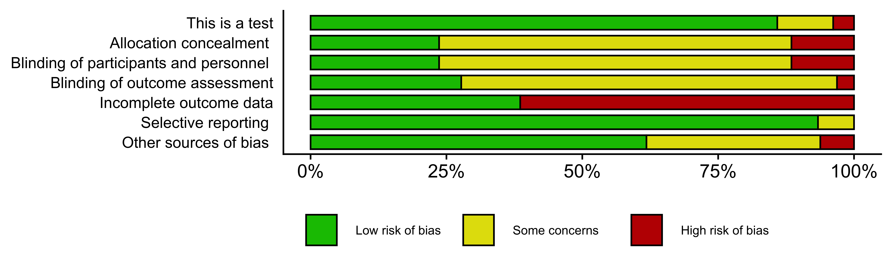

``` {r, eval = FALSE}

# Create the traffic light plot
rob_traffic_light(data = new_rob1_data, tool = "ROB1")

```

``` {r, echo = FALSE}
ggplot2::ggsave(
          filename = "_figs/rob1tf+domainname.png",
          plot = robvis::rob_traffic_light(data = new_rob1_data, "ROB1"),
          width = 7,
          height = 8,
          dpi = 1000
          )
```


<br></br>

## Customizing and saving your risk of bias plots {#save-rob-plots}

### The `ggplot2` package

Both `robvis` functions (`rob_summary()` and `rob_traffic_light()`) produce a `ggplot` object, and so can be customized and saved using functions from the `ggplot2` package. Use the following code to load this package:

```{r, eval = FALSE}
library(ggplot2)
```

### Modifying your plots

There are a range of post-production modifications you can make to you plots using `ggplot2` functions. A useful example is adding a title to the plot:

``` {r, eval = FALSE}
# Make sure you have the ggplot2 package installed and loaded

rob_summary(data_rob2, "ROB2") +
  ggtitle("Your custom title")

```

``` {r, echo = FALSE}

ggplot2::ggsave(
          filename = "_figs/robsummaryplot+title.png",
          plot = robvis::rob_summary(robvis::data_rob2,"ROB2") +
            ggplot2::ggtitle ("Your custom title"),
          width = 8,
          height = 2.41,
          dpi = 1000
          )

```

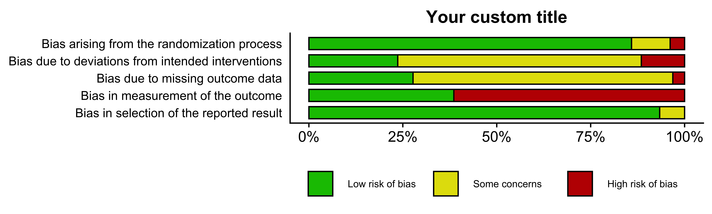

In a similar manner, you can add a border to your plots:

``` {r, eval = FALSE}
# Make sure you have the ggplot2 package installed and loaded

rob_summary(data_rob2, "ROB2") +
   theme(plot.background = element_rect(colour = "black"))

```

``` {r, echo = FALSE}

ggplot2::ggsave(
          filename = "_figs/robsummaryplot+border.png",
          plot = robvis::rob_summary(robvis::data_rob2, "ROB2") +
   ggplot2::theme(plot.background = ggplot2::element_rect(colour = "black")),
          width = 8,
          height = 2.41,
          dpi = 1000
          )

```

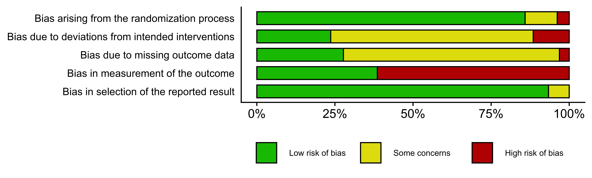

### Saving the plot

In order to save a risk of bias plot, we first assign it to an object using the `<-` operator and then save it using the `ggsave()` function of the `ggplot2` 

When saving the summary barplot, we recommend using the following code, with the default height and width values. 

``` {r, eval = FALSE}
# Create your plot, and assign it to an object
rob_barplot <- rob_summary(data_rob2, "ROB2")

# Save your plot
ggsave(plot = rob_barplot,                  # Plot object to save
       filename = "robplot2.png",     # Destination file
       width = 8,                           # Width of image (recommended)
       height = 2.41,                       # Height of image (recommended)
       dpi = 1000                           # Resolution of image
       )
```

When saving the traffic light plots, the approach is the same. However, there are no recommended values for the `width` and `height` parameters, as the best values for these parameters will vary from plot to plot as the number and names of included studies change.


### Saving in a different format

The plots can be saved in a range of formats using the function outlined above, simply by changing the extension of the file-name (e.g. from "*.png*" to "*.pdf*"). Acceptable formats included:

* .png
* .pdf
* .tiff
* .svg ^[This format requires you to install and load the `svglite` package: `install.packages("svglite"); library(svglite)`]

For example, to save the barplot created above (`rob_barplot`) as a PDF:

``` {r, eval = FALSE}

# Save your plot
ggsave(plot = rob_barplot,                  
       filename = "robplot2.pdf",     # File extension now ".pdf"
       width = 8,                           
       height = 2.41,                       
       dpi = 1000                           
       )

```


<br></br>

## Web app

In an effort to allow users to quickly explore the functionality of `robvis`, a web application was created which provides a graphically interface to the `robvis` package.

The web-app is available [here](https://mcguinlu.shinyapps.io/robvis). A brief guided walk-through is presented below.

### Landing Page {#robvis-app-landing}

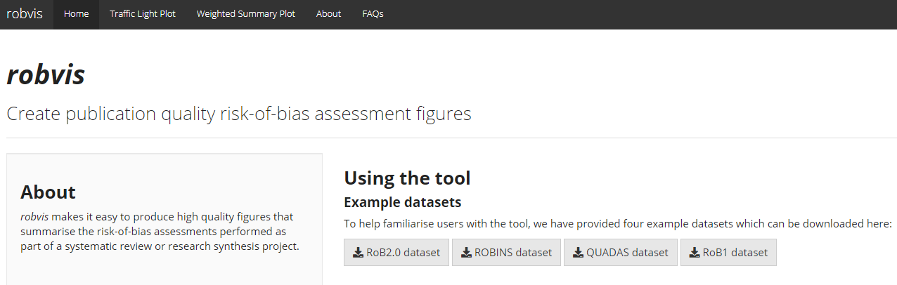

The page presents a concise version of the guidance found in the previous chapters, specifically relating to setting up your dataset. More importantly, users can download the example datasets for each tool as a CSV file and use these to interact with the app and explore its functionality.


### Traffic light plot page {#robvis-app-traffic-light}

Clicking on the second tab will bring you to the screen displayed below.


This menu acts as a graphical interface for the `rob_traffic_light()` function:

* Upload your risk of bias summary table by clicking "Browse..." and navigating to where you stored your CSV file.
* Use the drop-down box to select the tool used to perform your risk of bias assessments.
 
The basic traffic light plot should now appear on the right hand side of the window.

You can customize the plot using the following options:
 
* Select the colour scheme you wish to use (either "Cochrane" or "Colour-blind friendly")
* Modify the point size (useful when you wish to plot a large number of studies on a single traffic light plot)
* Modify the text size.
 
Once you are happy with the plot, you can download it by selecting the required format (.png, .jpg,.tiff, .eps) and clicking the "Download plot" button. Note, if you do not first select a format, you will get a download error.

### Summary plot {#robvis-app-summary-barplot}

Clicking on the third tab will bring you to the screen displayed below.

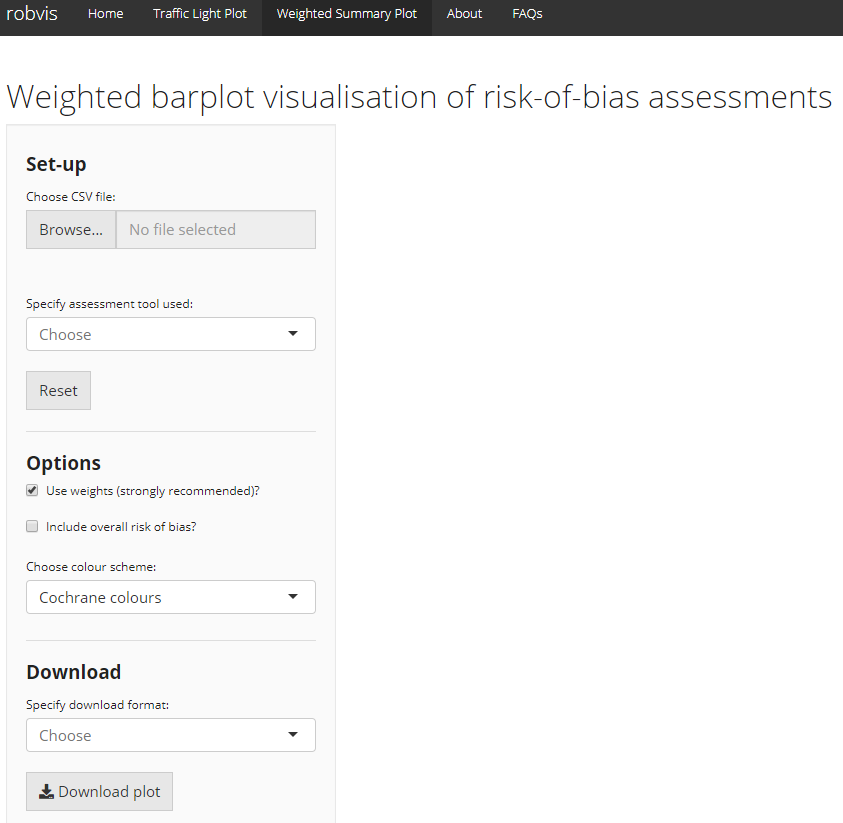

This menu acts as a graphical interface for the `rob_summary()` function:

* Upload your risk of bias summary table by clicking "Browse..." and navigating to where you stored your CSV file.
* Use the drop-down box to select the tool used to perform your risk of bias assessments.
 
The basic weighted summary barplot should now appear on the right hand side of the window.

You can customize the plot using the following options:

* Choose whether or not to use weights when creating the figure
* Include an additional bar representing distribution of overall risk of bias judgments
* Select the colour scheme you wish to use (either "Cochrane" or "Colour-blind friendly")

As with the traffic light plot tab, you can download your plot by selecting the required format and clicking the "Download plot" button. 

<br></br>


