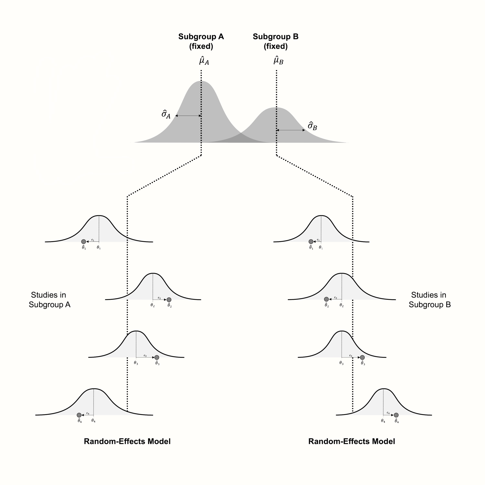

# Subgroup Analyses {#subgroup}

---


<br></br>

<span class="firstcharacter">I</span>
n Chapter \@ref(heterogeneity), we discussed the concept of between-study heterogeneity, and why it is so important in meta-analyses. We also learned methods that allow us to identify which studies contribute to the observed heterogeneity as part of outlier and influence analyses. In these analyses, we approach our meta-analysis from a purely statistical standpoint. We "measure" considerable heterogeneity in our data, and therefore exclude studies with unfitting statistical properties (i.e. outlying and influential studies) to improve the robustness of our model.

\index{Outlier}
\index{Influential Case}
\index{Heterogeneity}

This approach can be seen as a **post hoc** procedure. Outlier and influence analyses are performed **after** seeing the data, and often **because** of the results we found. Also, they do not pay attention to anything else than the data itself. An influence analysis method may tell us that some study does not properly follow the expectations of our model, but not **why** this is the case. It might be because this study used just a slightly different research method or treatment. Yet, we are not able to know this based on the study's influence alone. 

Imagine that you perform a meta-analysis investigating the effectiveness of a medical treatment. You find out that, overall, the treatment has no effect. However, there are three studies in which a considerable treatment effect was found. It may be possible to detect these studies in influence analyses, but this will not tell you why they are influential. It could be that all three studies used a treatment which varied slightly from the one used in all the other studies, and that this little detail had a profound impact on the treatment's effectiveness. This would be a groundbreaking discovery. However, it is one which cannot be made using outlier and influence analyses alone.

\index{Subgroup Analysis}
\index{Moderator Analysis}

This makes it clear that we need a different approach, one that allows us to identify **why** a specific heterogeneity pattern can be found in our data. **Subgroup analyses**, also known as **moderator analyses**, are one way to do this. They allow us to test specific hypotheses, describing why some type of study produces lower or higher effects than another. 

As we learned in Chapter \@ref(analysis-plan), subgroup tests should be defined **a priori**. Before we begin with our meta-analysis, we should define different study characteristics which may influence the observed effect size, and code each study accordingly. There are countless reasons why effect sizes may differ, but we should restrict ourselves to the ones that matter in the context of our analysis. 

We can, for example, examine if some type of medication yields higher effects than another one. Or we might compare studies in which the follow-up period was rather short to studies in which it was long. We can also examine if observed effects vary depending on the cultural region in which a study was conducted. As a meta-analyst, it helps to have some subject-specific expertise, because this allows to find questions that are actually relevant to other scientists or practitioners in the field.

The idea behind subgroup analyses is that meta-analysis is not only about calculating an average effect size, but that it can also be a tool to investigate variation in our evidence. In subgroup analyses, we see heterogeneity not merely as a nuisance, but as interesting variation which may or may not be explainable by a scientific hypothesis. In the best case, this can further our understanding of the world around us, or at least produce practical insights that guide future decision-making.

In this chapter, we will describe the statistical model behind subgroup analyses, and how we can conduct one directly in _R_.

<br></br>

## The Fixed-Effects (Plural) Model {#fixed-effect-plural}

---

\index{Fixed-Effects (Plural) Model}

In subgroup analyses, we hypothesize that studies in our meta-analysis do not stem from one overall population. Instead, we assume that they fall into different **subgroups** and that each subgroup has its own true overall effect. Our aim is to reject the null hypothesis that there is no difference in effect sizes between subgroups.

The calculation of a subgroup analysis consists of two parts: first, we pool the effect in each subgroup. Subsequently, the effects of the subgroups are compared using a statistical test [@borenstein2013meta].

<br></br>

### Pooling the Effect in Subgroups

---

The first part is rather straightforward, as the same criteria as the ones for a meta-analysis without subgroups (see Chapter \@ref(fem-rem)) apply. If we assume that all studies in a subgroup stem from the same population, and have one shared true effect, we can use the fixed-effect model. As we mentioned previously, it is often unrealistic that this assumption holds in practice, even when we partition our studies into smaller groups.

\index{Random-Effects Model}

The alternative, therefore, is to use a random-effects model. This assumes that studies within a subgroup are drawn from a universe of populations, the mean of which we want to estimate. The difference to a normal meta-analysis is that we conduct **several** separate random-effects meta-analyses, one for each subgroup. Logically, this results in a pooled effect $\hat\mu_g$ for each subgroup $g$.

\index{Heterogeneity}

Since each subgroup gets its own separate meta-analysis, estimates of the $\tau^2$ heterogeneity will also differ from subgroup to subgroup. In practice, however, the individual heterogeneity values $\hat\tau^2_g$ are often replaced with a version of $\tau^2$ that was pooled across subgroups. 

This means that all subgroups are assumed to share a **common** estimate of the between-study heterogeneity. This is mostly done for practical reasons. When the number of studies in a subgroup is small, e.g. $k_g \leq 5$ [@borenstein2011introduction, chapter 19], it is likely that the estimate of $\tau^2$ will be imprecise. In this case, it is better to calculate a pooled version of $\tau^2$ that is used across all subgroups, than to rely on a very imprecise estimate of the between-study heterogeneity in one subgroup.


<br></br>

### Comparing the Subgroup Effects {#comparing-the-subgroup-effects}

---

In the next step, we assess if there is a **true** difference between the $G$ subgroups. The assumption is that the subgroups are different, meaning that at least one subgroup is part of a different population of studies.

An elegant way to test this is to pretend that the pooled effect of a subgroup is actually nothing more than the **observed effect size** of **one large study** [see @borenstein2011introduction, chapter 19]. If we conduct a subgroup analysis with $G=3$ subgroups, for example, we pretend that we have calculated the observed effect sizes (and standard errors) of three big studies. 

Once we look at the subgroups this way, it becomes clear that the question we ask ourselves is quite similar to the one we face when assessing the heterogeneity of a normal meta-analysis. We want to know if differences in effect sizes exist only due to sampling error, or because of **true** differences in the effect sizes. 

\index{Cochran's \textit{Q}}

Therefore, we use the value of $Q$ to determine if the subgroup differences are large enough to not be explainable by sampling error alone. Pretending that the subgroup effects are **observed** effect sizes, we calculate the value of $Q$. This observed $Q$ value is compared to its expected value assuming a $\chi^2$ distribution with, in our case, $G-1$ degrees of freedom (Chapter \@ref(cochran-q)). 

When the observed value of $Q$ is substantially larger than the expected one, the $p$-value of the $Q$ test will become significant. This indicates that there is a difference in the true effect sizes between subgroups. This $Q$ test is an **omnibus test**. It tests the null hypothesis that all subgroup effect sizes are equal, and is significant when at least two subgroups, or combinations thereof, differ. 

While we normally assume that studies within the subgroups behave according to the random-effects model, the situation looks different on the pooled subgroup level. Borenstein and Higgins [-@borenstein2013meta] argue that in many fields, the subgroups we choose to analyze cannot be seen as random draws from a "universe" of possible subgroups, but represent **fixed** levels of a characteristic we want to examine. Take employment status as an example. This feature has two fixed subgroups, "employed" and "unemployed". Same also applies, for example, to studies in patients with and without a specific co-morbidity. 

\index{Fixed-Effects (Plural) Model}
\index{Random-Effects Model}

Borenstein and Higgins call the model for subgroup analyses the **fixed-effects (plural) model**. The word "plural" is added because we have to differentiate it from the standard fixed-effect model. The fixed-effects (plural) model can be seen like a hybrid creature, including features of both the fixed-effect model and the random-effects model. Like in the random-effects model, we assume that there is more than one true effect size, because there are subgroups in our data. 

However, we do not see the subgroups as random draws from a whole universe of subgroups. Our subgroup levels are fixed, and **exhaustive**, meaning that no generalization is needed. This makes it clear why we call the process generating our subgroup data a fixed-effects "plural" model: because there are **several** true effect sizes, but the true effect sizes represent subgroup levels that are assumed to be **fixed**.

Borenstein and colleagues [-@borenstein2011introduction, chapter 19] argue that all of this may seem a little confusing to us because the word "fixed" can mean different things in statistics. In conventional meta-analyses, the term "fixed effect" is used synonymously with "common effect". In the context of subgroup analyses, however, we speak of "fixed effects" to underline that they are "not random". They are not simply random manifestations of an over-arching distribution, to which we aim to generalize, but the **real** and **only** categories into which a variable can fall. 

Figure \@ref(fig:subgroups) visualizes the fixed-effects (plural) model, assuming that studies within subgroups follow the random-effects model.


```{r subgroups, message = F, out.width = '90%', echo = F, fig.align='center', fig.cap="Visualization of the fixed-effects (plural) model, assuming a random-effects model within subgroups."}
library(OpenImageR)

```

```{block, type='boxinfo'}
**A Few Examples of Subgroup Variables With Fixed Levels**

\vspace{4mm}

* **Age group**: children, young adults, adults, elderly persons.

\vspace{2mm}

* **Cultural background**: western, non-western.

\vspace{2mm}

* **Control group**: alternative treatment, minimal treatment, no treatment.

\vspace{2mm}

* **Tool used to measure the outcome**: self-report, expert-rated.

\vspace{2mm}

* **Study quality**: high, low, unclear.

\vspace{2mm}

* **Species**: plants, animals.

\vspace{2mm}

* **Setting**: schools, hospitals, private households.

\vspace{4mm}

Note that the concrete selection and definition of subgroups can and should be adapted based on the aim and scope of your meta-analysis.

```


\index{Mixed-Effects Model}
\index{Meta-Regression}

Because the fixed-effects (plural) model contains both random effects (within subgroups) and fixed effects (since subgroups are assumed to be fixed), it is also known in the literature as a **mixed-effects model**. We already came across this term previously in Chapter \@ref(pooling-props), where we discussed a different type of (generalized) mixed-effects model that can be used to pool, for example, proportions. 

The model we use for subgroup analyses is heavily related to other methods that are also often used in meta-analyses. In Chapter \@ref(metareg), we will show that subgroup analyses are just a special case of **meta-regression**, for which we also use a mixed-effects model. 

\index{Multilevel Meta-Analysis}

Furthermore, it is also possible that subgroup levels can **not** be assumed to be fixed. Imagine that we want to assess if effect sizes differ depending on the location in which the effect was observed. Some studies assessed the effect in Israel, some in Italy, others in Mexico, and some in mainland China. One can argue that "country of origin" is not a factor with fixed levels: there are many, many countries in the world, and our study simply includes a "random" selection. 

In this case, it makes sense to not model the subgroups as fixed, but also let our model estimate the variability between countries as a random effect. This leads to a **multi-level model**, which we cover in Chapter \@ref(multilevel-ma). 

<br></br>

## Limitations & Pitfalls of Subgroup Analyses {#limits-subgroup}

---

\index{Power}

Intuitively, one might think that subgroup analysis is an exceptionally good tool to detect effect moderators. The aim of meta-analyses, after all, is to study all available evidence. This means that the total number of individuals analyzed in meta-analyses will usually surpass the one of a primary study by orders of magnitude. 

Unfortunately, however, this does not necessarily provide us with more **statistical power** to detect subgroup differences. There are several reasons for this [@hedges2004power]: 

* First, remember that in subgroup analyses, the results within subgroups are usually pooled using the random-effects model. If there is substantial between-study heterogeneity within the subgroup, this will decrease the precision (i.e. increase the standard error) of the pooled effect. Yet, when the subgroup effect estimates are very imprecise, this means that their confidence intervals will have a large overlap. Consequentially, this makes it harder to find a significant difference between subgroups--even if this difference does exist.

* In the same vein, statistical power is also often low because the effects we want to detect in subgroup analyses are much lower than in normal meta-analyses. Imagine that we want to examine if effects differed between studies assessing an outcome of interest through **self-reports** versus **expert ratings**. Even if there is a difference, it is very likely to be small. It is often possible to find a significant difference between treatment and control groups. Yet, detecting effect size differences **between studies** is usually much harder, because the differences are smaller, and more statistical power is needed.

* From the points above follows an important caveat: **absence of evidence is not evidence of absence**. If we do **not** find a difference in effect sizes between subgroups, this does not automatically mean that the subgroups produce **equivalent** outcomes. As we argued above, there are various reasons why our subgroup analysis may not have the statistical power needed to ascertain a true difference in effects. If this is the case, it would be a gross misinterpretation to say that the subgroups have the same effect--we simply do not know if differences exist or not. This becomes particularly explosive when we want to assess if one treatment is better than the other. Some stakeholders, including corporations, often have a vested interest in showing the equivalence of a treatment. But subgroup analyses are usually not an adequate way to prove this. 

* We can check if statistical power is a problem in our subgroup analysis by performing a **subgroup power analysis** beforehand. In such an analysis, we can check the minimum effect size difference we are able to detect in our subgroup analysis. In chapter \@ref(power-subgroup) in the "Helpful Tools" section, we cover how subgroup power analyses can be performed in _R_. But note that power analyses can at best be seen as a helpful diagnostic, not as proof that the power of our analysis is high enough to show that the subgroups are equivalent. Schwarzer and colleagues [@schwarzer2015meta, chapter 4.3] mention, as a general rule of thumb, that subgroup analyses only make sense when your meta-analysis contains at least $K=$ 10 studies. 


Another important limitation of subgroup analyses is that they are purely observational [@borenstein2013meta]. Meta-analyses often only include randomized controlled trials (RCTs), in which participants were randomly allocated to either a treatment or control group. When properly conducted, such RCTs can provide evidence that the treatment **caused** the group difference observed in the study. This is because all relevant variables that may influence the assessed outcomes are equal in the two groups. The only difference is that one group received the treatment, while the other did not. 

Subgroup analyses, even when consisting solely of randomized studies, cannot show causality. Imagine that our subgroup analysis finds that one type of treatment is more effective than the other. There are countless reasons why this finding may be spurious; for example, it could be that studies investigating treatment A used other control groups than the ones examining treatment B. This means that both treatments could be equally effective--we just see a difference because the treatment type is **confounded** with methodological factors. This example should underline that one should always appraise the results of subgroup analyses critically.

A last important pitfall involves the way the subgroups are defined. Often, it may be tempting to sort studies into subgroups based on **aggregate information**. Schwarzer and colleagues [@schwarzer2015meta, chapter 4.3] name the mean age of a study as a common example. Say you want to assess if effects differ between elderly individuals (65+ years of age) and general adult populations. Therefore, you sort studies into these two categories, depending on whether the reported mean age is above or below 65. 

If we find that effects are higher in the subgroup with higher mean age, we may intuitively think that this shows that the effects are higher in older individuals. But this reasoning is deeply flawed. When the **mean** age of a primary study is above 65, it is still possible that it included a substantial proportion of individuals who were **younger** than that. **Vice versa**, it is also perfectly possible that a study included a large share of individuals **older** than 65, even when the **mean** age is **lower**. 

This means that the higher effects found in the "elderly" subgroup could **solely** be driven by individuals who are actually younger than 65. Conversely, it is possible that in the "younger" subgroup, the lower effects were caused by the individuals in the studies who were older than 65. 

This leads to a paradoxical situation: on the aggregate level, we find that studies with a higher mean age have higher effects. But on the individual level, the opposite is true: a person will experience **lower** effects with rising age.

\index{Ecological Bias}

The scenario we just described is caused by so-called **ecological bias** [@thompson2002should; @piantadosi1988ecological]. It arises whenever we want to use relationships on an aggregate (**macro**) level to predict associations on the individual (**micro**) level. 

The best way to avoid ecological bias is to **never, ever** use aggregate information in subgroup analyses and meta-regression. The situation is different, however, if we know that **all** individuals in a study fall into one category. If, for example, we have a few studies in which **only** adolescents under the age of 18 were included, and others in which **only** adults (18+ years) could participate, the risk of ecological bias is largely eliminated. However, it is still possible that effect differences were caused by confounding variables and not by the age of the participants.

```{block, type='boxinfo'}
**Subgroup Analysis: Summary of the Dos & Don'ts**

\vspace{4mm}

1. Subgroup analyses depend on the statistical power, so it usually makes no sense to conduct one when the number of studies is small (i.e. $K$ < 10).

\vspace{1mm}

2. If you do not find a difference in effect sizes between subgroups, this does **not** automatically mean that the subgroups produce **equivalent** results.

\vspace{1mm}

3. Subgroup analyses are purely **observational**, so we should always keep in mind that effect differences may also be caused by confounding variables.

\vspace{1mm}

4. It is a bad idea to use aggregate study information in subgroup analyses, because this may introduce ecological bias.

```

<br></br>

## Subgroup Analysis in _R_ {#subgroup-R}

---

\index{meta Package}

Time to implement what we learned in _R_. Conducting a subgroup analysis using the **{meta}** package is relatively straightforward. In every meta-analysis function in **{meta}**, the `subgroup` argument can be specified^[In older versions of **{meta}** (before version 5.0-0), this argument is called `byvar`.]. This tells the function which effect size falls into which subgroup and runs a subgroup analysis. The `subgroup` argument accepts `character`, `factor`, `logical` or `numeric` variables. The only thing we have to take care of is that studies in the same subgroup have absolutely identical labels. 

In this example, we use our `m.gen` meta-analysis object again. The `ThirdWave` data set, which we used to calculate the meta-analysis, contains a few columns with subgroup information. Here, we want to examine if there are effect size differences between studies with a high versus low risk of bias. The risk of bias information is stored in the `RiskOfBias` column. 

Let us have a look at this column first. In our code, we use the `head` function so that only the first few rows of the data set are shown.

```{r}
# Show first entries of study name and 'RiskOfBias' column
head(ThirdWave[,c("Author", "RiskOfBias")])
```

We see that every study in our data set has a label specifying its risk of bias assessment. When we calculated the meta-analysis using `metagen`, this information was saved internally in the `m.gen` object. To conduct a subgroup analysis, we can therefore use the `update.meta` function, provide it with the `m.gen` object, and use the `subgroup` argument to specify which column in our data set contains the subgroup labels. 

Previously, we also covered that subgroup analyses can be conducted with or without a common estimate of $\tau^2$ across subgroups. This can be controlled in **{meta}** by setting `tau.common` to `TRUE` or `FALSE`. For now, let us use separate estimates of the between-study heterogeneity variance in each subgroup. 

In our example, we want to apply the fixed-effects (plural) model and assume that studies within subgroups are pooled using the random-effects model. Given that `m.gen` contains results for the random-effects model (because we set `comb.fixed` to `FALSE` and `comb.random` to `TRUE`), there is nothing we have to change. Because the original meta-analysis was performed using the random-effects model, `update.meta` automatically assumes that studies within subgroups should also be pooled using the random-effects model. 

Therefore, the resulting code looks like this:


```{r, eval=FALSE}
update.meta(m.gen, 
            subgroup = RiskOfBias, 
            tau.common = FALSE)
```

```
## Review:     Third Wave Psychotherapies
## 
## Number of studies combined: k = 18
## 
##                         SMD           95%-CI    t  p-value
## Random effects model 0.5771 [0.3782; 0.7760] 6.12 < 0.0001
## 
## Quantifying heterogeneity:
##  tau^2 = 0.0820 [0.0295; 0.3533]; tau = 0.2863 [0.1717; 0.5944]
##  I^2 = 62.6% [37.9%; 77.5%]; H = 1.64 [1.27; 2.11]
## 
## Test of heterogeneity:
##      Q d.f. p-value
##  45.50   17  0.0002
## 
## Results for subgroups (random effects model):
##                     k    SMD           95%-CI  tau^2    tau     Q   I^2
## RiskOfBias = high   7 0.8126 [0.2835; 1.3417] 0.2423 0.4922 25.89 76.8%
## RiskOfBias = low   11 0.4300 [0.2770; 0.5830] 0.0099 0.0997 13.42 25.5%
## 
## Test for subgroup differences (random effects model):
##                     Q d.f. p-value
## Between groups   2.84    1  0.0917
## 
## Details on meta-analytical method:
## - Inverse variance method
## - Restricted maximum-likelihood estimator for tau^2
## - Q-profile method for confidence interval of tau^2 and tau
## - Hartung-Knapp adjustment for random effects model
```


In the output, we see a new section called `Results for subgroups`. This part of the output shows the pooled effect size separately for each subgroup. We see that there are $k=$ 7 studies with a high risk of bias, and 11 with a low risk of bias. The estimated between-study heterogeneity differs considerably, with $I^2=$ 77% in high risk of bias studies, but only 26% in studies with a low risk.

The effect sizes of the subgroups also differ. With $g=$ 0.43, the effect estimate in low risk of bias studies is smaller than in studies with a high risk of bias. This is a common finding because biased studies are more likely to overestimate the effects of a treatment. 

But is the difference statistically significant? We can check this by looking at the results of the `Test for subgroup differences`. This shows us the $Q$-test, which, in our example with 2 subgroups, is based on one degree of freedom. The $p$-value of the test is 0.09, which is larger than the conventional significance threshold, but still indicates a difference on a trend level.

We can also check the results if were to assume a **common** $\tau^2$ estimate in both subgroups. We only have to set `tau.common` to `TRUE`.

```{r, eval=F}
update.meta(m.gen, subgroup = RiskOfBias, tau.common = TRUE)
```


```
## [...]
##                     k    SMD           95%-CI  tau^2    tau     Q   I^2
## RiskOfBias = high   7 0.7691 [0.2533; 1.2848] 0.0691 0.2630 25.89 76.8%
## RiskOfBias = low   11 0.4698 [0.3015; 0.6382] 0.0691 0.2630 13.42 25.5%
## 
## Test for subgroup differences (random effects model):
##                    Q d.f. p-value
## Between groups  1.79    1  0.1814
## Within groups  39.31   16  0.0010
## 
## Details on meta-analytical method:
## - Inverse variance method
## - Restricted maximum-likelihood estimator for tau^2 
##   (assuming common tau^2 in subgroups)
## [...]
```

In the output, we see that the estimated between-study heterogeneity variance is $\tau^2=$ 0.069, and identical in both subgroups. We are presented with two $Q$-tests: one **between** groups (the actual subgroup test), and another for the **within-subgroup** heterogeneity. 

Like in a normal meta-analysis, the latter simply indicates that there is excess variability in the subgroups ($p=$ 0.001). The test of subgroup differences again indicates that there is not a significant difference between studies with a low versus high risk of bias ($p=$ 0.181).

We now explored the results assuming either an independent or common estimate of $\tau^2$. Since we are not aware of good reasons to assume that the heterogeneity in both subgroups is equal, and given that we have a minimum $k=$ 7 studies in each subgroup, separate estimates of $\tau^2$ may be appropriate. However, we saw that the interpretation of our results is similar for both approaches anyway, at least in our example.

```{block2, type='boxreport'}
**Reporting the Results of a Subgroup Analysis**

\vspace{2mm}

The results of subgroup analyses are usually reported in a table displaying the estimated effect and heterogeneity in each subgroup, as well as the $p$-value of the test for subgroup differences.


```

```{r, echo=F}
library(kableExtra)
m.gen.sg = update.meta(m.gen, 
            subgroup = RiskOfBias, 
            tau.common = FALSE)

dat = data.frame(g = round(m.gen.sg$TE.random.w, 2),
                 g.ci = paste0(round(m.gen.sg$lower.random.w,2),"-", 
                               format(round(m.gen.sg$upper.random.w,2), nsmall = 2)),
                 p = c("0.009", format.pval(m.gen.sg$pval.random.w[2], eps = 0.001)),
                 i2 = round(m.gen.sg$I2.w, 2),
                 ci.i2 = paste0(format(round(m.gen.sg$lower.I2.w, 2), nsmall=2), "-", round(m.gen.sg$upper.I2.w, 2)),
                 p.sg = c(" ", " "))

dat = rbind(c("", "", "", "", "", 0.092), dat)

rownames(dat) = c("Risk of Bias", "- High", "- Low")
colnames(dat) = c("$g$", "95\\%CI", "$p$", "$I^2$", "95\\%CI", "$p$<sub>subgroup</sub>")

kable(dat, booktabs = T, digits = 2, escape = FALSE) %>% 
  kable_styling(latex_options = c("scale_down"),
                bootstrap_options = c("condensed", "striped"))

# kable_styling(font_size = 7)


```

```{block2, type='boxempty'}
Further rows can be added to the table if more than one subgroup analysis was conducted.
```

$$\tag*{$\blacksquare$}$$

<br></br>

## Questions & Answers

```{block, type='boxquestion'}
**Test your knowledge!**

\vspace{4mm}

1. In the best case, what can a subgroup analysis tell us that influence and outlier analyses cannot?

\vspace{-2mm}

2. Why is the model behind subgroup analyses called the fixed-effects (plural) model?

\vspace{-2mm}

3. As part of your meta-analysis, you want to examine if the effect of an educational training program differs depending on the school district in which it was delivered. Is a subgroup analysis using the fixed-effects (plural) model appropriate to answer this question?

\vspace{-2mm}

4. A friend of yours conducted a meta-analysis containing a total of nine studies. Five of these studies fall into one subgroup, four into the other. She asks you if it makes sense to perform a subgroup analysis. What would you recommend?

\vspace{-2mm}

5. You found a meta-analysis in which the authors claim that the analyzed treatment is more effective in women than men. This finding is based on a subgroup analysis in which studies were divided into groups based on the **share** of females included in the study population. Is this finding credible, and why (not)? 
\vspace{4mm}


**Answers to these questions are listed in [Appendix A](#qanda7) at the end of this book.**

```

<br></br>

## Summary

* Although there are various ways to assess the heterogeneity of a meta-analysis, these approaches do not tell us **why** we find excess variability in our data. Subgroup analysis allows us to test hypotheses on why some studies have higher or lower true effect sizes than others.

* For subgroup analyses, we usually assume a **fixed-effects (plural) model**. Studies within subgroups are pooled, in most cases, using the random-effects model. Subsequently, a $Q$-test based on the overall subgroup results is used to determine if the groups differ significantly. 

* The subgroup analysis model is called a "fixed-effects" model because the different categories themselves are assumed to be fixed. The subgroup levels are not seen as random draws from a universe of possible categories. They represent the only values that the subgroup variable can take.

* When calculating a subgroup analysis, we have to decide whether separate or common estimates of the between-study heterogeneity should be used to pool the results within subgroups.

* Subgroup analyses are not a panacea. They often lack the statistical power needed to detect subgroup differences. Therefore, a non-significant test for subgroup differences does **not** automatically mean that the subgroups produce equivalent results.
