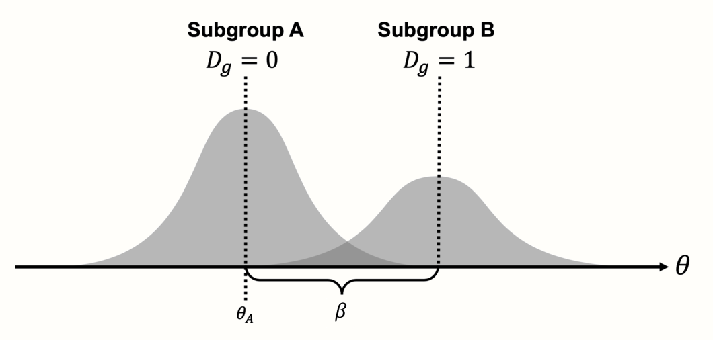
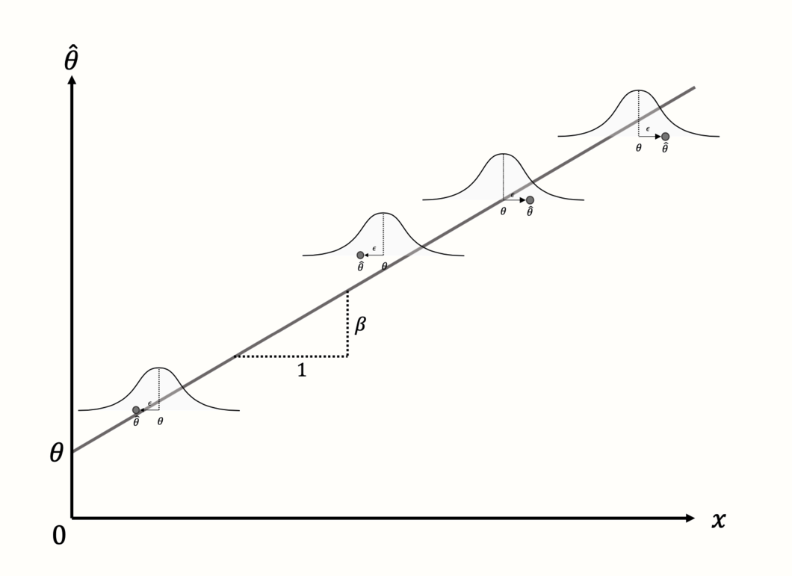
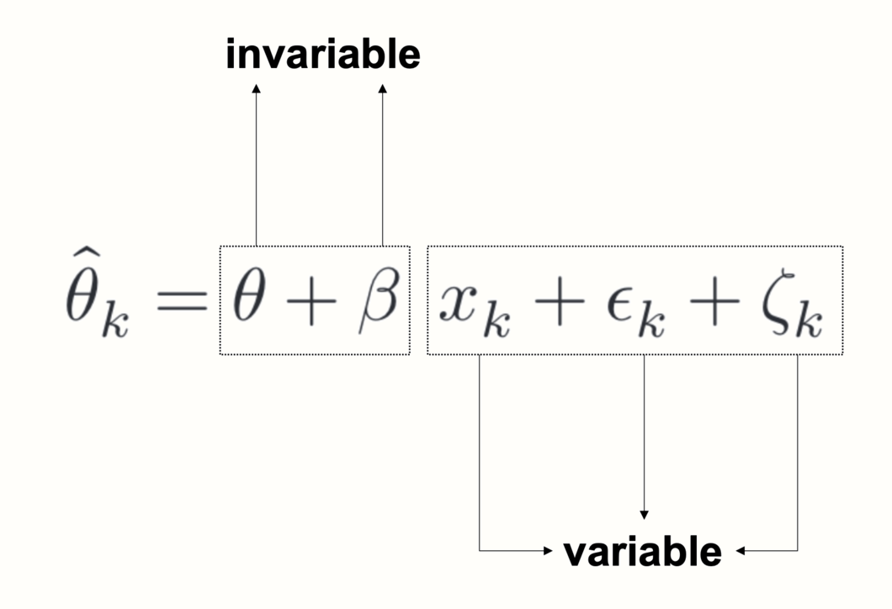
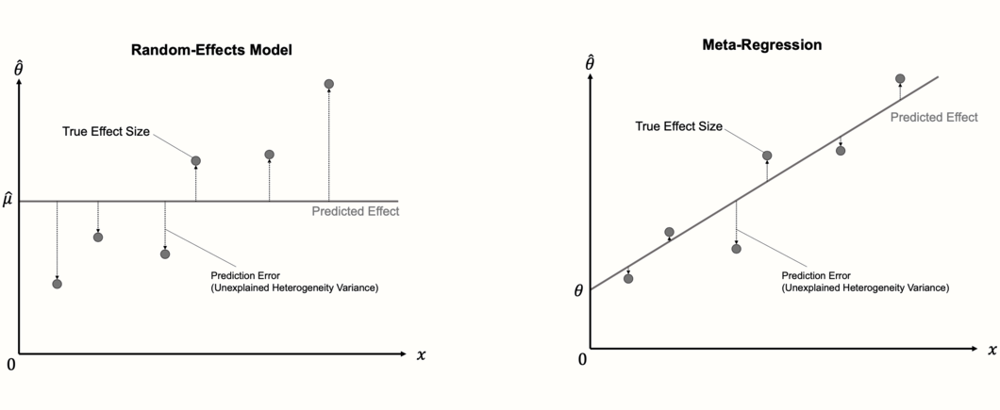
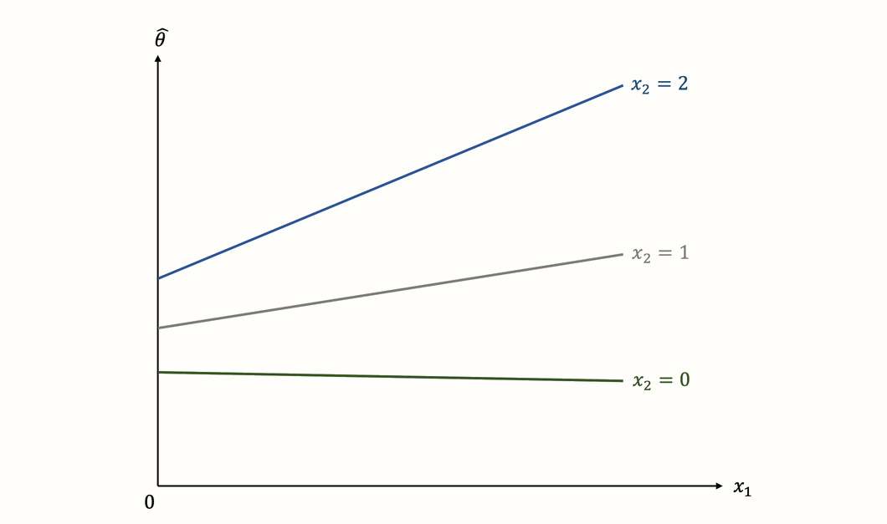
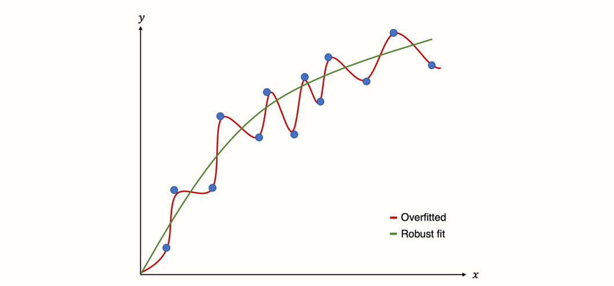

# Meta-Regression {#metareg}

---


<br></br>

\index{Subgroup Analysis}

<span class="firstcharacter">I</span>
n the last chapter, we added subgroup analyses as a new method to our meta-analytic "toolbox". As we learned, subgroup analyses shift the focus of our analyses away from finding one overall effect. Instead, they allow us to investigate patterns of heterogeneity in our data, and what causes them. 

\index{Meta-Regression}

We also mentioned that subgroup analyses are a special form of **meta-regression**. It is very likely that you have heard the term "regression" before. Regression analysis is one of the most common statistical methods and used in various disciplines. In its simplest form, a regression model tries to use the value of some variable $x$ to predict the value of another variable $y$. Usually, regression models are based on data comprising individual persons or specimens, for which both the value of $x$ and $y$ is measured.

\index{Sampling Error}

In meta-regression, this logic is applied to **entire studies**. The variable $x$ represents characteristics of studies, for example the year in which it was conducted. Based on this information, a meta-regression model tries to predict $y$, the study's effect size. The fact that effect sizes are used as predicted variables, however, adds some complexity. 

In Chapter \@ref(what-is-es), we already learned that observed effect sizes $\hat\theta$ can be more or less **precise** estimators of the study's true effect, depending on their standard error. In "normal" meta-analyses, we take this into account by giving studies a smaller or higher weight. In meta-regression, we also have to make sure that the model pays more attention to studies with a lower sampling error, since we can assume that their estimates are closer to the "truth".

\index{Mixed-Effects Model}

Meta-regression achieves this by assuming a **mixed-effects model**. This model accounts for the fact that observed studies deviate from the true overall effect due to sampling error and between-study heterogeneity. More importantly, however, it also uses one or more variables $x$ to predict differences in the true effect sizes. We already mentioned in the last chapter that subgroup analysis is also based on a mixed-effects model. In this chapter, we will delve a little deeper, and discuss why subgroup analysis and meta-regression are inherently related.

Meta-regression, although it has its own limitations, can be a very powerful tool in meta-analyses. It is also very versatile: **multiple meta-regression**, for example, allows us to include not only one, but several predictor variables, along with their interaction. In the second part of this chapter, we will therefore also have a look at multiple meta-regression, and how we can conduct one using _R_.

<br></br>

## The Meta-Regression Model {#the-metareg-model}

---

In the past, you may have already performed a regression using primary study data, where participants are the unit of analysis. In meta-analyses, the individual data of each participant is usually not available, and we can only resort to aggregated results. This is why we have to perform meta-regression with predictors on a **study level**. 

It also means that, while we conduct analyses on samples much larger than usual for primary studies, it is still possible that we do not have enough data points for a meta-regression to be useful. In Chapter \@ref(limits-subgroup), we already covered that subgroup analyses often make no sense when  $K<$ 10. Borenstein and colleagues [-@borenstein2011introduction, chapter 20] mention that this guideline may also be applied to meta-regression models, but that it should not be seen as an iron-clad rule.

In a conventional regression, we want to estimate the value $y_i$ of person $i$ using a **predictor** (or **covariate**) $x_i$ with a regression coefficient $\beta$. A standard regression equation, therefore, looks like this:

\begin{equation}
\hat{y_i} = \beta_0 + \beta_1x_i
(\#eq:mr1)
\end{equation}

In meta-regression, the variable $y$ we want to predict is the observed effect size $\hat\theta_k$ of study $k$. The formula for a **meta-regression** looks similar to the one of a normal regression model:

\begin{equation}
\hat\theta_k = \theta + \beta x_{k} + \epsilon_k+\zeta_k
(\#eq:mr2)
\end{equation}

Note that this formula contains two extra terms, $\epsilon_k$ and $\zeta_k$. The same terms can also be found in the equation for the random-effects-model (Chapter \@ref(rem)), and signify two types of independent errors. The first one, $\epsilon_k$, is the sampling error through which the effect size of a study deviates from its true effect. 

The second error, $\zeta_k$, denotes that even the true effect size of the study is only sampled from an overarching distribution of effect sizes. This means that between-study heterogeneity exists in our data, which is captured by the heterogeneity variance $\tau^2$.

\index{Random-Effects Model}
\index{Fixed-Effect Model}
\index{Mixed-Effects Model}

Since the equation above includes a **fixed** effect (the $\beta$ coefficient) as well as a **random** effect ($\zeta_k$), the model used in meta-regression is often called a **mixed-effects model**. Conceptually, this model is identical to the mixed-effects model we described in Chapter \@ref(comparing-the-subgroup-effects), where we explained how subgroup analyses work.

<br></br>

### Meta-Regression With a Categorical Predictor

---

\index{Dummy Variable}

Indeed, as mentioned before, subgroup analysis is nothing else than a meta-regression with a categorical predictor. Such categorical variables can be included through **dummy-coding**, e.g.:


\begin{equation}
  D_g=\begin{cases}
    0: & \text{Subgroup A}\\
    1: & \text{Subgroup B.}
  \end{cases}
  (\#eq:mr3)
\end{equation}


To specify a subgroup analysis in the form of a meta-regression, we simply have to replace the covariate $x_k$ with $D_g$:

\vspace{2mm}

\begin{equation}
\hat\theta_k = \theta + \beta D_g +\epsilon_k+\zeta_k.
(\#eq:mr4)
\end{equation}

\vspace{2mm}

To understand this formula, we have to read it from the left to the right. The goal of the meta-regression model, like every statistical model, is to explain how the observed data was generated. In our case, this is the observed effect size $\hat\theta_k$ of some study $k$ in our meta-analysis. The formula above works like a recipe, telling us which ingredients are needed to produce the observed effect. 

First, we take $\theta$, which serves as the **intercept** in our regression model. The value of $\theta$ is identical with the true overall effect size of subgroup A. To see why this is the case, we need to look at the next "ingredient", the term $\beta D_g$. The value of $\beta$ in this term represents the effect size difference $\theta_{\Delta}$ between subgroup A and subgroup B. The value of $\beta$ is multiplied with $D_g$, which can be either 0 or 1, depending on whether the study is part of subgroup A ($D_g = 0$) or subgroup B ($D_g = 1$). 

Because multiplying with zero gives zero, the $\beta D_g$ term completely falls out of the equation when we are dealing with a study in subgroup A. When $D_g=1$, on the other hand, we multiply by 1, meaning that $\beta$ remains in the equation and is added to $\theta$, which provides us with the overall effect size in subgroup B. Essentially, the dummy predictor is a way to integrate **two** formulas into **one**. We can easily see this when we write down the formula individually for each subgroup:

\vspace{2mm}

\begin{equation}
  D_g=\begin{cases}
    0: & \text{$\hat\theta_k = \theta_A + \epsilon_k+\zeta_k$}\\
    1: & \text{$\hat\theta_k = \theta_A + \theta_{\Delta} +\epsilon_k+\zeta_k$}
  \end{cases}
  (\#eq:mr5)
\end{equation}

\vspace{2mm}

Written this way, it becomes clearer that our formula actually contains two models, one for subgroup A, and one for subgroup B. The main difference between the models is that the effect of the second subgroup is "shifted" up or down, depending on the value of $\beta$ (which we denote as $\theta_{\Delta}$ in the formula above).

```{r subgroups2, message = F, out.width = '70%', echo = F, fig.align='center', fig.cap='Meta-regression with a categorical predictor (subgroup analysis).'}
library(OpenImageR)

```

This should make it clear that subgroup analyses work just like a normal regression: they use some variable $x$ to predict the value of $y$, which, in our case, is the effect size of a study. The special thing is that $\beta x_k$ is not continuous--it is a fixed value we add to the prediction, depending on whether a study belongs to a certain subgroup or not. This fixed value of $\beta$ is the estimated difference in effect sizes between two subgroups.


<br></br>

### Meta-Regression With a Continuous Predictor {#metareg-continuous}

---

\index{Weight}

When people speak of a "meta-regression", however, they usually think of models in which a **continuous** variable was used as the predictor. This brings us back the generic meta-regression formula shown in equation 8.2. Here, the regression terms we discussed before are also used, but they serve a slightly different purpose. The term $\theta$ again stands for the intercept, but now represents the predicted effect size when $x = 0$. 

To the intercept, the term $\beta x_k$ is added. This part produces a **regression slope**: the continuous variable $x$ is multiplied with the **regression weight** $\beta$, thus lowering or elevating the predicted effect for different values of the covariate. 

The aim of the meta-regression model is to find values of $\theta$ and $\beta$ which minimize the difference between the **predicted** effect size, and the **true** effect size of studies (see Figure \@ref(fig:subgroups3)).

```{r subgroups3, message = F, out.width = '70%', echo = F, fig.align='center', fig.cap='Meta-regression with a continuous predictor and four studies.'}
library(OpenImageR)

```


Looking closely at the meta-regression formula, we see that it contains two types of terms. Some terms include a subscript $k$, while others do not. A subscript $k$ indicates that a value **varies** from study to study. When a term does not include a subscript $k$, this means that it stays the same for all studies.

```{r, message = F, out.width = '45%', echo = F, fig.align='center'}
library(OpenImageR)

```

In a meta-regression, both $\theta$ and $\beta$ are invariable, or fixed. This tells us something important about what a meta-regression does: based on the variation in a predictor variable and the observed effects, it tries to "distill" a **fixed pattern** underlying our data, in the form of a **regression line**. If the meta-regression model fits the data well, the estimated parameters $\theta$ and $\beta$ can be used to predict the effect size of a study the model has **never seen before** (provided we know $x$). 

Taking into account both the sampling error $\epsilon_k$ and between-study heterogeneity $\zeta_k$, meta-regression thus tries to find a model that **generalizes** well; not only to the observed effect sizes but to the "universe" of all possible studies of interest.


<br></br>

### Assessing the Model Fit {#metareg-model-fit}

---

An important detail about meta-regression models is that they can be seen as an extension of the "normal" random-effects model we use to pool effect sizes. The random-effects model is nothing but a meta-regression model **without a slope term**. Since it contains no slope, the random-effects model simply predicts the **same value** for each study: the estimate of the pooled effect size $\mu$, which is equivalent to the intercept.

\index{Ordinary Least Squares (OLS)}
\index{Weighted Least Squares (WLS)}

In the first step, the calculation of a meta-regression therefore closely resembles the one of a random-effects meta-analysis, in that the between-study heterogeneity $\tau^2$ is estimated using one of the methods we described in Chapter \@ref(tau-estimators) (e.g. the DerSimonian-Laird or REML method). In the next step, the fixed weights $\theta$ and $\beta$ are estimated. Normal linear regression models use the **ordinary least squares** (OLS) method to find the regression line that fits the data best. In meta-regression, a modified method called **weighted least squares** (WLS) is used, which makes sure that studies with a smaller standard error are given a higher weight. 

Once the optimal solution is found, we can check if the newly added regression term explains parts of the effect size heterogeneity. If the meta-regression model fits the data well, the true effect sizes should deviate less from the regression line compared to the pooled effect $\hat\mu$. If this is the case, the predictor $x$ **explains** some of the heterogeneity variance in our meta-analysis.

```{r, message = F, out.width = '100%', echo = F, fig.align='center'}
library(OpenImageR)

```

The fit of the meta-regression model can therefore be assessed by checking how much of the heterogeneity variance it explains. The predictors included in the mixed-effects model should minimize the amount of the **residual**, or unexplained, heterogeneity variance, which we denote with $\tau^2_{\text{unexplained}}$. 

In regression analyses, the $R^2$ index is commonly used to quantify the percentage of variation explained by the model. An analogous index, $R^2_{*}$, can also be calculated for meta-regression. We add an asterisk here to indicate that the $R^2$ in meta-regression is slightly different to the one used in conventional regressions, because we deal with **true effect sizes** instead of observed data points. The formula for $R^2_*$ looks like this:

\begin{equation}
R^2_* = 1- \frac{\hat\tau^2_{\text{unexplained}}}{\hat\tau^2_{\text{(total)}}}
(\#eq:mr6)
\end{equation}

$R^2_*$ uses the amount of residual heterogeneity variance that even the meta-regression slope cannot explain, and puts it in relation to the total heterogeneity that we initially found in our meta-analysis. Subtracting this fraction from 1 leaves us with the percentage of between-study heterogeneity explained by the predictor. 

There is also another way to formulate $R^2_*$. We can say that it expresses how much the mixed-effects model has **reduced** the heterogeneity variance compared to the initial random-effects pooling model, in percent. This results in the following formula:

\begin{equation}
R^2_* =  \frac{\hat\tau^2_{\text{REM}}-\hat\tau^2_{\text{MEM}}}{\hat\tau^2_{\text{REM}}}
(\#eq:mr7)
\end{equation}

In this formula, $\hat\tau^2_{\text{REM}}$ represents the amount of between-study heterogeneity found in the random-effects pooling model, and $\hat\tau^2_{\text{MEM}}$ represents the (residual) variance in the mixed-effects meta-regression model (i.e. the "prediction error" with respect to the true effect sizes).

\index{Wald-Type Test}

Usually, we are not only interested in the amount of heterogeneity explained by the regression model, but also if the regression weight of our predictor $x$ is significant. If this is the case, we can be quite confident that $x$ has an influence on the effect sizes of studies. Both in conventional and meta-regression, the significance of a regression weight is commonly assessed through a **Wald-type** test. This involves calculating the test statistic $z$, by dividing the estimate of $\beta$ through its standard error:

\begin{equation}
z = \frac{\hat\beta}{SE_{\hat\beta}}
(\#eq:mr8)
\end{equation}

Under the null hypothesis that $\beta = 0$, this $z$-statistic follows a standard normal distribution. This allows us to calculate a corresponding $p$-value, which determines if the predictor is significant or not.

However, a test based on the $z$-statistic is not the only way to assess the significance of predictors. Like in normal meta-analysis models, we can also use the Knapp-Hartung adjustment, which results in a test statistic based on the $t$-distribution (see Chapter \@ref(knapp-hartung)). As we learned previously, it is often advisable to use the Knapp-Hartung method, because it reduces the risk of false positives.

<br></br>

## Meta-Regression in _R_ {#metareg-R}

---

The **{meta}** package contains a function called `metareg`, which allows us to conduct a meta-regression. The `metareg` function only requires a **{meta}** meta-analysis object and the name of a covariate as input.

In this example, we will use our `m.gen` meta-analysis object again, which is based on the `ThirdWave` data set (see Chapter \@ref(pre-calculated-es)). Using meta-regression, we want to examine if the **publication year** of a study can be used to predict its effect size. By default, the `ThirdWave` data set does not contain a variable in which the publication year is stored, so we have to create a new `numeric` variable which contains this information. We simply concatenate the publication years of all studies, in the same order in which they appear in the `ThirdWave` data set. We save this variable under the name `year`^[The publication years we use in this example are made up, and only used for illustration purposes.].

```{r}

year <- c(2014, 1998, 2010, 1999, 2005, 2014, 
          2019, 2010, 1982, 2020, 1978, 2001,
          2018, 2002, 2009, 2011, 2011, 2013)
```

Now, we have all the information we need to run a meta-regression. In the `metareg` function, we specify the name of our meta-analysis object `m.gen` as the first argument, and the name of our predictor, `year`, as the second argument. We give the results the name `m.gen.reg`.


```{r}
m.gen.reg <- metareg(m.gen, ~year)

```

Now, let us have a look at the results:

```{r, eval=F}
m.gen.reg
```

```
## Mixed-Effects Model (k = 18; tau^2 estimator: REML)
## 
## tau^2 (estimated amount of residual heterogeneity):     0.019 (SE = 0.023)
## tau (square root of estimated tau^2 value):             0.1371
## I^2 (residual heterogeneity / unaccounted variability): 29.26%
## H^2 (unaccounted variability / sampling variability):   1.41
## R^2 (amount of heterogeneity accounted for):            77.08%
## 
## Test for Residual Heterogeneity:
## QE(df = 16) = 27.8273, p-val = 0.0332
## 
## Test of Moderators (coefficient 2):
## F(df1 = 1, df2 = 16) = 9.3755, p-val = 0.0075
## 
## Model Results:
## 
##         estimate     se   tval   pval    ci.lb    ci.ub 
## intrcpt   -36.15  11.98  -3.01  0.008  -61.551  -10.758  ** 
## year        0.01   0.00   3.06  0.007    0.005    0.031  ** 
## 
## ---
## Signif. codes:  0 ‘***’ 0.001 ‘**’ 0.01 ‘*’ 0.05 ‘.’ 0.1 ‘ ’ 1
```

\index{I$^2$, Higgins \& Thompson's}

Let us go through what we can see here. In the first line, the output tells us that a mixed-effects model has been fitted to the data, just as intended. The next few lines provide details on the amount of heterogeneity explained by the model. We see that the estimate of the residual heterogeneity variance, the variance that is not explained by the predictor, is $\hat\tau^2_{\text{unexplained}}=$ 0.019. 

The output also provides us with an $I^2$ equivalent, which tells us that after inclusion of the predictor, 29.26% of the variability in our data can be attributed to the remaining between-study heterogeneity. In the normal random-effects meta-analysis model, we found that the $I^2$ heterogeneity was 63%, which means that the predictor was able to "explain away" a substantial amount of the differences in true effect sizes. 

In the last line, we see the value of $R^2_*$, which in our example is 77%. This means that 77% of the difference in true effect sizes can be explained by the publication year, a value that is quite substantial.

The next section contains a `Test for Residual Heterogeneity`, which is essentially the $Q$-test we already got to know previously (see Chapter \@ref(cochran-q)). Now, however, we test if the heterogeneity not explained by the predictor is significant. We see that this is the case, with $p$ = 0.03. However, we know the limitations of the $Q$-test (Chapter \@ref(cochran-q)), and should therefore not rely too heavily on this result.

The next part shows the `Test of Moderators`. We see that this test is also significant ($p$ = 0.0075). This means that our predictor, the publication year, does indeed influence the studies' effect size.

The last section provides more details on the estimated regression coefficients. The first line shows the results for the intercept (`intrcpt`). This is the expected effect size (in our case: Hedges' $g$) when our predictor publication year is zero. In our example, this represents a scenario which is, arguably, a little contrived: it shows the predicted effect of a study conducted in the year 0, which is $\hat{g}=$ -36.15. This serves as yet another reminder that good statistical models do not have to be a perfect representation of reality; they just have to be **useful**. 

The coefficient we are primarily interested in is the one in the second row. We see that the model's estimate of the regression weight for `year` is 0.01. This means that for every additional year, the effect size $g$ of a study is expected to rise by 0.01. Therefore, we can say that the effect sizes of studies have increased over time. The 95% confidence interval ranges from 0.005 to 0.3, showing that the effect is significant. 

Importantly, we are also presented with the corresponding $t$-statistic for each regression coefficient (`tval`). This tells us that the Knapp-Hartung method was used to calculate the confidence interval and $p$-value. Since we also used this adjustment in our initial meta-analysis model, `metareg` automatically used it again here. Otherwise, $z$ values and Wald-type confidence intervals would have been provided.

\index{Bubble Plot}

The **{meta}** package allows us to visualize a meta-regression using the `bubble` function. This creates a **bubble plot**, which shows the estimated regression slope, as well as the effect size of each study. To indicate the weight of a study, the bubbles have different sizes, with a greater size representing a higher weight. 

To produce a bubble plot, we only have to plug our meta-regression object into the `bubble` function. Because we also want study labels to be displayed, we set `studlab` to `TRUE`. 

```{r, fig.width=8, fig.height=7, out.width="60%", fig.align="center", eval=F}
bubble(m.gen.reg, studlab = TRUE)
```


```{r bubble, fig.width=8, fig.height=7, out.width="60%", fig.align="center", echo=F}
par(bg="#FFFEFA")
bubble(m.gen.reg, studlab = TRUE)
```

\index{Risk of Bias}

For the sake of completeness, we can also try to repeat our subgroup analysis from the previous chapter (Chapter \@ref(subgroup-R)), but this time within a meta-regression framework. This means that we use the risk of bias assessment as a categorical predictor. Since the variable `RiskOfBias` is already included in the `ThirdWave` data set, we do not have to save this information in an additional object. It suffices to simply run the `metareg` function again, but this time, we use `RiskOfBias` as the second function argument.

```{r, eval=F}
metareg(m.gen, RiskOfBias)
```

```
## [...]
## R^2 (amount of heterogeneity accounted for):            15.66%
## 
## Test for Residual Heterogeneity:
## QE(df = 16) = 39.3084, p-val = 0.0010
## 
## Test of Moderators (coefficient 2):
## F(df1 = 1, df2 = 16) = 2.5066, p-val = 0.1329
## 
## Model Results:
## 
##               estimate    se   tval    pval  ci.lb ci.ub 
## intrcpt           0.76  0.15   5.00  0.0001   0.44  1.09  *** 
## RiskOfBiaslow    -0.29  0.18  -1.58  0.1329  -0.69  0.10      
## [...]

```

In the output, we see that the value of $R^2_*$, with 15.66%, is considerably smaller than the one of `year`. Consistent with our previous results, we see that the risk of bias variable is not a significant effect size predictor ($p$ = 0.13). 

Under `Model Results`, we see that `metareg` has automatically transformed `RiskOfBias` into a dummy variable. The estimate of the intercept, which represents the pooled effect of the "high risk" subgroup, is $g$=0.76. The estimate of the regression coefficient representing studies with a **low** risk of bias is -0.29. 

To get the effect size for this subgroup, we have to add the regression weight to the intercept, which results in $g=$ 0.76 - 0.29 $\approx$ 0.47. These results are identical to the ones of a subgroup analysis which assumes a common estimate of $\tau^2$. 

<br></br>

## Multiple Meta-Regression {#multiple-metareg}

---

\index{Risk of Bias}

Previously, we only considered the scenario in which we use **one** predictor $\beta x_k$ in our meta-regression model. In the example, we checked if the effect size of a study depends on the year it was published. But now, suppose that reported effect sizes also depend on the **prestige** of the scientific journal in which the study was published. We think that it might be possible that studies in journals with a high reputation report higher effects. This could be because prestigious journals are more selective and mostly publish studies with "ground-breaking" findings.

On the other hand, it is also plausible that journals with a good reputation generally publish studies of a **higher quality**. Maybe it is just the better study quality that is associated with higher effect sizes. So, to check if journal reputation is indeed associated with higher effects, we have to make sure that this relationship is not **confounded** by the fact that prestigious journals are more likely to publish high-quality evidence. This means we have to **control** for study quality when examining the relationship between journal prestige and effect size.

This, and many other research questions, can be dealt with using **multiple meta-regression**. In multiple meta-regression, we use several predictors instead of just one to explain variation in effects. To allow for multiple predictors, we need to modify our previous meta-regression formula (see Equation 8.2), so that it looks like this:

\begin{equation}
\hat \theta_k = \theta + \beta_1x_{1k} + ... + \beta_nx_{nk} + \epsilon_k + \zeta_k
(\#eq:mr10)
\end{equation}

This formula tells us that we can add $n-1$ more predictors $x$ to our meta-regression model, thus turning it into a multiple meta-regression. The three dots in the formula symbolize that, in theory, we can add as many predictors as desired. In reality, however, things are usually more tricky. In the following, we will discuss a few important pitfalls in multiple meta-regression, and how we can build models that are robust and trustworthy. But first, let us cover another important feature of multiple meta-regression, **interactions**.

<br></br>

### Interactions {#interact}

---

\index{Interaction (Regression)}

So far, we only considered the case where we have multiple predictor variables $x_1, x_2, \dots x_n$ in our model, which are added together along with their regression weights $\beta$. Multiple meta-regression models, however, are not only restricted to such **additive** relationships. They can also model predictor **interactions**. An interaction means that the **relationship** between one predictor (e.g. $x_1$) and the estimated effect size **changes** for different values of another covariate (e.g. $x_2$).

Imagine that we want to model two predictors and how they are associated with effect sizes: the publication year ($x_1$) and the quality ($x_2$) of a study. The study quality is coded like this:

\begin{equation}
  x_2=\begin{cases}
    0: & \text{low}\\
    1: & \text{moderate}\\
    2: & \text{high.}
  \end{cases}
  (\#eq:mr11)
\end{equation}

When we assume that there is no interaction between publication year and study quality, we can build a meta-regression model by giving both $x_1$ and $x_2$ a regression weight $\beta$, and **adding** the terms together in our formula:

\begin{equation}
\hat \theta_k = \theta + \beta_1x_{1k} + \beta_2x_{2k} + \epsilon_k + \zeta_k
(\#eq:mr12)
\end{equation}

But what if the relationship between $x_1$ and $x_2$ is more complex? It is possible, like in our previous example, that a more recent publication year is positively associated with higher effects. But not all studies must follow this trend. Maybe the increase is most pronounced among high-quality studies, while the results of low-quality studies stayed largely the same over time. We can visualize this assumed relationship between effect size ($\hat\theta_k$), publication year ($x_1$) and study quality ($x_2$) in the following way:


```{r metareg2, message = F, out.width = '60%', echo = F, fig.align='center'}
library(OpenImageR)

```
 
The graph shows a classic example of an interaction. We see that the steepness of the regression slope depends on the value of another predictor. While the slope for high-quality studies is very steep, indicating a strong relationship between year and effect, the situation is different for low-quality studies. The regression line in this subgroup is virtually horizontal, indicating that the publication year has no, or even a slightly negative effect on the results. 

This example shows one of the strengths of interactions: they allow us to examine if the influence of a predictor is the same across all studies, or if it is moderated by another characteristic. 

To assess interactions via meta-regression, we need to add an **interaction term** to the model. In our example, this can be achieved by adding a third regression weight $\beta_3$, which captures the interaction $x_{1k}x_{2k}$ we want to test in our model. This gives the following formula:

\begin{equation}
\hat \theta_k = \theta + \beta_1x_{1k} + \beta_2x_{2k} + \beta_3x_{1k}x_{2k}+ \epsilon_k + \zeta_k
(\#eq:mr13)
\end{equation}

Although linear multiple meta-regression models only consist of these simple building blocks, they lend themselves to various applications. Before we start fitting multiple meta-regressions using _R_, however, we should first consider their limitations and pitfalls. 


<br></br>

### Common Pitfalls in Multiple Meta-Regression {#limits-metareg}

---

Multiple meta-regression, while very useful when applied properly, comes with certain caveats. Some argue that (multiple) meta-regression is often improperly used and interpreted in practice, leading to a low validity of the results [@higgins2004controlling]. There are some points we have to keep in mind when fitting multiple meta-regression models, which we describe in the following.

<br></br>

#### Overfitting: Seeing A Signal Where There Is None

---

\index{Overfitting}

To better understand the risks of (multiple) meta-regression models, we have to understand the concept of **overfitting**. Overfitting occurs when we build a statistical model that fits the data **too** closely. In essence, this means that we build a statistical model which can predict the data **at hand** very well, but performs badly at predicting **future** data. 

This happens when our model assumes that some variation in our data stems from a true "signal", when in fact we only capture random noise [@iniesta2016machine]. As a result, the model produces **false positive** results: it sees relationships where there are none.


```{r overfitting, message = F, out.width = '80%', echo = F, fig.align='center', fig.cap="Predictions of an overfitted model versus model with a robust fit."}
library(OpenImageR)

```

\index{Ordinary Least Squares (OLS)}
\index{Maximum Likelihood}

For model fitting, regression utilizes **optimization** techniques such as ordinary least squares or maximum likelihood estimation. As we learned, meta-regression uses a weighted version of ordinary least squares (see Chapter \@ref(metareg-model-fit)), and is, therefore, no exception. 

This "greedy" optimization, however, means that regression approaches can be prone to overfitting [@gigerenzer2004mindless]. Unfortunately, the risk of building a non-robust model is even higher once we go from conventional to meta-regression. There are several reasons for this [@higgins2004controlling]:

1. In meta-regression, the number of data points is usually small, since we can only use the aggregated information of the included studies.

2. Because meta-analysis aims to be a comprehensive overview of all available evidence, we have no additional data on which we can "test" how well our regression model can predict unseen data.

3. In meta-regression, we have to deal with the potential presence of effect size heterogeneity. Imagine a case in which we have two studies with different effect sizes and non-overlapping confidence intervals. Every variable which has different values for the two studies might then be a potential explanation for the effect size difference. Yet, it seems clear that most of these explanations will be spurious.

4. Meta-regression in general, and multiple meta-regression in particular, makes it very easy to "play around" with predictors. We can test numerous meta-regression models, include more predictors or remove them, in an attempt to explain the heterogeneity in our data. Such an approach is tempting and often found in practice, because meta-analysts want to find an explanation why effect sizes differ [@higgins2002statistical]. However, such behavior has been shown to massively increase the risk of spurious findings, because we can change parts of our model indefinitely until we find a significant model, which is then very likely to be overfitted (i.e. it mostly models statistical noise).

Some guidelines have been proposed to avoid an excessive false positive rate when building meta-regression models:

\index{Parsimony}
\index{Analysis Plan}

* Minimize the number of investigated predictors. In multiple meta-regression, this translates to the concept of **parsimony**: when evaluating the fit of a meta-regression model, we prefer models which achieve a **good** fit with **less** predictors. Estimators such as the Akaike and Bayesian information criterion can help with such decisions. We will show how to interpret these metrics in our hands-on example.

* Predictor selection should be based on predefined, scientifically relevant questions we want to answer in our meta-analysis. It is crucial to already define in the analysis report (Chapter \@ref(analysis-plan)) which predictor (combination) will be included in the meta-regression model. It is not the end of the world if we decide to run a meta-regression that is not mentioned in our analysis plan. In this case, however, we should be honest and mention in our meta-analysis report that we decided to fit the model **after** seeing the data.

* When the number of studies is low (which is very likely to be the case), and we want to compute the significance of a predictor, we should use the Knapp-Hartung adjustment to obtain more robust estimates.

\index{Permutation}

* We can use **permutation** to assess the robustness of our model in resampled data. We will describe the details of this method later.

<br></br>

#### Multi-Collinearity

---

\index{Multi-Collinearity}
\index{Overfitting}

**Multi-collinearity** means that one or more predictors in our regression model can be predicted by another model predictor with high accuracy [@mansfiled1982detecting]. This typically means that we have two or more independent variables in our model which are highly correlated. 

Most of the dangers of multi-collinearity are associated with the problem of overfitting. High collinearity can cause our predictor coefficient estimates $\hat\beta$ to behave erratically, and change considerably with minor changes in our data. It also limits the size of the explained variance by the model, in our case $R^2_*$.

Multi-collinearity in meta-regression is common [@berlin1994advantages]. Although multiple regression can handle low degrees of collinearity, we should check and, if necessary, control for very highly correlated predictors. There is no consolidated yes-no-rule to determine the presence of multi-collinearity. 

A crude, but often effective way is to check for very high predictor correlations (i.e. $r \geq$ 0.8) before fitting the model. Multi-collinearity can then be reduced by either (1) removing one of the close-to-redundant predictors, or (2) trying to combine the predictors into one single variable.


<br></br>

#### Model Fitting Approaches

---

When building a multiple meta-regression model, there are different approaches to select and include predictors. Here, we discuss the most important ones, along with their strengths and weaknesses:

* **Forced entry**. In forced entry methods, all relevant predictors are forced into the regression model simultaneously. For most functions in _R_, this is the default setting. Although this is a generally recommended procedure, keep in mind that all predictors to use via forced entry should still be based on a predefined, theory-led decision.


* **Hierarchical**. Hierarchical multiple regression means including predictors into our regression model step-wise, based on a clearly defined scientific rationale. First, only predictors which have been associated with effect size differences in previous research are included in the order of their importance. After this step, novel predictors can be added to explore if these variables explain heterogeneity which has not yet been captured by the known predictors.

\index{Step-Wise Regression}

* **Step-wise**. Step-wise entry means that variables/predictors are added to the model one after another. At first glance, this sounds a lot like hierarchical regression, but there is a crucial difference: step-wise regression methods select predictors based on a **statistical criterion**. In a procedure called **forward selection**, the variable explaining the largest amount of variability in the data is used as the first predictor. This process is then repeated for the remaining variables, each time selecting the variable which explains most of the residual unexplained variability in the data. There is also a procedure called **backward selection**, in which all variables are used as predictors in the model first, and then removed successively based on a predefined statistical criterion. There is an extensive literature discouraging the usage of step-wise methods [@chatfield1995model; @whittingham2006we]. If we recall the common pitfalls of multiple regression models we presented above, it becomes clear that these methods have high risk of producing overfitted models with spurious findings. Nevertheless, step-wise methods are still frequently used in practice, which makes it important to know that these procedures exist. If we use stepwise methods ourselves, however, it is advised to primarily do so in an exploratory fashion and to keep the limitations of this procedure in mind.

\index{Multi-Model Inference}

* **Multi-model inference**. Multi-model methods differ from step-wise approaches because they do not try to successively build the one "best" model explaining most of the variance. Instead, in this technique, **all** possible predictor combinations are modeled. This means that several different meta-regressions are created, and subsequently evaluated. This enables a full examination of all possible predictor combinations, and how they perform. A common finding is that there are many different specifications which lead to a good model fit. The estimated coefficients of predictors can then be pooled across all fitted models to infer how important certain variables are overall.

<br></br>

### Multiple Meta-Regression in _R_ {#multiple-metareg-R}

---

\index{meta Package}
\index{metafor Package}

After all this input, it is high time that we start fitting our first multiple meta-regression using _R_. The following examples will be the first ones in which we will not use the **{meta}** package. Instead, we will have a look at **{metafor}** [@urviecht]. This package provides a vast array of advanced functionality for meta-analysis, along with a great documentation^[In fact, to conduct a meta-regression, **{meta}** functions also use the **{metafor}** package internally.]. So, to begin, make sure you have **{metafor}** installed, and loaded from the library.

```{r, message=F}
library(metafor)
```

In our hands-on illustration, we will use the `MVRegressionData` data set. This is a "toy" data set, which we simulated for illustrative purposes.

\index{dmetar Package}

```{block, type='boxdmetar'}
**The "MVRegressionData" Data Set**

\vspace{2mm}

The `MVRegressionData` data set is included directly in the **{dmetar}** package. If you have installed **{dmetar}**, and loaded it from your library, running `data(MVRegressionData)` automatically saves the data set in your _R_ environment. The data set is then ready to be used. If you do not have **{dmetar}** installed, you can download the data set as an _.rda_ file from the [Internet](https://www.protectlab.org/meta-analysis-in-r/data/MVRegressionData.rda), save it in your working directory, and then click on it in your R Studio window to import it. 

```


First, let us have a look at the structure of the data frame:

```{r, message=F}
library(tidyverse)
library(dmetar)
data(MVRegressionData)

glimpse(MVRegressionData)
```

We see that there are six variables in our data set. The `yi` and `sei` columns store the effect size and standard error of a particular study. These columns correspond with the `TE` and `seTE` columns we used before. We have named the variables this way because this is the standard notation that **{metafor}** uses: `yi` represents the observed effect size $y_i$ we want to predict in our (meta-)regression, while `sei` represents $SE_i$, the standard error of study $i$. 

The other four variables are predictors to be used in the meta-regression. First, we have `reputation`, which is the (mean-centered) **impact factor** of the journal the study was published in. Impact factors quantify how often articles in a journal are cited, which we use as a proxy for the journal's prestige. 

The other variables are `quality`, the quality of the study rated from 0 to 10, `pubyear`, the (centered and scaled) publication year, and `continent`, the continent on which the study was performed. All of these variables are continuous, except for `continent`. The latter is a categorical variable with two levels: Europe and North America. 


<br></br>

#### Checking for Multi-Collinearity

---

\index{Multi-Collinearity}

As we mentioned before, we have to check for multi-collinearity of our predictors to make sure that the meta-regression coefficient estimates are robust. A quick way to check for high correlations is to calculate a **intercorrelation matrix** for all continuous variables. This can be done using the `cor` function:

```{r}
MVRegressionData[,c("reputation", "quality", "pubyear")] %>% cor()
```

\index{PerformanceAnalytics Package}

The **{PerformanceAnalytics}** package [@perfanalytics] contains a function called `chart.Correlation`, which we can use to visualize the correlation matrix. We have to install the `PerformanceAnalytics` package first, and then use this code:

```{r, eval = F}
library(PerformanceAnalytics)

MVRegressionData[,c("reputation", "quality", "pubyear")] %>% 
  chart.Correlation()
```

```{r, echo = F, message=F, fig.align="center", fig.width=5, fig.height=5, out.width="60%"}

library(PerformanceAnalytics)

MVRegressionData[,c("reputation", "quality", "pubyear")] %>% 
  chart.Correlation()
```

We see that our variables are indeed correlated, but probably not to a degree that would warrant excluding one of them.

<br></br>

#### Fitting a Multiple Meta-Regression Model

---

\index{metafor Package}

Now, we can fit our first meta-regression model using **{metafor}**. Previously, we wanted to explore if a high journal reputation predicts higher effect sizes, or if this is just an artifact caused by the fact that studies in prestigious journals have a higher quality. 

Let us assume we already know very well, for example from previous research, that the quality of a study is predictive of its effect size. If this is the case, it makes sense to perform a hierarchical regression: we first include our known predictor `quality`, and then check if `reputation` explains heterogeneity beyond that. When this is true, we can say that journal reputation is indeed associated with higher effects, even if we **control** for the fact that studies in prestigious journals also tend to have a higher quality.

To do this, we use the `rma` function in **{metafor}**. This function runs a random-effects meta-analysis, which is extended to mixed-effects meta-regression models when moderators are added. The `rma` function can take countless arguments, which we can examine by running `?rma` in the _R_ console. Usually, however, we only need to specify a few of them:

* **`yi`**.	The column in our data frame in which the effect size of each study is stored.

* **`sei`**.	The column in our data frame in which the standard error of the effect size of each study is stored.

* **`data`**.	The name of the data frame containing all our meta-analysis data.

* **`method`**.	The $\tau^2$ estimator we want to use. The codes we can use for this argument are identical to the ones in **{meta}** (e.g. `"REML"` for restricted maximum likelihood). It is advisable to use `"ML"`, because this allows one to compare different meta-regression models later on.

* **`mods`**.	This parameter defines our meta-regression model. First, we specify our model with `~` (a tilde). Then, we add the predictors we want to include, separating them with `+` (e.g. `variable1 + variable2`). Interactions between two variables are denoted by an asterisk (e.g. `variable1 * variable2`).

* **`test`**.	The test we want to apply for our regression coefficients. We can choose from `"z"` (default) and  `"knha"` (Knapp-Hartung method).

First, let us perform a meta-regression using only `quality` as a predictor. We save the results into an object called `m.qual`, and then inspect the output.

```{r, eval=F}
m.qual <- rma(yi = yi,
              sei = sei,
              data = MVRegressionData,
              method = "ML",
              mods = ~ quality,
              test = "knha")

m.qual
```

```
## Mixed-Effects Model (k = 36; tau^2 estimator: ML)
## 
## tau^2 (estimated amount of residual heterogeneity):     0.066 (SE = 0.023)
## tau (square root of estimated tau^2 value):             0.2583
## I^2 (residual heterogeneity / unaccounted variability): 60.04%
## H^2 (unaccounted variability / sampling variability):   2.50
## R^2 (amount of heterogeneity accounted for):            7.37%
## 
## Test for Residual Heterogeneity:
## QE(df = 34) = 88.6130, p-val < .0001
## 
## Test of Moderators (coefficient 2):
## F(df1 = 1, df2 = 34) = 3.5330, p-val = 0.0688
## 
## Model Results:
## 
##          estimate      se    tval    pval    ci.lb   ci.ub 
## intrcpt    0.3429  0.1354  2.5318  0.0161   0.0677  0.6181  * 
## quality    0.0356  0.0189  1.8796  0.0688  -0.0029  0.0740  . 
## 
## ---
## Signif. codes:  0 ‘***’ 0.001 ‘**’ 0.01 ‘*’ 0.05 ‘.’ 0.1 ‘ ’ 1
```


In the output, we can inspect the results for our predictor `quality` under `Model Results`. We see that the regression weight is not significant ($p=$ 0.069), although it is significant on a trend level ($p<$ 0.1). In total, our model explains $R^2_*=$ 7.37% of the heterogeneity. 

Now, let us see what happens when we include `reputation` as a predictor. We add `+ reputation` to our input to `mods` and this time, we save the output as `m.qual.rep`.

```{r, eval=F}
m.qual.rep <- rma(yi = yi, 
                  sei = sei, 
                  data = MVRegressionData, 
                  method = "ML", 
                  mods = ~ quality + reputation, 
                  test = "knha")

m.qual.rep
```

```
## Mixed-Effects Model (k = 36; tau^2 estimator: ML)
## 
## tau^2 (estimated amount of residual heterogeneity):     0.0238 (SE = 0.01)
## tau (square root of estimated tau^2 value):             0.1543
## I^2 (residual heterogeneity / unaccounted variability): 34.62%
## H^2 (unaccounted variability / sampling variability):   1.53
## R^2 (amount of heterogeneity accounted for):            66.95%
## 
## Test for Residual Heterogeneity:
## QE(df = 33) = 58.3042, p-val = 0.0042
## 
## Test of Moderators (coefficients 2:3):
## F(df1 = 2, df2 = 33) = 12.2476, p-val = 0.0001
## 
## Model Results:
## 
##             estimate      se    tval    pval    ci.lb   ci.ub 
## intrcpt       0.5005  0.1090  4.5927  <.0001   0.2788  0.7222  *** 
## quality       0.0110  0.0151  0.7312  0.4698  -0.0197  0.0417      
## reputation    0.0343  0.0075  4.5435  <.0001   0.0189  0.0496  *** 
## 
## ---
## Signif. codes:  0 ‘***’ 0.001 ‘**’ 0.01 ‘*’ 0.05 ‘.’ 0.1 ‘ ’ 1
```

We see that now, a new line appears in the `Model Results` section, displaying the results for our `reputation` predictor. The model estimated the regression weight to be 0.034, which is highly significant ($p$ < 0.001). 

We also see that the meta-regression model as a whole explains a significant amount of heterogeneity, $R^2_*$ = 66.95% to be precise. This means that journal reputation is associated with higher effect sizes, even when controlling for study quality.

\index{Analysis of Variance}
\index{Maximum Likelihood}
\index{Restricted Maximum Likelihood Estimator}

But does our second model indeed provide a better fit than our first one? To assess this, we can use the `anova` function, providing it with the two models we want to compare. Note that this is only feasible because we fitted both mixed-effects models using maximum likelihood (`"ML"`) instead of restricted maximum likelihood (`"REML"`).


```{r, eval=F}
anova(m.qual, m.qual.rep)
```

```
##         df   AIC   BIC  AICc logLik   LRT   pval    QE tau^2    R^2 
## Full     4 19.86 26.19 21.15  -5.93              58.30  0.03          
## Reduced  3 36.98 41.73 37.73 -15.49 19.11 <.0001 88.61  0.06 48.32% 
```


This function performs a model test and provides us with several statistics to assess if `m.qual.rep` has a better fit than `m.qual`. We compare our full model, `m.qual.rep`, which includes both `quality` and `reputation`, with the reduced model, which only includes `quality`.

\index{Likelihood Ratio Test}

The `anova` function performs a **likelihood ratio test**, the results of which we can see in the `LRT` column. The test is highly significant ($\chi^2_1=$ 19.11, $p<$ 0.001), which means that that our full model indeed provides a better fit. 

\index{Akaike's Information Criterion}

Another important statistic is reported in the `AICc` column. This provides us with Akaike's information criterion (AIC), corrected for small samples. As we mentioned before, AICc penalizes complex models with more predictors to avoid overfitting. 

It is important to note that lower values of AIC mean that a model performs better. In our output, we see that the full model (AICc = 21.15) has a better AIC value than our reduced model (AICc = 37.73), despite having more parameters. All of this suggests that our multiple regression model does indeed provide a good fit to our data.


<br></br>

#### Modeling Interactions

---

\index{Interaction (Regression)}

Let us say we want to model an interaction with our additional predictors `pubyear` (publication year) and `continent`. We assume that the relationship between publication year and effect size differs for European and North American studies. To model this assumption using the `rma` function, we have to connect our predictors with `*` in the `mods` parameter. Because we do not want to compare the models directly using the `anova` function, we use the `"REML"` (restricted maximum likelihood) $\tau^2$ estimator this time. 

To facilitate the interpretation, we add factor labels to the `continent` variable in `MVRegressionData` before running the model. 

```{r, eval=F}
# Add factor labels to 'continent'
# 0 = Europe
# 1 = North America
levels(MVRegressionData$continent) = c("Europe", "North America")

# Fit the meta-regression model
m.qual.rep.int <- rma(yi = yi, 
                      sei = sei, 
                      data = MVRegressionData, 
                      method = "REML", 
                      mods = ~ pubyear * continent, 
                      test = "knha")

m.qual.rep.int
```

```
## Mixed-Effects Model (k = 36; tau^2 estimator: REML)
## 
## tau^2 (estimated amount of residual heterogeneity):     0 (SE = 0.01)
## tau (square root of estimated tau^2 value):             0
## I^2 (residual heterogeneity / unaccounted variability): 0.00%
## H^2 (unaccounted variability / sampling variability):   1.00
## R^2 (amount of heterogeneity accounted for):            100.00%
## 
## Test for Residual Heterogeneity:
## QE(df = 32) = 24.8408, p-val = 0.8124
## 
## Test of Moderators (coefficients 2:4):
## F(df1 = 3, df2 = 32) = 28.7778, p-val < .0001
## 
## Model Results:
## 
##                       estimate    se  tval    pval  ci.lb ci.ub 
## intrcpt                    0.38  0.04  9.24  <.0001   0.30  0.47  *** 
## pubyear                    0.16  0.08  2.01  0.0520  -0.00  0.33    . 
## continentNorth America     0.39  0.06  6.05  <.0001   0.26  0.53  *** 
## pubyear:continent          0.63  0.12  4.97  <.0001   0.37  0.89  *** 
##    North America
## [...]
```

The last line, `pubyear:continentNorth America`, contains the coefficient for our interaction term. Note that **{metafor}** automatically includes not only the interaction term, but also both `pubyear` and `continent` as "normal" lower-order predictors (as one should do). 

Also note that, since `continent` is a factor, `rma` detected that this is a dummy-coded predictor, and used our category "Europe" as the $D_g$ = 0 baseline against which the North America category is compared. We see that our interaction term has a positive coefficient (0.63), and is highly significant ($p<$ 0.001). 

This indicates that there is an increase in effect sizes in recent years, but that it is stronger in studies conducted in North America. We also see that the model we fitted explains $R^2_*$ = 100% of our heterogeneity. 

This is because our data was simulated for illustrative purposes. In practice, you will hardly ever explain all of the heterogeneity in your data--in fact, one should rather be concerned if one finds such results in real-life data, as this might mean that we have overfitted our model.


<br></br>

#### Permutation Test

---

\index{Permutation}

**Permutation** is a mathematical operation in which we take a set containing numbers or objects, and iteratively draw elements from this set to put them in a sequential order. When we already have an ordered set of numbers, this equals a process in which we rearrange, or **shuffle**, the order of our data. 

As an example, imagine we have a set $S$ containing three numbers: $S=\{1,2,3 \}$. One possible permutation of this set is $(2,1,3)$; another is $(3,2,1)$. We see that the permuted results both contain all three numbers from before, but in a different order.

Permutation can also be used to perform **permutation tests**, which is a specific type of resampling method. Broadly speaking, resampling methods are used to validate the robustness of a statistical model by providing it with (slightly) different data sampled from the same source or generative process [@good2013permutation, chapter 3.1]. This is a way to better assess if the coefficients in our model indeed capture a true pattern underlying our data; or if we overfitted our model, thereby falsely assuming patterns in our data when they are in fact statistical noise.

Permutation tests do not require that we have a spare “test” data set on which we can evaluate how our meta-regression performs in predicting unseen effect sizes. For this reason, among others, permutation tests have been recommended to assess the robustness of our meta-regression models [@higgins2004controlling].

We will not go too much into the details of how a permutation test is performed for meta-regression models. The most important part is that we re-calculate the $p$-values of our model based on the test statistics obtained across all possible, or many randomly selected, permutations of our original data set. 

The crucial indicator here is **how often** the test statistic we obtain from in our permuted data is **equal to or greater** than our original test statistic. For example, if our test statistic is greater or equal to the original one in 50 of 1000 permuted data sets, we get a $p$-value of $p$ = 0.05.

To perform a permutation test on our meta-regression model, we can use **{metafor}**'s in-built `permutest` function. As an example, we recalculate the results of the `m.qual.rep` model we fitted before. We only have to provide the `permutest` function with the `rma` object. Be aware that the permutation test is computationally expensive, especially for large data sets. This means that the function might need some time to run.

```{r, eval=F}
permutest(m.qual.rep)
```

```
## Test of Moderators (coefficients 2:3):
## F(df1 = 2, df2 = 33) = 12.7844, p-val* = 0.0010
## 
## Model Results:
## 
##             estimate      se    tval   pval*    ci.lb   ci.ub 
## intrcpt       0.4964  0.1096  4.5316  0.2240   0.2736  0.7193      
## quality       0.0130  0.0152  0.8531  0.3640  -0.0179  0.0438      
## reputation    0.0350  0.0076  4.5964  0.0010   0.0195  0.0505  *** 
## 
## ---
## Signif. codes:  0 ‘***’ 0.001 ‘**’ 0.01 ‘*’ 0.05 ‘.’ 0.1 ‘ ’ 1
```


We again see our familiar output including the results for all predictors. Looking at the `pval*` column, we see that our $p$-value for the reputation predictor has decreased from $p$ < 0.001 to $p_*$ = 0.001. This, however, is still highly significant, indicating that the effect of the predictor is robust. 

It has been recommended to always use this permutation test before reporting the results of a meta-regression model [@higgins2004controlling].

```{block, type='boximportant'}
**Permutation Tests in Small Data Sets**

\vspace{4mm}

Please note that when the number of studies $K$ included in our model is small, conventionally used thresholds for statistical significance (i.e. $p$ < 0.05) cannot be reached. 

For meta-regression models, a permutation test using `permutest` will only be able to reach statistical significance if $K$ > 4 [@viechtbauer2015comparison]. 

```


<br></br>

#### Multi-Model Inference {#multimodel-inference}

---

\index{Multi-Model Inference}

We already mentioned that one can also try to model all possible predictor combinations in a procedure called **multi-model inference**. This allows to examine which possible predictor combination provides the best fit, and which predictors are the most important ones overall. To perform multi-model inference, we can use the `multimodel.inference` function^[For more information on this topic, you can also consult an informative [vignette](https://www.metafor-project.org/doku.php/tips:model_selection_with_glmulti_and_mumin), written by Wolfgang Viechtbauer as part of the **{metafor}** documentation.].

```{block, type='boxdmetar'}
**The "multimodel.inference" Function**

\vspace{4mm}

The `multimodel.inference` function is included in the **{dmetar}**  package. Once **{dmetar}** is installed and loaded on your computer, the function is ready to be used. If you did **not** install **{dmetar}**, follow these instructions:

\vspace{2mm}

1. Access the source code of the function [online](https://raw.githubusercontent.com/MathiasHarrer/dmetar/master/R/mreg.multimodel.inference.R). 
2. Let _R_ "learn" the function by copying and pasting the source code in its entirety into the console (bottom left pane of R Studio), and then hit "Enter".
3. Make sure that the **{metafor}**, **{ggplot2}** and **{MuMIn}** package is installed and loaded.

```


In the function, the following parameters need to be specified:

* **`TE`**. The effect size of each study. Must be supplied as the name of the effect size column in the data set, in quotation marks (e.g. `TE = "effectsize"`).

* **`seTE`**.	The standard error of the effect sizes. Must be supplied as the name of the standard error column in the data set (also in quotation marks, e.g. `seTE = "se"`).

* **`data`**.	A data frame containing the effect size, standard error and meta-regression predictor(s).

* **`predictors`**.	A concatenated array of characters specifying the predictors to be used for multi-model inference. Names of the predictors must be identical to the column names of the data frame supplied to `data`.

* **`method`**.	Meta-analysis model to use for pooling effect sizes. `"FE"` is used for the fixed-effect model. Different random-effect models are available, for example `"DL"`, `"SJ"`, `"ML"`, or `"REML"`. If `"FE"` is used, the `test` argument is automatically set to `"z"`, as the Knapp-Hartung method is not meant to be used with fixed-effect models. Default is `"REML"`.

* **`test`**.	Method to use for computing test statistics and confidence intervals. Default is `"knha"`, which uses the Knapp-Hartung adjustment. Conventional Wald-type tests are calculated by setting this argument to `"z"`. 

* **`eval.criterion`**.	Evaluation criterion to apply to the fitted models. Can be either `"AICc"` (default; small sample-corrected Akaike's information criterion), `"AIC"` (Akaike’s information criterion) or `"BIC"` (Bayesian information criterion).

* **`interaction`**.	When set to `FALSE` (default), no interactions between predictors are considered. Setting this parameter to `TRUE` means that all interactions are modeled.

Now, let us perform multi-model inference using all predictors in the `MVRegressionData` data set, but **without** interactions. Be aware that running the `multimodel.inference` function can take some time, especially if the number of predictors is large.

```{r, eval=F}
multimodel.inference(TE = "yi", 
                     seTE = "sei",
                     data = MVRegressionData,
                     predictors = c("pubyear", "quality", 
                                    "reputation", "continent"),
                     interaction = FALSE)
```

```
## Multimodel Inference: Final Results
## --------------------------
##  - Number of fitted models: 16
##  - Full formula: ~ pubyear + quality + reputation + continent
##  - Coefficient significance test: knha
##  - Interactions modeled: no
##  - Evaluation criterion: AICc 
## 
## 
## Best 5 Models
## --------------------------
## [...]
##    (Intrc) cntnn  pubyr   qulty   rpttn df logLik AICc delta weight
## 12       +     + 0.3533         0.02160  5  2.981  6.0  0.00  0.536
## 16       +     + 0.4028 0.02210 0.01754  6  4.071  6.8  0.72  0.375
## 8        +     + 0.4948 0.03574          5  0.646 10.7  4.67  0.052
## 11       +       0.2957         0.02725  4 -1.750 12.8  6.75  0.018
## 15       +       0.3547 0.02666 0.02296  5 -0.395 12.8  6.75  0.018
## Models ranked by AICc(x) 
## 
## 
## Multimodel Inference Coefficients
## --------------------------
##                          Estimate  Std. Error   z value  Pr(>|z|)
## intrcpt                0.38614661 0.106983583 3.6094006 0.0003069
## continentNorth America 0.24743836 0.083113174 2.9771256 0.0029096
## pubyear                0.37816796 0.083045572 4.5537402 0.0000053
## reputation             0.01899347 0.007420427 2.5596198 0.0104787
## quality                0.01060060 0.014321158 0.7402055 0.4591753
## 
## 
## Predictor Importance
## --------------------------
##        model importance
## 1    pubyear  0.9988339
## 2  continent  0.9621839
## 3 reputation  0.9428750
## 4    quality  0.4432826
```

$$~$$


```{r, echo=F, fig.height=2, fig.width=6, out.width="70%", fig.align="center"}
load("data/mmi.rda")
mmi$predictor.importance.plot + geom_hline(aes(yintercept = 0.8), size = 2, color = "black")
```

\index{Akaike's Information Criterion}

There is a lot to see here, so let us go through the output step by step.

* **`Multimodel Inference: Final Results`**. This part of the output provides us with details about the fitted models. We see that the total number of $2^4 = 16$ possible models have been fitted. We also see that the function used the corrected AIC (`aicc`) to compare the models.

* **`Best 5 Models`**. Displayed here are the five models with the lowest AICc, sorted from low to high. Predictors are shown in the columns of the table, and models in the rows. A number (weight) or `+` sign (for categorical predictors) indicates that a predictor/interaction term was used in the model, while empty cells indicate that the predictor was omitted. We see that `TE ~ 1 + continent + pubyear + reputation` shows the best fit (AICc = 6.0). But other predictor combinations come very close to this value. Thus, it is hard to say which model is really the "best" model. However, all top five models contain the predictor `pubyear`, suggesting that this variable might be particularly important.

* **`Multimodel Inference Coefficients`**. Here, we can see the coefficients of all predictors, aggregated over all models in which they appear. We see that the coefficient estimate is largest for `pubyear` ($\hat\beta$ = 0.378), which corroborates our finding from before. Approximate confidence intervals can be obtained by subtracting and adding the value stored in `Std.Error`, multiplied by 1.96, from/to `Estimate`.

* **Model-averaged predictor importance plot**. In the plot, the averaged importance of each predictor across all models is displayed. We again see that `pubyear` is the most important predictor, followed by `reputation`, `continent`, and `quality`.

```{block, type='boxinfo'}
**Limitations of Multi-Model Inference**

\vspace{2mm}

This example should make clear that multi-model inference can be a useful way to obtain a comprehensive look at which predictors are important for predicting differences in effect sizes. 

\vspace{4mm}

Despite avoiding some of the problems of step-wise regression methods, please note that this method should still be seen as **exploratory**, and may be used when we have no prior knowledge on how our predictors are related to effect sizes in the research field we analyze. 

If you decide to build a meta-regression model based on the results of multi-model inference, it is crucial to report this. This is because such a model is not based on an **a priori** hypothesis, but was built based on statistical properties in our sample.

```

$$\tag*{$\blacksquare$}$$

<br></br>

## Questions & Answers

```{block, type='boxinfo'}
**Test your knowledge!**

\vspace{4mm}

1. What is the difference between a conventional regression analysis as used in primary studies, and meta-regression?

\vspace{-2mm}

2. Subgroup analyses and meta-regression are closely related. How can the meta-regression formula be adapted for subgroup data?

\vspace{-2mm}

3. Which method is used in meta-regression to give individual studies a differing weight?

\vspace{-2mm}

4. What characteristics mark a meta-regression model that fits our data well? Which index can be used to examine this?

\vspace{-2mm}

5. When we calculate a subgroup analysis using meta-regression techniques, do we assume a separate or common value of $\tau^2$ in the subgroups?

\vspace{-2mm}

6. What are the limitations and pitfalls of (multiple) meta-regression?

\vspace{-2mm}

7. Name two methods that can be used to improve the robustness of (multiple) meta-regression models, and why they are helpful.


\vspace{4mm}


**Answers to these questions are listed in [Appendix A](#qanda8) at the end of this book.**

```

<br></br>
 
## Summary

* In meta-regression, we adapt conventional regression techniques to study-level data. Subgroup analyses can be seen as a special case of meta-regression with categorical predictors and a common estimate of $\tau^2$.

* The aim of a meta-regression model is to **explain** (parts of) the true effect size differences in our data (i.e. the between-study heterogeneity variance $\tau^2$). When a model fits the data well, the deviation of true effects from the regression line should be smaller than their initial deviation from the pooled effect. When this is the case, the unexplained, or residual, heterogeneity will be small. This is captured by the $R^2_*$ index, which tells us the percentage of heterogeneity variation explained by our model.

* In **multiple meta-regression**, two or more predictors are used in the same meta-regression model. It is also possible to test if the predictions of one variable change for different values of another, by introducing interaction terms.

* Although (multiple) meta-regression is very versatile, it is **not** without limitations. Multiple meta-regression makes it very easy to **overfit** models, meaning that random noise instead of true relationships are modeled. Multi-collinearity of predictors may also pose a threat to the validity of our model.

* There are several approaches to ensure that our meta-regression model is robust. We can, for example, only fit models based on a **predefined** theoretical rationale, or use permutation tests. Multi-model inference can be used as an exploratory approach. This method can point us to potentially important predictors and can be used to derive hypotheses to be tested in future research. 


