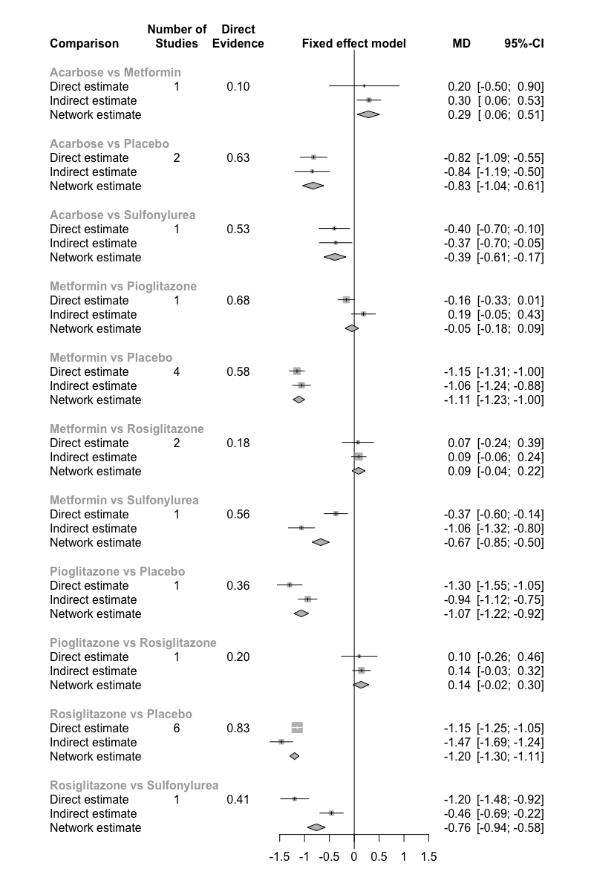
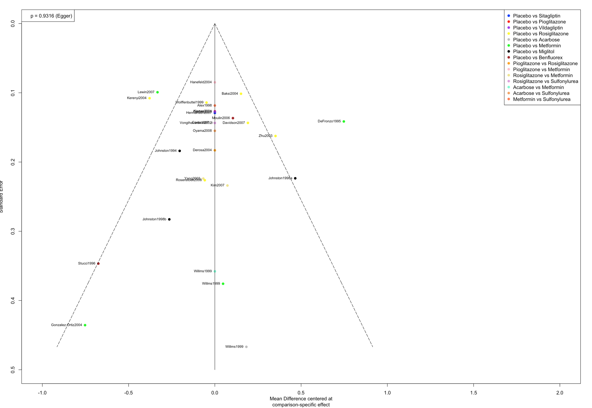
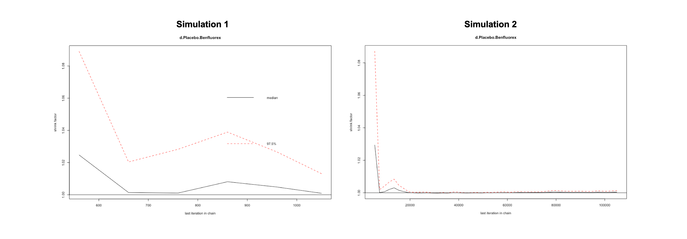
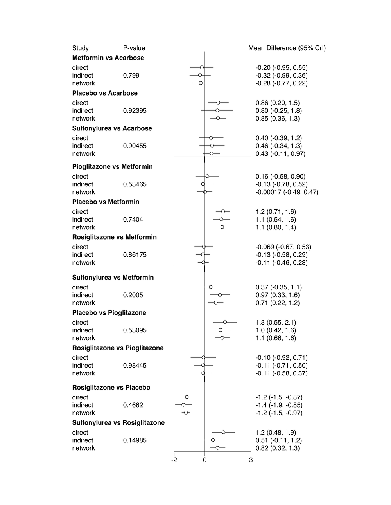
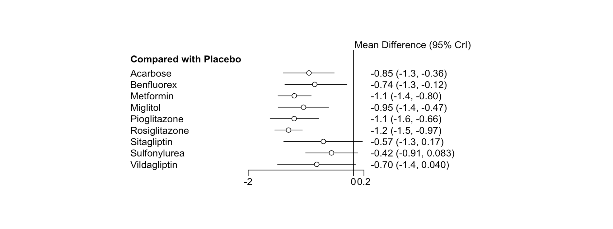

# (PART) Advanced Topics {-}

# Network Meta-Analysis


Often when performing a meta-analysis on the effectiveness of certain interventions, we are less interested in the question if **one particular intervention is effective** (e.g., because it is quite well established that the intervention is efficacious), but weather **one intervention is more or less effective than another type of intervention for some condition or population**. Yet, once we are interested in **head-to-head** comparisons between two treatments, we often face the problem that **only very few, if any, randomized controlled trials have compared the effects of two interventions directly**. This makes it very hard, if not impossible to conduct conventional meta-analyses to answer questions on the comparative effects of two or more interventions for one indication or outcome (e.g., different types of psychotherapy for major depression).

Nevertheless, while direct comparisons between two or more interventions may not exist, it is often the case that such interventions were evaluated in separate randomized controlled trials using the same **control group** (e.g., waitlist control groups, or placebos). This means that we do have **indirect comparisons** of the effects of different interventions, because they were compared to the same control condition. **Multiple-treatments meta-analysis (MTM)** is an extension of conventional meta-analysis which allows us to **incorporate such indirect comparisons**, and thus the simultaneous analysis of several interventions.

These meta-analysis methods are also referred to as **network meta-analyses** [@dias2013evidence] or **mixed-treatment comparison** meta-analyses [@van2012automating], because such methods allow for **multiple direct and indirect intervention comparisons to be integrated into our analysis**, which can be formalized as a **"network"** of comparisons. Network Meta-Analysis is a "hot" research topic, and in the last decade, its methodology has been increasingly picked up by applied researchers in the medical field [@schwarzer2015meta; @efthimiou2016getreal]. However, Network Meta-Analysis also comes with additional **challenges and potential pitfalls**, particularly in terms of heterogeneity or network **inconsistency** [@salanti2014evaluating; @schwarzer2015meta]. Therefore, it is very important to first discuss the core components and assumptions of network meta-analytical models before we proceed. The underpinnings of network meta-analysis can be a little abstract at times; we will therefore go through the essential parts in small steps to get a better understanding of the idea behind network meta-analysis models.


```{block,type='rmdinfo'}
**The idea behind network meta-analysis**

First, we have to understand what meta-analysts **mean** when they talk about a "network" of treatments. Let us first consider a simple **pairwise comparison** between two conditions. The example we present here is no different from the kind of data we discussed in [Chapter 4](#fixed), where we showed how to perform a conventional meta-analysis. Let us assume we have a randomized controlled trial $i$, which **compared the effect of one treatment A** (e.g., Cognitive Behavioral Therapy for depression) to **another condition B** (e.g., a waitlist control group). We can illustrate this comparison in a graphical way like this:


The form in which the treatment comparison is displayed here is called a **graph**. Graphs are structures used to model **how different objects relate to each other**, and there is an entire subfield of mathematics devoted to it: **Graph theory**. The graph has two core components. First, the two blue points (so-called **nodes**), which represent the **two conditions $A$ and $B$** in trial $i$. The second component is the **line** connecting the two nodes, which is called an **edge**. This edge represents how $A$ and $B$ relate to each other. In our case, the interpretation of this line is quite straightforward: we can describe the relationship between $A$ and $B$ as the **effect size** $\hat\theta_{i,A,B}$ we observe for the comparison between $A$ and $B$. This effect size can be expressed through different metrics, such as the **standardized mean difference (SMD)**, **Hedges' g**, **Odds Ratio**, **Incidence Rate Ratio**, and so forth, depending on the context. 

Now let us proceed by assuming that we also have **data of another study** $j$. In this trial, the condition $B$ (which we imagined to be a waitlist control group) was also included. But instead of using treatment $A$, like in the first study, this study **used another treatment $C$** (e.g., psychodynamic therapy), which was compared to $B$. We can add this information to our graph:


This creates our first small network. We can see now that we have **two effect size estimates** in this network: $\hat\theta_{i,A,B}$, comparing $A$ to $B$, and $\hat\theta_{j,C,B}$, the comparison between $C$ and $B$. Since we took both of these effect size estimates from **actual comparisons which were made in "real" randomized trials**, we call such information **direct evidence**. Thus, we can formalize these effect sizes as $\hat\theta_{B,A}^{direct}$ and $\hat\theta_{B,C}^{direct}$. Notice how $B$ comes first in this notation because we determine this condition to be our **reference condition**, since both effect size estimates contain this condition.

In this first graph, all nodes (conditions) are either **directly or indirectly connected**. The $B$ condition (our waitlist control group), is directly connected to all other nodes, i.e., it takes only one "step" on the graph to get from $B$ to all the other nodes $A$ and $C$: $B \rightarrow A, B \rightarrow C$. $A$ and $C$ both have only one direct connection, and they both connect to $B$: $A \rightarrow B$ and $C \rightarrow B$. However, there is an **indirect connection** between $A$ and $C$, where $B$ serves as the **link**, or **"brige"** between the two conditions: $A \rightarrow B \rightarrow C$. This indirect connection means that we have **indirect evidence** for the relationship between $A$ and $C$, which we can infer from the information the entire network provides us with:     


Using the information from our direct evidence, we can therefore calculate the **indirect evidence** $\hat\theta_{A,C}^{indirect}$, the effect size between **$A$ and $C$** (e.g., Cognitive-Behavioral Therapy and Psychodynamic Therapy) like this:


\begin{align}
\tag{1}
\hat\theta_{A,C}^{indirect} = \hat\theta_{B,A}^{direct} - \hat\theta_{B,C}^{direct}
\end{align}


This is a crucial component of network meta-analytical models. This equation effectively lets us calculate an **estimate of the effect size of a comparison, even if the two conditions were never directly compared in an RCT**. Network Meta-Analysis in general means that we can combine both direct and indirect evidence in one model to estimate the effect sizes resulting from several treatment comparisons. This also means that even if there is direct evidence for a specific comparison (e.g. $A-B$), we can also **add information from indirect evidence** to further "fortify" our model and make our effect sizes estimations **even more precise** (thus the name **mixed-treatment comparison meta-analysis**). The example we gave you here should illustrate the great strength of network meta-analytical models: 

* They allow us to pool **all available information** in a set of connected studies in one analysis. Imagine how we would usually deal in pairwise meta-analysis with trials comparing different treatments to, say, a placebo. We would have to pool each comparison (e.g. treatment $A$ compared to a placebo, treatment $B$ compared to a placebo, treatment $A$ compared to treatment $B$) in a seperate meta-analysis.
* They allow us to incorporate **indirect evidence** in a network, which we have to discard in conventional meta-analysis. Usually in pairwise meta-analysis, we can only pool direct evidence from comparisons which were actually conducted and reported in randomized controlled trials. 
* If all assumptions are met, and results are conclusive enough, network meta-analyses allow us to draw cogent conclusions concerning **which type of treatment may be more or less preferable** for a specific target population under study.

Of course all of this sounds intruiging, but there are some important limitations we have to consider here. First, we should look at how the **variance** of the indirect effect size estimate is calculated:

\begin{align}
\tag{2}
V_{A,C}^{indirect} = V_{B,A}^{direct} + V_{B,C}^{direct}
\end{align}

As you can see, to calculate the variance of the indirect comparison, we actually **add up** the variance of the direct comparisons. This basically means that the effect size estimated from indirect evidence will always have a greater variance, and thus a lower precision than direct evidence [@diasbook]. This, of course, makes quite a lot of sense because we have a higher confidence in effect size estimates which were **actually observed** (because researchers actually performed a study using this comparison), and thus give it a higher weight, compared to effect size estimates derived from indirect evidence. 

Furthermore, an essential point is that equation $(1)$ only holds if a **core assumption of network meta-analysis** is met: the assumption of **transitivity**, or statistically speaking, **network consistency** [@efthimiou2016getreal]. We will explain what this means in the following, and why this assumption is important.  
```

```{block,type='rmdinfo'}
**Transitivity and Consistency**

Although network meta-analysis is certainly a valuable extension of the meta-analytical arsenal, the validity of this method has not remained uncontested. Most of the **criticism** of network meta-analysis revolves around, as you might have guessed, the **use of indirect evidence**, especially when direct evidence for a comparison is actually available [@edwards2009indirect; @ioannidis2006indirect]. The key issue addressed here is that while participants in a randomized controlled trial (which we use as direct evidence in network meta-analysis) are randomly allocated to one of the treatment conditions (e.g., $A$ and $B$), the **treatment conditions themselves** ($A, B, ...$) **were not randomly selected in the trials** included in our network [@edwards2009indirect]. This is of course quite logical, since we have not, for example, forced all researchers to determine which conditions they compare in their trial through, for example, a dice roll, before they were allowed to roll out their study. However, the fact that the selected treatment comparisons in our study pool will hardly ever follow a random pattern across trials does **not constitute a problem** for network meta-analytical models *per se* [@diasbook]. In fact, what is required for equations $(1)$ and $(2)$ to hold is the following: **the selection, or non-selection, of a specific comparison in a specific trial must be unrelated to the true (relative) effect size of that comparison** [@dias2013evidence]. This statement is very abstract, so let us elaborate on it a little.

This requirement is derived from the **transitivity assumption** of network meta-analyses. There is disagreement about whether this is an additional assumption of network meta-analysis, or simply an extension of the assumptions of standard pairwise meta-analysis; this disagreement may also be partly caused by an inconsistent usage of terms in the literature [@diasbook; @efthimiou2016getreal; @song2009methodological; @lu2009modeling]. The transitivity assumption's core tenet is that we can **combine direct evidence** (e.g. from the comparisons $A-B$ and $C-B$) to create indirect evidence about a related comparison (e.g. $A-C$), as we have already expressed in formula $(1)$ above  [@efthimiou2016getreal]. 

The assumption of transitivity also relates to, or is derived from, the **exchangeability assumption** we described in our [Chapter about the random-effects model](#random). This assumption presupposes that an effect size $\hat\theta_i$ of a comparison $i$ is randomly drawn from an "overarching" distribution of true effect sizes, the mean of which can be estimated. Translating this assumption to our scenario, we can think about **network meta-analytical models as consisting of a set of $K$ trials which each contain all possible $M$ treatment comparisons** (e.g. $A-B$,$A-C$,$B-C$, and so forth), but that **some of the treatment comparisons have been "deleted", and are thus "missing"" in some trials**; the reason for this of course being that studies in practice do not assess *all* possible treatment options for a specific condition, but only two or three [@diasbook]. The key assumption here is that the relative effect of a comparison, e.g. $A-B$ is *exchangeable* between trials, no matter if a trial actually assessed this comparison or if this comparison is "missing". The assumption of exchangeability thus basically means that the effect size $\hat\theta$ of a specific comparison (e.g. $A-B$) must stem from a random draw from the same overarching distribution of effect sizes, no matter if this effect size is derived through direct or indirect evidence. 

The assumption of transitivity may be violated when **covariates**, or **effect modifiers** (such as the age of the studied populations, or the treatment intensity) are not evenly distributed across trials reporting data on, for example, $A-B$ and $C-B$ comparisons [@song2009methodological]. Transitivity as such can not be tested statistically, but the risk for violating this assumption may be **attenuated by only including studies for which the population, methodology and studied target condition is as similar as possible** [@salanti2014evaluating].

The statistical manifestation of transitivity has been referred to as **consistency** [@efthimiou2016getreal; @cipriani2013conceptual]. Consistency means that the **direct evidence** in a network for the effect size between two treatments (e.g. $A$ and $B$) **does not differ from the indirect evidence calculated for that same comparison** [@schwarzer2015meta]:

$$\theta_{A,B}^{indirect} = \theta_{A,B}^{direct}$$

Several methods have been proposed to evaluate inconsistency in network meta-analysis models, including **net heat plots** [@krahn2013graphical] and **node splitting** [@dias2010checking]. We will describe these methods in further detail in the following two subchapters where we explain how to perform a network meta-analysis in R.
```

Above, we described the **basic theory and assumptions of network meta-analysis models**. We illustrated these properties using a simple network with three nodes and edges. In practice, however, the **number of treatments** we as meta-analysts want to include in a network meta-analysis **may be much higher**, resulting in much more **complex network**, which may look more like this:


However, with an increasing number of treatments $S$ in our network, the number of (direct and indirect) pairwise comparisons $C$ we have to estimate skyrockets [@diasbook]:


We therefore need a **computational model** which allows us to efficiently pool all available network data in a coherent and internally consistent manner. Several statistical approaches have been developed for network meta-analysis [@efthimiou2016getreal]. In the following subchapters, we will discuss two major approaches, a **frequentist** as well as a **bayesian hierarchical model**, and how they can be implemented in R.  

```{block,type='rmdinfo'}
**Which modeling approach should i use?**

The good message is that while network meta-analysis models may differ in their statistical approach, they should produce **the same results** when the sample size is large [@shim2019network], and none of them is more or less valid than the other. You can therefore safely choose one or the other approach, depending on which one you find **more intuitive**, or depending on the **functionality** of the package which implements it [@efthimiou2016getreal]. One asset of frequentist models is that this approach is very common, and used for most applications in the statistical world. This means that many people might understand the results this method produces more easily. The frequentist network meta-analysis package `netmeta`, which we will present in the following, however, does not yet provide a straightforward way to conduct meta-regression, while this is possible using the bayesian approach.

In practice, a useful strategy may also be to choose one approach as the main analysis, and then perform the other approach as a **sensitivity analysis** [e.g. @cipriani2018comparative]. This makes it possible to compare where the two methods come to the same conclusion (which may indicate that these specific results are robust), and where they diverge.
```


## Frequentist Network Meta-Analysis


In the following, we will describe how to **perform a network meta-analysis** using the `netmeta` package [@schwarzer2015meta; @rucker2015package]. This package allows to estimate network meta-analysis models within a **frequentist framework**, with its statistical approach derived from graph theoretical methods developed for electrical networks [@rucker2012network].

```{block,type='rmdinfo'}
**The frequentist interpretation of probability**

Frequentism is a common theoretical approach to interpret the probability of an event $E$. This approach defines the probability of $E$ in terms of how *frequently* $E$ occurs if we repeat some process (e.g., an experiment) many, many times [@aronow2019foundations].

Frequentist ideas are at the core of many statistical procedures quantitative researchers use on a day to day basis, such as **significance testing**, calculating **confidence intervals** or interpreting **p-values**.

```

### The Network Meta-Analysis Model

Let us now describe how the **network meta-analysis model** underlying the `netmeta` package is **formulated**. Let us assume that we have **collected effect size data** from $K$ trials. We can then check all our $K$ trials and then **count the total number of treatment comparisons** (e.g. some antidepressant vs. placebo) which are included in these trials. This number of pairwise comparisons is denoted by $m$. We then calculate the effect size $\hat\theta$ for each of the pairwise comparisons, and then put them together in a **vector**. You can think of a vector as an **object containing a collection of numbers**, like a `numeric` column in an R dataframe is basically a collection of numbers (see [Chapter 3.3](#manipulate)). In mathematical notation, vectors are usually **written in bold**. We therefore denote the vector containing all pairwise effect sizes $(\hat\theta_1, \hat\theta_2, ..., \hat\theta_m)$ as $\mathbf{\hat\theta}$, and the vector containing the respective standard errors as $\mathbf{s} = s_1, s_2, ..., s_m$. Our model formula then looks like this:

$$\mathbf{\hat\theta} = \mathbf{X}\mathbf{\theta}^{treatment} + \mathbf{\epsilon} $$
Using this equation, we can basically imagine that our effect size vector $\mathbf{\hat\theta}$ was **"generated" by the right side of the formula**, our model. The first part, $\mathbf{X}$, is the $m \times n$ **design matrix**, in which the columns represent the different treatments $n$, and the rows the comparisons between treatments, which are signified by $1$ and $-1$. The parameter $\mathbf{\epsilon}$ is a vector of sampling errors $\epsilon_k$, which are assumed to be randomly drawn from a gaussian normal distribution with mean 0 and variance $s_i^2$:

$$\epsilon_k \sim \mathcal{N}(0,s_i^2)$$
The really important part of the formula, and what we actually want to estimate, is the vector $\mathbf{\theta}^{treatment}$. This vector contains the **"real" effects of the $n$ treatments abstracted from the treatment comparisons we have in our network**, and in the end allows us to compare the effects of different treatments directly. 

To exemplify this [see @schwarzer2015meta], let us assume we have $K=5$ studies, each containing **one distinct treatment comparison**: $A-B$, $A-C$, $A-D$, $B-C$, and $B-D$. We then have a vector of (observed) treatment comparisons $\mathbf{\hat\theta} = (\hat\theta_{1,A,B}, \hat\theta_{2,A,C}, \hat\theta_{3,A,D}, \hat\theta_{4,B,C}, \hat\theta_{5,B,D})^\top$ and our vector containing the four (unknown) "true" effects for each treatment included in our network, $\mathbf{\theta}^{treatment} = (\theta_A, \theta_B, \theta_C, \theta_D)^\top$. If we **plug** these parameters into our **model formula**, we get the following equation:

$$\mathbf{\hat\theta} = \mathbf{X}\mathbf{\theta}^{treatment} + \mathbf{\epsilon}$$
\begin{align}
\left( \begin{array}{c}
\hat\theta_{1,A,B} \\
\hat\theta_{2,A,C} \\
\hat\theta_{3,A,D} \\
\hat\theta_{4,B,C} \\
\hat\theta_{5,B,D} \\
\end{array} \right)
=
\left( \begin{array}{cccc}
1 & -1 & 0 & 0 \\
1 & 0 & -1 & 0 \\
1 & 0 & 0 & -1 \\
0 & 1 & -1 & 0 \\
0 & 1 & 0 & -1 \\
\end{array} \right)

\left( \begin{array}{c}
\theta_{A} \\
\theta_{B} \\
\theta_{C} \\
\theta_{D} \\
\end{array} \right)
+
\left( \begin{array}{c}
\epsilon_{1} \\
\epsilon_{2} \\
\epsilon_{3} \\
\epsilon_{4} \\
\epsilon_{5} \\
\end{array} \right)
\end{align}

The **important part** to mention here is that in its current form, the model formula is problematic from a **mathematical point of view**. Right now, the model is **overparameterized**, meaning that too many parameters in our model have to be estimated based on the data we have. This has to do with the design matrix $\mathbf{X}$ not being of **full rank**. A matrix is not of full rank whenever the **rows** of the matrix are not all **independent**. Because we are dealing with a network of comparisons it is clear that not all comparisons (rows) will be independent from each other in our matrix; in our example, the row for comparison $B-C$ is a **linear combination** of comparisons $A-B$ and $A-C$, and thus not independent. The fact that the $\mathbf{X}$ matrix is not of full rank, however, means that it is **not invertible**, which makes it impossible to directly estimate $\mathbf{\theta}^{treatment}$ using a weighted least squares approach. While we have at best $n-1$ *independent* treatment comparisons, our model at the same time **has to estimate the "true" effect for each of the $n$ treatments** in $\mathbf{\theta}^{treatment}$. 

This is where the **graph theoretical approach** of the `netmeta` package comes in with a solution. We will spare you the mathematical details of this approach, particularly given that the `netmeta` package will do the heavy lifting for us anyway. Let us only mention that this approach involves contructing a so-called **Moore-Penrose pseudoinverse matrix** which then allows for calculating the fitted values of our network model using a weighted least squares approach. The procedure also takes care of **multiarm studies which contribute more than one pairwise comparison** (i.e., studies in which more than two treatments were compared with each other). Since such comparisons are correlated when coming from the same study (see Chapter 13.9), the standard errors of multiarm study comparisons are increased artificially. A [random-effects model](#random) can also be incorporated into this approach by adding the **estimated heterogeneity** $\hat\tau^2$ to the variance of each comparison $i$: $s^2_i + \hat\tau^2$. In the `netmeta` package, $\tau^2$  is estimated using an adaptation of the **DerSimonian-Laird** estimator [@jackson2013matrix]. Values of $I^2$ are also calculated, which represent the amount of **inconsistency** in our network. The model allows to calculate an equivalent of **Cochran's $Q$** (see Chapter 6), $Q_{total}$, measuring the heterogeneity in the network. This can be used to calculate an $I^2$ equivalent for our network model:

$$I^2 = max(\frac{Q_{total}-df}{Q_{total}}, 0)$$

Where the **degrees of freedom** in our network ($df$) are:

$$df = (\sum_{k=1}^Kp_k-1)-(n-1) $$
with $K$ being the number of studies, $p$ the number of arms in each study $k$, and $n$ the total number of treatments in our entire network.

### Performing a Network Meta-Analysis using the `netmeta` package

After all this statistical input, it is now time that we start working with the `netmeta` package. As always, we first **install the package** and then **load it into our library**. 

```{r,message=FALSE, eval=FALSE}
install.packages("netmeta")
library(netmeta)
```

```{r,message=FALSE, echo=FALSE}
library(netmeta)
```

#### Data Preprocessing & Exploration {#netmetadata}

For our first network meta-analysis, we will use an **original dataset** reported by Senn et al. [-@senn2013issues]. This dataset contains effect size data of randomized controlled trials comparing different medications for **diabetes**. The effect size of all comparisons denotes the **mean difference** (MD) in diabetic patients' **HbA1c value** at post-test. This value represents the concentration of glucose in the blood, which diabetic medication aims to decrease. We will use this dataset because it is already **preinstalled** in the `netmeta` package, with all columns labeled correctly. To work with the dataset, we only need to **load it into our global environment** using the `data()` function. The dataset is then available as `Senn2013`, which we then rename to `data` for our convenience. Here is how you do this:

```{r,message=FALSE}
data(Senn2013)
data <- Senn2013
```

Now, let us have a look at the `data`.

```{r,message=FALSE, echo=FALSE}
data
```

We see that the data has 28 rows, representing the treatment comparisons, and **seven columns**, some of which may already seem familiar to you if you have worked yourself through previous chapters. 

* The first column, **TE**, contains the **effect size** of each comparison, and **seTE** contains the respective **standard error**. In case you do not have precalculated effect size data for each comparison, you can first use the `metacont` ([Chapter 4.1.2](#fixed.raw)) or `metabin` function ([Chapter 4.3](#binary)), and then extract the calculated effect sizes from the meta-analysis object you created using the `$TE` and `$seTE` selector. Another, more flexible approach may be to use the **effect size calculators** we describe in [Chapter 13](#effectsizecalculator). 
* **treat1.long**, **treat2.long**, **treat1** and **treat2** represent the **two treatments being compared**. Variables **treat1** and **treat2** simply simply contain a shortened name of the original treatment name, and are thus redundant.
* The **studlab** column contains the **unique study label**, signifying in which study the specific treatment comparison was made. We can easily check if we have **multiarm studies** contributing more than one comparison by using the `summary()` function.

```{r,message=FALSE}
summary(data$studlab)
```

We see that all studies **only contribute one comparison**, except for `Willms1999`, which **contributes three**. For all later steps, it is essential that you (1) include the **studlab** column in your dataset, (2) each individual study gets a unique label/name in the column, and (3) studies which contribute 2+ comparisons are named exactly the same across comparisons. 

#### Fitting the Model

We can now proceed by fitting **our first network meta-analysis model** using the `netmeta` function. The function has many, many parameters, and the most important ones are described below.

```{r,echo=FALSE, warning=FALSE, message=FALSE}
library(knitr)
Code<-c("TE", "seTE", "treat1", "treat2", "studlab", "data", "sm", "comb.fixed", "comb.random", "reference.group", "tol.multiarm", "details.chkmultiarm", "sep.trts")
Description<-c("The name of the column in our dataset containing the effect sizes for each comparison", "The name of the column in our dataset containing the standard error of the effect size for each comparison", "The column in our dataset containing the name of the first treatment in a comparison", "The column in our dataset containing the name of the second treatment in a comparison", "The column in our dataset containing the name of the study a comparison was extracted from. Although this argument is per se optional, we recommend to always specify it, because this is the only way to let the function know if multiarm trials are part of our network", "The dataset containing all our network data", "The summary measure underlying our TE column. This can be specified as 'RD' (Risk Difference), 'RR' (Risk Ratio), 'OR' (Odds Ratio), 'HR' (hazard ratio), 'MD' (mean difference), 'SMD' (standardized mean difference), etc.", "Whether a fixed-effects network meta-analysis should be conducted (TRUE/FALSE)", "Whether a random-effects network meta-analysis should be conducted (TRUE/FALSE)", "This lets us specify which treatment should be taken as a reference treatment (e.g. reference.group = 'placebo') for all other treatments", "The effect sizes for comparisons from multi-arm studies are, by design, consistent. Sometimes however, original papers may report slightly deviating results for each comparison, which may result in a violation of consistency. This argument lets us specify a tolerance threshold (a numeric value) for the inconsistency of effect sizes and their variances allowed in our network", "Wether we want to print out effect estimates of multiarm comparisons with inconsistent effect sizes.", "The character trough which compared treatments are seperated, e.g. ' vs. '")
m<-data.frame(Code,Description)
names<-c("Code","Description")
colnames(m)<-names
kable(m)
```

I will save the the result of the function the object `m.netmeta`. Let's look at the **results of our first model**, for now assuming a **fixed-effects model**.


```{r,message=FALSE, warning=FALSE, size="huge"}
m.netmeta <- netmeta(TE = TE,
                     seTE = seTE,
                     treat1 = treat1,
                     treat2 = treat2,
                     studlab = paste(data$studlab),
                     data = data,
                     sm = "MD",
                     comb.fixed = TRUE,
                     comb.random = FALSE,
                     reference.group = "plac",
                     details.chkmultiarm = TRUE,
                     sep.trts = " vs ")
m.netmeta
```

**There is plenty to see in this output, so let us go through it one by one.**

* The first thing we see are the calculated effect sizes for each comparison, with an asterisk signifying multiarm studies, for which the standard error had to be corrected.
* Next, we see an overview of the number of treatment arms in each included study. Again, it is the study `Willms2003` which stands out here because it contains three treatment arms, and thus multiple comparisons.
* The next table shows us the fitted values for each comparison in our network meta-analysis model. The `Q` column in this table is usually very interesting, because it tells us which comparison may contribute substantially to the overall inconsistency in our network. For example, we see that the `Q` value of `DeFronzo1995` is rather high, with $Q=30.89$.
* We then get to the core of our network model: the `Treatment estimate`s. As specified, the effects of all treatments are displayed in comparison to the placebo condition, which is why there is no effect shown for `plac`.
* We also see that the `heterogeneity/inconsistency` in our network model is very high, with $I^2 = 81.4\%$. This means that a random-effects model may be warranted, and that we should rerun the function setting `comb.random` to `TRUE`.
* The last part of the output (`Tests of heterogeneity`) breaks down the total heterogeneity in our network into heterogeneity attributable to within and between-design variation, respectively. The heterogeneity between treatment designs reflects the actual inconsistency in our network, and is highly significant ($p=0.0021$). The ("conventional") within-designs heterogeneity is also highly significant. The information provided here is yet another sign that the random-effects model may be indicated for our network meta-analysis model. 

#### Further examination of the network model

##### The Network Graph

```{r,message=FALSE, warning=FALSE, size="huge", echo=FALSE}
m.netmeta <- netmeta(TE = TE,
                     seTE = seTE,
                     treat1 = treat1.long,
                     treat2 = treat2.long,
                     studlab = paste(data$studlab),
                     data = data,
                     sm = "MD",
                     comb.fixed = TRUE,
                     comb.random = FALSE,
                     reference.group = "placebo",
                     details.chkmultiarm = TRUE,
                     sep.trts = " vs ")
```

Now that we have created our network meta-analysis model, we can proceed and plot our **network graph**. This can be done using te `netgraph()` function. This function has many parameters, which you can look up by typing `?netgraph()` into your console. Most of those arguments, however, have very sensible default values, so we do not have to specify much here. As a first step, we feed the function with our `netmeta` object `m.netmeta`. We can also specify the **order** in which the treatment nodes appear using the `seq` argument. 

```{r}
netgraph(m.netmeta, 
         seq = c("plac", "migl", "benf", "acar", "metf", "rosi", "sulf", "piog", "sita", "vild"))
```

**This network graph transports several kinds of information.** 

* First, we see the overall **structure** of comparisons in our network, allowing us to understand which treatments were compared with each other in the original data. 
* Second, we can see that the edges have a **different thickness**, which corresponds to **how often** we find this specific comparison in our network. We see that Rosiglitazone has been compared to Placebo in many, many trials
*   We also see the one **multiarm** trial in our network, which is represented by the **blue triangle** in our network. This is the study `Willms2003`, which compared Meformin, Acarbose and Placebo.

The `netgraph()` function also allows to plot a **3D graph**, which may be helpful to get a better grasp of you network structure. Although it may often not be possible to include such a graph in a scientific paper, it is still a very cool feature, so we did not want to withhold this from you. The function requires the `rgl` package to be installed and loaded from your library. To produce a 3D graph, we then only have to specify the `dim` argument as `"3d"`.

```{r, message=FALSE, eval=FALSE}
library(rgl)
netgraph(m.netmeta, dim = "3d")
```

```{r, message=FALSE, echo=FALSE}
library(rgl)
netgraph(m.netmeta, dim = "3d")
rglwidget()
```

##### Visualising direct and indirect evidence

As a next step, we can also turn our attention to the **direct and indirect evidence** in our network by looking at the **proportion** of direct and indirect contributing to each comparison. We have prepared a function for this purpose for you, which is called `direct.evidence.plot()`. The `direct.evidence.plot` function is part of the [`dmetar`](#dmetar) package. If you have the package installed already, you have to load it into your library first.

```{r, eval=FALSE}
library(dmetar)
```

If you don't want to use the `dmetar` package, you can find the source code for this function [here](https://raw.githubusercontent.com/MathiasHarrer/dmetar/master/R/direct.evidence.plot.R). In this case, *R* doesn't know this function yet, so we have to let *R* learn it by **copying and pasting** the code **in its entirety** into the **console** in the bottom left pane of RStudio, and then hit **Enter ⏎**. The function then requires the `ggplot2`, `gridExtra`, and `scales` package to work.

The function provides you with two outputs: a **plot** showing the percentage of direct and indirect evidence used for each estimated comparison, and a corresponding data frame containing the underlying data. The only thing the `direct.evidence.plot()` function needs as input is an object created by the `netmeta()` function. 

```{r, echo=FALSE, message=FALSE, error=FALSE}
source("dmetar/direct.evidence.plot.R")
library(gridExtra)
library(ggplot2)
library(scales)
```

```{r, fig.width=9, fig.height=6, fig.align='center', eval=FALSE}
direct.evidence.plot(x = m.netmeta)
```

```{r, echo=FALSE, fig.width=10, fig.align="center"}
library(png)
library(grid)
img <- readPNG("_figs/directevidence.png")
grid.raster(img)
```


As we can see, there are many estimates in our network model which had to be inferred by indirect evidence alone. The plot also provides us with two additional metrics: the **Minimal Parallelism** and the **Mean Path Length** of each comparison. According to @konig2013visualizing, lower values of minimal parallelism and $Mean Path Length > 2$ means that results for a specific comparison should be interpreted with caution.

##### Producing a matrix containing all treatment comparison estimates

Next, we can have a look at the **estimates** of our network for **all possible treatment combinations**. To do this, we can use the result **matrices** saved in our `netmeta` results object under `$TE.fixed` (if we use the fixed-effects model) or `$TE.random` (if we use the random-effects model). We will make a few preprocessing steps to make the matrix more readable. First, we extract the matrix from our `m.netmeta` object, and **round** the numbers in the matrix to **three digits**.

```{r}
result.matrix <- m.netmeta$TE.fixed
result.matrix <- round(result.matrix, 3)
```

Given that one "triangle" in our matrix will **hold redundant information**, we replace the lower triangle with an empty value using this code:

```{r}
result.matrix[lower.tri(result.matrix, diag = FALSE)] <- "."
```

**We then get the following results:**

```{r, echo=FALSE}
library(kableExtra)
kable(result.matrix) %>% kable_styling(font_size = 10)
```

If we want to report these results in our research paper, a good idea might be to also include the **confidence intervals** for each comparison. These can be obtained the same way as above using the `$lower.fixed` and `$upper.fixed` (or `$lower.random` and `$upper.random`) matrices for the lower and upper confidence interval.

An extremely convenient way to export all estimated effect sizes is provided by the `netleague()` function. This function creates a matrix similar to the one above. Yet, in the matrix produced by this function, the **upper triangle** will display only the pooled effect sizes of the **direct comparisons** available in our network, like one would attain them if we had performed a conventional meta-analysis for each comparison. Because we do not have direct evidence for all comparisons, some fields in the upper triangle will remain empty. The **lower triangle** then contains the **network meta-analysis effect sizes** for each comparison. This matrix can be easily exported into a .csv file, which we can then use to report our network meta-analysis results in a table (for example in Microsoft WORD). The big plus of this function is that effect size estimates and confidence intervals will be displayed together in each cell; we only have too tell the function how the brackets for the confidence intervals should look like, and how many digits we want our estimates to have behind the comma. If i want to save the fixed-effects model results in a .csv (EXCEL) document called **"netleague.csv"**, i can use the following code. As always, we also need to feed the `netleague` function with our `netmeta` object.

```{r, eval=FALSE}
netleague <- netleague(m.netmeta, bracket = "(", digits=2)
write.csv(netleague$fixed, "netleague.csv")
```

##### The treatment ranking

The most interesting question we may want to answer in a network meta-analysis is of course: **which intervention works the best?**. The `netrank()` function implemented in `netmeta` allows us to generate such a **ranking** of treatments from most to least beneficial. The `netrank()` function is again based on a frequentist treatment ranking method using **P-scores**. These P-scores measure the certainty that one treatment is better than another treatment, averaged over all competing treatments. The P-score has been shown to be equivalent to the **SUCRA** score [@rucker2015ranking], which we will describe in the chapter on bayesian network meta-analysis. The function needs our `netmeta` object as input. Additionally, we should specify the `small.values` parameter, which defines if smaller effect sizes in a comparison indicate a beneficial (`"good"`)
or harmful (`"bad"`) effect. Let us have a look at the output for our example:

```{r}
netrank(m.netmeta, small.values = "good")
```

We see that the `Rosiglitazone` treatment has the highest P-score, indicating that this treatment may be particularly helpful. Conversely, `Placebo` has a P-score of zero, which seems to go along with our intuition that a placebo will not likely be the best treatment decision. Nevertheless, it should be noted that one should **never automatically conclude** that one treatment is the best by solely because it has the highest score [@mbuagbaw2017approaches]. A good way to also visualize the **uncertainty** in our network is to produce **network forest plots** with the **"weakest"** treatment as comparison. This can be done using the `forest` function, wich works very similar to the one of the `meta` package described in [Chapter 5](#forest). We can specify the reference group for the forest plot using the `reference.group` argument.

```{r}
forest(m.netmeta, 
       reference.group = "placebo",
       sortvar = TE,
       xlim=c(-1.5,0.5),
       col.square = "blue",
       smlab = "Medications vs. Placebo \n (HbA1c value)")
```

We now see that the results are not as clear as they seemed before; we see that there are indeed **several high-performing treatments** with overlapping confidence intervals. This means that we cannot come to a clear-cut decision which treatment is in fact the best, but instead see that there are indeed several treatments for which we can see a high effectiveness compared to placebo.

### Evaluating the validity of our results

#### The Net Heat Plot

The `netmeta` package has an in-built function, `netheat()`, which allows us to produce a **net heat plot**. This net heat plot is very helpful to evaluate the inconsistency in our network model, and what contributes to it. We simply plug our `netmeta` object into the `netheat()` function to generate such a plot. The argument `nchar.trts` can be used to shorten our comparison labels to a specific number of characters. Let us try the function out now.

```{r, fig.width=6, fig.height=6, fig.align="center"}
netheat(m.netmeta, nchar.trts = 4)
```

The function generates a quadratic matrix in which each element in a row is compared to all other elements in the columns. It is important here to mention that the rows and columns signify specific **designs**, not all $m$ treatment comparisons in our network. Thus, we also have rows and columns for the multiarm study `Willms1999`, which had a design comparing **"Plac"**, **"Metf"** and **Acar**. Treatment comparison with only one kind of evidence (i.e. indirect or indirect evidence) are omitted in this plot, because we are interested in **cases of inconsistency** between direct and indirect evidence. Beyond that, the net heat plot has two important features [@schwarzer2015meta]:

1.  **Grey boxes**. The grey boxes for each comparison of designs signify how **important** a treatment comparison is for the estimation of another treatment comparison. The bigger the box, the more important a comparison is. An easy way to analyse this is to gow through the rows of the plot one after another, and then to check for each row in which columns the grey boxes are the largest. A common finding is that the boxes are large in a row where the row comparison and the column comparison intersect, meaning that direct evidence was used. For example, a particularly big grey box can be seen at the intersection of the "Plac vs Rosi2 row and the "Plac vs Rosi" column.
2.  **Colored backgrounds**. The colored backgrounds, ranging from blue to red, signify the inconsistency of the comparison in a row attributable to the design in a column. Inconsistent fields are displayed in the upper-left corner in red. For example, in the row for "Rosi vs Sulf", we see that the entry in column "Metf vs Sulf" is displayed in red. This means that the evidence contributed by "Metf vs Sulf" for the estimation of "Metf vs Sulf" is inconsistent with the other evidence.

We can now remind ourselves that these results are based on the **fixed-effects model**, which we used for our network analysis to begin with. From what we have seen so far, we can conclude that the fixed-effect model is not justified, because there is too much unexpected heterogeneity. We can thus check how the net heat plot changes when we assume a random-effects model by changing the `random` argument of the `netheat` function to `TRUE`. We see that this results in a substantial decrease of inconsistency in our network.

```{r, fig.width=6, fig.height=6, fig.align="center"}
netheat(m.netmeta, 
        nchar.trts = 4,
        random = TRUE)
```


#### Net splitting {#netsplit}

Another method to check for consistency in our network is **net splitting**, also known as **node splitting**. This method splits our network estimates into the contribution of direct and indirect evidence, which allows us to control for inconsistency in specific comparisons in our network. To generate a net split and compare the results, we only have to plug our `netmeta` object into the `netsplit` function.

```{r}
netsplit(m.netmeta)
```

The important information here is in the `p-value` column. If the value in this column is $p<0.05$, there is a **significant disagreement** (inconsistency) between the direct and indirect estimate. We see in the output that there are indeed a few comparisons showing significant inconsistency between direct and indirect evidence when using the fixed-effects model. A good way to visualize the netsplit results is through a **forest plot** displaying all comparisons for which there is both direct and indirect evidence.

```{r, eval=FALSE}
forest(netsplit(m.netmeta))
```

```{r, echo=FALSE, out.width="70%", fig.align="center"}

```

#### Comparison-adjusted Funnel Plots

Assessing the publication bias of a network meta-analysis in its aggregated form is difficult. Analyzing so-called **comparison-adjusted funnel plot** (see [Chapter 9.1](#smallstudyeffects) for the general idea behind funnel plots) has been proposed to evaluate the risk of publication bias under specific circumstances [@salanti2014evaluating]. Comparison-adjusted funnel plots allow to assess potential publication bias if we have an *a priori* hypothesis concerning which mechanism may underlie publication bias.

For example, we may have the hypothesis that publication bias exists in our data because studies which find that a **new form of treatment is superior** to an already known treatment have a **higher chance** of getting published, even if they have a small sample size, and thus a larger standard error of their effect size estimate. This is a pretty logical assumption, because it seems sensible that scientific journals may be particularly interested in publishing "novel" findings, such as that there might be a better treatment format for some kind of condition. The `funnel()` function in `netmeta` makes it easy to generate comparison-adjusted funnel plots to test such hypotheses. Here are the most important parameters of the function we may want to specify:

```{r,echo=FALSE, warning=FALSE, message=FALSE}
library(knitr)
Code<-c("x", "order", "pch", "col", "linreg", "xlim, ylim", "studlab", "cex.studlab")
Description<-c("Here, we specify the name of our netmeta object.", "This paramter specifies the order of the hypothesized publication bias mechanism. We simply have to concenate ('c()') the names of all treatments in our network here, and order them according to our hypothesis. For example, if we want to test for publication bias favoring 'newer'  treatments, we would insert the names of all treatments here, starting from the oldest treatment and ending with the most novel type of treatment or intervention.", "This lets us specify the symbol used for the studies in the funnel plot. Setting this to '19' gives us simple dots.", "Using this parameter, we can specifiy a concatenated selection of colors we want to use to distinguish the different comparison. The number of colors we specify here must be the same as the number of comparisons in our funnel plot. A complete list of possible color that R can use for plotting can be found here: http://www.stat.columbia.edu/~tzheng/files/Rcolor.pdf", "If we set this to TRUE, Egger's test of the intercept for funnel plot asymmetry will be conducted, and its p-value will be displayed in the plot.", "These parameters let us specify the scope of the x and y axis", "If we set this to TRUE, study labels will be printed in the plot along with each point", "This parameter lets us control the size of the study label. A value smaller than 1 means that the study labels will become smaller than by default")
m<-data.frame(Code,Description)
names<-c("Code","Description")
colnames(m)<-names
kable(m)
```

```{r, fig.width=10, fig.height=7, fig.align="center", eval=FALSE}
funnel <- funnel(m.netmeta, 
                 order = c("placebo", "sitagliptin", "pioglitazone", "vildagliptin", "rosiglitazone",
                         "acarbose", "metformin", "miglitol",
                         "benfluorex", "sulfonylurea"),
                 pch = 19,
                 col = c("blue", "red", "purple", "yellow", "grey", "green", "black", "brown",
                         "orange", "pink", "khaki", "plum", "aquamarine", "sandybrown", "coral"),
                 linreg = TRUE,
                 xlim = c(-1, 2),
                 ylim = c(0.5, 0),
                 studlab = TRUE,
                 cex.studlab = 0.7)
```



If our hypothesis is true, we would expect that studies with a **small sample**, and thus a higher **standard error** would by asymmetrically distributed around the zero line in our funnel plot. This is because we would expect that small studies comparing a novel treatment to an older one, yet finding that the new treatment is not better, are less likely to get published. In our plot, and from the p-value for Egger's Test ($p=0.93$), however, we see that such funnel asymmetry is **not present**. Therefore, we cannot say that publication bias is present in our network because of "innovative" treatments with favorable trial effect being more likely to get published.

### Summary

This has been a long chapter, and there have been many things we have covered until now. We have showed you the core assumptions behind the statistical modeling approach of the `netmeta()` package, described how to fit your network meta-analysis model, visualize and interpret the results, and evaluate the validity of your findings. We would like to stress that it is crucially important in network meta-analysis not base your clinical decision-making on one single test or metric, but to **explore your model and its results with open eyes**, checking the patterns you find for their consistency and robustness, and to assess the uncertainty concerning some of its parameters. 

In the next subchapter, we will address how to perform network meta-analysis using a bayesian hierarchical framework. Although the statistical procedures behind this approach vary considerably from what is described here at times, both methods essentially try to answer the same question. Process-wise, the analysis "pipeline" is also very similar most of the times. Time to go bayesian!


## Bayesian Network Meta-Analysis


In the following, we will describe how to perform a network meta-analysis based on a **bayesian hierarchical** framework. The R package we will use to do this is the `gemtc` package [@van2012automating]. But first, let us consider the idea behind bayesian in inference in general, and the bayesian hierarchical model for network meta-analysis in particular.

```{block,type='rmdinfo'}
**Bayesian Inference**

Besides the frequentist framework, bayesian inference is another **important strand of inference statistics**. Although the frequentist approach is arguably used more often in most research fields, bayesian statistics is actually older, and despite being increasingly picked up by researchers in recent years [@marsman2017bayesian], has never really been "gone" [@mcgrayne2011theory]. The central idea of bayesian statistics revolves around **Bayes' Theorem**, first formulated by **Thomas Bayes** (1701-1761). Bayesian statistics differs from frequentism because it also incorporates "subjective" **prior knowledge** into statistical inference. In particular, Bayes' theorem allows us to estimate the probability of an event $A$, given that we already know that another event $B$ has occurred, or is the case. This is a **conditional probability**, which can be expressed like this in mathematical notation: $P(A|B)$. Bayes' theorem then looks like this:

$$P(A|B)=\frac{P(B|A)\times P(A)}{P(B)}$$

The two probabilities in the upper part of the fraction to the right have their own names. First, the $P(B|A)$ part is (essentially) known as the **likelihood**; in our case, this is the probability of event $B$ (which has already occurred), given that $A$ is in fact the case, or occurs [@etz2018introduction]. $P(A)$ is the **"prior"** probability of $A$ occurring. $P(A|B)$, lastly, is the **"posterior"** probability. Given that $P(B)$ is a fixed constant, the formula above is often shortened to this form:

$$P(A|B) \propto P(B|A)\times P(A)$$

Where the $\propto$ sign means that now that we have discarded the denominator of the fraction, the probability on the left remains at least **"proportional"** to the part on the right with changing values [@shim2019network]. We may understand Bayes' Theorem better if we think of the formula as a **process**, beginning on the right side of the equation. We simply combine the **prior** information we have on the probability of $A$ occuring with the **likelihood** of $B$ given that $A$ actually occurs to produce our **posterior**, or **adapted**, probability of $A$. The crucial point here is that we can produce a **"better"**, i.e. posterior, estimate of $A$'s probability when we take our previous knowledge of the context into account. This context knowledge is our **prior** knowledge on the probability of $A$.  

Bayes' Theorem is often explained in the way we did above, with $A$ and $B$ standing for specific events. The example may become less abstract however, if we take into account that $A$ and $B$ can also represent **distributions** of a variable. Let us now assume that $P(A)$ follows in fact a distribution. This distribution is characterized by a set of parameters which we denote by $\theta$. For example, if our distribution follows a gaussian normal distribution, it can be described by its mean $\mu$ and variance $\sigma^2$. The $\theta$ parameters is what we actually want to estimate. Now, let us also assume that, instead of $B$, we have collected **actual data** through which we want to estimate $\theta$. We store our observed data in a vector $\bf{Y}$; of course, our observed data also follows a distribution, $P(\bf{Y})$. The formula now looks like this:

$$P(\theta | {\bf{Y}} ) \propto P( {\bf{Y}} | \theta )\times P( \theta )$$

In this equation, we now have $P(\theta)$, the **prior** distribution of $\theta$, which we simply define *a priori*, either based on our previous knowledge, or even our intuition on what the $\theta$ values may look like. Together with the **likelihood distribution** $P({\bf{Y}}|\theta)$ of our data given the true parameters $\theta$, we can estimate the **posterior distribution** $P(\theta|{\bf{Y}})$, which represents what we **think the $\theta$ parameters look like if we take both the observed data and our prior knowledge into account**. As can be seen in the formula, the **posterior** is still a distribution, not an estimated "true" value, meaning that even the results of bayesian inference are still **probabilistic**, and subjective in the sense that they represent our **belief** in the actual parameter values. Bayesian inference thus also means that we do not calculate confidence intervals around our estimates, but **credibility intervals** (CrI).

**Here is a visualisation of the three distributions we described above, and how they might look like in a specific example:**


A big asset of bayesian approaches is that the distributions do not have to follow a **bell curve distribution** like the ones in our visualization; any other kind of (more complex) distribution can be modeled. A disadvantage of bayesian inference, however, is that generating the (joint) distribution parameters from our collected data can be very computationally intensive; special **Markov Chain Monte Carlo** simulation procedures, such as the **Gibbs sampling** algorithm have thus been developed to generate posterior distributions. Markov Chain Monte Carlo is also used in the `gemtc` package to build our bayesian network meta-analysis model [@van2012automating]. 
```

### The Network Meta-Analysis Model

We will now formulate the **bayesian hierarchical** model underlying the `gemtc` package. We will start by defining the model for a conventional **pairwise meta-analysis**. This definition of the meta-analysis model is equivalent with the one provided in [Chapter 4.2](#random), where we discuss the random-effects model. What we will describe is simply the **bayesian** way to conceptualize meta-analysis, and we use this other formulation so that you can more easily read up on the statistical background of bayesian network meta-analysis in other literature. On the other hand, the bayesian definition of pairwise meta-analysis is also highly important because it is directly applicable to network meta-analyses, without any further extension [@dias2013evidence]. The model used in the `gemtc` package is also called a **bayesian hierarchical model** [@efthimiou2016getreal]. There is nothing majorly complicated about the word **hierarchical** here; indeed we already described in [Chapter 12](#mlma) that even the most simple meta-analysis model presupposes a hierarchical, or **"multilevel"** structure. 

#### The fixed-effect model

Suppose that we want to conduct a conventional pairwise meta-analysis. We have included $K$ studies, and have collect an effect size $Y_k$ for each of our studies $k = 1,...,K$. We can then define the **fixed-effect model** like this:

$$Y_k \sim \mathcal{N}(\delta,s_k^2)$$

This formula expresses the **likelihood** (the $P({\bf{Y}}|\theta)$ part from above) of our effect sizes, assuming that they follow a normal distribution. We assume that each effect size is a simply a draw from the distribution of the **one true effect size** $\delta$, which has the variance $s_k^2$. In the fixed-effect model, we assume that there is **one true effect** underlying all the effect sizes we observe, so $\delta$ stays the same for different studies $k$ and their corresponding observed effect sizes $Y_k$. The interesting part in the bayesian model is that while the true effect $\delta$ is unkown, we can still define a **prior** distribution defining how we think $\delta$ may look like. For example, we could assume a prior following a normal distribution, $\delta \sim \mathcal{N}(0,s^2)$, were we specify $s^2$. The `gemtc` package by default uses so-called **uninformative priors**, which are prior distributions with a very large variance. This is done so that our prior "beliefs" do not have a big impact on the posterior results, and we only let the actual observed data "speak".

#### The random-effects model

We can easily extend this formula for the **random-effects model**:

$$Y_k \sim \mathcal{N}(\delta_k,s_k^2)$$

Not much has changed here, except that now using the random-effects model, we do not assume that each study is an estimator of the one true effect size $\delta$, but that there are **study-specific** true effects $\delta_k$ estimated by each effect size $Y_k$. Furthermore, these study-specific true effects are again part of an **overarching distribution** of true effect sizes, which is defined by its mean $d$ and variance $\tau^2$, our **between-study heterogeneity**.

$$\delta_k \sim \mathcal{N}(d,\tau^2)$$
In the bayesian model, we also give a (uninformative) prior distribution to both $d$ and $\tau^2$.

#### Application to network meta-analysis

Now that we have covered how a bayesian meta-analysis model can be formulated for pairwise meta-analysis, we can start to apply this model to the network meta-analysis context. The random-effect model formula above can be directly used to achieve this - we only have to **conceptualize** our model parameters a little differently. Now that we also want to make clear that comparisons in network meta-analysis can consist of **different treatments** being compared, we can denote a single effect size we have obtained from one study $k$ as $Y_{kab}$, which signifies that for this effect size in study $k$, treatment $a$ was compared to treatment $b$. If we apply this new notation to the entire formula, we get this:

$$Y_{kab} \sim \mathcal{N}(\delta_{kab},s_k^2)$$
$$\delta_{kab} \sim \mathcal{N}(d_{ab},\tau^2)$$
We see that the formulae still follow the same concept as before, but now we assume that our study-specific "true" effect for the comparison of $a$ and $b$ is assumed to be part of an overarching distribution of true effect sizes with mean $d_{ab}$. This mean true effect size $d_{ab}$ of the $a-b$ comparison is in fact **the result of subtracting** $d_{1a}-d_{1b}$, where $d_{1a}$ is the effect of treatment $a$ compared to some predefined **reference treatment** $1$, and $d_{1b}$ is the effect of treatment $b$ compared to the same reference treatment. In the bayesian model, these effects compared to the reference group are also given a prior distribution. 

As we have already mentioned in the previous chapter on frequentist network meta-analysis, combining **multiarm studies** into our network model is problematic because these treatment arms are correlated. In the bayesian framework, this issue is solved by assuming that the effects of the $i$ treatments contained in the $i+1$ treatment arms of some multiarm study $k$ stem from a **multivariate** normal distribution:


\begin{align}
\left( \begin{array}{c}
\delta_{kab1} \\
\delta_{kab1} \\
\delta_{kab3} \\
\vdots \\
\delta_{kabi} \\
\end{array} \right)
=
\mathcal{N}
\left(
\left( \begin{array}{c}
d_{ab1} \\
d_{ab1} \\
d_{ab3} \\
\vdots \\
d_{abi} \\
\end{array} \right)
,
\left( \begin{array}{ccccc}
\tau^2 & \tau^{2}/2 & \tau^{2}/2 & \cdots & \tau^{2}/2\\
\tau^{2}/2 & \tau^2 & \tau^{2}/2 & \cdots & \tau^{2}/2\\
\tau^{2}/2 & \tau^{2}/2 & \tau^2 & \cdots & \tau^{2}/2\\
\vdots & \vdots & \vdots & \ddots & \vdots\\
\tau^{2}/2 & \tau^{2}/2 & \tau^{2}/2 & \cdots & \tau^2\\
\end{array} \right)
\right)
\end{align}


### Performing a Network Meta-Analysis using the `gemtc` package

Now, let us start using the `gemtc` package to perform our first **bayesian network meta-analysis**. As always, we have to first **install the package**, and then load it from our library.

```{r, warning=FALSE, message=FALSE, eval=FALSE}
install.packages("gemtc")
library(gemtc)
```

The `gemtc` also requires the `rjags` package, which is used for the **Gibbs sampling** procedure we described above, to function properly. However, before we install and load this package, we also have to install a software called **JAGS** (short for "Just Another Gibbs Sampler") on our computer. The software is available for both Windows and Mac/Unix, and you can download it for free [here](https://sourceforge.net/projects/mcmc-jags/files/).

After this is done, we can also install and load the `rjags` package.

```{r, warning=FALSE, message=FALSE, eval=FALSE}
install.packages("rjags")
library(rjags)
```

```{r, warning=FALSE, message=FALSE, echo=FALSE}
library(gemtc)
library(rjags)
```

#### Data preprocessing

Now, let us restructure our data so that functions of the `gemtc` package can process it. Like in the chapter on [frequentist network meta-analysis](#netmetadata), we will use the data by `Senn2013` comparing different medications for diabetic patients for our analysis. 

However, we had to tweak the structure of our data little to conform with `gemtc`s requirements. The original dataset contains the **Mean Difference** (TE) between two treatments, with each **row representing one comparison**. However, for the `gemtc` package, we need to reshape our data so that **each row represents a single treatment arm**. Furthermore, we have to specify which treatment arm was the **reference group** for the effect size calculated for a comparison by giving it the label **"NA"**. Here is how our reshaped dataset looks like, which we again called `data`:

```{r, echo=FALSE, warning=FALSE, message=FALSE}
load("_data/senn2013_reshape.rda")
rownames(dat) = 1:nrow(dat)
dat = dat[-45,]
rownames(dat) = 1:nrow(dat)
dat[47,2] = "Placebo"
dat[47,4] = 0.4002
data = dat
data
```

The `gemtc` package also requires that the **columns** of our dataframe are labeled correctly. If we have precalculated effect sizes for continuous outcomes (such as the **Mean Difference** or **Standardized Mean Difference**), our dataset has to contain these columns:

* **study**. This columns contains the (unique) label for each study included in our network, equivalent to the "studlab" column used in `netmeta`.
* **treatment**. This column contains the label for the treatment.
* **diff**. This column contains the effect size (e.g., the mean difference calculated for a comparison). Importantly, the diff column contains "NA", a missing, in the row of the reference treatment of a specific study. The row of the treatment to which the reference treatment was compared to then holds the actual effect size calculated for this comparison. Also keep in mind that the reference category is defined study-wise, not comparison-wise. This means that in multiarm studies, we still have only one reference treatment to which the other treatments are compared.
* **std.err**. This column contains the standard error of the effect sizes, and follows the same pattern.

Please note that **other data formats** are also possible, for example for binary outcome or other raw effect size data. The way your dataset needs to be structured in such cases is described [here](https://rdrr.io/cran/gemtc/man/mtc.model.html#heading-3) and [here](https://rdrr.io/cran/gemtc/man/mtc.network.html#heading-2).

#### Network graph

Now that we have our data ready, we feed it to the `mtc.network()` function to generate an element of class `mtc.network`, which we can use for later modeling steps. Because we are using **precalculated effect size data**, we have to specify our dataset with the `data.re` parameter. For raw effect size data (e.g. Mean, SD, N), we would have used the `data.ab` argument. We save the result as `network`.

```{r}
network <- mtc.network(data.re = data)
```

**Plugging the resulting `network` object into the `summary()` function already provides us with some interesting information about the structure of our network.**

```{r}
summary(network)
```

We can also use the `plot()` function to generate our network plot. Like the network generated by the `netmeta` package, the network's edge thickness corresponds with the number of studies we have for that comparison.

```{r}
plot(network)
```

As an alternative, we can also check if we can create a better visualisation of our network using the **Fruchterman-Reingold** algorithm. This algorithm comes with some inherent **randomness**, meaning that we can rerun the code below several times to get different results (make sure to have the `igraph` package installed and loaded for this to work).

```{r, eval=FALSE}
plot(network, layout=layout.fruchterman.reingold)
```


```{r, echo=FALSE, warning=FALSE, message=FALSE}
library(igraph)
set.seed(123)
plot(network, layout=layout.fruchterman.reingold)
```

#### Model compilation

Using our `mtc.network()` object `network`, we can now start to specify and compile our model. The great thing about the `gemtc` package is that is **automates** most parts of the bayesian inference process, for example by choosing adequate prior distributions for all parameters in our model. 

Thus, there are only a few parameters we have to specify when compiling our model using the `mtc.model()` function. First, we have to specify the `mtc.network()` object we have created before. Furthermore, we have to specify if we want to use a **random- or fixed effects model** using the `linearModel` argument. Given that our previous frequentist analysis indicated substantial heterogeneity and inconsistency, we will set `linearModel = "random"`. Lastly, we also have to specify the **number of Markov chains** we want to use. A value between 3 and 4 is sensible here, and we will chosse `n.chain = 4`. We call our compiled model `model`.

```{r, warning=FALSE, message=FALSE}
model <- mtc.model(network, 
                   linearModel = "random",
                   n.chain = 4)
```

#### Markov Chain Monte Carlo simulation

Now we come to the crucial part of our analysis: the **Markov Chain Monte Carlo** simulation, which will allows to estimate the posterior distributions of our parameters, and thus generate the results of our network meta-analysis. There are two important desiderata we want to achieve for our model using this procedure:

1.  We want that the **first few runs** of the Markov Chain Monte Carlo simulations, which will likely produce inadequate results, do not have a large impact on the whole simulation results.
2.  We want the Markov Chain Monte Carlo process to **run long enough** for us to reach **accurate estimates** of our parameters (i.e., to reach convergence).

To address these points, we split the number of times the Markov Chain Monte Carlo algorithm iterates over our data to infer the model results into **two phases**: first, we define the number of **burn-in** iterations (`n.adapt`), the results of which are then discarded. For the following phase, we can specify the number of **actual simulation iterations** (`n.iter`), which we use for the model inference. Given that we often simulate many, many iterations, we can also specify the `thin` argument, which allows us to only extract the values of every $i$th iteration, which makes our simulation less computationally intensive. 

The simulation can be performed using the `mtc.run()` function. In our example, we will perform two seperate simulations with different settings to compare which one works the best. We have to provide the function with our compiled `model` object, and we have to specify the parameters we described above. We conduct a first simulation with less iterations, and then a second simulation in which we increase the number of iterations. We save these objects as `mcmc1` and `mcmc2`. Depending on the size of your network, the simulation may take some time to finish.

```{r, eval=FALSE}
mcmc1 <- mtc.run(model, n.adapt = 50, n.iter = 1000, thin = 10)
mcmc2 <- mtc.run(model, n.adapt = 5000, n.iter = 100000, thin = 10)
```

```{r, echo=FALSE}
load("_data/mcmc1.rda")
load("_data/mcmc2.rda")
```

#### Assessing the convergence

To see if our simulations have resulted in the **convergence** of the algorithm, and to check which settings are preferable, we can evaluate some of the outputs of our `mcmc1` and `mcmc2` objects. A good start is to use the `plot()` function. This provides us with a time-series plot for each treatment comparison over all iterations. For now, we only focus on the comparison **Placebo vs. Benfluorex**. 

**Here is the time series plot for** `mcmc1`.


**And this is the time series plot for** `mcmc2`.


When comparing earlier iterations to later iterations in both plots, we see that there is much more **discontinuity**, and that the moving averages of the four different chains (the four solid lines) **differ in their course** when moving from the first half to the second half of the plot. The plot for our second simulation, on the other hand, is **much smoother**, which delivers a first indication that the settings of `mcmc2` are **more adequate**.

We can continue with our convergence evaluation by looking at the **density plots** of our posterior effect size estimate. We see that while the distribution resulting from `mcmc1` still diverges considerably from a smooth normal distribution, the result of `mcmc2` looks much more like this.


Another highly helpful method to assess convergence is the **Gelman-Rubin-Brooks** plot. This plot shows the so-called **Potential Scale Reduction Factor** (PSRF), which compares the variation within each chain in simulation to the variation between chains, and how it develops over time. In case of convergence, the PRSF should gradually shrink down to zero with increasing numbers of interations, and should at least be below 1.05 in the end. To produce this plot, we simply have to plug in the `mtc.run()` object into the `gelman.plot()` function. Here is there result for both simulations.

```{r, eval = FALSE}
gelman.plot(mcmc1)
gelman.plot(mcmc2)
```



We can also directly access the **overall PSRF** of our model results using this code:

```{r}
gelman.diag(mcmc1)$mpsrf
gelman.diag(mcmc2)$mpsrf
```

We see that the overall PRSF is only below the threshold for our second simulation `mcmc2`, indicating that we should use the results obtained by this simulation.


### Assessing inconsistency: the nodesplit method

Like the `netmeta` package, the `gemtc` package also provides us with a way to evaluate the consistency of our network model, using the nodesplit method. The idea behind the procedure we apply here equals the one of the **net splitting** method we described [before](#netsplit). To perform a nodesplit analysis, we use the `mtc.nodesplit()` function, using the same settings as used for `mcmc2`. We save the result as `nodesplit`. 

**Be aware that the nodesplit computation may take a long time, even up to hours, depending on the complexity of your network**.

```{r, warning=FALSE, message=FALSE, eval=FALSE}
nodesplit <- mtc.nodesplit(network, 
                          linearModel = "random", 
                          n.adapt = 5000, 
                          n.iter = 100000, 
                          thin = 10)
```

```{r, echo=FALSE}
load("_data/nodesplit.rda")
```

The best way to interpret the results of our nodesplit model is to plug it into the `summary` function.

```{r}
summary(nodesplit)
```

The function output shows us the results for the effects of different comparisons when using only **direct**, only **indirect** and **all available** evidence. Different estimates using direct and indirect evidence would suggest the presence of **inconsistency**. We can control for this by looking at the **P-value** column. One or more comparisons with $p<0.05$ would suggest that we have a problematic amount of inconsistency in our network. By looking at the output we see that **this is not the case**, thus indicating that the model we built is trustworthy.

**We can also plug the summary into the `plot()` function to generate a forest plot of the information above.**

```{r, eval=FALSE}
plot(summary(nodesplit))
```



### Generating the network meta-analysis results

Now that we produced our network meta-analysis model, and have convinced ourselves of its appropriateness, it is time to finally **produce the results of our analysis**, which we can report in our research paper. 

As said before, the main question we may want to answer in network meta-analysis is: **which treatment performs the best?** To answer this question, we might first use the `rank.probability()` function, which calculates the probability for each treatment to be the best, second best, third best, and so forth, option. We only have to plug our `mcmc2` object into this function, and additionally specify the `preferredDirection`. If smaller (i.e. negative) effect sizes indicate better outcomes, we set `preferredDirection=-1`, otherwise we use `preferredDirection=1`. We save the result of the function as `rank`, and then plot the results in a so-called **rankogram**.

```{r}
rank <- rank.probability(mcmc2, preferredDirection = -1)
plot(rank, beside=TRUE, cex.names=0.5)
```

According to this plot, we see that **Rosiglitazone** may probably be the best treatment option under study, given that its first bar (signifying the first rank) is the largest. This finding is in agreement with the results from the frequentist analysis, where we found the same pattern.

Additionally, we can also produce a forest plot of our results using the `forest()` function. To do this, we first have to put our results object into the `relative.effect()`  function and have to specify `t1`, the reference treatment. Then, we plug this into the `forest()` function to generate the plot.

```{r, eval=FALSE}
forest(relative.effect(mcmc2, t1 = "Placebo"))
```



In the chapter on frequentist network meta-analysis, we already covered the **P-score** as a metric to evaluate which treatment in a network is likely to be the most efficacious. An equivalent to the **P-score** is the **Surface Under the Cumulative RAnking** (SUCRA) score, which can be calculated like this [@salanti2011graphical]:

$$ SUCRA_j = \frac{\sum_{b=1}^{a-1}cum_{jb}}{a-1}$$
Where $j$ is some treatment, $a$ are all competing treatments, $b$ are the $b = 1, 2, ... a-1$ best treatments, and $cum$ represents the cumulative probability of a treatment being among the $b$ best treatments. To do this, we prepared the `sucra` function for you. The `sucra` function is part of the [`dmetar`](#dmetar) package. If you have the package installed already, you have to load it into your library first.

```{r, eval=FALSE}
library(dmetar)
```

If you don't want to use the `dmetar` package, you can find the source code for this function [here](https://raw.githubusercontent.com/MathiasHarrer/dmetar/master/R/sucra.R). In this case, *R* doesn't know this function yet, so we have to let *R* learn it by **copying and pasting** the code **in its entirety** into the **console** in the bottom left pane of RStudio, and then hit **Enter ⏎**. The function then requires the `ggplot2` and `forcats` package to work.

The function only needs a `rank.probability()` object as input, and we need to specify if lower values indicate better outcomes in our context by specifying `lower.is.better`. Let us see what results we get.

```{r, echo=FALSE, error=FALSE, warning=FALSE, message=FALSE}
source("dmetar/sucra.R")
library(ggplot2)
library(forcats)
```


```{r, fig.align="center", fig.width=5}
rank.probability <- rank.probability(mcmc2)
sucra(rank.probability, lower.is.better = TRUE)
```

Looking at the SUCRA values of each treatment, we again see that **Rosiglitazone** may be the best treatment, followed by, with some distance, **Metformin** and **Pioglitazone**.


A last thing we also often want to report in our research paper is the effect size estimate for **each treatment comparison**, based on our model. We can easily export such a matrix using the `relative.effect.table()` function. We can save the results of this function in an object, such as `result`, which we can then save to .csv file for later usage. The `relative.effect.table()` automatically creates a treatment comparison matrix containing the **estimated effect**, as well as the **credibility intervals** for each comparison. Here is how we can do this:

```{r, eval=FALSE}
results <- relative.effect.table(mcmc2)
save(results, file = "results.csv")
```


### Summary

This is the **end of our short introduction** into network meta-analysis and the `netmeta` and `gemtc` package. We have described the general idea behind network meta-analysis, the assumptions and caveats associated with it, two different statistical approaches through which network meta-analysis can be conducted, and how they are implemented in R. Still, we would like to stress that what we covered here is **still only a rough overview** of this metholodological approach. There are many other techniques and procedures helpful in generating robust evidence for decision-making from network meta-analysis, and we recommend to get acquainted with them. Here are two rather easily digestable **literature recommendations** you may find helpful for this endeavor:

* Efthimiou, O., Debray, T. P., van Valkenhoef, G., Trelle, S., Panayidou, K., Moons, K. G., ... & GetReal Methods Review Group. (2016). GetReal in network meta‐analysis: a review of the methodology. *Research synthesis methods, 7*(3), 236-263. [Link](https://onlinelibrary.wiley.com/doi/abs/10.1002/jrsm.1195)
* Dias, S., Ades, A. E., Welton, N. J., Jansen, J. P., & Sutton, A. J. (2018). *Network meta-analysis for decision-making*. Wiley & Sons. [Link](https://www.wiley.com/en-us/Network+Meta+Analysis+for+Decision+Making-p-9781118647509)


