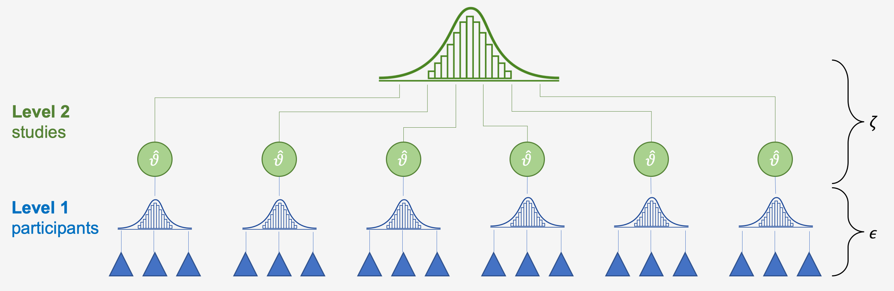
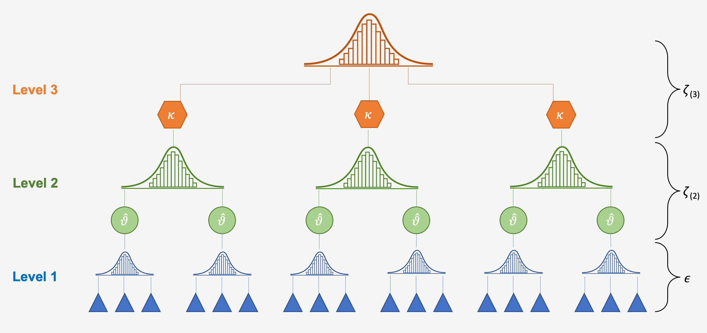

# "Multilevel" Meta-Analysis {#mlma}


$$ $$

This chapter deals with the topic of pooling effect sizes in **"multilevel" meta-analyses**. You probably wonder why we put the word "multilevel" into **quotation marks**. There is an increasing number of studies describing themselves as "multilevel" meta-analyses, which insinuates that a "multilevel" meta-analysis would be something special or extraordinary compared to "standard" meta-analyses. This, however, is not true, as every meta-analytic model presupposes a multilevel structure within the data to pool results [@pastor2018multilevel]. This means that basically, once you've reached this chapter in the guide, you will have already fitted a multilevel meta-analytic model to data several times (maybe even without knowing). When people talk about multilevel meta-analysis, what they often think of are **three-level meta-analytic models**, which are indeed somewhat different to the [fixed-effect](#fixed) and [random-effects models](#random) we presented before.

```{block, type='rmdinfo'}
**The multilevel nature of Meta-Analysis**

To see why meta-analysis is by nature multileveled, let us go back to the formula for the random-effects model we discussed in [Chapter 4.2](#random):

$$\hat\theta_k = \mu + \epsilon_k + \zeta_k$$

We discussed that the terms $\epsilon_k$ and $\zeta_k$ are introduced in a random-effects model because we assume that there are two sources of variability. The first one is caused by the **sampling error** ($\epsilon_k$) of individual studies, which causes their effect size estimates to deviate from the true effect size $\theta_k$. The second one, $\zeta_k$ is the between-study heterogeneity caused by the fact that the true effect size of a study $k$ itself is again only part of an **overarching distribution of true effect sizes**, from which the individual true effect size $\theta_k$ was drawn. Our aim in the random-effects model is therefore to estimate the mean of this distribution of true effect sizes, $\mu$.

The two error terms correspond with the two levels within our meta-analysis data: the **"participant" level** (level 1) and the **"study" level** (level 2). The figure below symbolizes this structure. In the lower level (level 1), we have the participants (and/or patients). These participants are, of course, part of a number of larger units, the studies (level 2), from which we retrieved the data for our meta-analysis. While the data on level 1 usually already reaches us, the meta-analysts, in a "pooled" form (e.g., the authors of the paper provide us with the mean and standard deviation of their studied sample instead of the raw data), pooling on level 2, the study level, has to be performed in meta-analysis. In the tradition of multilevel modeling, such data is called **nested data**: in most meta-analyses, one can say that **participants are "nested" within studies**.



Thus, if we split the formula from above into the components corresponding to the two levels, we get the following formulae:

**Level 1 (participants) model:**

\begin{equation}
  \label{eq:1}
  \hat\theta_k = \theta_k + \epsilon_k
\end{equation}

**Level 2 (studies) model:**

\begin{equation}
  \label{eq:2}
  \theta_k = \mu + \zeta_k
\end{equation}

You might have already detected that we can substitute $\theta_k$ in the first equation with its definition in the second equation. What we then get is **exactly the generic formula for the meta-analytic model from before** (even a fixed-effects model can be defined as having a multilevel structure, yet with $\zeta_k$ being zero). Thus, it becomes evident that the way we define a meta-analytic model already has multilevel properties "built-in" given that we assume that participants are nested within studies in our data.  

```

```{block, type='rmdinfo'}
**Three-level meta-analytic models**

It has become clear that meta-analysis naturally possesses a multilevel structure. This allows us to expand this structure even further to better reflect our data. **Three-level models** [@cheung2014modeling; @assink2016fitting] are a good way to do this.

**Statistical independence** is one of the core assumptions of meta-analytic pooling [@hedges2009statistical]. If there is a dependency between effect sizes (i.e., the effect sizes are correlated), this may artificially reduce heterogeneity and thus lead to false-positive results.  

Dependence may stem from different sources [@cheung2014modeling]:

1.  **Dependence introduced by the authors of the individual studies**. For example, scientists conducting the study might have collected data from multiple sites, or they might have compared [multiple interventions to one single control group](#i), or they might have used different questionnaires to measure an outcome of interest (e.g., they used the BDI as well as the PHQ-9 to assess depression in patients). For all of these scenarios, we can assume that some kind of dependency is introduced within the reported data.
2.  **Dependence introduced by the meta-analyst herself**. For example, a meta-analysis could focus on a specific psychological mechanism and include studies which were conducted in different cultural regions of the world. It seems reasonable that the reported results are more similar when studies were conducted in the same cultural context.

We can take such dependencies into account by integrating a **third layer** into the structure of our meta-analysis model. For example, one could model that different questionnaires are nested within studies. Or one could create a model in which studies are nested within cultural regions. This creates a three-level meta-analytic model, as illustrated by the figure below.



The generic mathematical formulae for a three-level meta-analytic model look like this:

**Level 1 model**

$$\hat\theta_{ij} = \theta_{ij} + \epsilon_{ij}$$

**Level 2 model**

$$\theta_{ij} = \kappa_{j} + \zeta_{(2)ij}$$

**Level 3 model**

$$\kappa_{j} = \beta_{0} + \zeta_{(3)j}$$

Where $\theta_{ij}$ is the **true effect size**, $\hat\theta_{ij}$ its estimator in the $i$th effect size in cluster $j$, $\kappa_{j}$ the **average effect size** in $j$ and $\beta_0$ the average population effect. Again, we can piece these formulae together and get this:

$$\hat\theta_{ij} = \beta_{0} + \zeta_{(2)ij} + \zeta_{(3)j} + \epsilon_{ij}$$


```

The `metafor` package is particularly well suited for fitting various three-level models in meta-analyses. When setting up meta-analytic models, we have previously used the `meta` function primarly, because we think that this package's code is a little less technical. `metafor`, however, is also fairly easy to use once you prepared the data correctly. We'll get to this in the next chapter. 

## Fitting a three-level model

### Data preparation

Before we start with fitting the model, we need the `metafor` package to be loaded from our library. 

```{r, message=FALSE, warning=FALSE}
library(metafor)
```

For this chapter, i will use the `mlm.data` dataset. It has already been prepared for model fitting using `metafor`. Let's have a peek at the dataset:

```{r, echo=FALSE}
load("_data/mlm.data.RData")
```

```{r}
mlm.data
```

We see that the dataset has 80 rows and 5 columns (i.e., 5 variables). The first four are the most important ones:

* **ID_1** and **ID_2**. In these two columns, we stored the identifiers corresponding to the individual effect sizes and clusters on different levels of our multilevel model. We have left these columns quite generic to make clear that such multilevel data can accommodate various types of data structures. For example, one can think of a scenario where ID_2 corresponds with the different effect sizes we find within a study (e.g., different effect sizes for different measures of depression). In this example, the effect sizes in ID_2 would then be nested within the larger clusters defined in ID_1, the studies. Another possible example would be that ID_2 in fact symbolizes the unique identifier for single studies, which are then nested in larger clusters (e.g., cultural regions) shown in ID_1. 
* **y** and **v**. In these columns, the effect size data is stored. The format is similar to the one we know from the `metagen` function in `meta`. The column `y` contains the effect size ($d$, $g$, $r$, $z$, or other continuous effect size metrics). The `v` column contains the sampling variance which can be obtained by **squaring the standard error**.

There are two additional columns which contain data needed for **subgroup analyses**. To conduct subgroup analyses with `metafor`, however, we need to store the data a little differently than in [Chapter 7](#subgroup). This time, we do not use a factor vector containing the subgroup levels as strings, but **recode all subgroup levels** as individuals columns in the data. In our case, we are interested if the publication status has a moderating effect on the pooled results. We want to compare studies published in peer-review journals to dissertations. To do this, we need to create **two variables/columns for each subgroup level** (peer-review, dissertation). In each column we provide a code if the effect size belongs to this subgroup, defined by `1 = yes` and `0 = no`. Of course, the subgroup codings now have to be **mutually exclusive**, as we cannot calculate subgroup effects if a study is both part of the "peer-review" group and the "dissertation" group.  

### Model fitting

We are now prepared to fit our model. I will save the model to the object `full.model`. For model fitting, we use the `rma.mv` function in `metafor`. The function has plenty of parameters one can specify (type `?metafor::rma.mv` in the console to see them all). For now, we will only focus on the really essential ones.

```{r,echo=FALSE, warning=FALSE, message=FALSE}
library(knitr)
Code<-c("y", "v", "random", "tdist", "data", "method")
Description<-c("The variable in our dataset containing the effect size data", "The variable in our dataset containing the sampling variance data corresponding to each y", "The model specifications for our multilevel model. We describe this in more detail below" , "This is an old friend in disguise, the Knapp-Hartung adjustment for our confidence intervals (if set to TRUE)", "The dataframe containing our data", "The tau-squared estimator. Our options here are limited, and it is advised to use the restricted maximum likelihood ('REML') method, which is the default")
m<-data.frame(Code,Description)
names<-c("Code","Description")
colnames(m)<-names
kable(m)
```

**Setting up the formula**

Under the `random` parameter, we feed `rma.mv` with the formula for our model. As we actually have two formulas in three-level models, we have to bundle them together in a `list()`. The notation for `rma.mv` is very similar to other packages specialized for mixed-effects models such as `lme4` [@lme4]. 

Within the `list()`, formulae are separated with commas. Within the formula, we first define the random effects variance as `~ 1`, followed by a **vertical bar** `|`. Behind the vertical bar, we assign this random effect to a **grouping variable** such as studies, measures, regions and so forth. We only have to define the formulae for **level 2** and **level 3**, as the sampling error in level 1 is assumed to be known. We type in the formulae in the order of our multilevel model. As in our example, ID_2 is nested in ID_1, we first define level 2 as `~ 1 | ID_2` and then level 3 as `~ 1 | ID_1`. Now, let's put it all together:


```{r}
full.model<-rma.mv(y, 
                   v, 
                   random = list(~ 1 | ID_2, 
                                 ~ 1 | ID_1), 
                   tdist = TRUE, 
                   data = mlm.data,
                   method = "REML")

```

To see the results of our model, we can use the `summary()` function.

```{r}
summary(full.model)
```

Let's go through the output one by one. First, let's have a look at the `Variance Components`. Here, we see the variance calculated for each level of our model, $\sigma^2_1$ (level 2) and $\sigma^2_2$ (level 3). Under `nlvls`, we see the number of levels (i.e., subgroups) on each level. For `ID_2`, this is 80 because each effect size has its own ID. 

Under `Model Results`, we see the `estimate` of our pooled effect, which is 0.4345. As our `y` column contained effect sizes expressed as Hedges' g, the effect is therefore $g = 0.4545$, with a confidence interval of $0.20-0.67$. 

Under `Test for Heterogeneity`, we see that the variance of effect sizes within our data overall was highly significant ($p < 0.0001$). This however, is not very informative as we are interested how variance can be attributed to the different levels in our model.


### Distribution of total variance

As mentioned before, what we're actually interested in is the **distribution of variance over the three levels of our model**. Cheung (2014) provides a formula to estimate the sampling variance, which is needed to calculate the variance proportions for each level. We have have prepared a function called `mlm.variance.distribution`, which implements this formula. The function is part of the [`dmetar`](#dmetar) package. If you have the package installed already, you have to load it into your library first.

```{r, eval=FALSE}
library(dmetar)
```

If you don't want to use the `dmetar` package, you can find the source code for this function [here](https://raw.githubusercontent.com/MathiasHarrer/dmetar/master/R/mlm.variance.distribution.R). In this case, *R* doesn't know this function yet, so we have to let *R* learn it by **copying and pasting** the code **in its entirety** into the **console** in the bottom left pane of RStudio, and then hit **Enter ⏎**. The function then requires the `ggplot2` package to work.

```{r, echo=FALSE, warning=FALSE, message=FALSE}
source("dmetar/mlm.variance.distribution.R")
library(ggplot2)
```

We only have to specify one parameter: `x`, the model we just fitted using `rma.mv`. Let's have a look:

```{r, fig.height=6, fig.width=6, fig.align="center"}
mlm.variance.distribution(x = full.model)
```

From the outputs, we see that about 8.94% of the overall variance can be attributed to level 1, 23.92% to level 2, and as much as 67.15% to level 3. The variance proportions at level 2 and 3 are equivalent to the between-study heterogeneity $I^2$ we covered in [Chapter 6](#heterogeneity). However, in the context of three-level meta-analysis models, there are three types of $I^2$ values: $I^2_{Level2}$, which describes the amount of within-cluster heterogeneity, $I^2_{Level3}$, representing the amount of between-cluster heterogeneity, and $I^2_{total}$, which is the total amount of heterogeneity not attributable to sampling error. $I^2_{total}$ is simply the sum of the $I^2$ values at level 2 and level 3.

### Comparing the fit

Of course, when fitting a three-level model, we are interested if this model actually **captures the variability in our data better than a two-level model**. `metafor` allows us to easily do this by comparing models **in which one of the levels is removed**.

To do this, we can use the `rma.mv` function again, but this time, we hold the variance component $\sigma^2$ of one level constant. This can be done by specifying the `sigma2` parameter. The parameter can be specified by providing a vector telling the function which level to hold constant, with the generic version being `c(level 2, level3)`. So, if we want to hold level 2 constant while leaving the rest as is, we use `sigma2 = c(0,NA)`, and vice verse for the third level.

**Model without level 2**

```{r}
model.l2.removed<-rma.mv(y, 
                   v, 
                   random = list(~ 1 | ID_2, 
                                 ~ 1 | ID_1), 
                   tdist = TRUE, 
                   data = mlm.data,
                   method = "REML",
                   sigma2 = c(0, NA))
summary(model.l2.removed)
```

We see that the `Model Results` have changed, but does the second level in fact capture a significant amount of variability in the data? To check, we can use the `anova` function to compare the `full.model` to the `model.l2.removed`.

```{r}
anova(full.model, model.l2.removed)
```

We see that the `Full` model compared to the `Reduced` model does indeed have a better fit, with the **Akaike Information Criterion** (`AIC`) and the **Bayesian Information Criterion** (`BIC`) being lower for this model. The difference is significant ($p<0.0001$), suggesting that it was a good idea to include this level into our analysis. Now, let's do the same when holding level 3 constant.

**Model without level 3**

```{r}
model.l3.removed<-rma.mv(y, 
                   v, 
                   random = list(~ 1 | ID_2, 
                                 ~ 1 | ID_1), 
                   tdist = TRUE, 
                   data = mlm.data,
                   method = "REML",
                   sigma2 = c(NA, 0))
summary(model.l3.removed)

anova(full.model, model.l2.removed)

```

We see the same pattern here, suggesting that overall, our three-level model is very useful. 

## Subgroup Analyses in Three-Level Models

Once our **three-level meta-analytic model** is set, it is easy to also check for moderators of the overall effect, i.e. conduct subgroup analyses. To do this, we can use the `mods` parameter in `rma.mv`. The subgroup/moderator can be specified by putting a tilde (`~`) in front of it. In our case, we want to check if dissertations report higher  or lower effect sizes, so we use `mods = ~ dissertation`. Here's the full code:

```{r}
model.mods<-rma.mv(y, 
                   v, 
                   random = list(~ 1 | ID_2, 
                                 ~ 1 | ID_1), 
                   tdist = TRUE, 
                   data = mlm.data,
                   method = "REML",
                   mods = ~ dissertation)
summary(model.mods)

```

The first important output is the `Test of Moderators`. We see that $F_{1,78}=0.0226$ with $p=0.8808$, meaning that there is no significant difference between subgroups. The `Model Results` are printed within a meta-regression framework, so we **cannot simply extract the estimates directly to attain the summary effect size within subgroups**. The first row, the `intrcpt` (intercept) is the value of $g$ when dissertation = 0, i.e., the value for peer-review articles. The predictor `dissertation`'s estimate is expressed as a **slope**, meaning that we have to add its value to the intercept to get the actual summary effect. This is:

$$g_{dissertation} = \beta_0 + \beta_{dissertation} = 0.4297+0.0339=0.4636$$

$$ $$


