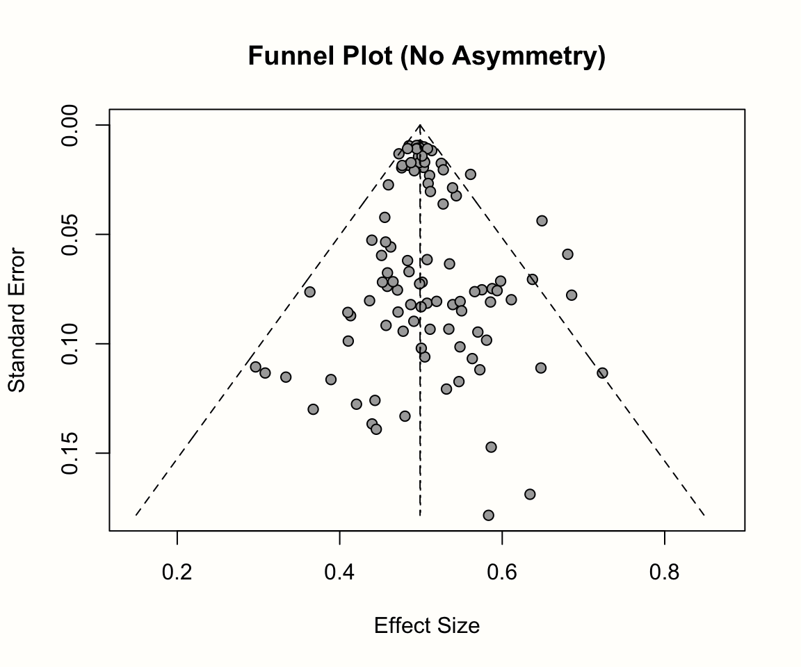
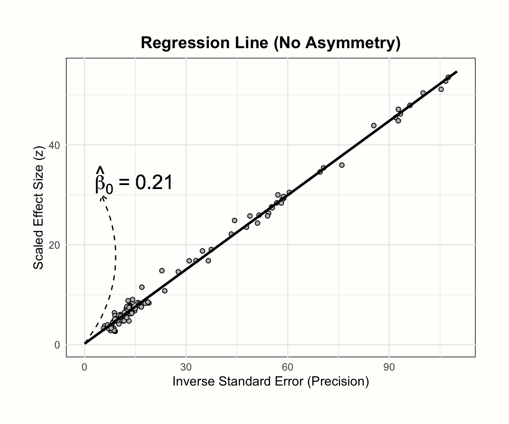
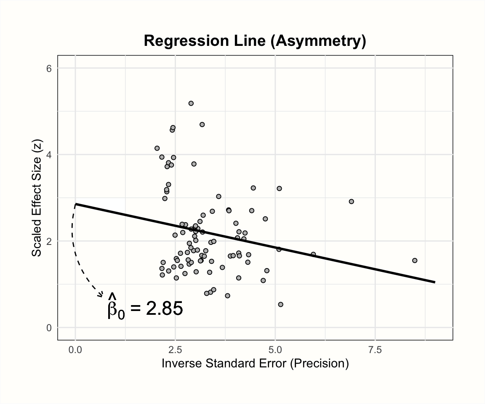

# Publication Bias {#pub-bias}

---


<br></br>

<span class="firstcharacter">L</span>
ooking back at the last chapters, we see that we already covered a vast range of meta-analytic techniques. Not only did we learn how to pool effect sizes, we also know now how to assess the robustness of our findings, inspect patterns of heterogeneity, and test hypotheses on why effects differ.

All of these approaches can help us to draw valid conclusions from our meta-analysis. This, however, rests on a tacit assumption concerning the nature of our data, which we have not challenged yet. When conducting a meta-analysis, we take it as a given that the data we collected is **comprehensive**, or at least **representative** of the research field under examination. 

Back in Chapter \@ref(study-search), we mentioned that meta-analyses usually try to include **all** available evidence, in order to derive a single effect size that adequately describes the research field. From a statistical perspective, we may be able to tolerate that a few studies are missing in our analysis--but only if these studies were "left out" by chance.

Unfortunately, meta-analyses are often unable to include all existing evidence. To make things worse, there are also good reasons to assume that some studies are not missing completely "at random" from our collected data. Our world is imperfect, and so are the incentives and "rules" that govern scientific practice. This means that there are systemic biases that can determine if a study ends up in our meta-analysis or not.

A good example of this problem can be found in a not-so-recent anecdote from pharmacotherapy research. Even back in the 1990s, it was considered secured knowledge that antidepressive medication (such as **selective serotonin re-uptake inhibitors**, or SSRIs) are effective in treating patients suffering from depression. Most of this evidence was provided by meta-analyses of published pharmocotherapy trials, in which an antidepressant is compared to a pill placebo. The question regarding the effects of antidepressive medication is an important one, considering that the antidepressant drug market is worth billions of dollars, and growing steadily. 

This may help to understand the turmoil caused by an article called **The Emperor's New Drugs**, written by Irving Kirsch and colleagues [-@kirsch2002emperor], which argued that things may not look so bright after all. 

Drawing on the "Freedom of Information Act", Kirsch and colleagues obtained previously unpublished antidepressant trial data which pharmaceutical companies had provided to the US Food and Drug Administration. They found that when this unpublished data was also considered, the benefits of antidepressants compared to placebos were at best minimal, and clinically negligible. Kirsch and colleagues argued that this was because companies only published studies with favorable findings, while studies with "disappointing" evidence were withheld [@kirschemperorbook].

\index{Publication Bias}

A contentious debate ensued, and Kirsch's claims have remained controversial until today. We have chosen this example not to pick sides, but to illustrate the potential threat that missing studies can pose to the validity of meta-analytic inferences. In the meta-analysis literature, such problems are usually summarized under the term **publication bias**. 

\index{File Drawer Problem}

The problem of publication bias underlines that every finding in meta-analyses can only be as good as the data it is based on. Meta-analytic techniques can only work with the data at hand. Therefore, if the collected data is distorted, even the best statistical model will only reproduce inherent biases. Maybe you recall that we already covered this fundamental caveat at the very beginning of this book, where we discussed the "File Drawer" problem (see Chapter \@ref(pitfalls)). Indeed, the terms "file drawer problem" and "publication bias" are often used synonymously.

The consequences of publication bias and related issues on the results of meta-analyses can be enormous. It can cause us to overestimate the effects of treatments, overlook negative side-effects, or reinforce the belief in theories that are actually invalid. 

In this chapter, we will therefore discuss the various shapes and forms through which publication bias can distort our findings. We will also have a look at a few approaches that we as meta-analysts can use to examine the risk of publication bias in our data; and how publication bias can be mitigated in the first place.

<br></br>

## What Is Publication Bias? {#types-of-pub-biases}

---

Publication bias exists when the probability of a study getting published is affected by its results [@duval2005publication, chapters 2 and 5]. There is widespread evidence that a study is more likely to find its way into the public if its findings are statistically significant, or confirm the initial hypothesis [@schmucker2014extent; @scherer2018full; @chan2014increasing; @dechartres2018association]. 

When searching for eligible studies, we are usually constrained to evidence that has been made public in some form or the other, for example through peer-reviewed articles, preprints, books, or other kinds of accessible reports. In the presence of publication bias, this not only means that some studies are missing in our data set--it also means that the missing studies are likely the ones with unfavorable findings. 

Meta-analytic techniques allow us to find an unbiased estimate of the average effect size in the population. But if our sample itself is distorted, even an effect estimate that is "true" from a statistical standpoint will not be representative of the reality. It is like trying to estimate the size of an iceberg, but only measuring its tip: our finding will inevitably be wrong, even if we are able to measure the height above the water surface with perfect accuracy.

\index{Reporting Bias}
\index{Citation Bias}
\index{Time-Lag Bias}
\index{Multiple Publication Bias}
\index{Language Bias}
\index{Outcome Reporting Bias}

Publication bias is actually just one of many **reporting biases**. There are several other factors that can also distort the evidence that we obtain in our meta-analysis [@page2020investigating], including:

* **Citation bias**: Even when published, studies with negative or inconclusive findings are less likely to be cited by related literature. This makes it harder to detect them through reference searches, for example.

* **Time-lag bias**: Studies with positive results are often published earlier than those with unfavorable findings. This means that findings of recently conducted studies with positive findings are often already available, while those with non-significant results are not.

* **Multiple publication bias**: Results of "successful" studies are more likely to be reported in several journal articles, which makes it easier to find at least one of them. The practice of reporting study findings across several articles is also known as "salami slicing".

* **Language bias**: In most disciplines, the primary language in which evidence is published is English. Publications in other languages are less likely to be detected, especially when the researchers themselves cannot understand the contents without translation. If studies in English systematically differ from the ones published in other languages, this may also introduce bias.

* **Outcome reporting bias**: Many studies, and clinical trials in particular, measure more than one outcome of interest. Some researchers exploit this, and only report those outcomes for which positive results were attained, while the ones that did not confirm the hypothesis are dropped. This can also lead to bias: technically speaking, the study has been published, but its (unfavorable) result will still be missing in our meta-analysis because it is not reported.

\index{Questionable Research Practice (QRP)}

Non-reporting biases can be seen as systemic factors which make it harder for us to find existing evidence. However, even if we were able to include all relevant findings, our results may still be flawed. Bias may also exist due to **questionable research practices** (QRPs) that researchers have applied when analyzing and reporting their findings [@simonsohn2020specification]. 


\index{P-Hacking}

We already mentioned the concept of "researcher degrees of freedom" previously (Chapter \@ref(pitfalls)). QRPs can be defined as practices in which researchers abuse these degrees of freedom to "bend" results into the desired direction. Unfortunately, there is no clear consensus on what constitutes a QRP. There are, however, a few commonly suggested examples. 

One of the most prominent QRPs is **p-hacking**, in which analyses are tweaked until the conventional significance threshold of $p<$ 0.05 is reached. This can include the way outliers are removed, analyses of subgroups, or the missing data handling. 

\index{HARKing}

Another QRP is **HARKing** [@kerr1998harking], which stands for **hypothesizing after the results are known**. One way of HARKing is to pretend that a finding in exploratory analyses has been an a priori hypothesis of the study all along. A researcher, for example, may run various tests on a data set, and then "invent" hypotheses around all the tests that were significant. This is a seriously flawed approach, which inflates the false discovery rate of a study, and thus increases the risk of spurious findings (to name just a few problems). Another type of HARKing is to drop all hypotheses that were not supported by the data, which can ultimately lead to outcome reporting bias.

<br></br>

## Addressing Publication Bias in Meta-Analyses {#addressing-pubbias}

---

It is quite clear that publication bias, other reporting biases and QRPs can have a strong and deleterious effect on the validity of our meta-analysis. They constitute major challenges since it is usually practically impossible to know the exact magnitude of the bias--or if it exists at all. 

\index{Study Search}
\index{Open Science Framework (OSF)}

In meta-analyses, we can apply techniques which can, to some extent,  reduce the risk of distortions due to publication and reporting bias, as well as QRPs. Some of these approaches pertain to the study search, while others are statistical methods. 

* **Study search**. In Chapter \@ref(study-search), we discussed the process of searching for eligible studies. If publication bias exists, this step is of great import, because it means that that a search of the published literature may yield data that is not fully representative of all the evidence. We can counteract this by also searching for **grey literature**, which includes dissertations, preprints, government reports, or conference proceedings. Fortunately, pre-registration is also becoming more common in many disciplines. This makes it possible to search study registries such as the ICTRP or **OSF Registries** (see Table \@ref(tab:bibdatabases) in Chapter \@ref(study-search)) for studies with unpublished data, and ask the authors if they can provide us with data that has not been made public (yet)^[Mahmood and colleagues [-@mahood2014searching] provide a detailed account of how a comprehensive grey literature search can be conducted, and what challenges this may entail. The article can be openly accessed online.]. Grey literature search can be tedious and frustrating, but it is worth the effort. One large study has found that the inclusion of grey and unpublished literature can help to avoid an overestimation of the true effects [@mcauley2000does].

* **Statistical methods**. It is also possible to examine the presence of publication through statistical procedures. None of these methods can identify publication bias directly, but they can examine certain properties of our data that may be indicative of it. Some methods can also be used to quantify the true overall effect when correcting for publication bias. 

\index{Small-Study Effect}

In this chapter, we will showcase common **statistical** methods to evaluate and control for publication bias. We begin with methods focusing on **small-study effects** [@sterne2000publication; @schwarzer2015meta, chapter 5; @duval2005publication, chapter 5]. A common thread among these approaches is that they find indicators of publication bias by looking at the relationship between the precision and observed effect size of studies.


<br></br>

### Small-Study Effect Methods {#small-study-effects}

---

There are various small-study effect methods to assess and correct for publication bias in meta-analyses. Many of the techniques have been conventional for many years. As it says in the name, these approaches are particularly concerned with **small studies**. From a statistical standpoint, this translates to studies with a high standard error. Small-study effect methods assume that small studies are more likely to fall prey to publication bias. 

This assumption is based on three core ideas [see @borenstein2011introduction, chapter 30]:

\index{File Drawer Problem}

1. Because they involve a large commitment of resources and time, large studies are likely to get published, no matter whether the results are significant or not.

2. Moderately sized studies are at greater risk of not being published. However, even when the statistical power is only moderate, this is still often sufficient to produce significant results. This means that only some studies will not get published because they delivered "undesirable" (i.e. non-significant) results.

3. Small studies are at the greatest risk of generating non-significant findings, and thus of remaining in the "file drawer". In small studies, only very large effects become significant. This means that only small studies with very high effect sizes will be published.

We see that the purported mechanism behind these assumptions is quite simple. Essentially, it says that publication bias exists because only significant effects are published. Since the probability of obtaining significant results rises with larger sample size, it follows that publication bias will disproportionately affect small studies.


<br></br>

#### The Funnel Plot {#funnel-plot}

---

\index{Funnel Plot}

Earlier in this guide (Chapter \@ref(what-is-es)), we learned that a study's sample size and standard error are closely related. Larger standard errors of an effect size result in wider confidence intervals and increase the chance that the effect is not statistically significant. Therefore, it is sensible to assume that small-study effects will largely affect studies with larger standard errors. 

Suppose that our collected data is burdened by publication bias. If this is the case, we can assume that the studies with large standard errors have higher effect sizes than the ones with a low standard error. This is because the smaller studies with lower effects were not significant, and thus never considered for publication. Consequently, we never included them in our meta-analysis.

It is conventional to inspect small-study effects through **funnel plots**. A funnel plot is a scatter plot of the studies' observed effect sizes on the x-axis against a measure of their standard error on the y-axis. Usually, the y-axis in funnel plots is inverted (meaning that "higher" values on the y-axis represent **lower** standard errors). 

When there is no publication bias, the data points in such a plot should form a roughly symmetrical, upside-down funnel. This is why they are called funnel plots. Studies in the top part of the plot (those with low standard errors), should lie closely together, and not far away from the pooled effect size. In the lower part of the plot, with increasing standard errors, the funnel "opens up", and effect sizes are expected to scatter more heavily to the left and right of the pooled effect. 

It becomes easier to see why studies should form a funnel when we think back to what we learned about the behavior of effect sizes in Chapter \@ref(what-is-es), and when discussing the fixed-effect model in Chapter \@ref(fem) (Figure \@ref(fig:funnel1)). The standard error is indicative of a study's **precision**: with decreasing standard error, we expect the observed effect size to become an increasingly good estimator of the true effect size. When the standard error is high, the effect size has a low precision and is therefore much more likely to be far off from the actual effect in the population.

We will now make this more concrete by generating a funnel plot ourselves. In the **{meta}** package, the `funnel.meta` function can be used to print a funnel plot for a meta-analysis object. Here, we produce a funnel plot for our `m.gen` meta-analysis object. We specify two further arguments, `xlim` and `studlab`. The first controls the limits of the x-axis in the plot, while the latter tells the function to include study labels. A call to the `title` function after running `funnel` adds a title to the plot. 

Our code looks like this:

\vspace{2mm}


```{r, message=F, fig.width=8, fig.height=6, out.width="85%", collapse = TRUE, results='hold', fig.align='center', eval = F}
# Load 'meta' package
library(meta)

# Produce funnel plot
funnel.meta(m.gen,
            xlim = c(-0.5, 2),
            studlab = TRUE)

# Add title
title("Funnel Plot (Third Wave Psychotherapies)")

```


```{r, message=F, fig.width=8, fig.height=6, out.width="85%", collapse = TRUE, results='hold', fig.align='center', echo=F}
# Load 'meta' package
library(meta)

par(bg="#FFFEFA")
# Produce funnel plot
funnel.meta(m.gen,
            xlim = c(-0.5, 2),
            studlab = TRUE)

# Add title
title("Funnel Plot (Third Wave Psychotherapies)")

```

As discussed, the resulting funnel plot shows the effect size of each study (expressed as the standardized mean difference) on the x-axis, and the standard error (from large to small) on the y-axis. To facilitate the interpretation, the plot also includes the idealized funnel-shape that we expect our studies to follow. The vertical line in the middle of the funnel shows the average effect size. Because we used a random-effects model when generating `m.gen`, the funnel plot also uses the random-effects estimate.

In the absence of small-study effects, our studies should roughly follow the shape delineated by the funnel displayed in the plot. Is this the case in our example? Well, not really. While we see that studies with lower standard errors lie more concentrated around the estimated true effect, the pattern overall looks asymmetrical. This is because there are three small studies with very high effect sizes in the bottom-right corner of the plot (the ones by Shapiro, Kang, and Danitz-Orsillo). 

These studies, however, have no equivalent in the bottom-left corner in the plot. There are no small studies with very low or negative effect sizes to "balance out" the ones with very high effects. Another worrisome detail is that the study with the greatest precision in our sample, the one by de Vibe, does not seem to follow the funnel pattern well either. Its effect size is considerably smaller than expected.

Overall, the data set shows an asymmetrical pattern in the funnel plot that **might** be indicative of publication bias. It could be that the three small studies are the ones that were lucky to find effects high enough to become significant, while there is an underbelly of unpublished studies with similar standard errors, but smaller and thus non-significant effects which did not make the cut.


A good way to inspect how asymmetry patterns relate to statistical significance is to generate **contour-enhanced funnel plots** [@peters2008contour]. Such plots can help to distinguish publication bias from other forms of asymmetry. Contour-enhanced funnel plots include colors which signify the significance level of each study in the plot. In the `funnel.meta` function, contours can be added by providing the desired significance thresholds to the `contour` argument. Usually, these are `0.9`, `0.95` and `0.99`, which equals $p$ < 0.1, 0.05 and 0.01, respectively. Using the `col.contour` argument, we can also specify the color that the contours should have. Lastly, the `legend` function can be used afterwards to add a legend to the plot, specifying what the different colors mean. We can position the legend on the plot using the `x` and `y` arguments, provide labels in `legend`, and add fill colors using the `fill` argument. 

This results in the following code: 

```{r, fig.width=8, fig.height=6, out.width="82%", collapse=TRUE, fig.align='center', eval=F}
# Define fill colors for contour
col.contour = c("gray75", "gray85", "gray95")

# Generate funnel plot (we do not include study labels here)
funnel.meta(m.gen, xlim = c(-0.5, 2),
            contour = c(0.9, 0.95, 0.99),
            col.contour = col.contour)

# Add a legend
legend(x = 1.6, y = 0.01, 
       legend = c("p < 0.1", "p < 0.05", "p < 0.01"),
       fill = col.contour)

# Add a title
title("Contour-Enhanced Funnel Plot (Third Wave Psychotherapies)")

```


```{r, fig.width=8, fig.height=6, out.width="75%", collapse=TRUE, fig.align='center', echo=F}
# Define fill colors for contour
col.contour = c("gray75", "gray85", "gray95")


par(bg="#FFFEFA")
# Generate funnel plot (we do not include study labels here)
funnel.meta(m.gen, xlim = c(-0.5, 2),
            contour = c(0.9, 0.95, 0.99),
            col.contour = col.contour)

# Add a legend
legend(x = 1.6, y = 0.01, 
       legend = c("p < 0.1", "p < 0.05", "p < 0.01"),
       fill = col.contour)

# Add a title
title("Contour-Enhanced Funnel Plot (Third Wave Psychotherapies)")

```

We see that the funnel plot now contains three shaded regions. We are particularly interested in the $p<$ 0.05 and $p<$ 0.01 regions, because effect sizes falling into this area are traditionally considered significant. 

Adding the contour regions is illuminating: it shows that the three small studies all have significant effects, despite having a large standard error. There is only one study with a similar standard error that is not significant. If we would "impute" the missing studies in the lower left corner of the plot to increase the symmetry, these studies would lie in the non-significance region of the plot; or they would actually have a significant negative effect. 

The pattern looks a little different for the larger studies. We see that there are several studies for which $p>$ 0.05, and the distribution of effects is less lopsided. What could be problematic though is that, while not strictly significant, all but one study are very close to the significance threshold (i.e. they lie in the 0.1 $> p >$ 0.05 region). It is possible that these studies simply calculated the effect size differently in the original paper, which led to a significant result. Or maybe, finding effects that are significant on a trend level was already convincing enough to get the study published.

In sum, inspection of the contour-enhanced funnel plot corroborates our initial hunch that there is asymmetry in the funnel plot and that this may be caused by publication bias. It is crucial, however, not to jump to conclusions, and interpret the funnel plot cautiously. We have to keep in mind that publication bias is just one of many possible reasons for funnel plot asymmetry.

\index{Fidelity, Treatment}

```{block, type='boxinfo'}
**Alternative Explanations for Funnel Plot Asymmetry**

\vspace{2mm}

Although publication bias can lead to asymmetrical funnel plots, there are also other, rather "benign", causes that may produce similar patterns [@page2020investigating]:

\vspace{2mm}

* Asymmetry can also be caused by between-study heterogeneity. Funnel plots assume that the dispersion of effect sizes is caused by the studies' sampling error, but do not control for the fact the studies may be estimators of different true effects.

\vspace{2mm}

* It is possible that study procedures were different in small studies, and that this resulted in higher effects. In clinical studies, for example, it is easier to make sure that every participant receives the treatment as intended when the sample size is small. This may not be the case in large studies, resulting in a lower **treatment fidelity**, and thus lower effects. It can make sense to inspect the characteristics of the included studies in order to evaluate if such an alternative explanation is plausible.

\vspace{2mm}

* It is a common finding that low-quality studies tend to show larger effect sizes, because there is a higher risk of bias. Large studies require more investment, so it is likely that their methodology will also be more rigorous. This can also lead to funnel plot asymmetry, even when there is no publication bias.

\vspace{2mm}

* Lastly, it is perfectly possible that funnel plot asymmetry simply occurs by chance.

```


\index{Egger's Test}

We see that visual inspection of the (contour-enhanced) funnel plot can already provide us with a few "red flags" that indicate that our results may be affected by publication bias. 

However, interpreting the funnel plot just by looking at it clearly also has its limitations. There is no explicit rule when our results are "too asymmetric", meaning that inferences from funnel plots are always somewhat subjective. Therefore, it is helpful to assess the presence of funnel plot asymmetry in a quantitative way. This is usually achieved through **Egger's regression test**, which we will discuss next.

<br></br>

#### Egger's Regression Test {#eggers-test}

---

Egger's regression test [@egger1997bias] is a commonly used quantitative method that tests for asymmetry in the funnel plot. Like visual inspection of the funnel plot, it can only identify small-study effects and not tell us directly if publication bias exists. The test is based on a simple linear regression model, the formula of which looks like this:

\begin{equation}
\frac{\hat\theta_k}{SE_{\hat\theta_k}} = \beta_0 + \beta_1 \frac{1}{SE_{\hat\theta_k}}
(\#eq:pub1)
\end{equation}

The responses $y$ in this formula are the observed effect sizes $\hat\theta_k$ in our meta-analysis, divided through their standard error. The resulting values are equivalent to $z$-scores. These scores tell us directly if an effect size is significant; when $z \geq$ 1.96 or $\leq$ -1.96, we know that the effect is significant ($p<$ 0.05). This response is regressed on the inverse of the studies' standard error, which is equivalent to their precision. 

When using Egger's test, however, we are not interested in the size and significance of the regression weight $\beta_1$, but in the **intercept** $\beta_0$. To evaluate the funnel asymmetry, we inspect the size of $\hat\beta_0$, and if it differs significantly from zero. When this is the case, Egger's test indicates funnel plot asymmetry.

Let us take a moment to understand why the size of the regression intercept tells us something about asymmetry in the funnel plot. In every linear regression model, the intercept represents the value of $y$ when all other predictors are zero. The predictor in our model is the precision of a study, so the intercept shows the expected $z$-score when the precision is zero (i.e. when the standard error of a study is infinitely large). 

When there is no publication bias, the expected $z$-score should be scattered around zero. This is because studies with extremely large standard errors have extremely large confidence intervals, making it nearly impossible to reach a value of $|z| \geq$ 1.96. However, when the funnel plot is asymmetric, for example due to publication bias, we expect that small studies with very high effect sizes will be considerably over-represented in our data, leading to a surprisingly high number of low-precision studies with $z$ values greater or equal to 1.96. Due to this distortion, the predicted value of $y$ for zero precision will be much larger than zero, resulting in a significant intercept. 

The plots below illustrate the effects of funnel plot asymmetry on the regression slope and intercept underlying Egger's test.


```{r eggers_alt, echo=F, out.width="50%", message=F, warning=F, fig.width=6, fig.height=5, eval=F}
library(ggplot2)

load("data/m.egdat.rda")
load("data/m.egdat.bias.rda")

funnel(m.egdat, xlab = "Effect Size")
title("Funnel Plot (No Asymmetry)")

m.egdat$data %>% 
  mutate(y = .TE/.seTE, x = 1/.seTE) %>% 
  ggplot(aes(y = y, x = x)) + 
  xlim(c(0, 110)) +
  #ylim(c(0, 110)) +
  geom_point(fill = "grey", pch=21) + 
  geom_smooth(method = "lm", se = F, fullrange = T, color = "black") + 
  theme_minimal() +
  ylab("Scaled Effect Size (z)") +
  xlab("Inverse Standard Error (Precision)") +
  annotate("text", x = 3, y = 33, label = bquote(hat(beta)[0]~"="~0.21), hjust = "left",
           cex = 6) +
  annotate(geom = "curve", x = 0, y = 0.21, xend = 5, yend = 30, 
           curvature = .3, arrow = arrow(length = unit(2, "mm")), linetype = "dashed") +
  ggtitle("Regression Line (No Asymmetry)") + 
  theme(plot.title = element_text(color="black", size=14, face="bold",
                                  hjust = 0.5),
        plot.margin = margin(1.08, 1, 1.08, 1, "cm"),
        plot.background = element_rect(fill = "#FFFEFA", color = "#fbfbfb"),
        panel.background = element_rect(fill = "#FFFEFA")) # 'nearly-white' used to keep knitr from cropping


meta::funnel.meta(m.egdat.bias, xlab = "Effect Size")
title("Funnel Plot (Asymmetry)")

m.egdat.bias$data %>% 
    mutate(y = .TE/.seTE, x = 1/.seTE) %>% 
    ggplot(aes(y = y, x = x)) + 
    xlim(c(0, 9)) +
    ylim(c(0,6)) +
    geom_point(fill = "grey", pch=21) + 
    geom_smooth(method = "lm", se = F, fullrange = T, color = "black") + 
    theme_minimal() +
    ylab("Scaled Effect Size (z)") +
    xlab("Inverse Standard Error (Precision)") +
    annotate("text", x = 0.8, y = 0.5, label = bquote(hat(beta)[0]~"="~2.85), hjust = "left",
             cex = 6) +
    annotate(geom = "curve", x = 0, y = 2.85, xend = 0.7, yend = 0.7, 
             curvature = .3, arrow = arrow(length = unit(2, "mm")), linetype = "dashed") +
    ggtitle("Regression Line (Asymmetry)") +
    theme(plot.title = element_text(color="black", size=14, face="bold",
                                hjust = 0.5),
      plot.margin = margin(1.08, 1, 1.08, 1, "cm"),
      plot.background = element_rect(fill = "#feffff", color = "#fbfbfb"),
      panel.background = element_rect(fill = "#feffff")) # 'nearly-white' used to keep knitr from cropping


```


```{r eggers, echo=F, out.width="50%", message=F, warning=F, fig.width=6, fig.height=5}
library(OpenImageR)


knitr::include_graphics('images/eggers-3_sep.png')

```


\index{tidyverse Package}

Let us see what results we get when we fit such a regression model to the data in `m.gen`. Using _R_, we can extract the original data in `m.gen` to calculate the response `y` and our predictor `x`. In the code below, we do this using a pipe (Chapter \@ref(data-transform)) and the `mutate` function, which is part of the **{tidyverse}**. After that, we use the **l**inear **m**odel function `lm` to regress the $z$ scores `y` on the precision `x`. In the last part of the pipe, we request a `summary` of the results.

```{r, eval = F}
# Load required package
library(tidyverse)

m.gen$data %>% 
  mutate(y = TE/seTE, x = 1/seTE) %>% 
  lm(y ~ x, data = .) %>% 
  summary()

```

```
## [...]
## 
## Coefficients:
##             Estimate Std. Error t value Pr(>|t|)    
## (Intercept)   4.1111     0.8790   4.677 0.000252 ***
## x            -0.3407     0.1837  -1.855 0.082140 .  
## ---
## Signif. codes:  0 ‘***’ 0.001 ‘**’ 0.01 ‘*’ 0.05 ‘.’ 0.1 ‘ ’ 1
## 
## [...]
```

In the results, we see that the intercept of our regression model is $\hat\beta_0$ = 4.11. This is significantly larger than zero ($t$ = 4.677, $p<$ 0.001), and indicates that the data in the funnel plot is indeed asymmetrical. Overall, this corroborates our initial findings that there are small-study effects. Yet, to reiterate, it is uncertain if this pattern has been caused by publication bias.

A more convenient way to perform Egger's test of the intercept is to use the `metabias` function in **{meta}**. This function only needs the meta-analysis object as input, and we have to set the `method.bias` argument to `"linreg"`. If we apply the function to `m.gen`, we get the same results as before.

```{r}
metabias(m.gen, method.bias = "linreg")
```

```{block2, type='boxreport'}
**Reporting the Results of Egger's Test**

\vspace{2mm}

For Egger's tests, it is usually sufficient to report the value of the intercept, its 95% confidence interval, as well as the $t$ and $p$-value. In the **{dmetar}** package, we included a convenience function called `eggers.test`. This function is a wrapper for `metabias`, and provides the results of Egger's test in a format suitable for reporting. In case you do not have **{dmetar}** installed, you can find the function's source code [online](https://raw.githubusercontent.com/MathiasHarrer/dmetar/master/R/eggers.test.R). Here is an example:

`eggers.test(m.gen)`

$~$            | `Intercept` | `ConfidenceInterval` | `t`        | `p`
-------------- | ----------- | -------------------- | ---------- | ---
`Egger's test` | `4.111`     | `2.347-5.875`        | `4.677`    | `0.00025`

```


\index{Standardized Mean Difference}

The effect size metric used in `m.gen` is the small sample bias-corrected SMD (Hedges' $g$). It has been argued that running Egger's test on SMDs can lead to an inflation of false positive results [@pustejovsky2019testing]. This is because a study's standardized mean difference and standard error are not independent. 

We can easily see this by looking at the formula used to calculate the standard error of between-group SMDs (equation 3.18, Chapter \@ref(b-group-smd)). This formula includes the SMD itself, which means that a study's standard error changes for smaller or larger values of the observed effect (i.e. there is an artifactual correlation between the SMD and its standard error). 

Pustejovsky and Rodgers [-@pustejovsky2019testing] propose to use a modified version of the standard error when testing for the funnel plot asymmetry of standardized mean differences. Only the first part of the standard error formula is used, which means that the observed effect size drops out of the equation. Thus, the formula looks like this:


\begin{equation}
SE^*_{\text{SMD}_{\text{between}}}= \sqrt{\frac{n_1+n_2}{n_1n_2}}
(\#eq:pub2)
\end{equation}

Where $SE^*_{\text{SMD}_{\text{between}}}$ is the modified version of the standard error. It might be a good idea to check if Egger's test gives the same results when using this improvement. In the following code, we add the sample size per group of each study to our initial data set, calculate the adapted standard error, and then use it to re-run the analyses. 

```{r}
# Add experimental (n1) and control group (n2) sample size
n1 <- c(62, 72, 44, 135, 103, 71, 69, 68, 95, 
        43, 79, 61, 62, 60, 43, 42, 64, 63)

n2 <- c(51, 78, 41, 115, 100, 79, 62, 72, 80, 
        44, 72, 67, 59, 54, 41, 51, 66, 55)

# Calculate modified SE
ThirdWave$seTE_c <- sqrt((n1+n2)/(n1*n2))

# Re-run 'metagen' with modified SE to get meta-analysis object
m.gen.c <- metagen(TE = TE, seTE = seTE_c,
                   studlab = Author, data = ThirdWave, sm = "SMD", 
                   fixed = FALSE, random = TRUE, 
                   method.tau = "REML", hakn = TRUE, 
                   title = "Third Wave Psychotherapies")

# Egger's test
metabias(m.gen.c, method = "linreg")

```


We see that, although the exact values differ, the interpretation of the results remains the same. This points to the robustness of our previous finding.


```{block2, type='boxinfo'}
**Using the Pustejovsky-Rodgers Approach Directly in `metabias`**

In the latest versions of **{meta}**, the `metabias` function also contains an option to conduct Eggers' test with the corrected standard error formula proposed by Pustejovsky and Rodgers. The option can be used by setting `method.bias` to `"Pustejovsky"`.

Yet, this is only possible if the **{meta}** meta-analysis object already contains the sample sizes of the experimental and control groups in elements `n.e` and `n.c`, respectively. When using `metagen` objects (like in our example above), this is not typically the case, so these values need to be added manually. Let us use our `m.gen` meta-analysis object again as an example:

`m.gen$n.e = n1; m.gen$n.c = n2`

`metabias(m.gen, method.bias = "Pustejovsky")`

Please note that `metabias`, under these settings, uses equation \@ref(eq:pub5) to perform Egger's test, which is equivalent to equation \@ref(eq:pub1) shown before. The main difference is that `metabias` uses the corrected standard error as the predictor in the model, and the inverse variance of included effect sizes as weights. 

In our example, however, we used the corrected standard error on both sides of equation \@ref(eq:pub1). This means that results of our approach as shown above, and results obtained via setting `method.bias` to `"Pustejovsky"`, will not be completely identical.

```

<br></br>

#### Peters' Regression Test {#peters-test}

---

\index{Peter's Test}

The dependence of effect size and standard error not only applies to standardized mean differences. This mathematical association also exists in effect sizes based on binary outcome data, such as (log) odds ratios (Chapter \@ref(or)), risk ratios (Chapter \@ref(rr)) or proportions (Chapter \@ref(props)). 

To avoid an inflated risk of false positives when using binary effect size data, we can use another type of regression test, proposed by Peters and colleagues [@peters2006comparison]. To obtain the results of Peters' test, the log-transformed effect size is regressed on the inverse of the sample size:

\begin{equation}
\log\psi_k =  \beta_0 + \beta_1\frac{1}{n_k}
(\#eq:pub3)
\end{equation}

In this formula, $\log\psi_k$ can stand for any log-transformed effect size based on binary outcome data (e.g. the odds ratio), and $n_k$ is the total sample size of study $k$.

\index{Weighted Least Squares (WLS)}

Importantly, when fitting the regression model, each study $k$ is given a different weight $w_k$, depending on its sample size and event counts. This results in a **weighted** linear regression, which is similar (but not identical) to a meta-regression model (see Chapter \@ref(metareg-model-fit)). The formula for the weights $w_k$ looks like this:

\begin{equation}
w_k = \frac{1}{\left(\dfrac{1}{a_k+c_k}+\dfrac{1}{b_k+d_k}\right)}
(\#eq:pub4)
\end{equation}

Where $a_k$ is the number of events in the treatment group, $c_k$ is the number of events in the control group; $b_k$ and $d_k$ are the number of non-events in the treatment and control group, respectively (see Chapter \@ref(rr)). In contrast to Eggers' regression test, Peters' test uses $\beta_1$ instead of the intercept to test for funnel plot asymmetry. When the statistical test reveals that $\beta_1 \neq 0$, we can assume that asymmetry exists in our data.

When we have calculated a meta-analysis based on binary outcome data using the `metabin` (Chapter \@ref(pooling-or-rr)) or `metaprop` (Chapter \@ref(pooling-props)) function, the `metabias` function can be used to conduct Peters' test. We only have to provide a fitting meta-analysis object and use `"peters"` as the argument in `method.bias`. Let us check for funnel plot asymmetry in the `m.bin` object we created in Chapter \@ref(pooling-or-rr). 

As you might remember, we used the risk ratio as the summary measure for this meta-analysis.

```{r}
metabias(m.bin, method.bias = "peters")
```

We see that the structure of the output looks identical to the one of Eggers' test. The output tells us that the results are the ones of a regression test `based on sample size`, meaning that Peters' method has been used. The test is not significant ($t$ = -0.08, $p$ = 0.94), indicating no funnel plot asymmetry.

```{block, type='boximportant'}
**Statistical Power of Funnel Plot Asymmetry Tests**

\vspace{2mm}

It is advisable to only test for funnel plot asymmetry when our meta-analysis includes a sufficient number of studies. When the number of studies is low, the statistical power of Eggers' or Peters' test may not be high enough to detect real asymmetry. It is generally recommended to only perform a test when $K \geq 10$ [@sterne2011recommendations]. 

By default, `metabias` will throw an error when the number of studies in our meta-analysis is smaller than that. However, it is possible (although not advised) to prevent this by setting the `k.min` argument in the function to a lower number.

```


<br></br>

#### Duval & Tweedie Trim and Fill Method {#duval-and-tweedie}

---

\index{Trim and Fill Method}

We have now learned several ways to examine (and test for) small-study effects in our meta-analysis. While it is good to know that publication bias may exist in our data, what we are primarily interested in is the **magnitude** of that bias. We want to know if publication bias has only distorted our estimate slightly, or if it is massive enough to change the interpretation of our findings.

In short, we need a method which allows us to calculate a **bias-corrected** estimate of the true effect size. Yet, we already learned that publication bias cannot be measured directly. We can only use small-study effects as a proxy that may **point** to publication bias. 

We can therefore only adjust for small-study effects to attain a corrected effect estimate, not for publication bias **per se**. When effect size asymmetry was indeed caused by publication bias, correcting for this imbalance will yield an estimate that better represents the true effect when **all** evidence is considered.

One of the most common methods to adjust for funnel plot asymmetry is the **Duval & Tweedie trim and fill method** [@duval2000trim]. The idea behind this method is simple: it imputes "missing" effects until the funnel plot is symmetric. The pooled effect size of the resulting "extended" data set then represents the estimate when correcting for small-study effects. This is achieved through a simple algorithm, which involves the "trimming" and "filling" of effects [@schwarzer2015meta, chapter 5.3.1]:

* **Trimming**. First, the method identifies all the outlying studies in the funnel plot. In our example from before, these would be all small studies scattered around the right side of the plot. Once identified, these studies are **trimmed**: they are removed from the analysis, and the pooled effect is recalculated without them. This step is usually performed using a fixed-effect model.

* **Filling**. For the next step, the recalculated pooled effect is now assumed to be the center of all effect sizes. For each trimmed study, one additional effect size is added, mirroring its results on the other side of the funnel. For example, if the recalculated mean effect is 0.5 and a trimmed study has an effect of 0.8, the mirrored study will be given an effect of 0.2. After this is done for all trimmed studies, the funnel plot will look roughly symmetric. Based on all data, including the trimmed and imputed effect sizes, the average effect is then recalculated again (typically using a random-effects model). The result is then used as the estimate of the corrected pooled effect size.

An important caveat pertaining to the trim-and-fill method is that it does not produce reliable results when the between-study heterogeneity is large [@peters2007performance; @terrin2003adjusting; @simonsohn2014p]. When studies do not share one true effect, it is possible that even large studies deviate substantially from the average effect. This means that such studies are also trimmed and filled, even though it is unlikely that they are affected by publication bias. It is easy to see that this can lead to invalid results. 

We can apply the trim and fill algorithm to our data using the `trimfill` function in **{meta}**. The function has very sensible defaults, so it is sufficient to simply provide it with our meta-analysis object. In our example, we use our `m.gen` object again. However, before we start, let us first check the amount of $I^2$ heterogeneity we observed in this meta-analysis.

```{r}
m.gen$I2
```


We see that, with $I^2$ = 63%, the heterogeneity in our analysis is substantial. In light of the trim and fill method's limitations in heterogeneous data sets, this could prove problematic. 

We will therefore conduct two trim and fill analyses: one with all studies, and a sensitivity analysis in which we exclude two outliers identified in chapter \@ref(outliers) (i.e. study 3 and 16). We save the results to `tf` and `tf.no.out`.


```{r}
# Using all studies
tf <- trimfill(m.gen)

# Analyze with outliers removed
tf.no.out <- trimfill(update(m.gen, 
                             subset = -c(3, 16)))

```

First, let us have a look at the first analysis, which includes all studies.

```{r, eval=F}
summary(tf)
```

```
## Review:     Third Wave Psychotherapies
##                              SMD             95%-CI %W(random)
## [...]
## Filled: Warnecke et al.   0.0520 [-0.4360;  0.5401]        3.8
## Filled: Song & Lindquist  0.0395 [-0.4048;  0.4837]        4.0
## Filled: Frogeli et al.    0.0220 [-0.3621;  0.4062]        4.2
## Filled: Call et al.      -0.0571 [-0.5683;  0.4541]        3.8
## Filled: Gallego et al.   -0.0729 [-0.5132;  0.3675]        4.0
## Filled: Kang et al.      -0.6230 [-1.2839;  0.0379]        3.3
## Filled: Shapiro et al.   -0.8277 [-1.4456; -0.2098]        3.4
## Filled: DanitzOrsillo    -1.1391 [-1.8164; -0.4618]        3.3
## 
## Number of studies combined: k = 26 (with 8 added studies)
## 
##                         SMD           95%-CI    t p-value
## Random effects model 0.3428 [0.1015; 0.5841] 2.93  0.0072
## 
## Quantifying heterogeneity:
##  tau^2 = 0.2557 [0.1456; 0.6642]; tau = 0.5056 [0.3816; 0.8150];
##  I^2 = 76.2% [65.4%; 83.7%]; H = 2.05 [1.70; 2.47]
## 
## [...]
## 
## Details on meta-analytical method:
## - Inverse variance method
## - Restricted maximum-likelihood estimator for tau^2
## - Q-profile method for confidence interval of tau^2 and tau
## - Hartung-Knapp adjustment for random effects model
## - Trim-and-fill method to adjust for funnel plot asymmetry
```

We see that the trim and fill procedure added a total of eight studies. Trimmed and filled studies include our detected outliers, but also a few other smaller studies with relatively high effects. We see that the imputed effect sizes are all very low, and some are even highly negative. The output also provides us with the estimate of the corrected effect, which is $g=$ 0.34. This is still significant, but much lower than the effect of $g=$ 0.58 we initially calculated for `m.gen`. 

Now, let us compare this to the results of the analysis in which outliers were removed.

```{r, eval=F}
summary(tf.no.out)
```

```
## Review:     Third Wave Psychotherapies
## [...]     
## 
## Number of studies combined: k = 22 (with 6 added studies)
## 
##                         SMD           95%-CI    t p-value
## Random effects model 0.3391 [0.1904; 0.4878] 4.74  0.0001
## 
## Quantifying heterogeneity:
##  tau^2 = 0.0421 [0.0116; 0.2181]; tau = 0.2053 [0.1079; 0.4671];
##  I^2 = 50.5% [19.1%; 69.7%]; H = 1.42 [1.11; 1.82]
## [...]
```

With $g=$ 0.34, the results are nearly identical. Overall, the trim and fill method indicates that the pooled effect of $g=$ 0.58 in our meta-analysis is overestimated due to small-study effects. In reality, the effect may be considerably smaller. It is likely that this overestimation has been caused by publication bias, but this is not certain. Other explanations are possible too, and this could mean that the trim and fill estimate is invalid.

Lastly, it is also possible to create a funnel plot including the imputed studies. We only have to apply the `funnel.meta` function to the output of `trimfill`. In the following code, we create contour-enhanced funnel plots for both trim and fill analyses (with and without outliers). Using the `par` function, we can print both plots side by side.

\vspace{4mm}

```{r, fig.width=12, fig.height=5, eval=F}

# Define fill colors for contour
contour <- c(0.9, 0.95, 0.99)
col.contour <- c("gray75", "gray85", "gray95")
ld <- c("p < 0.1", "p < 0.05", "p < 0.01")

# Use 'par' to create two plots in one row (row, columns)
par(mfrow=c(1,2))

# Contour-enhanced funnel plot (full data)
funnel.meta(tf, 
            xlim = c(-1.5, 2), contour = contour,
            col.contour = col.contour)
legend(x = 1.1, y = 0.01, 
       legend = ld, fill = col.contour)
title("Funnel Plot (Trim & Fill Method)")

# Contour-enhanced funnel plot (outliers removed)
funnel.meta(tf.no.out, 
            xlim = c(-1.5, 2), contour = contour,
            col.contour = col.contour)
legend(x = 1.1, y = 0.01, 
       legend = ld, fill = col.contour)
title("Funnel Plot (Trim & Fill Method) - Outliers Removed")

```

```{r, fig.width=12, fig.height=5, echo=F}

# Define fill colors for contour
contour <- c(0.9, 0.95, 0.99)
col.contour <- c("gray75", "gray85", "gray95")
ld <- c("p < 0.1", "p < 0.05", "p < 0.01")

# Use 'par' to create two plots in one row (row, columns)
par(mfrow=c(1,2),
    bg="#FFFEFA")

# Contour-enhanced funnel plot (full data)
funnel.meta(tf, 
            xlim = c(-1.5, 2), contour = contour,
            col.contour = col.contour)
legend(x = 1.1, y = 0.01, 
       legend = ld, fill = col.contour)
title("Funnel Plot (Trim & Fill Method)")

# Contour-enhanced funnel plot (outliers removed)
funnel.meta(tf.no.out, 
            xlim = c(-1.5, 2), contour = contour,
            col.contour = col.contour)
legend(x = 1.1, y = 0.01, 
       legend = ld, fill = col.contour)
title("Funnel Plot (Trim & Fill Method) - Outliers Removed")

```

In these funnel plots, the imputed studies are represented by circles that have no fill color.


<br></br>

#### PET-PEESE {#pet-peese}

---

\index{PET-PEESE}
\index{Standardized Mean Difference}

Duval & Tweedie's trim and fill method is relatively old, and arguably one of the most common methods to adjust for small-study effects. However, as we mentioned, it is an approach that is far from perfect, and not the only way to estimate a bias-corrected version of our pooled effect. In recent years, a method called **PET-PEESE** [@stanley2014meta; @stanley2008meta] has become increasingly popular; particularly in research fields where SMDs are frequently used as the outcome measure (for example psychology or educational research). Like all previous techniques, PET-PEESE is aimed at small-study effects, which are seen as a potential indicator of publication bias.

PET-PEESE is actually a combination of two methods: the **precision-effect test** (PET) and the **precision-effect estimate with standard error** (PEESE). Let us begin with the former. The PET method is based on a simple regression model, in which we regress a study's effect size on its standard error:


\begin{equation}
\theta_k =  \beta_0 + \beta_1SE_{\theta_k}
(\#eq:pub5)
\end{equation}


Like in Peters' test, we use a weighted regression. The study weight $w_k$ is calculated as the inverse of the variance--just like in a normal (fixed-effect) meta-analysis:

\begin{equation}
w_k = \frac{1}{s_k^2} 
(\#eq:pub6)
\end{equation}


It is of note that the regression model used by the PET method is equivalent to the one of Eggers' test. The main difference is that in the PET formula, the $\beta_1$ coefficient quantifies funnel asymmetry, while in Eggers' test, this is indicated by the intercept. 

\index{Limit}

When using the PET method, however, we are not interested in the funnel asymmetry measured by $\beta_1$, but in the intercept $\beta_0$. This is because, in the formula above, the intercept represents the so-called **limit effect**. This limit effect is the expected effect size of a study with a **standard error of zero**. This is the equivalent of an observed effect size measured without sampling error. All things being equal, we know that an effect size measured without sampling error $\epsilon_k$ will represent the true overall effect itself. 

The idea behind the PET method is to **control** for the effect of small studies by including the standard error as a predictor. In theory, this should lead to an intercept $\beta_0$ which represents the true effect in our meta-analysis after correction for all small-study effects:

\begin{equation}
\hat\theta_{\text{PET}} = \hat\beta_{0_{\mathrm{PET}}}
(\#eq:pub7)
\end{equation}

The formula for the PEESE method is very similar. The only difference is that we use the **squared** standard error as the predictor (i.e. the effect size variance $s_k^2$):

\begin{equation}
\theta_k =  \beta_0 + \beta_1SE_{\theta_k}^2
(\#eq:pub8)
\end{equation}


While the formula for the study weights $w_k$ remains the same. The idea behind squaring the standard error is that small studies are particularly prone to reporting **highly** over-estimated effects. This problem, it is assumed, is far less pronounced for studies with high statistical power. 

While the PET method works best when the true effect captured by $\beta_0$ is **zero**, PEESE shows a better performance when the true effect is **not** zero. Stanley and Doucouliagos [-@stanley2014meta] therefore proposed to combine both methods, in order to balance out their individual strengths. The resulting approach is the PET-PEESE method. PET-PEESE uses the intercept $\beta_0$ of either PET or PEESE as the estimate of the corrected true effect. 

Whether PET or PEESE is used depends on the size of the intercept calculated by the PET method. When $\beta_{0_{\text{PET}}}$ is significantly larger than zero in a one-sided test with $\alpha$ = 0.05, we use the intercept of PEESE as the true effect size estimate. If PET's intercept is not significantly larger than zero, we remain with the PET estimate. 

In most implementations of regression models in _R_, it is conventional to test the significance of coefficients using a two-sided test (i.e. we test if a $\beta$ weight significantly differs from zero, no matter the direction). To assume a one-sided test with $\alpha$ = 0.05, we already regard the intercept as significant when $p$ < 0.1, and when the estimate of $\beta_0$ is larger than zero^[The latter condition ($\hat\beta_0$ > 0) only applies if positive effect sizes represent favorable outcomes (e.g. positive effect sizes mean that the intervention was effective). When negative effect sizes (e.g. SMD = -0.5) represent favorable outcomes, our one-side test should be in the other direction. This means that PEESE is used when the $p$-value of PET's intercept is smaller than 0.1, and when the intercept estimate is **smaller** than zero.].


The rule to obtain the true effect size as estimated by PET-PEESE, therefore, looks like this:  


\begin{equation}
  \hat\theta_{\text{PET-PEESE}}=\begin{cases}
    \mathrm{P}(\beta_{0_{\text{PET}}} = 0) <0.1~\mathrm{and}~\hat\beta_{0_{\text{PET}}} > 0: & \hat\beta_{0_{\text{PEESE}}}\\
    \text{else}: & \hat\beta_{0_{\text{PET}}}.
  \end{cases}
  (\#eq:pub9)
\end{equation}

It is somewhat difficult to wrap one's head around this if-else logic, but a hands-on example may help to clarify things. Using our `m.gen` meta-analysis object, let us see what PET-PEESE's estimate of the true effect size is.

There is currently no straightforward implementation of PET-PEESE in **{meta}**, so we write our own code using the linear model function `lm`. Before we can fit the PET and PEESE model, however, we first have to prepare all the variables we need in our data frame. We will call this data frame `dat.petpeese`. The most important variable, of course, is the standardized mean difference. No matter if we initially ran our meta-analysis using `metacont` or `metagen`, the calculated SMDs of each study will always be stored under `TE` in our meta-analysis object.

```{r}
# Build data set, starting with the effect size
dat.petpeese <- data.frame(TE = m.gen$TE)
```

\index{Standardized Mean Difference}

Next, we need the standard error of the effect size. For PET-PEESE, it is also advisable to use the modified standard error proposed by Pustejovsky and Rodgers [-@pustejovsky2019testing, see Chapter \@ref(eggers-test)]^[James Pustejovsky has also recommended this approach in a [blog post](https://www.jepusto.com/pet-peese-performance/) and termed this alternative method "SPET-SPEESE".]. 

Therefore, we use the adapted formula to calculate the corrected standard error `seTE_c`, so that it is not correlated with the effect size itself. We also save this variable to `dat.petpeese`. Furthermore, we add a variable `seTE_c2`, containing the **squared** standard error, since we need this as the predictor for PEESE.


```{r}
# Experimental (n1) and control group (n2) sample size
n1 <- c(62, 72, 44, 135, 103, 71, 69, 68, 95, 
        43, 79, 61, 62, 60, 43, 42, 64, 63)

n2 <- c(51, 78, 41, 115, 100, 79, 62, 72, 80, 
        44, 72, 67, 59, 54, 41, 51, 66, 55)

# Calculate modified SE
dat.petpeese$seTE_c <- sqrt((n1+n2)/(n1*n2))

# Add squared modified SE (= variance)
dat.petpeese$seTE_c2 <- dat.petpeese$seTE_c^2
```

Lastly, we need to calculate the inverse-variance weights `w_k` for each study. Here, we also use the squared modified standard error to get an estimate of the variance.

```{r}
dat.petpeese$w_k <- 1/dat.petpeese$seTE_c^2
```

Now, `dat.petpeese` contains all the variables we need to fit a weighted linear regression model for PET and PEESE. In the following code, we fit both models, and then directly print the estimated coefficients using the `summary` function. These are the results we get:


```{r}
# PET
pet <- lm(TE ~ seTE_c, weights = w_k, data = dat.petpeese)
summary(pet)$coefficients

# PEESE
peese <- lm(TE ~ seTE_c2, weights = w_k, data = dat.petpeese)
summary(peese)$coefficients
```

To determine if PET or PEESE should be used, we first need to have a look at the results of the PET method. We see that the limit estimate is $g$ = -1.35. This effect is significant ($p$ < 0.10), but considerably smaller than zero, indicating that the PET estimate should be used. 

However, with, $g$ = -1.35, PET's estimate of the bias-corrected effect is not very credible. It indicates that in reality, the intervention type under study has a highly negative effect on the outcome of interest; that it is actually very harmful. That seems very unlikely. It may be possible that a "bona fide" intervention has no effect, but it is extremely uncommon to find interventions that are downright dangerous. 

In fact, what we see in our results is a common limitation of PET-PEESE: it sometimes heavily **overcorrects** for biases in our data [@carter2019correcting]. This seems to be the case in our example: although all observed effect sizes have a positive sign, the corrected effect size is heavily negative. If we look at the second part of the output, we see that the same is also true for PEESE, even though its estimate is slightly less negative ($g=$ -0.44). 

When this happens, it is best not to interpret the intercept as a point estimate of the true effect size. We can simply say that PET-PEESE indicates, when correcting for small-sample effects, that the intervention type under study has **no effect**. This basically means that we set $\hat\theta_{\mathrm{PET-PEESE}}$ to zero, instead of interpreting the negative effect size that was actually estimated. 

```{block, type='boximportant'}
**Limitations of PET-PEESE**

\vspace{2mm}

PET-PEESE can not only systematically over-correct the pooled effect size--it also sometimes **overestimates** the true effect, even when there is no publication bias at all. Overall, the PET-PEESE method has been found to perform badly when the number of included studies is small (i.e. $K$ < 20), and the between-study heterogeneity is very high, i.e. $I^2$ > 80% [@stanley2017limitations]. 

Unfortunately, it is common to find meta-analyses with a small number of studies and high heterogeneity. This restricts the applicability of PET-PEESE, and we do not recommend its use as the **only** method to adjust for small-study effects. Yet, it is good to know that this method exists and how it can be applied since it has become increasingly common in some research fields. 

```


```{block2, type='boxinfo'}
**Using `rma.uni` Instead of `lm` for PET-PEESE**

In our hands-on example, we used the `lm` function together with study weights to implement PET-PEESE. This approach, while used frequently, is not completely uncontroversial. 

There is a minor, but crucial difference between weighted regression models implemented via `lm`, and meta-regression models employed by, for example, `rma.uni`. While `lm` uses a **multiplicative error model**, meta-analysis functions typically employ an **additive error model**. We will not delve into the technical minutiae of this difference here; more information can be found in an excellent [vignette](https://www.metafor-project.org/doku.php/tips:rma_vs_lm_lme_lmer) written by Wolfgang Viechtbauer on this topic.

The main takeaway is that `lm` models, by assuming a proportionality constant for the sampling error variances, are not perfectly suited for meta-analysis data. This means that implementing PET-PEESE via, say, `rma.uni` instead of `lm` is indicated, at least as a sensitivity analysis. Practically, this would mean running `rma.uni` with $SE_{\theta_k}^{(2)}$ added as a moderator variable in `mods`; e.g. for PET:

`rma.uni(TE, seTE^2, mods = ~seTE, data = dat, method = "FE")`.

```

<br></br>

#### Rücker's Limit Meta-Analysis Method {#rucker-ma}

---

\index{Limit}

Another way to calculate an estimate of the adjusted effect size is to perform a **limit meta-analysis** as proposed by Rücker and colleagues [-@rucker2011treatment]. This method is more sophisticated than PET-PEESE and involves more complex computations. Here, we therefore focus on understanding the general idea behind this method and let _R_ do the heavy lifting after that. 

The idea behind Rücker's method is to build a meta-analysis model which explicitly accounts for bias due to small-study effects. As a reminder, the formula of a (random-effects) meta-analysis can be defined like this:

\begin{equation}
\hat\theta_k = \mu + \epsilon_k+\zeta_k
(\#eq:pub10)
\end{equation}

Where $\hat\theta_k$ is the observed effect size of study $k$, $\mu$ is the true overall effect size, $\epsilon_k$ is the sampling error, and $\zeta_k$ quantifies the deviation due to between-study heterogeneity. 

In a limit meta-analysis, we extend this model. We account for the fact that the effect sizes and standard errors of studies are not independent when there are small-study effects. This is assumed because we know that publication bias particularly affects small studies, and that small studies will therefore have a larger effect size than big studies. In Rücker's method, this bias is added to our model by introducing a new term $\theta_{\text{Bias}}$. It is assumed that $\theta_{\text{Bias}}$ interacts with $\epsilon_k$ and $\zeta_k$. It becomes larger as $\epsilon_k$ increases. The adapted formula looks like this:


\begin{equation}
\hat\theta_k = \mu_* + \theta_{\text{Bias}}(\epsilon_k+\zeta_k)
(\#eq:pub11)
\end{equation}

It is important to note that in this formula, $\mu_*$ does not represent the overall true effect size anymore, but a global mean that has no direct equivalent in a "standard" random-effects meta-analysis (unless $\theta_{\text{Bias}}=$ 0). 

The next step is similar to the idea behind PET-PEESE (see previous chapter). Using the formula above, we suppose that studies' effect size estimates become increasingly precise, meaning that their individual sampling error $\epsilon_k$ approaches zero. This means that $\epsilon_k$ ultimately drops out of the equation:

\begin{equation}
\mathrm{E}(\hat\theta_k) \rightarrow \mu_{*} + \theta_{\text{Bias}}\zeta_k ~ ~ ~ ~ \text{as} ~ ~ ~ ~ \epsilon_k \rightarrow 0.
(\#eq:pub12)
\end{equation}

In this formula, $\mathrm{E}(\hat\theta_k)$ stands for the **expected value** of $\hat\theta_k$ as $\epsilon_k$ approaches zero. The formula we just created is the one of a "limit meta-analysis". It provides us with an adjusted estimate of the effect when removing the distorting influence of studies with a large standard error. Since $\zeta_k$ is usually expressed by the between-study heterogeneity variance $\tau^2$ (or its square root, the standard deviation $\tau$), we can use it to replace $\zeta_k$ in the equation, which leaves us with this formula:

\begin{equation}
\hat\theta_{*} =  \mu_* + \theta_{\mathrm{Bias}}\tau
(\#eq:pub13)
\end{equation}

Where $\hat\theta_*$ stands for the estimate of the **pooled** effect size after adjusting for small-study effects. Rücker's method uses maximum likelihood 
to estimate the parameters in this formula, including the "shrunken" estimate of the true effect size $\hat\theta_*$. Furthermore, it is also possible to obtain a shrunken effect size estimate $\hat\theta_{{*}_k}$ for each individual study $k$, using this formula:

\begin{equation}
\hat\theta_{{*}_k} =  \mu_* + \sqrt{\dfrac{\tau^2}{SE^2_k + \tau^2}}(\hat\theta_k - \mu_*)
\end{equation}

in which $SE^2_k$ stands for the squared standard error (i.e. the observed variance) of $k$, and with $\hat\theta_k$ being the originally observed effect size^[This formula can be derived from a less simplified version of equation 9.11. A technical description of how to do this can be found in Rücker and colleagues [-@rucker2011treatment], equations 2.4 to 2.6.]. 

\index{metasens Package}

An advantage of Rücker's limit meta-analysis method, compared to PET-PEESE, is that the heterogeneity variance $\tau^2$ is explicitly included in the model. Another more practical asset is that this method can be directly applied in _R_, using the `limitmeta` function. This function is included in the **{metasens}** package [@metasens]. 

Since **{metasens}** and **{meta}** have been developed by the same group of researchers, they usually work together quite seamlessly. To conduct a limit meta-analysis of our `m.gen` meta-analysis, for example, we only need to provide it as the first argument in our call to `limitmeta`. 

```{r, echo=F, message=F}
library(metasens)
```

```{r, message=F, eval=F}
# Install 'metasens', then load from library
library(metasens)

# Run limit meta-analysis
limitmeta(m.gen)
```

```
## Results for individual studies 
## (left: original data; right: shrunken estimates)
## 
##                           SMD        95%-CI      SMD        95%-CI
## Call et al.              0.70 [ 0.19; 1.22]    -0.05 [-0.56; 0.45]
## Cavanagh et al.          0.35 [-0.03; 0.73]    -0.09 [-0.48; 0.28]
## DanitzOrsillo            1.79 [ 1.11; 2.46]     0.34 [-0.33; 1.01]
## de Vibe et al.           0.18 [-0.04; 0.41]     0.00 [-0.22; 0.23]
## Frazier et al.           0.42 [ 0.13; 0.70]     0.13 [-0.14; 0.42]
## Frogeli et al.           0.63 [ 0.24; 1.01]     0.13 [-0.25; 0.51]
## Gallego et al.           0.72 [ 0.28; 1.16]     0.09 [-0.34; 0.53]
## Hazlett-Stevens & Oren   0.52 [ 0.11; 0.94]    -0.00 [-0.41; 0.40]
## Hintz et al.             0.28 [-0.04; 0.61]    -0.05 [-0.38; 0.26]
## Kang et al.              1.27 [ 0.61; 1.93]     0.04 [-0.61; 0.70]
## Kuhlmann et al.          0.10 [-0.27; 0.48]    -0.29 [-0.67; 0.08]
## Lever Taylor et al.      0.38 [-0.06; 0.84]    -0.18 [-0.64; 0.26]
## Phang et al.             0.54 [ 0.06; 1.01]    -0.11 [-0.59; 0.36]
## Rasanen et al.           0.42 [-0.07; 0.93]    -0.25 [-0.75; 0.25]
## Ratanasiripong           0.51 [-0.17; 1.20]    -0.48 [-1.17; 0.19]
## Shapiro et al.           1.47 [ 0.86; 2.09]     0.26 [-0.34; 0.88]
## Song & Lindquist         0.61 [ 0.16; 1.05]     0.00 [-0.44; 0.44]
## Warnecke et al.          0.60 [ 0.11; 1.08]    -0.09 [-0.57; 0.39]
## 
## Result of limit meta-analysis:
## 
##  Random effects model     SMD            95%-CI     z     pval
##     Adjusted estimate -0.0345 [-0.3630; 0.2940] -0.21   0.8367
##   Unadjusted estimate  0.5771 [ 0.3782; 0.7760] -0.21 < 0.0001
## [...]
```

The output first shows us the original (left) and shrunken estimates (right) of each study. We see that the adjusted effect sizes are considerably smaller than the observed ones--some are even negative now. In the second part of the output, we see the adjusted pooled effect estimate. It is $g=$ -0.03, indicating that the overall effect is approximately zero when correcting for small-study effects. 

If the small-study effects are indeed caused by publication bias, this result would be discouraging. It would mean that our initial finding has been completely spurious and that selective publication has concealed the fact that the treatment is actually ineffective. Yet again, it is hard to prove that publication bias has been the only driving force behind the small-study effects in our data.

\index{Funnel Plot}

It is also possible to create funnel plots for the limit meta-analysis: we simply have to provide the results of `limitmeta` to the `funnel.limitmeta` function. This creates a funnel plot which looks exactly like the one produced by `funnel.meta`. The only difference is that a **gray curve** is added to the plot. This curve indicates the adjusted average effect size when the standard error on the y-axis is zero, but also symbolizes the increasing bias due to small-study effects as the standard error increases. 

When generating a funnel plot for `limitmeta` objects, it is also possible to include the shrunken study-level effect size estimates, by setting the `shrunken` argument to `TRUE`. Here is the code to produce these plots: 


```{r, fig.width=6, fig.height=5, out.width="50%", collapse=TRUE, results='hold', eval = F}
# Create limitmeta object
lmeta <- limitmeta(m.gen)

# Funnel with curve
funnel.limitmeta(lmeta, xlim = c(-0.5, 2))

# Funnel with curve and shrunken study estimates
funnel.limitmeta(lmeta, xlim = c(-0.5, 2), shrunken = TRUE)
```


```{r, fig.height=5, fig.width = 13, collapse=TRUE, results='hold', echo=F}
# Create limitmeta object
lmeta <- limitmeta(m.gen)

par(mfrow = c(1,2),
    bg="#FFFEFA")
# Funnel with curve
funnel.limitmeta(lmeta, xlim = c(-0.5, 2))

# Funnel with curve and shrunken study estimates
funnel.limitmeta(lmeta, xlim = c(-0.5, 2), shrunken = TRUE)
```

Note that `limitmeta` can not only be applied to meta-analyses which use the standardized mean difference--any kind of **{meta}** meta-analysis object can be used. To exemplify this, let us check the adjusted effect size of `m.bin`, which used the risk ratio as the summary measure.

```{r, eval=F}
limitmeta(m.bin)
```

```
## Result of limit meta-analysis:
## 
##  Random effects model     RR           95%-CI    z     pval
##     Adjusted estimate 2.2604 [1.8066; 2.8282] 7.13 < 0.0001
##   Unadjusted estimate 2.0217 [1.5786; 2.5892] 7.13 < 0.0001
```

We see that in this analysis, the original and adjusted estimate are largely identical. This is not very surprising, given that Peters' test (Chapter \@ref(peters-test)) already indicated that small-study effects seem to play a minor role in this meta-analysis.

<br></br>

### P-Curve {#p-curve}

---

\index{P-Curve}

Previously, we covered various approaches that assess the risk of publication bias by looking at small-study effects. Although their implementation differs, all of these methods are based on the idea that selective reporting causes a study's effect size to depend on its sample size. We assume that studies with a higher standard error (and thus a lower precision) have higher average effect sizes than large studies. This is because only small studies with a very high effect size are published, while others remain in the file drawer.

While this "theory" certainly sounds intuitive, one may also argue that it somewhat misses the point. Small-study methods assume that publication bias is driven by **effect sizes**. A more realistic stance, however, would be to say that it operates through $p$-**values**. In practice, research findings are only considered worth publishing when the results are $p<$ 0.05. 

As we mentioned before, research is conducted by **humans**, and thus influenced by money and prestige--just like many other parts of our lives. The infamous saying "significant $p$, or no PhD" captures this issue very well. Researchers are often under enormous external pressure to "produce" $p$-values smaller than 0.05. They know that this significance threshold can determine if their work is going to get published, and if it is perceived as "successful". These incentives may explain why negative and non-significant findings are increasingly disappearing from the published literature [@fanelli2012negative].

One could say that small-study methods capture the mechanism behind publication bias **indirectly**. It is true that selective reporting can lead to smaller studies having higher effects. Yet, this is only correct because very high effects increase the chance of obtaining a test statistic for which $p<$ 0.05. For small-study effect methods, there is hardly a difference between a study in which $p=$ 0.049, and a study with a $p$-value of 0.051. In practice, however, this tiny distinction can mean the world to researchers. 

\index{P-Value}
\index{P-Hacking}
\index{Questionable Research Practice (QRP)}
\index{Small-Study Effect}

In the following, we will introduce a method called **p-curve**, which focuses on $p$-values as the main driver of publication bias [@simonsohn2014p; @simonsohn2014es; @simonsohn2015better]. The special thing about this method is that it is restricted to **significant** effect sizes, and how their $p$-values are distributed. It allows to assess if there is a true effect behind our meta-analysis data, and can estimate how large it is. Importantly, it also explicitly controls for questionable research practices such as $p$-hacking, which small-study effect methods do not. 

\index{Trim and Fill Method}

P-curve is a relatively novel method. It was developed in response to the "replication crisis" that affected the social sciences in recent years [@ioannidis2005most; @open2015estimating; @mcnutt2014reproducibility]. This crisis was triggered by the observation that many seemingly well-established research findings are in fact spurious--they can not be systematically replicated. This has sparked renewed interest in methods to detect publication bias, since this may be a logical explanation for failed replications. Meta-analyses, by not adequately controlling for selective reporting, may have simply reproduced biases that already exist in the published literature. 

P-curve was also developed in response to deficiencies of standard publication bias methods, in particular the Duval & Tweedie trim-fill-method. Simonsohn and colleagues [-@simonsohn2014es] found that the trim-and-fill approach usually only leads to a **small** downward correction, and often misses the fact that there is no true effect behind the analyzed data at all.

P-curve is, as it says in the name, based on a curve of $p$-values. A $p$-curve is like a histogram, showing the number of studies in a meta-analysis for which $p<$ 0.05, $p<$ 0.04, $p<$ 0.03, and so forth. The p-curve method is based on the idea that the shape of this histogram of $p$-values depends on the sample sizes of studies, and--more importantly--on the **true** effect size behind our data. 

To illustrate this, we simulated the results of nine meta-analyses. To make patterns clearly visible, each of these imaginary meta-analyses contains the huge number of $K=$ 10$^{\text{5}}$ studies. In each of the nine simulations, we assumed different sample sizes for each individual study (ranging from $n=$ 20 to $n=$ 100), and a different true effect size (ranging from $\theta=$ 0 to 0.5). We assumed that all studies in a meta-analysis share one true effect size, meaning effects follow the fixed-effect model. Then, we took the $p$-value of all significant effect sizes in our simulations and created a histogram. The results can be seen in the plot below.

\vspace{2mm}

```{r pcurve, fig.width=12, fig.height=9, message=F, echo=F, out.width="80%", fig.align="center", fig.cap="P-curves for varying study sample size and true effect."}
library(dplyr)
library(rlang)

# Define helpers
pdist = function(x, lower.tail) pnorm(x, lower.tail=lower.tail)

plotter = function(x, var){
  
  x %>% filter(!!enquo(var) < 0.05) %>% pull(!!enquo(var)) %>% 
    hist(breaks = 20, plot = F) -> h
  h$density = h$counts/sum(h$counts)*100
  plot(h, freq = F, main = NULL, ylab = "Percentage", 
       xlab = bquote(italic("p")~"value"), col = "gray")
  
  d = strsplit(deparse(substitute(var)), "_") %>% unlist() %>% nth(2)
  n = strsplit(deparse(substitute(var)), "_") %>% unlist() %>% nth(3)
  d = as.numeric(d)/10
  title(bquote(theta~"="~.(d)~~~"n = "~.(n)))
  
} 


# # Simulate
# dat = list()
# for (i in 1:1e5){
#   
#   dat.inner = list()
#   for (n in c(20, 50, 100)){
#   
#   z = mean(rnorm(n, 0, 1))*sqrt(n)
#   dat.inner[[paste0("s_0_", n)]] = z
#   
#   z = mean(rnorm(n, .2, 1))*sqrt(n)
#   dat.inner[[paste0("s_2_", n)]] = z
#   
#   z = mean(rnorm(n, .5, 1))*sqrt(n)
#   dat.inner[[paste0("s_5_", n)]] = z
#   }
#   
#   dat[[i]] = unlist(dat.inner)
# }
# 
# do.call(rbind, dat) %>% 
#   apply(., 2, function(x) 2*pmin(pdist(x, TRUE), pdist(x, FALSE))) %>% 
#   data.frame() -> simdat.p

load("data/simdat.p.rda")


par(mfrow = c(3,3), cex.main = 2, bg="#FFFEFA")
simdat.p %>% plotter(s_0_20)
simdat.p %>% plotter(s_0_50)
simdat.p %>% plotter(s_0_100)
simdat.p %>% plotter(s_2_20)
simdat.p %>% plotter(s_2_50)
simdat.p %>% plotter(s_2_100)
simdat.p %>% plotter(s_5_20)
simdat.p %>% plotter(s_5_50)
simdat.p %>% plotter(s_5_100)

```

\vspace{2mm}

The first row displays the distribution of significant $p$-values when there is no true effect. We see that the pattern is identical in all simulations, no matter how large the sample size of the individual studies. The $p$-values in all three examples seem to be evenly distributed: a barely significant value of $p=$ 0.04 seems to be just as likely as $p=$ 0.01. Such a flat $p$-curve emerges when there is no underlying effect in our data, i.e. when the **null hypothesis** of $\theta = 0$ is true. 

When this is the case, $p$-values are assumed to follow a **uniform** distribution: every $p$-value is just as likely as the other. When the null hypothesis ($\theta = 0$) is true, it is still possible to find significant effect sizes just by chance. This results in a **false positive**, or $\alpha$ error. But this is unlikely, and we know exactly **how unlikely**. Since they are uniformly distributed when the effect size is zero, 5% of all $p$-values can be expected to be smaller than 0.05. This is exactly the significance threshold of $\alpha=$ 0.05 that we commonly use in hypothesis testing to reject the null hypothesis.

The $p$-curve looks completely different in the second and third row. In these examples, the null hypothesis is false, and a true effect exists in our data. This leads to a **right-skewed** distribution of $p$-values. When our data capture a true effect, highly significant (e.g. $p=$ 0.01) effect sizes are more likely than effects that are barely significant (e.g. $p=$ 0.049). This right-skew becomes more and more pronounced as the true effect size and study sample size increase. 

Yet, we see that a right-skewed $p$-curve even emerges when the studies in our meta-analysis are drastically under-powered (i.e. containing only $n=$ 20 participants while aiming to detect a small effect of $\theta=$ 0.2). This makes it clear that $p$-curves are very sensitive to changes in the true underlying effect size. When a true effect size exists, we will often be able to detect it just by looking at the distribution of $p$-values that are significant.

Now, imagine how the $p$-curve would look like when researchers $p$-hacked their results. Usually, analysts start to use $p$-hacking when a result is not significant but **close** to that. Details of the analysis are then tweaked until a $p$-value smaller than 0.05 is reached. Since that is already enough to get the results published, no further $p$-hacking is conducted after that. It takes no imagination to see that widespread $p$-hacking would lead to a **left-skewed** $p$-curve: $p$-values slightly below 0.05 are over-represented, and highly significant results under-represented. 

In sum, we see that a $p$-curve can be used as a diagnostic tool to assess the presence of publication bias and $p$-hacking. Next, we will discuss p-curve **analysis**, which is a collection of statistical tests based on an empirical $p$-curve. Importantly, none of these tests focuses on publication bias per se. The method instead tries to find out if our data contains **evidential value**. This is arguably what we are most interested in a meta-analysis: we want to make sure that the effect we estimated is not spurious; an artifact caused by selective reporting. P-curve addresses exactly this concern. It allows us to check if our findings are driven by an effect that exists in reality, or if they are--to put it dramatically--"a tale of sound and fury, signifying nothing". 

<br></br>

#### Testing for Evidential Value

---

\index{Power}

To evaluate the presence of evidential value, p-curve uses two types of tests: a **test for right-skewness**, and a **test for 33% power** (the latter can be seen as a test for flatness of the $p$-curve). We begin with the test for right-skewness. As we learned, the right-skewness of the $p$-curve is a function of studies' sample sizes and their true underlying effect. Therefore, a test which allows us to confirm that the $p$-curve of our meta-analysis is significantly right-skewed is very helpful. When we find a significant right-skew in our distribution of significant $p$-values, this would indicate that our results are indeed driven by a true effect. 

<br></br>

##### Test for Right-Skewness

---

\index{Binomial Test}

To test for right-skewness, the p-curve method first uses a **binomial test**. These tests can be used for data that follows a binomial distribution. A binomial distribution can be assumed for data that can be divided into two categories (e.g. success/failure, head/tail, yes/no), where $p$ indicates the probability of one of the outcomes, and $q = 1-p$ is the probability of the other outcome. 

To use a binomial test, we have to split our $p$-curve into two sections. We do this by counting the number of $p$-values that are <0.025, and then the number of significant $p$-values that are >0.025. Since values in our $p$-curve can range from 0 to 0.05, we essentially use the middle of the **x**-axis as our cut-off. When the $p$-curve is indeed right-skewed, we would expect that the number of $p$-values in the two groups differ. This is because the probability $p$ of obtaining a result that is smaller than 0.025 is considerably higher than the probability $q$ of getting values that are higher than 0.025. 

Imagine that our $p$-curve contains eight values, seven of which are below 0.025. We can use the `binom.test` function in _R_ to test how likely it is to find such data under the null hypothesis that small and high $p$-values are equally likely^[Under the null hypothesis, we assume that the true probability $p$ of obtaining results that are <0.025 is $\pi=$ 0.5. Our goal is to calculate the probability of getting $k=$ 7 or more highly significant studies when there are $n=$ 8 significant studies in total. This probability, the $p$-value of a one-sided binomial test, can be obtained using this formula:  $$\text{P}(X\geq k) = \sum_{k=7}^{8}\frac{n!}{k!(n-k)!}p^k(1-p)^{n-k}$$ Where $p=$ 0.5, and the exclamation mark stands for the factorial. The sum symbol tells us that we have to sum up everything to the right for values of $k=$ 7 or higher, until $k=n$.].

Since we assume that small $p$-values are more frequent than high $p$-values, we can use a one-sided test by setting the `alternative` argument to `"greater"`.

```{r}
k <- 7   # number of studies p<0.025
n <- 8   # total number of significant studies
p <- 0.5 # assumed probability of k (null hypothesis)

binom.test(k, n, p, alternative = "greater")$p.value
```

We see that the binomial test is significant ($p<$ 0.05). This means there are significantly more high than low $p$-values in our example. Overall, this indicates that the $p$-curve is right-skewed, and that there is a true effect.

A drawback of the binomial test is that is requires us to dichotomize our $p$-values, while they are in fact continuous. To avoid information loss, we need a test which does not require us to transform our data into bins. 

P-curve achieves this by calculating a $p$-value for each $p$-value, which results in a so-called $pp$-value of each study. The $pp$-value tells us how likely it is to get a value **at least as high** as $p$ when the $p$-curve is flat (i.e. when there is no true effect). It gives the probability of a $p$-value when **only** significant values are considered. Since $p$-values follow a uniform distribution when $\theta = 0$, $pp$-values are nothing but significant $p$-values which we project to the $[0,1]$ range. For continuous outcomes measures, this is achieved through multiplying the $p$-value by 20, for example: $p = 0.023\times20 = 0.46 \rightarrow pp$.

\index{Fisher's Method}
\index{Stouffer's Method}
\index{History of Meta-Analysis}

Using the $pp_k$-value of each significant study $k$ in our meta-analysis, we can test for right-skewness using **Fisher's method**. This method is an "archaic" type of meta-analysis developed by R. A. Fisher in the early 20<sup>th</sup> century (see Chapter \@ref(history)). Fisher's method allows to aggregate $p$-values from several studies, and to test if at least one of them measures a true effect (i.e. it tests if the distribution of submitted $p$-values is right-skewed). It entails log-transforming the $pp$-values, summing the result across all studies $k$, and then multiplying by -2. 

The resulting value is a test statistic which follows a $\chi^2$ distribution (see Chapter \@ref(cochran-q)) with $2\times K$ degrees of freedom (where $K$ is the total number of $pp$-values)^[In newer versions, p-curve uses **Stouffer's method** instead of the one by Fisher to test for right-skewness [@simonsohn2015better]. Both methods are closely related, but Stouffer's method is based on $z$-scores instead of $p$-values.]:


\begin{equation}
\chi^2_{2K} = -2 \sum^K_{k=1} \log(pp_k)
(\#eq:pub14)
\end{equation}

Let us try out Fisher's method in a brief example. Imagine that our $p$-curve contains five $p$-values: $p=$ 0.001, 0.002, 0.003, 0.004 and 0.03. To test for right-skewness, we first have to transform these $p$-values into the $pp$-value:

```{r}
p <- c(0.001, 0.002, 0.003, 0.004, 0.03)
pp <- p*20

# Show pp values
pp
```

Using equation 9.15, we can calculate the value of $\chi^2$ using this code:


```{r}
chi2 <- -2*sum(log(pp))
chi2
```

This results in $\chi^2=$ 25.96. Since five studies were included, the degrees of freedom are $\text{d.f.}=2\times5=10$. We can use this information to check how likely our data are under the null hypothesis of no effect/no right-skewness. This can be done in _R_ using the `pchisq` function, which we have to provide with our value of $\chi^2$ as well as the number of d.f.:

```{r}
pchisq(26.96, df = 10, lower.tail = FALSE)
```

This gives us a $p$-value of 0.0026. This means that the null hypothesis is very unlikely, and therefore rejected. The significant value of the $\chi^2$ test tells us that, in this example, the $p$-values are indeed right-skewed. This can be seen as evidence for the assumption that there is evidential value behind our data. 


<br></br>

##### Test for Flatness

---

\index{Power}

We have seen that the right-skewness test can be used to determine if the distribution of significant $p$-values represents a true overall effect. The problem is that this test depends on the **statistical power** of our data. Therefore, when the right-skewness test is **not** significant, this does not automatically mean that there is no evidential value. Two things are possible: either there is indeed no true effect, or the number of values in our $p$-curve is simply too small to render the $\chi^2$ test significant--even if the data is in fact right-skewed.  

Thus, we have to rule out lacking power as an explanation of a non-significant right-skewness test. The null hypothesis of the right-skewness test is that there is no evidential value. In the test, we essentially try to reject this null hypothesis by showing that our empirical $p$-curve is **not** flat. 

Now, we have to turn this logic around to show that the $p$-curve **is** flat. We can do this by changing the null hypothesis. Instead of no effect, our new null assumes that the $p$-curve contains a **small** effect, and as a consequence is **slightly** right-skewed. In a test for flatness, the goal then becomes to show that our $p$-curve is **not** slightly right-skewed. Or, to put it differently, we want to confirm that the $p$-curve is significantly flatter than the one we expect for a very, very small effect. When this is the case, we can say that even a very small effect can be ruled out for the data at hand, and that there is likely no evidential value at all.

\index{t-Distribution}

P-curve analysis achieves this through a test of 33% power. The idea is to construct the **expected** $pp$-value (i.e. the probability of $p$) of each significant study $k$ when the true effect is very small. By very small, we mean an effect size that can be detected with a power of 33% using the study's sample size. 

This 33% threshold is, to some extent, arbitrary; it was chosen by the inventors of p-curve as a rough indicator of an effect that is on the verge of being practically negligible. We will spare you the statistical details behind how the 33% power $pp$-values are determined, but it is important to know that it involves the use of a **non-central** distribution, such as the non-central $F$, $t$ and $\chi^2$ distribution, depending on the outcome measure^[In the p-curve _R_ function that we will use in this book, effect sizes are first transformed to $z$ scores (using the formula $z = \frac{\hat\theta}{SE_{\hat\theta}}$). To calculate expected $pp$-values for the 33% power tests, a non-central $\chi^2$ distribution with d.f. = 1 is used. This is possible because the distribution of $\chi^2_1$ and $z$ (or, more precisely: $z^2$) is equivalent.].


In the following section on effect size estimation using p-curve (Chapter \@ref(p-curve-es)), we will describe the concept behind a non-central distribution in greater detail.

In sum, the flatness test first involves calculating $pp$-values based on an effect detectable with 33% power, for each significant $p$-value. If the 33% power estimate fits the distribution of our $p$-values well, the 33% power $pp$-values will be uniformly distributed--just as $p$-values follow a uniform distribution when the data fits the null hypothesis $\theta = 0$ well. Thus, we can apply the same methods we also used in the right-skewness test, but this time, we use the 33% power $pp$-values for our calculations. 

The only difference now is that we are not particularly keen on rejecting the null hypothesis: this would mean that we reject the notion that at least a small effect exists in our data. We would be forced to say that there is either an effect small enough to be negligible--or that there is no effect at all. 

<br></br>

##### Interpretation of P-Curve Results {#interpretation-p-curve-results}

---

We have now covered several tests that allow to analyze an empirical $p$-curve. Do not worry too much if you found some of the statistical concepts difficult to understand. It takes some time to get a grasp of the methodology behind p-curve, and the following hands-on example will certainly be helpful in this respect. The most important part is to understand the **idea** behind the p-curve tests, and how their results can be interpreted. In this section, we will now focus on the latter.

When we interpret p-curve, we have to make sense out of four test results: the ones of the binomial right-skewness and flatness test, as well as the ones of the right-skewness and flatness test based on $pp$-values. To make things worse, p-curve analysis also involves two additional tests that we have not covered yet: a right-skewness and flatness test based on the **half** $p$ _curve_. These tests are identical to the $pp$-value-based tests we covered before, but they are only applied to high $p$-values (i.e. $p<$ 0.025). 

\index{P-Hacking}

The half $p$-curve tests were introduced as a safeguard against **ambitious** $p$**-hacking** [@simonsohn2015better]. Although arguably less likely, it is possible that researchers may have $p$-hacked results until they become highly significant. This, however, may distort the shape of the $p$-curve: it may not appear left-skewed, but slightly right-skewed, even when there is no true effect. A test based on the half $p$-curve can control for this, because it becomes increasingly difficult, even for ambitious $p$-hackers, to obtain **very** high $p$-values (e.g. $p<$ 0.01), unless there is a true effect. Since, by definition, the half $p$-curve only contains values smaller than 0.025, no binomial test is performed.

When interpreting p-curve's results, we essentially try to answer two questions. The first one is: does our $p$-curve indicate the presence of evidential value? This can be evaluated using the right-skewness tests. In case we can not confirm the presence of evidential value, we turn to the second question: is evidential value absent or inadequate? This can be assessed using the flatness tests. In practice, this guideline may be used [@simonsohn2015better]:

* **Evidential value present**: The right-skewness test is significant for the half $p$-curve ($p<$ 0.05) **or** the $p$-value of the right-skewness test is <0.1 for **both** the half and full curve.

* **Evidential value absent or inadequate**: The flatness test is significant with $p<$ 0.05 for the full curve **or** the flatness test for the half curve **and** the binomial test are $p<$ 0.1.

```{block, type='boxinfo'}
**How to Interpret a "No-No" Case**

\vspace{2mm}

Every p-curve analysis eventually ends up with one of three outcomes. When the right-skewness test is significant, we conclude that evidential value is present. When the right-skewness test is not significant, but the flatness test is, this indicates that evidential value is absent (or the effect is very, very small). 

The third and last outcome is the trickiest. For lack of a better word, we call it a "no-no" case. It arises when we can neither verify that evidential value is present, nor that it is absent (i.e. neither the right-skewness test, nor the flatness test is significant). 

\vspace{2mm}

In terms of interpretation, a "no-no" case means that we can not confirm that a true effect is present, but that we are not able to rule out a relatively small effect either. 

This third outcome frequently occurs when the $p$-curve only contains a few studies and is admittedly somewhat disappointing. This result often communicates that we do not know if a true effect exists when looking a the $p$-curve, and that more evidence is needed to clarify things.

```

<br></br>

##### P-Curve Analysis in _R_

---

By now, we have learned a lot about the theory behind p-curve analysis, so it is high time we start applying the technique in a real-world example. Luckily, Simonsohn, Simmons and Nelson, the inventors of p-curve, have developed an application which automatically conducts all the tests we previously discussed, and returns the relevant results. This **p-curve app** can also be found [online](http://p-curve.com/). 
To use p-curve in _R_, we can resort to the `pcurve` function. This function emulates the behavior of the app and was designed specifically for meta-analysis objects created with the **{meta}** package. 

```{block, type='boxdmetar'}
**The "pcurve" Function**

\vspace{2mm}

\index{dmetar Package}

The `pcurve` function is included in the **{dmetar}**  package. Once **{dmetar}** is installed and loaded on your computer, the function is ready to be used. If you did **not** install **{dmetar}**, follow these instructions:

\vspace{2mm}

1. Access the source code of the function [online](https://raw.githubusercontent.com/MathiasHarrer/dmetar/master/R/pcurve2.R). 
2. Let _R_ "learn" the function by copying and pasting the source code in its entirety into the console (bottom left pane of R Studio), and then hit "Enter".
3. Make sure that the **{stringr}** and **{poibin}** package is installed and loaded.

```


\index{Outlier}

Using the `pcurve` function is easy. We only need to provide the function with a **{meta}** meta-analysis object that we created previously. In this example, we again use our `m.gen` meta-analysis object, which we created with the `metagen` function (Chapter \@ref(pre-calculated-es)). 

However, before we run the analysis, we remove the two outlying studies that we identified previously (study 3 and study 16, see Chapter \@ref(outliers)). We will cover later why this is a good idea.

```{r, fig.align="center", fig.width=6, fig.height=5, out.width="70%", eval=F}
library(dmetar)
library(meta)

# Update m.gen to exclude outliers
m.gen_update <- update.meta(m.gen, subset = -c(3, 16))

# Run p-curve analysis
pcurve(m.gen_update)

```

\vspace{4mm}

```
## P-curve analysis 
##  ----------------------- 
## - Total number of provided studies: k = 16 
## - Total number of p<0.05 studies included into the 
##   analysis: k = 9 (56.25%) 
## - Total number of studies with p<0.025: k = 8 (50%) 
##    
## Results 
##  ----------------------- 
##                     pBinomial  zFull pFull  zHalf pHalf
## Right-skewness test     0.020 -3.797 0.000 -2.743 0.003
## Flatness test           0.952  1.540 0.938  3.422 1.000
## Note: p-values of 0 or 1 correspond to p<0.001 and p>0.999, 
## respectively.   
##
## Power Estimate: 66% (31.1%-87.8%)
##    
## Evidential value 
##  ----------------------- 
## - Evidential value present: yes 
## - Evidential value absent/inadequate: no
```

\vspace{4mm}

```{r, echo=F, fig.align="center", fig.width=7, fig.height=6, out.width="68%"}
library(poibin)
library(stringr)

source("data/pcurve.bw.R")

par(bg="#FFFEFA")
p <- pcurve(m.gen_update)

```

We see that running the `pcurve` function results in two outputs: our p-curve analysis results, and a plot of the observed $p$-curve. 

The output tells us that the meta-analysis contained $k=$ 9 significant effects that were included in the $p$-curve. Most of these studies ($k=$ 8) had highly significant results (i.e. $p<$ 0.025). The `Results` section contains the main outcomes of the analysis. We see that all three right-skewness tests are significant: the binomial test (`pBinom`; $p=$ 0.02), the full $p$-curve $pp$-value test (`pFull`; $p<$ 0.001) and the test based on the half $p$-curve (`pHalf`; $p=$ 0.003)^[In the output, we also see that the test statistic associated with the full and half $p$ curve test is a $z$ score. This is because the `pcurve` function uses Stouffer's instead Fisher's method to aggregate the results. As we mentioned in footnote 6 in this chapter, both methods are closely related.]. 

Applying the criteria we set up in Chapter \@ref(interpretation-p-curve-results), this indicates that our data contains evidential value. In the next line, we see that the three flatness tests are **not** significant, with $p$s ranging from 0.938 to 1. This, quite logically, tells us that evidential value is neither absent nor inadequate. The same interpretation is provided for us in the `Evidential value` section of the output. 

The $p$-curve plot produced by the function contains three lines: a solid one, representing the empirical $p$-curve based on our data; a dashed line showing the expected $p$-value distribution assuming 33% power; and a dotted line, which shows the uniform distribution we would expect when there is no effect. The solid line is visibly right-skewed, just as we would expect when the studies measure a true effect. 

Overall, these results indicate the presence of evidential value and that there is a true non-zero effect. We can still not rule out that publication bias has affected the results of our meta-analysis. But, based on p-curve's results, we can conclude that the pooled effect we found is not completely spurious; it is not just a "mirage" produced by selective reporting. 

Interestingly, this finding does not really co-align with the results we obtained using some of the small-study effect methods. Both PET-PEESE (Chapter \@ref(pet-peese)) and the limit meta-analysis method (Chapter \@ref(rucker-ma)) estimated a corrected average effect of approximately zero^[An attentive reader may have recognized that for the small-study effect methods, outliers were not removed, and that this may have caused the different results. We checked for this possibility by re-running PET-PEESE and a limit meta-analysis without the statistical outliers, which lead to largely the same results as before. If you want to, you can try to verify this yourself in _R_.]. 

<br></br>

#### P-Curve Effect Size Estimation {#p-curve-es}

---

We have now discovered how the analysis of an empirical $p$-curve can be used to determine if our meta-analysis contains evidential value. However, even when we reach conclusive results using this method, our insights will still be somewhat limited. It is certainly very helpful to know that our data contains a true effect, but it would be even better to know **how big** this true effect is. Luckily, p-curve can also help us with this question. When we know the sample size of our studies, it is possible to search for the true effect size that fits the shape of our $p$-curve best. 

\index{t-Distribution}

To understand how this is feasible, we first have to discuss the concept of a **non-central** distribution, and how it relates to effect sizes. To exemplify what a non-central distribution is, we start with the arguably most common statistical test there is: the two-sample $t$-test. A $t$-test is commonly used to examine if the means of two groups differ. 

The null hypothesis in a $t$-test is that both means $\mu_1$ and $\mu_2$ are identical, and that, therefore, their difference is zero. When the null hypothesis is true, we assume that the $t$ statistic follows a **central** $t$-distribution. The central $t$-distribution looks similar to a standard normal distribution. Since the null hypothesis assumes that there is no difference, the $t$-distribution is centered around zero.

\index{Non-Centrality Parameter}

Quite logically, this central $t$-distribution will not represent the reality well when the null hypothesis is incorrect. When there is a true difference between the means, we do not expect the $t$-values to be centered around zero. Instead, the $t$ statistics will follow a **non-central** $t$-distribution. This non-central distribution is usually asymmetric, and tends to have a wider spread. 

Most importantly, however, its center is "shifted" away from zero. The magnitude of this shift is controlled by the **non-centrality parameter** $\delta$. The higher $\delta$, the further the peak of the non-central distribution will lie away from zero. 

The graph below illustrates this behavior. On the left, we see a central $t$-distribution, for which $\delta=$ 0. To the right, a non-central $t$-distribution with $\delta=$ 5 is displayed. We see that the right curve is less symmetrical, and that it peaks around 5, whereas the center of the symmetrical, central $t$-distribution is zero.

\vspace{8mm}

```{r, echo=F, message=F, warning=F, out.width="70%", fig.align="center", fig.width=6, fig.height=3}
library(ggplot2)
bw = function(b, x) { b/bw.nrd0(x) }
set.seed(123)

df = data.frame(type = rep(c("ncp0", "ncp2"), each = 1e4),
                value = c(rt(1e4, 9, 0), rt(1e4, 9, 5)))

ggplot(df, aes(x = value, fill = type, color = type)) + 
  geom_vline(xintercept = 0, linetype = "dashed") +
  geom_density(alpha = 0.5, adjust=bw(1.5, df$value)) +
  xlim(c(-5,13)) +
  xlab(bquote(italic(t)["d.f. = 9"])) +
  ylab(bquote("P("~italic(t)~")")) +
  theme_classic() +
  theme(legend.position = "none") +
  scale_fill_manual(values=c("gray40", "gray77")) +
  scale_color_manual(values=c("gray30", "gray67")) +
  annotate("text", x = 2, y = 0.33, 
           label = bquote("Central"~italic(t)~"distribution ("~delta~"= 0 )"), 
           hjust = "left") +
  annotate(geom = "curve", x = 1.9, y = 0.32, xend = 0.9, yend = 0.28, 
           curvature = .1, arrow = arrow(length = unit(2, "mm"))) +
  annotate("text", x = 5.8, y = 0.23, 
           label = bquote("Non-central"~italic(t)~"distribution ("~delta~"= 5 )"), 
           hjust = "left") +
  annotate(geom = "curve", x = 8, y = 0.22, xend = 6.5, yend = 0.16, 
           curvature = .1, arrow = arrow(length = unit(2, "mm"))) +
  theme(panel.background = element_rect(fill = "#FFFEFA",
                                        size = 0),
        plot.background = element_rect(fill = "#FFFEFA",
                                       size = 0))


```


\vspace{4mm}

While the left central distribution shows the expected $t$-values when the null hypothesis is true, the right one shows the expected $t$-values when the **alternative hypothesis** is correct. 

Another way to think about this is to say that the left curve shows the $t$-distribution when there is **no effect**, while the right one shows the distribution when there **is** an effect. The central distribution could, for example, represent an SMD of 0, while the non-central distribution represents the expected $t$-value distribution for an effect of SMD = 1.3 (this value is made up). The higher the effect size (i.e. the bigger the difference between the two samples), the higher the non-centrality parameter $\delta$ will be, and the non-central distribution will move further and further away from zero. 

As we mentioned, the non-central $t$-distribution can be used to model the alternative hypothesis in a $t$-test. The reason why it is so uncommon to see a non-central distribution in statistical textbooks, however, is because we usually do not **need** it. In statistical hypothesis testing, our alternative hypotheses are usually **non-specific**. When we calculate a two-sample $t$-test, we are only interested in the null hypothesis ("there is no difference between the groups"). When our data does not fit the null hypothesis well, we reject it and conclude that **some** effect exists. 

The alternative hypothesis in such a test is simply the opposite of the null hypothesis: that the mean difference between the two samples is **not** zero; not that the effect has this or that size.

\index{Power}

A **specific** alternative hypothesis is usually only needed when we want to calculate the **power** of a statistical test. When setting up an experiment, it is conventional to plan for a sample size large enough to make sure that the probability of a **false negative** is 20% or lower. By using an adequate sample size, we want to make sure that a true effect can be detected, provided that it exists. This probability of a statistical test to uncover a true effect is its statistical power. It is defined as 1 minus the probability of a false positive, also known as $\beta$. 

To calculate the required sample size for an adequately powered $t$-test, we need the non-central $t$-distribution, because it shows us the expected behavior of $t$-values when there is an effect. To calculate the sample size, we also need to assume a value for the true effect size, since it affects the non-centrality parameter $\delta$, and thus the shape of the non-central distribution. 


When we put all these pieces together, we see that the shape of a non-central $t$-distribution, and thus the statistical power, is controlled by only two things: the size of our sample, and the true underlying effect. The same is also true for the shape of our $p$-curve: its right-skewness depends on the sample size and true effect in our data. This is an important observation: it means that once we know the sample sizes of the studies in our $p$-curve, we are also able to estimate their true effect size. 

To see how p-curve achieves this, let us go through a small example. For an independent two-sample $t$-test (assuming equal variances in both groups), the value of $t$ equals the between-group mean difference $\text{MD}_{\text{between}}$ divided through its standard error $SE_{\text{MD}_{\text{between}}}$:


\begin{equation}
t_{\text{d.f.}}= \frac{\text{MD}_{\text{between}}}{SE_{\text{MD}_{\text{between}}}}
(\#eq:pub15)
\end{equation}

When we insert the formula for the between-group mean difference and standard error (see equation 3.14 and 3.15 in Chapter \@ref(b-group-md)), we get the following formula:

\begin{equation}
t_{n_{1}+n_{2}-2} = \frac{\hat\mu_{1}-\hat\mu_{2}}{s_{\text{pooled}}\sqrt{\dfrac{1}{n_1}+\dfrac{1}{n_2}}}
(\#eq:pub16)
\end{equation}

We see in the equation that the degrees of freedom of $t$ are defined as the combined sample size ($n_1+n_2$) of both groups minus 2. 

Using this formula, we can calculate the $t$-value based on data reported in a primary study. Imagine that a study contained $n_1=$ 30 participants in the experimental group, and $n_2=$ 20 participants in the control group. The study reports a mean of 13 and 10 for group 1 and 2, respectively, and that both groups had a standard deviation of 5. Based on this data, we can use the following code to calculate $t$: 


```{r}
# Calculate mean difference
md <- 13-10

# Calculate SE of mean difference
n1 <- 30
n2 <- 20
s1 <- s2 <- 5
s_pooled <- sqrt((((n1-1)*s1^2) + ((n2-1)*s2^2))/
                   ((n1-1)+(n2-1)))

se <- s_pooled*sqrt((n1+n2)/(n1*n2))

# Calculate t-value (equivalent to 2-sample t-test with equal variance)
md/se

```

The result is $t_{48}=$ 2.078. Does this result support the null hypothesis that both means are identical and that there is no effect? 

To answer this question, we can use the `pt` function. This function gives us the probability of finding a $t$-value greater than 2.078 when d.f. = 48 **and** provided that the null hypothesis is true. This probability is equal to the $p$-value of a one-sided $t$-test. 

```{r}
pt(2.078, df = 48, lower.tail = F)
```
The result is $p=$ 0.02, which means that the test is significant. Therefore, we reject the null hypothesis that the effect of the experimental group is zero (or negative). As a consequence, we accept the alternative hypothesis: there is a positive effect favoring the experimental groups (assuming that higher scores represent better outcomes). 

We now know that the central $t$-distribution underlying the null hypothesis of the $t$ test does not suit our empirical data well. We also know that a non-central $t$-distribution fits our data better--but we do not know which one. For now, we can only guess which true effect size, and thus which non-centrality parameter $\delta$, really represents the population from which our empirical $t$-value was drawn. 

As a first guess, we could assume that the true effect size behind our finding is a standardized mean difference of $\theta=$ 0.6. This would mean that we found $t=$ 2.078 because there was a medium-to-large effect in the experiment. Based on this value of $\theta$, the non-centrality parameter is calculated using this formula:

\begin{equation}
\delta = \frac{\theta}{\sqrt{\dfrac{n_{1}+n_{2}}{n_{1}n_{2}}}}
(\#eq:pub15)
\end{equation}

Where $n_1$ and $n_2$ are the sample sizes in both groups. In our example, we can calculate the non-centrality parameter $\delta$ using this code:


```{r}
theta <- 0.6
delta <- theta/sqrt((n1+n2)/(n1*n2))

# Show delta
delta
```

To see how a non-central $t$-distribution with $\delta=$ 2.078 looks like, let us do a little simulation. Using the `rt` function we draw one million random $t$-values with 48 degrees of freedom, twice: once when assuming a non-centrality parameter of zero (which is equal to the null of no effect), and once using the value of $\delta$ that we just calculated (meaning that the true effect is SMD = 0.6). 

Then, using a pipe and the `hist` function, we let _R_ draw a histogram of both simulations. 


```{r, eval=F, fig.align="center", fig.width=6, fig.height=4, out.width="75%"}
# '1 with 6 zeros' can also be written as '1e6' in R
rt(n = 1e6, df = 48, ncp = 0) %>% 
  hist(breaks = 100, 
       col = "gray50",
       xlim = c(-4,8), 
       ylim = c(0, 40000),
       xlab = "t-value",
       main = NULL)

rt(n = 1e6, df = 48, ncp = delta) %>% 
  hist(breaks = 100, 
       col = "gray95",
       xlim = c(-4,8), 
       ylim = c(0, 40000), 
       add = T)
```

This is the resulting plot:

```{r, echo=F, fig.align="center", fig.width=6, fig.height=4, out.width="75%"}

par(bg="#FFFEFA")
# '1 with 6 zeros' can also be written as '1e6' in R
rt(n = 1e6, df = 48, ncp = 0) %>% 
  hist(breaks = 100, 
       col = "gray50",
       xlim = c(-4,8), 
       ylim = c(0, 40000),
       xlab = "t-value",
       main = NULL)

rt(n = 1e6, df = 48, ncp = delta) %>% 
  hist(breaks = 100, 
       col = "gray95",
       xlim = c(-4,8), 
       ylim = c(0, 40000), 
       add = T)
```


In it, we see the central $t$-distribution (no effect) on the left, and the non-central distribution ($\theta=$ 0.6) to the right. Because we already have a moderately sized sample ($N=$ 50), the non-central distribution looks less right-skewed than in the previous visualization. Nevertheless, it is clearly visible that the distribution of our assumed alternative hypothesis is shifted to the right, and peaks at the value of $\delta$. 

The central question, of course, is: how likely is it to obtain a value greater than $t_{48}=$ 2.078 when this alternative distribution is indeed the correct one, and when the true effect is in fact $\theta=$ 0.6? To examine this question, we can use the `pt` function again, but this time also provide our assumed non-centrality parameter $\delta$. This information can be added using the `ncp` argument. Let us check what result we get.

```{r}
# Remember that t=2.078
pt(2.078, df = 48, ncp = delta, lower.tail = FALSE)
```

We see that the probability of obtaining a value greater than our result under the specified alternative hypothesis is roughly 50%. This means that about half of the values are expected to be higher, and the other half lower than the $t$-value we found. All in all, this indicates that a non-central $t$-distribution assuming 48 degrees of freedom and a true effect of 0.6 approximates our finding very well. It seems very likely that the true population effect of the study is SMD = 0.6.

The steps we just made are, essentially, also the ones that p-curve uses to determine the true effect size. For every significant $p$-value in the $p$-curve, it calculates the probability of getting a value greater than $t$, assuming: 

1. a certain effect size/non-centrality parameter; 

2. that the $p$-value is based on $x$ degrees of freedom (which we can derive from the study's sample size); and  

3. knowing that only significant values ($p<$ 0.05) are included in the $p$-curve.

This results in a $pp$-value for each significant study $k$. Based on all that we just covered, the formula for the $pp$-value of a study $k$ can be expressed like this: 

\begin{equation}
pp(t_k) = \mathrm{P}(t>t_k~\vert~\delta,~\text{d.f.},~p<0.05)
(\#eq:pub16)
\end{equation}

\index{Kolmogorov-Smirnov Test}

Since the degrees of freedom of a study are usually known, the only unknown in the equation is $\delta$, and thus the true effect size $\theta$. However, it is possible to **find** this true effect size, because we know that the distribution of $pp$-values will be **uniform** when we assume the correct true effect size/$\delta$-value. Just like $p$-values follow a uniform distribution when our findings conform with the null hypothesis, the $pp$-values are uniformly distributed when the results conform with the **correct** non-central distribution (i.e. the point alternative hypothesis). 

Therefore, we only have to try out many, many possible **candidate effect sizes**, plug the resulting $\delta$-value into the equation above, and evaluate the skewness of the resulting $pp$-values. The candidate effect size that comes closest to a uniform distribution of $pp$-values then represents our estimate of the true effect. P-curve uses the $D$ distance metric of a so-called Kolmogorov-Smirnov (KS) test to capture how much a $pp$ distribution deviates from a uniform distribution. 

\index{Cohen's \textit{d}}

P-curve's effect estimation method is also implemented in the `pcurve` function. To use it, we have to set the `effect.estimation` argument to `TRUE`. We also have to specify `N`, the sample size of each study. Lastly, we can control the search space for candidate effect sizes using `dmax` and `dmin`. Here, we tell `pcurve` to search for effect sizes between Cohen's $d=$ 0 and 1. Please note that `dmin` must always be zero or greater--the minimum that p-curve can detect is no effect. 


```{r, eval=F}
# Add experimental (n1) and control group (n2) sample size
# Sample sizes of study 3 and 16 removed
n1 <- c(62, 72, 135, 103, 71, 69, 68, 95, 
        43, 79, 61, 62, 60, 43, 64, 63)

n2 <- c(51, 78, 115, 100, 79, 62, 72, 80, 
        44, 72, 67, 59, 54, 41, 66, 55)

# Run p-curve analysis with effect estimation
pcurve(m.gen_update, 
       effect.estimation = TRUE,
       N = n1+n2, 
       dmin = 0,
       dmax = 1)

```


```
## P-curve analysis 
##  ----------------------- 
## [...]
##    
## P-curve's estimate of the true effect size: d=0.389  
```


\vspace{4mm}

```{r, echo=F, fig.width=6, fig.height=5, fig.align="center", out.width="45%"}
source("data/pcurve.bw.es.R")


m.gen_update <- update.meta(m.gen, subset = -c(3, 16))

n1 <- c(62, 72, 135, 103, 71, 69, 68, 95, 
        43, 79, 61, 62, 60, 43, 64, 63)

n2 <- c(51, 78, 115, 100, 79, 62, 72, 80, 
        44, 72, 67, 59, 54, 41, 66, 55)

par(bg="#FFFEFA")
pcurve.bw.es(m.gen_update, 
             effect.estimation = TRUE,
             N = n1+n2, 
             dmin = 0,
             dmax = 1) -> d
```

The output now contains two new elements: an estimate of the true effect size, as well as a plot showing results of the effect size search. In the plot, the candidate effect sizes form a smooth, V-shaped gradient, which peaks at an effect size of $d=$ 0.389. At this point, the difference between the calculated $pp$ distribution and a uniform distribution (represented by the value of $D$ on the y-axis) is minimal, which means that it represents the best estimate of the true effect. 

Importantly, p-curve's estimate of the effect size is **only** trustworthy when the plot shows a V-shape similar to the one here. Other, more erratic shapes indicate that p-curve may not have found the minimum. A plot with a smooth, descending line might indicate that our search space is simply too narrow. In this case, it makes sense to re-run the analysis with a higher `dmax` value.

Overall, p-curve's estimate of $d=$ 0.389 is somewhat lower than the pooled effect we found in the meta-analysis ($g=$ 0.45 when outliers are removed). However, it is still large enough to be in line with our previous finding, that the studies contain evidential value. 

```{block, type='boxreport'}
**Reporting P-Curve Analysis Results**

\vspace{4mm}

When we report the results of a p-curve analysis, it is a good idea to at least include the $p$-values of the three right-skewness and flatness tests, as well as how these results are interpreted. When the true effect size was estimated, this should also be included. All of these results can be combined in a table that looks somewhat like this:
```

```{r, echo=F}
library(kableExtra)

dat = data.frame(pBinomial = c("0.020", "0.952"),
                 zFull = c(-3.797, 1.540),
                 pFull = c("<0.001", "0.938"),
                 zHalf = c(-2.743, 3.422),
                 pHalf = c("0.003", ">0.999"),
                 present = c("yes", "yes"),
                 absent = c("no", "no"),
                 d = c(0.39, 0.39))

rownames(dat) = c("Right-Skewness Test", "Flatness Test")
colnames(dat) = c("$p_{\\text{Binomial}}$", "$z_{\\text{Full}}$", "$p_{\\text{Full}}$", "$z_{\\text{Half}}$",
                  "$p_{\\text{Half}}$", "present", "absent", "$\\hat{d}$")

kable(dat, booktabs = T, digits = 2, escape = FALSE) %>% 
  kable_styling(latex_options = c("scale_down"), 
                bootstrap_options = c("condensed")) %>% 
  add_header_above(c(" " = 2, "Full Curve" = 2, "Half Curve" = 2, "Evidential Value" = 2, " ")) %>% 
  collapse_rows(columns = c(7:9), latex_hline = "major", valign = "middle") %>%
kable_styling(font_size = 14)


```

```{block, type='boxempty'}
The developers of p-curve also highly recommend to create a **disclosure table** for each analysis, describing from which part of an article the result was extracted, and how it was originally reported. An example for such a disclosure table, along with several other practical guidelines, can be found in Simonsohn et al. [-@simonsohn2014p].

```


```{block, type='boximportant'}
**P-Curve & Between-Study Heterogeneity**

\vspace{4mm}

We still owe you an explanation of why we excluded outlying studies from the p-curve analysis. With outliers included, our meta-analysis had a between-study heterogeneity of $I^2=$ 63%, which is quite substantial. This is problematic because it has been found that p-curve is not a robust method to estimate the true effect size when the between-study heterogeneity of our data is high. 

\vspace{2mm}

Van Aert and colleagues [-@aert2016conducting] have therefore proposed to only use p-curve when the heterogeneity is small to moderate. They proposed a threshold of $I^2=$ 50% as rule of thumb to determine if p-curve can be applied. When the between-study heterogeneity in our meta-analysis is higher than that, one workaround is to p-curve effect sizes without outliers, like we did in the example. An even better solution is to perform a separate analysis in sensible subgroups of studies, provided they exist.

```


<br></br>

### Selection Models {#selection-models}

---

\index{Selection Model}

The last type of publication bias method we cover are so-called **selection models**. Although selection models have been proposed to examine the impact of selective publication for some time [@hedges1992modeling; @iyengar1988selection; @hedges1996estimating; @hedges1984estimation], interest in their application has particularly increased in the last few years [@mcshane2016adjusting; @carter2019correcting].  

All publication bias methods we covered previously are based on some kind of "theory", which is used to explain why and how selective publication affects the results of a meta-analysis. Small-study effect methods, for example, assume that a study's risk of non-publication is proportional to its sample and effect size. P-curve is based on the idea that a $p$-value of 0.05 serves as a "magic threshold", where results with $p \geq$ 0.05 are generally much more likely to be missing in our data than statistically significant findings. 

Selection models can be seen as a generalized version of these methods. They allow to model **any** kind of process through which we think that publication bias has affected our results. This makes them very versatile: selection models can be used to model our data based on very simple, or highly sophisticated hypotheses concerning the genesis of publication bias. 

The idea behind all selection models is to specify a distribution which predicts, often in a highly idealized way, how likely it is that some study is published (i.e. "selected"), depending on its results. Usually, this result is the study's $p$-value, and a selection model can be seen like a function that returns the probability of publication for varying values of $p$. Once such a selection function has been defined, it can be used to "remove" the assumed bias due to selective publication, and derive a corrected estimate of the true effect size. 

Yet, this corrected effect will only be appropriate when the selection model we defined is indeed correct. We always have to keep in mind that our model is just one of many ways to explain the selection process--even if our model seems to fit the data well. The exact processes through which publication bias has shaped our results will inevitably remain unknown. Nevertheless, selection models can be enormously helpful to broadly assess if, and more importantly, **how** publication may have influenced our data. 

\index{Step Function}

In this chapter, we will cover two types of (rather simple) selection models based on **step functions**. Therefore, let us first clarify what step functions are. 


<br></br>

#### Step Function Selection Models {#step-function-selmodels}

---

To perform any kind of selection model analysis, we need two ingredients: an **effect size model**, and the **selection model** itself. We can think of both of these models as **functions**, which use some input value $x$ and then return the probability of that value.

The effect size model, described by the function $f(x_k)$, is identical to the random-effects model. It assumes that the observed effect sizes $\hat\theta_k$ are normally distributed around an average effect $\mu$, and deviate from $\mu$ due to sampling error and between-study heterogeneity variance $\tau^2$. Knowing $\mu$, $\tau^2$, a study's standard error, and that effect sizes are normally distributed, the function $f(x_k)$ predicts how likely it is to observe some effect size value $x_k$--assuming that there is no publication bias. 

Yet, when there **is** publication bias, this effect size distribution, and thus $f(x)$ itself, is an incorrect representation of reality. Due to selective publication, some studies are over-represented in our data--presumably those with surprisingly high effect sizes and small samples. This means that we have, without knowing, given these studies a higher weight in our pooling model. We, therefore, need to derive a more "realistic" version of $f(x)$, which incorporates the fact that some results had a greater chance of being included than others; that they were given a higher "weight". 

\index{Weight}

This is achieved through a **weight function** $w(p_k)$. The weight function tells us the selection probability of a study $k$, depending on its $p$-value. Based on this, we can  define an adapted version of $f(x_k)$, which also incorporates the publication bias mechanism. This function $f^*(x_k)$ is symbolized by this formula [@vevea2005publication]:


\begin{equation}
f^*(x_k) = \frac{w(p_k)f(x_k)}{\int w(p_k) f(x_k) dx_k}
(\#eq:pub17)
\end{equation}

Where the denominator in the fraction stands for the integral of $w(p_k) f(x_k)$. The weight function $w(p_k)$ in this equation represents our assumed selection model. 

\index{Step Function}

Although $w(p_k)$ can technically have any shape, it is often implemented as a **step function** [@hedges1996estimating]. When $w(p_k)$ is a step function, this means that values $p_k$ which fall into the same interval (e.g. all $p$-values smaller than 0.05) are selected with the same probability. This interval-specific selection probability is denoted with $\omega_i$, and can differ from interval to interval. Essentially, we split up the range of possible $p$-values (0 to 1) into different segments, and give each segment its own selection probability $\omega_1$, $\omega_2$, ..., $\omega_c$. 

The size of the segments is determined by several **cut-points** (which we denote with $a_i$). The number of cut-points, as well as their exact value, can be chosen by us. For example, when $w(p_k)$ contains four segments (and thus four cut-points), we can define its inner workings like so:

\begin{equation}
  w(p_k) =\begin{cases}
    \omega_1~~~\text{if}~~~0 \leq p_k \leq a_1 \\
    \omega_2~~~\text{if}~~~a_1 \leq p_k \leq a_2 \\
    \omega_3~~~\text{if}~~~a_2 \leq p_k \leq a_3 \\
    \omega_4~~~\text{if}~~~a_3 \leq p_k \leq a_4~~~(\text{where}~~~a_4=1).
  \end{cases}
  (\#eq:pub18)
\end{equation}

We see that for any value of $p$, the function above returns a specific selection probability $\omega$, based on the $p$-value interval into which our value falls. To make this more concrete, we now define a selection model with actual values filled in for the cut-points $a_i$ and selection probabilities $\omega_i$. 

We could assume, for example, that the publication bias mechanism in our meta-analysis can be described with three cut-points. First, there is $a_1=$ 0.025. This value equals a one-sided $p$-value of 0.025, and two-sided $p$-value of 0.05. Since this is the conventional significance threshold used in most studies, it makes sense to assume that all $p$-values smaller $a_1=$ 0.025 have a selection probability $\omega_1$ of 100%. After all, there is no reason to put a study into the file drawer when its results were positive. The next cut-point we define is $a_2=$ 0.05. For results in this range, we assume a selection probability of 80%: still high, but lower compared to results that are clearly significant. Then, we specify a large interval, ranging from $a_2=$ 0.05 to $a_3=$ 0.5, in which the selection probability is 60%. Lastly, for studies with a very high $p$-value of $\geq$ 0.5, we define an even lower probability of $\omega_4=$ 35%. 

This results in a selection model as depicted in Figure \@ref(fig:stepcurve) below. 


\vspace{2mm}

```{r stepcurve, warning = FALSE, message=F, echo=F, fig.align="center", out.width="56%",fig.cap="Selection model based on a step function.", fig.width=6, fig.height=4.5}
library(ggplot2)

df = data.frame(x = c(0, 0.025, 0.05, 0.5, 1),
                y = c(1, 0.8, 0.6, 0.35, 0.35))


ggplot(data = df, aes(x = x, y = y)) +
  geom_step(cex = 1) +
  geom_vline(xintercept = 0.025, linetype = "dotted", color = "gray30") +
  geom_vline(xintercept = 0.05, linetype = "dotted", color = "gray30") +
  geom_vline(xintercept = 0.5, linetype = "dotted", color = "gray30") +
  geom_vline(xintercept = 1, linetype = "dotted", color = "gray30") +
  annotate("text", x = 0.10, y = 1.03, label = bquote(a[1]~"="~0.025), hjust = "left",
           color = "gray30") +
  annotate(geom = "curve", x = 0.095, y = 1.04, xend = 0.025, yend = 1.05, 
           curvature = .2, arrow = arrow(length = unit(2, "mm")), linetype = "solid",
           color = "gray30") +
  annotate("text", x = 0.15, y = 0.76, label = bquote(a[2]~"="~0.05), hjust = "left",
           color = "gray30") +
  annotate(geom = "curve", x = 0.145, y = 0.77, xend = 0.05, yend = 0.85, 
           curvature = .2, arrow = arrow(length = unit(2, "mm")), linetype = "solid",
           color = "gray30") +
  annotate("text", x = 0.6, y = 0.80, label = bquote(a[3]~"="~0.50), hjust = "left",
           color = "gray30") +
  annotate(geom = "curve", x = 0.59, y = 0.79, xend = 0.5, yend = 0.73, 
           curvature = .2, arrow = arrow(length = unit(2, "mm")), linetype = "solid",
           color = "gray30") +
  annotate("text", x = 0.86, y = 0.62, label = bquote(a[4]~"="~1), hjust = "right",
           color = "gray30") +
  annotate(geom = "curve", x = 0.87, y = 0.61, xend = 1, yend = 0.55, 
           curvature = .2, arrow = arrow(length = unit(2, "mm")), linetype = "solid",
           color = "gray30") +
  theme_classic() +
  ylab(bquote("Probability of Selection ("~omega~")")) +
  xlab("p-value") + 
  scale_x_continuous(breaks = c(0, 0.025, 0.05, 0.5, 1), expand = c(0, 0), limits = c(0, 1.05),
                     labels = c("0", "0.025", "0.05", "0.5", "1")) +
  scale_y_continuous(expand = c(0,0), limits = c(0, 1.1), 
                     labels = c("0%", "25%", "50%", "75%", "100%")) +
  theme(axis.text.x = element_text(angle = 90, hjust = 1),
        plot.background = element_rect(fill = "#FFFEFA", color = "#fbfbfb"),
        panel.background = element_rect(fill = "#FFFEFA"))
  
```


When we define a selection model based on a step function, we usually only specify the cut-points $a_i$. These are the only fixed parameters in our model, while the selection probabilities $\omega = \omega_1, \omega_2, \dots, \omega_c$ are estimated from the data. Based on the formula in equation 9.20, the selection model can then be fitted to our data. This involves using maximum likelihood procedures to jointly estimate $\omega$, as well as a corrected estimate of $\mu$ and $\tau^2$ which takes the disparate selection probabilities $\omega$ into account. The resulting corrected estimate of $\mu$ then represents the true average effect size when controlling for the assumed publication bias mechanism. 

Previously, we expressed the selection probabilities $\omega$ as percentages ranging from 0% to 100%. However, when we fit the selection model, $\omega_i$ is not estimated as an absolute selection probability, but in terms of its **relative likelihood** of selection. This entails giving the first interval in the step function a reference value of 1, while all other values of $\omega$ represent the likelihood of selection **in relation** to this reference group. If, for example, we estimate a value of $\omega_2$=0.5 in the second interval, this means that studies in this segment were only half as likely to be selected compared to the first interval (for which $\omega_1 = 1$). 

Of course, our corrected estimate of the true average effect $\mu$ will only be accurate when our selection model itself is appropriate. A rough indication of this is a significant likelihood ratio test (LRT) of the selection model parameters. The test is based on the null hypothesis that there is no selection, and that the relative selection likelihood is identical for all intervals (i.e. that $\omega_1 = \omega_2 = \dots = \omega_c$). It should be noted, however, that this significance test has been found to frequently produce anti-conservative results [@hedges1996estimating]. This means that its results should be interpreted cautiously. 

In theory, the number of cut-points $a_i$ used in our selection model can be chosen **ad libitum**. Yet, with every additional cut-point, an additional value of $\omega_i$ has to be estimated. Depending on the size of our meta-analysis, this can soon lead to the problem that only few, if any, studies are available for each interval. This makes it increasingly difficult to estimate each $\omega_i$ properly. Complex selection models with many cut-points can therefore only be applied when the number of studies is large (i.e. $K \geq$ 100). 

\index{Three-Parameter Selection Model}

Unfortunately, most meta-analyses only contain a small number of studies. This means that only simple selection models with very few cut-points can be applied. One variant of such a simple model the **three-parameter selection model**, which we will discuss next. This model has the advantage of being applicable even when the number of included studies is small (e.g. $K=$ 15--20). 


<br></br>

##### Three-Parameter Selection Model {#three-param-selmodel}

---

The three-parameter model is a selection model with only one cut-point [@mcshane2016adjusting]. It is called a **three-parameter** model because only three parameters need to be estimated: the true effect $\mu$, the between-study heterogeneity variance $\tau^2$, and the relative likelihood of the second interval $\omega_2$^[It is not necessary to estimate $\omega_1$, since this interval serves as the reference category with a selection likelihood fixed at 1.].

In the three-parameter selection model, the single cut-point $a_1$ is set to 0.025, which is equal to a one-sided $p$-value of 0.05. This divides the range of $p$-values into two bins: those which can be considered statistically significant, and those which are not significant. Thus, $\omega_2$ represents the probability that a non-significant result is selected for publication^[P-curve (Chapter \@ref(p-curve)) can be seen as a special type of three-parameter selection model. It also uses a $p$-value of 0.05 as the cut-point for selection, but only focuses on the significant results (for which the selection probability is assumed to be 100%); and it assumes that $\tau^2$ is zero. This means that for p-curve, only one parameter is actually estimated from the data: the true effect size $\mu$.].


\index{metafor Package}

The `selmodel` function in the **{metafor}** package allows to fit various kinds of selection models in _R_ ^[At the time we are writing this, the `selmodel` function is only available through the **development version** of **{metafor}**. The development version of **{metafor}** can be downloaded by first installing the **{remotes}** package, and then running this code: `remotes::install_github("wviechtb/metafor")`. After that, **{metafor}** can be called from the library and the `selmodel` function should be available. Please note that it is likely that, by the time you are reading this, the `selmodel` function has already been integrated into the standard version of **{metafor}**, which means that installation of the development version is not necessary anymore.]. It can also be used for three-parameter selection models, which we will try out now. As before, we will use the `ThirdWave` data set for our example. 

The `selmodel` function only accepts meta-analysis objects created by **{metafor}**'s `rma` function (see Chapter \@ref(multiple-metareg-R)). Therefore, we have to create such an object first. In our call to `rma`, we use settings identical to the ones we used for **{meta}**'s `metagen` function (Chapter \@ref(pre-calculated-es)). 


```{r, message=F}
library(metafor)

# We name the new object 'm.rma'
m.rma <- rma(yi = TE,        
             sei = seTE,
             data = ThirdWave,
             slab = Author,
             method = "REML",
             test = "knha")
```

Using the `m.rma` object, we can now fit a three-parameter selection model using `selmodel`. To tell the function that we want to apply a step function, we have to set the `type` argument to `"stepfun"`. In the `steps` argument, we can specify the cut-point, which, in our model, is $a_1$=0.025. Let us have a look at the results:

\vspace{4mm}

```{r, eval=F}
selmodel(m.rma,
         type = "stepfun",
         steps = 0.025)
```

```
## [...]
## 
## Model Results:
## 
## estimate      se    zval    pval   ci.lb   ci.ub 
##   0.5893  0.1274  4.6260  <.0001  0.3396  0.8390  *** 
## 
## Test for Selection Model Parameters:
## LRT(df = 1) = 0.0337, p-val = 0.8544
## 
## Selection Model Results:
## 
##                      k  estimate      se    pval   ci.lb   ci.ub 
## 0     < p <= 0.025  11    1.0000     ---     ---     ---     ---    
## 0.025 < p <= 1       7    1.1500  0.8755  0.8639  0.0000  2.8660    
## 
## ---
## Signif. codes:  0 ‘***’ 0.001 ‘**’ 0.01 ‘*’ 0.05 ‘.’ 0.1 ‘ ’ 1
```

Under `Model Results`, we can see that the selection model's estimate of the true average effect size is $g=$ 0.59 (95%CI: 0.34-0.84). Interestingly, this estimate is nearly identical to the pooled effect size that we obtained previously ($g=$ 0.58). 

Overall, this does **not** indicate that our meta-analysis was substantially biased by a lower selection probability of non-significant results. This finding is corroborated by the `Test of Selection Model Parameters`, which is not significant ($\chi^2_1=$ 0.034, $p=$ 0.85), and thus tells us that $\omega_1$ and $\omega_2$ do not differ significantly from each other. 

Under `Selection Model Results`, we can see an estimate of the relative selection likelihood in both bins. We see that, with $\omega_2=$ 1.15, the selection probability in the second segment is actually slightly higher than in the first one. In case of substantial publication bias, we would expect just the opposite: that the relative selection likelihood of a non-significant result is considerably **lower** compared to significant findings.

As a sensitivity analysis, we can change $a_1$ from 0.025 to 0.05, and then re-run the analysis. Setting the cut-point to 0.05 means that we assume that a two-sided $p$-value between 0.05 and 0.10 is just as "publishable" as one below 0.05. It could be, for example, that results which are significant on a "trend level" are still likely to be selected--or that some of the original studies used a one-sided test to evaluate if the study groups differ. Let us see if this altered cut-point changes the results:

```{r, eval=F}
selmodel(m.rma,
         type = "stepfun",
         steps = 0.05)
```


```
## [...]
## 
## Model Results:
## 
## estimate      se    zval    pval   ci.lb   ci.ub 
##   0.3661  0.1755  2.0863  0.0370  0.0222  0.7100  * 
## 
## Test for Selection Model Parameters:
## LRT(df = 1) = 3.9970, p-val = 0.0456
## 
## Selection Model Results:
## 
##                    k  estimate     se   pval   ci.lb   ci.ub 
## 0    < p <= 0.05  15    1.0000    ---    ---     ---     ---      
## 0.05 < p <= 1      3    0.1786 0.1665 <.0001  0.0000  0.5050  *** 
## 
## ---
## Signif. codes:  0 ‘***’ 0.001 ‘**’ 0.01 ‘*’ 0.05 ‘.’ 0.1 ‘ ’ 1
```

\vspace{2mm}

Interestingly enough, we now see a different pattern. The new average effect size estimate is $g=$ 0.37, which is smaller than before. Furthermore, the likelihood test is significant, indicating that the intervals differ. We can see that, with $\omega_2=$ 0.18, the selection likelihood of values $p>$ 0.1 (two-sided) is much lower than the one of (marginally) significant $p$-values. 

This indicates that our pooled effect may have been slightly distorted by selective reporting--particularly because studies with **clearly** non-significant results landed in the file-drawer.


<br></br>

##### Fixed Weights Selection Model {#fixed-weights-selmodel}

---

In the three-parameter selection model we just discussed, only a single cut-point $a_1$ is specified, while the selection likelihood is freely estimated by the model. As we mentioned, the fact that three-parameter models only use one cut-point makes them applicable even to meta-analyses with relatively few studies. This is because there is a lower chance that the model will "run out of studies" in some of the bins. 

However, the large sample size requirement of selection models may be avoided if the selection likelihoods $\omega_i$ do not have to be estimated from the data. We can simply provide a fixed value of $\omega_i$ for each interval, and then check what the estimate of $\mu$ is under the imposed model. While this approach allows to fit more complex selection models (i.e. models with more cut-points), it also comes with a drawback. 

When imposing such a **fixed weights selection model**, we simply assume that all pre-specified $\omega_i$ values are correct. Yet, when the model is not appropriate, this means that the estimate of the average effect will not be trustworthy. A fixed weights model should therefore be seen as a way to check how the true effect size **would** look like, if the assumed selection process applies. 

Vevea and Woods [-@vevea2005publication] provide a few examples of how such multi-cutpoint, fixed weights selection models can look like. The plot below shows two illustrative examples of a step function representing moderate and severe selection: 

\vspace{4mm}

```{r, echo=F, fig.width=4, fig.height=4, fig.align="center", out.width="55%"}
df = data.frame(x = rep(c(0.005, 0.01, 0.05, 0.10, 0.25, 0.35, 0.50, 0.65, 0.75, 0.90, 0.95, 0.99, 0.995, 1), 2),
                y = c(1, 0.99, 0.95, 0.80, 0.75, 0.65, 0.60, 0.55, 0.50, 0.50, 0.50, 0.50, 0.50, 0.50, 1, 
                      0.99, 0.90, 0.75, 0.60, 0.50, 0.40, 0.35, 0.30, 0.25, 0.10, 0.10, 0.10, 0.10),
                Selection = c(rep("moderate", 14), rep("severe", 14)))


ggplot(data = df, aes(x = x, y = y, fill = Selection, color = Selection, linetype = Selection)) +
  geom_step(cex = 1) +
  theme_classic() +
  scale_color_manual(values = c("gray15", "gray60")) +
  ylab(bquote("Probability of Selection ("~omega~")")) +
  xlab("p-value") + 
  scale_x_continuous(breaks = 1:20/20, expand = c(0, 0), limits = c(0, 1.05)) +
  scale_y_continuous(expand = c(0,0), limits = c(0, 1), 
                     labels = c("0%", "25%", "50%", "75%", "100%")) +
  theme(axis.text.x = element_text(angle = 90, hjust = 1)) +
  theme(legend.position="top",
        plot.background = element_rect(fill = "#FFFEFA", color = "#fbfbfb"),
        panel.background = element_rect(fill = "#FFFEFA"))
```

As a sensitivity analysis, we could check how the estimate of $\mu$ changes when we assume that these selection models are appropriate for our meta-analysis. To do this, we have to define all the cut-points used in the models displayed above, as well as the likelihood $\omega_i$ given to each interval.


```{r}
# Define the cut-points
a <- c(0.005, 0.01, 0.05, 0.10, 0.25, 0.35, 0.50, 
       0.65, 0.75, 0.90, 0.95, 0.99, 0.995)

# Define the selection likelihood for each interval 
# (moderate/severe selection)
w.moderate <- c(1, 0.99, 0.95, 0.80, 0.75, 0.65, 0.60, 
                0.55, 0.50, 0.50, 0.50, 0.50, 0.50, 0.50)
w.severe <- c(1, 0.99, 0.90, 0.75, 0.60, 0.50, 0.40, 0.35, 
              0.30, 0.25, 0.10, 0.10, 0.10, 0.10)

```

Once these parameters are defined, we can use them in our call to `selmodel`. The new cut-points must be provided to the `steps` arguments, and the fixed likelihoods to `delta`:


```{r, eval=F}
# Fit model assuming moderate selection
selmodel(m.rma, type = "stepfun", steps = a, delta = w.moderate)
```

```
## [...]
## 
## Model Results:
## 
## estimate      se    zval    pval   ci.lb   ci.ub 
##   0.5212  0.0935  5.5741  <.0001  0.3380  0.7045  *** 
##
## [...]
```


```{r, eval=F}
# Fit model assuming severe selection
selmodel(m.rma, type = "stepfun", steps = a, delta = w.severe)
```

```
## [...]
## Model Results:
## 
## estimate      se    zval    pval   ci.lb   ci.ub 
##   0.4601  0.1211  3.8009  0.0001  0.2229  0.6974  *** 
## [...]
```

We see that, when imposing a selection model representative of moderate selection, the estimate of the pooled effect size is $g=$ 0.52. When a severe selection process is assumed, we obtain a slightly lower effect of $g=$ 0.46. 

Both of these results indicate that our observed effect is quite robust, even when controlling for selective publication. Importantly, however, these estimates are valid if--and only if--the selection model we specified is representative of the reality. 

```{block, type='boxinfo'}
**Other Selection Model Functions**

\vspace{2mm}

In the examples, we only discussed step functions as the basis of selection models. It should noted, however, that this is not the only type of function one can use to model the selection process. The `selmodel` function also contains several functions based on **continuous** distributions, for example the half-normal, logistic, or negative-exponential selection model. These models can be chosen by changing the specification of the `type` argument. 

It is beyond the scope of this guide to discuss all of these models, but the documentation of the `selmodel` function provides an excellent introduction. You can access the documentation by running `?selmodel` in _R_ once **{metafor}** is loaded.

```

<br></br>

## Which Method Should I Use? {#pub-bias-which-method}

---

This concludes our discussion of statistical methods for publication bias. This chapter has been quite long, and one might ask why we discussed so many different approaches. Is it not enough to simply choose one method, assess the risk of publication bias with it, and then move on? 

The short answer is no. Publication bias methods remain a highly active research topic, and many studies have evaluated the performance of different approaches over the years [e.g. @simonsohn2014es; @stanley2017limitations; @aert2016conducting; @mcshane2016adjusting; @rucker2011treatment; @terrin2003adjusting; @peters2007performance]. Alas, no clear winner has yet become apparent. On the contrary, there is evidence that no publication bias method consistently outperforms all the others [@carter2019correcting]. 

It is possible, and in fact quite common, that different publication bias methods yield wildly different results. Our own hands-on exercises in this chapter are a very good example. Although we used the same data set each time, estimates of the true bias-corrected effect ranged from practically zero to $g=$ 0.59. This underlines that the choice of method can have a profound impact on the results, and thus on our conclusions. While some methods indicated that our pooled effect completely disappears once we control for small-study effects, others largely corroborated our initial finding.

To address this issue, we recommend to always use **several** methods when evaluating publication bias. It is often difficult, if not impossible, to know which approach is suited best for our data and if its results are trustworthy. As we mentioned before, the exact extent to which selective reporting has affected our results will always be unknown. However, by applying several publication bias techniques, we can produce something similar to a **range** of credible true effects. 

\index{PET-PEESE}
\index{P-Curve}
\index{Three-Parameter Selection Model}

The size of this range can be used to guide our interpretation. If, for example, both PET-PEESE, p-curve and the three-parameter selection model arrive at estimates that are close to our initial pooled effect, this boosts our confidence in the robustness of our finding. Less so if we discover that the methods disagree. This means that the impact of publication bias and small-study effects is much more uncertain, as is the trustworthiness of our pooled effect.

In any case, results of publication bias methods should always be interpreted with caution. There are instances where the results of publication bias analyses have led to contentious debates--for example in the "ego-depletion" literature [@friese2019ego]. It is important to keep in mind that the best way to control for publication bias is to perform an adequate search for unpublished evidence, and to change publication practices altogether. Every statistical "proof" of publication bias that we as meta-analysts can come up with is weak at best.

To make it easier for you to decide which method may be applied when we created a brief overview of the advantages and disadvantages of each approach (see Table \@ref(tab:pubtab)). 

```{r pubtab, echo=F, message=F}
library(kableExtra)
library(dplyr)
library(stringr)

dat = readxl::read_excel("data/pubbias_procon.xlsx")

dat$Advantages = str_replace_all(dat$Advantages, "BREAK", "")
dat$Disadvantages = str_replace_all(dat$Disadvantages, "BREAK", "")

colnames(dat)[1] = " "
dat[1,1]<- c("Duval & Tweedie  Trim-and-Fill")

kable(dat %>% mutate_all(linebreak), "html", booktabs = T, escape = FALSE, 
      align = "l", longtable = T, 
      caption = "Methods to estimate the true effect size corrected for publication bias: Overview of advantages and disadvantages.") %>% 
  kable_styling(latex_options = c("repeat_header"), 
                bootstrap_options = c("condensed", "striped"),
                font_size = 15) %>% 
  row_spec(0, bold=TRUE) %>% 
  column_spec(1, width = "2cm", bold = T) %>% 
  column_spec(2, width = "4cm") %>% 
  column_spec(3, width = "5cm") %>%
  column_spec(1, italic= FALSE) 

```


The table contains both statistical and practical considerations and should be seen as neither comprehensive nor final. Publication bias methods are an ongoing field of investigation, and it is likely that things will look differently once more evidence has been established. 

\index{Outlier}
\index{Heterogeneity}
\index{I$^2$, Higgins \& Thompson's}

Lastly, it is of note that there is currently no method providing acceptable results when the between-study heterogeneity is high [@aert2016conducting, i.e. $I^2 \approx$ 75%]. This means that publication bias analyses of meta-analyses with very high heterogeneity should at best be avoided altogether. Analyses without outliers or in more homogeneous subgroups can often be used as a practical workaround, but do not solve the general problem. 

$$\tag*{$\blacksquare$}$$

<br></br>

## Questions & Answers

```{block, type='boxquestion'}
**Test your knowledge!**

\vspace{4mm}

1. How can the term "publication bias" be defined? Why is publication bias problematic in meta-analyses?

\vspace{-2mm}

2. What other reporting biases are there? Name and explain at least three.

\vspace{-2mm}

3. Name two questionable research practices (QRPs), and explain how they can threaten the validity of our meta-analysis.

\vspace{-2mm}

4. Explain the core assumptions behind small-study effect methods.

\vspace{-2mm}

5. When we find out that our data displays small-study effects, does this automatically mean that there is publication bias?

\vspace{-2mm}

6. What does p-curve estimate: the true effect of all studies included in our meta-analysis, or just the true effect of all **significant** effect sizes?

\vspace{-2mm}

7. Which publication bias method has the best performance?


\vspace{4mm}


**Answers to these questions are listed in [Appendix A](#qanda9) at the end of this book.**

```

<br></br>

## Summary

* Publication bias occurs when some studies are systematically missing in the published literature, and thus in our meta-analysis. Strictly defined, publication bias exists when the probability of a study to get published depends on its results. However, there is also a range of other **reporting biases**. These reporting biases also influence how likely it is that a finding will end up in our meta-analysis. Examples are citation bias, language bias, or outcome reporting bias.

* It is also possible that **published** evidence is biased, for example due to questionable research practices (QRPs). Two common QRPs are $p$-hacking and HARKing, and both can increase the risk of overestimating effects in a meta-analysis.

* Many publication bias methods are based on the idea of **small-study effects**. These approaches assume that only small studies with a surprisingly high effect size obtain significant results and are therefore selected for publication. This leads to an asymmetric funnel plot, which can be a sign of publication bias. But it does not have to be. Various "benign" causes of small-study effects are also possible.

* A relatively novel method, **p-curve**, is based on the idea that we can control for evidential value just by looking at the pattern of significant ($p<$ 0.05) effects in our data. It can be used to test for both the presence and absence of a true effect, and can estimate its magnitude. 

* **Selection models** are a very versatile method and can be used to model different publication bias processes. However, they only provide valid results when the assumed model is adequate, and often require a very large number of studies. A very simple selection model, the three-parameter model, can also be used for smaller data sets.

* No publication bias method consistently outperforms all the others. It is therefore advisable to always apply **several** techniques, and interpret the corrected effect size cautiously. Thorough searches for unpublished evidence mitigate the risk of publication bias in a much better way than current statistical approaches. 
