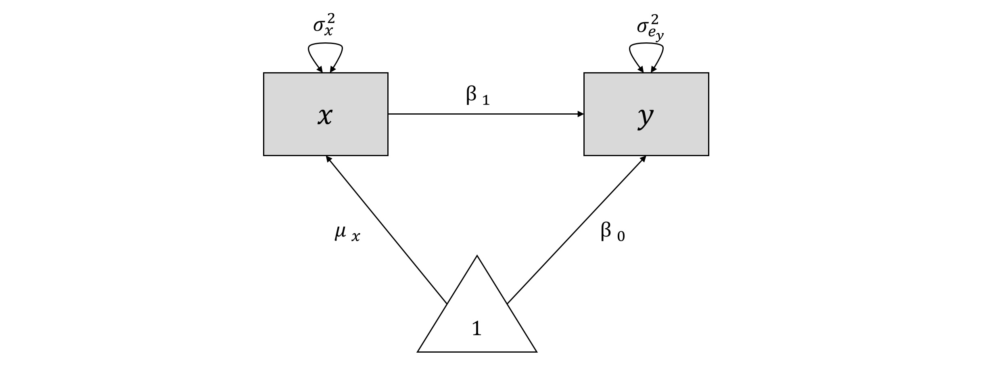
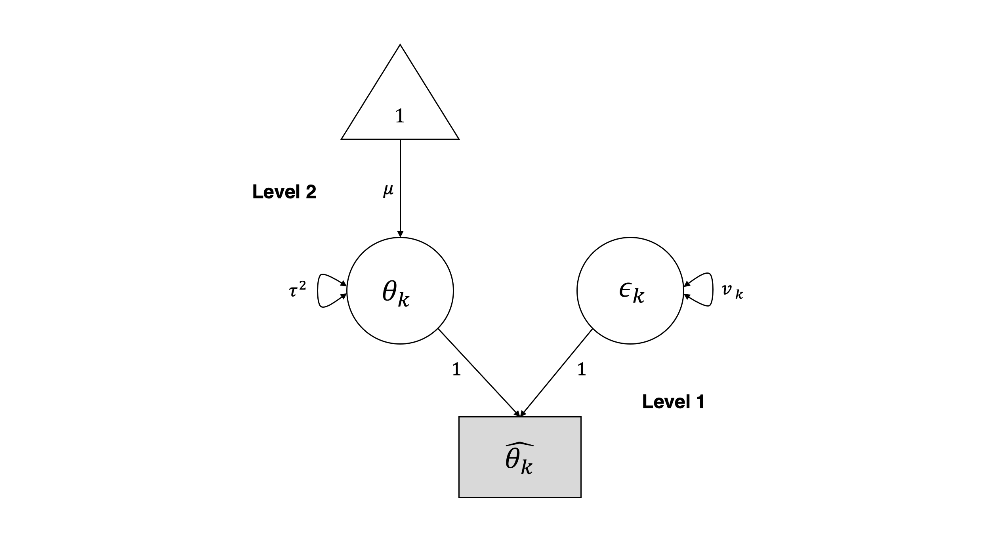

# Structural Equation Modeling Meta-Analysis {#sem}


$$ $$

In the past Chapter on [Three-Level Meta-Analysis Models](#mlma), we were able to generalize our conceptual knowledge on meta-analyses by showing that meta-analysis models have an **inherent multilevel structure**, which can be used to extend conventional meta-analysis models to three-level models. A peculiar thing about statistical methods is that they are often put into seperate "boxes", and treated as unrelated in research and practice, when in fact they are not. For many social scientists, for example, it is often surprising to find out that Analysis of Variance (ANOVA) and dummy-coded Regression are doing essentially the [same thing](https://www.theanalysisfactor.com/why-anova-and-linear-regression-are-the-same-analysis/) [@montgomery2001design]. This often happens because two methods are traditionally used in different contexts, and taught as separate entities. 

It might thus have been only fairly recently that researchers recognized that **multilevel models** are simply a special form of a **Structural Equation Model**, or **SEM** [@bauer2003estimating; @mehta2005people]. As said before, every meta-analysis model is in itself a multilevel model, so this association also has exciting implications for meta-analysts: **we can treat our meta-analysis as a structural equation model**, in which the pooled effect size we want to estimate is the **latent** (or unobserved) variable [@cheung2015metasem; @cheung2015meta]. This does not only mean that we can model previous types of meta-analyses we presented before from a SEM perspective, but also allows us to use structural equation modeling to test more complex models meta-analytically. This is a great advantage; for example, using this approach, we can test **mediation** models, **factor analytic** models, or perform **multivariate meta-analyses** based on effect size data obtained from several independent studies. This is a great way to evaluate if certain models or theories in the literature are actually correct if we use all available evidence, if the theory's assumptions are not backed by the evidence, or, even more interestingly, if the theory does only apply to a subgroup of individuals or entities.

## The idea behind Meta-Analytic SEM


```{block, type='rmdinfo'}
**What is Structural Equation Modeling?**

Structural Equation Modeling (SEM) is a statistical technique to model and test hypotheses about the relationship of **manifest** (observed) and (usually) **latent** (unobserved or unobservable) variables [@kline2015principles]. Latent variables, as said, are either not observed or observable (personality, for example, is a latent construct which can only be measured indirectly, for example through different items in a questionnaire). In SEM, the assumed relationship between the manifest and latent variables (the "structure") can be modeled using the manifest, measured variables while taking their measurement error into account. 

SEM analysis is somewhat different to "conventional" statistical tests (e.g., $t$-tests). Usually, for example in a $t$-test, the researcher tests agains a null hypthesis, such as $H_0:\mu_1 = \mu_2$ (where $\mu_1$ and $\mu_1$ are the means of to groups). The researchers "aims" to *reject* the null hypothesis to conclude that the two groups differ. In SEM, a specific model is proposed beforehand instead, and the researcher "aims" to *accept* this model if the **goodness of fit** is sufficient [@cheung2015meta]. 

```


### Model Specification

Usually, SEM are specified and represented mathematically as a series of **matrices**. You can think of a matrix as a simple table containing rows and columns, much like a `data.frame` object in *R* (in fact, most `data.frame`s can be easily converted to a matrix using the `as.matrix()` function). Visually, SEM can be represented as **path diagrams**. Such path diagrams are often very intuitive, so we will start specifying a SEM using this approach first, and then move on to the matrix notation.

#### Path Diagrams

Path diagrams represent the mathematical model of our SEM graphically. There is no full consensus on how path diagrams should be drawn, yet there are a few conventions. Here are the main components of path diagrams, and how they are represented.


```{r,echo=FALSE, warning=FALSE, message=FALSE}
library(knitr)
Code<-c("$\\square$", "$\\circ$", "$\\triangle$", "$\\rightarrow$", "$\\leftrightarrow$")

Name = c("Rectangle", "Circle", "Triangle", "Arrow", "Double Arrow")

Description<-c("Manifest/observed variables",
               "Latent/unobserved variables",
               "Intercept (fixed vector of 1s)",
               "Prediction. The variable at the start of the arrow predicts the variable at the end of the arrow: Predictor $\\rightarrow$ Target.",
               "(Co-)Variance. If a double arrow connects two variables (rectangles/circles), it signifies the covariance/correlation between the two variables. If a double arrow forms a loop on one single variable, it signifies the variance of the variable.")
m<-data.frame(Code,Name, Description)
names<-c("Symbol","Name","Description")
colnames(m)<-names
kable(m, escape = FALSE)
```


As an illustration, let us create path diagram for a simple linear (non-meta-analytic) regression model, in which we want to predict $y$ with $x$. The model formula looks like this:

$$y_i = \beta_0 + \beta_1x_i + e_i$$
In this model, $x_i$ and $y_i$ are the observed variables. There are no unobserved variables. The parameter $\mu_x$ is the population mean of $x$, while the population mean of $y$ is the regression intercept, $\beta_0$. The variance of our observed data for $x$ is $\sigma^{2}_{x}$. Provided that $x$ is not a perfect predictor of $y$, there will be some amount of error variance $\sigma^{2}_{e_y}$ in our predictions associated with $y$. There are two regression coefficients: $\beta_0$, the intercept, and $\beta_1$, the slope coefficient of $x$.  

**Using these components, we can build a graphical model for a simple univariate linear regression:**




We can also use this graphical model as a starting point to reassemble the regression model equation. From the model, we can infer that $y$ is influenced by two components: $x\beta_1$ and $1*\beta_0$. If we add these two parts together, we again arrive at the formula for $\hat{y}$ from before. 

#### Matrix Representation

There are several common ways to represent SEM mathematically through matrices [@joreskog2006lisrel; @muthen2012mplus; @mcardle1984some]. Here, we will focus on the **Reticular Action Model** formulation, or RAM [@mcardle1984some], because this formulation is used by the `metaSEM` package we will be introducing later on. In the RAM, four matrices are specified: $\mathbf{F}$, $\mathbf{A}$, $\mathbf{S}$ and $\mathbf{M}$. Because the $\mathbf{M}$ matrix is not necessary to fit the meta-analytic SEM we will present later, we omit it here (see @cheung2015meta for a more extensive introduction). We will now specify the remaining three matrices for our linear regression from before. The three matrices all have the same number of rows and columns, corresponding with the (manifest and latent) variables we have in our model: $x$ and $y$. The generic structure for all matrices therefore looks like this:


**The $\mathbf{A}$ Matrix: Single Arrows**

The $\mathbf{A}$ matrix represents the asymmetrical (single) arrows in our path model. The way to fill this matrix is to search for the matrix **column entry** of the variable in which the arrow starts ($x$), and then for the matrix **row entry** of the variable in which the arrow ends ($y$). We put the value of our arrow, $\beta_1$, where the selected column and row intersect in the matrix ($i_{y,x}$). Given that there are no more paths between the variables in our matrix, we fill all other fields with $0$. The $\mathbf{A}$ for our example therefore looks like this:


**The $\mathbf{S}$ Matrix: Double Arrows/Variances**

The $\mathbf{A}$ matrix represents the (co)variances we want to estimate for the included variables. For $x$, our predictor, we want to estimate the variance $\sigma^{2}_{x}$. For our estimated regression target $\hat{y}$, we want to know the error variance $\sigma^{2}_{e_y}$. We therefore specify $\mathbf{A}$ like this:


**The $\mathbf{F}$ Matrix: Observed Variables**

The $\mathbf{F}$ matrix allows us to specify the observed (vs. latent) variables in our model. To specify that a variable has been observed, we simply insert $1$ in the respective diagonal field of the matrix. Given that both $x$ and $y$ are observed in our model, we put $1$ in all diagonal fields of the matrix:


Once these matrices are set, it is possible to estimate the parameters in our SEM, and to derive how good the specified model fits the data using matrix algebra and **Maximum-Likelihood** estimation. We omit how these steps are performed here. If you are interested in understanding the details behind this step, you can have a look at @cheung2015meta, @mcardle1984some, or this [blog post](https://towardsdatascience.com/probability-concepts-explained-maximum-likelihood-estimation-c7b4342fdbb1). 


### Meta-Analysis from a SEM perspective

We will now combine our knowledge about [meta-analysis models](#random) and SEM to formulate the random/fixed-effect model as a structural equation model [@cheung2008model].

To begin, let us return to the formula of the **random-effects model** first. Previously, we already described that the random-effects model follows a [multilevel structure](#mlma), which looks like this:

**Level 1:**

$$
  \hat\theta_k = \theta_k + \epsilon_k
$$

**Level 2:**

$$
  \theta_k = \mu + \zeta_k
$$

On the first level, we assume that the effect size $\hat{\theta}_k$ we observe for some study $k$ in our meta-analysis is an estimator for the true effect size of $k$, $\theta_k$; the observed effect size $\hat{\theta}_k$ deviates from the true effect size $\theta_k$ because of the sampling error $\epsilon_k$, the variance of which is $Var(\epsilon_k)=v_i$.

In a random-effects model, we assume that even the true effect size for $k$ is only drawn from a "super-population" of true effect sizes at level 2. The mean of this "super-population" $\mu$ is what we want to estimate as the pooled effect in a random-effects model, along with the variance of the "super-population", $Var(\zeta_k) = \tau^2$: the [between-study heterogeneity](#heterogeneity). The fixed-effect model is only a special case of the random-effects model where we assume that $\tau^2$ is zero.

It is quite straightforward to represent this model as a SEM graph if we use the variables on level 1 as **latent variables** to "explain" how the effect sizes we observed came into being [@cheung2015meta]:



In this graphical model, it becomes clear that the observed effect size $\hat{\theta}_k$ in the $k$th study is "influenced" by two arms: by the sampling error $\epsilon_k$ with variance $v_k$, and the true effect size $\theta_k$ with variance $\tau^2$.

### The Two-Stage Meta-Analytical SEM approach

Above, we defined the (random-effects) meta-analysis model from a SEM perspective. Although this is interesting from a theoretical standpoint, the model above is still not more or less capable than the meta-analysis techniques we learned before: it simply pools effect sizes assuming a random-effects model. 

To really use the versatility of meta-analytic SEM, an approach involving two steps is required [@tang2016testing; @cheung2015meta]. In **Two-Stage Structural Equation Modeling** (TSSEM), we first  **pool the effect sizes** from each study (usually correlations between variables we want to use for modeling). This allows for evaluating the heterogeneity of the pooled effect sizes, and if a random-effects model or subgroup analyses should be used. Using the maximum-likelihood-based approach used by the `metaSEM` package we will introduce in the following, even studies with **missing data** can be included.

In the second step, **weighted least squares** (WLS) estimation is used to fit the structural equation model we specified. The function for the specified model $\mathbf{\rho}(\mathbf{\theta})$ is [@cheung2009two; @cheung2015meta]:

$$ F_{WLS}(\mathbf{\theta}) =  (\mathbf{r} - \mathbf{\rho}(\mathbf{\theta}))^\top \mathbf{V}^{-1} (\mathbf{r} - \mathbf{\rho}(\mathbf{\theta}))$$

Where $\mathbf{r}$ is a transformation of the pooled correlation matrix. The important part in this formula is $\mathbf{V}^{-1}$, the matrix containing the covariances of $\mathbf{r}$, from which the inverse is taken. This approach is quite similar to the [inverse-variance](#fixed) principle (see Chapter 4) traditionally used in meta-analysis. It gives effects with lower variance (i.e., greater precision/$N$) a larger weight in the estimation process. This is also a good way to account for the uncertainty in our estimates which may have been introduced by missing data. Importantly, the formula for this second step is the same whether we assume a random or fixed-effect model, because the between study-heterogeneity, if existant, is already taken care of in step 1.


## Multivariate Meta-Analysis

Now it is time to start working in *R* on our first worked example of a meta-analytic SEM. We will begin with using the SEM-based approach for **multivariate meta-analysis**, which has not been covered before. In multivariate meta-analyses, each study contributes more than just one effect size at the same time. This may be helpful in cases where we are studying a problem or condition for which there are several main outcomes, not just one. For example, for some type of treatment, there could be two types of outcomes which are deemed as important in the literature, and are thus assessed in most studies [@schwarzer2015meta]. In multivariate meta-analyses, we can estimate the effect sizes for both outcomes simultaneously in one model. Taking the correlation between the two outcomes into account, we can also determine if **studies with a high effect size on one outcome also have higher effect size on the other outcome**, or if there is no or a negative relationship.

It is of note here that multivariate meta-analysis can also be performed outside a SEM framework [@schwarzer2015meta]. Nevertheless, as an introduction, we will to show you how multivariate meta-analysis can be performed from a SEM perspective. In this and the following examples, we will work with `metaSEM`, an magnificent package for meta-analytic SEM developed by Mike Cheung [@cheungpackage]. To begin, always, install the `metaSEM` package and load it from your library.

```{r, message=FALSE, warning=FALSE}
library(metaSEM)
```


