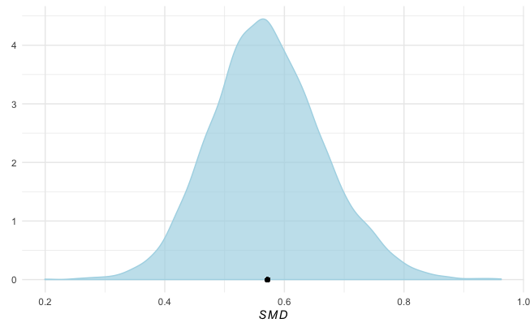
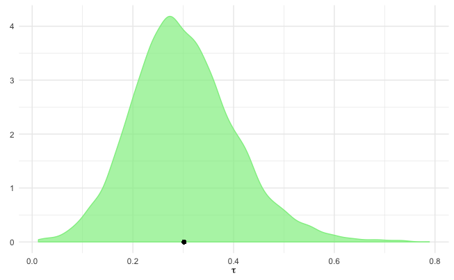

# Bayesian Meta-Analysis {#bayesianma}


After delving into rather advanced extensions of Meta-Analysis, such as [Network Meta-Analysis](#netwma) and [Multilevel Meta-Analysis](#mlma), let us now take one step back and look at "conventional" meta-analytical models again, but this time from another angle. In this chapter, we will deal with **Bayesian Meta-Analysis**. In its essence, Bayesian Meta-Analysis aims to do the same thing as the meta-analytic techniques we covered [before](#pool): to pool effect sizes (usually of different studies) into one overall effect. The difference, however, is that Bayesian Meta-Analysis uses a different statistical approach to achieve this. Luckily, if you have worked through the previous chapters already, you already learned about the key components of Bayesian Meta-Analysis models, which we now only have to put together. 


```{block,type='rmdinfo'}

**The idea behind Bayesian Meta-Analysis**

The model we apply in Bayesian Meta-Analysis is a so-called **Bayesian Hierarchical Model** [@rover2017bayesian; @higgins2009re]. In the chapter on [Multilevel Meta-Analysis](#mlma), we already covered that every meta-analytical model inherently possesses a **multilevel, and thus "hierarchical", structure**. On the first level, we have the individual participants. The data on this level usually reaches us meta-analysts in the form of calculated effect sizes $\hat\theta_k$ of each study $k$. On the second level, we assume that these participants are nested within studies, and that the true effect sizes $\theta_k$ of different studies in our meta-analysis follow their own distribution, with a mean $\mu$ (the pooled "true" effect we want to estimate) and variance $\tau^2$, the between-study heterogeneity. 

Let us formalize this a little more: on the first level, we assume that the observed effect size $\hat\theta_k$ we find reported in a study is an estimate of the "true" effect $\theta_k$ in this study. The observed effect $\hat\theta_k$ deviates from $\theta_k$ due to the sampling error $\epsilon_k$. This is because we assume that $\hat\theta_k$ was drawn (sampled) from the (normal) distribution of all effects in study $k$. The distribution of effects in $k$ has a mean of $\theta_k$, the "true" effect of the study, and a variance $\sigma^2$. In the second step, we assume that the true effect sizes $\theta_k$ themselves are only samples of an overarching distribution of true effect sizes. The mean of this distribution $\mu$ is the pooled effect size we want to estimate; the effects $\theta_k$ deviate from $\mu$ because this overarching distribution also has a variance $\tau^2$, the between-study heterogeneity. Taken together, the formula then looks like this:

$$ \hat\theta_k \sim \mathcal{N}(\theta_k,\sigma_k^2) $$
$$ \theta_k \sim \mathcal{N}(\mu,\tau^2) $$

Here, we use $\mathcal{N}$ to indicate that distributions from which effects were sampled follow a normal distribution. Some may argue that this is a unnecessarily strict assumption for the second equation [@higgins2009re], but the formulation as shown here is the one that can be found most of the time. As covered before, the fixed-effect model is simply a special case of this model in which we assume that $\tau^2 = 0$, meaning that there is no between-study heterogeneity, and that all studies share one single true effect size (i.e., that for all studies $k$, $\theta_k = \mu$). We can also simplify this formula a little by using the [**marginal**](https://sites.nicholas.duke.edu/statsreview/jmc/) form [@rover2017bayesian]:

$$ \hat\theta_k | \mu, \tau, \sigma_k \sim \mathcal{N}(\mu,\sigma_k^2 + \tau^2)$$

You may have already detected that these formulae look a lot like the ones we defined before when discussing multilevel models. Indeed, there is nothing particularly bayesian about this formulation; the same model is assumed in the previous meta-analytic techniques we have covered. The make it bayesian, we add the following term to our model [@williams2018bayesian]:

$$(\mu, \tau^2) \sim p(.)$$
$$ \tau^2 > 0 $$

The first line is particularly important, as it defines [**prior distributions**](##bayesnma) for the parameters $\mu$ and $\tau^2$. This allows us to specify a priori how we assume that the true pooled effect size $\mu$ and between-study heterogeneity $\tau^2$ will look like, and how certain we are about this. The second part constrains the between-study heterogeneity to be larger than zero. The formulation of the first equation does not specify which exact prior distribution we could or should assume for $\mu$ and $\tau^2$; we will cover reasonable, specific priors for our meta-analysis models in more detail later.

In the chapter on network meta-analysis, we already covered the methodology through which bayesian models estimate the true pooled effect we want to calculate. To recap, this involves **Markov Chain Monte Carlo** based sampling procedures, such as the **Gibbs Sampler**. In the `brms` package we will be using in this chapter, the **No-U-Turn Sampler**, or NUTS [@hoffman2014no], is used.

In the previous chapters, we introduced the `meta` and `metafor` packages, which use non-bayesian, or [**frequentist**](#frequentist) statistics to calculate meta-analyses. You may therefore be wondering why one should use bayesian methods, given that we already possess such powerful implementations using "conventional" approaches. However, Bayesian Meta-Analysis has some distinct advantages [@williams2018bayesian; @mcneish2016using; @chung2013nondegenerate] :

* Bayesian methods allow to directly model the **uncertainty** when estimating $\tau^2$, and have been found to be **superior in estimating the between-study heterogeneity and pooled effect**, particularly when the **number of included studies is small** (which is very often the case in real-world applications).
* Bayesian methods produce full **posterior distributions** for both $\mu$ and $\tau^2$, which allows to calculate **actual probabilities** that $\mu$ or $\tau^2$ is smaller or larger than some specific value. This is in contrast to frequentist methods, where only calculate confidence intervals. Yet, (95%) confidence intervals only state that if data sampling were repeated many, many times, the true value of a population parameter (such as $\mu$ or $\tau^2$) will fall into the range of the confidence interval in 95% of the samples.
* Bayesian methods allow us to **integrate prior knowledge and assumptions** when calculating meta-analyses.
```

<br></br>

**Setting the priors**

Before, we have set up the Bayesian Hierarchical Model we can use to pool effects in a Bayesian Meta-Analysis. As part of the model, we have to specify the **priors** for $\mu$ and $\tau^2$ we want to use. Particularly when the number of studies is small, priors can have a considerable impact on the resulting estimates, so our selection should be reasonable. It has been argued that a good approach is to use **weakly informative priors** [@williams2018bayesian]. Weaky informative priors can be contrasted with **non-informative priors**. Non-informative priors usually encompass **uniform distributions**, through which we represent that all values are equally likely to be true. Weakly informative priors, on the other hand, include distributions which represent that we do indeed have **some confidence that some values are more credible than others**, while still not making any overly specific statements about the exact true value of the parameter. This should intuitively make sense, and is also applicable to meta-analysis. In most applied cases, it seems reasonable to assume that the true effect size we want to estimate must lie somewhere between, for example, Cohen's $d=-2.0$ and $d=2.0$, but will unlikely be hovering around $d=50$. A good starting point for our $\mu$ prior may therefore be a normal distribution with mean $0$ and variance $1$. This means that we grant a 95% prior probability that the true pooled effect size $\mu$ lies between $d=-2.0$ and $d=2.0$:

$$ \mu \sim \mathcal{N}(0,1)$$

The next prior we have to specify is the one for $\tau^2$. This is a little more difficult, since we know that $\tau^2$ should in any case be non-negative, but can very likely be close to zero. A recommended distribution for this case, and one which is often used for variances such as $\tau^2$, is the **Half-Cauchy** prior. The Half-Cauchy distribution is a special case of a Cauchy distribution which is only defined for one "half" (i.e., the positive side) of the distribution. The Half-Cauchy distribution is defined by two parameters, the **location parameter** $x_0$, specifying the peak of the distribution on the x-axis, and $s$, the scaling parameter, specifying how heavy-tailed (i.e., how much the distribution "spreads" out to higher values) the distribution is. It can be formalized as $\mathcal{HC}(x_0,s)$. 

**The illustration below shows the Half-Cauchy distribution for varying values of** $s$, **with the value of** $x_0$ **fixed at 0**.

```{r, echo=FALSE, fig.width=6, fig.align='center'}
library(png)
library(grid)
img <- readPNG("_figs/half_cauchy.png")
grid.raster(img)
```

The Half-Cauchy distribution has rather **heavy tails**, which makes it particularly useful as a prior distribution for $\tau$. The heavy-tailedness ensures that we still give very high values of $\tau$ some probability, while at the same time assuming that lower values are more likely. In most applied cases, we can assume that $\tau$ (the square root of $\tau^2$) lies somewhere around $0.3$, or is at least remotely of this magnitude. As a specification of the Half-Cauchy prior, we may therefore set $s=0.3$, because this ensures that a value of less than $\tau=0.3$ has a 50% probability [@williams2018bayesian]. We can confirm this by using the Half-Cauchy distribution function as implemented in the `phcauchy` function of the `extraDistr` package.

```{r, message=F, warning=F}
library(extraDistr)
phcauchy(0.3, sigma = 0.3)
```

However, this is already a rather specific assumption about the true value of $\tau$. A more conservative approach, which we will follow here, is to set $s$ to 0.5, which makes the distribution flatter. **In general, it is advised to always conduct sensitivity analyses with different prior specifications to check if they affect the results substantially**. Using $s=0.5$ as our specification of the Half-Cauchy distribution, we can formalize our $\tau$ prior like this:


$$ \tau \sim \mathcal{HC}(0,0.5)$$

We can now assemble the formulae of the hierarchical model and our prior specifications. This leads us to the **complete model** we want to use for our Bayesian Meta-Analysis:


$$ \hat\theta_k \sim \mathcal{N}(\theta_k,\sigma_k^2) $$

$$ \theta_k \sim \mathcal{N}(\mu,\tau^2) $$
$$ \mu \sim \mathcal{N}(0,1)$$
$$ \tau \sim \mathcal{HC}(0,0.5)$$

## Bayesian Meta-Analysis in R using the `brms` package


Now that we have defined the Bayesian model for our meta-analysis, it is time to **implement it in R**. Here, we will use the `brms` package [@brms1; @brms2] to fit our model. The `brms` package is a very versatile and powerful tool to fit Bayesian regression models. It can be used for huge range of applications, including multilevel (mixed-effects) models, generalized linear models, multivariate models, nonlinear, and generalized additive models, to name just a few. Most of these applications use person-level data, but `brms` can also be easily used for meta-analysis, where we deal with (weighted) study-level data. We chose the `brms` here because it offers a **vast amount of functionalities**, and because it is **very user friendly**. Furthermore, the `brms` package is, at least primarily, a package for **multilevel models**; this means that it may help us further understand the multilevel nature of Bayesian Meta-Analysis models "by doing". It should be noted that there are also other great resources for Bayesian Meta-Analysis, for example the [`bayesmeta`](https://cran.r-project.org/web/packages/bayesmeta/index.html) package [@bayesmeta], which may be worth looking into. 

### Fitting a Bayesian Meta-Analysis Model

Before we start fitting the model, we first have to **install and load** the `brms` package. If you are having trouble installing or running functions in the package, you might find this [forum](https://discourse.mc-stan.org/) helpful.

```{r, eval=F}
install.packages("brms")
library(brms)
```

```{r, echo=F, message=F, warning=F}
library(brms)
```

In this example, I will use my `ThirdWave` dataset, which contains data of a **real-world meta-analysis** investigating the **effects of "Third-Wave" psychotherapies in college students**. The data is identical to the `madata` dataset we used in [Chapter 4](#fixed). The dataset is part of the [`dmetar`](#dmetar) package. If you have the package installed already, you have to load it into your library first.

```{r, eval=FALSE}
library(dmetar)
```

If you don't want to use the `dmetar` package, you can download the `madata` dataset in the **Datasets section** of this guide.

Before we fit the model, let us first **define the priors** for the true pooled effect size $\mu$ and the between-study heterogeneity $\tau$. Previously, we specified that $\mu \sim \mathcal{N}(0,1)$ and $\tau \sim \mathcal{HC}(0,0.5)$. We can use the `prior` function to specify priors. The function takes two arguments: in the first argument, we specify the distribution we want to assume for our prior, including the distribution parameters. In the second argument, we have to define the `class` of the prior. For $\mu$, the appropriate class is `Intercept`, since it is a fixed population-level effect. For $\tau$, the class is `sd`, because it is a variance. We can define both priors using the `prior` function, then concatenate them using `c()`, and save the resulting object as `priors`. The code then looks like this:

```{r, eval=F}
priors <- c(prior(normal(0,1), class = Intercept),
            prior(cauchy(0,0.5), class = sd))
```


We can then proceed and fit the model. To do this, we can use the `brm` function in the `brms` package. The function has many parameters, but only a few are relevant for us:

* `formula`: In this argument, the **formula for the model** is specified. `brms` uses a **regression formula notation**, in which an outcome (in our case, the effect size) `y` is predicted by one or more variables `x`. A tilde (`~`) is used to specify that there is a predictive relationship: `y ~ x`. Meta-analyses are somewhat special, because we do not have a predictor variable of the effect size (unless when performing meta-regression), so `x` has to be replaced with `1`, indicating an **intercept only model**. Furthermore, we cannot simply use the effect size of each study in isolation as the predicted response `y`; we also have to give studies with a larger sample size (and thus greater precision of the effect size estimate) **a greather weight**. This can be done by using `y|se(se_y)` instead of only `y`, where the `se(se_y)` part stands for the standard error of each effect size `y` in our data. If we want to use a random-effects model, the last step is to add a **random-effects term** `(1|study)` to the predictor part of the formula. This specifies that we assume that the effect sizes in `y` are **nested within studies**, the true effects of which are themselves random draws from an overarching population of true effect sizes. If we want to use a fixed-effect model, we can simply omit this term. The full formula for a random-effects model may therefore look something like this: `y|se(se_y) ~ 1 + (1|random)`. For more information on the formula setup for `brm` models, you can type `?brmsformula` in your Console and then hit Enter to open the documentation.
* `data`: The **dataset** to be used for our meta-analysis.
* `prior`: The **priors** we want to use for our model. In our case, we can simply plug in the `priors` object we created previously here.
* `iter`: The **number of iterations** the MCMC algorithm should run. The more complex your model, the higher this number should be. However, more iterations also mean that the function will take longer to finish.

Before we go on, let us first have a look at the structure of my `ThirdWave` dataset.

```{r}
str(ThirdWave[,1:3])
```

We see that there are three relevant columns in the `data.frame`: `TE`, which contains the calculated effect size of each study, expressed as the Standardized Mean Difference (SMD), `seTE`, the standard error corresponding to each effect size, and `Author`, a unique identifier for each study/effect size.

**I want to save my Bayesian Meta-Analysis model as `m`. Using this data, the code for my model looks like this:**

```{r, eval=F}
m.brm <- brm(TE|se(seTE) ~ 1 + (1|Author),
             data = ThirdWave,
             prior = priors,
             iter = 4000)
```

Please be aware that Bayesian methods are much more computationally intensive compared to the standard meta-analytic techniques we covered before; it may therefore take a few minutes until the sampling is completed.

### Assessing Convergence

Before we start analyzing the results, we have to make sure that the model has **converged** (i.e., if the MCMC algorithm found the optimal solution). If this is not the case, the parameters are not trustworthy and **should not be interpreted**. Non-convergence can happen very frequently in Bayesian models and can often be solved by rerunning the model with more **iterations** (`iter`). Generally, we should do two things: first, conduct **posterior predictive checks**, and secondly, check the $\hat{R}$ values of the parameter estimates.

In posterior predictive checks, data are simulated through random draws from the *posterior predictive distribution*, which are then compared to the observed data. If a model has converged, we would expect that the density of the **replications are roughly similar to the ones of the observed data**. This can easily be controlled by using the `pp_check` function.

```{r, echo=F}
load("_data/m_brm.rda")
```

```{r, eval=F}
pp_check(m.brm)
```


```{r, echo=FALSE, fig.align='center'}
library(png)
library(grid)
img <- readPNG("_figs/pp_check.png")
grid.raster(img)
```


The $\hat{R}$ value, on the other hand, represents the **Potential Scale Reduction Factor** (PSRF) we already covered when discussing [Bayesian Network Meta-Analysis](#mcmcconv). Here, the value of $\hat{R}$ should be smaller than $1.01$. To check this, we can produce a `summary` of our `m.brm` object, which also includes the $\hat{R}$ under `Rhat`.

```{r}
summary(m.brm)
```
 
As we can see, the `Rhat` value for both parameters is 1, signifying convergence. This means that we can start interpreting the results. 

### Interpreting the Results

We can start interpreting the results by looking at the `Group-Level Effects` in our `summary` output first. This section is reserved for **random effects** we defined in our formula (`+ (1|Author)`). Since we are dealing with a random-effects meta-analysis here, the variable `~Author`, signifying the individual studies, has been modeled with a **random intercept**. As we described before, this represents our assumption on level 2 that each study has its own "true" effect size, which has been sampled from an overarching distribution of true effect sizes. We also see that our group-level effect has 18 levels, corresponding with the $k=18$ studies in our data. We see that the `Estimate` of our between-study heterogeneity (`sd(Intercept)`) is $\tau = 0.30$, closely resembling our initial "best guess" when setting the priors. By using the `ranef` function, we can also extract the estimated deviation of each study's "true" effect size from the pooled effect:

```{r}
ranef(m.brm)
```


The next part of the output we want to interpret are the `Population-Level Effects`. This section represents the **"fixed" population effects** we modeled. In our case, the population we are dealing with is the overarching distribution of effect sizes in our meta-analysis, and the fixed population effect is its mean $\mu$: the **pooled effect size**.

In the output, we see that the `Estimate` of the pooled effect size is $SMD = 0.57$, with the 95\% credibility interval (not confidence interval!) ranging from $95\% CrI: 0.40-0.77$. This indicates that there is in fact a moderate-sized overall effect of the interventions studied in this meta-analysis. Because this is a Bayesian Model after all, you won't find any $p$-values here, but this example should underline that we can also make reasonable inferences without having to resort to significance testing. A great thing we can do in Bayesian Meta-Analysis, but not in frequentist meta-analysis, is model the parameters we want to estimate **probabilistically**. The Bayesian model not only estimates the parameters of interest, but a whole **posterior distribution** for $\tau$ and $\mu$, which we can access quite easily. To do this, we can use the `posterior_samples` function. 

```{r}
post.samples <- posterior_samples(m.brm, c("^b", "^sd"))
names(post.samples)
```

The resulting `data.frame` contains two columns: `b_Intercept`, the posterior sample data for the pooled effect size, and `sd_Author_Intercept`, the one for the between-study heterogeneity $\tau$. We rename the columns `smd` and `tau` to make the name more informative.

```{r}
names(post.samples) <- c("smd", "tau")
```

Using the `ggplot2` package, we can make a **density plot** of the posterior distributions, using the data in `post.samples`. The code to do this looks like this:

```{r, eval=F}
library(ggplot2)

# Plot for SMD
ggplot(aes(x = smd), data = post.samples) +
  geom_density(fill = "lightblue", color = "lightblue", alpha = 0.7) +
  geom_point(y = 0, x = mean(post.samples$smd)) +
  labs(x = expression(italic(SMD)),
       y = element_blank()) +
  theme_minimal()

# Plot for tau
ggplot(aes(x = tau), data = post.samples) +
  geom_density(fill = "lightgreen", color = "lightgreen", alpha = 0.7) +
  geom_point(y = 0, x = mean(post.samples$tau)) +
    labs(x = expression(tau),
       y = element_blank()) +
  theme_minimal()
```


**This is the output we get:**

<center>
{width=350px} {width=350px}
</center>

We see that the posterior distributions follow a unimodal, and roughly normal distribution, peaking around the values for $\mu$ and $\tau$ we saw in the output. The fact that Bayesian methods create an actual sampling distribution for our parameters of interest means that we can calculate **exact probabilities** that $\mu$ or $\tau$ will be **larger than some specific value**. For example, we may have found in previous literature that if effects of an intervention are below $SMD=0.30$, they are not meaningful anymore for the type of patients we are studying. We could therefore calculate the probability that the pooled effect is in fact $SMD=0.30$ or smaller, based on our model. This can be done by looking at the **Empirical Cumulative Distribution Function** (ECDF), which lets us select one specific value $X$, and returns the probability of some value $x$ being smaller than $X$ based on the data. The ECDF of the posterior distribution for the pooled effect size can be seen below:


```{r, warning=F, message=F, fig.width=7, fig.height=5, fig.align='center', echo=F}
library(ggplot2)
smd.ecdf = ecdf(post.samples$smd)
ecdf.dat = data.frame(smd = 1:1000/1000,
                      p = smd.ecdf(1:1000/1000))

ggplot(aes(x = smd, y = p), data = ecdf.dat) +
  geom_vline(xintercept = mean(post.samples$smd), color = "grey") +
  geom_line(size = 2, color = "darkblue") +
  theme_minimal() +
  labs(x = "SMD", y = "Cumulative Probability") +
  ggtitle("ECDF: Posterior Distribution of the Pooled Effect Size")

```

We can use the `ecdf` function to implement the ECDF in R, and then check the probability of our pooled effect being smaller than 0.30. The code looks like this.

```{r}
smd.ecdf <- ecdf(post.samples$smd)
smd.ecdf(0.3)
```

We see that with 0.21\%, the probability of our pooled effect being smaller than $SMD = 0.30$ is **very, very low**. In this scenario, this would mean that the effects of the interventions we find in this meta-analysis are very likely to be meaningful.


<br></br>

## Forest Plots for Bayesian Meta-Analysis


As you have seen before, Bayesian models allow us to extract their sampled posterior distribution, which can be extremely helpful to directly assess the probability of specific values given our model. We can exploit this feature of Bayesian models to create enhanced **Forest Plots** which are both very informative and pleasing to the eye (see blog posts by [A. Salomon Kurz](https://solomonkurz.netlify.com/post/bayesian-meta-analysis/) and [Matti Vuorre](https://github.com/mvuorre/brmstools) for more information). Unfortunately, there is currently no maintained "pre-packaged" function to create such forest plots, but it is possible to **build one oneself** using functions of the `tidybayes` package. So, let us first **load this package** along with a few other ones before we proceed.

```{r, message=F, warning=F}
library(tidybayes)
library(dplyr)
library(ggplot2)
library(ggridges)
library(glue)
library(stringr)
library(forcats)
```

Before we can generate the plot, we have to **prepare the data**. In particular, we need to **extract the posterior distribution for each study individually** (since forest plots also depict the specific effect size of each study). To achieve this, we can use the `spread_draws` function in the `tidybayes` package. The function needs three arguments as input: our fitted `brms` model, the random-effects factor by which the results should be indexed, and the parameter we want to extract (here `b_Intercept`, since we want to extract the fixed term, the effect size). Using the **pipe operator** `%>%`, we can directly manipulate the output; using the `mutate` function in `dplyr`, we calculate the actual effect size of each study by adding the pooled effect size `b_Intercept` to the estimated deviation for each study. We save the result as `study.draws`.

```{r}
study.draws <- spread_draws(m.brm, r_Author[Author,], b_Intercept) %>% 
  mutate(b_Intercept = r_Author + b_Intercept)
```

Next, we want to **generate the distribution of the pooled effect** in a similar way (since in forest plots, the summary effect is usally displayed in the last row). We therefore slightly adapt the code from before, dropping the second argument to only get the pooled effect. The call to `mutate` only adds an extra column called "Author". We save the result as `pooled.effect.draws`.

```{r}
pooled.effect.draws <- spread_draws(m.brm, b_Intercept) %>% 
  mutate(Author = "Pooled Effect")
```

Next, we bind `study.draws` and `pooled.effect.draws` together in one data frame. We then start a pipe again, calling `ungroup` first, and then using `mutate` to (1) clean the study labels (i.e., replace dots with spaces), and (2) reorder the study factor levels by effect size. This is the **data we will need for plotting**, so we save it as `forest.data`.

```{r}
forest.data <- bind_rows(study.draws, pooled.effect.draws) %>% 
   ungroup() %>%
   mutate(Author = str_replace_all(Author, "[.]", " ")) %>% 
   mutate(Author = reorder(Author, b_Intercept))
```

Lastly, we also need summarized data (the mean and credibility interval) of each study. To do this, we use our newly generated `forest.data` dataset, group it by Author, and then use the `mean_qi` function to calculate the values. We save the output as `forest.data.summary`.

```{r}
forest.data.summary <- group_by(forest.data, Author) %>% 
  mean_qi(b_Intercept)
```

$$~$$

Here is the complete code for you to copy, paste, and adapt:

```{r, eval=F}
study.draws <- spread_draws(m.brm, r_Author[Author,], b_Intercept) %>% 
  mutate(b_Intercept = r_Author + b_Intercept)

pooled.effect.draws <- spread_draws(m.brm, b_Intercept) %>% 
  mutate(Author = "Pooled Effect")

forest.data <- bind_rows(study.draws, pooled.effect.draws) %>% 
   ungroup() %>%
   mutate(Author = str_replace_all(Author, "[.]", " ")) %>% 
   mutate(Author = reorder(Author, b_Intercept))

forest.data.summary <- group_by(forest.data, Author) %>% 
  mean_qi(b_Intercept)

```

$$~$$

**We are now ready to generate the forest plot using the `ggplot2` package. The code to generate the plot looks like this:**

```{r, message=F, fig.align="center"}
ggplot(aes(b_Intercept, relevel(Author, "Pooled Effect", after = Inf)), 
       data = forest.data) +
  geom_vline(xintercept = fixef(m.brm)[1, 1], color = "grey", size = 1) +
  geom_vline(xintercept = fixef(m.brm)[1, 3:4], color = "grey", linetype = 2) +
  geom_vline(xintercept = 0, color = "black", size = 1) +
  geom_density_ridges(fill = "blue", rel_min_height = 0.01, col = NA, scale = 1,
                      alpha = 0.8) +
  geom_pointintervalh(data = forest.data.summary, size = 1) +
  geom_text(data = mutate_if(forest.data.summary, is.numeric, round, 2),
    aes(label = glue("{b_Intercept} [{.lower}, {.upper}]"), x = Inf), hjust = "inward") +
  labs(x = "Standardized Mean Difference",
       y = element_blank()) +
  theme_minimal()
```

Looks good!

```{block,type='rmdachtung'}
One thing is very important to mention here: the effect sizes displayed in the forest plot do **not represent the observed effect sizes** (i.e., the effect sizes we find reported in the original studies), but the **estimate** of the "true" **effect size** ($\theta_k$) **of a study** based on the Bayesian model. The effect sizes shown in the forest plot are equivalent to the study-wise estimates we saw when extracting the random effects using `ranef(m.brm)` (except that these were centered around the pooled effect size). 
```


<br></br>


