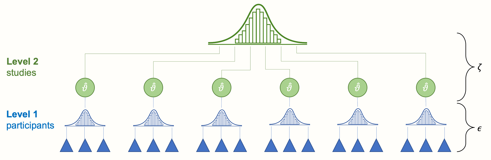
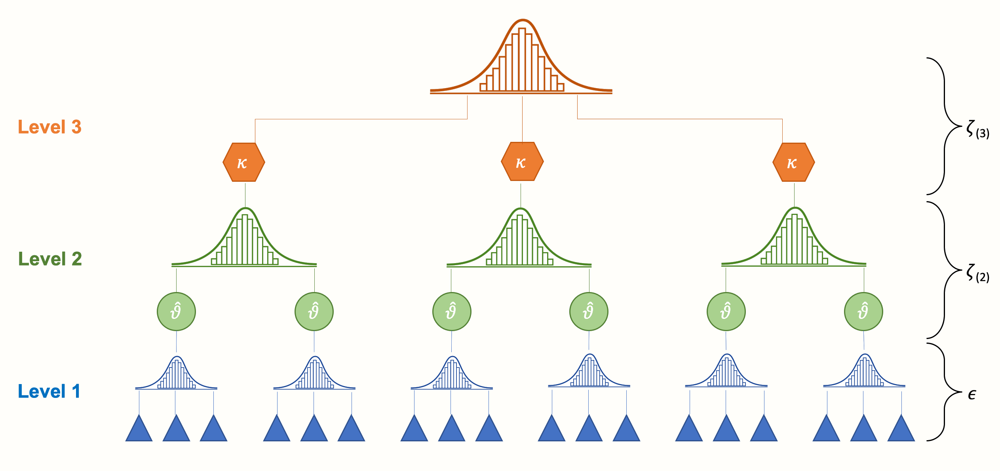

# (PART) Advanced Methods {-}

# "Multilevel" Meta-Analysis {#multilevel-ma}

---


<br></br>

\index{Multilevel Meta-Analysis}

<span class="firstcharacter">W</span>
elcome to the advanced methods section. In the previous part of the guide, we took a deep dive into topics that we consider highly relevant for almost every meta-analysis. With this background, we can now proceed to somewhat more advanced techniques. 

We consider the following methods "advanced" because their mathematical underpinnings are more involved, or because of their implementation in _R_. However, if you have worked yourself through the previous chapters of the guide, you should be more than well equipped to understand and implement the contents that are about to follow. Many of the following topics merit books of their own, and what we cover here should only be considered as a brief introduction. Where useful, we will therefore also provide literature for further reading. 

This first chapter deals with the topic of "multilevel" meta-analyses. You probably wonder why we put the word "multilevel" into quotation marks. Describing a study as a "multilevel" meta-analysis insinuates that this is something special or extraordinary compared to "standard" meta-analyses. 

Yet, that is not true. Every meta-analytic model presupposes a multilevel structure of our data to pool results [@pastor2018multilevel]. In the chapters before, we have already fitted a multilevel (meta-analysis) model several times--without even knowing. 

When people talk about multilevel meta-analysis, what they think of are **three-level meta-analysis models**. Such models are indeed somewhat different to the fixed-effect and random-effects model we already know. In this chapter, we will therefore first describe why meta-analysis naturally implies a multilevel structure of our data, and how we can extend a conventional meta-analysis to a three-level model. As always, we will also have a look at how such models can be fitted in _R_ using a hands-on example. 

<br></br>

## The Multilevel Nature of Meta-Analysis {#multilevel-nature}

---

To see why meta-analysis has multiple levels by default, let us go back to the formula of the random-effects model that we discussed in Chapter \@ref(rem):

\begin{equation}
\hat\theta_k = \mu + \epsilon_k + \zeta_k
(\#eq:mlm1)
\end{equation}

\index{Sampling Error}

We discussed that the terms $\epsilon_k$ and $\zeta_k$ are introduced in a random-effects model because we assume that there are two sources of variability. The first one is caused by the sampling error ($\epsilon_k$) of individual studies, which leads effect size estimates to deviate from the true effect size  $\theta_k$. 

The second one, $\zeta_k$, represents the between-study heterogeneity. This heterogeneity is caused by the fact that the true effect size of some study $k$ is again only part of an overarching **distribution of true effect sizes**. This distribution is from where the individual true effect size $\theta_k$ was drawn. Therefore, our aim in the random-effects model is to estimate the mean of the distribution of true effect sizes, denoted with $\mu$.

The two error terms $\epsilon_k$ and $\zeta_k$ correspond with the two levels in our meta-analysis data: the "participant" level (level 1) and the "study" level (level 2). Figure \@ref(fig:multilevel1) below symbolizes this structure. 

\vspace{2mm}

```{r multilevel1, message = F, out.width = '100%', echo = F, fig.align='center', fig.cap="Multilevel structure of the conventional random-effects model."}
library(OpenImageR)

```

\vspace{2mm}

At the lowest level (level 1) we have the participants (or patients, specimens, etc., depending on the research field). These participants are part of larger units: the studies included in our meta-analysis. This overlying layer of studies constitutes our second level. 

When we conduct a meta-analysis, data on level 1 usually already reaches us in a "pooled" form (e.g. the authors of the paper provide us with the mean and standard deviation of their studied sample instead of the raw data). Pooling on level 2, the study level, however, has to be performed as part of the meta-analysis. Traditionally, such type of data is called **nested**: one can say that participants are "nested" within studies.

\index{Random-Effects Model}

Let us go back to the random-effects model formula in equation \@ref(eq:mlm1). Implicitly, this formula already describes the multilevel structure of our meta-analysis data. To make this more obvious, we have to split the equation into two formulas, where each corresponds to one of the two levels. If we do this, we get the following result: 


\vspace{4mm}

**Level 1 (participants) model:**

\begin{equation}
\hat\theta_k = \theta_k + \epsilon_k 
(\#eq:mlm2)
\end{equation}

\vspace{2mm}

**Level 2 (studies) model:**

\begin{equation}
\theta_k = \mu + \zeta_k
(\#eq:mlm3)
\end{equation}

\vspace{2mm}

You might have already detected that we can substitute $\theta_k$ in the first equation with its definition in the second equation. What we then obtain is a formula exactly identical to the one of the random-effects model from before. The fixed-effects model can also be written in this way--we only have to set $\zeta_k$ to zero. Evidently, our plain old meta-analysis model already has multilevel properties "built in". It exhibits this property because we assume that participants are nested within studies in our data.

This makes it clear that meta-analysis naturally possesses a multilevel structure. It is possible to expand this structure even further in order to better capture certain mechanisms that generated our data. This is where **three-level models** [@cheung2014modeling; @assink2016fitting] come into play.

\index{Unit-of-Analysis Problem}

Statistical independence is one of the core assumptions when we pool effect sizes in a meta-analysis. If there is a dependency between effect sizes (i.e. effect sizes are correlated), this can artificially reduce heterogeneity and thus lead to false-positive results. This issue is known as the **unit-of-analysis error**, which we already covered before (see Chapter \@ref(unit-of-analysis)). Effect size dependence can stem from different sources [@cheung2014modeling]:

* **Dependence introduced by the authors of the individual studies**. For example, scientists conducting the study may have collected data from multiple sites, compared multiple interventions to one single control group, or used different questionnaires to measure the same outcome. In all of these scenarios, we can assume that some kind of dependency is introduced within the reported data.

* **Dependence introduced by the meta-analyst herself**. As an example, think of a meta-analysis that focuses on some psychological mechanism. This meta-analysis includes studies which were conducted in different cultural regions of the world (e.g. East Asian and Western European societies). Depending on the type of psychological mechanism, it could be that results of studies conducted in the same cultural region are more similar compared to those conducted in a different culture.

We can take such dependencies into account by integrating a third layer into the structure of our meta-analysis model. For example, one could model that effect sizes based on different questionnaires are nested within studies. Or one could create a model in which studies are nested within cultural regions. This creates a three-level meta-analysis model, as illustrated by the next figure.

\vspace{2mm}

```{r multilevel2, message = F, out.width = '100%', echo = F, fig.align='center'}
library(OpenImageR)

```

\vspace{2mm}

\index{Cluster Effect}

We see that a three-level model contains three pooling steps. First, researchers themselves "pool" the results of individual participants in their primary studies, and report the aggregated effect size. Then, on level 2, these effect sizes are nested within several **clusters**, denoted by $\kappa$. These cluster can either be individual studies (i.e. many effect sizes are nested in one study), or subgroups of studies (i.e. many studies are nested in one subgroup, where each study contributes only one effect size). 

Lastly, pooling the aggregated cluster effects leads to the overall true effect size $\mu$. Conceptually, this average effect is very close to the pooled true effect $\mu$ in a fixed- or random-effects model. The difference, however, is that it is based on a model in which we explicitly account for dependent effect sizes in our data. 

It is possible to write down the formula of the three-level model using the same level notation we used before. The greatest distinction is that now, we need to define three formulas instead of two:

\vspace{4mm}

**Level 1 model:**

\begin{equation}
\hat\theta_{ij} = \theta_{ij} + \epsilon_{ij}
(\#eq:mlm4)
\end{equation}

\vspace{2mm}

**Level 2 model:**

\begin{equation}
\theta_{ij} = \kappa_{j} + \zeta_{(2)ij}
(\#eq:mlm5)
\end{equation}

\vspace{2mm}

**Level 3 model:**

\begin{equation}
\kappa_{j} = \mu + \zeta_{(3)j}
(\#eq:mlm6)
\end{equation}

\vspace{2mm}

Where $\hat\theta_{ij}$ is an estimate of the true effect size $\theta_{ij}$. The term $ij$ can be read as "some effect size $i$ nested in cluster $j$". Parameter $\kappa_{j}$ is the average effect size in cluster $j$, and $\mu$ the overall average population effect. Like before, we can piece these formulas together and thus reduce the formula to one line:

\begin{equation}
\hat\theta_{ij} = \mu + \zeta_{(2)ij} + \zeta_{(3)j} + \epsilon_{ij}
(\#eq:mlm7)
\end{equation}

We see that, in contrast to the random-effects model, this formula now contains **two** heterogeneity terms. One is $\zeta_{(2)ij}$, which stands for the **within-cluster** heterogeneity on level 2 (i.e. the **true** effect sizes within cluster $j$ follow a distribution with mean $\kappa_j$). The other is $\zeta_{(3)j}$, the **between-cluster** heterogeneity on level 3. Consequentially, fitting a three-level meta-analysis model does not only involve the estimation of one heterogeneity variance parameter $\tau^2$. We have to estimate two $\tau^2$ values: one for level 2, and the other for level 3. 

\index{meta Package}
\index{metafor Package}

The **{metafor}** package is particularly well suited for fitting meta-analytic three-level models. It uses (restricted) maximum likelihood procedures to do so. Previously, we primarily used functions of the **{meta}** package to run meta-analyses. We did this because this package is a little less technical, and thus better suited for beginners. Yet, the **{metafor}** package, as we have seen in Chapter \@ref(multiple-metareg-R), is also fairly easy to use once the data is prepared correctly. How exactly one can use **{metafor}** to fit three-level models in _R_ will be the topic of the next section. 


<br></br>

## Fitting Three-Level Meta-Analysis Models in _R_ {#multilevel-R}

---

As mentioned before, we need the **{metafor}** package to fit three-level meta-analysis models. Therefore, we need to load it from our library first.


```{r, message=F, warning=F}
library(metafor)
```


In our hands-on example, we will use the `Chernobyl` data set. This data set is loosely based on a real meta-analysis which examined the correlation between ionizing radiation ("nuclear fallout") and mutation rates in humans, caused by the devastating [1986 Chernobyl reactor disaster](https://www.britannica.com/event/Chernobyl-disaster) [@moller2015strong]. 

\index{dmetar Package}

```{block, type='boxdmetar'}
**The "Chernobyl" Data Set**

\vspace{2mm}

The `Chernobyl` data set is part of the **{dmetar}** package. If you have installed **{dmetar}**, and loaded it from your library, running `data(Chernobyl)` automatically saves the data set in your _R_ environment. The data set is then ready to be used. 

If you do not have **{dmetar}** installed, you can download the data set as an _.rda_ file from the [Internet](https://www.protectlab.org/meta-analysis-in-r/data/Chernobyl.rda), save it in your working directory, and then click on it in your R Studio window to import it. 

```

```{r, message=F, warning=F}
# Load data set from 'dmetar'
library(dmetar)
data("Chernobyl")
```


To see the general structure of the data, we can use the `head` function. This prints the first six rows of the data frame that we just loaded into our global environment.

```{r, message=F, warning=F, eval=F}
head(Chernobyl)
```
```
##                       author  cor   n    z se.z var.z radiation es.id
## 1 Aghajanyan & Suskov (2009) 0.20  91 0.20 0.10  0.01       low  id_1
## 2 Aghajanyan & Suskov (2009) 0.26  91 0.27 0.10  0.01       low  id_2
## 3 Aghajanyan & Suskov (2009) 0.20  92 0.20 0.10  0.01       low  id_3
## 4 Aghajanyan & Suskov (2009) 0.26  92 0.27 0.10  0.01       low  id_4
## 5     Alexanin et al. (2010) 0.93 559 1.67 0.04  0.00       low  id_5
## 6     Alexanin et al. (2010) 0.44 559 0.47 0.04  0.00       low  id_6
```

\index{Fisher's \textit{z}}

The data set contains eight columns. The first one, `author`, displays the name of the study. The `cor` column shows the (un-transformed) correlation between radiation exposure and mutation rates, while `n` stands for the sample size. The columns `z`, `se.z`, and `var.z` are the Fisher-$z$ transformed correlations (Chapter \@ref(pearson-cors)), as well their standard error and variance. The `radiation` column serves as a moderator, dividing effect sizes into subgroups with low and high overall radiation exposure. The `es.id` column simply contains a unique ID for each effect size (i.e. each row in our data frame). 

A peculiar thing about this data set is that it contains repeated entries in `author`. This is because most studies in this meta-analysis contributed more than one observed effect size. Some studies used several methods to measure mutations or several types of index persons (e.g. exposed parents versus their offspring), all of which leads to multiple effects per study. 

Looking at this structure, it is quite obvious that effect sizes in our data set are not independent. They follow a nested structure, where various effect sizes are nested in one study. Thus, it might be a good idea to fit a three-level meta-analysis in order to adequately model these dependencies in our data.

<br></br>

### Model Fitting

---

A three-level meta-analysis model can be fitted using the `rma.mv` function in **{metafor}**. Here is a list of the most important arguments for this function, and how they should be specified:

* **`yi`**. The name of the column in our data set which contains the calculated effect sizes. In our example, this is `z`, since Fisher-$z$ transformed correlations have better mathematical properties than "untransformed" correlations.

* **`V`**. The name of the column in our data set which contains the **variance** of the calculated effect sizes. In our case, this is `var.z`. It is also possible to use the **squared** standard error of the effect size, since $SE_k^2 = v_k$. 

* **`slab`**. The name of the column in our data set which contains the study labels, similar to `studlab` in **{meta}**.

* **`data`**. The name of the data set.

* **`test`**. The test we want to apply for our regression coefficients. We can choose from `"z"` (default) and `"t"` (recommended; uses a test similar to the Knapp-Hartung method).

* **`method`**. The method used to estimate the model parameters. Both `"REML"` (recommended; restricted maximum-likelihood) and `"ML"` (maximum likelihood) are possible. Please note that other types of between-study heterogeneity estimators (e.g. Paule-Mandel) are not applicable here.

The most important argument, however, is **`random`**. Arguably, it is also the trickiest one. In this argument, we specify a formula which defines the (nested) random effects. For a three-level model, the formula always starts with `~ 1`, followed by a vertical bar `|`. Behind the vertical bar, we assign a **random effect** to a grouping variable (such as studies, measures, regions, etc.). This grouping variable is often called a **random intercept** because it tells our model to assume different effects (i.e. intercepts) for each group. 

In a three-level model, there are two grouping variables: one on level 2, and another on level 3. We assume that these grouping variables are nested: several effects on level 2 together make up a larger cluster on level 3. 

There is a special way through which we can tell `rma.mv` to assume such nested random effects. We do this using a slash (`/`) to separate the higher- and lower-level grouping variable. To the left of `/`, we put in the level 3 (cluster) variable. To the right, we insert the lower-order variable nested in the larger cluster. Therefore, the general structure of the formula looks like this: `~ 1 | cluster/effects_within_cluster`. 

In our example, we assume that individual effect sizes (level 2; defined by `es.id`) are nested within studies (level 3; defined by `author`). This results in the following formula: `~ 1 | author/es.id`. The complete `rma.mv` function call looks like this:

\vspace{2mm}

```{r}
full.model <- rma.mv(yi = z, 
                     V = var.z, 
                     slab = author,
                     data = Chernobyl,
                     random = ~ 1 | author/es.id, 
                     test = "t", 
                     method = "REML")
```

We gave the output the name `full.model`. To print an overview of the results, we can use the `summary` function.

```{r, eval=F}
summary(full.model)
```
```
## Multivariate Meta-Analysis Model (k = 33; method: REML)
## [...]   
## Variance Components:
## 
##             estim    sqrt  nlvls  fixed        factor 
## sigma^2.1  0.1788  0.4229     14     no        author 
## sigma^2.2  0.1194  0.3455     33     no  author/es.id 
## 
## Test for Heterogeneity:
## Q(df = 32) = 4195.8268, p-val < .0001
## 
## Model Results:
## 
## estimate      se    tval    pval   ci.lb   ci.ub 
##   0.5231  0.1341  3.9008  0.0005  0.2500  0.7963  *** 
## [...]
```

First, have a look at the `Variance Components`. Here, we see the random-effects variances calculated for each level of our model. The first one, `sigma^2.1`, shows the level 3 **between-cluster** variance. In our example, this is equivalent to the between-study heterogeneity variance $\tau^2$ in a conventional meta-analysis (since clusters represent studies in our model). 

The second variance component `sigma^2.2` shows the variance **within** clusters (level 2). In the `nlvls` column, we see the number of groups on each level. Level 3 has 14 groups, equal to the $K=$ 14 included studies. Together, these 14 studies contain 33 effect sizes, as shown in the second row. 

\index{esc Package}

Under `Model Results`, we see the estimate of our pooled effect, which is $z=$ 0.52 (95%CI: 0.25--0.80). To facilitate the interpretation, it is advisable to transform the effect back to a normal correlation. This can be done using the `convert_z2r` function in the **{esc}** package:

```{r}
library(esc)
convert_z2r(0.52)
```
We see that this leads to a correlation of approximately $r \approx$ 0.48. This can be considered large. There seems to be a substantial association between mutation rates and exposure to radiation from Chernobyl. 

The `Test for Heterogeneity` in the output points at true effect size differences in our data ($p<$ 0.001). This result, however, is not very informative. We are more interested in the precise amount of heterogeneity variance captured by each level in our model. It would be good to know how much of the heterogeneity is due to differences **within** studies (level 2), and how much is caused by **between**-study differences (level 3).


<br></br>

### Distribution of Variance Across Levels

---

\index{I$^2$, Higgins \& Thompson's}

We can answer this question by calculating a multilevel version of $I^2$ [@cheung2014modeling]. In conventional meta-analyses, $I^2$ represents the amount of variation not attributable to sampling error (see Chapter \@ref(i-squared); i.e. the between-study heterogeneity). In three-level models, this heterogeneity variance is split into two parts: one attributable to true effect size differences **within** clusters, and the other to **between**-cluster variation. Thus, there are two $I^2$ values, quantifying the percentage of total variation associated with either level 2 or level 3. 

\index{dmetar Package}

```{block, type='boxdmetar'}
**The "var.comp" Function**

\vspace{4mm}

The `var.comp` function in **{dmetar}** can be used to calculate multilevel $I^2$ values. Once **{dmetar}** is installed and loaded on your computer, the function is ready to be used. If you did **not** install **{dmetar}**, follow these instructions:

\vspace{2mm}

1. Access the source code of the function [online](https://raw.githubusercontent.com/MathiasHarrer/dmetar/master/R/mlm.variance.distribution.R). 
2. Let _R_ "learn" the function by copying and pasting the source code in its entirety into the console (bottom left pane of R Studio), and then hit "Enter".
3. Make sure that the **{ggplot2}** package is installed and loaded.

```


The `var.comp` function only needs a fitted `rma.mv` model as input. We save the output in `i2` and then use the `summary` function to print the results. 

```{r}
i2 <- var.comp(full.model)
summary(i2)
```

In the output, we see the percentage of total variance attributable to each of the three levels. The sampling error variance on level 1 is very small, making up only roughly 1%. The value of $I^2_{\text{Level 2}}$, the amount of heterogeneity variance within clusters, is much higher, totaling roughly 40%. The largest share, however, falls to level 3. Between-cluster (here: between-study) heterogeneity makes up $I^2_{\text{Level 3}}=$ 59% of the total variation in our data. 

Overall, this indicates that there is substantial between-study heterogeneity on the third level. Yet, we also see that a large proportion of the total variance, more than one third, can be explained by differences **within studies**.

It is also possible to visualize this distribution of the total variance. We only have to plug the  `var.comp` output into the `plot` function. 


```{r, warning=F, message=F, fig.width=5, fig.height=5, out.width="55%", fig.align='center'}
plot(i2)
```

<br></br>

### Comparing Models

---

\index{Occam's Razor}

Fitting a three-level model only makes sense when it represents the variability in our data better than a two-level model. When we find that a two-level model provides a fit comparable to a three-level model, **Occam's razor** should be applied: we favor the two-level model over the three-level model, since it is less complex, but explains our data just as well.

Fortunately, the **{metafor}** package makes it possible to compare our three-level model to one in which a level is removed. To do this, we use the `rma.mv` function again; but this time, set the variance component of one level to zero. This can be done by specifying the `sigma2` parameter. We have to provide a vector with the generic form `c(level 3, level 2)`. In this vector, we fill in `0` when a variance component should be set to zero, while using `NA` to indicate that a parameter should be estimated from the data. 

In our example, it makes sense to check if nesting individual effect sizes in studies has improved our model. Thus, we fit a model in which the level 3 variance, representing the between-study heterogeneity, is set to zero. This is equal to fitting a simple random-effects model in which we assume that all effect sizes are independent (which we know they are not). Since level 3 is held constant at zero, the input for `sigma2` is `c(0, NA)`. This results in the following call to `rma.mv`, the output of which we save under the name `l3.removed`.

\vspace{2mm}


```{r, echo=F}
l3.removed <- rma.mv(yi = z, 
                     V = var.z, 
                     slab = author,
                     data = Chernobyl,
                     random = ~ 1 | author/es.id, 
                     test = "t", 
                     method = "REML",
                     sigma2 =  c(0, NA))

```


```{r,eval=F}
l3.removed <- rma.mv(yi = z, 
                     V = var.z, 
                     slab = author,
                     data = Chernobyl,
                     random = ~ 1 | author/es.id, 
                     test = "t", 
                     method = "REML",
                     sigma2 =  c(0, NA))

summary(l3.removed)
```

```
## [...]
## Variance Components:
## 
##             estim    sqrt  nlvls  fixed        factor 
## sigma^2.1  0.0000  0.0000     14    yes        author 
## sigma^2.2  0.3550  0.5959     33     no  author/es.id 
## 
## Test for Heterogeneity:
## Q(df = 32) = 4195.8268, p-val < .0001
## 
## Model Results:
## 
## estimate      se    tval    pval   ci.lb   ci.ub 
##   0.5985  0.1051  5.6938  <.0001  0.3844  0.8126  *** 
## [...]
```

\index{Analysis of Variance}

In the output, we see that `sigma^2.1` has been set to zero--just as intended. The overall effect has also changed. But is this result better than the one of the three-level model? To assess this, we can use the `anova` function to compare both models.

```{r, eval=F}
anova(full.model, l3.removed)
```

```
##         df   AIC   BIC  AICc logLik   LRT   pval      QE 
## Full     3 48.24 52.64 49.10 -21.12              4195.82 
## Reduced  2 62.34 65.27 62.76 -29.17 16.10 <.0001 4195.82
```


We see that the `Full` (three-level) model, compared to the `Reduced` one with two levels, does indeed show a better fit. The Akaike (AIC) and Bayesian Information Criterion (BIC) are lower for this model, which indicates favorable performance. The likelihood ratio test (`LRT`) comparing both models is significant ($\chi^2_1=$ 16.1, $p<$ 0.001), and thus points in the same direction. 

We can say that, although the three-level model introduces one additional parameter (i.e. it has 3 degrees of freedom instead of 2), this added complexity seems to be justified. Modeling of the nested data structure was probably a good idea, and has improved our estimate of the pooled effect.

However, please note that there are often good reasons to stick with a three-level structure--even when it does **not** provide a significantly better fit. In particular, it makes sense to keep a three-level model when we think that it is based on a solid theoretical rationale. 

When our data contains studies with multiple effect sizes, for example, we **know** that these effects can not be independent. It thus makes sense to keep the nested model, since it more adequately represents how the data were "generated". If the results of `anova` in our example had favored a two-level solution, we would have concluded that effects within studies were **largely** homogeneous. But we likely would have reported results of the three-level model anyway. This is because we know that a three-level model represents the data-generating process better. 

The situation is somewhat different when the importance of the cluster variable is unclear. Imagine, for example, that clusters on level 3 represent different cultural regions in a three-level model. When we find that the phenomenon under study shows no variation between cultures, it is perfectly fine to drop the third level and use a two-level model instead. 

<br></br>

## Subgroup Analyses in Three-Level Models {#three-level-subgroup}

---

\index{Subgroup Analysis}
\index{Moderator Analysis}

Once our three-level model is set, it is also possible to assess putative moderators of the overall effect. Previously in this guide, we discovered that subgroup analyses can be expressed as a meta-regression model with a dummy-coded predictor (Chapter \@ref(the-metareg-model)). In a similar vein, we can add regression terms to a "multilevel" model, which leads to a **three-level mixed-effects model**:


\begin{equation}
\hat\theta_{ij} = \theta + \beta x_i + \zeta_{(2)ij} + \zeta_{(3)j} + \epsilon_{ij}
(\#eq:mlm8)
\end{equation}

Where $\theta$ is the intercept and $\beta$ the regression weight of a predictor variable $x$. When we replace $x_i$ with a dummy (Chapter \@ref(the-metareg-model)), we get a model that can be used for subgroup analyses. When $x$ is continuous, the formula above represents a three-level meta-regression model.   

Categorical or continuous predictors can be specified in `rma.mv` using the `mods` argument. The argument requires a formula, starting with a tilde (`~`), and then the name of the predictor. Multiple meta-regression is also possible by providing more than one predictor (e.g. `~ var1 + var2`). 

In our `Chernobyl` example, we want to check if correlations differ depending on the overall amount of radiation in the studied sample (low, medium, or high). This information is provided in the `radiation` column in our data set. We can fit a three-level moderator model using this code:

\vspace{2mm}

```{r, message=F, warning=F, eval=F}
mod.model <- rma.mv(yi = z, V = var.z, 
                    slab = author, data = Chernobyl,
                    random = ~ 1 | author/es.id, 
                    test = "t", method = "REML",
                    mods = ~ radiation)

summary(mod.model)
```

```
## [...]
## Test of Moderators (coefficients 2:3):
## F(df1 = 2, df2 = 28) = 0.4512, p-val = 0.6414
## 
## Model Results:
##                 estimate    se   tval  pval  ci.lb ci.ub 
## intrcpt             0.58  0.36   1.63  0.11  -0.14  1.32    
## radiationlow       -0.19  0.40  -0.48  0.63  -1.03  0.63    
## radiationmedium     0.20  0.54   0.37  0.70  -0.90  1.31    
## [...]
```

The first important output is the `Test of Moderators`. We see that $F_{2, 28}=$ 0.45, with $p=$ 0.64. This means that there is no significant difference between the subgroups. 

The `Model Results` are printed within a meta-regression framework. This means that we cannot directly extract the estimates in order to obtain the pooled effect sizes within subgroups. 

The first value, the intercept (`intrcpt`), shows the $z$ value when the overall radiation exposure was high ($z=$ 0.58). The effect in the low and medium group can be obtained by adding their `estimate` to the one of the intercept. Thus, the effect in the low radiation group is $z$ = 0.58 - 0.19 = 0.39, and the one in the medium exposure group is $z$ = 0.58 + 0.20 = 0.78. 

```{block2, type='boxreport'}
**Reporting the Results of Three-Level (Moderator) Models**

\vspace{2mm}

When we report the results of a three-level model, we should at least mention the estimated variance components alongside the pooled effect. The `rma.mv` function denotes the random-effects variance on level 3 and 2 with $\sigma^2_1$ and $\sigma^2_2$, respectively. 

When we report the estimated variance, however, using $\tau^2_{\text{Level 3}}$ and $\tau^2_{\text{Level 2}}$ may be preferable since this makes it clear that we are dealing with variances of **true (study) effects** (i.e. heterogeneity variance). Adding the multilevel $I^2$ values also makes sense, since they are easier for others to interpret--provided we first explain what they represent. 

\vspace{2mm}

When you conducted a model comparison using `anova`, you may at least report the results of the likelihood ratio test. Results of moderator analyses can be reported in a table such as the one presented in Chapter \@ref(subgroup-R). Here is one way to report the results in our example:

> _"The pooled correlation based on the three-level meta-analytic model was $r=$ 0.48 (95%CI: 0.25-0.66; $p$ < 0.001). The estimated variance components were $\tau^2_{\text{Level 3}}=$ 0.179 and $\tau^2_{\text{Level 2}}=$ 0.119. This means that $I^2_{\text{Level 3}}=$ 58.22% of the total variation can be attributed to between-cluster, and $I^2_{\text{Level 2}}=$ 31.86% to within-cluster heterogeneity. We found that the three-level model provided a significantly better fit compared to a two-level model with level 3 heterogeneity constrained to zero ($\chi^2_1=$ 16.10; $p$< 0.001)."_

```

<br></br>

## Robust Variance Estimation {#rve}

---

In the last chapters, we introduced **three-level meta-analytic models**, and how they can be used to model **dependencies between effect sizes** in our data. The **hierarchical** model that we fitted before clearly provides a **better representation** of our data set than a "conventional" meta-analysis, which assumes that all effect sizes are **completely independent**. But it is still a **simplification of reality**. In practice, there are often forms of dependence between effect sizes that are **more complex** than what is currently captured by our nested model.

We already see this when we go back to our `Chernobyl` data set. In the data, most studies provide **more than one effect size**, but the **reason** for this **differs between studies**. Some studies compared the effect of radiation in **different target populations**, and therefore reported more than one effect size. Others used different methods on the **same sample**, which also means that the study provides more than one effect size. 

When several effect sizes in one study are based on the same sample, we expect their **sampling errors** (the $\epsilon_{ij}$ terms in equation 10.7 and 10.8 in Chapters \@ref(multilevel-nature) and \@ref(three-level-subgroup), respectively) to be **correlated**. This, however, is not yet captured by our three-level model. Our model above assumes that, within clusters/studies, the correlation (and thus the covariance) between sampling errors is zero. Or, to put it differently, it assumes that, **within** one cluster or study, effect size estimates are **independent**. 

```{r multilevel3, message = F, out.width = '100%', echo = F, fig.align='center', fig.cap="In its original form, the three-level (hierarchical) model assumes that effect size estimates within studies or clusters are independent."}
library(OpenImageR)
knitr::include_graphics('images/multilevel-model3_col_sep.png')
```


In this section, we will therefore devote some time to an extended three-level architecture, the so-called **Correlated and Hierarchical Effects** (CHE) model [@pustejovsky2021meta]. Like our previous (hierarchical) three-level model, the CHE model allows to **combine** several effect sizes **into larger clusters**, based on certain commonalities (e.g. because they stem from the same study, work group, cultural region, etc.). 

But in addition, this model also explicitly takes into account that some effect sizes within clusters are **based on the same sample** (e.g. because several measurements were taken), and that their sampling errors are therefore **correlated**. In many real-life scenarios, the CHE model should therefore provide a **good starting point**; especially when the dependence structure in our data is **complex**, or only **partially known** [@pustejovsky2021meta]^[Pustejovsky and Tipton [-@pustejovsky2021meta] also provide a decision-tree to determine if and when the CHE model is appropriate (see [Figure 1](https://link.springer.com/content/pdf/10.1007/s11121-021-01246-3.pdf)). You can use this heuristic as a way to check if the CHE model provides the best assumptions for your data, or if another working model is more reasonable.].

Along with the CHE model, we will also discuss **Robust Variance Estimation** (RVE) in meta-analytic contexts [@hedges2010robust; @tipton2015small; @tipton2015small2]. This is a set of methods which has been frequently used to handle dependent effect sizes in meta-analyses in the past. In its core, RVE revolves around the so-called **Sandwich estimator**. This estimator can be used in combination with the CHE model (as well as other meta-analytic models) to obtain robust confidence intervals and $p$-values; even when our selected model does **not capture** the intricate **dependence structure** of our **data perfectly well**.

Thus, before fitting our first CHE model, let us start with an **overview of meta-analytic RVE** as well as the **Sandwich estimator**, and explore why the latter bears such an appetizing name. 

<br></br>

### The Sandwich-Type Variance Estimator {#sandwich}

---

In published meta-analyses, the term "robust variance estimation" is sometimes used in a **peculiar way**, which may lead one to believe that this is a specific method **only applicable** for meta-analytic data with dependent effect sizes. The opposite is true. The robust variance estimator has originally been developed as a method for **conventional regression models**, where it is used to calculate the **variance of regression weights** $\hat\beta$ [see e.g. @aronow2019foundations, chapter 4.2.2]. 

It is called a "robust" estimator because it provides a **consistent estimate** of the asymptotic **standard error(s)**; even when usual **assumptions** of linear models **are not met**^[One of these assumptions is the homogeneity of the residual variance, known as **homoskedasticity**. Homoskedasticity, among other assumptions, is required for "classical" estimators of the coefficient variance to be valid.]. Robust estimates of the coefficient variance in a regression model are crucial. The variance estimate^[Or rather its **square root**, since this represents the **standard error** of the coefficient: $\sqrt{V_{\hat\beta}}={SE}_{\hat\beta}$.] is used to calculate **confidence intervals** around the estimated regression weight, as well as $p$-values, and thus has direct implications on the inferences we draw from a model. 

The type of robust variance estimator we cover here is simply a **special version** of the original method used in "normal" regression models. Hedges, Tipton and Jackson [-@hedges2010robust] laid out an **adapted type** of RVE that can be used for **meta-regression** models with **dependent effect sizes**, and this approach has been extended in the last years few years. 

To understand it, we first have to look at the **formula** of a meta-regression again. Conceptually, this formula is very similar to equation 8.2 presented in Chapter \@ref(the-metareg-model). We simply display it differently using **matrix notation**^[In this chapter, we largely follow the notation of Hedges, Tipton and Jackson [-@hedges2010robust] and its follow-up papers when discussing meta-analytic RVE.]:

\begin{equation}
\boldsymbol{T}_{j}=\boldsymbol{X}_{j}\boldsymbol{\beta} + \boldsymbol{u}_j +\boldsymbol{e}_j
(\#eq:mlm9)
\end{equation}


This formula simply tells us that some **effect sizes** in $\boldsymbol{T}$ are predicted by **regression weights** $\beta$ associated with certain **covariates** in $\boldsymbol{X}$. It also tells us that, besides the **sampling error** (symbolized by $\boldsymbol{e}_j$), there are **random effects** for each study (denoted by $\boldsymbol{u}_j$), thus producing a (mixed-effects) meta-regression model. 

The special thing are the subscript $j$'s in our formula. They, along with the **letters** in our formula being **bold**, symbolize that each study or cluster $j$ in our data set provides, or can provide, **more than one effect size**. Say that $n_j$ is the number of effect sizes in some study $j$. The effect sizes in $j$ can then be written down as the column vector we see in the formula: $\boldsymbol{T}_j = (T_{j,1}, \dots, T_{j,{n_j}})^\top$. Similarly, $\boldsymbol{X}_j$ is the **design matrix** containing the covariate values of some study $j$:

\begin{equation}
\boldsymbol{X}_j =
\begin{bmatrix}
 x_{1,1}    & \cdots & x_{1,p}    \\ 
 \vdots     & \ddots & \vdots     \\
 x_{n_j,1}  & \cdots & x_{n_j,p}
\end{bmatrix}
(\#eq:mlm10)
\end{equation}


Where $p-1$ is the total number of covariates^[In a linear regression model, a **design matrix** (or **model matrix**) contains all **covariate values** used to estimate the regression coefficients. In its easiest form, the design matrix can be seen like a **data frame of covariates**, with a **column of 1's** added to the first column. This first column is used to model the regression **intercept**. Imagine that, in our meta-regression, there are three covariates. If the fourth study in our dataset contributes three effect sizes, its design matrix could look like this: $$\boldsymbol{X}_4 = \begin{bmatrix} 1  & 4.5 & 0 & 2  \\  1  & 7.3 & 1 & 2 \\ 1  & 2.4 & 0 & 2 \end{bmatrix}.$$]. The vector of regression coefficients $\boldsymbol{\beta} = (\beta_1, \dots, \beta_{p})^\top$ we want to estimate **contains no subscript** $j$, since it is assumed to be fixed across all studies. 

Overall, this notation emphasizes that, when studies can contribute more than one effect size, our data looks like several smaller data sets **stacked on top of each other**, where $J$ is the total number of studies or clusters in our data:

\begin{equation}
\begin{bmatrix}
 \boldsymbol{T}_1 \\
 \boldsymbol{T}_2 \\
 \vdots \\
 \boldsymbol{T}_J
\end{bmatrix}
=
\begin{bmatrix}
 \boldsymbol{X}_1 \\
 \boldsymbol{X}_2 \\
 \vdots \\
 \boldsymbol{X}_J
\end{bmatrix}
\boldsymbol{\beta}
+
\begin{bmatrix}
 \boldsymbol{u}_1 \\
 \boldsymbol{u}_2 \\
 \vdots \\
 \boldsymbol{u}_J
\end{bmatrix}
+
\begin{bmatrix}
 \boldsymbol{e}_1 \\
 \boldsymbol{e}_2 \\
 \vdots \\
 \boldsymbol{e}_J 
\end{bmatrix}.
(\#eq:mlm11)
\end{equation}

Based on this formula, we can estimate the meta-regression coefficients $\boldsymbol{\hat\beta}$. To calculate confidence intervals and conduct significance tests of the coefficients, we need an **estimate of their variance** $\boldsymbol{V_{\hat\beta}}$. This can be achieved using the robust sampling variance estimator. Its formula looks like this [@hedges2010robust; @pustejovsky2021meta, suppl. S1]:

\begin{equation}
\scriptsize\boldsymbol{V}^{\text{R}}_{\boldsymbol{\hat\beta}} =
\left(\sum^J_{j=1}\boldsymbol{X}_j^\top\boldsymbol{W}_j\boldsymbol{X}_j \right)^{-1} 
\left(\sum^J_{j=1}\boldsymbol{X}_j^\top\boldsymbol{W}_j \boldsymbol{A}_j\Phi_j \boldsymbol{A}_j \boldsymbol{W}_j \boldsymbol{X}_j \right)
\left(\sum^J_{j=1}\boldsymbol{X}_j^\top\boldsymbol{W}_j\boldsymbol{X}_j \right)^{-1} 
(\#eq:mlm12) 
\end{equation}


This equation looks quite complicated, and its not necessary to understand every detail. What matters for now is the **form** and some of the **"ingredients"** of it.

First, we see that the formula has a **tripartite structure**. The bracketed components to the left and right are identical, surrounding the part in the middle. This looks like a sandwich, where the outer parts are the "bread" and the inner part is the "meat", and is the reason for the name **"Sandwich estimator"**. The crucial "ingredients" of the formula are the $\boldsymbol{\Phi}_j$,  $\boldsymbol{W}_j$ and $\boldsymbol{A}_j$ matrices:

- The first one, $\boldsymbol{\Phi}_j=\text{Var}(\boldsymbol{u}_j +\boldsymbol{e}_j)$, is a **variance-covariance matrix** with $n_j$ rows and $n_j$ columns. This matrix describes the **true dependence structure** of the effect sizes in some study $j$ [@pustejovsky2021meta, Suppl. S1]. Unfortunately, it is rarely known how and to what extent effect sizes are correlated within a study; and it is even more difficult to know this for **all** studies in our meta-analysis. Therefore, it is necessary to make a few simplifying assumptions in our model^[In the original approach by Hedges, Tipton and Jackson [-@hedges2010robust], for example, $\boldsymbol{\Phi}_j$ is replaced by the **cross-product of the model residuals**, $\boldsymbol{\Phi}_j=\boldsymbol{e}_j{\boldsymbol{e}_j}^\top$, because these are readily available. This is a crude estimate of the true dependence structure, but works as a "best guess" if the number of studies in a meta-analysis is high.]. The CHE model, for example, assumes the there is a **known correlation** $\rho$ between effect sizes in the same study; and that $\rho$ has the **same value within and across all studies** in our meta-analysis [the "constant sampling correlation" assumption, @pustejovsky2021meta].

- The $\boldsymbol{W}_j$ matrix contains the **weights** of each effect size. In previous chapters (see \@ref(fem) and \@ref(metareg-model-fit)), we already learned that we need to take the **precision** of effect size estimates into account before we can pool them. The optimal way to do this is to take the **inverse of the variance**, which would mean that $\boldsymbol{W}_j = \boldsymbol{\Phi}^{-1}_j$. As we mentioned, the true values of $\boldsymbol{\Phi}_j$ are hardly ever known, so an estimate based on our model, $(\boldsymbol{\hat\Phi}_j)^{-1}$, is used^[The original approach by Hedges, Tipton and Jackson [-@hedges2010robust] employs a different method using simplified diagonal weight matrices, which are approximately efficient.].

- The last part, $\boldsymbol{A}_j$, is an **adjustment matrix**, and ensures that the estimator provides valid results even when the number of studies in our **meta-analysis is small** [say 40 or less, @hedges2010robust; @tipton2015small]. The recommended approach is to use a matrix based on the bias-reduced linearization, or **"CR2" method** [@tipton2015small]^[The CR2 adjustment matrix looks like this: $$\scriptsize \boldsymbol{A}^{\text{CR2}}_j = \boldsymbol{W}_j^{-1/2}\left\{\boldsymbol{W}_j^{-1/2} \left[\boldsymbol{W}_j^{-1}-\boldsymbol{X}_j \left(\sum^J_{j=1}\boldsymbol{X}_j^\top\boldsymbol{W}_j\boldsymbol{X}_j \right)^{-1} \boldsymbol{X}_j^\top \right] \boldsymbol{W}_j^{-1/2}\right\}^{-1/2} \boldsymbol{W}_j^{-1/2}.$$ It entails taking the symmetric square root of the weight matrix $\boldsymbol{W}_j$.]. 

<br></br>

### Fitting a CHE Model With Robust Variance Estimation {#fit-rve}

---

It is now time to **fit** our first correlated and hierarchical effects model with *R*, while **employing robust variance estimation** to guard our model against **misspecification**. Like before, we can use the `rma.mv` function in **{metafor}** to run our model. This time, we also need some additional functions provided by the **{clubSandwich}** package [@clubSandwich]. Therefore, make sure to **install** the package, and then **load** it from your library.

```{r, eval=F}
library(clubSandwich)
```

As mentioned above, the CHE model assumes that effect sizes within studies or clusters are **correlated**; and that this correlation is identical within and across studies. 

Thus, we have to **define a correlation coefficient** to be used within our model. For our `Chernobyl` data, let us assume that the correlation is large, so that $\rho$=0.6. This is no more than a guess, and it is highly recommended to run **several sensitivity analyses** for varying values of $\rho$.

```{r, eval=F}
# constant sampling correlation assumption
rho <- 0.6
```

Now, using this correlation, we can calculate an assumed **variance-covariance matrix** for each of our studies. We do this using the `impute_covariance_matrix` function in **{clubSandwich}**:

- For the `vi` argument, we specify the name of the variable in our data set that contains the *variance* of each effect size (i.e., the squared standard error).
- The `cluster` argument defines the variable associating each effect size with a **study** or **cluster**. In the `Chernobyl` dataset, this is `author`. 
- The `r` argument takes the **constant correlation coefficient** between effect sizes that we assume.

```{r, eval=F}
# constant sampling correlation working model
V <- with(Chernobyl, 
          impute_covariance_matrix(vi = var.z,
                                   cluster = author,
                                   r = rho))
```

Using the prepared variance-covariance matrices in `V`, we can now fit our `rma.mv` model. Let us say that we want to analyze the same meta-regression model as in Chapter \@ref(three-level-subgroup), in which `radiation` was used as a covariate. 

The **arguments** look a **little different now**: the first argument is a `formula` object, in which we tell the function that our effect sizes `z` should be predicted by an intercept (`1`) and the `radiation` covariate. The `V` argument takes our list of variance-covariance matrices that we just created; and the `sparse` argument can be set to `TRUE` to speed up our computations. 

Only the the `random` and `data` arguments stay the same. We save the results under the name `che.model`.

```{r, eval=F}
che.model <- rma.mv(z ~ 1 + radiation,
                    V = V,
                    random = ~ 1 | author/es.id,
                    data = Chernobyl,
                    sparse = TRUE)
```

To calculate the **confidence intervals** of our meta-regression coefficients, we can use the `conf_int` function in **{clubSandwich}**. We only have to provide the fitted model, and specify the **small-sample adjustment** to be used under `vcov`. As recommended, we use the `"CR2"` adjustment (see Chapter \@ref(sandwich)).


```{r, eval=F}
conf_int(che.model, 
         vcov = "CR2")
```

```
##            Coef. Estimate    SE d.f. Lower 95% CI Upper 95% CI
##          intrcpt    0.584 0.578 1.00        -6.76         7.93
##     radiationlow   -0.190 0.605 1.60        -3.52         3.14
##  radiationmedium    0.207 0.603 1.98        -2.41         2.83
```

We see that the point estimates under `Estimate` are similar to the ones we obtained in Chapter \@ref(three-level-subgroup). The estimated standard errors and confidence intervals, however, are much larger. It is also possible to **calculate the** $p$**-values** of the regression weights using the `coef_test` function:

```{r, eval=F}
coef_test(che.model, 
          vcov = "CR2")
```

```
##            Coef. Estimate    SE t-stat d.f. (Satt) p-val (Satt) Sig.
##          intrcpt    0.584 0.578  1.010        1.00        0.497     
##     radiationlow   -0.190 0.605 -0.315        1.60        0.789     
##  radiationmedium    0.207 0.603  0.344        1.98        0.764 
```

We see that none of the coefficients are significant when robust variance estimation is used^[By default, the `cont_int` and `coef_test` functions use the **Satterthwaite-corrected** degrees of freedom [@tipton2015small2]. It is recommended to keep this default setting.]. 

```{block2, type='boxinfo'}
**Robust Variance Estimation & Model Misspecification**

Some readers may wonder why we make such a big fuss about using Robust Variance Estimation for our model. The main reason is that multivariate and multilevel models can **easily be misspecified**. We already learned that even the CHE model is somewhat crude by assuming that correlations are identical within and across studies. Often, it will be somewhat **unclear** if our model **approximates the complex dependencies** in our data **reasonably well**.

Robust variance estimates are helpful in this respect because they allow to **guard our inferences** (i.e., the confidence intervals and $p$-values we calculate) against potential **misspecification** of our model. 

```


```{block2, type='boxinfo'}
**The {robumeta} package**

In this section, we covered robust variance estimation in combination with the correlated and hierarchical effects model. This model, together with a few other innovations, has been proposed by Pustejosky and Tipton [-@pustejovsky2021meta]. 

The **"original" RVE approach** by Hedges, Tipton and Jackson [-@hedges2010robust], along with a few small-sample extensions, can be applied using the **{robumeta}** package [@robumeta]. The package allows to fit a meta-regression using the two model types originally proposed by Hedges, Tipton and Jackson: the **hierarchical**, as well as the **correlated effects** model (but not both combined).  

```


<br></br>

## Cluster Wild Bootstrapping {#cwb}

---

In the last chapter, we learned how to fit a correlated and hierarchical effects model, and how to calculate confidence intervals and coefficient tests using robust variance estimation. 

Another, and sometimes favorable way to test coefficients in our model are **bootstrapping procedures**, a special variant of which is so-called **cluster wild bootstrapping** [@joshi2021clusterwild]. This method is well suited if the total **number of studies** $J$ in our meta-analysis is **small**; especially compared to RVE, which can lead to **overly conservative results** in small samples (as we have seen in our own `Chernobyl` example).

This method is also sensible whenever we want to test so-called **multiple-contrast hypotheses**. Multiple-constrast hypotheses are needed, for example, if we want to test the overall effect of a dummy-coded categorical covariate. 


```{block2, type='boxinfo'}
**The Cluster Wild Bootstrapping Algorithm**
  
The wild bootstrap is a method based on the residuals of a null model (i.e. a model fitted without any additional covariates). In cluster wild bootstrapping, residuals are transformed using an adjustment matrix $\boldsymbol{A}_j$, for example based on the CR2 method (see Chapter \@ref(sandwich)), to handle dependent effect sizes. A general algorithm for wild boostrapping looks like this [@joshi2021clusterwild]:
  
1. Calculate the full model based on the original data, and derive the test statistic of interest (e.g. a $t$ or $F$ value).
2. Fit a null model based on the original data and extract its residuals $\boldsymbol{e}$.
3. For each study or cluster $j$, draw a random value from a distribution^[In **{wildmeta}**, the **R** package we use in this guide, a **Rademacher** distribution is used for this.]; multiply the residuals of $j$ by this random value.
4. Generate new, bootstrapped effect sizes by adding the transformed residuals to the predicted values of the null model based on the original data.
5. Fit the full model again, using the bootstrapped effect size values; calculate the test statistic again.

Steps 3 to 5 are then repeated $R$ times. The boostrap $p$-value can be derived as the **proportion of times** the boostrap test statistic was **more extreme** than the one based on the original data. 

```


To test multiple-contrast hypotheses using the bootstrap, we can use the **{wildmeta}** package [@wildmeta]. This package needs to be installed and loaded from the library for our next example. Furthermore, using functions of the **{tidyverse}**, we generate a new variable in our `Chernobyl` data set, in which we save the year of each study.


```{r, eval=F}
# Make sure {wildmeta} and {tidyverse} is loaded
library(wildmeta)
library(tidyverse)

# Add year as extra variable
Chernobyl$year <- str_extract(Chernobyl$author, 
                              "[0-9]{4}") %>% as.numeric()
```

Next, we use this variable as a **new predictor** in our `rma.mv` meta-regression model. We simply add `year` to the formula in the first argument, while applying the `scale` function to center and scale the covariate. There is also another thing we do in the formula: we change the `1` of the intercept to a `0`. This means that there is no intercept, and that predictions of `year` are **stratified** by different levels of radiation^[This change has an impact on the way the different levels of `radiation` are **presented**: we do not get regression weights with one level serving as the reference group, but three separate pooled effect size estimates, one for each level.]. We save the result as `che.model.bs`.

```{r, eval=F}
che.model.bs <- rma.mv(z ~ 0 + radiation + scale(year),
                       V = V,
                       random = ~ 1 | author/es.id,
                       data = Chernobyl,
                       sparse = TRUE)
```


Before we start bootstrapping, we need to define a **linear contrast** for the test we want to conduct. Let us say that we want to test the **overall moderation effect** of our `radiation` variable. To do this, we have to use the `constrain_equal` function in **{clubSandwich}** to create a constraint matrix for out test. The null hypothesis is that effects are equal among all three levels of our `radiation` variable, so we set the `constraints` argument to `1:3`. Furthermore, we specify the `coefs` argument by providing the coefficients of the model we just fitted. We save the results as `rad.constraints`.

```{r, eval=F}
rad.constraints <- constrain_equal(constraints = 1:3,
                                   coefs = coef(che.model.bs))
rad.constraints
```
```
##      [,1] [,2] [,3] [,4]
## [1,]   -1    1    0    0
## [2,]   -1    0    1    0
```


We can now calculate the bootstrap $p$-value of the multiple-contrast hypothesis, using the `Wald_test_cwb` function in **{wildmeta}**. We have to specify our fitted full model, our constraint matrix, the type of small-sample adjustment we want to use, as well as `R`, the number of bootstrap replications. It is recommended to use a **high number of replications** (e.g. 1000 or more), since this improves our power. In our example, we use 2000 replications, and save the results as `cw.boot`. Please note that, depending on the number of iterations, this process can **take several minutes to finish**.

```{r, eval=F}
cw.boot <- Wald_test_cwb(full_model = che.model.bs,
                         constraints = rad.constraints,
                         adjust = "CR2",
                         R = 2000)
cw.boot
```

```
##           Test Adjustment CR_type Statistic    R  p_val
## 1 CWB Adjusted        CR2     CR0   Naive-F 2000 0.3595
```

We see that the $p$-value of our test of moderation is 0.36, which is **not significant**. We had a similar finding in our previous moderator analysis of the radiation strength in Chapter \@ref(three-level-subgroup).

Using the `plot` function, we can also visualize the **density of the test statistics** across all bootstrap replications. 


```{r, eval=F}
plot(cw.boot, 
     fill = "lightblue", 
     alpha = 0.5)
```

```{r, fig.width=5, fig.height=3, out.width="75%", fig.align='center', echo=F, message=FALSE, warning=FALSE}
library(wildmeta)
load("data/cw.boot.rda")
plot(cw.boot, fill = "lightblue", alpha = 0.5) +
  ggplot2::theme(plot.background = element_rect(fill = "#FFFEFA",
                                                color = "#FFFEFA"),
                 panel.background = element_blank(),
                 panel.border = element_blank())
```


\qed

<br></br>

## Questions & Answers

```{block, type='boxquestion'}
**Test your knowledge!**

\vspace{4mm}

1. Why is it more accurate to speak of "three-level" instead of "multilevel" models? 

\vspace{-2mm}

2. When are three-level meta-analysis models useful?

\vspace{-2mm}

3. Name two common causes of effect size dependency.

\vspace{-2mm}

4. How can the multilevel $I^2$ statistic be interpreted?

\vspace{-2mm}

5. How can a three-level model be expanded to incorporate the effect of moderator variables?

\vspace{4mm}


**Answers to these questions are listed in [Appendix A](#qanda10) at the end of this book.**

```


$$\tag*{$\blacksquare$}$$

<br></br>

## Summary

* All random-effects meta-analyses are based on a multilevel model. When a third layer is added, we speak of a three-level meta-analysis model. Such models are well suited to handle **clustered** effect size data. 

* Three-level models can be used for dependent effect sizes. When a study contributes more than one effect size, for example, we typically can not assume that these results are independent. Three-level model control for this problem by assuming that effect sizes are **nested** in larger clusters (e.g. studies).

* In contrast to a conventional meta-analysis, three-level models estimate two heterogeneity variances: the random-effects variance **within** clusters, and the **between**-cluster heterogeneity variance.

* It is also possible to test categorical or continuous predictors using a three-level model. This results in a three-level mixed-effects model. 
