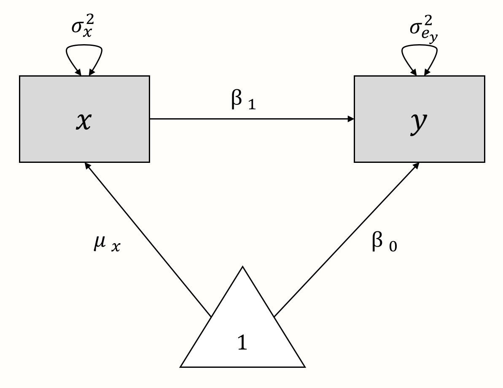
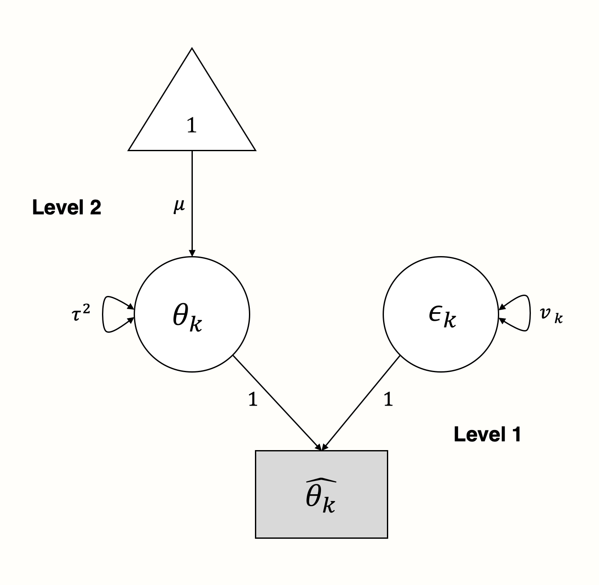
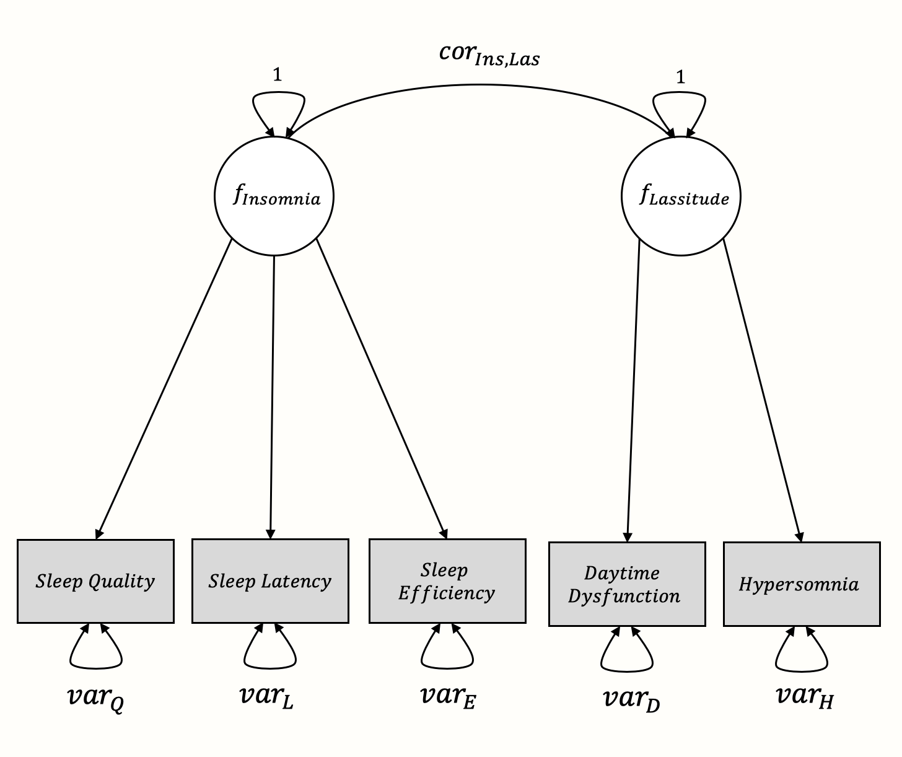

# Structural Equation Modeling Meta-Analysis {#sem}

---


<br></br>

<span class="firstcharacter">I</span>
n the last chapter, we showed that meta-analytic models have an inherent multilevel structure. This quality can be used, for example, to extend conventional meta-analysis to three-level models. 

\index{Analysis of Variance}
\index{Subgroup Analysis}

A peculiar thing about statistical methods is that they are often put into separate “boxes”. They are treated as unrelated in research and practice, when in fact they are not. For many social science students, for example, it often comes as a surprise to hear that an **analysis of variance** (ANOVA) and a linear regression with a categorical predictor are doing essentially the same thing^[ANOVAs are based the model $y_{ij} = \mu + \tau_i + \epsilon_{ij}$, where $\tau_i$ is the effect of the $i$th factor level/treatment, and $\epsilon_{ij}$ represents deviations due to (unexplained) random error [@montgomery, chapter 3.2]. This is nothing but a special case of a linear regression model. The primary difference is that $\tau_i$ is **effect-coded** (e.g. the treatment variable is either -1 and 1 so that the categorical treatment effects sum up to zero: $\sum_{i=1}^{a} \tau_i = 0$). In contrast, categorical predictors are usually dummy-coded (e.g. 0 and 1) in linear regression models.]. This often happens because these two methods are traditionally used in different contexts, and taught as separate entities.


\index{Structural Equation Model}

In a similar vein, it has been only fairly recently that researchers have started seeing multilevel models as a special form of a **structural equation model**, or SEM [@mehta2005people; @bauer2003estimating]. As we learned, every meta-analysis is based on a multilevel model. As consequence, we can also treat meta-analyses as structural equation models in which the pooled effect size is treated as a latent (or unobserved) variable [@cheung2015meta, chapter 4.6]. In short: meta-analyses are multilevel models; therefore, they can be expressed as structural equation models too.

\index{Multivariate Meta-Analysis}
\index{Factor Analysis}

This does not only mean that we can conceptualize previously covered types of meta-analyses from a structural equation modeling perspective. It also allows us to use SEM to build more complex meta-analysis models. Using **meta-analytic** SEM, we can test  **factor analytic** models, or perform **multivariate meta-analyses** which include more than one outcome of interest (to name just a few applications). 

Meta-analytic SEM can be helpful when we want to evaluate if certain models in the literature actually hold up once we consider all available evidence. Conversely, it can also be used to check if a theory is not backed by the evidence; or, even more interestingly, if it only applies to a subgroup of individuals or entities.

Application of meta-analytic SEM techniques, of course, presupposes a basic familiarity with structural equation modeling. In the next section, we therefore briefly discuss the general idea behind structural equation modeling, as well as its meta-analytic extension. 

<br></br>

## What Is Meta-Analytic Structural Equation Modeling? {#what-is-meta-sem}

---

Structural equation modeling is a statistical technique used to test hypotheses about the relationship of **manifest** (observed) and **latent** variables [@kline2015principles, chapter 1]. Latent variables are either not observed or **observable**. Personality, for example, is a construct which can only be measured indirectly, for instance through different items in a questionnaire. In SEM, an assumed relationship between manifest and latent variables (a "structure") is modeled using the manifest, measured variables, while taking their measurement error into account.

SEM analysis is somewhat different to "conventional" statistical hypothesis tests (such as $t$-tests, for example). Usually, statistical tests involve testing against a **null hypothesis**, such as $H_0: \mu_1 = \mu_2$ (where $\mu_1$ and $\mu_2$ are the means of two groups). In such a test, the researcher "aims" to **reject** the null hypothesis, since this allows to conclude that the two groups differ. Yet in SEM, a specific structural model is proposed beforehand, and the researcher instead "aims" to **accept** this model if the goodness of fit is sufficient [@cheung2015meta, chapter 2.4.6].


<br></br>

### Model Specification

---

Typically, SEM are specified and represented mathematically through a series of **matrices**. You can think of a matrix as a simple table containing rows and columns, much like a `data.frame` object in _R_ (in fact, most data frames can be easily converted to a matrix using the `as.matrix` function). Visually, SEM can be represented as **path diagrams**. Such path diagrams are usually very intuitive, and straightforward in their interpretation. Thus, we will start by specifying a SEM **visually** first, and then move on to the matrix notation.

<br></br>

#### Path Diagrams

---

\index{Path Diagram}

Path diagrams represent our SEM graphically. There is no full consensus on how path diagrams should be drawn, yet there are a few conventions. Here are the main components of path diagrams, and what they represent.

```{r, echo=F, message=F, warning=F}
library(kableExtra)
library(dplyr)

df = data.frame(Symbol = c("$\\square$", "$\\circ$", "$\\triangle$", "$\\rightarrow$", "$\\leftrightarrow$"),
                Name = c("Rectangle", "Circle", "Triangle", "Arrow", "Double Arrow"),
                Description = c("Manifest/observed variables.", "Latent/unobserved variables.",
                                "Intercept (fixed vector of 1s).", "Prediction. The variable at the start of the arrow predicts the variable at the end of the arrow: Predictor $\\rightarrow$ Target.",
                                "(Co-)Variance. If a double arrow connects two variables (rectangles/circles), it signifies the covariance/ correlation between the two variables. If a double arrow forms a loop on top of one single variable, it signifies the variance of that variable."))


kable(df %>% mutate_all(linebreak), "html", booktabs = T, escape = FALSE, longtable = T) %>% 
  kable_styling(latex_options = c("repeat_header"),
                bootstrap_options = c("condensed",
                                      "striped")) %>% 
  column_spec(3, width = "13cm")

```

As an illustration, let us create a path diagram for a simple linear ("non-meta-analytic") regression model, in which we want to predict $y$ with $x$. The model formula looks like this:

\begin{equation}
y_i = \beta_0 + \beta_1x_i + e_i
(\#eq:sem1)
\end{equation}

Now, let us "deconstruct" this formula. In the model, $x_i$ and $y_i$ are the observed variables. There are no unobserved (latent) variables. The true population mean of $y$ is the regression intercept $\beta_0$, while $\mu_x$ denotes the population mean of $x$. The variance of our observed predictor $x$ is denoted with $\sigma^2_x$. Provided that $x$ is not a perfect predictor of $y$, there will be some amount of residual error variance $\sigma^2_{e_y}$ associated with $y$. There are two regression coefficients: $\beta_0$, the intercept, and $\beta_1$, the slope coefficient of $x$.

Using these components, we can build a path diagram for our linear regression model, as seen below. 

```{r regression_path, message = F, out.width = '43%', echo = F, fig.align='center'}
library(OpenImageR)

```

We can also use this graphical model as a starting point to reassemble the regression model equation. From the model, we can infer that $y$ is influenced by two components: $x \times \beta_1$ and $1 \times \beta_0$. If we add these two parts together, we again arrive at the formula for $y$ from before.

<br></br>

#### Matrix Representation

---

There are several ways to represent SEM through matrices [@joreskog2006lisrel; @muthen2012mplus; @mcardle1984some]. Here, we will focus on the **Reticular Action Model** formulation, or RAM [@mcardle1984some]. We do this because this formulation is used by the **{metaSEM}** package which we will be introducing later on. RAM uses four matrices: $\boldsymbol{F}$, $\boldsymbol{A}$, $\boldsymbol{S}$, and $\boldsymbol{M}$. Because the $\boldsymbol{M}$ matrix is not necessary to fit the meta-analytic SEM we cover, we omit it here [see @cheung2015meta for a more extensive introduction]. 

We will now specify the remaining $\boldsymbol{A}$, $\boldsymbol{F}$ and $\boldsymbol{S}$ matrices for our linear regression model from before. The three matrices all have the same number of rows and columns, corresponding with the variables we have in our model: $x$ and $y$. Therefore, the generic matrix structure of our regression model always looks like this:


```{r, message = F, out.width = '18%', echo = F, fig.align='center'}
library(OpenImageR)

```


<br></br>

**The $\boldsymbol{A}$ Matrix: Single Arrows**

The $\boldsymbol{A}$ matrix represents the asymmetrical (single) arrows in our path model. We can fill this matrix by searching for the **column** entry of the variable in which the arrow starts ($x$), and then for the matrix **row** entry of the variable in which the arrow ends ($y$). The value of our arrow, $\beta_1$, is put where the selected column and row intersect in the matrix ($i_{y,x}$). Given that there are no other paths between variables in our model, we fill the remaining fields with 0. Thus, the $\boldsymbol{A}$ matrix for our example looks like this:


```{r, message = F, out.width = '20%', echo = F, fig.align='center'}
library(OpenImageR)

```

<br></br>

**The $\boldsymbol{S}$ Matrix: Single Arrows**

The $\boldsymbol{S}$ matrix represents the (co-)variances we want to estimate for the included variables. For $x$, our predictor, we need to estimate the variance $\sigma^2_x$. For our predicted variable $y$, we want to know the prediction error variance $\sigma^2_{e_y}$. Therefore, we specify $\boldsymbol{S}$ like this:

```{r, message = F, out.width = '20%', echo = F, fig.align='center'}
library(OpenImageR)

```

<br></br>

**The $\boldsymbol{F}$ Matrix: Single Arrows**

The $\boldsymbol{F}$ matrix allows us to specify the **observed** variables in our model. To specify that a variable has been observed, we simply insert 1 in the respective diagonal field of the matrix. Given that both $x$ and $y$ are observed in our model, we insert 1 into both diagonal fields:

```{r, message = F, out.width = '20%', echo = F, fig.align='center'}
library(OpenImageR)

```

\index{Maximum Likelihood}

Once these matrices are set, it is possible to estimate the parameters in our SEM, and to evaluate how well the specified model fits the data. This involves some matrix algebra and parameter estimation through maximum likelihood estimation, the mathematical minutiae of which we will omit here. If you are interested in understanding the details behind this step, you can have a look at @cheung2015meta, chapter 4.3. 


<br></br>

### Meta-Analysis From a SEM Perspective

---

We will now combine our knowledge about meta-analysis models and SEM to formulate meta-analysis as a structural equation model [@cheung2008model].

To begin, let us return to the formula of the random-effects model. Previously, we already described that the meta-analysis model follows a multilevel structure (see Chapter \@ref(multilevel-nature)), which looks like this:

\vspace{2mm}

**Level 1**

\begin{equation}
\hat\theta_k = \theta_k + \epsilon_k
(\#eq:sem2)
\end{equation}


\vspace{2mm}

**Level 2**

\begin{equation}
\theta_k = \mu + \zeta_k
(\#eq:sem3)
\end{equation}

On the first level, we assume that the effect size $\hat\theta_k$ reported in study $k$ is an estimator of the true effect size $\theta_k$. The observed effect size deviates from the true effect because of sampling error $\epsilon_k$, represented by the variance $\widehat{\text{Var}}(\hat\theta_k)=v_k$.

\index{Random-Effects Model}
\index{Fixed-Effect Model}

In a random-effects model, we assume that even the true effect size of each study is only drawn from a population of true effect sizes at level 2. The mean of this true effect size population, $\mu$, is what we want to estimate, since it represents the pooled effect size. To do this, we also need to estimate the variance of the true effect sizes $\widehat{\text{Var}}(\theta)=\tau^2$ (i.e. the between-study heterogeneity). The fixed-effect model is a special case of the random-effects model in which $\tau^2$ is assumed to be zero.

It is quite straightforward to represent this model as a SEM graph. We use the parameters on level 1 as latent variables to “explain” how the effect sizes we observe came into being [@cheung2015meta, chapter 4.6.2]:


```{r, message = F, out.width = '45%', echo = F, fig.align='center'}
library(OpenImageR)

```

In the graphical model, we see that the observed effect size $\hat\theta_k$ of some study $k$ is "influenced" by two arms: the sampling error $\epsilon_k$ with variance $v_k$, and the true effect size $\theta_k$ with variance $\tau^2$.

<br></br>

### The Two-Stage Meta-Analytic SEM Approach

---

Above, we defined the (random-effects) meta-analysis model from a SEM perspective. Although this is interesting from a theoretical standpoint, the model above is not more or less capable than the meta-analysis techniques we covered before: it describes that effect sizes are pooled assuming a random-effects model.

To really exploit the versatility of meta-analytic SEM, a two-stepped approach is required [@tang2016testing; @cheung2015meta, chapter 7]. In **Two-Stage Structural Equation Modeling** (TSSEM), we first pool the effect sizes of each study. Usually, these effect sizes are correlations between several variables that we want to use for modeling. For each study $k$, we have a selection of correlations, represented by the vector $\boldsymbol{r_k} = (r_1, r_2, \dots, r_p)$, where $p$ is the total number of (unique) correlations. Like in a normal random-effects model, we assume that each observed correlation in study $k$ deviates from the true average correlation $\rho$ due to sampling error $\epsilon_k$ and between-study heterogeneity $\zeta_k$. 

When we take into account that $\boldsymbol{r_k}$ stands for **several** correlations contained in one study, we get the following equation for the random-effects model:


\begin{align}
  \boldsymbol{r_k} &= \boldsymbol{\rho} + \boldsymbol{\zeta_k} + \boldsymbol{\epsilon_k} \notag \\ 
  \begin{bmatrix} r_1 \\ r_2 \\ \vdots \\ r_p \end{bmatrix} &=
  \begin{bmatrix} \rho_1 \\ \rho_2 \\ \vdots \\ \rho_p \end{bmatrix} +
  \begin{bmatrix} \zeta_1 \\ \zeta_2 \\ \vdots \\ \zeta_p \end{bmatrix} +
  \begin{bmatrix} \epsilon_1 \\ \epsilon_2 \\ \vdots \\ \epsilon_p \end{bmatrix} (\#eq:sem4)
\end{align}


\index{metaSEM Package}

Using this model, we can calculate a vector of **pooled** correlations, $\boldsymbol{r}$. This first pooling step allows to evaluate the heterogeneity of effects between studies, and if a random-effects model or subgroup analyses should be used. Thanks to the maximum likelihood-based approach used by the **{metaSEM}** package, even studies with partially missing data can be included in this step.

\index{Weighted Least Squares (WLS)}

In the second step, we then use **weighted least squares** (see Chapter \@ref(metareg-model-fit)) to fit the structural equation model we specified. The function for the specified model $\rho(\hat\theta)$ is  [@cheung2009two; @cheung2015meta, chapter 7.4.2]:


\begin{equation}
F_{\text{WLS}}(\hat\theta) =  (\boldsymbol{r} - \rho(\hat\theta))^\top \boldsymbol{V}^{-1} ({r} - \rho(\hat\theta))
(\#eq:sem5)
\end{equation}

Where $\boldsymbol{r}$ is the pooled correlation vector. The important part of this formula is $\boldsymbol{V}^{-1}$, which is an inverted matrix containing the covariances of $\boldsymbol{r}$. This matrix is used for weighting. Importantly, the formula in this second step is the same no matter if we assume a random or fixed-effect model, because the between study-heterogeneity, if existent, is already taken care of in step 1.

<br></br>
 
## Multivariate Meta-Analysis {#multivariate-ma}

---

\index{Multivariate Meta-Analysis}

Time to delve into our first worked meta-analytic SEM example. We will begin by using the SEM approach for a **multivariate meta-analysis**, which is something we have not covered yet. In multivariate meta-analyses, we try to estimate more than just one effect at the same time. Such types of meta-analyses are helpful in cases where we are studying a research topic for which there are several main outcomes, not just one. 

Imagine that we are examining the effects of some type of treatment. For this treatment, there could be two types of outcomes which are deemed as important by most experts and are thus assessed in most studies. Multivariate meta-analyses can address this, by estimating the effect sizes for both outcomes **jointly** in one model. This multivariate approach also allows us to take the correlation between the two outcomes into account. This can be used to determine if studies with a high effect size on one outcome also have higher effect sizes on the other outcome. Alternatively, we might also find out that there is a negative relationship between the two outcomes or no association at all.

\index{metaSEM Package}

It is of note that multivariate meta-analysis can also be performed outside a SEM framework [@schwarzer2015meta, chapter 7; @mvmeta]. Here, however, we will to show you how to perform them from a SEM perspective. In this and the following examples, we will work with **{metaSEM}**, a magnificent package for meta-analytic SEM developed by Mike Cheung [-@metasem]. As always, we first have to install the **{metaSEM}** package and load it from your library.


```{r, message=F, warning=F}
library(metaSEM)
```

\index{dmetar Package}

In our example, we will use **{dmetar}**'s `ThirdWave` data set again (see Chapter \@ref(pre-calculated-es)). By default, this data set only contains effects on one outcome, perceived stress. Now, imagine that most studies in this meta-analysis also measured effects on **anxiety**, which is another important mental health-related outcome. We can therefore use a multivariate meta-analysis to jointly estimate effects on stress and anxiety, and how they relate to each other.

To proceed, we therefore have to create a new data frame first, in which data for both outcomes is included. First, we define a vector containing the effects on anxiety (expressed as Hedges' $g$) as reported in each study, as well as their standard error. We also need to define a vector which contains the **covariance** between stress and anxiety reported in each study. One study did not assess anxiety outcomes, so we use `NA` in the three vectors to indicate that the information is missing.

```{r, message=F, warning=F}
# Define vector with effects on anxiety (Hedges g)
Anxiety <- c(0.224,0.389,0.913,0.255,0.615,-0.021,0.201, 
             0.665,0.373,1.118,0.158,0.252,0.142,NA, 
             0.410,1.139,-0.002,1.084)

# Standard error of anxiety effects
Anxiety_SE <- c(0.193,0.194,0.314,0.165,0.270,0.233,0.159,
                0.298,0.153,0.388,0.206,0.256,0.256,NA,
                0.431,0.242,0.274,0.250)

# Covariance between stress and anxiety outcomes
Covariance <- c(0.023,0.028,0.065,0.008,0.018,0.032,0.026, 
                0.046,0.020,0.063,0.017,0.043,0.037,NA, 
                0.079,0.046,0.040,0.041)

```

Then, we use this data along with information from `ThirdWave` to create a new data frame called `ThirdWaveMV`. In this data set, we include the effect size **variances** `Stress_var` and `Anxiety_var`, which can be obtained by squaring the standard error. 

```{r, message=F, warning=F, echo=F}
ThirdWaveMV <- data.frame(Author = ThirdWave$Author,
                          Stress = ThirdWave$TE,
                          Stress_var = ThirdWave$seTE^2,
                          Anxiety = Anxiety,
                          Anxiety_var = Anxiety_SE^2,
                          Covariance = Covariance)

```

```{r, message=F, warning=F, eval=F}
ThirdWaveMV <- data.frame(Author = ThirdWave$Author,
                          Stress = ThirdWave$TE,
                          Stress_var = ThirdWave$seTE^2,
                          Anxiety = Anxiety,
                          Anxiety_var = Anxiety_SE^2,
                          Covariance = Covariance)

format(head(ThirdWaveMV), digits = 2)

```

```
##            Author Stress Stress_var Anxiety Anxiety_var Covariance
## 1     Call et al.   0.71      0.068   0.224       0.037      0.023
## 2 Cavanagh et al.   0.35      0.039   0.389       0.038      0.028
## 3   DanitzOrsillo   1.79      0.119   0.913       0.099      0.065
## 4  de Vibe et al.   0.18      0.014   0.255       0.027      0.008
## 5  Frazier et al.   0.42      0.021   0.615       0.073      0.018
## 6  Frogeli et al.   0.63      0.038  -0.021       0.054      0.032

```


As we can see, the new data set contains the effect sizes for both stress and anxiety, along with the respective sampling variances. The `Covariance` column stores the covariance between stress and anxiety as measured in each study.

A common problem in practice is that the covariance (or correlation) between two outcomes is not reported in original studies. If this is the case, we have to **estimate** the covariance, based on a reasonable assumption concerning the correlation between the outcomes. 

Imagine that we do not know the covariance in each study yet. How can we estimate it? A good way is to look for previous literature which assessed the correlation between the two outcomes, optimally in the same kind of context we are dealing with right now. Let us say we found in the literature that stress and anxiety are very highly correlated in post-tests of clinical trials, with $r_{\text{S,A}} \approx$ 0.6. Based on this assumed correlation, we can approximate the co-variance of some study $k$ using the following formula [@schwarzer2015meta, chapter 7]:

\begin{equation}
\widehat{\text{Cov}}(\theta_{1},\theta_{2}) = SE_{\theta_{1}} \times SE_{\theta_{2}} \times \hat\rho_{1, 2}
(\#eq:sem6)
\end{equation}

Using our example data and assuming $r_{\text{S,A}} \approx$ 0.6, this formula can implemented in _R_ like so:

```{r}
# We use the square root of the variance since SE = sqrt(var)
cov.est <- with(ThirdWaveMV, 
                sqrt(Stress_var) * sqrt(Anxiety_var) * 0.6)
```

Please note that, when we calculate covariances this way, the choice of the assumed correlation can have a profound impact on the results. Therefore, it is highly advised to (1) always report the assumed correlation coefficient, and (2) conduct sensitivity analyses, where we inspect how results change depending on the correlation we choose. 

<br></br>

### Specifying the Model

---

To specify a multivariate meta-analysis model, we do not have to follow the TSSEM procedure  (see previous chapter) programmatically, nor do we have to specify any RAM matrices. For such a relatively simple model, we can use the `meta` function in **{metaSEM}** to fit a meta-analytic SEM in just one step. To use `meta`, we only have to specify three essential arguments:

* **`y`**. The columns of our data set which contain the effect size data. In a multivariate meta-analysis, we have to combine the effect size columns we want to include using `cbind`. 

* **`v`**. The columns of our data set which contain the effect size variances. In a multivariate meta-analysis, we have to combine the variance columns we want to include using `cbind`. We also have to include the column containing the covariance between the effect sizes. The structure of the argument should be `cbind(variance_1, covariance, variance_2)`.

* **`data`**. The data set in which the effect sizes and variances are stored.

We save our fitted model under the name `m.mv`. Importantly, before running `meta`, please make sure that the **{meta}** package is **not** loaded. Some functions in **{meta}** and **{metaSEM}** have the same name, and this can lead to errors when running the code in _R_. It is possible to "unload" packages using the `detach` function. 

Therefore, we first make sure that **{meta}** is unloaded and then fit the model. The resulting `m.mv` object can be inspected using `summary`.

```{r, message=F, warning=F, echo=F}
m.mv <- meta(y = cbind(Stress, Anxiety), 
             v = cbind(Stress_var, Covariance, Anxiety_var),
             data = ThirdWaveMV)
```


```{r, fig.width=5, fig.height=5, eval=F}
detach(package:meta, unload = TRUE)

m.mv <- meta(y = cbind(Stress, Anxiety), 
             v = cbind(Stress_var, Covariance, Anxiety_var),
             data = ThirdWaveMV)

summary(m.mv)

```

```
## [...]
## Coefficients:
##            Estimate Std.Error lbound ubound z value Pr(>|z|)    
## Intercept1    0.570     0.087  0.399  0.740  6.5455  5.9e-13 ***
## Intercept2    0.407     0.083  0.244  0.570  4.9006  9.5e-09 ***
## Tau2_1_1      0.073     0.049 -0.023  0.169  1.4861   0.1372    
## Tau2_2_1      0.028     0.035 -0.041  0.099  0.8040   0.4214    
## Tau2_2_2      0.057     0.042 -0.025  0.140  1.3643   0.1725    
## ---
## Signif. codes:  0 ‘***’ 0.001 ‘**’ 0.01 ‘*’ 0.05 ‘.’ 0.1 ‘ ’ 1
## [...]
## 
## Heterogeneity indices (based on the estimated Tau2):
##                              Estimate
## Intercept1: I2 (Q statistic)   0.6203
## Intercept2: I2 (Q statistic)   0.5292
## 
## Number of studies (or clusters): 18
## [...]
## OpenMx status1: 0 ("0" or "1": The optimization is considered fine.
## Other values may indicate problems.)
```

<br></br>

### Evaluating the Results

---

\index{Maximum Likelihood}

Given that the SEM model is fitted using the maximum likelihood algorithm, the first thing we always do is check the `OpenMx status` right at the end of the output. Maximum likelihood estimation is an optimization procedure, in which parameters are changed iteratively until the optimal solution for the data at hand is found. However, especially with more complex models, it can happen that this optimum is not reached even after many iterations; the maximum likelihood algorithm will then stop and output the parameter values it has approximated so far. Yet, those values for our model components will very likely be incorrect and should not be trusted. 

The `OpenMx status` for our model is `0`, which indicates that the maximum likelihood estimation worked fine. If the status would have been anything other than 0 or 1, it would have been necessary to rerun the model, using this code:

```{r, eval=F}
rerun(m.mv)
```

In the output, the two pooled effect sizes are shown as `Intercept1` and `Intercept2`. The effect sizes are numbered in the order in which we inserted them into our call to `meta`. We can see that the pooled effect sizes are $g_{\text{Stress}}$ = 0.57 and $g_{\text{Anxiety}}$ = 0.41. Both effect sizes are significant. Under `Heterogeneity indices`, we can also see the values of $I^2$, which are $I^2_{\text{Stress}}$ = 62% and $I^2_{\text{Anxiety}}$ = 53%, indicating substantial between-study heterogeneity in both outcomes. 

The direct estimates of the between-study heterogeneity variance $\tau^2$ are also provided. We see that there are not only two estimates, but three. To understand what this means, we can extract the "random" values from the `m.mv` object.

```{r}
tau.coefs <- coef(m.mv, select = "random")
```

Then, we use the `vec2symMat` function to create a matrix of the coefficients. We give the matrix rows and columns the names of our variables: `Stress` and `Anxiety`.

```{r}
# Create matrix
tc.mat <- vec2symMat(tau.coefs)

# Label rows and columns
dimnames(tc.mat)[[1]] <- dimnames(tc.mat)[[2]] <- c("Stress", 
                                                    "Anxiety")

tc.mat
```

We now understand better what the three $\tau^2$ values mean: they represent the between-study variance (heterogeneity) in the diagonal of the matrix. In the other two fields, the matrix shows the estimated covariance between stress and anxiety. Given that the covariance is just an unstandardized version of a correlation, we can transform these values into correlations using the `cov2cor` function.

```{r}
cov2cor(tc.mat)
```

We see that, quite logically, the correlations in the diagonal elements of the matrix are 1. The correlation between effects on stress and anxiety is $r_{\text{S,A}}$ = 0.45. This is an interesting finding: it shows that there is a positive association between a treatment's effect on perceived stress and its effect on anxiety. We can say that treatments which have high effects on stress seem to have higher effects on anxiety too.

\index{Wald-Type Test}

It is of note that the confidence intervals presented in the summary of `m.mv` are Wald-type intervals (see Chapter \@ref(knapp-hartung)). Such Wald-type intervals can sometimes be inaccurate, especially in small samples [@diciccio1996bootstrap]. It may thus be valuable to construct confidence intervals in another way, by using **likelihood-based** confidence intervals. We can get these CIs by re-running the `meta` function and additionally specifying `intervals.type = "LB"`. 

```{r, eval = F}
m.mv <- meta(y = cbind(Stress, Anxiety), 
             v = cbind(Stress_var, Covariance, Anxiety_var),
             data = ThirdWaveMV,
             intervals.type = "LB")
```

We have already seen that the output for our m.mv contains non-zero estimates of the between-study heterogeneity $\tau^2$. We can therefore conclude that the model we just fitted is a random-effects model. The `meta` function uses a random-effects model automatically. Considering the $I^2$ values in our output, we can conclude that this is indeed adequate. However, if we want to fit a fixed-effect model anyway, we can do so by re-running the analysis, and adding the parameter `RE.constraints = matrix(0, nrow=2, ncol=2)`. This creates a matrix of 0s which constrains all $\tau^2$ values to zero:

\vspace{2mm}
  
```{r, eval = F}
m.mv <- meta(y = cbind(Stress, Anxiety), 
             v = cbind(Stress_var, Covariance, Anxiety_var),
             data = ThirdWaveMV,
             RE.constraints = matrix(0, nrow=2, ncol=2))
```


<br></br>

### Visualizing the Results

---

To plot the multivariate meta-analysis model, we can use the `plot` function. We also make some additional specifications to change the appearance of the plot. If you want to see all styling options, you can paste `?metaSEM::plot.meta` into the console and then hit Enter.

\vspace{2mm}

```{r, fig.width=5, fig.height=5, fig.align='center', out.width="60%", eval=F}
plot(m.mv, 
     axis.labels = c("Perceived Stress", "Anxiety"), 
     randeff.ellipse.col = "#014d64",
     univariate.arrows.col = "gray40", 
     univariate.polygon.col = "gray40",
     estimate.ellipse.col = "gray40",
     estimate.col = "firebrick")
```

```{r, fig.width=5, fig.height=5, fig.align='center', out.width="60%", echo=F}
par(bg="#FFFEFA")
plot(m.mv, 
     axis.labels = c("Perceived Stress", "Anxiety"), 
     randeff.ellipse.col = "#014d64",
     univariate.arrows.col = "gray40", 
     univariate.polygon.col = "gray40",
     estimate.ellipse.col = "gray40",
     estimate.col = "firebrick")
```


Let us go through what we see. The plot has two axes: an x-axis displaying the effects on stress, and a y-axis, which displays the effects on anxiety. We also see the pooled effect and its 95% confidence interval for both outcomes, symbolized by the black diamond. 

\index{Prediction Interval}

In the middle of the plot, the pooled effect of both variables is shown as a red diamond. The smaller blue ellipse represents the 95% confidence interval of our pooled effect; while the larger black ellipse depicts the 95% **prediction** interval (Chapter \@ref(het-measure-which))^[These prediction intervals (or "plausible value intervals") are based on a different formula [$\hat\mu \pm 1.96 \times \hat\tau$, @raudenbush2009pi] than the one used by **{meta}** and **{metafor}** (equation 5.7 in Chapter \@ref(het-measure-which)), resulting in a slightly narrower interval.].


Lastly, the black dots show the individual studies, where the ellipses with dashed lines represent the 95% confidence intervals.

<br></br>

## Confirmatory Factor Analysis {#cfa}

---

\index{Factor Analysis}

Confirmatory Factor Analysis (CFA) is a popular SEM method in which one specifies how observed variables relate to assumed latent variables [@thompson2004exploratory, chapters 1.1 and 1.2]. CFA is often used to evaluate the psychometric properties of questionnaires or other types of assessments. It allows researchers to determine if assessed variables indeed measure the latent variables they are intended to measure, and how several latent variables relate to each other. 

For frequently used questionnaires, there are usually many empirical studies which report the correlations between the different questionnaire items. Such data can be used for meta-analytic SEM. This allows us to evaluate which latent factor structure is the most appropriate based on all available evidence.

In this example, we want to confirm the latent factor structure of a (fictitious) questionnaire for sleep problems. The questionnaire is assumed to measure two distinct latent variables characterizing sleep problems: **insomnia** and **lassitude**. Koffel and Watson [-@koffel2009two] argue that sleep complaints can indeed be described by these two latent factors. 

To practice meta-analytic CFA, we simulated results of 11 studies in which our imaginary sleep questionnaire was assessed. We named this data set `SleepProblems`. Each of these studies contains the inter-correlations between symptoms of sleep complaints as directly measured by our questionnaire. These measured indicators include sleep quality, sleep latency, sleep efficiency, daytime dysfunction, and **hypersomnia** (i.e. sleeping too much). We assume that the first three symptoms are related because they all measure insomnia as a latent variable, whereas daytime dysfunction and hypersomnia are related because they are symptoms of the lassitude factor.

The proposed structure represented as a graphical model looks like this^[Please note that the labels in the path diagram are somewhat "idiosyncratic" to make identifying the relevant components of the model easier later on.]:


```{r, message = F, out.width = '60%', echo = F, fig.align='center'}
library(OpenImageR)

```

<br></br>

### Data Preparation

---

Let us first have a look at the `SleepProblems` data we want to use for our model. This data set has a special structure: it is a `list` object, containing (1) another `list` of matrices and (2) a numeric vector. Lists are very versatile _R_ objects and allow to bind together different elements in one big object. Lists can be accessed like data frames using the `$` operator. The `names` function can be used to print the names of objects in the list.

```{block, type='boxdmetar'}
**The "SleepProblems" Data Set**

\vspace{2mm}

The `SleepProblems` data set is part of the **{dmetar}** package. If you have installed **{dmetar}**, and loaded it from your library, running `data(SleepProblems)` automatically saves the data set in your _R_ environment. The data set is then ready to be used. 

\vspace{2mm}

If you have not installed **{dmetar}**, you can download the data set as an _.rda_ file from the [Internet](https://www.protectlab.org/meta-analysis-in-r/data/SleepProblems.rda), save it in your working directory, and then click on it in your R Studio window to import it. 

```


```{r, message=F, warning=F}
data(SleepProblems)
names(SleepProblems)
```

We see that the list contains two elements, our actual `data` and `n`, the sample size of each study. The `data` object is itself a `list`, so we can also get the names of its contents using the `names` function. 

```{r, eval=F}
names(SleepProblems$data)
```

```
## [1] "Coleman et al. (2003)"  "Salazar et al. (2008)" 
## [3] "Newman et al. (2016)"   "Delacruz et al. (2009)"
## [5] "Wyatt et al. (2002)"    "Pacheco et al. (2016)"
## [...]
```

It is also possible to display specific elements in `data` using the `$` operator.

```{r}
SleepProblems$data$`Coleman et al. (2003)`
```

The `data` list contains 11 elements, one for each of the 11 included studies. A closer look at the Coleman et al. (2003) study reveals that the data are stored as correlation matrices with five variables. Each row and column in the matrix corresponds with one of the sleep complaint symptoms assessed by our questionnaire. 

The Coleman et al. (2003) study contains reported correlations for each symptom combination. However, it is also possible to use studies which have missing values (coded as `NA`) in some of the fields. This is because meta-analytic SEM can handle missing data--at least to some degree.

Before we proceed, let us quickly show how you can construct such a list yourself. Let us assume that we have extracted correlation matrices of two studies, which we imported as data frames into _R_. Assuming that these data frames are called `df1` and `df2`, we can use the following "recipe" to create a `list` object that is suitable for further analysis.

\vspace{2mm}

```{r, eval=F}
# Convert both data.frames to matrices
mat1 <- as.matrix(df1)
mat2 <- as.matrix(df2)

# Define the row labels
dimnames(mat1)[[1]] <- c("Variable 1", "Variable 2", "Variable 3")
dimnames(mat2)[[1]] <- c("Variable 1", "Variable 2", "Variable 3")

# Bind the correlation matrices together in a list
data <- list(mat1, mat2)
names(data) <- c("Study1", "Study2")

# Define sample size of both studies
n <- c(205, # N of study 1
       830) # N of study 2

# Bind matrices and sample size together
cfa.data <- list(data, n)

```


<br></br>

### Model Specification

---

To specify our CFA model, we have to use the RAM specification and two-stage meta-analytic SEM procedure we mentioned before. The **{metaSEM}** package contains separate functions for each of the two stages, `tssem1` and `tssem2`. The first function pools our correlation matrices across all studies, and the second fits the proposed model to the data.


<br></br>

#### Stage 1

---

At the first stage, we pool our correlation matrices using the `tssem1` function. There are four important arguments we have to specify in the function.

* **`Cov`**. A `list` of correlation matrices we want to pool. Note that all correlation matrices in the list need to have an identical structure.

* **`n`**. A numeric vector containing the sample sizes of each study, in the same order as the matrices included in `Cov`.

* **`method`**. Specifies if we want to use a fixed-effect model (`"FEM"`) or random-effects model (`"REM"`).

* **`RE.type`**. When a random-effects model is used, this specifies how the random effects should be estimated. The default is `"Symm"`, which estimates all $\tau^2$ values, including the covariances between two variables. When set to `"Diag"`, only the diagonal elements of the random-effects matrix are estimated. This means that we assume that the random effects are independent. Although `"Diag"` results in a strongly simplified model, it is often preferable, because less parameters have to be estimated. This particularly makes sense when the number of variables is high, or the number of studies is low.

In our example, we assume a random-effects model, and use `RE.type = "Diag"`. I will save the model as `cfa1`, and then call the `summary` function to retrieve the output. 
```{r, eval=F}
cfa1 <- tssem1(SleepProblems$data, 
               SleepProblems$n, 
               method="REM",
               RE.type = "Diag")

summary(cfa1)
```

```
[...]
Coefficients:
           Estimate Std.Error lbound  ubound z value Pr(>|z|)    
Intercept1    0.444     0.057  0.331   0.557   7.733  < 0.001 ***
Intercept2    0.478     0.042  0.394   0.561  11.249  < 0.001 ***
Intercept3    0.032     0.071 -0.106   0.172   0.459    0.645    
Intercept4    0.132     0.048  0.038   0.227   2.756    0.005 ** 
Intercept5    0.509     0.036  0.438   0.581  13.965  < 0.001 ***
Intercept6    0.120     0.040  0.040   0.201   2.954    0.003 ** 
Intercept7    0.192     0.060  0.073   0.311   3.170    0.001 ** 
Intercept8    0.221     0.039  0.143   0.298   5.586  < 0.001 ***
Intercept9    0.189     0.045  0.100   0.279   4.163  < 0.001 ***
Intercept10   0.509     0.023  0.462   0.556  21.231  < 0.001 ***
Tau2_1_1      0.032     0.015  0.002   0.061   2.153    0.031 *  
Tau2_2_2      0.016     0.008  0.000   0.032   1.963    0.049 *  
Tau2_3_3      0.049     0.023  0.003   0.096   2.091    0.036 *  
Tau2_4_4      0.019     0.010  0.000   0.039   1.975    0.048 *  
Tau2_5_5      0.010     0.006 -0.001   0.022   1.787    0.073 .  
Tau2_6_6      0.012     0.007 -0.002   0.027   1.605    0.108    
Tau2_7_7      0.034     0.016  0.001   0.067   2.070    0.038 *  
Tau2_8_8      0.012     0.006 -0.000   0.025   1.849    0.064 .  
Tau2_9_9      0.017     0.009 -0.001   0.036   1.849    0.064 .  
Tau2_10_10    0.003     0.002 -0.001   0.008   1.390    0.164    
---
Signif. codes:  0 ‘***’ 0.001 ‘**’ 0.01 ‘*’ 0.05 ‘.’ 0.1 ‘ ’ 1
[...]

Heterogeneity indices (based on the estimated Tau2):
                              Estimate
Intercept1: I2 (Q statistic)    0.9316
Intercept2: I2 (Q statistic)    0.8837
Intercept3: I2 (Q statistic)    0.9336
Intercept4: I2 (Q statistic)    0.8547
Intercept5: I2 (Q statistic)    0.8315
Intercept6: I2 (Q statistic)    0.7800
Intercept7: I2 (Q statistic)    0.9093
Intercept8: I2 (Q statistic)    0.7958
Intercept9: I2 (Q statistic)    0.8366
Intercept10: I2 (Q statistic)   0.6486

[...]
OpenMx status1: 0 ("0" or "1": The optimization is considered fine.
Other values may indicate problems.)
```

A look at the `OpenMx status` confirms that the model estimates are trustworthy. To make the results more easily digestible, we can extract the fixed effects (our estimated pooled correlations) using the `coef` function. We then make a symmetrical matrix out of the coefficients using `vec2symMat`, and add the dimension names for easier interpretation.

\vspace{2mm}

```{r, echo=F}
load("data/cfa1.rda")
```


```{r}
# Extract the fixed coefficients (correlations)
fixed.coefs <- coef(cfa1, "fixed")

# Make a symmetric matrix
fc.mat <- vec2symMat(fixed.coefs, diag = FALSE)

# Label rows and columns
dimnames(fc.mat)[[1]] <- c("Quality", "Latency", 
                           "Efficiency", "DTDysf", "HypSomnia")
dimnames(fc.mat)[[2]] <- c("Quality", "Latency", 
                           "Efficiency", "DTDysf", "HypSomnia")

# Print correlation matrix (3 digits)
round(fc.mat, 3)
```

\vspace{2mm}

We can now see the pooled correlation matrix for our variables. Looking back at the model output, we also see that all correlation coefficients are significant ($p<$ 0.05), except one: the correlation between sleep quality and daytime dysfunction was not significant. From the perspective of our assumed model, this makes sense, because we expect these variables to load on different factors. We also see that the $I^2$ values of the different estimates are very large (65-93%).  


<br></br>

#### Stage 2

---

After pooling the correlation matrices, it is now time to determine if our proposed factor model fits the data well. To specify our model, we have to use the RAM formulation this time, and specify the $\boldsymbol{A}$, $\boldsymbol{S}$ and $\boldsymbol{F}$ matrices. To fill the fields in each of these matrices, it is often best to construct an empty matrix first. Structure-wise, all matrices we define do not only contain the observed variables but also the assumed latent variables, `f_Insomnia` and `f_Lassitude`. Here is how we can create a zero matrix as a starting point:

\vspace{2mm}


```{r, echo=F}
dims <- c("Quality", "Latency", "Efficiency", 
          "DTDysf", "HypSomnia", "f_Insomnia", "f_Lassitude")
```


```{r, eval=F}
# Create vector of column/row names
dims <- c("Quality", "Latency", "Efficiency", 
          "DTDysf", "HypSomnia", "f_Insomnia", "f_Lassitude")

# Create 7x7 matrix of zeros
mat <- matrix(rep(0, 7*7), nrow = 7, ncol = 7)

# Label the rows and columns
dimnames(mat)[[1]] <- dimnames(mat)[[2]] <- dims
mat
```

```
##             Qlty Ltncy Effcncy DTDysf HypSmn f_Insmn f_Lsstd
## Quality        0     0       0      0      0       0       0
## Latency        0     0       0      0      0       0       0
## Efficiency     0     0       0      0      0       0       0
## DTDysf         0     0       0      0      0       0       0
## HypSomnia      0     0       0      0      0       0       0
## f_Insomnia     0     0       0      0      0       0       0
## f_Lassitude    0     0       0      0      0       0       0
```

<br></br>

$\boldsymbol{A}$ **Matrix**

In the $\boldsymbol{A}$ matrix, we specify the asymmetrical (i.e. single) arrows in our model. Each single arrow starts at the column variable and ends where the column intersects with the entry of the row variable. All other fields which do not represent arrows are filled with `0`. 

We specify that an arrow has to be “estimated” by adding a character string to the $\boldsymbol{A}$ matrix. This character string begins with a starting value for the optimization procedure (usually somewhere between 0.1 and  0.3) followed by `*`. After the `*` symbol, we specify a label for the value. If two fields in the $\boldsymbol{A}$ matrix have the same label, this means that we assume that the fields have the same value. 

In our example, we use a starting value of 0.3 for all estimated arrows, and label the fields according to the path diagram we presented before. 

\vspace{2mm}

```{r}
A <- matrix(c(0, 0, 0, 0, 0, "0.3*Ins_Q", 0          ,
              0, 0, 0, 0, 0, "0.3*Ins_L", 0          ,
              0, 0, 0, 0, 0, "0.3*Ins_E", 0          ,
              0, 0, 0, 0, 0, 0          , "0.3*Las_D",
              0, 0, 0, 0, 0, 0          , "0.3*Las_H",
              0, 0, 0, 0, 0, 0          , 0          ,
              0, 0, 0, 0, 0, 0          , 0
              ), nrow = 7, ncol = 7, byrow=TRUE)

# Label columns and rows
dimnames(A)[[1]] <- dimnames(A)[[2]] <- dims

```

The last step is to plug the $\boldsymbol{A}$ matrix into the `as.mxMatrix` function to make it usable for the stage 2 model.


```{r}
A <- as.mxMatrix(A)
```

<br></br>

$\boldsymbol{S}$ **Matrix**


In the $\boldsymbol{S}$ matrix, we specify the variances we want to estimate. In our example, these are the variances of all observed variables, as well as the correlation between our two latent factors. First, we set the correlation of our latent factors with themselves to 1. Furthermore, we use a starting value of 0.2 for the variances in the observed variables, and 0.3 for the correlations. All of this can be specified using this code:

\vspace{2mm}

```{r}
# Make a diagonal matrix for the variances
Vars <- Diag(c("0.2*var_Q", "0.2*var_L", 
               "0.2*var_E", "0.2*var_D", "0.2*var_H"))

# Make the matrix for the latent variables
Cors <- matrix(c(1, "0.3*cor_InsLas",
                 "0.3*cor_InsLas", 1),
               nrow=2, ncol=2)

# Combine
S <- bdiagMat(list(Vars, Cors))

# Label columns and rows
dimnames(S)[[1]] <- dimnames(S)[[2]] <- dims
```


And again, we transform the matrix using `as.mxMatrix`.

```{r}
S <- as.mxMatrix(S)
```

<br></br>

$\boldsymbol{F}$ **Matrix**

The $\boldsymbol{F}$ matrix, lastly, is easy to specify. In the diagonal elements of observed variables, we fill in 1. Everywhere else, we use 0. Furthermore, we only select the rows of the matrix in which at least on element is not zero (i.e. the last two rows are dropped since they only contain zeros).

```{r}
# Construct diagonal matrix
F <- Diag(c(1, 1, 1, 1, 1, 0, 0))

# Only select non-null rows
F <- F[1:5,]

# Specify row and column labels
dimnames(F)[[1]] <- dims[1:5]
dimnames(F)[[2]] <- dims

F <- as.mxMatrix(F)
```


<br></br>

### Model Fitting

---

Now, it is time to fit our proposed model to the pooled data. To do this, we use the `tssem2` function. We only have to provide the stage 1 model `cfa1`, the three matrices, and specify `diag.constraints=FALSE` (because we are not fitting a mediation model). We save the resulting object as `cfa2` and then access it using `summary`.

\vspace{2mm}

```{r, eval=FALSE}
cfa2 <- tssem2(cfa1, 
               Amatrix = A, 
               Smatrix = S, 
               Fmatrix = F, 
               diag.constraints = FALSE)
summary(cfa2)
```

```
## [...]
## Coefficients:
##            Estimate Std.Error lbound ubound z value Pr(>|z|)    
## Las_D         0.688     0.081  0.527  0.848   8.409  < 0.001 ***
## Ins_E         0.789     0.060  0.670  0.908  13.026  < 0.001 ***
## Las_H         0.741     0.088  0.568  0.914   8.384  < 0.001 ***
## Ins_L         0.658     0.053  0.553  0.763  12.275  < 0.001 ***
## Ins_Q         0.613     0.051  0.512  0.714  11.941  < 0.001 ***
## cor_InsLas    0.330     0.045  0.240  0.419   7.241  < 0.001 ***
## ---
## Signif. codes:  0 ‘***’ 0.001 ‘**’ 0.01 ‘*’ 0.05 ‘.’ 0.1 ‘ ’ 1
## 
## Goodness-of-fit indices:
##                                                Value
## Sample size                                3272.0000
## Chi-square of target model                    5.2640
## DF of target model                            4.0000
## p value of target model                       0.2613
## [...]
## RMSEA                                         0.0098
## RMSEA lower 95% CI                            0.0000
## RMSEA upper 95% CI                            0.0297
## [...]
## OpenMx status1: 0 ("0" or "1": The optimization is considered fine.
## Other values indicate problems.)
```


We see that the `OpenMx status` is `0`, meaning that the optimization worked fine. In the output, we are provided with estimates for the paths between the two latent factors and the observed symptoms, such as 0.69 for Lassitude $\rightarrow$ Daytime Dysfunction (`Las_D`). We also see that, according to the model, there is a significant correlation between the two latent factors: $r_{\text{Ins,Las}}$ = 0.33. 

Most importantly, however, we need to check how well the assumed model fits our data. This can be achieved by having a look at the `Goodness-of-fit indices`. We see that the goodness of fit test is **not** significant, with $\chi^2_4=$ 5.26, $p=$ 0.26. Contrary to other statistical tests, this outcome is desired, since it means that we accept the null hypothesis that our model fits the data **well**. 

\index{Root Mean Square Error of Approximation (RMSEA)}

Furthermore, we see that the **Root Mean Square Error of Approximation** (RMSEA) value is 0.0098. As a rule of thumb, a model can be considered to fit the data well when its RSMEA value is below 0.05, with smaller values indicating a better fit [@rmsea]. Thus, this goodness of fit index also indicates that the model fits our data well. 

```{block, type='boximportant'}
**Alternative Models**

\vspace{2mm}

A common problem in SEM studies is that researchers often only focus on their own proposed model, and if it fits the data well. If it is found that the assumed model shows a close fit to the data, many researchers often directly conclude that the data prove their theory. 

This is problematic because more than one model can fit well to the same data. Therefore, it is necessary to also check for alternative model hypotheses and structures. If the alternative model also fits the data well, it becomes less clear if our proposed structure is really the "correct" one.

```

<br></br>

### Path Diagrams

---

\index{Path Diagram}
\index{semPlot Package}

```{r, echo=FALSE}
load("data/cfa2.rda")
rm(F)
```

After the model has been fitted, **{metaSEM}** makes it quite easy for us to visualize it graphically. However, to draw a path diagram, we first have to install and load the **{semPlot}** package [@semplot].

\vspace{2mm}

```{r,message=FALSE, warning=FALSE}
library(semPlot)
```

To plot the model, we have to convert it into a format that **{semPlot}** can use. This can be done using the `meta2semPlot` function.

\vspace{2mm}

```{r, message=F}
cfa.plot <- meta2semPlot(cfa2)
```

We can then use the `semPaths` function in **{semPlot}** to generate the graph. This function has many parameters, which can be accessed by typing `?semPaths` into the console, and then hitting Enter. Here is our code, and the resulting plot:

\vspace{2mm}


```{r, fig.align="center", fig.width=4, fig.height=3, out.width="60%", eval=F}
# Create Plot labels (left to right, bottom to top)
labels <- c("Sleep\nQuality",
            "Sleep\nLatency",
            "Sleep\nEfficiency",
            "Daytime\nDysfunction",
            "Hyper-\nsomnia","Insomnia", 
            "Lassitude")

# Plot
semPaths(cfa.plot, 
         whatLabels = "est", 
         edge.color = "black", 
         nodeLabels = labels,
         sizeMan = 10, 
         sizeLat = 10, 
         edge.label.cex = 1)
```


```{r, fig.align="center", fig.width=4, fig.height=3, out.width="60%", echo=F}
par(bg="#FFFEFA")
# Create Plot labels (left to right, bottom to top)
labels <- c("Sleep\nQuality",
            "Sleep\nLatency",
            "Sleep\nEfficiency",
            "Daytime\nDysfunction",
            "Hyper-\nsomnia","Insomnia", 
            "Lassitude")

# Plot
semPaths(cfa.plot, 
         whatLabels = "est", 
         edge.color = "black", 
         nodeLabels = labels,
         sizeMan = 10, 
         sizeLat = 10, 
         edge.label.cex = 1)
```

```{block, type='boxinfo'}
**Further Reading**

\vspace{2mm}

What we covered in this chapter should at best be seen as a rudimentary introduction to meta-analytic SEM. A much more elaborated discussion of this method can be found in Mike Cheung's definitive book **Meta-Analysis: A Structural Equation Modeling Approach** [-@cheung2015meta]. This book also describes various other kinds of meta-analytic structural equation models that we have not covered, and describes how they can be implemented using _R_. 

\vspace{2mm}

If you are looking for a shorter (and openly accessible) resource, you can have a look at the **{metaSEM}** package vignette. The vignette provides a brief discussion of the theory behind meta-analytic SEM and includes several illustrations with _R_. After **{metaSEM}** is loaded, the vignette can be downloaded from the Internet by running `vignette("metaSEM")` in the console. 

```


$$\tag*{$\blacksquare$}$$

<br></br>

## Questions & Answers

```{block, type='boxquestion'}
**Test your knowledge!**

\vspace{4mm}

1. What is structural equation modeling, and what is used for?

\vspace{-2mm}

2. What are the two ways through which SEM can be represented?

\vspace{-2mm}

3. Describe a random-effects meta-analysis from a SEM perspective.

\vspace{-2mm}

4. What is a multivariate meta-analysis, and when is it useful?

\vspace{-2mm}

5. When we find that our proposed meta-analytic SEM fits the data well, does this automatically mean that the model is the "correct" one?

\vspace{4mm}


**Answers to these questions are listed in [Appendix A](#qanda11) at the end of this book.**

```

<br></br>

## Summary

* Structural equation modeling (SEM) is a statistical technique which can be used to test **complex relationships** between observed (i.e. manifest) and unobserved (i.e. latent) variables.

* Meta-analysis is based on a multilevel model, and can therefore also be formulated from a SEM perspective. This can be used to "replicate" random-effects meta-analyses as structural equation models. More importantly, however, this allows us to perform meta-analyses which model more complex relationships between observed effect sizes.

* Meta-analytic SEM can be applied, for example, to perform **multivariate meta-analyses**. In multivariate meta-analyses, two or more outcomes are estimated jointly, while taking the correlation between both outcome measures into account. 

* Another application of meta-analytic SEM is **confirmatory factor analysis**. To test the fit of a proposed factor model across all included studies, a two-step procedures must be used. At the first stage, correlation matrices of individual studies are pooled. Then, this pooled correlation matrix is used to fit the assumed SEM. 

