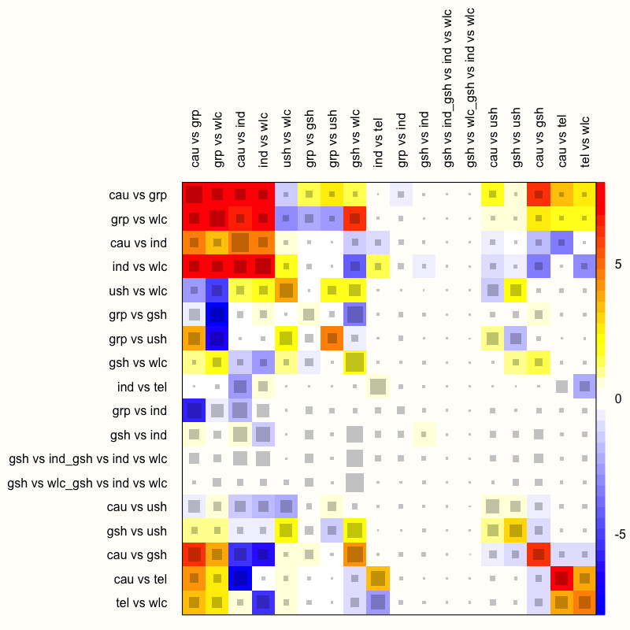
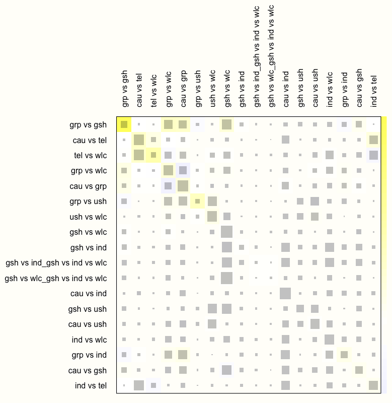
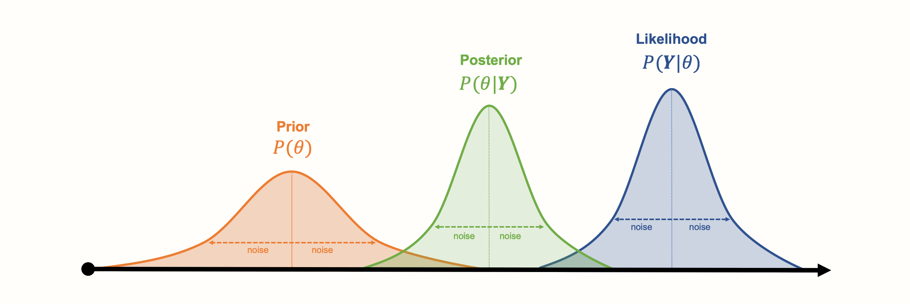
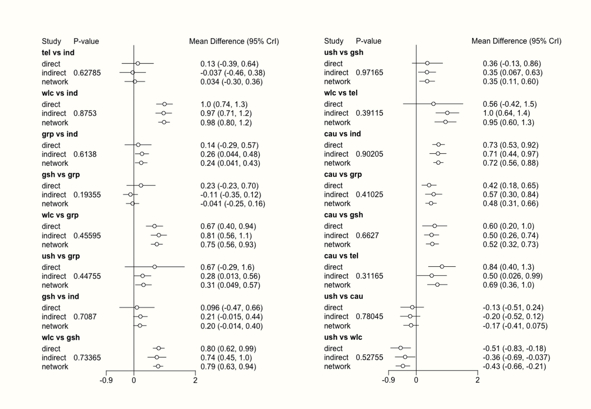

# Network Meta-Analysis {#netwma}

---


<br></br>

<span class="firstcharacter">W</span>
hen we perform meta-analyses of clinical trials or other types of intervention studies, we usually estimate the true effect size of **one** specific treatment. We include studies in which the same type of intervention was compared to similar control groups, for example a placebo. All else being equal, this allows to assess if a **specific** type of treatment is effective. 

Yet, in many research areas, there is not only one "definitive" type of treatment--there are several ones. Migraine, for example, can be treated with various kinds of medications, and non-pharmaceutical therapy options also exist. Especially in "matured" research fields, it is often less relevant to show that some kind of treatment is beneficial. Instead, we want to find out which treatment is the **most** effective for some specific indication. 

This leads to new problems. To assess the comparative effectiveness of several treatments in a conventional meta-analysis, sufficient head-to-head comparisons between two treatments need to be available. Alas, this is often not the case. In many research fields, it is common to find that only few--if any--trials have compared the effects of two treatments  **directly**, in lieu of "weaker" control groups. This often means that traditional meta-analyses can not be used to establish solid evidence on the **relative** effectiveness of several treatments. 

However, while direct comparisons between two or more treatments may not exist, **indirect** evidence is typically available. Different treatments may have been evaluated in **separate** trials, but all of these trials may have used the **same** control group. For example, it is possible that two medications were never compared directly, but that the effect of both medications compared to a pill placebo has been studied extensively. 

\index{Mixed-Treatment Comparison Meta-Analysis}

**Network meta-analysis** can be used to incorporate such indirect comparisons, and thus allows us to compare the effects of several interventions simultaneously [@dias2013evidence]. Network meta-analysis is also known as **mixed-treatment comparison meta-analysis** [@van2012automating]. This is because it integrates multiple direct and indirect treatment comparisons into one model, which can be formalized as a “network” of comparisons.

\index{Consistency}

Network meta-analysis is a “hot” research topic. In the last decade, it has been increasingly picked up by applied researchers in the bio-medical field, and other disciplines. However, this method also comes with additional challenges and pitfalls, particularly with respect to heterogeneity and so-called **network inconsistency** [@salanti2014evaluating]. 

Therefore, it is important to first discuss the core components and assumptions of network meta-analysis models. The underpinnings of network meta-analysis can be a little abstract at times. We will therefore go through the essential details in small steps, in order to get a better understanding of this method.

<br></br>

## What Are Network Meta-Analyses? {#what-is-net-ma}

---

### Direct & Indirect Evidence {#direct-indirect-evidence}

---

First, we have to understand what we mean by a "network" of treatments. Imagine that we have extracted data from some randomized controlled trial $i$, which compared the effect of treatment A to another condition B (e.g. a wait-list control group). We can illustrate this comparison graphically:


```{r, message = F, out.width = '75%', echo = F, fig.align='center'}
library(OpenImageR)

```

\index{Graph Theory}

This visual representation of a treatment comparison is called a **graph**. Graphs are structures used to model how different objects relate to each other, and there is an entire sub-field of mathematics, **graph theory**, which is devoted to this topic. 

Our graph has two core components. The first one are two circles (so-called **nodes**), which represent the two conditions A and B in trial $i$. The second component is the line connecting these two nodes. This line is called an **edge**. The edge represents how A and B relate to each other. In our case, the interpretation of the line is quite easy. We can describe the relationship between A and B in terms of the effect size $\hat\theta_{i\text{,A,B}}$ we observe when we compare A and B. This effect size can be expressed as, for example, an SMD or odds ratio, depending on the outcome measure.

Now, imagine that we have also obtained data from another study $j$. This trial also used the control condition B. But instead of administering A, this study used another treatment C. In study $j$, treatment C was also compared to B. We can add this information to our graph:

```{r, message = F, out.width = '75%', echo = F, fig.align='center'}
library(OpenImageR)

```

This creates our first small network. It is clearly visible that the graph now contains two effect size estimates: $\hat\theta_{i\text{,A,B}}$, comparing A to B, and $\hat\theta_{j\text{,C,B}}$, the comparison between C and B. Since both of these effect sizes were directly observed in "real" trials, we call such information **direct evidence**. Therefore, we denote these effect sizes with $\hat\theta^{\text{direct}}_{\text{B,A}}$ and  $\hat\theta^{\text{direct}}_{\text{B,C}}$. Condition B comes first in this notation because we determined it to be our **reference** group. We chose B as the reference condition because both trials used it as the control group.

In the new graph, all nodes (conditions) are either **directly** or **indirectly** connected. The B condition (our control group) is directly connected to all other nodes. It takes only one “step” in the graph to get from B to the two other nodes A and C: B $\rightarrow$ A, B $\rightarrow$ C. In contrast, A and C only have one direct connection, and they both connect to B: A $\rightarrow$ B and C $\rightarrow$ B. 

However, there is an indirect connection between A and C. This connection exists because B serves as the link, or **bridge**, between the two conditions: A $\rightarrow$ B $\rightarrow$ C. As a result, there is **indirect evidence** for the relationship between A and C, which can be derived from the structure of the network:


```{r, message = F, out.width = '75%', echo = F, fig.align='center'}
library(OpenImageR)

```

Using information from the directly observed edges, we can calculate the effect of the **indirectly** observed comparison between A and C. We denote this non-observed, indirect effect size with $\hat\theta^{\text{indirect}}_{\text{A,C}}$. The effect estimate can be derived using this formula [@dias2018network, chapter 1]:

\begin{equation}
\hat\theta_{\text{A,C}}^{\text{indirect}} = \hat\theta_{\text{B,A}}^{\text{direct}} - \hat\theta_{\text{B,C}}^{\text{direct}}
(\#eq:networkes)
\end{equation}

This step is a crucial component of network meta-analysis. The equation above lets us estimate the effect size of a comparison, even if it was never directly assessed in a trial. 

Network meta-analysis involves combining both direct and indirect evidence in one model. Based on this information, we can estimate the (relative) effect of each included treatment. By adding indirect evidence, we also increase the precision of an effect size estimate, even when there is direct evidence for that specific comparison. Overall, network meta-analysis comes with several benefits: 

* It allows us to pool all available information from a set of related studies in one analysis. Think of how we would usually deal in conventional meta-analyses with trials comparing different treatments to, say, a placebo. We would have to pool each comparison (e.g. treatment A compared to placebo, treatment B compared to placebo, treatment A compared to treatment B, etc.) in a separate meta-analysis.

* Network meta-analysis can incorporate indirect evidence in a network, which is not possible in conventional meta-analysis. In pairwise meta-analyses, we can only pool direct evidence from comparisons which were actually included in a trial.

* If all assumptions are met, and when the results are sufficiently conclusive, network meta-analyses allow us to infer which type of treatment may be preferable for the target population under study.

All of this sounds intriguing, but there are some important limitations we have to consider. First, look at how the variance of the indirect effect size estimate is calculated:

\begin{equation}
\text{Var} \left(\hat\theta_{\text{A,C}}^{\text{indirect}} \right) = \text{Var} \left(\hat\theta_{\text{B,A}}^{\text{direct}} \right) + \text{Var} \left(\hat\theta_{\text{B,C}}^{\text{direct}} \right)
(\#eq:nw2)
\end{equation}

To calculate the variance of the indirect comparison, we **add up** the variances of the direct comparisons. This means that effect sizes estimated from indirect evidence will always have a greater variance, and thus a lower precision, than the ones based on direct evidence [@dias2018network, chapter 1]. This is nothing but logical. We can have a much higher confidence in effect sizes which were estimated from observed data, compared to results which had to be inferred mathematically.  

\index{Consistency}
\index{Transitivity Assumption}

There is yet another issue. Equation \@ref(eq:networkes) from before, which allows us to estimate indirect evidence from direct comparisons, only holds if a crucial pre-requisite is met: the assumption of **transitivity**. From a statistical standpoint, this assumption translates to network **consistency** [@efthimiou2016getreal]. In the following, we explain what both of these terms mean, and why they are important.

<br></br>

### Transitivity & Consistency {#transitivity-consistency}

---

Network meta-analyses are certainly a valuable extension of standard meta-analytic methods. Their validity, however, has not remained uncontested. Most of the criticism of network meta-analysis revolves around, as you might have guessed, the use of indirect evidence [@edwards2009indirect; @ioannidis2006indirect]. This especially involves cases where direct evidence is actually available for a comparison. 

The key issue is that, while participants in (randomized) trials are allocated to one of the treatment conditions (e.g., A and B) **by chance**, the trial conditions themselves were not randomly selected in our network. This is of course all but logical. It is usually no problem to randomize participants into one of several conditions of a trial. Yet, it is difficult to imagine a researcher determining treatment conditions to be used in a trial via, say, a dice roll, before rolling out her study. The composition of selected trial conditions will hardly ever follow a random pattern in a network meta-analysis. 

This does not constitute a problem for network meta-analytic models _per se_ [@dias2018network, chapter 1]. Our network meta-analysis model will only be biased when the selection, or non-selection, of a specific comparison within a trial depends on the true effect of that comparison [@dias2013evidence]. This statement is quite abstract, so let us elaborate on it a little.

\index{Consistency}
\index{Transitivity Assumption}

The requirement we just mentioned is derived from the **transitivity** assumption of network meta-analyses. There is disagreement in the literature about whether this is an assumption unique to network meta-analysis, or simply an extension of the assumptions in conventional pairwise meta-analysis. The disagreement may also be partly caused by an inconsistent usage of terms in the literature [@dias2018network; @efthimiou2016getreal; @song2009methodological; @lu2009modeling]. 

The core tenet of the transitivity assumption is that we can combine direct evidence (e.g. from comparisons A $−$ B and C $−$ B) to create indirect evidence about a related comparison (e.g. A $−$ C), as we have done before using formula \@ref(eq:networkes) [@efthimiou2016getreal].

\index{Exchangeability Assumption}

The assumption of transitivity pertains to the concept  of **exchangeability**. We already described this prerequisite in chapter \@ref(rem), where we discussed the random-effects model. The exchangeability assumption says that each true effect size $\theta_i$ of some comparison $i$ is the result of a random, **independent** draw from an "overarching" distribution of true effect sizes. 

To translate this assumption to our scenario, think of network meta-analysis as a set of $K$ trials. Now, we pretend that each trial in our model contains **all possible** treatment comparisons in our network, denoted with $M$ (e.g. A $−$ B, A $−$ C, B $−$ C, and so forth). However, some of the treatment comparisons have been **"deleted"**, and are thus **"missing"** in some trials. The reason for this is that, in practice, studies can not assess all possible treatment options [@dias2013evidence]. 

The key assumption is that the effect of a comparison, e.g. A $-$ B, is **exchangeable** between trials--no matter if a trial actually assessed this comparison, or if it is is "missing". In network meta-analyses, exchangeability is fulfilled when the effect $\hat\theta_i$ of some comparison $i$ is based on a random, independent draw from the overarching distribution of true effects, no matter if this effect size is derived through direct or indirect evidence.

The assumption of transitivity can be violated when covariates or other effect modifiers (such as the age group of the studied populations, or the treatment intensity) are not evenly distributed across trials assessing, for example, condition A versus B, and C versus B [@song2009methodological]. Transitivity as such can not be tested statistically, but the risk for violating this assumption can be attenuated by only including studies for which the population, methodology and target condition are as similar as possible [@salanti2014evaluating].

The statistical manifestation of transitivity is called **consistency**, and a lack thereof is known as **inconsistency** [@efthimiou2016getreal; @cipriani2013conceptual]. Consistency means that the relative effect of a comparison (e.g. A $-$ B) based on direct evidence does not differ from the one based on indirect evidence [@schwarzer2015meta, chapter 8]:
 
\begin{equation}
\theta_{\text{A,B}}^{\text{indirect}} = \theta_{\text{A,B}}^{\text{direct}}
(\#eq:nw3)
\end{equation}

\vspace{4mm}

\index{Node Splitting}

Several methods have been proposed to diagnose inconsistency in network meta-analysis models, including **net heat plots** [@krahn2013graphical] and the **node splitting** method [@dias2010checking]. We will describe these methods in greater detail in the following sections. 

<br></br>

### Network Meta-Analysis Models {#netw-which-model}

---

This concludes our description of the basic theory and assumptions of network meta-analysis models. Before, we used a simple network with three nodes and edges as an illustration. In practice, however, the number of treatments included in a network meta-analysis is usually much higher. This quickly results in considerably more complex networks, for example one which looks like this:

\vspace{4mm}

```{r, message = F, out.width = '75%', echo = F, fig.align='center'}
library(OpenImageR)

```

Yet, with an increasing number of treatments $S$ in our network, the number of (direct and indirect) pairwise comparisons $C$ we have to estimate skyrockets:

\vspace{4mm}

```{r, message=F, warning=F, fig.width=4, fig.height=3, out.width="45%", fig.align="center", echo=F}
library(ggplot2)

C <- function(S){S*((S-1)/2)}


ggplot(data = data.frame(x = 0), mapping = aes(x = x)) + 
  stat_function(fun = C, cex = 1) + xlim(0,20) + theme_classic() +
  annotate("text", label = expression(C == S~frac((S-1),2)), x = 6, y = 150) +
  xlab("Number of treatments/conditions in network (S)") +
  ylab("Number of comparisons (C)") +
  theme(plot.background = element_rect(fill = "#FFFEFA", color = "#fbfbfb"),
        panel.background = element_rect(fill = "#FFFEFA"))

```

\vspace{4mm}

\index{Frequentist Statistics}
\index{Bayesian Hierarchical Model}

Therefore, we need a computational model which allows us to pool all available network data in an efficient and internally consistent manner. Several statistical approaches have been developed for network meta-analysis [@efthimiou2016getreal]. In the following chapters, we will discuss a **frequentist** as well as a **Bayesian hierarchical model**, and how they can be implemented in _R_.

```{block, type='boxinfo'}
**Which Modeling Approach Should I Use?**

\vspace{2mm}

While network meta-analysis models may differ in their statistical approach, the good thing is that all should produce the same results when the sample size is sufficient [@shim2019network]. In general, no network meta-analysis method is more or less valid than the other. You may therefore safely choose one or the other approach, depending on which one you find more intuitive, or based on the functionality of the _R_ package which implements it [@efthimiou2016getreal]. 

\vspace{2mm}

In most disciplines, methods based on frequentist inference are (still) much more common than Bayesian approaches. This means that some people might understand the kind of results produced by a frequentist model more easily. A disadvantage is that the implementation of frequentist network meta-analysis in _R_ (which we will cover next) does not yet support meta-regression, while this is possible using a Bayesian model.

\vspace{2mm}

In practice, a useful strategy is to choose one approach for the main analysis, and then employ the other approach in a sensitivity analysis. If the two methods come to the same conclusion, this increases our confidence that the findings are trustworthy.

```

<br></br>

## Frequentist Network Meta-Analysis {#frequentist-ma}

---

\index{netmeta Package}
\index{Frequentist Statistics}

In the following, we will describe how to perform a network meta-analysis using the **{netmeta}** package [@nemeta]. This package allows to estimate network meta-analysis models within a **frequentist** framework. The method used by **{netmeta}** is derived from graph theoretical techniques, which were originally developed for electrical networks [@rucker2012network].

```{block, type='boxinfo'}
**The Frequentist Interpretation of Probability**

\vspace{2mm}

Frequentism is a common theoretical approach to interpret the probability of some event $E$. Frequentist approaches define the probability of $E$ in terms of how often $E$ is expected to occur if we repeat some process (e.g., an experiment) **many, many times** [@aronow2019foundations, chapter 1.1.1]. 

Frequentist ideas are at the core of many statistical procedures that quantitative researchers use on a daily basis, for example significance testing, calculation of confidence intervals, or $p$-values.

```

<br></br>

### The Graph Theoretical Model

---

Let us now describe how the network meta-analysis model implemented in the **{netmeta}** package can be formulated. Imagine that we have collected effect size data from several trials. Then, we go through all $K$ trials and count the total number of treatment comparisons contained in the studies. This number of pairwise comparisons is denoted with $M$. 

We then calculate the effect size $\hat\theta_m$ for each comparison $m$, and collect all effect sizes in a vector $\boldsymbol{\hat\theta} = (\hat\theta_1, \hat\theta_2, \dots, \hat\theta_M)$. To run a network meta-analysis, we now need a model which describes how this vector of observed effect sizes $\boldsymbol{\hat\theta}$ was generated. In **{netmeta}**, the following model is used [@schwarzer2015meta, chapter 8]: 

\begin{equation}
\boldsymbol{\hat\theta} =\boldsymbol{X} \boldsymbol{\theta}_{\text{treat}} + \boldsymbol{\epsilon} 
(\#eq:nw4)
\end{equation}

We assume that the vector of observed effects sizes $\boldsymbol{\hat\theta}$ was generated by the right side of the equation--our model. The first part, $\boldsymbol{X}$ is a $m \times n$ **design matrix**, in which the columns represent the different treatments $n$, and the rows represent the treatment comparisons $m$. In the matrix, a treatment comparison is defined by a 1 and -1 in the same row, where the column positions correspond with the treatments that are being compared. 

The most important part of the formula is the vector $\boldsymbol{\theta}_{\text{treat}}$. This vector contains the **true** effects of the $n$ unique treatments in our network. This vector is what our network meta-analysis model needs to estimate, since it allows us to determine which treatments in our network are the most effective ones. 

The parameter $\boldsymbol{\epsilon}$ is a vector containing the sampling errors $\epsilon_m$ of all the comparisons. The sampling error of each comparison is assumed to be a random draw from a Gaussian normal distribution with a mean of zero and variance $\sigma^2_m$:

\begin{equation}
\epsilon_m \sim \mathcal{N}(0,\sigma_m^2)
(\#eq:nw4)
\end{equation}

To illustrate the model formula [see @schwarzer2015meta, page 189], imagine that our network meta-analysis consists of $K=$ 5 studies. Each study contains a unique treatment comparison (i.e. $K=M$). These comparisons are A $-$ B, A $-$ C, A $-$ D, B $-$ C, and B $-$ D. This results in a vector of (observed) comparisons $\boldsymbol{\hat\theta} = (\hat\theta_{1\text{,A,B}}, \hat\theta_{2\text{,A,C}}, \hat\theta_{4\text{,A,D}}, \hat\theta_{4\text{,B,C}}, \hat\theta_{5\text{,B,D}})^\top$. Our aim is to estimate the true effect size of all four conditions included in our network, $\boldsymbol{\theta}_{\text{treat}} = (\theta_{\text{A}}, \theta_{\text{B}}, \theta_{\text{C}}, \theta_{\text{D}})^\top$. If we plug these parameters into our model formula, we get the following equation:

\begin{align}
  \boldsymbol{\hat\theta} &= \boldsymbol{X} \boldsymbol{\theta}_{\text{treat}} + \boldsymbol{\epsilon} \notag \\
 \begin{bmatrix}
 \hat\theta_{1\text{,A,B}} \\
 \hat\theta_{2\text{,A,C}} \\
 \hat\theta_{3\text{,A,D}} \\
 \hat\theta_{4\text{,B,C}} \\
 \hat\theta_{5\text{,B,D}} \\
 \end{bmatrix}
 &=
 \begin{bmatrix}
 1 & -1 & 0 & 0 \\
 1 & 0 & -1 & 0 \\
 1 & 0 & 0 & -1 \\
 0 & 1 & -1 & 0 \\
 0 & 1 & 0 & -1 \\
 \end{bmatrix}
 \begin{bmatrix}
 \theta_{\text{A}} \\
 \theta_{\text{B}} \\
 \theta_{\text{C}} \\
 \theta_{\text{D}} \\
 \end{bmatrix}
 +
 \begin{bmatrix}
 \epsilon_{1} \\
 \epsilon_{2} \\
 \epsilon_{3} \\
 \epsilon_{4} \\
 \epsilon_{5} \\
 \end{bmatrix}
 (\#eq:nw5)
\end{align}

It is of note that in its current form, this model formula is problematic from a mathematical standpoint. Right now, the model is **overparameterized**. There are too many parameters $\boldsymbol{\theta}_{\text{treat}}$ in our model to be estimated based on the information at hand. 

This has something to do with the the design matrix $\boldsymbol{X}$ not having **full rank**. In our case, a matrix does not have full rank when its columns are not all **independent**; or, to put it differently, when the number of **independent** columns is smaller than the **total** number of columns, $n$^[If our matrix had fewer rows than columns ($m < n$), the matrix would not be full rank if the number of independent **rows** is smaller than the total number of rows, $m$.]. Because we are dealing with a **network** of treatments, it is clear that the treatment combinations will not be completely independent of each other. For example, the column for treatment D (the fourth column) can be described as a **linear combination** of the first three columns^[When we multiply the first three columns (representing treatments A, B and C) with -1 and add the results, we get the values in the fourth column: $(-\boldsymbol{x}_1) + (-\boldsymbol{x}_2) + (-\boldsymbol{x}_3) = \boldsymbol{x}_4$.]. 

Overall, there will at best be $n-1$ independent treatment comparisons, but our model always has to estimate the true effect of $n$ treatments in $\boldsymbol{\theta}_{\text{treat}}$. Thus, the matrix does not have full rank. The fact that $\boldsymbol{X}$ does not have full rank means that it is not **invertible**; therefore, $\boldsymbol{\theta}_{\text{treat}}$ cannot be estimated directly using a (weighted) least squares approach.


\index{Graph Theory}

This is where the **graph theoretical** approach implemented in the **{netmeta}** provides a solution. We will spare you the tedious mathematical details behind this approach, particularly since that the **{netmeta}** package will do the heavy lifting for us anyway. Let us only mention that this approach involves constructing a so-called **Moore-Penrose pseudoinverse matrix**, which then allows for calculating the fitted values of our network model using a weighted least squares approach. 

The procedure also takes care of **multi-arm** studies, which contribute more than one pairwise comparison (i.e. studies in which more than two conditions were compared). Multi-arm comparisons are **correlated** because at least one condition is compared more than once (Chapter \@ref(unit-of-analysis)). This means that the precision of multi-arm study comparisons is artificially increased--unless this is accounted for in our model. 

The model also allows us to incorporate estimates of between-study heterogeneity. Like in the "conventional" random-effects model (Chapter \@ref(rem)), this is achieved by adding the estimated heterogeneity variance $\hat\tau^2$ to the variance of a comparison $m$: $s^2_m + \hat\tau^2$. In the **{netmeta}** package, the $\tau^2$ values are estimated using an adaptation of the DerSimonian-Laird estimator [@jackson2013matrix, see also Chapter \@ref(tau-estimators)]. 

\index{Consistency}

An equivalent of $I^2$ can also be calculated, which now represents the amount of **inconsistency** in our network. Like in Higgins and Thompson's formula (see Chapter \@ref(i-squared)), this $I^2$ version is derived from $Q$. In network meta-analyses, however, $Q$ translates to the total heterogeneity in the **network** (also denoted with $Q_{\text{total}}$). Thus, the following formula is used:

\begin{equation}
I^2 = \text{max} \left(\frac{Q_{\text{total}}-\text{d.f.}} {Q_{\text{total}}}, 0 \right) 
(\#eq:nw6)
\end{equation}

Where the degrees of freedom in our network are:

\begin{equation}
\text{d.f.} = \left( \sum^K_{k=1}p_k-1 \right)- (n-1)
(\#eq:nw7)
\end{equation}

with $K$ being the total number of studies, $p$ the number of conditions in some study $k$, and $n$ the total number of treatments in our network model.

<br></br>

### Frequentist Network Meta-Analysis in _R_

---

After all this input, it is time for a hands-on example. In the following, we will use **{netmeta}** to conduct our own network meta-analysis. As always, we first install the package and then load it from the library.

```{r, message=F, warning=F}
library(netmeta)
```

<br></br>

#### Data Preparation

---

In this illustration, we use the `TherapyFormats` data. This data set is modeled after a real network meta-analysis assessing the effectiveness of different delivery formats of cognitive behavioral therapy for depression [@cuijpers2019effectiveness]. All included studies are randomized controlled trials in which the effect on depressive symptoms was measured at post-test. Effect sizes of included comparisons are expressed as the standardized mean difference (SMD) between the two analyzed conditions. 


\index{dmetar Package}

```{block, type='boxdmetar'}
**The "TherapyFormats" Data Set**

\vspace{2mm}

The `TherapyFormats` data set is part of the **{dmetar}** package. If you have installed **{dmetar}**, and loaded it from your library, running `data(TherapyFormats)` automatically saves the data set in your _R_ environment. The data set is then ready to be used. 

\vspace{2mm}

If you have not installed **{dmetar}**, you can download the data set as an _.rda_ file from the [Internet](https://www.protectlab.org/meta-analysis-in-r/data/TherapyFormats.rda), save it in your working directory, and then click on it in your R Studio window to import it. 

```


Let us have a look at the data.

```{r, message=F, warning=F}
library(dmetar)
data(TherapyFormats)

head(TherapyFormats[1:5])
```

* The second column, `TE`, contains the effect size of all comparisons, and `seTE` the respective standard error. To use **{netmeta}**, all effect sizes in our data set must be pre-calculated already. In Chapter \@ref(effects), we already covered how the most common effect sizes can be calculated, and additional tools can be found in Chapter \@ref(es-calc). 

* `treat1` and `treat2` represent the two conditions that are being compared. Our data set also contains two additional columns, which are not shown here: `treat1.long` and `treat2.long`. These columns simply contain the full name of the condition.

* The `studlab` column contains unique study labels, signifying from which study the specific treatment comparison was extracted. This column is helpful to check for multi-arm studies (i.e. studies with more than one comparison). We can do this using the `table` and `as.matrix` function:

```{r, eval=F}
as.matrix(table(TherapyFormats$author))
```

```
## [...]
## Bengston, 2004              1
## Blevins, 2003               1
## Bond, 1988                  1
## Bonertz, 2015               1
## Breiman, 2001               3
## [...]
```

Our `TherapyFormats` data set only contains one multi-arm study, the one by Breiman. This study, as we see, contains three comparisons, while all other studies only contain one. 

When we prepare network meta-analysis data, it is essential to always (1) include a study label column in the data set, (2) give each individual study a unique name in the column, and (3) to give studies which contribute two or more comparisons **exactly** the same name.

<br></br>

#### Model Fitting

---

We can now fit our first network meta-analysis model using the `netmeta` function. The most important arguments are:

* **`TE`**. The name of the column in our dataset containing the effect sizes for each comparison.

* **`seTE`**. The name of the column which contains the standard errors of each comparison.

* **`treat1`**.	The column in our data set which contains the name of the **first** treatment.

* **`treat2`**.	The column in our data set which contains the name of the **second** treatment.

* **`studlab`**.	The study from which a comparison was extracted. Although this argument is optional _per se_, we recommend to always specify it. It is the only way to let the function know if there are multi-arm trials in our network.

* **`data`**. The name of our data set.

* **`sm`**. The type of effect size we are using. Can be`"RD"` (risk difference), `"RR"` (risk ratio), `"OR"` (odds ratio), `"HR"` (hazard ratio), `"MD"` (mean difference), `"SMD"` (standardized mean difference), among others. Check the function documentation (`?netmeta`) for other available measures. 

* **`fixed`**.	Should a fixed-effect network meta-analysis should be conducted? Must be `TRUE` or `FALSE`.

* **`random`**.	Should a random-effects model be used? Either `TRUE` or `FALSE`.

* **`reference.group`**.	This lets us specify which treatment should be used as a reference treatment (e.g. `reference.group = "grp"`) for all other treatments.

* **`tol.multiarm`**.	Effect sizes of comparisons from multi-arm studies are--by design--consistent. Sometimes however, original papers may report slightly deviating results for each comparison, which may result in a violation of consistency. This argument lets us specify a **tolerance threshold** (a numeric value) for the inconsistency of effect sizes and their standard errors allowed in our model.

* **`details.chkmultiarm`**.	Whether to print the estimates of multi-arm comparisons with inconsistent effect sizes (`TRUE` or `FALSE`).

* **`sep.trts`**. The character to be used as a separator in comparison labels (for example `" vs. "`).

We save the results of our first network meta-analysis under the name `m.netmeta`. As reference group, we use the "care as usual" (`"cau"`) condition. For now, let us assume that a fixed-effect model is appropriate. This gives the following code:

\vspace{2mm}

```{r, eval=F}
m.netmeta <- netmeta(TE = TE,
                     seTE = seTE,
                     treat1 = treat1,
                     treat2 = treat2,
                     studlab = author,
                     data = TherapyFormats,
                     sm = "SMD",
                     fixed = TRUE,
                     random = FALSE,
                     reference.group = "cau",
                     details.chkmultiarm = TRUE,
                     sep.trts = " vs ")
summary(m.netmeta)
```

```
## Original data (with adjusted standard errors for multi-arm studies):
## 
##                    treat1 treat2    TE seTE seTE.adj narms multiarm
## [...]
## Burgan, 2012          ind    tel -0.31 0.13   0.1390     2         
## Belk, 1986            ind    tel -0.17 0.08   0.0830     2         
## Ledbetter, 1984       ind    tel -0.00 0.23   0.2310     2         
## Narum, 1986           ind    tel  0.03 0.33   0.3380     2         
## Breiman, 2001         ind    wlc -0.75 0.51   0.6267     3        *
## [...]
## 
## Number of treatment arms (by study):
##                          narms
## Ausbun, 1997                 2
## Crable, 1986                 2
## Thiede, 2011                 2
## Bonertz, 2015                2
## Joy, 2002                    2
## [...]
## 
## Results (fixed effects model):
## 
##                treat1 treat2   SMD         95%-CI      Q leverage
## Ausbun, 1997      grp    ind  0.06 [ 0.00;  0.12]   0.64     0.03
## Crable, 1986      grp    ind  0.06 [ 0.00;  0.12]   3.05     0.01
## Thiede, 2011      grp    ind  0.06 [ 0.00;  0.12]   0.05     0.03
## Bonertz, 2015     grp    ind  0.06 [ 0.00;  0.12]   0.01     0.01
## Joy, 2002         grp    ind  0.06 [ 0.00;  0.12]   0.02     0.00
## [....]
## 
## Number of studies: k = 182
## Number of treatments: n = 7
## Number of pairwise comparisons: m = 184
## Number of designs: d = 17
## 
## Fixed effects model
## 
## Treatment estimate (sm = 'SMD', comparison: other treatments vs 'cau'):
##         SMD             95%-CI      z  p-value
## cau       .                  .      .        .
## grp -0.5767 [-0.6310; -0.5224] -20.81 < 0.0001
## gsh -0.3940 [-0.4588; -0.3292] -11.92 < 0.0001
## ind -0.6403 [-0.6890; -0.5915] -25.74 < 0.0001
## tel -0.5134 [-0.6078; -0.4190] -10.65 < 0.0001
## ush -0.1294 [-0.2149; -0.0439]  -2.97   0.0030
## wlc  0.2584 [ 0.2011;  0.3157]   8.84 < 0.0001
##
## 
## Quantifying heterogeneity / inconsistency:
## tau^2 = 0.26; tau = 0.51; I^2 = 89.6% [88.3%; 90.7%]
## 
## Tests of heterogeneity (within designs) and inconsistency (between designs):
##                       Q d.f.  p-value
## Total           1696.84  177 < 0.0001
## Within designs  1595.02  165 < 0.0001
## Between designs  101.83   12 < 0.0001
```

There is plenty to see in this output, so let us go through it step by step. The first thing we see are the calculated effect sizes for each comparison. The asterisk signifies our multi-arm study, for which the standard error has been corrected (to account for effect size dependency). Below that, we see an overview of the number of treatment arms in each included study. 

The next table shows us the fitted values for each comparison in our (fixed-effect) network meta-analysis model. The $Q$ column in this table is usually very interesting because it tells us which comparison contributes substantially to the overall inconsistency in our network. For example, we see that the $Q$ value of `Crable, 1986` is rather high, with $Q=$ 3.05.

Then, we get to the core of our network meta-analysis: the `Treatment estimate`. As specified, the effects of all treatments are displayed in comparison to the care as usual condition, which is why there is no effect shown for `cau`. Below that, we can see that the heterogeneity/inconsistency in our network model is very high, with $I^2=$ 89.6%. This indicates that selecting a fixed-effect model was probably **not** appropriate (we will get back to this point later).

\index{Consistency}
\index{Heterogeneity}

The last part of the output (`Tests of heterogeneity`) breaks down the total heterogeneity in our network. There are two components: **within-design** heterogeneity, and inconsistency **between** designs. A "design" is defined as a selection of conditions included in one trial, for example A $-$ B, or A $-$ B $-$ C. When there are true effect size differences between studies which included exactly the same conditions, we can speak of within-design heterogeneity. Variation between designs, on the other hand, reflects the inconsistency in our network. Both the within-design heterogeneity and between-design inconsistency are highly significant ($p$s < 0.001). 

This is yet another sign that the random-effects model may be indicated. To further corroborate this, we can calculate the total inconsistency based on the **full design-by-treatment interaction random-effects model** [@higgins2012consistency]. To do this, we only have to plug the `m.netmeta` object into the `decomp.design` function.

\vspace{2mm}

```{r, eval=F}
decomp.design(m.netmeta)
```

```
## Q statistics to assess homogeneity / consistency
##  [...]
## Design-specific decomposition of within-designs Q statistic
## 
##      Design      Q df  p-value
##  cau vs grp   82.5 20 < 0.0001
##  cau vs gsh    0.7  7   0.9982
##  cau vs ind  100.0 29 < 0.0001
##  cau vs tel   11.4  5   0.0440
##  [...]
## 
## Between-designs Q statistic after detaching of single designs
## 
##    Detached design      Q df  p-value
##  [...]
##         ind vs wlc  77.23 11 < 0.0001
##         tel vs wlc  95.45 11 < 0.0001
##         ush vs wlc  95.81 11 < 0.0001
##  gsh vs ind vs wlc 101.78 10 < 0.0001
##
## Q statistic to assess consistency under the assumption of
## a full design-by-treatment interaction random effects model
## 
##                    Q df p-value tau.within tau2.within
## Between designs 3.82 12  0.9865     0.5403      0.2919
```

\index{Cochran's \textit{Q}}

In the output, we are first presented with $Q$ values showing the individual contribution of each design to the within- and between-design heterogeneity/inconsistency in our model. The important part of the output is in the last section (`Q statistic to assess consistency under the assumption of a full design-by-treatment interaction random effects model`). We see that the value of $Q$ decreases considerably when assuming a full design-by-treatment random-effects model ($Q=$ 101.83 before, $Q=$ 3.83 now), and that the between-design inconsistency is not significant anymore ($p=$ 0.986). 

This also suggests that a random-effects model may be indicated to (at least partly) account for the inconsistency and heterogeneity in our network model.


<br></br>

#### Further Examination of the Network Model

---

##### The Network Graph

---

\index{Network Graph}

After a network meta-analysis model has been fitted using `netmeta`, it is possible to produce a **network graph**. This can be done using the `netgraph` function. The `netgraph` function has many arguments, which you can look up by running `?netgraph` in your console. Most of those arguments, however, have very sensible default values, so there is not too much to specify. 

As a first step, we feed the function with our fitted model `m.netmeta`. Since we used the shortened labels in our model, we should replace them with the long version (stored in `treat1.long` and `treat2.long`) in the plot. This can be achieved using the `labels` argument, where we have to provide the full names of all treatments. The treatment labels should be in the same order as the ones stored in `m.netmeta$trts`. 

\vspace{4mm}

```{r, echo=F}
load("data/m.netmeta.rda")
```

```{r}
# Show treatment order (shortened labels)
m.netmeta$trts
```


```{r, message=F, warning=F, eval=F}
# Replace with full name (see treat1.long and treat2.long)
long.labels <- c("Care As Usual", "Group", 
                 "Guided Self-Help", 
                 "Individual", "Telephone", 
                 "Unguided Self-Help", 
                 "Waitlist")

netgraph(m.netmeta, 
         labels = long.labels)
```

```{r, message=F, warning=F, echo=F, fig.width=7, fig.height=7, echo=F, fig.align='center', out.width="55%"}

# Replace with full name (see treat1.long and treat2.long)
long.labels <- c("Care As Usual", "Group", "Guided \n Self-Help", 
                 "Individual", "Telephone", 
                 "Unguided \n Self-Help", "Waitlist")

par(bg="#FFFEFA")
# Produce the plot
netgraph(m.netmeta, labels = long.labels, col.multiarm = "lightgray", offset = 0.03, cex = 1.5)

long.labels <- c("Care As Usual", "Group", "Guided Self-Help", 
                 "Individual", "Telephone", 
                 "Unguided Self-Help", "Waitlist")
```

This network graph transports several kinds of information. First, we see the overall structure of comparisons in our network. This allows us to better understand which treatments were compared to each other in the original data. 

Furthermore, we can see that the edges in the plot have a different **thickness**. The degree of thickness represents how often we find a specific comparison in our network. For example, we see that guided self-help formats have been compared to wait-lists in many trials. We also see the multi-arm trial in our network, which is represented by a shaded triangle. This is the study by Breiman, which compared guided self-help, individual therapy, and a wait-list.

The `netgraph` function also allows to plot a **3D graph**, which can be helpful to get a better grasp of complex network structures. The function requires the **{rgl}** package to be installed and loaded. To produce a 3D graph, we only have to set the `dim` argument to `"3d"`.

```{r, eval=F}
library(rgl)
netgraph(m.netmeta, dim = "3d")
```

<br></br>

##### Visualizing Direct and Indirect Evidence

---

In the next step, let us have a look at the proportion of **direct** and **indirect** evidence used to estimate each comparison. The `direct.evidence.plot` function in **{dmetar}** has been developed for this purpose.

\index{dmetar Package}

```{block, type='boxdmetar'}
**The "direct.evidence.plot" Function**

\vspace{4mm}

The `direct.evidence.plot` function is included in the **{dmetar}**  package. Once **{dmetar}** is installed and loaded on your computer, the function is ready to be used. If you did **not** install **{dmetar}**, follow these instructions:

1. Access the source code of the function [online](https://raw.githubusercontent.com/MathiasHarrer/dmetar/master/R/direct.evidence.plot.R). 
2. Let _R_ "learn" the function by copying and pasting the source code in its entirety into the console (bottom left pane of R Studio), and then hit "Enter".
3. Make sure that the **{ggplot2}** and **{gridExtra}** package is installed and loaded.

```


The function provides us with a plot showing the percentage of direct and indirect evidence used for each estimated comparison. The only thing the `direct.evidence.plot` function requires as input is our fitted network meta-analysis model `m.netmeta`.

\vspace{2mm}

```{r, message=F, warning=F, fig.width=8, fig.height=5, fig.align='center', out.width="75%", eval=F}
library(dmetar)

d.evidence <- direct.evidence.plot(m.netmeta)
plot(d.evidence)
```


```{r, message=F, warning=F, fig.width=8, fig.height=5, fig.align='center', out.width="75%", echo=F}
library(dmetar)
# source("data/direct.evidence.plot.bw.R")

d.evidence <- dmetar::direct.evidence.plot(m.netmeta)
plot(d.evidence)
```

\index{Mean Path Length}
\index{Minimal Parallelism}

\vspace{2mm}

As we can see, there are several estimates in our network model which had to be inferred by indirect evidence alone. The plot also provides us with two additional metrics: the **minimal parallelism** and **mean path length** of each estimated comparison. According to König, Krahn, and Binder [-@konig2013visualizing], a mean path length > 2 means that a comparison estimate should be interpreted with particular caution.

<br></br>

##### Effect Estimate Table

---

Next, we can have a look at the estimates of our network for all possible treatment comparisons. To do this, we can use the matrix saved in `m.netmeta$TE.fixed` (if we use the fixed-effects model) or `m.netmeta$TE.random` (if we use the random-effects model). We need to make a few pre-processing steps to make the matrix easier to read. First, we extract the data from our `m.netmeta` object, and round the numbers in the matrix to two decimal places.

```{r}
result.matrix <- m.netmeta$TE.fixed
result.matrix <- round(result.matrix, 2)
```

Given that one "triangle" in our matrix will hold redundant information, we replace the lower triangle with empty values using this code:

```{r}
result.matrix[lower.tri(result.matrix, diag = FALSE)] <- NA
```

This gives the following result:

```{r}
result.matrix
```

If we want to report these results in our research paper, a good idea might be to also include the confidence intervals for each effect size estimate. These can be obtained the same way as before using the `lower.fixed` and `upper.fixed` (or `lower.random` and `upper.random`) matrices in `m.netmeta`.

An even more convenient way to export all estimated effect sizes is to use the `netleague` function. This function creates a table similar to the one we created above. Yet, in the matrix produced by `netleague`, the upper triangle will display only the pooled effect sizes of the **direct comparisons** available in our network, sort of like one would attain them if we had performed a conventional meta-analysis for each comparison. Because we do not have direct evidence for all comparisons, some fields in the upper triangle will remain empty. The lower triangle of the matrix produced by `netleague` contains the estimated effect sizes for **each** comparison (even the ones for which only indirect evidence was available). 

The output of `netleague` can be easily exported into a .csv file. It can be used to report comprehensive results of our network meta-analysis in a single table. Another big plus of using this function is that effect size estimates **and** confidence intervals will be displayed together in each cell. Suppose that we want to produce such a treatment estimate table, and save it as a .csv file called "netleague.csv". This can be achieved using the following code:

```{r}
# Produce effect table
netleague <- netleague(m.netmeta, 
                       bracket = "(", # use round brackets
                       digits=2)      # round to two digits

# Save results (here: the ones of the fixed-effect model)
write.csv(netleague$fixed, "netleague.csv")
```


<br></br>

##### Treatment Ranking

---

\index{Surface Under the Cumulative Ranking (SUCRA) Score}
\index{P-Score}

The most interesting question we can answer in network meta-analysis is which treatment has the highest effects. The `netrank` function implemented in **{netmeta}** is helpful in this respect. It allows us to generate a **ranking** of treatments, indicating which treatment is more or less likely to produce the largest benefits. 

The `netrank` function is, like the model used in `netmeta` itself, based on a frequentist approach. This frequentist method uses **P-scores** to rank treatments, which measure the certainty that one treatment is better than another treatment, averaged over all competing treatments. The P-score has been shown to be equivalent to the **SUCRA** score [@rucker2015ranking], which we will describe in the chapter on Bayesian network meta-analysis.

The `netrank` function requires our `m.netmeta` model as input. Additionally, we should also specify the `small.values` parameter, which defines if smaller (i.e. negative) effect sizes in a comparison indicate a beneficial (`"good"`) or harmful (`"bad"`) effect. Here, we use `small.values = "good"`, since negative effect sizes mean that a treatment was more effective in **reducing** depression. 

```{r}
netrank(m.netmeta, small.values = "good")
```

We see that individual therapy (`ind`) has the highest P-score, indicating that this treatment format may be particularly helpful. Conversely, wait-lists (`wlc`) have a P-score of zero, which seems to go along with our intuition that simply letting people wait for treatment is not the best option. 

Nonetheless, one should never automatically conclude that one treatment is the "best", solely because it has the highest score in the ranking [@mbuagbaw2017approaches]. A way to better visualize the **uncertainty** in our network is to produce a forest plot, in which one condition is used as the comparison group. 

\index{Forest Plot}

In **{netmeta}**, this can be achieved using the `forest` function. The `forest` function in **{netmeta}**  works very similar to the one of the **{meta}** package, which we already described in Chapter \@ref(forest). The main difference is that we need to specify the reference group in the forest plot using the `reference.group` argument. We use care us usual (`"cau"`) again.

\vspace{4mm}

```{r, fig.width=6, fig.height=4, out.width="80%", fig.align='center'}
forest(m.netmeta, 
       reference.group = "cau",
       sortvar = TE,
       xlim = c(-1.3, 0.5),
       smlab = paste("Therapy Formats vs. Care As Usual \n",
                     "(Depressive Symptoms)"),
       drop.reference.group = TRUE,
       label.left = "Favors Intervention",
       label.right = "Favors Care As Usual",
       labels = long.labels)
```

\vspace{4mm}

The forest plot shows that there are other high-performing treatments formats besides individual therapy. We also see that some of the confidence intervals are overlapping. This makes a clear-cut decision less easy. While individual treatments do seem to produce the best results, there are several therapy formats which also provide substantial benefits compared to care as usual. 


<br></br>

#### Evaluating the Validity of the Results

---


##### The Net Heat Plot {#net-heat-plot}

---

The **{netmeta}** package has an in-built function, `netheat`, which allows us to produce a **net heat plot**. Net heat plots are very helpful to evaluate the inconsistency in our network model, and what designs contribute to it. 

The `netheat` function only needs a fitted network meta-analysis object to produce the plot. 

```{r, fig.width=5, fig.height=5, eval=F}
netheat(m.netmeta)
```

```{r, message = F, out.width = '60%', echo = F, fig.align='center'}
library(OpenImageR)

```

The function generates a quadratic heatmap, in which each design in a row is compared to the other designs (in the columns). Importantly, the rows and columns signify specific **designs**, not individual treatment **comparisons** in our network. Thus, the plot also features rows and columns for the design used in our multi-arm study, which compared guided self-help, individual therapy, and a wait-list. The net heat plot has two important features [@schwarzer2015meta, chapter 8]:

\index{Consistency}

* **Gray boxes**. The gray boxes signify how important a treatment comparison is for the estimation of another treatment comparison. The bigger the box, the more important the comparison. An easy way to analyze this is to go through the rows of the plot one after another and to check in each row which boxes are the largest. A common finding is that boxes are large in the diagonal of the heat map because this means that direct evidence was used. A particularly big box, for example, can be seen at the intersection of the "cau vs grp" row and the "cau vs grp" column.

* **Colored backgrounds**. The colored backgrounds signify the amount of **inconsistency** of the design in a **row** that can be attributed to the design in a **column**. Field colors can range from a deep red (which indicates strong inconsistency) to blue (which indicates that evidence from this design supports evidence in the row). The `netheat` function uses an algorithm to sort rows and columns into clusters with higher versus lower inconsistency. In our plot, several inconsistent fields are displayed in the upper-left corner. For example, in the row "ind vs wlc", we see that the entry in column "cau vs grp" is displayed in red. This means that the evidence contributed by "cau vs grp" for the estimation of "ind vs wlc" is inconsistent. On the other hand, we see that the field in the "gsh vs wlc" column has a deep blue background, which indicates that evidence of this design **supports** the evidence of the row design "ind vs wlc". 

We should remind ourselves that these results are based on the fixed-effect model, since we used it to fit our network meta-analysis model. Yet, from what we have learned so far, it has become increasingly clear that using the fixed-effect model was not appropriate--there is too much heterogeneity and design inconsistency.

Therefore, let us check how the net heat plot changes when we assume a random-effects model. We can do this by setting the `random` argument in `netheat` to `TRUE`. 

```{r, fig.width=5, fig.height=5, eval=F}
netheat(m.netmeta, random = TRUE)
```

```{r, message = F, out.width = '60%', echo = F, fig.align='center'}
library(OpenImageR)

```

We see that this results in a substantial decrease of inconsistency in our network. There are no fields with a dark red background now, which indicates that the overall consistency of our model improves considerably once a random-effects model is used. 

We can therefore conclude that the random-effects model is preferable for our data. In practice, this would mean that we re-run the model using `netmeta` while setting `comb.random` to `TRUE` (and `comb.fixed` to `FALSE`), and that we only report results of analyses based on the random-effects model. We omit this step here, since all the analyses we presented before can also be applied to random-effects network models, in exactly the same way.

<br></br>

##### Net Splitting {#net-splitting}

---

\index{Node Splitting}

Another method to check for consistency in our network is **net splitting**. This method splits our network estimates into the contribution of direct and indirect evidence, which allows us to control for inconsistency in the estimates of individual comparisons in our network. To apply the net splitting technique, we only have to provide the `netsplit` function with our fitted model. 


```{r, eval=F}
netsplit(m.netmeta)
```

```
## Separate indirect from direct evidence using back-calculation method
## 
## Fixed effects model: 
## 
##  comparison  k prop     nma  direct  indir.    Diff     z  p-value
##  grp vs cau 21 0.58 -0.5767 -0.3727 -0.8628  0.4901  8.72 < 0.0001
##  gsh vs cau  8 0.22 -0.3940 -0.5684 -0.3442 -0.2243 -2.82   0.0048
##  ind vs cau 30 0.71 -0.6403 -0.7037 -0.4863 -0.2174 -3.97 < 0.0001
##  tel vs cau  6 0.35 -0.5134 -0.7471 -0.3867 -0.3604 -3.57   0.0004
##  ush vs cau  9 0.35 -0.1294 -0.1919 -0.0953 -0.0966 -1.06   0.2903
##  [...]
## 
## Legend:
##  [...]
##  Diff       - Difference between direct and indirect estimates
##  z          - z-value of test for disagreement (direct vs. indirect)
##  p-value    - p-value of test for disagreement (direct vs. indirect)
```

The most important information presented in the output is the difference between effect estimates based on direct and indirect evidence (`Diff`), and whether this difference is significant (as indicated by the `p-value` column). When a difference is $p<$ 0.05, there is a significant disagreement (inconsistency) between the direct and indirect estimate. 

We see in the output that there are indeed many comparisons which show significant inconsistency between direct and indirect evidence (when using the fixed-effects model). A good way to visualize the net split results is through a forest plot. 

```{r, fig.width=7, fig.height=17, fig.align='center', out.width="79%"}
netsplit(m.netmeta) %>% forest()
```

<br></br>

##### Comparison-Adjusted Funnel Plots

---

\index{Funnel Plot}

Assessing publication bias in network meta-analysis models is difficult. Most of the techniques that we covered in Chapter \@ref(pub-bias) are not directly applicable once we make the step from conventional to network meta-analysis. **Comparison-adjusted funnel plots**, however, have been proposed to evaluate the risk of publication bias in network meta-analyses, and can be used in some contexts [@salanti2014evaluating]. Such funnel plots are applicable when we have a **specific** hypothesis concerning how publication bias has affected our network model. 

Publication bias may be created, for example, because studies with "novel" findings are more likely to get published--even if they have a small sample size. There is a natural incentive in science to produce "groundbreaking" results, for example to show that a new type of treatment is superior to the current state of the art. 

This would mean that something similar to small-study effects (see Chapter \@ref(small-study-effects)) exists in our data. We would expect that effects of comparisons in which a new treatment was compared to an older one are **asymmetrically** distributed in the funnel plot. This is because "disappointing" results (i.e. the new treatment is not better than the old one) end up in the file drawer. With decreasing sample size, the benefit of the new treatment must be increasingly large to become significant, and thus merit publication. In theory, this would create the characteristic asymmetrical funnel plot that we also find in standard meta-analyses. 

Of course, such a pattern will only appear when the effect sizes in our plot are coded in a certain way. To test our "new versus old" hypothesis, for example, we have to make sure that each effect size used in the plot can has the same interpretation. We have to make sure that (for example) a positive effect size always indicates that the "new" treatment was superior, while a negative sign means the opposite. We can do this by defining a "ranking" of treatments from old to new, and by using this ranking to define the sign of each effect. 

The `funnel` function in **{netmeta}** can be used to generate such comparison-adjusted funnel plots. Here are the most important arguments:

* **`order`**.	This argument specifies the order of the hypothesized publication bias mechanism. We simply have to provide the names of all treatments in our network and sort them according to our hypothesis. For example, if we want to test if publication bias favored "new" treatments, we insert the names of all treatments, starting from the oldest treatment, and ending with the most novel type of intervention.

* **`pch`**. This lets us specify the symbol(s) to be used for the studies in the funnel plot. Setting this to `19` gives simple dots, for example.

* **`col`**.	Using this argument, we can specify the colors used to distinguish different comparisons. The number of colors we specify here must be the same as the number of **unique** comparisons in our funnel plot. In practice, this can mean that many different colors are needed. A complete list of colors that _R_ can use for plotting can be found [online](http://www.stat.columbia.edu/~tzheng/files/Rcolor.pdf). 

* **`linreg`**.	When set to `TRUE`, Egger's test for funnel plot asymmetry (Chapter \@ref(eggers-test)) is conducted, and its $p$-value is displayed in the plot.

Arguments that are defined for the `funnel` function in **{meta}** can also be used additionally.


```{r, fig.width=7, fig.height=5, eval=F}
funnel(m.netmeta, 
      order = c("wlc", "cau", "ind", "grp", # from old to new
                "tel", "ush", "gsh"), 
      pch = c(1:4, 5, 6, 8, 15:19, 21:24), 
      col = c("blue", "red", "purple", "forestgreen", "grey", 
              "green", "black", "brown", "orange", "pink", 
              "khaki", "plum", "aquamarine", "sandybrown", 
              "coral", "gold4"), 
      linreg = TRUE)
```

```{r, fig.width=9, fig.height=7, fig.align='center', out.width="78%", echo=F}
par(bg="#FFFEFA")
funnel(m.netmeta, 
      order = c("wlc", "cau", # from old to new
                "ind", "grp", "tel", 
                "ush", "gsh"), 
      pch = c(1:4, 5, 6, 8, 15:19, 21:24), 
      col = c("blue", "red", "purple", "forestgreen", "grey", 
              "green", "black", "brown", "orange", "pink", 
              "khaki", "plum", "aquamarine", "sandybrown", 
              "coral", "gold4"), 
      linreg = TRUE)
```

If our hypothesis is true, we can expect that studies with a small sample (and thus a higher standard error) are asymmetrically distributed around the zero line in the plot. This is because small studies comparing a novel treatment to an older one, yet finding that the new treatment is not better, are less likely to get published. Therefore, they are systematically missing on one side of the funnel.

The plot, however, looks quite symmetrical. This is corroborated by Egger's test, which is not significant ($p=$ 0.402). Overall, this does not indicate that there are small-study effects in our network. At least not because "innovative" treatments with superior effects are more likely to be found in the published literature. 

```{block, type='boxinfo'}
**Network Meta-Analysis using {netmeta}: Concluding Remarks**

\vspace{2mm}

This has been a long chapter, and we have covered many new topics. We have shown the core ideas behind the statistical model used by **{netmeta}**, described how to fit a network meta-analysis model with this approach, how to visualize and interpret the results, and how to evaluate the validity of your findings. It can not be stressed enough that (clinical) decision-making in network meta-analyses should not be based on one single test or metric. 

Instead, we have to explore our model and its results with open eyes, check the patterns we find for their consistency, and take into account the large uncertainty that is often associated with some of the estimates. 


\vspace{2mm}

In the next chapter, we will try to (re-)think network meta-analysis from a Bayesian perspective. Although the philosophy behind this approach varies considerably from the one we described here, both techniques essentially try to achieve the same thing. In practice, the analysis "pipeline" is also surprisingly similar. Time to go Bayesian!

```

<br></br>

## Bayesian Network Meta-Analysis {#bayesian-net-ma}

---

In the following, we will describe how to perform a network meta-analysis based on a Bayesian hierarchical framework. The _R_ package we will use to do this is called **{gemtc}** [@van2012automating]. But first, let us consider the idea behind Bayesian inference in general, and the type of Bayesian model we can use for network meta-analysis.


<br></br>

### Bayesian Inference {#bayesian-inference}

---

\index{Bayes' Theorem}
\index{Frequentist Statistics}
\index{Conditional Probability}

Besides the frequentist approach, **Bayesian** inference is another important strand of inference statistics. Frequentist statistics is arguably used more often in most research fields. The Bayesian approach, however, is actually older; and while being increasingly picked up by researchers in recent years [@marsman2017bayesian], it has never really been "gone" [@mcgrayne2011theory]. 

The foundation of Bayesian statistics is **Bayes’ Theorem**, first formulated by Reverend Thomas Bayes [1701-1761, @bellhouse2004reverend]. Bayesian statistics differs from frequentism because it also incorporates “subjective” **prior** knowledge to make inferences. Bayes' theorem allows us to estimate the probability of an event A, **given** that we already know that another event B has occurred. This results in a **conditional probability**, which can be denoted like this: $P(\text{A}|\text{B})$. The theorem is based on a formula that explains how this conditional probability can be calculated:

\begin{equation}
P(\text{A}|\text{B})=\frac{P(\text{B}|\text{A})\times P(\text{A})}{P(\text{B})}
(\#eq:nw8)
\end{equation}

\index{Posterior Distribution}
\index{Prior Distribution}

In this formula, the two probabilities in the numerator of the fraction each have their own names. The $P(\text{B}|\text{A})$ part is known as the **likelihood**. It is the probability of event B, given that A is the case, or occurs [@etz2018introduction]. $P(\text{A})$ is the **prior** probability that $A$ occurs. $P(\text{A}|\text{B})$, lastly, is the **posterior** probability: the probability of A given B. Since $P(\text{B})$ is a fixed constant, the formula above is often simplified:

\begin{equation}
P(\text{A}|\text{B}) \propto P(\text{B}|\text{A})\times P(\text{A})
(\#eq:nw9)
\end{equation}

Where the $\propto$ symbol means that, since we discarded the denominator of the fraction, the probability on the left remains at least **proportional** to the part on the right as values change. 

It is easier to understand Bayes' theorem if we think of the formula above as a process, beginning on the right side of the equation. We simply combine the prior information we have on the probability of A, with the likelihood of B given that A occurs, to produce our posterior, or adapted, probability of A: $P(\text{A}|\text{B})$. The crucial point here is that we can produce a "better" (posterior) estimate of A's probability when we take previous knowledge into account. This knowledge is the assumed (prior) probability of A.

Bayes' Theorem is often explained in the way we just did, with A and B standing for specific events. However, we can also think of A and B as probability **distributions** of two variables. Imagine that A is a random variable following a normal distribution. This distribution can be characterized by a set of parameters, which we denote with $\boldsymbol{\theta}$. Since A is normally distributed, $\boldsymbol{\theta}$ contains two elements: the true mean $\mu$ and variance $\sigma^2$ of A. These parameters $\boldsymbol{\theta}$ are what we actually want to estimate. 

Furthermore, imagine that for B, we have collected **actual data**, which we want to use to estimate $\boldsymbol{\theta}$. We store our observed data in a vector $\boldsymbol{Y}$. Our observed data also follows a normal distribution, represented by $P({Y})$. This leads to a formula that looks like this:

\begin{equation}
P(\boldsymbol{\theta} | {\boldsymbol{Y}} ) \propto P( {\boldsymbol{Y}} | \boldsymbol{\theta} )\times P( \boldsymbol{\theta})
(\#eq:bayes)
\end{equation}

The new equation contains $P(\boldsymbol{\theta})$, the assumed prior distribution of $\boldsymbol{\theta}$. This prior distribution can be defined by us _a priori_, either based on our previous knowledge, or even only an intuition concerning what $\boldsymbol{\theta}$ may look like. Together with the likelihood distribution $P({\boldsymbol{Y}}|\boldsymbol{\theta})$, the probability of our collected data given the parameters $\boldsymbol{\theta}$, we can estimate the posterior distribution $P(\boldsymbol{\theta}|{\boldsymbol{Y}})$. This posterior distribution represents our estimate of $\boldsymbol{\theta}$ if we take both the observed data and our prior knowledge into account. 

\index{Credible Interval}

Importantly, the posterior is still a **distribution**, not one estimated "true" value. This means that even the results of Bayesian inference are still **probabilistic**. They are also **subjective**, in the sense that they represent our **beliefs** concerning the actual parameter values. Therefore, in Bayesian statistics, we do not calculate confidence intervals around our estimates, but **credible intervals** (CrI). 

Here is a visualization of the three distributions we described before, and how they might look like in a concrete example:

```{r, message = F, out.width = '93%', echo = F, fig.align='center'}
library(OpenImageR)

```

\index{Markov Chain Monte Carlo}
\index{Gibbs Sampler}

Another asset of Bayesian approaches is that the parameters do not have to follow a bell curve distribution, like the ones in our visualization. Other kinds of (more complex) distributions can also be modeled. A disadvantage of Bayesian inference, however, is that generating the (joint) distribution from our collected data can be very computationally expensive. Special **Markov Chain Monte Carlo** simulation procedures, such as the **Gibbs sampling algorithm**, have been developed to generate posterior distributions. Markov Chain Monte Carlo is also used in the **{gemtc}** package to run our Bayesian network meta-analysis model [@van2012automating].

<br></br>

### The Bayesian Network Meta-Analysis Model {#bayesian-net-ma-model}

---


#### Pairwise Meta-Analysis

---

We will now formulate the Bayesian hierarchical model that **{gemtc}** uses for network meta-analysis. Let us start by defining the model for a conventional, pairwise meta-analysis first. 

\index{Bayesian Hierarchical Model}

This definition is equivalent to the one provided in Chapter \@ref(rem), where we discuss the "standard" random-effects model. What we describe in the following is simply the "Bayesian way" to conceptualize meta-analysis. On the other hand, this Bayesian definition of pairwise meta-analysis is already very informative, because it is directly applicable to network meta-analyses, without any further extension [@dias2013evidence]. 

We refer to this model as a Bayesian **hierarchical** model [@efthimiou2016getreal, see Chapter \@ref(bayes-hierarchical-model) for a more detailed discussion]. There is nothing mysterious about the word "hierarchical" here. Indeed, we already described in Chapter \@ref(multilevel-ma) that every meta-analysis model presupposes a hierarchical, or “multi-level” structure.

Suppose that we want to conduct a conventional meta-analysis. We have included $K$ studies, and have calculated an observed effect size $\hat\theta_k$ for each one. We can then define the fixed-effect model like so:

\begin{equation}
\hat\theta_k \sim \mathcal{N}(\theta,\sigma_k^2)
(\#eq:nw11)
\end{equation}

This formula expresses the **likelihood** of our effect sizes--the $P(\boldsymbol{Y}|\boldsymbol{\theta})$ part in equation \@ref(eq:bayes)--assuming that they follow a normal distribution. We assume that each effect size is a draw from the same distribution, the mean of which is the true effect size $\theta$, and the variance of which is $\sigma^2_k$. In the fixed-effect model, we assume that the true effect size is identical across all studies, so $\theta$ stays the same for different studies $k$ and their observed effect sizes $\hat\theta_k$. 

\index{Uninformative Prior}
\index{Prior Distribution}

An interesting aspect of the Bayesian model is that, while the true effect $\theta$ is unknown, we can still define a prior distribution for it. This prior distribution approximates how we think $\theta$ **may** look like. For example, we could assume a prior based on a normal distribution with a mean of zero, $\theta \sim \mathcal{N}(0, \sigma^2)$, where we specify $\sigma^2$. 

By default, the **{gemtc}** package uses so-called **uninformative priors**, which are prior distributions with a very large variance. This is done so that our prior "beliefs" do not have a big impact on the posterior results, and we primarily let the actually observed data "speak". We can easily extend the formula to a random-effects model:

\begin{equation}
\hat\theta_k \sim \mathcal{N}(\theta_k,\sigma_k^2)
(\#eq:nw12)
\end{equation}

This does not change much in the equation, except that now, we do not assume that each study is an estimator of the same true effect size $\theta$. Instead, we assume that there are "study-specific" true effects $\theta_k$ estimated by each observed effect size $\hat\theta_k$. Furthermore, these study-specific true effects are part of an overarching distribution of true effect sizes. This true effect size distribution is defined by its mean $\mu$ and variance $\tau^2$, our between-study heterogeneity.

\begin{equation}
\theta_k \sim \mathcal{N}(\mu,\tau^2)
(\#eq:nw13)
\end{equation}

In the Bayesian model, we also give an (uninformative) prior distribution to both $\mu$ and $\tau^2$.


<br></br>

#### Extension to Network Meta-Analysis

---

Now that we have covered how a Bayesian meta-analysis model can be formulated for one pairwise comparison, we can start to extend it to network meta-analysis. The two formulas of the random-effects model from before can be re-used for this. We only have to conceptualize the model parameters a little differently. Since comparisons in network meta-analyses can consist of varying treatments, we denote an effect size found in some study $k$ with $\hat\theta_{k \text{,A,B}}$. This signifies some effect size in study $k$ in which treatment A was compared to treatment B. If we apply this new notation, we get these formulas:

\begin{align}
\hat\theta_{k \text{,A,B}} &\sim \mathcal{N}(\theta_{k \text{,A,B}},\sigma_k^2) \notag \\
\theta_{k \text{,A,B}} &\sim \mathcal{N}(\theta_{\text{A,B}},\tau^2) (\#eq:nw14)
\end{align}

We see that the general idea expressed in the equations stays the same. We now assume that the (study-specific) true effect of the A $-$ B comparison, $\theta_{k \text{,A,B}}$, is part of an overarching distribution of true effects with mean $\theta_{\text{A,B}}$. This mean true effect size $\theta_{\text{A,B}}$ is the result of subtracting $\theta_{1\text{,A}}$ from $\theta_{1\text{,B}}$, where $\theta_{1\text{,A}}$ is the effect of treatment A compared to some predefined reference treatment $1$. Similarly, $\theta_{1\text{,B}}$ is defined as the effect of treatment B compared to the same reference treatment. In the Bayesian model, these effects compared to a reference group are also given a prior distribution.

As we have already mentioned in the previous chapter on frequentist network meta-analysis, inclusion of multi-arm studies into our network model is problematic, because the effect sizes will be correlated. In Bayesian network meta-analysis, this issue can be solved by assuming that effects of a multi-arm study stem from a **multivariate** (normal) distribution. 

Imagine that a multi-arm study $k$ examined a total of $n=$ 5 treatments: A, B, C, D, and E. When we choose E as the reference treatment, this leads to $n$ - 1 = 4 treatment effects. Using a Bayesian hierarchical model, we assume that these observed treatment effects are draws from a multivariate normal distribution of the following form^[In practice, it is usually assumed that the between-study heterogeneity variances $\tau^2$ in multi-arm trials are **homogeneous** (i.e. identical) across the comparisons. This allows us define all covariances in the matrix as $\tau^2/2$.]: 

  
\begin{align}
 \begin{bmatrix}
 \hat\theta_{k\text{,A,E}} \\
 \hat\theta_{k\text{,B,E}} \\
 \hat\theta_{k\text{,C,E}} \\
 \hat\theta_{k\text{,D,E}} 
 \end{bmatrix}
 &=
 \mathcal{N}\left(
 \begin{bmatrix}
 \theta_{\text{A,E}} \\
 \theta_{\text{B,E}} \\
 \theta_{\text{C,E}} \\
 \theta_{\text{D,E}}
 \end{bmatrix}
 ,
 \begin{bmatrix}
 \tau^2 & \tau^2/2 & \tau^2/2 & \tau^2/2 \\
 \tau^2/2 & \tau^2 & \tau^2/2 & \tau^2/2 \\
 \tau^2/2 & \tau^2/2 & \tau^2 & \tau^2/2 \\
 \tau^2/2 & \tau^2/2 & \tau^2/2 & \tau^2 
 \end{bmatrix}
 \right).
 (\#eq:nw15)
\end{align}


<br></br>

### Bayesian Network Meta-Analysis in _R_

---

\index{gemtc Package}

Now, let us use the **{gemtc}** package to perform our first Bayesian network meta-analysis. As always, we have to first install the package, and then load it from our library.

```{r, message=F, warning=F}
library(gemtc)
```

\index{Gibbs Sampler}
\index{JAGS}
\index{rjags Package}

The **{gemtc}** package depends on **{rjags}** [@rjags], which is used for the Gibbs sampling procedure that we described before (Chapter \@ref(bayesian-inference)). However, before we install and load this package, we first have to install another software called **JAGS** (short for “Just Another Gibbs Sampler”). The software is available for both Windows and Mac, and you can download it for free from the [Internet](https://sourceforge.net/projects/mcmc-jags/files/). After this is completed, we can install and load the **{rjags}** package^[Technically speaking, **JAGS** is not only a computer program, but also a programming language for Bayesian modeling that **{gemtc}** uses in the background (you can find the manual [here](https://people.stat.sc.edu/hansont/stat740/jags_user_manual.pdf)). JAGS itself relies heavily on the **BUGS** (short for "Bayesian inference Using Gibbs Sampling) language, which exists since the late 1980s [@lunn2012bugs, chapter 2.2.1].].

\vspace{2mm}

```{r, eval=F}
install.packages("rjags")
library(rjags)
```

<br></br>

#### Data Preparation

---

In our example, we will again use the `TherapyFormats` data set, which we already used to fit a frequentist network meta-analysis. However, it is necessary to tweak to the structure of our data a little so that it can be used in **{gemtc}**. 

The original `TherapyFormats` data set includes the columns `TE` and `seTE`, which contain the standardized mean difference and standard error, with each row representing one comparison. If we want to use such relative effect data in **{gemtc}**, we have to reshape our data frame so that each row represents a single **treatment arm**. Furthermore, we have to specify which treatment was used as the reference group in a comparison by filling in `NA` into the effect size column. We have saved this reshaped version of the data set under the name `TherapyFormatsGeMTC`^[We have also prepared an _R_ vignette describing how one can transform network meta-analysis data in the "wider" **{netmeta}** format to the "longer" format required for relative effect size data in **{gemtc}**. The vignette can be found online: https://www.protectlab.org/vignettes/reshape-gemtc/].

\index{dmetar Package}

```{block, type='boxinfo'}
**The "TherapyFormatsGeMTC" Data Set**

\vspace{2mm}

The `TherapyFormatsGeMTC` data set is part of the **{dmetar}** package. If you have installed **{dmetar}**, and loaded it from your library, running `data(TherapyFormatsGeMTC)` automatically saves the data set in your _R_ environment. The data set is then ready to be used. If you do not have **{dmetar}** installed, you can download the data set as an _.rda_ file from the [Internet](https://www.protectlab.org/meta-analysis-in-r/data/TherapyFormatsGeMTC.rda), save it in your working directory, and then click on it in your R Studio window to import it. 

```


The `TherapyFormatsGeMTC` data set is actually a list with two elements, one of which is called `data`. This element is the data frame we need to fit the model. Let us have a look at it.

```{r, warning=F, message=F, eval=F}
library(dmetar)
data(TherapyFormatsGeMTC)

head(TherapyFormatsGeMTC$data)
```

```{r, warning=F, message=F, echo=F}
library(dmetar)
load("data/TherapyFormatsGeMTC.rda")
head(TherapyFormatsGeMTC$data)
```


The **{gemtc}** package also requires that the columns of our data frame are labeled correctly. If we are using effect sizes based on continuous outcomes (such as the mean difference or standardized mean difference), our data set has to contain these columns:

* **`study`**. This column contains a (unique) label for each study included in our network, equivalent to the `studlab` column used in **{netmeta}**.

* **`treatment`**. This column contains the label or shortened code for the treatment.

* **`diff`**. This column contains the effect size (e.g. the standardized mean difference) calculated for a comparison. Importantly, the `diff` column contains `NA`, a missing, in the row of the reference treatment used in a comparison. The row of the treatment to which the reference treatment was compared then holds the actual effect size calculated for this comparison. Also keep in mind that the reference category is defined **study-wise**, not **comparison-wise**. This means that in multi-arm studies, we still have only one reference treatment to which all the other treatments are compared. For a three-arm study, for example, we need to include two effect sizes: one for the first treatment compared to the reference group, and a second one for the other treatment compared to the reference group. 

* **`std.err`**. This column contains the standard error of the effect sizes. It is also set to `NA` in the reference group and only defined in the row of the treatment that was compared to the reference group. 

Please note that other data entry formats are also possible, for example for binary outcome data. The way the data set needs to be structured for different types of effect size data is detailed in the **{gemtc}** documentation. You can access it by running `?mtc.model` in the console, and then scrolling to the "Details" section.

<br></br>

#### Network Graph

---

Now that we have our data ready, we feed it to the `mtc.network` function. This generates an object of class `mtc.network`, which we can use for later modeling steps. Because we are using pre-calculated effect size data, we have to specify our data set using the `data.re` argument in `mtc.network`. For raw effect size data (e.g. mean, standard deviation and sample size), we would have used the `data.ab` argument. 

The optional `treatments` argument can be used to provide **{gemtc}** with the actual names of all the treatments included in the network. This information should be prepared in a data frame with an `id` and `description` column. We have created such a data frame and saved it as `treat.codes` in `TherapyFormatsGeMTC`:

```{r}
TherapyFormatsGeMTC$treat.codes
```

We use this data frame and our effect size data in `TherapyFormatsGeMTC` to build our `mtc.network` object. We save it under the name `network`.
```{r}
network <- mtc.network(data.re  = TherapyFormatsGeMTC$data,
                       treatments = TherapyFormatsGeMTC$treat.codes)
```

Plugging the resulting object into the `summary` function already provides us with some interesting information about our network.

```{r, eval=F}
summary(network)
```

```
## $Description
## [1] "MTC dataset: Network"
## 
## $`Studies per treatment`
## ind grp gsh tel wlc cau ush 
##  62  52  57  11  83  74  26  
## 
## $`Number of n-arm studies`
## 2-arm 3-arm 
##   181     1 
## 
## $`Studies per treatment comparison`
##     t1  t2 nr
## 1  ind tel  4
## 2  ind wlc 18
## 3  grp ind  7
## [...]
```

\index{Network Graph}

We can also use the `plot` function to generate a network plot. Like the network generated by the **{netmeta}** package, the edge thickness corresponds with the number of studies we included for that comparison.

\vspace{2mm}

```{r, fig.width=8, fig.height=8, fig.align="center", out.width="65%", message=F, warning=F, eval=F}
plot(network, 
     use.description = TRUE) # Use full treatment names
```


```{r, fig.width=9, fig.height=8, fig.align="center", out.width="55%", message=F, warning=F, echo=F}
par(bg="#FFFEFA")
plot(network, 
     use.description = TRUE) # Use full treatment names
```

\vspace{2mm}

As an alternative, we can also check if we can create a better visualization of our network using the **Fruchterman-Reingold algorithm**. This algorithm comes with some inherent randomness, meaning that we have to set a seed to make our result reproducible. 

The network plots are created using the **{igraph}** package [@igraph]. When this package is installed and loaded, we can also use other arguments to change the appearance of our plot. A detailed description of the different styling options can be found in the online **{igraph}** [manual](https://igraph.org/r/doc/plot.common.html).

\vspace{2mm}

```{r, fig.width=10, fig.height=8, fig.align="center", out.width="55%", message=F, warning=F, eval=F}
library(igraph)
set.seed(12345) # set seed for reproducibility

plot(network, 
     use.description = TRUE,            # Use full treatment names
     vertex.color = "white",            # node color
     vertex.label.color = "gray10",     # treatment label color
     vertex.shape = "sphere",           # shape of the node
     vertex.label.family = "Helvetica", # label font
     vertex.size = 20,                  # size of the node
     vertex.label.dist = 2,             # distance label-node center
     vertex.label.cex = 1.5,            # node label size
     edge.curved = 0.2,                 # edge curvature
     layout = layout.fruchterman.reingold)
```

```{r, fig.width=10, fig.height=8, fig.align="center", out.width="55%", message=F, warning=F, echo=F}
library(igraph)
set.seed(12345) # set seed for reproducibility
par(bg="#FFFEFA")
plot(network, 
     use.description = TRUE,            # Use full treatment names
     vertex.color = "white",            # node color
     vertex.label.color = "gray10",     # treatment label color
     vertex.shape = "sphere",           # shape of the node
     vertex.label.family = "Helvetica", # label font
     vertex.size = 20,                  # size of the node
     vertex.label.dist = 2,             # distance label-node center
     vertex.label.cex = 1.5,            # node label size
     edge.curved = 0.2,                 # edge curvature
     layout = layout.fruchterman.reingold)
```


<br></br>

#### Model Compilation

---

Using our `mtc.network` object, we can now start to specify and compile our model. The great thing about the **{gemtc}** package is that it automates most parts of the Bayesian inference process, for example by choosing adequate prior distributions for all parameters in our model.

\index{Markov Chain Monte Carlo}

Thus, there are only a few arguments we have to specify when compiling our model using the `mtc.model` function. First, we have to specify the `mtc.network` object we have created before. Furthermore, we have to decide if we want to use a random- or fixed effects model using the `linearModel` argument. Given that our previous frequentist analysis indicated substantial heterogeneity and inconsistency (see Chapter \@ref(net-heat-plot)), we will use `linearModel = "random"`. We also have to specify the number of **Markov chains** we want to use. A value between 3 and 4 is sensible here, and we take `n.chain = 4`. 

There are two additional, optional arguments called `likelihood` and `link`. These two arguments vary depending on the type of effect size data we are using, and are automatically inferred by **{gemtc}** unless explicitly specified. Since we are dealing with effect sizes based on continuous outcome data (viz. SMDs), we are assuming a `"normal"` likelihood along with an `"identity"` link. 

Had we been using binary outcome measures (e.g. log-odds ratios), the appropriate likelihood and link would have been `"binom"` (binomial) and `"logit"`, respectively. More details on this can be found in the documentation of `mtc.model`. However, when the data has been prepared correctly in the previous step, `mtc.model` usually selects the correct settings automatically.

```{r}
# We give our compiled model the name `model`.
model <- mtc.model(network,
                   likelihood = "normal",
                   link = "identity",
                   linearModel = "random",
                   n.chain = 4)
```


<br></br>

#### Markov Chain Monte Carlo Sampling

---

\index{Markov Chain Monte Carlo}

Now we come to the crucial part of our analysis: the Markov Chain Monte Carlo (MCMC) sampling. The MCMC simulation allows to estimate the posterior distributions of our parameters, and thus to generate the results of our network meta-analysis. There are two important desiderata we want to achieve during this procedure:

* We want that the first few runs of the Markov Chain Monte Carlo simulations, which will likely produce inadequate results, to not have a large impact on the whole simulation results.

* The Markov Chain Monte Carlo process should run long enough for us to obtain accurate estimates of the model parameters (i.e. it should **converge**).

To address these points, we split the number of times the Markov Chain Monte Carlo algorithm iterates to infer the model results into **two phases**: first, we define a number of **burn-in** iterations (`n.adapt`), the results of which are discarded. For the following phase, we specify the number of actual simulation iterations (`n.iter`), which are actually used to estimate the model parameters. 

Given that we typically simulate many, many iterations, we can also specify the `thin` argument, which allows us to only extract the values of every $i$th iteration. This can help to reduce the required computer memory.

The simulation can be performed using the `mtc.run` function. In our example, we will perform two separate runs with different settings to compare which one works better. We have to provide the function with our compiled `model`object, and specify the parameters we just described. 

First, we conduct a simulation with only a few iterations, and then a second one in which the number of iterations is large. We save both objects as `mcmc1` and `mcmc2`, respectively. Note that, depending on the size of your network, the simulation may take some time to finish.

\vspace{2mm}


```{r, eval=F}
mcmc1 <- mtc.run(model, n.adapt = 50, n.iter = 1000, thin = 10)
mcmc2 <- mtc.run(model, n.adapt = 5000, n.iter = 1e5, thin = 10)
```


<br></br>

#### Assessing Model Convergence {#bayesian-model-convergence}

---

To see if our simulations have resulted in the convergence of the algorithm, and to check which settings are preferable, we can evaluate some of the outputs of our `mcmc1` and `mcmc2` objects. A good start is to use the `plot` function. This provides us with a kind of "time series", commonly referred to as a **trace plot**, for each treatment comparison over all iterations. In this example, we only focus on the estimate of the individual therapy (`ind`) versus wait-list control (`wlc`) comparison.

```{r, eval=F}
plot(mcmc1)
plot(mcmc2)
```


```{r, echo=F, fig.width = 10, fig.height=4, fig.align="center", out.width="50%"}
load("data/mcmc1.rda")
load("data/mcmc2.rda")

library(coda)
library(purrr)

mcmc1[["samples"]] %>% 
  map(function(x) {
    x[,"d.ind.wlc"]
  }) %>% as.mcmc.list() -> mcmc1.tp

mcmc2[["samples"]] %>% 
  map(function(x) {
    x[,"d.ind.wlc"]
  }) %>% as.mcmc.list() -> mcmc2.tp


coda:::plot.mcmc.list(as.mcmc.list(mcmc1.tp),
                      density = F,
                      col = "gray50",
                      main = "Trace of d.ind.wlc (mcmc1)") # remove for color plots

coda:::plot.mcmc.list(as.mcmc.list(mcmc2.tp),
                      density = F,
                      col = "gray50",
                      main = "Trace of d.ind.wlc (mcmc2)") # remove for color plots
```


When comparing earlier to later iterations in `mcmc1`, we see that there is a slight discontinuity in the overall trend of the time series. The estimates of the four different chains (the four lines) slightly differ in their course when moving from the first half to the second half of the plot. In the plot for `mcmc2`, on the other hand, we see much more rapid up-and-down variation, but no real long-term trend. This delivers a first indication that the settings in `mcmc2` are more adequate^[To be reliable, the Markov chains of an estimated parameter should have reached **stationarity** during the course of the simulation, meaning that all lines scatter randomly around a common, stable mean value. When this point is reached, the chains in the trace plot typically resemble a "fat hairy caterpillar" [@lunn2012bugs, chapter 4.4.1].].

We can continue with our convergence assessment by looking at the density plots of the posterior effect size estimate. We see that, while the distribution in `mcmc1` still diverges somewhat from a smooth normal distribution, the result of `mcmc2` comes closer to a classic bell curve.


\vspace{2mm}

```{r, echo=F, fig.width = 6, fig.height=5, out.width="50%"}
load("data/mcmc1.rda")
load("data/mcmc2.rda")

library(coda)
library(purrr)

mcmc1[["samples"]] %>% 
  map(function(x) {
    x[,"d.ind.wlc"]
  }) %>% as.mcmc.list() -> mcmc1.tp

mcmc2[["samples"]] %>% 
  map(function(x) {
    x[,"d.ind.wlc"]
  }) %>% as.mcmc.list() -> mcmc2.tp


coda:::plot.mcmc.list(as.mcmc.list(mcmc1.tp),
                      density = T,
                      trace = F,
                      col = 1,
                      main = "Density of d.ind.wlc (mcmc1)") # remove for color plots

coda:::plot.mcmc.list(as.mcmc.list(mcmc2.tp),
                      density = T,
                      trace = F,
                      col = 1,
                      main = "Density of d.ind.wlc (mcmc2)") # remove for color plots
```

\index{Potential Scale Reduction Factor}

Another highly helpful method to assess convergence is the **Gelman-Rubin plot**. This plot shows the so-called **Potential Scale Reduction Factor** (PSRF), which compares the variation within each chain to the variation between chains, and how both develop over time. In case of convergence, the PRSF should gradually shrink down to zero with increasing numbers of iterations, and should at least be below 1.05 in the end. 

To produce this plot, we simply have to plug in the `mtc.run` object into the `gelman.plot` function. Here is the result for both simulations (again only showing the `ind` versus `wlc` comparison).

\vspace{2mm}

```{r, eval=F}
gelman.plot(mcmc1)
gelman.plot(mcmc2)
```


```{r, echo=F, fig.width = 5, fig.height=5, out.width="50%"}
load("data/mcmc1.rda")
load("data/mcmc2.rda")

library(coda)
library(purrr)

mcmc1[["samples"]] %>% 
  map(function(x) {
    x[,"d.ind.wlc"]
  }) %>% as.mcmc.list() -> mcmc1.tp

mcmc2[["samples"]] %>% 
  map(function(x) {
    x[,"d.ind.wlc"]
  }) %>% as.mcmc.list() -> mcmc2.tp

gelman.plot(mcmc1.tp, main = "Gelman-Rubin Plot of d.ind.wlc (mcmc1)")
gelman.plot(mcmc2.tp, main = "Gelman-Rubin Plot of d.ind.wlc (mcmc2)")

```

We can also directly access the **overall** PSRF of our model, using this code:


```{r, eval=F}
gelman.diag(mcmc1)$mpsrf
```

```
## [1] 1.034131
```

```{r, eval=F}
gelman.diag(mcmc2)$mpsrf
```

```
## [1] 1.000351
```


We see that, while the overall PRSF is below the threshold in both simulations, the value in `mcmc2` is much lower and very close to 1. This indicates that the second model should be used. 


<br></br>

#### Assessing Inconsistency: The Nodesplit Method

---

Like the **{netmeta}** package, **{gemtc}** package also provides us with a way to evaluate the consistency of our network model: the _nodesplit_ method (Dias et al., 2010). The idea behind this procedure is similar to the one of the net splitting method that we described before (Chapter \@ref(net-splitting)). To perform a _nodesplit_ analysis, we use the `mtc.nodesplit` function, using the same settings as in `mcmc2`. We save the result as `nodesplit`. 

Please be aware that the nodesplit model computation may take a long time, even up to several hours, depending on the complexity of your network.


\index{Node Splitting}
\index{Consistency}

```{r, echo=F}
load("data/nodesplit.rda")
```


```{r, eval=F}
nodesplit <- mtc.nodesplit(network, 
                           linearModel = "random", 
                           likelihood = "normal",
                           link = "identity",
                           n.adapt = 5000, 
                           n.iter = 1e5, 
                           thin = 10)
```

Using the `summary` function, we can print the results.

```{r, eval=F}
summary(nodesplit)
```

```
## Node-splitting analysis of inconsistency
## ========================================
## 
##    comparison  p.value CrI                  
## 1  d.ind.tel   0.62785                      
## 2  -> direct           0.13 (-0.39, 0.64)   
## 3  -> indirect         -0.037 (-0.46, 0.38) 
## 4  -> network          0.034 (-0.30, 0.36)  
## 5  d.ind.wlc   0.87530                      
## 6  -> direct           1.0 (0.74, 1.3)      
## 7  -> indirect         0.97 (0.71, 1.2)     
## 8  -> network          0.98 (0.80, 1.2)     
## 9  d.ind.grp   0.61380                      
## 10 -> direct           0.14 (-0.29, 0.57)   
## 11 -> indirect         0.26 (0.044, 0.48)   
## 12 -> network          0.24 (0.041, 0.43)   
## [...]
```


The function output shows us the results for the effects of different comparisons when using only direct, only indirect, and all available evidence. Different estimates using direct and indirect evidence suggest the presence of inconsistency. We can control for this by looking at the Bayesian `p.value` column. One or more comparisons with $p<$ 0.05 are problematic, since this indicates inconsistency in our network. From the output, we see that this is not the case in our (random-effects model) example.

When the nodesplitting method **does** show inconsistencies in some of the estimates, it is important to again check **all** included evidence for potential differences between designs. It may be possible, for example, that studies comparing A and B included systematically different populations than other studies which also assessed A. 

Another approach is to check if the inconsistency persists when only a sensible subset of studies is included in the network. Lastly, it is also possible to assess reasons for inconsistency by running a network meta-regression, which we will cover later.

\index{Forest Plot}

It is also possible to generate a forest plot for the nodesplit model, using the `plot` function. However, a forest is only generated when we plug the nodesplit object into `summary` first.


```{r, eval=F}
plot(summary(nodesplit)) 
```

```{r, message = F, out.width = '90%', echo = F, fig.align='center'}
library(OpenImageR)

```

<br></br>

#### Generating the Network Meta-Analysis Results

---

Now that we fitted our network meta-analysis model, and have convinced ourselves that it is trustworthy, it is time to finally produce the results.

As mentioned before, the main question we may want to answer in network meta-analyses is which treatment performs the best. To answer this question, we can first run the `rank.probability` function. This function calculates the probability of a treatment being the best option, second best option, third best option, and so forth. The function needs our `mcmc2` object as input, and we additionally specify the `preferredDirection` argument. If smaller (i.e. negative) effect sizes indicate better outcomes, we set this argument to `-1`. Otherwise, we use `1`. 

We save the results under the name `rank`, and then visualize them using a so-called **rankogram**.

```{r, fig.height=4, fig.width=7, out.width="65%", fig.align="center", eval=F}
rank <- rank.probability(mcmc2, preferredDirection = -1)
plot(rank, beside=TRUE)
```

```{r, fig.height=4, fig.width=7, out.width="65%", fig.align="center", echo=F}
rank <- rank.probability(mcmc2, preferredDirection = -1)
par(bg="#FFFEFA")
plot(rank, beside=TRUE)
```

In this plot, we see that individual therapy (ind) is probably the best treatment option in our network, given that its first bar (signifying the first rank) is the largest. This finding is in agreement with the results of the frequentist analysis, where we found the same pattern.

Additionally, we can also produce a forest plot of our results using the `forest` function. To do this, we first have to put our results object into the `relative.effect` function and specify `t1`, the reference treatment. We use care as usual (`"cau"`) as the reference group again. Then, we call the `forest` function on the results to generate the plot.

```{r, fig.width=7, fig.height=3, fig.align="center", out.width="80%", eval=F}
forest(relative.effect(mcmc2, t1 = "cau"), 
       use.description = TRUE, # Use long treatment names
       xlim = c(-1.5, 0.5))
```

```{r, fig.width=7, fig.height=3, fig.align="center", out.width="80%", echo=F}
par(bg="#FFFEFA")
forest(relative.effect(mcmc2, t1 = "cau"), 
       use.description = TRUE, # Use long treatment names
       xlim = c(-1.5, 0.5))
```

\index{SUCRA Score}

In the chapter on frequentist network meta-analysis, we already covered the P-score as a metric to evaluate which treatment in a network is likely to be the most efficacious. An equivalent to the P-score is the **Surface Under the Cumulative Ranking** (SUCRA) score, which can be calculated like this [@salanti2011graphical]:

\begin{equation}
\text{SUCRA}_j = \frac{\sum_{b=1}^{a-1}\text{cum}_{jb}}{a-1}
(\#eq:nw16)
\end{equation}

Where $j$ is some treatment, $a$ are all competing treatments, $b$ are the $b = 1, 2, \dots, a-1$ best treatments, and $\text{cum}$ represents the **cumulative probability** of a treatment being among the $b$ best treatments. To calculate the SUCRA scores in _R_, we can use the `sucra` function. 

\index{dmetar Package}

```{block, type='boxdmetar'}
**The "sucra" Function**

\vspace{4mm}

The `sucra` function is included in the **{dmetar}**  package. Once **{dmetar}** is installed and loaded on your computer, the function is ready to be used. If you did **not** install **{dmetar}**, follow these instructions:

\vspace{2mm}

1. Access the source code of the function [online](https://raw.githubusercontent.com/MathiasHarrer/dmetar/master/R/sucra.R). 
2. Let _R_ "learn" the function by copying and pasting the source code in its entirety into the console (bottom left pane of R Studio), and then hit "Enter".
3. Make sure that the **{ggplot2}** package is installed and loaded.

```


The `sucra` function only needs a `rank.probability` object as input, and we need to specify if lower values indicate better outcomes. This can be done using the `lower.is.better` argument. Let us see what results we get.

```{r, message=F, warning=F, fig.height=3, fig.width=5, fig.align="center", out.width="40%", eval=F}
library(dmetar)
rank.probability <- rank.probability(mcmc2)
sucra <- dmetar::sucra(rank.probability, lower.is.better = TRUE)

sucra
```

```
##         SUCRA
## ind 0.9225292
## tel 0.8516583
## gsh 0.6451292
## [...]
```

```{r, message=F, warning=F, fig.height=3, fig.width=5, fig.align="center", out.width="40%", echo=F}
library(dmetar)
rank.probability <- rank.probability(mcmc2)
sucra <- dmetar::sucra(rank.probability, lower.is.better = TRUE)

```

```{r, message=F, warning=F, fig.height=4, fig.width=5, fig.align="center", out.width="50%"}
plot(sucra)
```


Looking at the SUCRA values of each treatment, we again see that individual treatment may be the best option, followed by telephone-based treatment and guided self-help.

Usually, we want to report the effect size estimate for each treatment comparison based on our model. A treatment effect table can be exported using the `relative.effect.table` function. We save the results of this function in an object called `result`, which we can then export as a .csv file. 

The `relative.effect.table` function automatically creates a treatment comparison matrix containing the estimated effect, as well as the credible intervals for each comparison. 

```{r, eval=F}
results <- relative.effect.table(mcmc2)
save(results, file = "results.csv")
```


<br></br>

### Network Meta-Regression

---

\index{Meta-Regression}
\index{gemtc Package}

A big asset of the **{gemtc}** package is that it allows us to conduct **network meta-regression**. Much like conventional meta-regression (Chapter \@ref(metareg)), we can use this functionality to determine if specific study characteristics influence the magnitude of effect sizes found in our network. It can also be a helpful tool to check for variables that may explain inconsistency.


\index{Risk of Bias}

Imagine we want to evaluate if the risk of bias of a study has an influence on the effects in our network meta-analysis. For example, it could be that studies with a high risk of bias generally report higher effects compared to the control group or alternative treatments. By including risk of bias as a predictor to our model, we can control for such an association, and assess its impact on our results.

To run a network meta-regression in **{gemtc}**, we have to follow similar steps as before, when we fitted a Bayesian network meta-analysis model without covariates. First, we need to set up our network using `mtc.network`. This time, however, we specify an additional argument called `studies`. This argument requires a data frame in which predictor information for each study is stored. The `TherapyFormatsGeMTC` data set includes an element `study.info`, which contains the risk of bias of each study. 

Let us have a quick look at the data.

```{r, eval=F}
TherapyFormatsGeMTC$study.info
```

```
##                        study rob
## 1             Campbell, 2000   1
## 2             Reynolds, 1989   1
## 3            Carpenter, 1994   0
## 4             Shrednik, 2000   1
## [...]
```

\index{Dummy Variable}

The data set contains two columns: `study`, the name of the study included in our network and `rob`, its risk of bias. Please note that the study labels must be completely identical to the ones used in the actual effect size data set. The `rob` variable is a dummy-coded predictor, where `0` indicates a low risk of bias, and `1` high risk of bias. Using the `study.info` data frame, we can now create a meta-regression network using `mtc.network`.


```{r, eval=F}
network.mr <- mtc.network(data.re = TherapyFormatsGeMTC$data,
                          studies = TherapyFormatsGeMTC$study.info,
                          treatments = TherapyFormatsGeMTC$treat.codes)
```

Now, we must define the **regressor** we want to include in our network meta-analysis model. This can be done by generating a list object with three elements:

* **`coefficient`**: We set this element to `"shared"` because we want to estimate one shared coefficient for the effect of (high) risk of bias across all treatments included in our network meta-analysis.

* **`variable`**: This specifies the name of the variable we want to use as the predictor (here: `"rob"`).

* **`control`**: We also have to specify the treatment which we want to use as the reference group. We use `"cau"` (care as usual) in our example.


```{r}
regressor <- list(coefficient = "shared",
                  variable = "rob",
                  control = "cau")
```


Next, we compile our model. We provide the `mtc.model` function with the network we just generated, set the type of our model to `"regression"`, and provide the function with the `regressor` object we just generated. We save the output under the name `model.mr`.


```{r, eval=F}
model.mr <- mtc.model(network.mr,
                      likelihood = "normal",
                      link = "identity",
                      type = "regression",
                      regressor = regressor)
```

After this step, we can run the model using the `mtc.run` function. We use the same specifications as used for fitting the `mcmc2` model before. The results are saved as `mcmc3`.

```{r, eval=F}
mcmc3 <- mtc.run(model.mr,
                 n.adapt = 5000,
                 n.iter = 1e5,
                 thin = 10)
```

```{r, echo=F}
load("data/mcmc3.rda")
```


Now, we can analyze the results using the `summary` function.

```{r, eval=F}
summary(mcmc3)
```

```
## Results on the Mean Difference scale
## [...]
## 
## 1. Empirical mean and standard deviation for each variable,
##    plus standard error of the mean:
## 
##              Mean      SD  Naive SE Time-series SE
## d.ind.cau  0.6992 0.07970 0.0003985      0.0004201
## d.ind.grp  0.1933 0.10009 0.0005005      0.0005321
## [...]
## B         -0.3297 0.13047 0.0006523      0.0010379
## 
## 2. Quantiles for each variable:
## 
##                2.5%      25%      50%     75%    97.5%
## d.ind.cau  0.542044  0.64602  0.69967  0.7529  0.85571
## d.ind.grp -0.002622  0.12599  0.19353  0.2608  0.38962
## [...]
## B         -0.586266 -0.41790 -0.32957 -0.2417 -0.07455
## 
## [...]
## -- Regression settings:
## 
## Regression on "rob", shared coefficients, "cau" as control
## Input standardized: x' = (rob - 0.4340659) / 1
## Estimates at the centering value: rob = 0.4340659
```

The results for our predictor are reported next to `B`. Because our predictor is dummy-coded, the value of `B` represents the effect of a study having a **high** risk of bias. The estimate is $b=$ -0.33, and when looking at the second table (`Quantiles for each variable`), we see that the 95% credible interval of $b$ ranges from -0.59 to -0.08. Since the credible interval does not include zero, we may conclude that risk of bias does indeed influence the results. When the risk of bias is high (`rob` = 1), we can predict higher overall effects (since negative effect sizes indicate "better" outcomes in our example).

We can explore the effect of the predictor further by generating two forest plots: one for the estimated treatment effects when the risk of bias is high, and another for when it is low. We can do this using the `relative.effect` function, where we specify the `covariate` value. A value of `covariate = 0` stands for studies with a low risk of bias, and `covariate = 1` for high risk of bias.

\vspace{2mm}

```{r, fig.show='hold', fig.width=7, fig.height=3, fig.align="center", out.width="80%", eval=F}
forest(relative.effect(mcmc3, t1 = "cau", covariate = 1),
       use.description = TRUE, xlim = c(-1.5, 1))
title("High Risk of Bias")

forest(relative.effect(mcmc3, t1 = "cau", covariate = 0),
       use.description = TRUE, xlim = c(-1.5, 1))
title("Low Risk of Bias")
```

```{r, fig.show='hold', fig.width=7, fig.height=3, fig.align="center", out.width="80%", echo=F}
par(bg="#FFFEFA")
forest(relative.effect(mcmc3, t1 = "cau", covariate = 1),
       use.description = TRUE, xlim = c(-1.5, 1))
title("High Risk of Bias")
```

```{r, fig.show='hold', fig.width=7, fig.height=3, fig.align="center", out.width="80%", echo=F}
par(bg="#FFFEFA")
forest(relative.effect(mcmc3, t1 = "cau", covariate = 0),
       use.description = TRUE, xlim = c(-1.5, 1))
title("Low Risk of Bias")
```

Comparing the forest plots, we can see that there is a pattern. The treatment effects based on high risk of bias studies are generally higher (i.e. more negative). This is in line with the estimate of our predictor $b$ in the fitted model.

\index{Akaike's Information Criterion}

Lastly, we can also examine if the network meta-regression model we just generated fits the data better than the "normal" network meta-analysis model from before. To do this, we can compare the **deviance information criteria** (DICs), which are an equivalent to the AIC and BIC values in frequentist statistics. We can access the DIC of both `mcmc3` and `mcmc2` using this code:

```{r}
summary(mcmc3)$DIC
summary(mcmc2)$DIC
```

We see in the output that the DIC value of our meta-regression model (261.19) is lower than the one of our previous model which did not control for risk of bias (DIC = 323.6). Lower DIC values indicate a better fit. Based on this finding, we can conclude that our network meta-regression model fits the data better than one without the covariate.


\index{WinBUGS}

```{block, type='boxinfo'}
**Further Reading**

\vspace{2mm}

This is the end of our brief introduction to network meta-analysis using _R_. We have described the general idea behind network meta-analysis, the assumptions and some of the caveats associated with it, two different statistical approaches through which network meta-analysis can be conducted, and how they are implemented in _R_. 

\vspace{2mm}

We would like to stress that what we covered here should only be seen as a rough overview. Although we have covered some of the main pitfalls, it is still possible that you may get stuck once you begin with your own network meta-analysis. 

\vspace{2mm}

An excellent resource to learn more about network meta-analysis and how it can be applied in practice is _Network Meta-Analysis for Decision-Making_, written by Dias and colleagues [-@dias2018network]. The book also features several hands-on examples, and shows how to run network meta-analysis models using the open source software _WinBUGS_. A shorter (and rather technical) overview of the "state-of-art" in network meta-analysis can be found in an open-access paper by Efthimiou et al. [-@efthimiou2016getreal].

```

$$\tag*{$\blacksquare$}$$

<br></br>

## Questions & Answers

```{block, type='boxquestion'}
**Test your knowledge!**

\vspace{4mm}

1. When are network meta-analyses useful? What is their advantage compared to standard meta-analyses?

\vspace{-2mm}

2. What is the difference between direct and indirect evidence in a treatment network? How can direct evidence be used to generate indirect evidence?

\vspace{-2mm}

3. What is the main idea behind the assumption of transitivity in network meta-analyses?

\vspace{-2mm}

4. What is the relationship between transitivity and consistency?

\vspace{-2mm}

5. Name two modeling approaches that can be used to conduct network meta-analyses. Is one of them better than the other?

\vspace{-2mm}

6. When we include several comparisons from one study (i.e. multi-arm studies), what problem does this cause?

\vspace{-2mm}

7. What do we have to keep in mind when interpreting the P- or SUCRA score of different treatments?

\vspace{4mm}


**Answers to these questions are listed in [Appendix A](#qanda12) at the end of this book.**

```

<br></br>

## Summary

* Network meta-analysis is a useful tool to jointly estimate the **relative effectiveness** of various treatments or interventions.

* To estimate the treatment effects, network meta-analysis **combines** both direct (i.e. observed) and indirect evidence. This, however, is based on the assumption of **transitivity**. Transitivity is fulfilled when we can combine direct evidence of two comparisons to derive valid indirect evidence about a third one. 

* The **statistical manifestation** of transitivity is consistency, the opposite of which is inconsistency. Inconsistency arises when the true effect of some comparison based on direct evidence does not coalign with the one based on indirect evidence. 

* Some methods, such as nodesplitting or net heat plots, can be used to **identify** inconsistencies in our network. When inconsistencies are found, this threatens the validity of our results as a whole. In such cases, the entire network should be checked for characteristics that may have caused systematic differences between studies/designs.  

* Network meta-analysis is possible using either a **frequentist** or **Bayesian** approach. In practice, each of these methods has individual strengths, but the overall results are usually very similar. 

* In network meta-analyses based on a Bayesian hierarchical model, we can also add study **covariates** that predict effect size differences. This results in a network meta-regression model.

* Indices such as the SUCRA or P-score can be used to examine which type of treatment may be **the most effective** in our network. However, it is also important to integrate uncertainty into our decision-making process. Confidence/credible intervals of different treatments often overlap, which makes it less clear if one format is truly superior to all the others.
