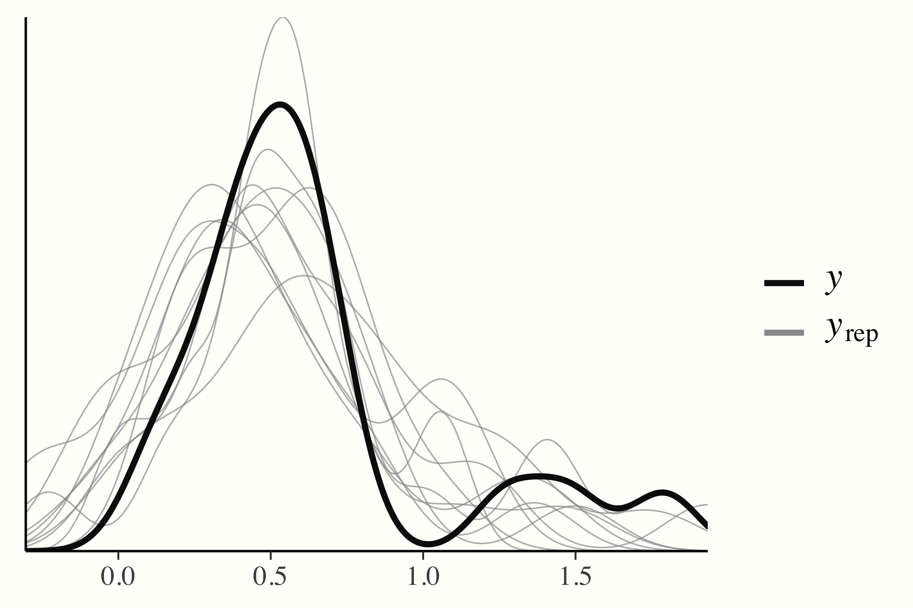
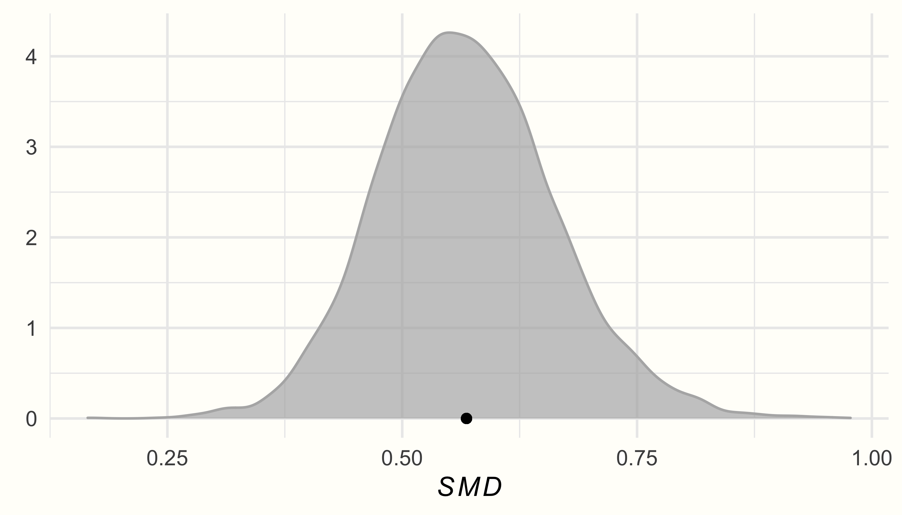
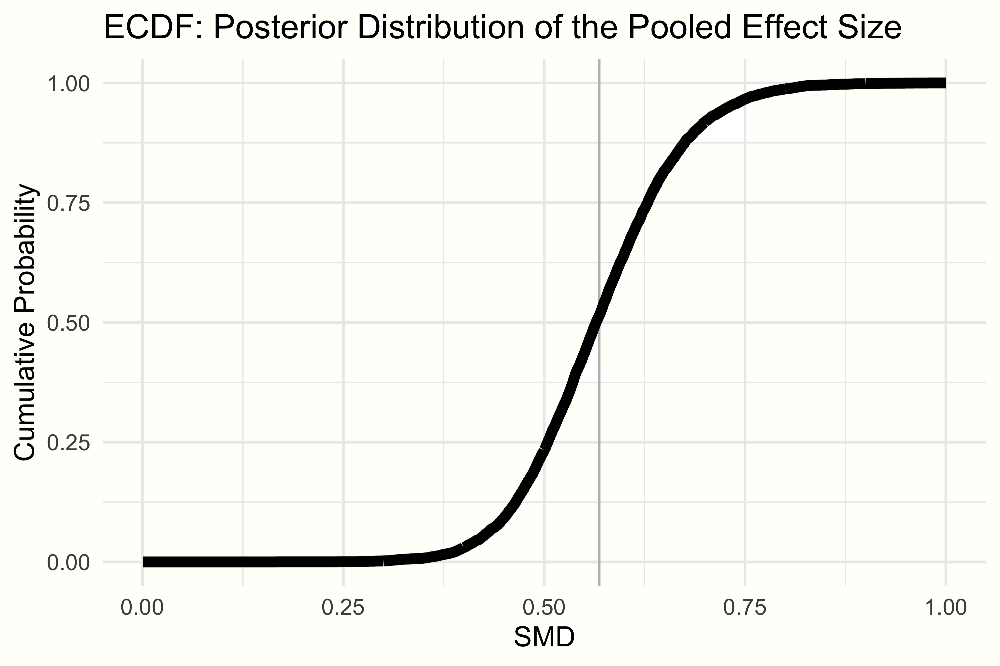
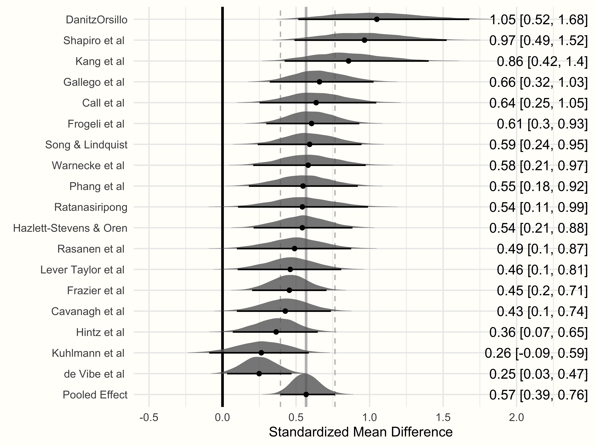

# Bayesian Meta-Analysis {#bayesian-ma}

---


<br></br>

<span class="firstcharacter">I</span>
n the last chapters, we have delved into somewhat more sophisticated extensions of meta-analysis, such as "multilevel" models (Chapter \@ref(multilevel-ma)), meta-analytic structural equation modeling (Chapter \@ref(sem)), and network meta-analysis (Chapter \@ref(netwma)). Now, we will take one step back and revisit "conventional" meta-analysis again--but this time from another angle. In this chapter, we deal with **Bayesian meta-analysis**. 

\index{gemtc Package}
\index{Frequentist Statistics}

We already covered a Bayesian model in the last chapter on network meta-analysis. There, we discussed the main ideas behind Bayesian statistics, including Bayes' theorem and the idea of prior distributions (see Chapter \@ref(bayesian-inference)). In the present chapter, we build on this knowledge and try to get a more thorough understanding of the "Bayesian way" to do meta-analysis. When we set up our Bayesian network meta-analysis model, for example, the **{gemtc}** package specified the priors automatically for us. Here, we will do this ourselves. 

While its background is slightly more involved, we will see that Bayesian meta-analysis essentially aims to do the same thing as any "conventional" meta-analysis: it pools observed effect sizes into one overall (true) effect. Using a Bayesian model, however, also comes with several practical advantages compared to frequentist approaches. This makes it worthwhile to learn how we can implement such models using _R_. 

<br></br>

## The Bayesian Hierarchical Model {#bayes-hierarchical-model}

---

\index{Bayesian Hierarchical Model}

To perform a Bayesian meta-analysis, we employ a so-called **Bayesian hierarchical model** [@rover2017bayesian; @higgins2009re]. We already briefly covered this type of model in the network meta-analysis chapter (Chapter \@ref(bayesian-net-ma-model)). 

In Chapter \@ref(multilevel-ma), we learned that every meta-analytic model comes with an inherent "multilevel", and thus **hierarchical**, structure. On the first level, we have the individual participants. Data on this level usually reaches us in the form of calculated effect sizes $\hat\theta_k$ of each study $k$. We assume that participants are nested within studies on the second level and that the true effect sizes $\theta_k$ of different studies in our meta-analysis follow their own distribution. This distribution of true effects has a mean $\mu$ (the pooled “true” effect we want to estimate) and variance $\tau^2$, representing the between-study heterogeneity.

Let us try to formalize this. On the first level, we assume that the observed effect size $\hat\theta_k$ reported in study $k$ is an estimate of the "true" effect $\theta_k$ in this study. The observed effect $\hat\theta_k$ deviates from $\theta_k$ due to the sampling error $\epsilon_k$. This is because we assume that $\hat\theta_k$ was drawn (sampled) from the population underlying $k$. This population can be seen as a distribution with mean $\theta_k$, the "true" effect of the study, and a variance $\sigma^2$. 

In the second step, we assume that the true effect sizes $\theta_k$ themselves are only samples of an overarching distribution of true effect sizes. The mean of this distribution $\mu$ is the pooled effect size we want to estimate. The study-specific true effects $\theta_k$ deviate from $\mu$ because the overarching distribution also has a variance $\tau^2$, signifying the between-study heterogeneity. Taken together, this gives these two equations:

\begin{align}
\hat\theta_k &\sim \mathcal{N}(\theta_k,\sigma_k^2) \notag \\
\theta_k &\sim \mathcal{N}(\mu,\tau^2) (\#eq:by1)
\end{align}

Here, we use $\mathcal{N}$ to indicate that parameters to the left were sampled from a **normal** distribution. Some may argue that this is an unnecessarily strict assumption for the second equation [@higgins2009re], but the formulation as shown here is the one that is used most of the time. As covered before, the fixed-effect model is simply a special case of this model in which we assume that $\tau^2 = 0$, meaning that there is no between-study heterogeneity, and that all studies share one single true effect size (i.e. that for all studies $k$: $\theta_k = \mu$). 

We can also simplify this formula by using the marginal form:

\begin{equation}
\hat\theta_k  \sim \mathcal{N}(\mu,\sigma_k^2 + \tau^2)
(\#eq:by2)
\end{equation}

You may have already detected that these formulas look a lot like the ones we defined when discussing the random-effects (Chapter \@ref(rem)) and three-level meta-analysis (Chapter \@ref(multilevel-nature)) model. Indeed, there is nothing particularly "Bayesian" about this formulation. This changes, however, when we add the following equations [@williams2018bayesian]:

\begin{align}
(\mu, \tau^2) &\sim p(.) \notag \\
\tau^2 &> 0 (\#eq:by3)
\end{align}

\index{Prior Distribution}

The first line is particularly important. It defines **prior distributions** for the parameters $\mu$ and $\tau^2$. This allows us to specify **a priori** how we think the true pooled effect size $\mu$ and between-study heterogeneity $\tau^2$ may look like, and how certain we are about this. The second equation adds the constraint that the between-study heterogeneity variance must be larger than zero. However, this formula does not specify the exact **type** of prior distribution used for $\mu$ and $\tau^2$. It only tells us that **some** prior distribution is assumed. We will cover reasonable, specific priors for Bayesian meta-analysis models in more detail later.

\index{Markov Chain Monte Carlo}
\index{Gibbs Sampler}
\index{brms Package}
\index{No-U-Turn Sampler (NUTS)}

In the chapter on network meta-analysis, we already covered the method through which Bayesian approaches estimate model parameters. To recap, this involves using **Markov Chain Monte Carlo**-based sampling procedures, for example **Gibbs sampling**. In the **{brms}** package, which we will be using in this chapter, so-called **No-U-Turn** sampling [NUTS, @hoffman2014no] is used^[NUTS is an extension of so-called **Hamiltonian Monte Carlo** (HMC), with the latter being another type of Markov Chain Monte Carlo method. Compared to other approaches (e.g. Gibbs sampling), HMC can provide a more efficient solution to estimate hierarchical models [such as those used for meta-analysis, @betancourt2015hamiltonian]. A brief description of HMC and NUTS can be found in the **Stan** <a href="https://mc-stan.org/docs/2_26/reference-manual/hamiltonian-monte-carlo.html" target="_blank">reference manual</a> (Stan is the low-level programming language on which **{brms}** is based, see Chapter \@ref(bayes-ma-R)).].

\index{meta Package}
\index{metafor Package}
\index{Posterior Distribution}

In the previous chapters, we primarily used the **{meta}** and **{metafor}** packages. These packages allow to conduct meta-analyses based on a non-Bayesian, or **frequentist** framework. Therefore, you might be wondering why one should start using Bayesian methods, given that we can already resort to such powerful tools using "conventional" approaches. The reason is that Bayesian meta-analysis comes with a few distinct advantages [@williams2018bayesian; @mcneish2016using; @chung2013nondegenerate]:

* Bayesian methods allow to directly model the **uncertainty** in our estimate of $\tau^2$. They can also be superior in estimating pooled effects, particularly when the number of included studies is small (which is very often the case in practice).

* Bayesian methods produce full **posterior distributions** for both $\mu$ and $\tau^2$. This allows to calculate the exact **probability** that $\mu$ or $\tau^2$ is smaller or larger than some specified value. This is in contrast to frequentist methods, where we only calculate confidence intervals. However, (95%) confidence intervals only state that, if data sampling were repeated many, many times, the true value of a population parameter (such as $\mu$ or $\tau^2$) would fall into the range of the confidence interval in 95% of the samples. They do not tell us the **probability** that the true parameter lies between two specified values.

* Bayesian methods allow us to integrate **prior knowledge** and assumptions when calculating meta-analyses.

<br></br>

## Setting Prior Distributions {#priors}

---

Before, we formalized the hierarchical model we can use to pool effects in a Bayesian meta-analysis. However, to run such a model, we have to specify the prior distributions of $\mu$ and $\tau^2$. Particularly when the number of studies is small, priors can have a considerable impact on the results, so we should choose them wisely. 

\index{Uninformative Prior}
\index{Weakly Informative Prior}

Generally, a good approach is to use **weakly informative** priors [@williams2018bayesian]. Weakly informative priors can be contrasted with **non-informative** priors. Non-informative priors are the simplest form of a prior distribution. They are usually based on **uniform** distributions, and are used to represent that all values are equally credible. 

Weakly informative priors, on the other hand, are a little more sophisticated. They rely on distributions which represent that we have a **weak** belief that some values are more credible than others. However, they are still not making any specific statements concerning the value of the parameter to be estimated from our data. 

\index{Standardized Mean Difference}

Intuitively, this makes a lot of sense. In many meta-analyses, for example, it seems reasonable to assume that the true effect lies somewhere between SMD = -2.0 and 2.0, but will unlikely be SMD = 50. Based on this rationale, a good starting point for our $\mu$ prior may therefore be a normal distribution with mean 0 and variance 1. This means that we grant an approximate 95% prior probability that the true pooled effect size $\mu$ lies between −2.0 and 2.0:

\begin{equation}
\mu \sim \mathcal{N}(0,1)
(\#eq:by4)
\end{equation}

The next prior we have to specify is the one for $\tau^2$. This one is a little more difficult since we know that $\tau^2$ should always be non-negative, but can be (close to) zero. A recommended distribution for this case, and one which is often used for variances such as $\tau^2$, is the **Half-Cauchy** prior. The Half-Cauchy distribution is a special case of a Cauchy distribution, which is only defined for one "half" (i.e. the positive side) of the distribution^[The standard Cauchy distribution itself is a special case of the $t$ distribution with $\text{d.f.}=1$.]. 

The Half-Cauchy distribution is controlled by two parameters. The first one is the location parameter $x_0$, which specifies the peak of the distribution. The second one is $s$, the scaling parameter. It controls how **heavy-tailed** the distribution is (i.e. how much it "spreads out" to higher values). The Half-Cauchy distribution is denoted with $\mathcal{HC}(x_0,s)$.

The graph below visualizes the Half-Cauchy distribution for varying values of $s$, with the value of $x_0$ fixed at 0.

\vspace{2mm}

```{r, echo=F, fig.width=5, fig.height=4, fig.align='center', out.width="55%"}
library(ggplot2)

hc_03 = function(x) {(0.3^2/(x^2+0.3^2)*(1/(pi*0.3)))}
hc_05 = function(x) {(0.5^2/(x^2+0.5^2)*(1/(pi*0.5)))}
hc_1 = function(x) {(1/(x^2+1)*(1/(pi)))}


ggplot(data = data.frame(x = 0), mapping = aes(x = x)) +
  stat_function(fun = hc_03,fill = "gray80",color = "black", alpha = 0.3, geom="area", size = 0.1) + 
  stat_function(fun = hc_05,fill = "gray50",color = "black", alpha = 0.3, geom="area", size = 0.1) + 
  stat_function(fun = hc_1, fill= "gray20", color = "black", alpha = 0.3, geom="area", size = 0.1) + 
  ylab(bquote(italic(y))) +
  xlab(bquote(italic(x))) +
  scale_x_continuous(expand = c(0, 0), limits = c(0, 1.5)) +
  scale_y_continuous(expand = c(0, 0), limits = c(0, 1.1)) +
  theme_classic() +
  annotate("text", x = 0.4, y = 0.9, 
           label = "atop(bold(HC(0,0.3)), y==(frac(0.3^2, x^2+0.3^2)) (frac(1,pi~0.3)))", 
           hjust = "left", parse = TRUE, color = "black") +
  annotate("text", x = 0.75, y = 0.6, 
           label = "atop(bold(HC(0,0.5)), y==(frac(0.5^2, x^2+0.5^2)) (frac(1,pi~0.5)))", 
           hjust = "left", parse = TRUE, color = "black") +
  annotate("text", x = 1.2, y = 0.4, 
           label = "atop(bold(HC(0,1)), y==(frac(1, x^2+1)) (frac(1,pi)))", 
           hjust = "left", parse = TRUE, color = "black") +
  annotate(geom = "curve", color = "black", x = 0.38, y = 0.85, xend = 0.2, yend = hc_03(0.2), 
            curvature = .1, arrow = arrow(length = unit(2, "mm"))) +
  annotate(geom = "curve", color = "black", x = 0.73, y = 0.55, xend = 0.51, yend = hc_05(0.51), 
            curvature = .1, arrow = arrow(length = unit(2, "mm"))) +
  annotate(geom = "curve", color = "black", x = 1.18, y = 0.35, xend = 1.1, yend = hc_1(1.1), 
            curvature = .1, arrow = arrow(length = unit(2, "mm"))) +
  theme(panel.background = element_rect(fill = "#FFFEFA", size = 0),
        plot.background = element_rect(fill = "#FFFEFA", size = 0))


```

\vspace{2mm}

The Half-Cauchy distribution typically has rather heavy tails, which makes it particularly useful as a prior distribution for $\tau$. The heavy tails ensure that we still give very high values of $\tau$ **some** probability, while at the same time assuming that lower values are more likely. 

In many meta-analyses, $\tau$ (the square root of $\tau^2$) lies somewhere around 0.3, or at least in the same ballpark. To specify the Half-Cauchy prior, we may therefore use $s=$ 0.3. This ensures that a value of less than $\tau=$ 0.3 has a 50% probability [@williams2018bayesian]. We can confirm this using the Half-Cauchy distribution function implemented in the `phcauchy` function of the **{extraDistr}** package [@extradistr].

\index{extraDistr Package}

```{r, message=F, warning=F}
library(extraDistr)
phcauchy(0.3, sigma = 0.3)
```

However, this is already a quite specific assumption concerning the true value of $\tau$. A more conservative approach, which we will follow in our hands-on example, is to set $s$ to 0.5; this makes the distribution flatter. In general, it is advised to always conduct sensitivity analyses with different prior specifications to check if they affect the results substantially. Using $s=$ 0.5 as our parameter of the Half-Cauchy distribution, we can write down our $\tau$ prior like this:

\begin{equation}
\tau \sim \mathcal{HC}(0,0.5)
(\#eq:by5)
\end{equation}

We can now put together the formulas of the hierarchical model, and our prior specifications. This leads to the complete model we can use for our Bayesian meta-analysis:

\begin{align}
\hat\theta_k &\sim \mathcal{N}(\theta_k,\sigma_k^2) \notag \\
\theta_k &\sim \mathcal{N}(\mu,\tau^2) \notag \\
\mu &\sim \mathcal{N}(0,1) \notag \\
\tau &\sim \mathcal{HC}(0,0.5) (\#eq:by5)
\end{align}

<br></br>

## Bayesian Meta-Analysis in _R_ {#bayes-ma-R}

---

\index{brms Package}
\index{STAN}
\index{Generalized Additive Model}

Now that we have defined the Bayesian model for our meta-analysis, it is time to implement it in _R_. Here, we use the **{brms}** package [@burknerJSS; @burkner2017advanced] to fit our model. The **{brms}** package is a very versatile and powerful tool to fit Bayesian regression models. It can be used for a wide range of applications, including multilevel (mixed-effects) models, generalized linear models, multivariate models, and generalized additive models, to name just a few. Most of these models require person-level data but **{brms}** can also be used for meta-analysis, where we deal with (weighted) study-level data^[The **{brms}** package is based on **Stan**, a low-level programming language for Bayesian modeling. The Stan project has its own, actively maintained online forum (https://discourse.mc-stan.org/), where issues pertaining to **{brms}** can also be discussed. The forum also has a "meta-analysis" tag, which allows to filter out potentially relevant threads.].

Before we start fitting the model, we first have to install and load the **{brms}** package.

```{r, message=F, warning=F, eval=F}
library(brms)
```

<br></br>

### Fitting the Model

---

In our hands-on example, we again use the `ThirdWave` data set, which contains information from a meta-analysis investigating the effects of "third wave" psychotherapies in college students (Chapter \@ref(pre-calculated-es)). Before we fit the model, let us first specify the prior distribution of the overall effect size $\mu$ and the between-study heterogeneity $\tau$. Previously, we defined that $\mu \sim \mathcal{N}(0,1)$ and $\tau \sim \mathcal{HC}(0,0.5)$. 

We can use the `prior` function to specify the distributions. The function takes two arguments. In the first argument, we specify the distribution we want to assume for our prior, including the distribution parameters. In the second argument, we have to define the `class` of the prior. For $\mu$, the appropriate class is `Intercept`, since it is a fixed population-level effect. For $\tau$, the class is `sd`, because it is a variance (or, to be more precise, a **standard deviation**). We can define both priors using the `prior` function, then concatenate them, and save the resulting object as `priors`. 

```{r, eval=F}
priors <- c(prior(normal(0,1), class = Intercept),
            prior(cauchy(0,0.5), class = sd))
```

Now, we can proceed and fit the model. To do this, we use the `brm` function in **{brms}**. The function has many arguments, but only a few are relevant for us.

In the **`formula`** argument, the formula for the model is specified. The **{brms}** package uses a regression formula notation, in which an outcome (in our case, an observed effect size) `y` is predicted by one or more predictors `x`. A tilde (`~`) is used to specify that there is a predictive relationship: `y ~ x`. 

Meta-analyses are somewhat special, because we do not have a variable predicting the effect size (unless when we perform a meta-regression). This means that `x` has to be replaced with `1`, indicating an **intercept-only** model. Furthermore, we cannot simply use the effect size of each study in `y` **as is**. We also have to give studies with higher precision (i.e. sample size) a greater weight. This can be done by using `y|se(se_y)` instead of only `y`, where the `se(se_y)` part stands for the standard error of each effect size `y` in our data set. 

If we want to use a random-effects model, the last step is to add a random-effects term `(1|study)` to the right side of the formula. This specifies that the effect sizes in `y` are assumed to be nested within studies, the true effects of which are themselves random draws from an overarching population of true effect sizes. If we want to use a fixed-effect model, we can simply omit this term. The generic full formula for a random-effects model therefore looks like this: `y|se(se_y) ~ 1 + (1|random)`. To learn more about the formula setup in `brm` models, you can type `?brmsformula` in your console to open the documentation.

The other arguments are fairly straightforward. In `prior`, we specify the priors we want to define for our model. In our example, we can simply plug in the `priors` object we created previously. The `iter` argument specifies the number of iterations of the MCMC algorithm. The more complex your model, the higher this number should be. However, more iterations also mean that the function will take longer to finish. Lastly, we also have to specify `data`, where we simply provide the name of our data set.

We save our fitted Bayesian meta-analysis model under the name `m.brm`. The code looks like this:

```{r, eval=F}
m.brm <- brm(TE|se(seTE) ~ 1 + (1|Author),
             data = ThirdWave,
             prior = priors,
             iter = 4000)
```

Please be aware that Bayesian methods are much more computationally expensive compared to standard meta-analytic techniques we covered before. It may therefore take a few minutes until the sampling is completed.


<br></br>

### Assessing Convergence & Model Validity

---

\index{Markov Chain Monte Carlo}

Before we start analyzing the results, we have to make sure that the model has **converged** (i.e. that the MCMC algorithm found the optimal solution). If this is not the case, the parameters are not trustworthy and should not be interpreted. Non-convergence happens frequently in Bayesian models and can often be resolved by re-running the model with more iterations (`iter`). To assess the convergence and overall validity of our model, we should always do two things. First, check the $\hat{R}$ values of the parameter estimates, and secondly, conduct **posterior predictive checks**.

The $\hat{R}$ value represents the **Potential Scale Reduction Factor** (PSRF) we already covered when discussing Bayesian network meta-analysis (Chapter \@ref(bayesian-model-convergence)). The $\hat{R}$ value of our estimates should be smaller than 1.01. To check this, we can produce a `summary` of our `m.brm` object.

```{r, eval=F}
summary(m.brm)
```

```
## Family: gaussian 
##   Links: mu = identity; sigma = identity 
## Formula: TE | se(seTE) ~ 1 + (1 | Author) 
##    Data: ThirdWave (Number of observations: 18) 
## Samples: 4 chains, each with iter = 4000; warmup = 2000; thin = 1;
##          total post-warmup samples = 8000
## 
## Group-Level Effects: 
## ~Author (Number of levels: 18) 
##               Estimate Est.Error l-95% CI u-95% CI Rhat Bulk_ESS 
## sd(Intercept)     0.29      0.10     0.11     0.51 1.00     2086   
## 
## Population-Level Effects: 
##           Estimate Est.Error l-95% CI u-95% CI Rhat Bulk_ESS 
## Intercept     0.57      0.09     0.39     0.76 1.00     3660    
## 
##
## [...]
## 
## Samples were drawn using sampling(NUTS). For each parameter, 
## Bulk_ESS and Tail_ESS are effective sample size measures, 
## and Rhat is the potential scale reduction factor on split 
## chains (at convergence, Rhat = 1).
```


As we can see, the `Rhat` value for both parameters is 1, signifying convergence. This means that the results can be interpreted.

In a posterior predictive check, on the other hand, data are simulated through random draws from the posterior predictive distribution and then compared to the observed data. If a model has converged and captures the data well, we can expect that the densities of the replications are roughly similar to the one of the observed data. This can easily be checked using the output of the `pp_check` function.

\vspace{2mm}

```{r, eval=F}
pp_check(m.brm)
```


```{r, message=F, warning=F, echo=F, fig.width=5, fig.height=4, fig.align='center', out.width="50%", eval = F}
load("data/m.brm.rda")
library(bayesplot)
library(brms)
color_scheme_set(scheme = "darkgray")
set.seed(123)
pp_check(m.brm)
```

```{r, message = F, out.width = '50%', echo = F, fig.align='center'}
library(OpenImageR)

```

\index{Potential Scale Reduction Factor}


<br></br>

### Interpreting the Results

---

We can begin to interpret the results by looking at the `Group-Level Effects` in our summary output first. This section is reserved for the random effect we defined in our formula. Since we fitted a random-effects meta-analysis model, the variable `~Author`, signifying the individual studies, has been modeled with a random intercept. As we described before, this represents our assumption on level 2 that each study has its own "true" effect size, which has been sampled from an overarching distribution of true effect sizes. We also see that our group-level effect has 18 levels, corresponding with the $K=$ 18 studies in our data. 

The estimate of the between-study heterogeneity, `sd(Intercept)`, is $\tau=$ 0.29, thus closely resembling our initial "best guess" when setting the priors. Using the `ranef` function, we can also extract the estimated deviation of each study's "true" effect size from the pooled effect:

```{r, eval=F}
ranef(m.brm)
```

```
## $Author
## , , Intercept
##                           Estimate Est.Error         Q2.5       Q97.5
## Call et al.             0.06836636 0.1991649 -0.327463365  0.47663987
## Cavanagh et al.        -0.14151644 0.1767123 -0.510165576  0.18799272
## DanitzOrsillo           0.48091338 0.2829719 -0.003425284  1.08636421
## de Vibe et al.         -0.31923470 0.1454819 -0.612269461 -0.03795683
## Frazier et al.         -0.11388029 0.1497128 -0.417029387  0.17085917
## [...]
```

The next part of the output we can interpret are the `Population-Level Effects`. This section represents the "fixed" population parameters we modeled. In our case, this is $\mu$, the overall effect size of our meta-analysis.

\index{Credible Interval}

In the output, we see that the estimate is a (bias-corrected) SMD of 0.57, with the 95% credible interval ranging from 95%CrI: 0.39−0.76. This indicates that the interventions studied in this meta-analysis have a moderate-sized overall effect.

Because this is a Bayesian model, we do not find any $p$-values here. But our example should underline that we can also make reasonable inferences without having to resort to classical significance testing. A great thing we can do in Bayesian, but not in frequentist meta-analysis, is to model the parameters we want to estimate **probabilistically**. The Bayesian model not only estimates the parameters of interest but a whole posterior distribution for $\tau^2$ and $\mu$, which we can access quite easily. We only have to use the `posterior_samples` function.

```{r, eval=F}
post.samples <- posterior_samples(m.brm, c("^b", "^sd"))
names(post.samples)
```
```
## [1] "b_Intercept"          "sd_Author__Intercept"
```

The resulting data frame contains two columns: `b_Intercept`, the posterior sample data for the pooled effect size, and `sd_Author_Intercept`, the one for the between-study heterogeneity $\tau$. We rename the columns `smd` and `tau` to make the name more informative.

```{r, eval=F}
names(post.samples) <- c("smd", "tau")
```

\vspace{2mm}

\index{Posterior Distribution}

Using the data in `post.samples`, we can now generate a **density plot** of the posterior distributions. We use the **{ggplot2}** package for plotting.

```{r, eval=F}
ggplot(aes(x = smd), data = post.samples) +
  geom_density(fill = "lightblue",                # set the color
               color = "lightblue", alpha = 0.7) +  
  geom_point(y = 0,                               # add point at mean
             x = mean(post.samples$smd)) +
  labs(x = expression(italic(SMD)),
       y = element_blank()) +
  theme_minimal()

ggplot(aes(x = tau), data = post.samples) +
  geom_density(fill = "lightgreen",               # set the color
               color = "lightgreen", alpha = 0.7) +  
  geom_point(y = 0, 
             x = mean(post.samples$tau)) +        # add point at mean
    labs(x = expression(tau),
       y = element_blank()) +
  theme_minimal()
```

 
```{r, echo=F, fig.width = 4, fig.height=3, fig.align="center", out.width="30%", fig.show='hold', eval=F}
ggplot(aes(x = smd), data = post.samples) +
  geom_density(fill = "gray70",                  # set the color
               color = "gray70", alpha = 0.7) +  
  geom_point(y = 0,                                 # add point at mean
             x = mean(post.samples$smd)) +
  labs(x = expression(italic(SMD)),
       y = element_blank()) +
  theme_minimal()

ggplot(aes(x = tau), data = post.samples) +
  geom_density(fill = "gray20",                 # set the color
               color = "gray20", alpha = 0.7) +  
  geom_point(y = 0, 
             x = mean(post.samples$tau)) +          # add point at mean
    labs(x = expression(tau),
       y = element_blank()) +
  theme_minimal()
```
 
```{r, message = F, out.width = '49%', echo = F, fig.show='hold'}
library(OpenImageR)

knitr::include_graphics('images/posterior2_sep.png')
```
 
 
We see that the posterior distributions follow a unimodal, and roughly normal distribution, peaking around the estimated values for $\mu$ and $\tau$. 

The fact that Bayesian methods create an actual sampling distribution for our parameters of interest means that we can calculate **exact probabilities** that $\mu$ or $\tau$ is larger or smaller than some specific value. Imagine that found in previous literature that, if effects of an intervention are below SMD = 0.30, they are not meaningful anymore. We could therefore calculate the probability that the true overall effect in our meta-analysis is smaller than SMD = 0.30, based on our model. 

\index{Empirical Cumulative Distribution Function (ECDF)}

This can be done by looking at the **empirical cumulative distribution function** (ECDF). The ECDF lets us select one specific value $X$, and returns the probability of some value $x$ being smaller than $X$, based on provided data. The ECDF of $\mu$'s posterior distribution in our example can be seen below.

\vspace{2mm}

```{r, warning=F, message=F, fig.width=4, fig.height=3, fig.align='center', echo=F, out.width="50%", eval=F}
load("data/post.samples.rda")

library(ggplot2)
smd.ecdf = ecdf(post.samples$smd)
ecdf.dat = data.frame(smd = 1:1000/1000,
                      p = smd.ecdf(1:1000/1000))
ggplot(aes(x = smd, y = p), data = ecdf.dat) +
  geom_vline(xintercept = mean(post.samples$smd), color = "grey") +
  geom_line(size = 2, color = "black") +
  theme_minimal() +
  labs(x = "SMD", y = "Cumulative Probability") +
  ggtitle("ECDF: Posterior Distribution of the Pooled Effect Size")
```

```{r, message = F, out.width = '50%', echo = F, fig.align='center'}
library(OpenImageR)

```


We can use the `ecdf` function to define an ECDF in _R_, and then check the probability of our pooled effect being smaller than 0.30. The code looks like this:

```{r, eval = F}
smd.ecdf <- ecdf(post.samples$smd)
smd.ecdf(0.3)
```

```
## [1] 0.002125
```


We see that with 0.21%, the probability of our pooled effect being smaller than 0.30 is very, very low. Assuming the cut-off is valid, this would mean that the overall effect of the intervention we find in this meta-analysis is very likely to be meaningful.

<br></br>

### Generating a Forest Plot

---

\index{Forest Plot}
\index{tidybayes Package}

As you have seen, Bayesian models allow us to extract their sampled posterior distribution. This can be extremely helpful to directly assess the probability of specific values given our model. We can also exploit this feature to create enhanced **forest plots** (Chapter \@ref(forest)), which are both very informative and pleasing to the eye^[Some of the code we are about present here was inspired by a [blog post](https://mvuorre.github.io/posts/2016-09-29-bayesian-meta-analysis/) written by Matti Vuorre [-@vuorre2016bayesian].]. 

Unfortunately, there is currently no maintained package to directly create forest plots from **{brms}** models. But it is possible to build them oneself using functions of the **{tidybayes}** package [@tidybayes]. So, let us first load this package along with a few other ones before we proceed.

```{r, message=F, warning=F, eval=F}
library(tidybayes)
library(dplyr)
library(ggplot2)
library(ggridges)
library(glue)
library(stringr)
library(forcats)
```

\vspace{2mm}

Before we can generate the plot, we have to prepare the data. In particular, we need to extract the posterior distribution for **each study individually** (since forest plots also depict the specific effect size of each study). To achieve this, we can use the `spread_draws` function in the **{tidybayes}** package. The function needs three arguments as input: our fitted **{brms}** model, the random-effects factor by which the results should be indexed, and the parameter we want to extract (here `b_Intercept`, since we want to extract the fixed term: the effect size). 

Using the pipe operator, we can directly manipulate the output. Using the `mutate` function in **{dplyr}**, we calculate the actual effect size of each study by adding the pooled effect size `b_Intercept` to the estimated deviation of each study. We save the result as `study.draws`.

```{r, eval=F}
study.draws <- spread_draws(m.brm, r_Author[Author,], b_Intercept) %>% 
  mutate(b_Intercept = r_Author + b_Intercept)
```

\vspace{2mm}

Next, we want to generate the distribution of the pooled effect in a similar way (since in forest plots, the summary effect is usually displayed in the last row). We therefore slightly adapt the code from before, dropping the second argument to only get the pooled effect. The call to `mutate` only adds an extra column called `"Author"`. We save the result as `pooled.effect.draws`.

```{r, eval=F}
pooled.effect.draws <- spread_draws(m.brm, b_Intercept) %>% 
  mutate(Author = "Pooled Effect")
```


\vspace{2mm}

Next, we bind `study.draws` and `pooled.effect.draws` together in one data frame. We then start a pipe again, calling `ungroup` first, and then use `mutate` to (1) clean the study labels (i.e. replace dots with spaces), and (2) reorder the study factor levels by effect size (high to low). The result is the data we need for plotting, which we save as `forest.data`.


```{r, eval=F}
forest.data <- bind_rows(study.draws, 
                         pooled.effect.draws) %>% 
   ungroup() %>%
   mutate(Author = str_replace_all(Author, "[.]", " ")) %>% 
   mutate(Author = reorder(Author, b_Intercept))
```

Lastly, the forest plot should also display the effect size (SMD and credible interval) of each study. To do this, we use our newly generated `forest.data` data set, group it by `Author`, and then use the `mean_qi` function to calculate these values. We save the output as `forest.data.summary`.

```{r, eval = F}
forest.data.summary <- group_by(forest.data, Author) %>% 
  mean_qi(b_Intercept)
```

\vspace{2mm}

We are now ready to generate the forest plot using the **{ggplot2}** package. The code to generate the plot looks like this:

```{r, message=F, warning=F, fig.width=5, fig.height=4, eval = F}
ggplot(aes(b_Intercept, 
           relevel(Author, "Pooled Effect", 
                   after = Inf)), 
       data = forest.data) +
  
  # Add vertical lines for pooled effect and CI
  geom_vline(xintercept = fixef(m.brm)[1, 1], 
             color = "grey", size = 1) +
  geom_vline(xintercept = fixef(m.brm)[1, 3:4], 
             color = "grey", linetype = 2) +
  geom_vline(xintercept = 0, color = "black", 
             size = 1) +
  
  # Add densities
  geom_density_ridges(fill = "blue", 
                      rel_min_height = 0.01, 
                      col = NA, scale = 1,
                      alpha = 0.8) +
  geom_pointintervalh(data = forest.data.summary, 
                      size = 1) +
  
  # Add text and labels
  geom_text(data = mutate_if(forest.data.summary, 
                             is.numeric, round, 2),
    aes(label = glue("{b_Intercept} [{.lower}, {.upper}]"), 
        x = Inf), hjust = "inward") +
  labs(x = "Standardized Mean Difference", # summary measure
       y = element_blank()) +
  theme_minimal()
```


```{r, message=F, warning=F, fig.width=5, fig.height=4, echo = F, fig.align='center', out.width="75%", eval=F}

load("data/forest.data.rda")
load("data/forest.data.summary.rda")


png("images/tidybayes.png", 4000, 3000, res = 600)
ggplot(aes(b_Intercept, 
           relevel(Author, "Pooled Effect", 
                   after = Inf)), 
       data = forest.data) +
  geom_vline(xintercept = fixef(m.brm)[1, 1], 
             color = "grey", size = 1) +
  geom_vline(xintercept = fixef(m.brm)[1, 3:4], 
             color = "grey", linetype = 2) +
  geom_vline(xintercept = 0, color = "black", 
             size = 1) +
  geom_density_ridges(fill = "gray40", 
                      rel_min_height = 0.01, 
                      col = NA, scale = 1,
                      alpha = 0.8) +
  tidybayes::geom_pointintervalh(data = forest.data.summary, 
                      size = 1) +
  geom_text(data = mutate_if(forest.data.summary, 
                             is.numeric, round, 2),
    aes(label = glue("{b_Intercept} [{.lower}, {.upper}]"), 
        x = Inf), hjust = "inward") +
  labs(x = "Standardized Mean Difference", # summary measure
       y = element_blank()) +
  theme_minimal()

dev.off()
```

\vspace{4mm}

```{r, message = F, out.width = '80%', echo = F, fig.align='center'}
library(OpenImageR)

```

```{block2, type='boximportant'}
**Observed Versus Model-Based Effect Sizes**

\vspace{4mm}

One thing is very important to mention here. The effect sizes displayed in the forest plot do **not** represent the **observed** effect sizes of the original studies, but the estimate of the "true" effect size ($\theta_k$) of a study **based on the Bayesian model**. The dots shown in the forest plot are equivalent to the study-wise estimates we saw when extracting the random effects using `ranef` (except that these values were centered around the pooled effect).

Furthermore, looking at the values of studies with very high effect sizes (e.g. outliers such as "DanitzOrsillo" and "Shapiro et al."), we see that the model-based effect sizes are **closer to the overall effect** $\hat\mu$ than their initially observed values^[e.g. the observed effect in "DanitzOrsillo" was 1.79, while the estimated effect within the model is 1.05]. 

This **shrinkage to the mean** is typical for hierarchical models with a common overarching distribution, such as meta-analytic random-effects models. During the estimation process, the Bayesian model "supplements" information on the effect of **one** study $k$ with information on the **overall** distribution of true effect sizes as jointly estimated by all effect sizes $K$ in the meta-analysis. 

Such **"borrowing of strength"** means that the values of studies with extreme effects are pulled towards the mean [@lunn2012bugs, chapter 10.1]. This behavior is more pronounced for studies which provide relatively few information (i.e. studies with large standard errors).

```


$$\tag*{$\blacksquare$}$$

<br></br>

## Questions & Answers

```{block, type='boxinfo'}
**Test your knowledge!**

\vspace{4mm}

1. What are the differences and similarities between the "conventional" random-effects model and a Bayesian hierarchical model?

\vspace{-2mm}

2. Name three advantages of Bayesian meta-analyses compared to their frequentist counterpart.

\vspace{-2mm}

3. Explain the difference between a weakly informative and uninformative prior.

\vspace{-2mm}

4. What is a Half-Cauchy distribution, and why is it useful for Bayesian meta-analysis?

\vspace{-2mm}

5. What is an ECDF, and how can it be used in Bayesian meta-analyses?


\vspace{4mm}


**Answers to these questions are listed in [Appendix A](#qanda13) at the end of this book.**

```

<br></br>

## Summary

* While meta-analysis is usually conducted using frequentist statistics, it is also possible to conduct Bayesian meta-analyses.

* Bayesian meta-analysis is based on the Bayesian hierarchical model. The core tenets of this model are identical to the "conventional" random-effects model. The difference, however, is that (informative, weakly informative or uninformative) **prior distributions** are assumed for $\mu$ and $\tau^2$.

* For Bayesian meta-analysis models, it is usually a good idea to assume **weakly informative** priors. Weakly informative priors are used to represent a **weak** belief that some values of more credible than others. 

* To specify the prior distribution for the between-study heterogeneity variance $\tau^2$, the Half-Cauchy distribution can be used. Half-Cauchy distributions are particularly suited for this task because they are only defined for positive values, and possess heavier tails. This can be used to represent that very high values of $\tau^2$ are less likely, but still very much possible. 

* When fitting Bayesian meta-analysis models, it is important to (1) always check if the model included **enough iterations** to converge (for example by checking the $\hat{R}$ values), and to (2) conduct **sensitivity analyses** with different prior specifications to evaluate the impact on the results.
