# Reporting & Reproducibility {#reporting-reproducibility}

---


<br></br>

<span class="firstcharacter">I</span>
n the previous chapters, we discussed various techniques, approaches, and strategies we can use to conduct a meta-analysis in _R_. However, running the statistical analyses only makes up a small proportion of the entire meta-analysis "process" in practice. "In the wild", it is common that:

* We find an error in our _R_ code, and therefore have to redo parts of the analysis with a few changes.

* Collaborators or reviewers suggest using a different approach or model, or performing an additional sensitivity analysis.

* We need to delegate some parts of the analysis to one of our collaborators and have to send her the current status of our work.

* We had to stop working on our project for some time, which means that we have forgotten many things by the time we resume working on it.

* We want to share results of our analysis with project collaborators but they do not know _R_ and do not have R Studio installed.

These are just a few scenarios, but they illustrate that a **reproducible workflow** when conducting meta-analyses in _R_ is beneficial to you and the people you work with. Aiming for reproducibility is also a cornerstone of **open science** practices. Fully reproducible meta-analyses make it as transparent as possible to others how we ended up with our results. 

\index{Markdown, _R_}
\index{Open Science Framework (OSF)}

R Studio is an optimal tool to create a reproducible workflow and to facilitate cooperation. In this chapter, we introduce three tools to reproduce, report and disseminate our analyses: _R_ Projects, **R Markdown**, and the **Open Science Framework**.

<br></br>

## Using _R_ Projects

---

\index{Project, _R_}

A good way to start with your analysis is to first set up an _R_ **project** in R Studio. _R_ projects create a new environment in a folder on our computer. In this folder, all the data and _R_ code you need for your analyses is saved. Conducting analyses in an _R_ project means that all objects we create are temporarily saved in the project environment and will be accessible the next time we reopen it. To create a new _R_ project, we can click on the **R project** field in the upper right corner of the R Studio window, and then on **New Project...** in the drop-down menu.

```{r, message = F, out.width = '60%', echo = F, fig.align='center'}
library(OpenImageR)
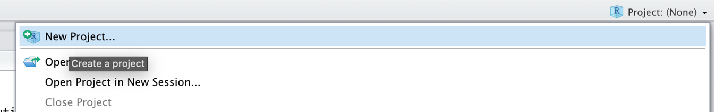
```

Then we create a **New Directory**, a new folder on our computer, which will become the working directory of the project.

```{r, message = F, out.width = '45%', echo = F, fig.align='center'}
library(OpenImageR)
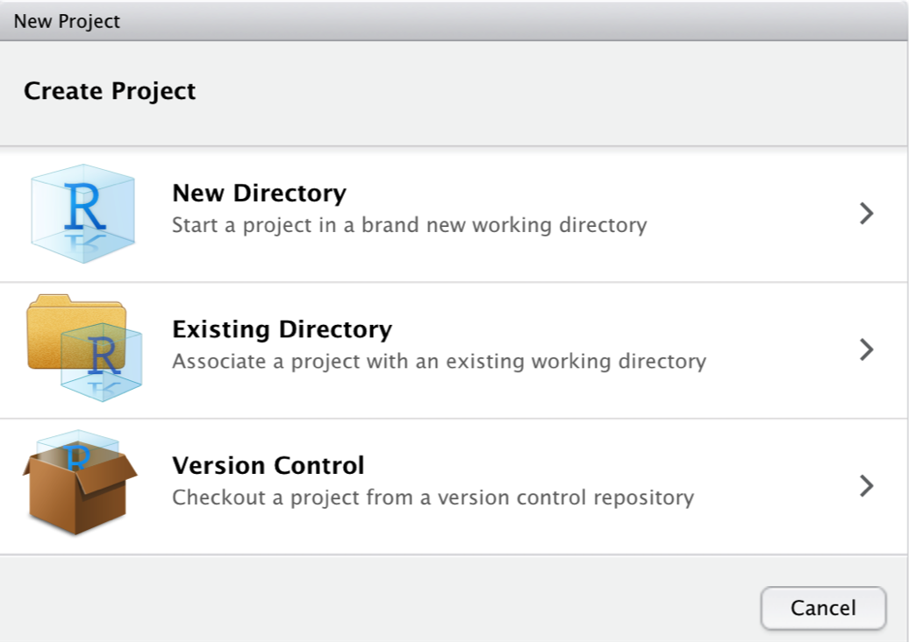
```


Then, we click on **New Project**.

```{r, message = F, out.width = '45%', echo = F, fig.align='center'}
library(OpenImageR)
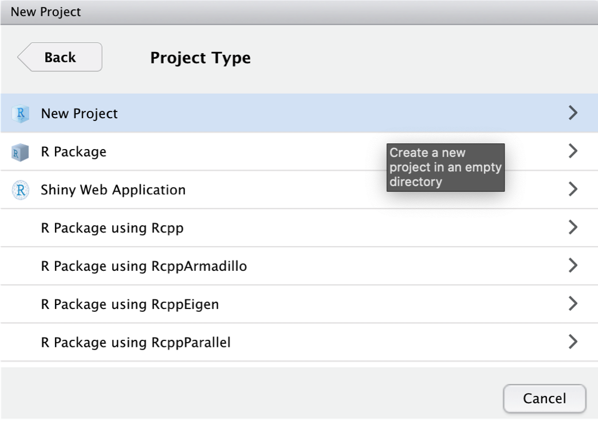
```

We give our new project the name "Meta-Analysis Project". The project folder will be stored in **~Documents/R**.

```{r, message = F, out.width = '45%', echo = F, fig.align='center'}
library(OpenImageR)
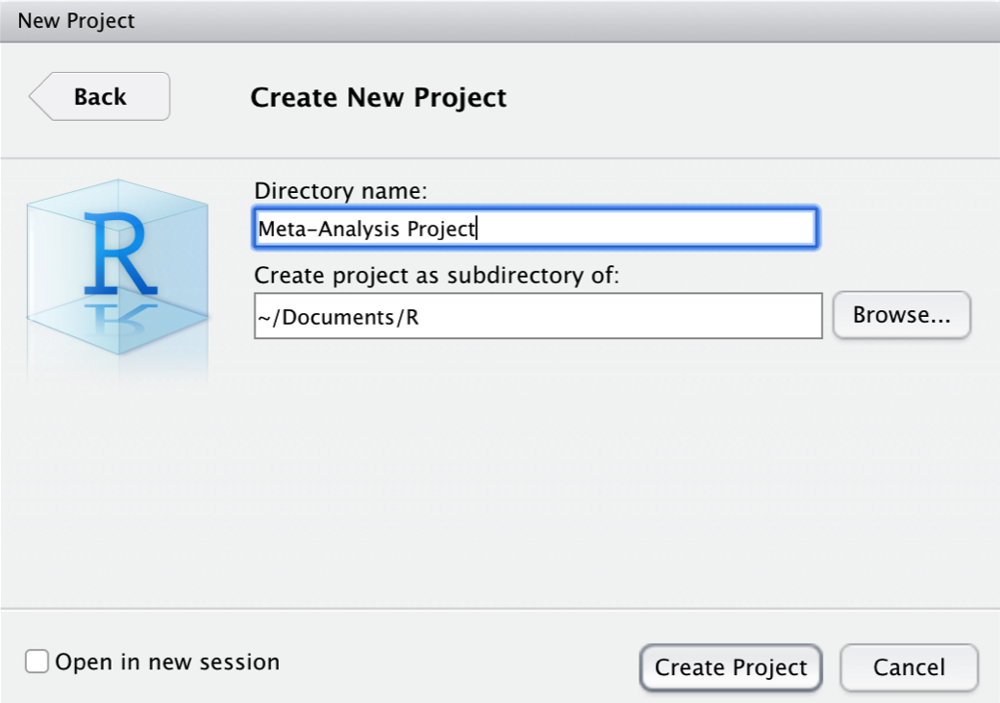
```

After clicking on **Create Project**, the _R_ project is set. A great feature of _R_ projects is that we do not have to use **absolute paths** to the files we want to reference. We only use the file name, or, if the file is in a (sub-)folder, the folder and file name. Suppose that we stored our data set **data.xlsx** in the sub-folder "data". Using the **{openxlsx}** package (Chapter \@ref(data-prep-R)), we can import the data set with a relative path.

```{r, eval=F}
read_excel("data/data.xlsx")
```

<br></br>

## Writing Reproducible Reports with R Markdown

---

\index{Markdown, _R_}

**Markdown** is a simple markup language for text formatting. **R Markdown** [@xie2018r] is an extension of Markdown and makes it easy to combine plain text, _R_ code, and _R_ output in one document. This makes R Markdown an extremely helpful reporting tool. Using R Markdown, we can create HTML or PDF files containing all code used in our analyses, the output produced by the code, and can add detailed information on what we did in each analysis step. 

It is very easy to build R Markdown files in R Studio. We only have to click on the white symbol with the green "plus" sign in the top left corner of the R Studio window. Then, in the drop-down menu, we click on **R Markdown...**.

\vspace{2mm}

```{r, message = F, out.width = '35%', echo = F, fig.align='center'}
library(OpenImageR)
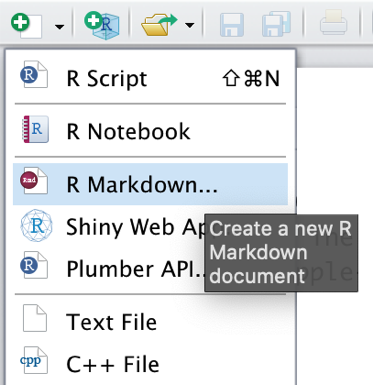
```

\vspace{2mm}

After defining the name of the new R Markdown document, it should pop up in the upper-left corner of the R Studio window.

\vspace{2mm}

```{r, message = F, out.width = '55%', echo = F, fig.align='center'}
library(OpenImageR)
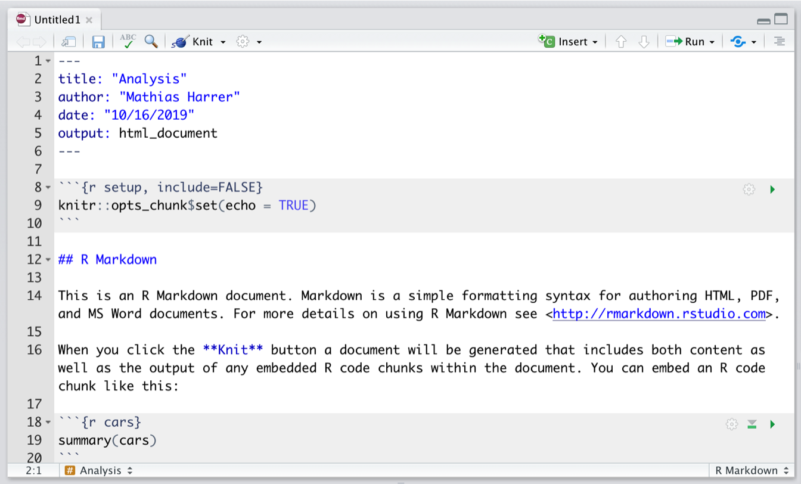
```
\vspace{2mm}

The file already contains some exemplary content, which we can delete, except for the first six lines:

```
---
title: "Analysis"
author: "Author Name"
date: "10/16/2020"
output: html_document
---
```

This part is the so-called **YAML** header. It controls the title, author, date, and export format of the document. The output format we chose for our document is `html_document`, meaning that the document will be exported as an HTML page once it is rendered. 

All _R Markdown documents_ consist of two parts: plain Markdown text, and so-called **R chunks**, shown in grey. We will not go into detail how the text parts in the R Markdown document are formatted, but there is an online [cheat sheet](https://rstudio.com/wp-content/uploads/2015/02/rmarkdown-cheatsheet.pdf), which is a great resource to start learning Markdown syntax (this should only take about twenty minutes). The _R_ code chunks, on the other hand, simply contain all the code we would usually type into the console. By clicking on the **Insert** field in the upper right corner of the document, we can add new code chunks. The code can be run by clicking on the little green triangle above each chunk.

\vspace{2mm}

```{r, message = F, out.width = '25%', echo = F, fig.align='center'}
library(OpenImageR)
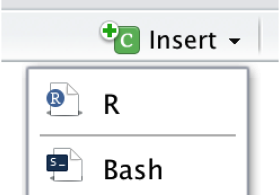
```
\vspace{2mm}

Once we are finished writing our document, we can export it as an HTML, PDF, or MS Word document by clicking on the **Knit** symbol in the upper left corner. This renders the document, including all text, code, and output, and exports it in the defined format. The final document is automatically saved in our project folder.

\vspace{2mm}

```{r, message = F, out.width = '40%', echo = F, fig.align='center'}
library(OpenImageR)
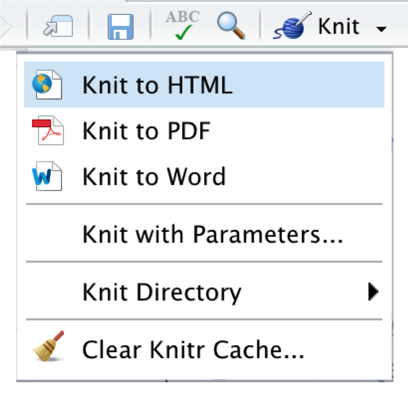
```

<br></br>

## OSF Repositories {#osf}

---

\index{Open Science Framework (OSF)}

The **Open Science Framework** ([OSF](https://www.osf.io)) is an open-source online platform to facilitate collaboration and reproducibility in research. The OSF includes an online **repository**, where researchers deposit their study material to collaborate and make all steps of the research process (more) transparent. The OSF is a spearhead of the open science movement, which has gathered much momentum in the last decade. 

It is encouraged that all meta-analysts make their research and analysis process transparent to the public, by providing open access to the collected data and _R_ code used for their analyses. The OSF is a great tool to do this--all repositories you created for yourself are private by default, and it is up to you to decide if, when, and what you want to make public. In the following, we will show you how to set up an OSF repository in _R_, upload and download files, and how to add collaborators.

<br></br>

### Access Token

---

To start using the OSF, we first have to create a personal account on the [website](https://osf.io/register). After the account has been created, we also have to generate an **access token** so that we can manipulate our repository directly using _R_. To get the access token, we have to navigate to **Profile** > **Settings** > **Personal access tokens**. There, we click on **Create token**.

\vspace{4mm}

```{r, message = F, out.width = '60%', echo = F, fig.align='center'}
library(OpenImageR)
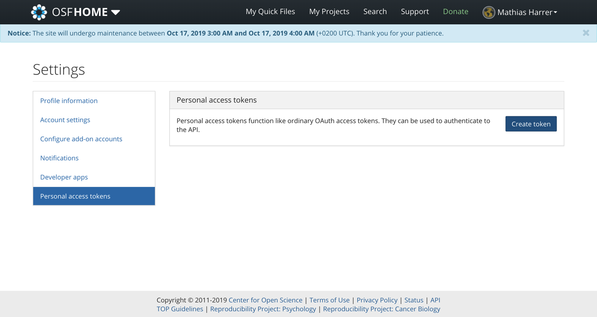
```

\vspace{4mm}

Then, under **Scopes**, we check all boxes, and click on **Create token** again. After that, our personal access token should appear. We copy the token and save it for later.

\vspace{4mm}

```{r, message = F, out.width = '60%', echo = F, fig.align='center'}
library(OpenImageR)
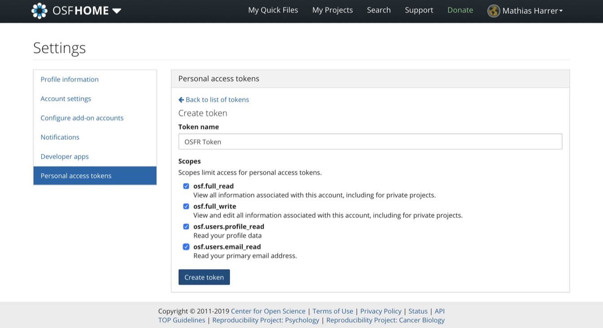
```

<br></br>

### The **{osfr}** Package & Authentication

---

To access our OSF repository directly via _R_, we can use the **{osfr}** package [@osfr]. Before we can use the functionality of this package, we first have to use our access token to authenticate. To do this, we use the `osf_auth` function, providing it with the access token we just received (the token displayed below is made up):

```{r, eval=F}
library(osfr)
osf_auth("AtmuMZ3pSuS7tceSMz2NNSAmVDNTzpm2Ud87")
```


<br></br>

### Repository Setup

---

Using **{osfr}**, we can now initialize an OSF repository using _R_. Imagine that we are working on a new meta-analysis project, and that we want to upload our data as well as an R Markdown script to an OSF repository. The name of the repository should be "Meta-Analysis Project". 

To create a new repository, the `osf_create_project` function can be used. We save the new OSF repository in _R_ as `meta_analysis_project`.

\vspace{2mm}

```{r, eval=F}
meta_analysis_project <- osf_create_project("Meta-Analysis Project")
```


Using the `osf_open` function, we can then access the newly created repository online:

\vspace{2mm}

```{r, eval=F}
osf_open(meta_analysis_project)
```


```{r, message = F, out.width = '60%', echo = F, fig.align='center'}
library(OpenImageR)
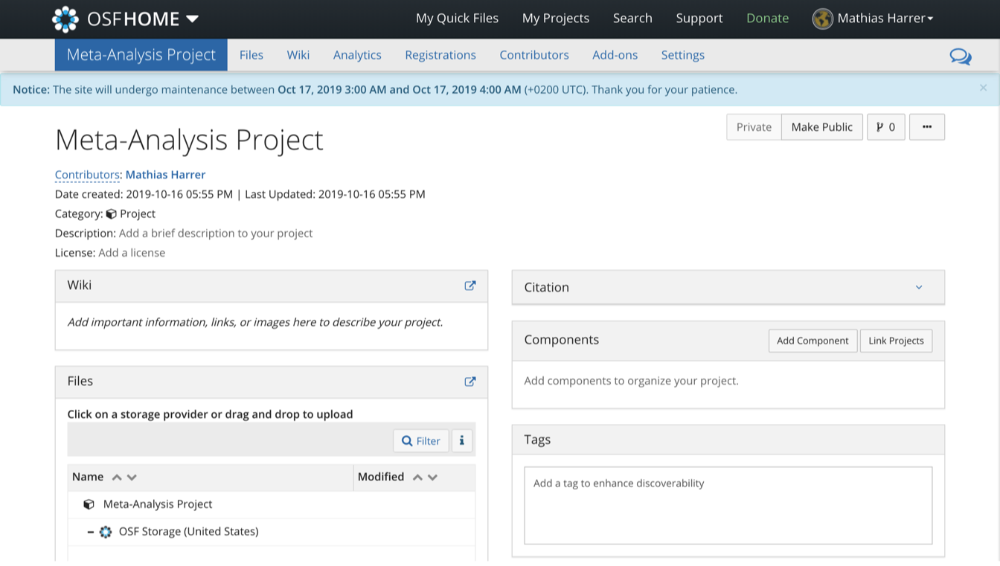
```


Now that the repository has been created, we can proceed by adding **components** to it. In OSF, components work like folders on a computer. Suppose we want to create two components: one for our data sets, and one for our R Markdown scripts. To do this, we can use the `osf_create_component` function. We have to provide the function with the _R_ repository object (`meta_analysis_project`), and then set the title of the new component. 

```{r, eval=F}
scripts <- osf_create_component(meta_analysis_project, 
                                title = "Analysis Scripts")
datasets <- osf_create_component(meta_analysis_project, 
                                 title = "Datasets")
```

When we go to the online page of the repository now, we see that the two components have been added.


<br></br>

### Upload & Download

---

To upload data to the OSF repository, we can use the `osf_upload` function. The function requires us to specify the component to which we want to add the file, and the path to the file that should be uploaded. Suppose that we want to upload an R Markdown script called “Analysis.rmd”, which is currently saved in our _R_ project sub-folder "scripts". To upload, we can use the following code:

```{r, eval = F}
osf_upload(scripts, "scripts/Analysis.rmd")
```

To see if the file has been uploaded successfully, we can access contents of the component using the `osf_ls_files` function.

```{r, eval=F}
osf_ls_files(scripts)
```

```
## # A tibble: 2 x 3
##   name            id                       meta            
##   <chr>           <chr>                    <list>          
## 1 Analysis.rmd    1db74s7bfcf91f0012567572l <named list [3]>
```

We see in the output that the upload was successful. To download a file, we can select a row from the `osf_ls_files` function output, and use it in the `osf_download` function to download the file back into the project folder on our computer.

```{r, eval = F}
osf_download(osf_ls_files(scripts)[1,])
```

<br></br>

### Collaboration, Open Access & Pre-Registration {#pre-registration}

---

\index{Preregistration}

On the OSF repository website, we can also add collaborators under the **Contributors** field.


```{r, message = F, out.width = '65%', echo = F, fig.align='center'}
library(OpenImageR)
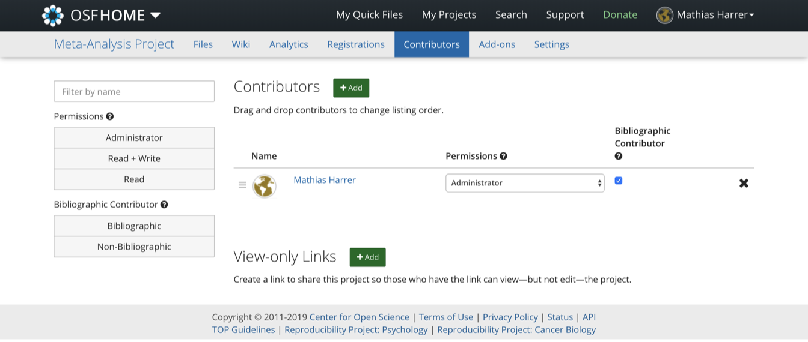
```

At any time, it is possible to make the repository **public** by clicking on the **Make Public** button in the upper right corner of the website.

```{r, message = F, out.width = '40%', echo = F, fig.align='center'}
library(OpenImageR)
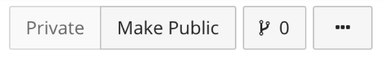
```

In Chapter \@ref(analysis-plan), we discussed that analysis plans and pre-registration are essential parts of a high-quality meta-analysis. The OSF makes it very convenient to also create an openly accessible pre-registration for our project. We simply have to click on the **Registrations** button on top, and then create a **New registration**. This leads us to the **OSF Registries** website, where we can provide detailed information on our planned study, including our analysis plan. 

\vspace{2mm}

```{r, message = F, out.width = '57%', echo = F, fig.align='center'}
library(OpenImageR)
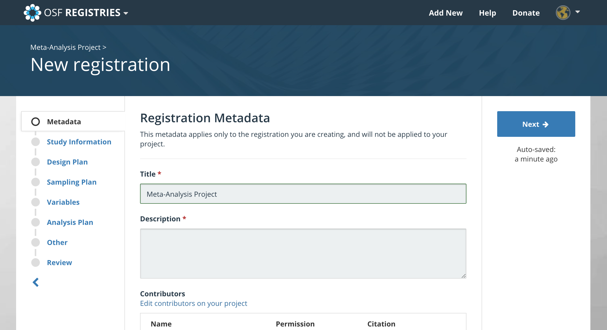
```

After specifying all the required details, the study can be registered. This creates a register entry that can be accessed through a unique ID (e.g. **osf.io/q2jp7**). After the registration is completed, it is not possible to change the stated search plan, hypotheses and/or analysis strategy anymore.


$$\tag*{$\blacksquare$}$$
